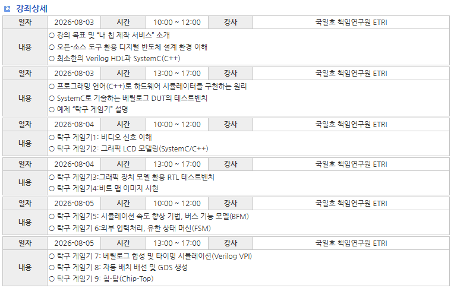

# Open Source 활용 Mychip 제작

> **My Chip on My Desk** — 오픈소스 EDA 도구만으로 RTL부터 MPW 제출용 GDS까지
>
> 날짜: 2026-07-08 → 2026-08-05 · 작성: 박규호 · 상태: In Progress

본 프로젝트는 IDEC의 **"오픈 소스 도구 활용 내 칩 설계 및 제작"** 가이드라인에 따라, 내 칩을 내 책상 위에서 설계하고 검증 및 테스트를 수행할 수 있는 역량을 갖추는 것을 목표로 한다. 기본적으로 Verilog HDL을 활용하여 디지털 회로를 설계하며, SystemC(C++)로 시스템 수준의 검증 기법을 익힌다. 이후, 주어진 예제(**탁구 게임기, Pong**)에 맞는 RTL 및 시스템 수준의 검증과 최종적으로 "내 칩 제작 서비스"의 MPW에 제출 가능한 **GDS 생성**까지 디지털 반도체 설계의 전 과정을 다룬다.

- **원본 킷**: https://github.com/GoodKook/ETRI-0.5um-CMOS-MPW-Std-Cell-DK
- **본 저장소**: https://github.com/Gyu-278/My_Chip_RTL-to-GDS
- **가이드라인**: https://fun-teaching-goodkook.blogspot.com/2025/12/20-wsl.html
- **IDEC**: https://www.idec.or.kr/edu/apply/view/?&type=list&no=2613
- **환경**: 서버 `Turtle` (Rocky Linux 8.10), conda env `chip-eda`



괜찮은 강좌라 생각이 들어서, 전체적으로 한번 프로젝트를 수행해보며 공부해보고자 한다.

---

## 📘 Progress (정리 노트)

| # | 문서 | 내용 |
|---|---|---|
| 1 | [환경 Setting](notes/1-environment-setup.md) | 오픈소스 EDA 툴체인을 conda env에 구축 (Yosys/GrayWolf/QRouter/Magic/QFlow…) |
| 2 | [Example Template (Verilog/SystemC)](notes/2-verilog-systemc-basics.md) | 최소 Verilog + SystemC, 델타 사이클, FF vs Latch |
| 3 | [RTL / LCD Graphic Example](notes/3-rtl-lcd-graphic.md) | 래스터 스캔 RTL, KS0108 GLCD 모델링, RTL+GLCD 결합 |
| 4 | [BFM / TLM / FSM](notes/4-bfm-tlm-fsm.md) | 트랜잭션 레벨 모델링으로 시뮬 가속, 패들·외부입력 FSM |
| 5 | [Synthesis / GDS / Chip-top](notes/5-synthesis-gds-chiptop.md) | 합성 → 타이밍시뮬(VPI) → 배치·배선 → DRC/LVS → GDS |

---

## 🗂️ 저장소 구조

```
My_Chip_RTL-to-GDS/
├── README.md                  # 이 문서 (프로젝트 개요)
├── notes/                     # 단계별 정리 노트 (Notion export)
├── ATTRIBUTION.md             # 출처 (GoodKook / CC BY-NC)
└── work/                      # 직접 copy·수정하며 연습한 예제 소스
    ├── systemc_basics/        #   1일차: dff, ex1~3, dffrs
    ├── 01_Table ~ 06_*        #   2일차: 탁구 게임 RTL 시뮬 (래스터→GLCD→공→패들)
    └── pong_pt1/              #   3일차: 백엔드 (RTL, SystemC/VPI TB, APR 설정)
```

> 예제 소스는 원본 킷([GoodKook/ETRI-0.5um-…](https://github.com/GoodKook/ETRI-0.5um-CMOS-MPW-Std-Cell-DK))을
> 복사·수정한 것이며, 비상업적 학습 용도로 원본의 CC BY-NC 라이선스를 따른다. 자세한 출처는 [ATTRIBUTION.md](ATTRIBUTION.md) 참고.

## 🔧 실행 환경 (요약)

```bash
# conda env 'chip-eda' 활성화 (다른 env 누수 없이)
source scripts/activate-chip-eda.sh    # (로컬 전용 헬퍼)
# RTL 시뮬 예: make <target> SYSTEMC=$CONDA_PREFIX
# 백엔드: cd work/pong_pt1/ETRI050 && make synthesize → place → route → migrate → lvs
```

---

*RTL → 합성 → APR → DRC/LVS clean 코어 GDS 까지 오픈소스만으로 완주. Chip-Top(패드 배선)은 진행 예정.*
