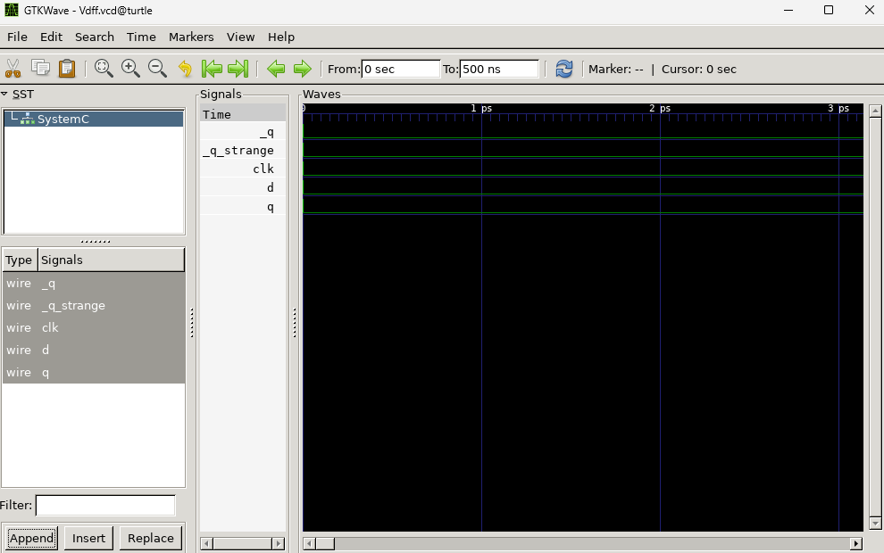
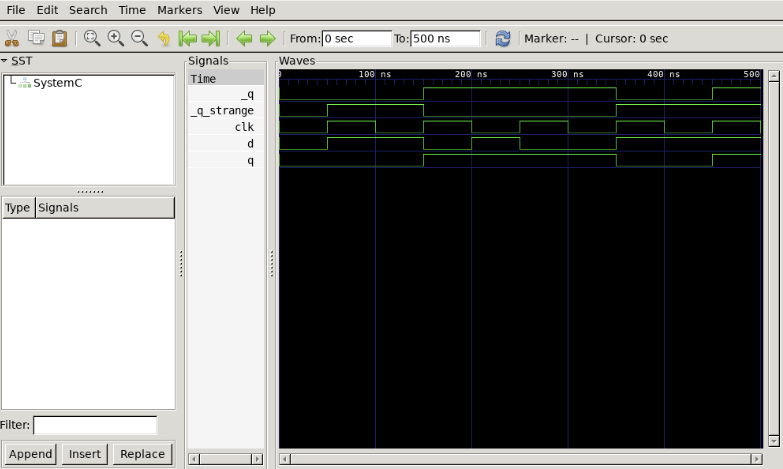
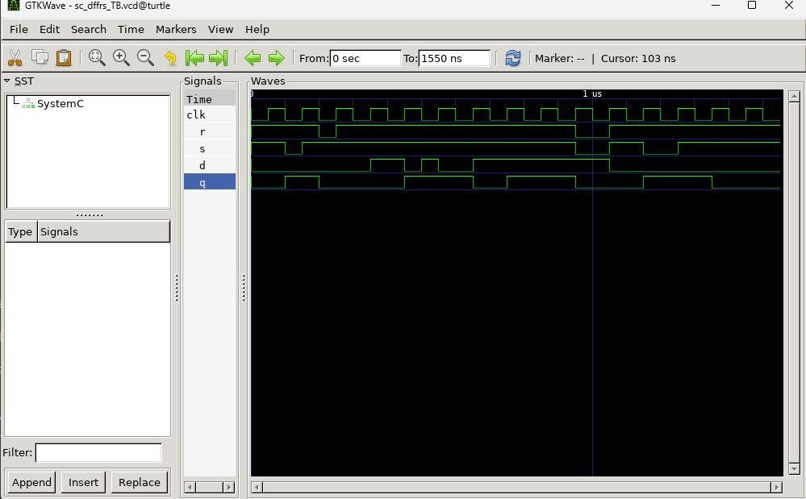

# Example Template(Verilog/System C)

## Example 1.

### Step 1. Conda 환경 Setting

먼저, conda 환경을 앞서 Setting 한 것에 맞게 변경한다. 

```bash
(base) pgh@turtle:~/project/PGH_Chip_Open_Source$ conda activate chip-eda
(chip-eda) pgh@turtle:~/project/PGH_Chip_Open_Source$ 
```

이후, 예제의 경로에 들어간다.

```bash
(chip-eda) pgh@turtle:~/project/PGH_Chip_Open_Source/scripts$ cd ..
(chip-eda) pgh@turtle:~/project/PGH_Chip_Open_Source$ ls
build  docs  ETRI-0.5um-CMOS-MPW-Std-Cell-DK  scripts
(chip-eda) pgh@turtle:~/project/PGH_Chip_Open_Source$ cd ~/ETRI050_DesignKit/Tutorials_New
(chip-eda) pgh@turtle:~/ETRI050_DesignKit/Tutorials_New$ ls
2-1_Verilog_SystemC_in_a_Day  2-2_RTL_Coding_Style_D-FF  2-3_Behavioral_Shifter  3-1_FIR8  3-2_FIR8_c_untimed_Arduino  3-3_FIR8_c_untimed_Vitis-HLS  3-4_FIR8_rtl_Emulation  3-5_FIR8_rtl_ETRI050  4-1_FIR_PE  4-2_FIR_PE_Lab  4-3_FIR_PE_Chip_Test  4-3_FIR_PE_MPW240925002  4-5_FIR_PE_Vitis-HLS  7-1_Vitis-HLS_basic_loops  7-2_Vitis-HLS_Clock
(chip-eda) pgh@turtle:~/ETRI050_DesignKit/Tutorials_New$ cd 2-1_Verilog_SystemC_in_a_Day/ex1_template_class
```

실행한다.

### Step 2. 결과 확인

해당 과정에서 활용한 예제 코드는 아래와 같다.

- `templated_class.cpp`
    
    ```cpp
    //
    // Filename: templated_class.cpp
    //      Simple example for Templated Class
    //
    // Compile: gcc -o templated_class templated_class.cpp -lm
    //
    #include <stdio.h>
    #include <string.h>
    #include <math.h>
    
    // Ex1. --------------------------------------------------------
    template <typename T>
    class complex_t
    {
        T image;
        T real;
    
        public:
        complex_t(int x, int y) // Constructor
        {
            image = x;
            real = y;
        }
    
        // Member functions for Accessing privates
        T get_real()
        {
            return real;
        }
    
        T get_image()
        {
            return image;
        }
    
        T conjugate()
        {
            return((real*real)-(image*image));
        }
    
        T Power()
        {
            return (sqrt(abs(conjugate())));
        }
    };
    
    // Ex1. --------------------------------------------------------
    template <u_int N>
    class bit_vector_t
    {
        bool m_next_val[N];
        bool m_curr_val[N];
        int  nLen;
    
        char m_sz_val[N+1];
    
        public:
        bit_vector_t():nLen((int)N)
        {
            for (int i=0; i<N; i++) m_next_val[i] = false;
            for (int i=0; i<N; i++) m_curr_val[i] = false;
        }
    
        bit_vector_t(const char* szVal):nLen((int)N)
        {
            write(szVal);
        }
    
        void update(void)
        {
            m_curr_val = m_next_val;
        }
    
        bool notyfy_event()
        {
            if (m_curr_val != m_next_val)   return true;
            else                            return false;
        }
        
        char* to_string()
        {
            for (int i=0; i<(int)N; i++)
                if (m_curr_val[i])  m_sz_val[i] = '1';
                else                m_sz_val[i] = '0';
    
            m_sz_val[N] = '\0';
            return m_sz_val;
        }
    
        void write(const char* szVal)
        {
            if ((int)strlen(szVal)!=nLen)
            {
                fprintf(stderr, "Bit Vector NOT match!\n");
                return;
            }
            for (int i=0; i<strlen(szVal); i++)
                if (szVal[i]=='1')  m_curr_val[i] = true;
                else                m_curr_val[i] = false;
        }
    
        int length()
        {
            return nLen;
        }
    
        // overload the | operator
        friend bit_vector_t operator | (const bit_vector_t& obj1, const bit_vector_t& obj2)
        {
            bit_vector_t<N> Temp;
    
            for (int i=0; i<N; i++)
                Temp.m_curr_val[i] = obj1.m_curr_val[i] | obj2.m_curr_val[i];
            return Temp;
        }
        // overload the & operator
        friend bit_vector_t operator & (const bit_vector_t& obj1, const bit_vector_t& obj2)
        {
            bit_vector_t<N> Temp;
    
            for (int i=0; i<N; i++)
                Temp.m_curr_val[i] = obj1.m_curr_val[i] & obj2.m_curr_val[i];
            return Temp;
        }
    };
    
    int main()
    {
        // Ex.1 ----------------------------------------------------------------
        complex_t<float>    x( 1, 2);
        complex_t<int>      y( 3, 4);
    
        printf("Float: Re=%f Im=%f\n", x.get_real(), x.get_image());
        printf("Int. : Re=%d Im=%d\n", y.get_real(), y.get_image());
        printf("\t[Conjugate] Float:%f Int.:%d\n", x.conjugate(), y.conjugate());
        printf("\t    [Power] Float:%f Int.:%d\n", x.Power(), y.Power());
    
        // Ex.2 ----------------------------------------------------------------
        bit_vector_t<10>    bvX("1010101010");
        bit_vector_t<10>    bvY("0101010101");
        bit_vector_t<10>    bvZ;
    
        bvZ = bvX | bvY;
        printf("%s | %s = %s\n", bvX.to_string(), bvY.to_string(), bvZ.to_string());
    
        bvX = "111110000";
        bvY.write("000110001");
    
        bvX = "1111100000";
        bvY.write("0001100011");
        bvZ = bvX & bvY;
        printf("%s & %s = %s\n", bvX.to_string(), bvY.to_string(), bvZ.to_string());
    
        return 0;
    }
    
    ```
    
- `Complex_t`
    - `omplex_t`는 수학의 복소수(Complex Number)를 C++ 클래스로 만들어본 것
    - 복소수는 실수부(Real)와 허수부(Imaginary)로 이루어짐. 예를 들어 $3 + 4i$ 같은 형태.
    - 이 클래스는 내부에 `real`(실수)과 `image`(허수)라는 데이터를 저장하는 공간을 가지고 있음.
    - `conjugate()`(켤레복소수 구하기)나 `Power()`(복소수의 크기 구하기) 같은 수학 계산 기능을 제공
- Delta Cycle
    
    소프트웨어의 경우, 순차적으로 실행하나 하드웨어는 병렬적으로 작동함. 따라서, 하드웨어적인 방식을 C++로 흉내 내기 위해 만든 꼼수가 바로 `m_curr_val`(현재 값)과 `m_next_val`(다음 값)을 나누는 것.
    
    - **계산 단계:** 모든 회로(함수)들이 연산을 할 때는 오직 `m_curr_val`(현재 값)만 읽어서 계산합니다. 그리고 그 결과는 무조건 `m_next_val`(다음 값)에만 적어둡니다. (이때는 현재 값이 변하지 않으므로, 순서가 꼬이지 않습니다.)
    - **반영 단계 (`update`):** 모든 계산이 끝나면, 시뮬레이터가 `update()`를 호출하여 일제히 `m_next_val`의 데이터를 `m_curr_val`로 덮어씌웁니다.
    - **알림 단계 (`notyfy_event`):** 덮어씌운 후, 이전 값과 비교해 값이 변했다면 "나 값 바뀌었어!"라고 이벤트를 발생시킵니다. 그러면 이 신호와 연결된 다음 부품들이 깨어나서 다시 연산을 시작합니다.

```c
// 실행
(chip-eda) pgh@turtle:~/ETRI050_DesignKit/Tutorials_New/2-1_Verilog_SystemC_in_a_Day/ex1_template_class$ g++ -o templated_class templated_class.cpp -lm
(chip-eda) pgh@turtle:~/ETRI050_DesignKit/Tutorials_New/2-1_Verilog_SystemC_in_a_Day/ex1_template_class$ ./templated_class
/*
    // Ex.1 ----------------------------------------------------------------
    complex_t<float>    x( 1, 2);
    complex_t<int>      y( 3, 4);

    printf("Float: Re=%f Im=%f\n", x.get_real(), x.get_image());
    printf("Int. : Re=%d Im=%d\n", y.get_real(), y.get_image());
    printf("\t[Conjugate] Float:%f Int.:%d\n", x.conjugate(), y.conjugate());
    printf("\t    [Power] Float:%f Int.:%d\n", x.Power(), y.Power());
*/

Float: Re=2.000000 Im=1.000000
Int. : Re=4 Im=3
        [Conjugate] Float:3.000000 Int.:7
            [Power] Float:1.732051 Int.:2
            
            
/*
    // Ex.2 ----------------------------------------------------------------
    bit_vector_t<10>    bvX("1010101010");
    bit_vector_t<10>    bvY("0101010101");
    bit_vector_t<10>    bvZ;

    bvZ = bvX | bvY;
    printf("%s | %s = %s\n", bvX.to_string(), bvY.to_string(), bvZ.to_string());

    bvX = "111110000";
    bvY.write("000110001");

    bvX = "1111100000";
    bvY.write("0001100011");
    bvZ = bvX & bvY;
    printf("%s & %s = %s\n", bvX.to_string(), bvY.to_string(), bvZ.to_string());
*/
1010101010 | 0101010101 = 1111111111
Bit Vector NOT match!
Bit Vector NOT match!
1111100000 & 0001100011 = 0001100000
```

- 결과 (Ex.1)
    - 일반적으로 보통 코드를 짤 때 `complex_t x(1, 2);` 라고 적으면, 당연히 **앞의 1이 실수(Real)이고 뒤의 2가 허수(Image)일 것**이라고 기대함,
    - **실제 코드의 동작:** `complex_t(1, 2)` -> 인자 `x`로 들어온 1을 `image`에 넣고, 인자 `y`로 들어온 2를 `real`에 넣음.
    - 이 때문에 `main()` 함수에서 `complex_t<float> x(1, 2);`를 만들고 값을 출력해 보면, 예상과 반대로 **Re=2, Im=1**이라고 뒤집혀서 출력
    - 항상, SystemC로 하드웨어를 설계할 때 갖춰야 할 데이터 연결에 대한 꼼꼼해야함.
    - 한편, 같은 Power()인데 float은 sqrt(3)=1.732을 반환, int는 2. sqrt(7)=2.645이나 Data Type이 int라서 2로 잘려나감. 즉, 이와 같이 타입의 경우 하드웨어의 비트폭과 같다고 생각 가능.
- 결과 (Ex.2)
    - 첫 번째 줄: OR 연산 (`|`)
        
        `1010101010 | 0101010101 = 1111111111`
        
        - 처음에 `bvX`와 `bvY`를 각각 `1010101010`과 `0101010101`로 만듦.
        - `bvZ = bvX | bvY;`를 실행하면 클래스 안에 미리 만들어 둔 `|` 연산자(operator) 함수가 작동.
            
            ```c
                // overload the | operator
                friend bit_vector_t operator | (const bit_vector_t& obj1, const bit_vector_t& obj2)
                {
                    bit_vector_t<N> Temp;
            
                    for (int i=0; i<N; i++)
                        Temp.m_curr_val[i] = obj1.m_curr_val[i] | obj2.m_curr_val[i];
                    return Temp;
                }
            ```
            
        - 각 자리수별로 OR 연산(둘 중 하나라도 1이면 1)을 수행하니까, 지퍼가 맞물리듯 모든 자리가 1이 되어 `1111111111`이 출력
    - 두 번째 & 세 번째 줄: 사이즈 불일치 에러
        - `bvX = "111110000";`
        - `bvY.write("000110001");`
        - 위 두 줄을 실행함에 따라 두번 에러가 발생.
        
        ```c
        if ((int)strlen(szVal) != nLen) {
            fprintf(stderr, "Bit Vector NOT match!\n");
            return;
        }
        ```
        
        - 처음에 `bit_vector_t<10>`이라고 10가닥의 전선(10비트)을 선언해 두었는데, 9가닥짜리 데이터를 억지로 쑤셔 넣으려고 하니까 거부하며 에러 메시지를 두 번 뱉어낸 것. **소프트웨어와 달리 하드웨어에서는 핀(Pin)의 개수가 정확히 맞지 않으면 아예 연결조차 되지 않는다**는 것을 소프트웨어적으로 흉내 낸 것.
    - 네 번째 줄: AND 연산 (`&`)
        
        `1111100000 & 0001100011 = 0001100000`
        
        - 에러가 났던 위 코드 바로 다음 줄을 보면, `bvX = "1111100000";` (10자리)와 `bvY.write("0001100011");` (10자리)로 **정상적인 10자리 데이터**를 다시 집어넣음
            
            ```c
                // overload the & operator
                friend bit_vector_t operator & (const bit_vector_t& obj1, const bit_vector_t& obj2)
                {
                    bit_vector_t<N> Temp;
            
                    for (int i=0; i<N; i++)
                        Temp.m_curr_val[i] = obj1.m_curr_val[i] & obj2.m_curr_val[i];
                    return Temp;
                }
            ```
            
        - 이번에는 사이즈가 맞아서 에러 없이 통과했고, `bvZ = bvX & bvY;`를 통해 AND 연산(둘 다 1일 때만 1)을 수행.
- Delta Cycle
    
    ```cpp
    bool m_next_val[N];      // 다음 값
    bool m_curr_val[N];      // 현재 값
    void update(void);       // next → curr 로 옮김
    bool notyfy_event();     // 값이 바뀌었나?
    ```
    
    - 현재값/다음값을 따로 들고, update()로 한꺼번에 반영하고, 바뀌면 이벤트를 알리는 방식.
    - 해당 방식이 SystemC sc_signal의 전부이자, 델타 사이클의 정의임.

## Example 2. Delta Cycle

활용한 코드는 아래와 같다.

- **`sc_delta_cycle.h`**
    
    ```cpp
    /*********************************************************
     * Filename: sc_delta_cycle.h
     * Purpose: SystemC model Test (d)
     * Author: GoodKook, goodkook@gmail.com
     */
    #ifndef _SC_DELTA_CYCLE_H_
    #define _SC_DELTA_CYCLE_H_
    
    #include <systemc.h>
    
     SC_MODULE(sc_delta_cycle)
     {
        // IO Ports
        sc_in<bool>     clk, b, c, d;
        sc_out<bool>    q;
    
    #if defined(CHANNEL)
        sc_signal<bool> a, e;   // Local Channels
    #elif defined (VARIABLE)
        bool a, e;   // Variable
    #endif
    
        SC_CTOR(sc_delta_cycle):    // constructor
            clk("clk"), d("d"), q("q")
        {
            SC_METHOD(behavior);
    #if defined(CHANNEL)
            sensitive << a << b << c << d << e << clk;
    #elif defined(VARIABLE)
            sensitive << b << c << d << clk;
    #endif
        }
    
        void behavior(void)
        {
            printf("\n[%03d] clk=%c b=%c c=%c a=%c d=%c e=%c q=%c",
                (int)(sc_time_stamp()).to_double()/1000,
                clk? '1':'0',
                b? '1':'0',
                c? '1':'0',
                a? '1':'0',
                d? '1':'0',
                e? '1':'0',
                q? '1':'0'
            );
    
    #if defined(FORWARD_ORDERED)
            a = !(b & c);
            e = !(a & d);
            if (clk)
                q = e;
    #elif defined(REVERSE_ORDERED)
            if (clk)
                q = e;
            e = !(a & d);
            a = !(b & c);
    #else
            e = !(a & d);
            if (clk.posedge())
                q = e;
            a = !(b & c);
    #endif
        }
    };
    
     #endif
    
    ```
    

### Step 1. 기본 구조 확인

```c
// sc_delta_cycle.h

b ──┐
    NAND ── a ──┐
c ──┘           NAND ── e ──[clk일 때]── q
          d ────┘

a = !(b & c);
e = !(a & d);
if (clk) q = e;
```

- 두 개의 축으로 실험
    
    
    | 축 | 옵션 | 의미 |
    | --- | --- | --- |
    | `TYPE` | `CHANNEL` | `a`, `e`가 **`sc_signal<bool>`** (현재값/다음값 분리) |
    |  | `VARIABLE` | `a`, `e`가 **그냥 `bool`** (즉시 반영) |
    | `ORDER` | `FORWARD` | `a` 계산 → `e` 계산 → `q` |
    |  | `REVERSE` | `q` → `e` → `a` (**문장 순서만 거꾸로**)
    (단, 제대로 된 값들어올 때 까지 멈춤) |
- 규칙
    
    **`sc_signal` (CHANNEL)의 규칙**
    
    - `a = ...` 를 써도 **즉시 안 바뀜.** 다음 **델타 사이클**에 반영 (= ex1의 `m_next_val` → `update()`)
    - 값이 바뀌면 **이벤트 발생** → `a`,`e`가 감도리스트에 있으니 `behavior()`가 **다시 호출됨**
    - 이게 안정될 때까지 반복 (= 회로가 "정착"하는 과정)
    - `REVERSE`: 신호 흐름을 거꾸로 짠 나쁜 코딩 습관. 하지만 `sc_signal`을 쓰면 시뮬레이터가 델타 사이클을 돌려 멱살 잡고 캐리(정답 복구)해 줌.
    
    **`bool` (VARIABLE)의 규칙**
    
    - `a = ...` 하면 **그 줄에서 즉시 바뀜** (평범한 C++ 변수)
    - 감도리스트에 `a`,`e`가 없으니 (bool은 이벤트가 없음) `behavior()`는 `b,c,d,clk` 바뀔 때만 호출
    - 따라서 **한 번 호출에 문장 순서대로 딱 한 번씩만** 계산됨
- 결과 예상 1.
    
    `a = !(b & c)` , `e = !(a & d)` : **"이상적인 하드웨어"의 정답값**이야.
    
    | b (**주어짐**) | c (**주어짐**) | d (**주어짐**) | a (**예상**) | e (**예상**) |
    | --- | --- | --- | --- | --- |
    | **0** | **0** | **0** | 1 | 1 |
    | **1** | **1** | **0** | 0 | 1 |
    | **0** | **0** | **1** | 1 | 0 |
    | **1** | **1** | **1** | 0 | 1 |
- 결과 예상 2.
    
    
    | 질문 | CHANNEL (`sc_signal`) | VARIABLE (`bool`) |
    | --- | --- | --- |
    | ① FORWARD와 REVERSE의 출력이 **똑같은가?** (O/X) | **O (완전 동일)** | **X (다름)** |
    | ② `behavior()` 호출 횟수(출력 줄 수)가 **더 많은 쪽**? (많음/적음) | **37줄 (많음)** | **31줄 (적음)** |
    | ③ 표 A의 "이상적 하드웨어" 값과 **일치하는가?** (O/X) | **O** | FORWARD만 O, REVERSE는 **X** |
- 결과 확인 (Period : 100ns, 50ns 단위로 Toggle)
    - `Channel / Forward`
        
        ```c
        (chip-eda) pgh@turtle:~/ETRI050_DesignKit/Tutorials_New/2-1_Verilog_SystemC_in_a_Day/ex2_delta_cycle$ make clean SYSTEMC=$CONDA_PREFIX
        rm -f sc_delta_cycle_TB
        rm -f *.vcd
        (chip-eda) pgh@turtle:~/ETRI050_DesignKit/Tutorials_New/2-1_Verilog_SystemC_in_a_Day/ex2_delta_cycle$ make build SYSTEMC=$CONDA_PREFIX TYPE=CHANNEL  ORDER=FORWARD  && make run SYSTEMC=$CONDA_PREFIX
        clang++ -I. -I../c_untimed -I/hai/home/pgh/.conda/envs/chip-eda/include -g -DFORWARD_ORDERED -DCHANNEL -L/hai/home/pgh/.conda/envs/chip-eda/lib \
                        -o sc_delta_cycle_TB -lsystemc sc_main.cpp
        ./sc_delta_cycle_TB
        
                SystemC 3.0.2-Accellera --- Apr  2 2026 20:35:08
                Copyright (c) 1996-2025 by all Contributors,
                ALL RIGHTS RESERVED
        
        [000] clk=1 b=0 c=0 a=0 d=0 e=0 q=0
        [000] clk=0 b=0 c=0 a=1 d=0 e=1 q=0
        Info: (I702) default timescale unit used for tracing: 1 ps (sc_delta_cycle_TB.vcd)
        
        [050] clk=1 b=0 c=0 a=1 d=0 e=1 q=0
        [100] clk=0 b=0 c=0 a=1 d=0 e=1 q=1
        [150] clk=1 b=0 c=0 a=1 d=0 e=1 q=1
        [150] clk=1 b=1 c=0 a=1 d=0 e=1 q=1
        [200] clk=0 b=1 c=0 a=1 d=0 e=1 q=1
        [250] clk=1 b=1 c=0 a=1 d=0 e=1 q=1
        [250] clk=1 b=0 c=1 a=1 d=0 e=1 q=1
        [300] clk=0 b=0 c=1 a=1 d=0 e=1 q=1
        [350] clk=1 b=0 c=1 a=1 d=0 e=1 q=1
        [350] clk=1 b=1 c=1 a=1 d=0 e=1 q=1
        [350] clk=1 b=1 c=1 a=0 d=0 e=1 q=1
        [400] clk=0 b=1 c=1 a=0 d=0 e=1 q=1
        [450] clk=1 b=1 c=1 a=0 d=0 e=1 q=1
        [450] clk=1 b=0 c=0 a=0 d=1 e=1 q=1
        [450] clk=1 b=0 c=0 a=1 d=1 e=1 q=1
        [450] clk=1 b=0 c=0 a=1 d=1 e=0 q=1
        [500] clk=0 b=0 c=0 a=1 d=1 e=0 q=0
        [550] clk=1 b=0 c=0 a=1 d=1 e=0 q=0
        [550] clk=1 b=1 c=0 a=1 d=1 e=0 q=0
        [600] clk=0 b=1 c=0 a=1 d=1 e=0 q=0
        [650] clk=1 b=1 c=0 a=1 d=1 e=0 q=0
        [650] clk=1 b=0 c=1 a=1 d=1 e=0 q=0
        [700] clk=0 b=0 c=1 a=1 d=1 e=0 q=0
        [750] clk=1 b=0 c=1 a=1 d=1 e=0 q=0
        [750] clk=1 b=1 c=1 a=1 d=1 e=0 q=0
        [750] clk=1 b=1 c=1 a=0 d=1 e=0 q=0
        [750] clk=1 b=1 c=1 a=0 d=1 e=1 q=0
        [800] clk=0 b=1 c=1 a=0 d=1 e=1 q=1
        [850] clk=1 b=1 c=1 a=0 d=1 e=1 q=1
        [850] clk=1 b=0 c=0 a=0 d=0 e=1 q=1
        [850] clk=1 b=0 c=0 a=1 d=0 e=1 q=1
        [900] clk=0 b=0 c=0 a=1 d=0 e=1 q=1
        [950] clk=1 b=0 c=0 a=1 d=0 e=1 q=1
        [1000] clk=0 b=0 c=0 a=1 d=0 e=1 q=1
        [1050] clk=1 b=0 c=0 a=1 d=0 e=1 q=1
        Info: /OSCI/SystemC: Simulation stopped by user.
        ```
        
    - `Channel / Reverse`
        
        ```c
        (chip-eda) pgh@turtle:~/ETRI050_DesignKit/Tutorials_New/2-1_Verilog_SystemC_in_a_Day/ex2_delta_cycle$ make clean SYSTEMC=$CONDA_PREFIX
        rm -f sc_delta_cycle_TB
        rm -f *.vcd
        (chip-eda) pgh@turtle:~/ETRI050_DesignKit/Tutorials_New/2-1_Verilog_SystemC_in_a_Day/ex2_delta_cycle$ make build SYSTEMC=$CONDA_PREFIX TYPE=CHANNEL  ORDER=REVERSE  && make run SYSTEMC=$CONDA_PREFIX
        clang++ -I. -I../c_untimed -I/hai/home/pgh/.conda/envs/chip-eda/include -g -DREVERSE_ORDERED -DCHANNEL -L/hai/home/pgh/.conda/envs/chip-eda/lib \
                        -o sc_delta_cycle_TB -lsystemc sc_main.cpp
        ./sc_delta_cycle_TB
        
                SystemC 3.0.2-Accellera --- Apr  2 2026 20:35:08
                Copyright (c) 1996-2025 by all Contributors,
                ALL RIGHTS RESERVED
        
        [000] clk=1 b=0 c=0 a=0 d=0 e=0 q=0
        [000] clk=0 b=0 c=0 a=1 d=0 e=1 q=0
        Info: (I702) default timescale unit used for tracing: 1 ps (sc_delta_cycle_TB.vcd)
        
        [050] clk=1 b=0 c=0 a=1 d=0 e=1 q=0
        [100] clk=0 b=0 c=0 a=1 d=0 e=1 q=1
        [150] clk=1 b=0 c=0 a=1 d=0 e=1 q=1
        [150] clk=1 b=1 c=0 a=1 d=0 e=1 q=1
        [200] clk=0 b=1 c=0 a=1 d=0 e=1 q=1
        [250] clk=1 b=1 c=0 a=1 d=0 e=1 q=1
        [250] clk=1 b=0 c=1 a=1 d=0 e=1 q=1
        [300] clk=0 b=0 c=1 a=1 d=0 e=1 q=1
        [350] clk=1 b=0 c=1 a=1 d=0 e=1 q=1
        [350] clk=1 b=1 c=1 a=1 d=0 e=1 q=1
        [350] clk=1 b=1 c=1 a=0 d=0 e=1 q=1
        [400] clk=0 b=1 c=1 a=0 d=0 e=1 q=1
        [450] clk=1 b=1 c=1 a=0 d=0 e=1 q=1
        [450] clk=1 b=0 c=0 a=0 d=1 e=1 q=1
        [450] clk=1 b=0 c=0 a=1 d=1 e=1 q=1
        [450] clk=1 b=0 c=0 a=1 d=1 e=0 q=1
        [500] clk=0 b=0 c=0 a=1 d=1 e=0 q=0
        [550] clk=1 b=0 c=0 a=1 d=1 e=0 q=0
        [550] clk=1 b=1 c=0 a=1 d=1 e=0 q=0
        [600] clk=0 b=1 c=0 a=1 d=1 e=0 q=0
        [650] clk=1 b=1 c=0 a=1 d=1 e=0 q=0
        [650] clk=1 b=0 c=1 a=1 d=1 e=0 q=0
        [700] clk=0 b=0 c=1 a=1 d=1 e=0 q=0
        [750] clk=1 b=0 c=1 a=1 d=1 e=0 q=0
        [750] clk=1 b=1 c=1 a=1 d=1 e=0 q=0
        [750] clk=1 b=1 c=1 a=0 d=1 e=0 q=0
        [750] clk=1 b=1 c=1 a=0 d=1 e=1 q=0
        [800] clk=0 b=1 c=1 a=0 d=1 e=1 q=1
        [850] clk=1 b=1 c=1 a=0 d=1 e=1 q=1
        [850] clk=1 b=0 c=0 a=0 d=0 e=1 q=1
        [850] clk=1 b=0 c=0 a=1 d=0 e=1 q=1
        [900] clk=0 b=0 c=0 a=1 d=0 e=1 q=1
        [950] clk=1 b=0 c=0 a=1 d=0 e=1 q=1
        [1000] clk=0 b=0 c=0 a=1 d=0 e=1 q=1
        [1050] clk=1 b=0 c=0 a=1 d=0 e=1 q=1
        Info: /OSCI/SystemC: Simulation stopped by user.
        ```
        
    - `Variable / Forward`
        
        ```c
        (chip-eda) pgh@turtle:~/ETRI050_DesignKit/Tutorials_New/2-1_Verilog_SystemC_in_a_Day/ex2_delta_cycle$ make clean SYSTEMC=$CONDA_PREFIX
        rm -f sc_delta_cycle_TB
        rm -f *.vcd
        (chip-eda) pgh@turtle:~/ETRI050_DesignKit/Tutorials_New/2-1_Verilog_SystemC_in_a_Day/ex2_delta_cycle$ make build SYSTEMC=$CONDA_PREFIX TYPE=VARIABLE ORDER=FORWARD  && make run SYSTEMC=$CONDA_PREFIX
        clang++ -I. -I../c_untimed -I/hai/home/pgh/.conda/envs/chip-eda/include -g -DFORWARD_ORDERED -DVARIABLE -L/hai/home/pgh/.conda/envs/chip-eda/lib \
                        -o sc_delta_cycle_TB -lsystemc sc_main.cpp
        
        ./sc_delta_cycle_TB
        
                SystemC 3.0.2-Accellera --- Apr  2 2026 20:35:08
                Copyright (c) 1996-2025 by all Contributors,
                ALL RIGHTS RESERVED
        
        [000] clk=1 b=0 c=0 a=0 d=0 e=0 q=0
        [000] clk=0 b=0 c=0 a=1 d=0 e=1 q=1
        Info: (I702) default timescale unit used for tracing: 1 ps (sc_delta_cycle_TB.vcd)
        
        [050] clk=1 b=0 c=0 a=1 d=0 e=1 q=1
        [100] clk=0 b=0 c=0 a=1 d=0 e=1 q=1
        [150] clk=1 b=0 c=0 a=1 d=0 e=1 q=1
        [150] clk=1 b=1 c=0 a=1 d=0 e=1 q=1
        [200] clk=0 b=1 c=0 a=1 d=0 e=1 q=1
        [250] clk=1 b=1 c=0 a=1 d=0 e=1 q=1
        [250] clk=1 b=0 c=1 a=1 d=0 e=1 q=1
        [300] clk=0 b=0 c=1 a=1 d=0 e=1 q=1
        [350] clk=1 b=0 c=1 a=1 d=0 e=1 q=1
        [350] clk=1 b=1 c=1 a=1 d=0 e=1 q=1
        [400] clk=0 b=1 c=1 a=0 d=0 e=1 q=1
        [450] clk=1 b=1 c=1 a=0 d=0 e=1 q=1
        [450] clk=1 b=0 c=0 a=0 d=1 e=1 q=1
        [500] clk=0 b=0 c=0 a=1 d=1 e=0 q=0
        [550] clk=1 b=0 c=0 a=1 d=1 e=0 q=0
        [550] clk=1 b=1 c=0 a=1 d=1 e=0 q=0
        [600] clk=0 b=1 c=0 a=1 d=1 e=0 q=0
        [650] clk=1 b=1 c=0 a=1 d=1 e=0 q=0
        [650] clk=1 b=0 c=1 a=1 d=1 e=0 q=0
        [700] clk=0 b=0 c=1 a=1 d=1 e=0 q=0
        [750] clk=1 b=0 c=1 a=1 d=1 e=0 q=0
        [750] clk=1 b=1 c=1 a=1 d=1 e=0 q=0
        [800] clk=0 b=1 c=1 a=0 d=1 e=1 q=1
        [850] clk=1 b=1 c=1 a=0 d=1 e=1 q=1
        [850] clk=1 b=0 c=0 a=0 d=0 e=1 q=1
        [900] clk=0 b=0 c=0 a=1 d=0 e=1 q=1
        [950] clk=1 b=0 c=0 a=1 d=0 e=1 q=1
        [1000] clk=0 b=0 c=0 a=1 d=0 e=1 q=1
        [1050] clk=1 b=0 c=0 a=1 d=0 e=1 q=1
        Info: /OSCI/SystemC: Simulation stopped by user.
        ```
        
    - `Variable / Reverse`
        
        ```c
        (chip-eda) pgh@turtle:~/ETRI050_DesignKit/Tutorials_New/2-1_Verilog_SystemC_in_a_Day/ex2_delta_cycle$ make clean SYSTEMC=$CONDA_PREFIX
        rm -f sc_delta_cycle_TB
        rm -f *.vcd
        (chip-eda) pgh@turtle:~/ETRI050_DesignKit/Tutorials_New/2-1_Verilog_SystemC_in_a_Day/ex2_delta_cycle$ make build SYSTEMC=$CONDA_PREFIX TYPE=VARIABLE ORDER=REVERSE  && make run SYSTEMC=$CONDA_PREFIX
        clang++ -I. -I../c_untimed -I/hai/home/pgh/.conda/envs/chip-eda/include -g -DREVERSE_ORDERED -DVARIABLE -L/hai/home/pgh/.conda/envs/chip-eda/lib \
                        -o sc_delta_cycle_TB -lsystemc sc_main.cpp
        ./sc_delta_cycle_TB
        
                SystemC 3.0.2-Accellera --- Apr  2 2026 20:35:08
                Copyright (c) 1996-2025 by all Contributors,
                ALL RIGHTS RESERVED
        
        [000] clk=1 b=0 c=0 a=0 d=0 e=0 q=0
        [000] clk=0 b=0 c=0 a=1 d=0 e=1 q=0
        Info: (I702) default timescale unit used for tracing: 1 ps (sc_delta_cycle_TB.vcd)
        
        [050] clk=1 b=0 c=0 a=1 d=0 e=1 q=0
        [100] clk=0 b=0 c=0 a=1 d=0 e=1 q=1
        [150] clk=1 b=0 c=0 a=1 d=0 e=1 q=1
        [150] clk=1 b=1 c=0 a=1 d=0 e=1 q=1
        [200] clk=0 b=1 c=0 a=1 d=0 e=1 q=1
        [250] clk=1 b=1 c=0 a=1 d=0 e=1 q=1
        [250] clk=1 b=0 c=1 a=1 d=0 e=1 q=1
        [300] clk=0 b=0 c=1 a=1 d=0 e=1 q=1
        [350] clk=1 b=0 c=1 a=1 d=0 e=1 q=1
        [350] clk=1 b=1 c=1 a=1 d=0 e=1 q=1
        [400] clk=0 b=1 c=1 a=0 d=0 e=1 q=1
        [450] clk=1 b=1 c=1 a=0 d=0 e=1 q=1
        [450] clk=1 b=0 c=0 a=0 d=1 e=1 q=1
        [500] clk=0 b=0 c=0 a=1 d=1 e=1 q=1
        [550] clk=1 b=0 c=0 a=1 d=1 e=0 q=1
        [550] clk=1 b=1 c=0 a=1 d=1 e=0 q=0
        [600] clk=0 b=1 c=0 a=1 d=1 e=0 q=0
        [650] clk=1 b=1 c=0 a=1 d=1 e=0 q=0
        [650] clk=1 b=0 c=1 a=1 d=1 e=0 q=0
        [700] clk=0 b=0 c=1 a=1 d=1 e=0 q=0
        [750] clk=1 b=0 c=1 a=1 d=1 e=0 q=0
        [750] clk=1 b=1 c=1 a=1 d=1 e=0 q=0
        [800] clk=0 b=1 c=1 a=0 d=1 e=0 q=0
        [850] clk=1 b=1 c=1 a=0 d=1 e=1 q=0
        [850] clk=1 b=0 c=0 a=0 d=0 e=1 q=1
        [900] clk=0 b=0 c=0 a=1 d=0 e=1 q=1
        [950] clk=1 b=0 c=0 a=1 d=0 e=1 q=1
        [1000] clk=0 b=0 c=0 a=1 d=0 e=1 q=1
        [1050] clk=1 b=0 c=0 a=1 d=0 e=1 q=1
        Info: /OSCI/SystemC: Simulation stopped by user.
        ```
        
- 결과 예상과 동일.
- Delta Cycle 발동 / 종료 조건
    
    결론부터 말할 경우, 바로 "신호 값의 실제 변화 (Event)"임. 이 원리를 이해하려면, 앞서 분석했던 ex1의 `bit_vector_t` 코드로 다시 돌아가야 함.
    
    - 핵심 발동 조건
        
        ```cpp
        bool notyfy_event()
        {
            // 현재 값과 다음 값이 다르면(변화가 생기면) true 반환 -> 이벤트 발생!
            if (m_curr_val != m_next_val) return true;  
            
            // 똑같으면 false 반환 -> 조용히 있음
            else return false;                          
        }
        
        ```
        
    
    위가 델타 사이클이 발동(또는 연장)되는 유일한 조건임. 계산을 다 마치고 `update()`로 값을 덮어씌웠을 때, 예전 값과 새로운 값이 완전히 똑같다면 아무 일도 일어나지 않음. 대신, 값이 0에서 1로, 또는 1에서 0으로 뒤집혔을 때만 이벤트(Event)를 발생시킴.
    
    - 감도 리스트 (Sensitivity List)
        
        한편, 어떤 신호가 값이 바뀌어서 이벤트를 발생하는 지는 미리 SystemC(그리고 Verilog)에서는 각 회로 블록마다 감도 리스트라는 것을 등록해두어 실행. 쉽게 말해 햐당 리스트의 경우, "내가 관심 있는 변수 목록"을 의미함. ex2의 코드로 예를들어볼 경우, 2번째 NAND 게이트인 e = !(a & d); 는 입력으로 들어오는 **a**와 **d**를 감도 리스트에 등록해둠. 
        
    - 만약 델타 사이클 도중에 a의 값이 계산되어 0에서 1로 바뀌면, a가 이벤트를 발생시킴. 해당 경우, 이를 확인하고 있던 2번째 게이트의 입장에서 지켜보던 a가 변함을 인지 및 자신의 출력인 e도 값이 바뀔스 있으므로, 깨어나서(Trigger) 재계산을 시작함.
    - 종료 조건
    이벤트가 발생하면 연결된 다음 부품을 깨우고, 그 부품의 출력이 또 변하면 그다음 부품을 깨우는 도미노 게임이 발생. 그러다 어느 순간 새롭게 계산한 값이 기존 값과 똑같아지는(변화가 없는) 순간이 발생. 이 경우, 해당 값이 변하지 않았으니 `notyfy_event()`는 false가 되고, 더 이상 이벤트(값의 변화)가 없기에 회로가 Settle 된 것으로 판단하여, 델타 사이클의 무한 반복이 종료되고, 시뮬레이터는 멈춰두었던 진짜 시간(ns)을 다음 타이밍으로 흘려보냄.
- 결과 분석.
    - CHANNEL(sc_signal)
        
        `sc_signal`은 "값이 완벽하게 정착(Settle)할 때까지 멈추지 않고 다시 계산한다"는 강력한 규칙을 가짐.
        
        - **FORWARD (a → e → q 순서로 코딩):** 물리적 신호 흐름과 똑같이 코드를 짰으므로, 정답에 해당함.
        - **REVERSE (q → e → a 순서로 코딩):** 코드를 거꾸로 짰으나, REVERSE 또한 FORWARD와 **출력 결과가 100% 동일함.**
        - 이는, `sc_signal`의 경우 코드가 거꾸로 적혀 처음에 엉뚱한 값을 계산하더라도, 이후 시간이 지나, 윗물(`a`)이 바뀌면 스스로 `e`와 `q`를 다시 업데이트 수행. 따라서, 코드를 어떻게 짜든, **하드웨어처럼 동시에 엮여있는 것처럼 행동**하여 올바른 정답을 찾아냄.
    - CHANNEL의 델타 사이클 계단
        
        `[450]` 구간의 경우, **시뮬레이션 시간은 450ns로 멈춰있는데** 4줄이 찍힘.
        
        ```
        [450] clk=1 b=1 c=1 a=0 d=0 e=1 q=1   ← posedge 진입 (이전 b,c,d)
        [450] clk=1 b=0 c=0 a=0 d=1 e=1 q=1   ← TB가 b,c,d 씀      (δ1)
        [450] clk=1 b=0 c=0 a=1 d=1 e=1 q=1   ← a 갱신: !(0&0)=1   (δ2)  ← 1번째 NAND 통과
        [450] clk=1 b=0 c=0 a=1 d=1 e=0 q=1   ← e 갱신: !(1&1)=0   (δ3)  ← 2번째 NAND 통과
        ```
        
        **이는, 게이트 하나 통과할 때마다 델타 사이클 하나로,** 시간(ns)은 안 흐르는데 신호가 회로를 타고 전파되는 걸 확인. 즉, 조합회로가 정착(settle)하는 과정으로 생각 가능.
        
        → **줄 수가 37 vs 31인 이유**: 딱 6줄 차이인데, 350ns(+1), 450ns(+2), 750ns(+2), 850ns(+1) = **6개의 델타 사이클**. `a`, `e`가 바뀔 때만 추가 호출.
        
    - VARIABLE + REVERSE의 지연
        
        `[500]` (b=0,c=0,d=1 → 정답: a=1, **e=0**)
        
        ```
        ③ FORWARD: [500] a=1 d=1 e=0 q=0     ✅ 정답
        ④ REVERSE: [500] a=1 d=1 e=1 q=1     ❌ e가 아직 옛날 값!
                   [550] a=1 d=1 e=0 q=1        한 박자 늦게 따라옴
        ```
        
        **REVERSE는 `q=e`가 맨 위**라 그 시점의 `e`는 지난번 호출 값, `e` 역시 *지난번* `a`로 계산되고. **한 문장마다 한 박자씩 밀림.**
        
    - 실습의 결론 (강좌의 핵심)
        
        하드웨어 설계자들은 실제 칩 내부에 수천만 개의 게이트를 동시에 깔아놓습니다. 코드를 짤 때 수천만 줄의 순서를 인간이 완벽하게(FORWARD처럼) 맞추는 것은 불가능함. 따라서 코드 순서에 상관없이 "진짜 하드웨어처럼 신호가 다 번질 때까지 재계산해 주는 안전장치"가 반드시 필요하며, 그것이 SystemC의 `sc_signal`이자 Verilog의 논블로킹 할당(`<=`)임.
        
        |  | `sc_signal` (CHANNEL) | `bool` (VARIABLE) |
        | --- | --- | --- |
        | 쓰기 시점 | **다음 델타에 반영** | 그 줄에서 **즉시** |
        | 문장 순서 | **무관** | **결정적** |
        | 대응하는 Verilog | **논블로킹 `<=`** | 블로킹 `=` |
        | 하드웨어인가? | ✅ **진짜 하드웨어** | ❌ 순차 프로그램 |
        
        즉, **실제 회로에서 NAND 게이트들은 순서가 없으며, 동시에 존재함.** `sc_signal`은 현재값/다음값을 분리(= ex1의 `m_curr_val`/`m_next_val`/`update()`)해서 **순차 언어(C++)로 동시성을 재현**하며, 이를 델타 사이클이라 부름. 또한 모든 HDL 시뮬레이터에서의 핵심임.
        

## Example 3. DFF

본 Example에서의 구조는 아래와 같다. (**테스트벤치는 3개 다 동일**하고, **DUT(`Vdff.h`)만 바뀜.)**

- `dff/dff.v`
    
    ```c
    /*******************************************************************************
    Vendor: GoodKook, goodkook@gmail.com
    Associated Filename: dff.v
    Purpose: D-FlipFlop in Behavioral Verilog
    Revision History: Aug. 1, 2024
    *******************************************************************************/
    
    module dff(clk, d, q);
    input clk, d;
    output q;
    
    reg q;
    
    //assign q = (clk)? d : q;    // Circular combinational logic
    
    //always @(posedge clk) // edge trigger
    //always @(clk or d)
    always @(clk)
    begin
        if (clk)
            q <= d;
    end
    
    endmodule
    
    ```
    
- `sc_dff/Vdff.h`
    
    ```c
    
    /*******************************************************************************
    Vendor: GoodKook, goodkook@gmail.com
    Associated Filename: Vdff.h
    Purpose: D-FlipFlop in Behavioral SystemC
    Revision History: Aug. 1, 2024
    *******************************************************************************/
    #ifndef _SC_VDFF_H_
    #define _SC_VDFF_H_
    
    #include <systemc.h>
    
    SC_MODULE(Vdff)
    {
        sc_in<bool>     clk, d;
        sc_out<bool>    q;
    
        SC_CTOR(Vdff):    // constructor
            clk("clk"), d("d"), q("q")
        {
            SC_METHOD(behavior);
            sensitive << clk;
            //sensitive << clk.pos();
            //sensitive << clk << d;
        }
    
        void behavior()
        {
            if (clk.read())
                q.write(d);
        }
    };
    
    #endif
    
    ```
    
- `sc_dff_strange/Vdff.h`
    
    ```c
    
    /*******************************************************************************
    Vendor: GoodKook, goodkook@gmail.com
    Associated Filename: Vdff.h
    Purpose: D-FlipFlop in Behavioral SystemC
    Revision History: Aug. 1, 2024
    *******************************************************************************/
    #ifndef _SC_VDFF_H_
    #define _SC_VDFF_H_
    
    #include <systemc.h>
    
    SC_MODULE(Vdff)
    {
        sc_in<bool>     clk, d;
        sc_out<bool>    q;
    
        sc_signal<bool> _q, _q_strange;
    
        sc_trace_file* fp;  // VCD file
    
        SC_CTOR(Vdff):    // constructor
            clk("clk"), d("d"), q("q")
        {
            SC_METHOD(beh_dff);
            sensitive << clk;
    
            SC_METHOD(beh_dff_strange);
            sensitive << clk << d;
    
            SC_METHOD(beh_output);
            sensitive << _q;
    
            // VCD Trace
            fp = sc_create_vcd_trace_file("Vdff");
            sc_trace(fp, clk, "clk");
            sc_trace(fp, d, "d");
            sc_trace(fp, q, "q");
            sc_trace(fp, _q, "_q");
            sc_trace(fp, _q_strange, "_q_strange");
        }
    
        void beh_dff()
        {
            printf("\n[%03d] beh_dff        : clk=%c d=%c",
                (int)(sc_time_stamp()).to_double()/1000, clk.read()? '1':'0', d.read()? '1':'0');
            if (clk.read())
                _q.write(d);
        }
    
        void beh_dff_strange()
        {
            printf("\n[%03d] beh_dff_strange: clk=%c d=%c",
                (int)(sc_time_stamp()).to_double()/1000, clk.read()? '1':'0', d.read()? '1':'0');
            if (clk.read())
                _q_strange.write(d);
        }
    
        void beh_output()
        {
            printf("\n[%03d] beh_output     : clk=%c _q=%c",
                (int)(sc_time_stamp()).to_double()/1000, clk.read()? '1':'0', _q.read()? '1':'0');
            q.write(_q);
        }
    };
    
    #endif
    
    ```
    

| 폴더 | DUT 정체 | 감도 리스트 |
| --- | --- | --- |
| `dff/` | **진짜 Verilog** `dff.v` (Verilator가 C++로 변환) | (Verilog `always @(posedge clk)`) |
| `sc_dff/` | 손으로 쓴 SystemC | `sensitive << clk;` |
| `sc_dff_strange/` | 손으로 쓴 SystemC **2개 동시** | `_q`: `<< clk` / `_q_strange`: **`<< clk << d`** |
- 핵심적인 차이는, `sc_dff_strange`에서의 **한 줄**

```cpp
void beh_dff()        { if (clk.read()) _q.write(d); }          // sensitive << clk
void beh_dff_strange(){ if (clk.read()) _q_strange.write(d); }  // sensitive << clk << d  ← d 추가!

/*
        SC_METHOD(beh_dff);
        sensitive << clk;

        SC_METHOD(beh_dff_strange);
        sensitive << clk << d;
ㅇ*/
```

- 결과 예상.
    
    
    | 신호 | 어떻게 될 것인가? | 어떤 소자인가? (FF / latch) |
    | --- | --- | --- |
    | `_q` (감도: clk만) |  | FF |
    | `_q_strange` (감도: clk, d) |  | latch |
- 실제 결과 로그
    
    ```c
    (chip-eda) pgh@turtle:~/ETRI050_DesignKit/Tutorials_New/2-1_Verilog_SystemC_in_a_Day/ex3_dff_strange/dff$ make clean SYSTEMC=$CONDA_PREFIX
    rm -rf obj_dir
    rm -f *.vcd
    (chip-eda) pgh@turtle:~/ETRI050_DesignKit/Tutorials_New/2-1_Verilog_SystemC_in_a_Day/ex3_dff_strange/dff$ make build SYSTEMC=$CONDA_PREFIX && make run SYSTEMC=$CONDA_PREFIX
    verilator --sc -Wall --trace --top-module dff --exe --build \
            -CFLAGS -g \
            dff.v sc_main.cpp
    make[1]: Entering directory '/hai/home/pgh/project/PGH_Chip_Open_Source/ETRI-0.5um-CMOS-MPW-Std-Cell-DK/Tutorials_New/2-1_Verilog_SystemC_in_a_Day/ex3_dff_strange/dff/obj_dir'
    /hai/home/pgh/.conda/envs/chip-eda/bin/x86_64-conda-linux-gnu-c++  -I.  -MMD -I/hai/home/pgh/.conda/envs/chip-eda/share/verilator/include -I/hai/home/pgh/.conda/envs/chip-eda/share/verilator/include/vltstd -DVM_COVERAGE=0 -DVM_SC=1 -DVM_TRACE=1 -DVM_TRACE_FST=0 -DVM_TRACE_VCD=1 -faligned-new -fcf-protection=none -Wno-bool-operation -Wno-shadow -Wno-sign-compare -Wno-tautological-compare -Wno-uninitialized -Wno-unused-but-set-parameter -Wno-unused-but-set-variable -Wno-unused-parameter -Wno-unused-variable    -g   -I/hai/home/pgh/.conda/envs/chip-eda/include  -Os -c -o sc_main.o ../sc_main.cpp
    /hai/home/pgh/.conda/envs/chip-eda/bin/x86_64-conda-linux-gnu-c++ -Os  -I.  -MMD -I/hai/home/pgh/.conda/envs/chip-eda/share/verilator/include -I/hai/home/pgh/.conda/envs/chip-eda/share/verilator/include/vltstd -DVM_COVERAGE=0 -DVM_SC=1 -DVM_TRACE=1 -DVM_TRACE_FST=0 -DVM_TRACE_VCD=1 -faligned-new -fcf-protection=none -Wno-bool-operation -Wno-shadow -Wno-sign-compare -Wno-tautological-compare -Wno-uninitialized -Wno-unused-but-set-parameter -Wno-unused-but-set-variable -Wno-unused-parameter -Wno-unused-variable    -g   -I/hai/home/pgh/.conda/envs/chip-eda/include  -c -o verilated.o /hai/home/pgh/.conda/envs/chip-eda/share/verilator/include/verilated.cpp
    /hai/home/pgh/.conda/envs/chip-eda/bin/x86_64-conda-linux-gnu-c++ -Os  -I.  -MMD -I/hai/home/pgh/.conda/envs/chip-eda/share/verilator/include -I/hai/home/pgh/.conda/envs/chip-eda/share/verilator/include/vltstd -DVM_COVERAGE=0 -DVM_SC=1 -DVM_TRACE=1 -DVM_TRACE_FST=0 -DVM_TRACE_VCD=1 -faligned-new -fcf-protection=none -Wno-bool-operation -Wno-shadow -Wno-sign-compare -Wno-tautological-compare -Wno-uninitialized -Wno-unused-but-set-parameter -Wno-unused-but-set-variable -Wno-unused-parameter -Wno-unused-variable    -g   -I/hai/home/pgh/.conda/envs/chip-eda/include  -c -o verilated_vcd_c.o /hai/home/pgh/.conda/envs/chip-eda/share/verilator/include/verilated_vcd_c.cpp
    /hai/home/pgh/.conda/envs/chip-eda/bin/x86_64-conda-linux-gnu-c++ -Os  -I.  -MMD -I/hai/home/pgh/.conda/envs/chip-eda/share/verilator/include -I/hai/home/pgh/.conda/envs/chip-eda/share/verilator/include/vltstd -DVM_COVERAGE=0 -DVM_SC=1 -DVM_TRACE=1 -DVM_TRACE_FST=0 -DVM_TRACE_VCD=1 -faligned-new -fcf-protection=none -Wno-bool-operation -Wno-shadow -Wno-sign-compare -Wno-tautological-compare -Wno-uninitialized -Wno-unused-but-set-parameter -Wno-unused-but-set-variable -Wno-unused-parameter -Wno-unused-variable    -g   -I/hai/home/pgh/.conda/envs/chip-eda/include  -c -o verilated_threads.o /hai/home/pgh/.conda/envs/chip-eda/share/verilator/include/verilated_threads.cpp
    /hai/home/pgh/.conda/envs/chip-eda/bin/python3 /hai/home/pgh/.conda/envs/chip-eda/share/verilator/bin/verilator_includer -DVL_INCLUDE_OPT=include Vdff.cpp Vdff___024root__DepSet_h80315f32__0.cpp Vdff___024root__DepSet_h998c48f4__0.cpp Vdff__Trace__0.cpp Vdff___024root__Slow.cpp Vdff___024root__DepSet_h80315f32__0__Slow.cpp Vdff___024root__DepSet_h998c48f4__0__Slow.cpp Vdff__Syms.cpp Vdff__Trace__0__Slow.cpp Vdff__TraceDecls__0__Slow.cpp > Vdff__ALL.cpp
    /hai/home/pgh/.conda/envs/chip-eda/bin/x86_64-conda-linux-gnu-c++ -Os  -I.  -MMD -I/hai/home/pgh/.conda/envs/chip-eda/share/verilator/include -I/hai/home/pgh/.conda/envs/chip-eda/share/verilator/include/vltstd -DVM_COVERAGE=0 -DVM_SC=1 -DVM_TRACE=1 -DVM_TRACE_FST=0 -DVM_TRACE_VCD=1 -faligned-new -fcf-protection=none -Wno-bool-operation -Wno-shadow -Wno-sign-compare -Wno-tautological-compare -Wno-uninitialized -Wno-unused-but-set-parameter -Wno-unused-but-set-variable -Wno-unused-parameter -Wno-unused-variable    -g   -I/hai/home/pgh/.conda/envs/chip-eda/include  -c -o Vdff__ALL.o Vdff__ALL.cpp
    echo "" > Vdff__ALL.verilator_deplist.tmp
    Archive /hai/home/pgh/.conda/envs/chip-eda/bin/x86_64-conda-linux-gnu-ar -rcs Vdff__ALL.a Vdff__ALL.o
    /hai/home/pgh/.conda/envs/chip-eda/bin/x86_64-conda-linux-gnu-c++     -L/hai/home/pgh/.conda/envs/chip-eda/lib sc_main.o verilated.o verilated_vcd_c.o verilated_threads.o Vdff__ALL.a    -pthread -lpthread -latomic  -lsystemc -o Vdff
    rm Vdff__ALL.verilator_deplist.tmp
    make[1]: Leaving directory '/hai/home/pgh/project/PGH_Chip_Open_Source/ETRI-0.5um-CMOS-MPW-Std-Cell-DK/Tutorials_New/2-1_Verilog_SystemC_in_a_Day/ex3_dff_strange/dff/obj_dir'
    ./obj_dir/Vdff
    
            SystemC 3.0.2-Accellera --- Apr  2 2026 20:35:08
            Copyright (c) 1996-2025 by all Contributors,
            ALL RIGHTS RESERVED
    
    Info: (I702) default timescale unit used for tracing: 1 ps (sc_dff_TB.vcd)
    
    Info: /OSCI/SystemC: Simulation stopped by user.
    (chip-eda) pgh@turtle:~/ETRI050_DesignKit/Tutorials_New/2-1_Verilog_SystemC_in_a_Day/ex3_dff_strange/dff$ cp sc_dff_TB.vcd /tmp/ref_verilog.vcd
    (chip-eda) pgh@turtle:~/ETRI050_DesignKit/Tutorials_New/2-1_Verilog_SystemC_in_a_Day/ex3_dff_strange/dff$ cd ..
    (chip-eda) pgh@turtle:~/ETRI050_DesignKit/Tutorials_New/2-1_Verilog_SystemC_in_a_Day/ex3_dff_strange$ cd sc_dff
    (chip-eda) pgh@turtle:~/ETRI050_DesignKit/Tutorials_New/2-1_Verilog_SystemC_in_a_Day/ex3_dff_strange/sc_dff$ make clean SYSTEMC=$CONDA_PREFIX
    rm -f sc_dff_TB
    rm -f *.vcd
    (chip-eda) pgh@turtle:~/ETRI050_DesignKit/Tutorials_New/2-1_Verilog_SystemC_in_a_Day/ex3_dff_strange/sc_dff$ make build SYSTEMC=$CONDA_PREFIX && make run SYSTEMC=$CONDA_PREFIX
    clang++ -I. -I../c_untimed -I/hai/home/pgh/.conda/envs/chip-eda/include -g -L/hai/home/pgh/.conda/envs/chip-eda/lib \
                    -o sc_dff_TB -lsystemc ../dff/sc_main.cpp
    ./sc_dff_TB
    
            SystemC 3.0.2-Accellera --- Apr  2 2026 20:35:08
            Copyright (c) 1996-2025 by all Contributors,
            ALL RIGHTS RESERVED
    
    Info: (I702) default timescale unit used for tracing: 1 ps (sc_dff_TB.vcd)
    
    Info: /OSCI/SystemC: Simulation stopped by user.
    (chip-eda) pgh@turtle:~/ETRI050_DesignKit/Tutorials_New/2-1_Verilog_SystemC_in_a_Day/ex3_dff_strange/sc_dff$ diff /tmp/ref_verilog.vcd sc_dff_TB.vcd && echo "✅ Verilog DUT와 파형 동일!"
    2c2
    <      Jul 12, 2026       16:47:52
    ---
    >      Jul 12, 2026       16:48:28
    (chip-eda) pgh@turtle:~/ETRI050_DesignKit/Tutorials_New/2-1_Verilog_SystemC_in_a_Day/ex3_dff_strange/sc_dff$ cd ..
    (chip-eda) pgh@turtle:~/ETRI050_DesignKit/Tutorials_New/2-1_Verilog_SystemC_in_a_Day/ex3_dff_strange$ cd sc_dff_strange
    (chip-eda) pgh@turtle:~/ETRI050_DesignKit/Tutorials_New/2-1_Verilog_SystemC_in_a_Day/ex3_dff_strange/sc_dff_strange$ make clean SYSTEMC=$CONDA_PREFIX
    rm -f sc_dff_TB
    rm -f *.vcd
    (chip-eda) pgh@turtle:~/ETRI050_DesignKit/Tutorials_New/2-1_Verilog_SystemC_in_a_Day/ex3_dff_strange/sc_dff_strange$ make build SYSTEMC=$CONDA_PREFIX && make run SYSTEMC=$CONDA_PREFIX
    clang++ -I. -I../c_untimed -I/hai/home/pgh/.conda/envs/chip-eda/include -g -L/hai/home/pgh/.conda/envs/chip-eda/lib \
                    -o sc_dff_TB -lsystemc ../dff/sc_main.cpp
    ./sc_dff_TB
    
            SystemC 3.0.2-Accellera --- Apr  2 2026 20:35:08
            Copyright (c) 1996-2025 by all Contributors,
            ALL RIGHTS RESERVED
    
    [000] beh_dff        : clk=1 d=0
    [000] beh_dff_strange: clk=1 d=0
    [000] beh_output     : clk=1 _q=0
    [000] beh_dff_strange: clk=0 d=0
    [000] beh_dff        : clk=0 d=0
    Info: (I702) default timescale unit used for tracing: 1 ps (Vdff.vcd)
    
    Info: (I702) default timescale unit used for tracing: 1 ps (sc_dff_TB.vcd)
    
    [050] beh_dff_strange: clk=1 d=0
    [050] beh_dff        : clk=1 d=0
    [050] beh_dff_strange: clk=1 d=1
    [100] beh_dff_strange: clk=0 d=1
    [100] beh_dff        : clk=0 d=1
    [150] beh_dff_strange: clk=1 d=1
    [150] beh_dff        : clk=1 d=1
    [150] beh_output     : clk=1 _q=1
    [150] beh_dff_strange: clk=1 d=0
    [200] beh_dff_strange: clk=0 d=0
    [200] beh_dff        : clk=0 d=0
    [200] beh_dff_strange: clk=0 d=1
    [250] beh_dff_strange: clk=1 d=1
    [250] beh_dff        : clk=1 d=1
    [250] beh_dff_strange: clk=1 d=0
    [300] beh_dff_strange: clk=0 d=0
    [300] beh_dff        : clk=0 d=0
    [350] beh_dff_strange: clk=1 d=0
    [350] beh_dff        : clk=1 d=0
    [350] beh_output     : clk=1 _q=0
    [350] beh_dff_strange: clk=1 d=1
    [400] beh_dff_strange: clk=0 d=1
    [400] beh_dff        : clk=0 d=1
    [450] beh_dff_strange: clk=1 d=1
    [450] beh_dff        : clk=1 d=1
    [450] beh_output     : clk=1 _q=1
    [500] beh_dff_strange: clk=0 d=1
    [500] beh_dff        : clk=0 d=1
    [550] beh_dff_strange: clk=1 d=1
    [550] beh_dff        : clk=1 d=1
    Info: /OSCI/SystemC: Simulation stopped by user.
    ```
    
- 결과
    
    
    
    
    
- 결과 분석
    
    두 코드는 똑같이 `if (clk.read()) q.write(d);` 라는 로직을 가지고 있으나 (감도 리스트)에 따라 결과가 달라짐.
    
    - **`_q` (감도: `clk`): 플립플롭 (Flip-Flop) (**`always @(clk, d)`**)**
        - 오직 `clk`이 변할 때만 잠에서 깹니다.
        - 클럭이 1이 되는 그 찰나의 순간의 `d`의 값을 저장합니다.
        - **클럭이 1로 유지되는 동안 `d`가 아무리 요동쳐도 변화하지 않음.**
    - **`_q_strange` (감도: `clk`, `d` ): 투명 래치 (D-Latch) (**`always @(clk or d)`**)**
        - `clk`이 변할 때도 깨고, **`d`가 변할 때도 깨어남.**
        - clk이 1인 상태에서 `d`가 0에서 1로 변하면 `d`가 변했으니 잠에서 깨어나, 현재 clk가 1이므로 바뀐 `d`를 통과시킴. 반면, clk가 0인 경우에는 반영이 되지 않음.
        - **즉, 클럭이 1로 열려있는 동안에는 `d`의 변화가 `_q_strange`로 그대로 반영**
        - **Verilog에서 이렇게 쓰면 합성기가 FF 대신 래치를 만드며,** latch는 타이밍 분석이 어렵고 글리치에 취약해 ASIC에서 지양됨. 따라서 항상 `always @(posedge clk)`로 써야 함.

### Example 4. RTL_Coding_Style_D-FF

본 Example에서의 구조는 아래와 같다.

- `dffrs.v`
    
    ```c
    /*******************************************************************************
    Vendor: GoodKook, goodkook@gmail.com
    Associated Filename: dffrs.v
    Purpose: D-FlipFlop
    Revision History: Aug. 1, 2024
    *******************************************************************************/
    
    module dffrs(clk, r, s, d, q);
    input clk, r, s, d;
    output q;
    
    reg q;
    
    always @(posedge clk or negedge r or negedge s) // edge trigger, Async r & s
    //always @(posedge clk) // edge trigger, Sync r & s
    begin
        if (!r) // Reset
            q <= 0;
        else if (!s)  // Set
            q <= 1;
        else
            q <= d;
    end
    
    //always @(clk)
    //always @(clk, r, s)
    //always @(clk, r, s, d)
    //begin
    //    if (!r) // Reset
    //        q <= 0;
    //    else if (!s)  // Set
    //        q <= 1;
    //    else if (clk)
    //        q <= d;
    //end
    
    endmodule
    
    ```
    

```c
always @(posedge clk or negedge r or negedge s) // edge trigger, Async r & s
//always @(posedge clk) // edge trigger, Sync r & s
begin
    if (!r) // Reset
        q <= 0;
    else if (!s)  // Set
        q <= 1;
    else
        q <= d;
end
```

- 실행 결과
    
    
    
- 결과 분석.
    
    
    | ns | clk | r | s | d | q | 판정 |
    | --- | --- | --- | --- | --- | --- | --- |
    | **100** | **0↓** | 1 | **0↓** | 0 | **0→1** | **clk 하강엣지인데 q=1,** `s`가 0으로 떨어지자 **즉시** Set |
    | **200** | **0↓** | **0↓** | 1 | 0 | **1→0** | **clk 무관하게 q=0,** `r`이 떨어지자 **즉시** Reset |
    | 450 | 1↑ | 1 | 1 | 0 | 0→1 | clk 상승엣지 (평범한 d 캡처) |
    | **950** | 1↑ | **0↓** | **0↓** | 0 | 1→**0** | r,s **동시에 0** → **r이 이김** (우선순위!) |
    | **1150** | 1↑ | 1 | **0↓** | 0 | 0→**1** | s만 0 → Set |
    - **비동기 리셋/셋 (Asynchronous)**`100ns`와 `200ns` 를 볼 경우, **clk 하강엣지**. 동기식이라면 여기서 q가 절대 안 바뀌나, 본 Simulation 에선 바뀜. 즉, `r`/`s`가 떨어지는 **즉시** q가 반응하는 비동기식에 해당.
    → `always @(posedge clk or negedge r or negedge s)`의 `negedge r/s`가 감도 리스트에 있기 때문임.
    - **우선순위 r > s > d :** `950ns`: `r`과 `s`가 **동시에 0**이 됐는데 q는 **0**(Reset). `if(!r)`이 먼저라서 **Reset이 Set을 이김.** 즉, 코드의 if-else 순서가 곧 하드웨어의 우선순위라고 볼 수 있음.
    - **Active-Low 방식:** `r=0`일 때 리셋, `s=0`일 때 셋. 평상시엔 둘 다 1로 유지됨. 실제 칩 핀에서 `nRESET` 처럼 쓰이는 규약.
- ETRI `DFFSR` 셀
    
    본 모듈이 이후, 활용할 ETRI `DFFSR`셀에 해당함. (**`DFFSR`** = **D Flip-Flop with Set and Reset).** 이후, pong 합성 때 실제로 활용되게 된다.