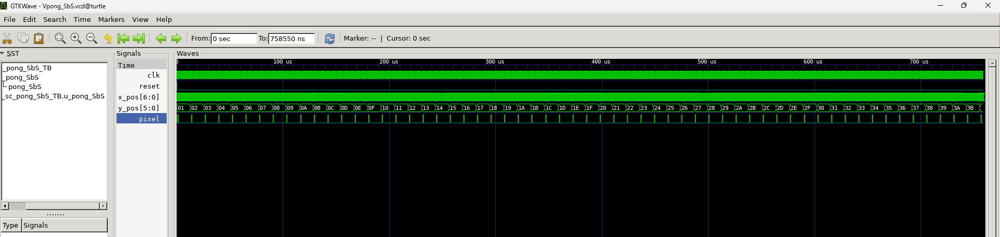
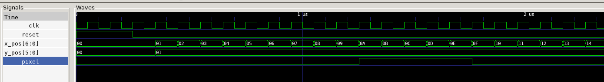
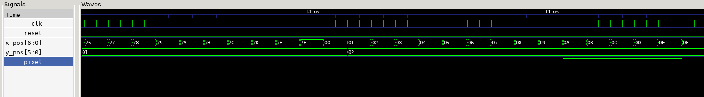
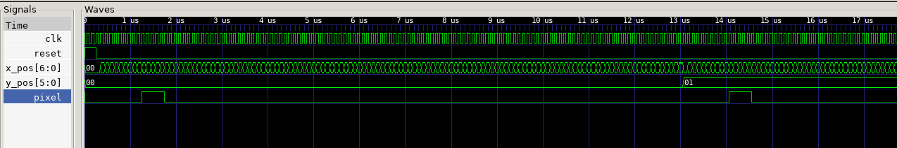
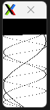
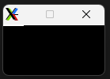
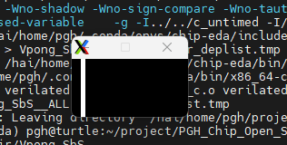
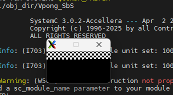
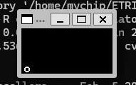

# RTL / LCD Graphic Example

## 01. Table

### Step 1. Copy 제작 및 Error 확인

- 작업 사본을 제작한다.
    
    ```c
    source ~/project/PGH_Chip_Open_Source/scripts/activate-chip-eda.sh
    export LD_LIBRARY_PATH=$CONDA_PREFIX/lib:$LD_LIBRARY_PATH
    
    mkdir -p ~/project/PGH_Chip_Open_Source/work
    cp -r ~/ETRI050_DesignKit/Projects/RTL/pong_SbS/01_Table ~/project/PGH_Chip_Open_Source/work/
    cd ~/project/PGH_Chip_Open_Source/work/01_Table
    ```
    
- 기본적으로 Verliator 와 System C를 활용하여 Simulation을 수행하며, GTKWave를 통해 파형을 확인한다.
- 버그 확인
    
    ```c
    (chip-eda) pgh@turtle:~/project/PGH_Chip_Open_Source/work/01_Table$ cd simulation
    (chip-eda) pgh@turtle:~/project/PGH_Chip_Open_Source/work/01_Table/simulation$ make build SYSTEMC=$CONDA_PREFIX
    verilator --sc -Wno-WIDTHTRUNC -Wno-WIDTHEXPAND --trace --timing --pins-sc-uint \
                            --top-module pong_SbS  --exe --build \
                            -CFLAGS -g -CFLAGS -I../../c_untimed -CFLAGS -I/hai/home/pgh/.conda/envs/chip-eda/include -CFLAGS -DVCD_TRACE_TEST_TB -CFLAGS -DVCD_TRACE_DUT_VERILOG -LDFLAGS -lm -LDFLAGS -lgsl -LDFLAGS -lSDL2 ../pong_SbS/pong_SbS.v ./sc_main.cpp ./sc_pong_SbS_TB.cpp
    %Error-BLKANDNBLK: ../pong_SbS/pong_SbS.v:9:17: Unsupported: Blocked and non-blocking assignments to same variable: '__Vcellout__pong_SbS__x_pos'
        9 | output [6:0]    x_pos;
          |                 ^~~~~
                       ../pong_SbS/pong_SbS.v:26:19: ... Location of blocking assignment
       26 |             x_pos += 1;
          |                   ^~
                       ../pong_SbS/pong_SbS.v:21:13: ... Location of nonblocking assignment
       21 |             x_pos <= 0;
          |             ^~~~~
                       ... For error description see https://verilator.org/warn/BLKANDNBLK?v=5.022
    %Error-BLKANDNBLK: ../pong_SbS/pong_SbS.v:10:17: Unsupported: Blocked and non-blocking assignments to same variable: '__Vcellout__pong_SbS__y_pos'
       10 | output [5:0]    y_pos;
          |                 ^~~~~
                       ../pong_SbS/pong_SbS.v:27:35: ... Location of blocking assignment
       27 |             if (x_pos==0)   y_pos += 1;
          |                                   ^~
                       ../pong_SbS/pong_SbS.v:22:13: ... Location of nonblocking assignment
       22 |             y_pos <= 0;
          |             ^~~~~
    %Error: Exiting due to 2 error(s)
            ... See the manual at https://verilator.org/verilator_doc.html for more assistance.
    make: *** [Makefile:82: obj_dir/Vpong_SbS] Error 1
    
    // BLKANDNBLK 에러 발생.
    // non-blocking 과 blocking 을 섞어 쓴 것에 대해 발생한 error
    
    (chip-eda) pgh@turtle:~/project/PGH_Chip_Open_Source/work/01_Table/simulation$ ls
    Makefile  sc_main.cpp  sc_pong_SbS_TB.cpp  sc_pong_SbS_TB.gtkw  sc_pong_SbS_TB.h  Vpong_SbS.gtkw
    (chip-eda) pgh@turtle:~/project/PGH_Chip_Open_Source/work/01_Table/simulation$ cd ..
    (chip-eda) pgh@turtle:~/project/PGH_Chip_Open_Source/work/01_Table$ cd pong_SbS
    (chip-eda) pgh@turtle:~/project/PGH_Chip_Open_Source/work/01_Table/pong_SbS$ ls
    pong_SbS.v
    ```
    

### Step 2. Error 수정 및 결과 확인

- `pong_SbS.v` 확인
    
    ```c
    //
    // Filename: pong_SbS.v
    // Purpose: Draw Table
    //
    
    module pong_SbS(clk, reset, x_pos, y_pos, pixel);
    input           clk;
    input           reset;
    output [6:0]    x_pos;
    output [5:0]    y_pos;
    output          pixel;
    
        reg [6:0]   x_pos;
        reg [5:0]   y_pos;
        reg         pixel;
    
        always @(posedge clk or posedge reset)
        begin
            if (reset)
            begin
                x_pos <= 0;
                y_pos <= 0;
            end
            else
            begin
                x_pos += 1;
                if (x_pos==0)   y_pos += 1;
            end
        end
    
        assign pixel = (x_pos>9 && x_pos<15)? 1'b1:1'b0;
    endmodule
    
    ```
    
- `pong_SbS.v` 수정
    
    ```c
    //
    // Filename: pong_SbS.v
    // Purpose: Draw Table
    //
    
    module pong_SbS(clk, reset, x_pos, y_pos, pixel);
    input           clk;
    input           reset;
    output [6:0]    x_pos;
    output [5:0]    y_pos;
    output          pixel;
    
        reg [6:0]   x_pos;
        reg [5:0]   y_pos;
        reg         pixel;
    
        always @(posedge clk or posedge reset)
        begin
            if (reset)
            begin
                x_pos <= 0;
                y_pos <= 0;
            end
            else
            begin
                x_pos <= x_pos + 1;
                if (x_pos==0)   y_pos <= y_pos + 1;
            end
        end
    
        assign pixel = (x_pos>9 && x_pos<15)? 1'b1:1'b0;
    endmodule
    
    ```
    
- 재 build 수행
    
    ```c
    (chip-eda) pgh@turtle:~/project/PGH_Chip_Open_Source/work/01_Table$ cd simulation
    (chip-eda) pgh@turtle:~/project/PGH_Chip_Open_Source/work/01_Table/simulation$ make build SYSTEMC=$CONDA_PREFIX
    verilator --sc -Wno-WIDTHTRUNC -Wno-WIDTHEXPAND --trace --timing --pins-sc-uint \
                            --top-module pong_SbS  --exe --build \
                            -CFLAGS -g -CFLAGS -I../../c_untimed -CFLAGS -I/hai/home/pgh/.conda/envs/chip-eda/include -CFLAGS -DVCD_TRACE_TEST_TB -CFLAGS -DVCD_TRACE_DUT_VERILOG -LDFLAGS -lm -LDFLAGS -lgsl -LDFLAGS -lSDL2 ../pong_SbS/pong_SbS.v ./sc_main.cpp ./sc_pong_SbS_TB.cpp
    make[1]: Entering directory '/hai/home/pgh/project/PGH_Chip_Open_Source/work/01_Table/simulation/obj_dir'
    /hai/home/pgh/.conda/envs/chip-eda/bin/x86_64-conda-linux-gnu-c++  -I.  -MMD -I/hai/home/pgh/.conda/envs/chip-eda/share/verilator/include -I/hai/home/pgh/.conda/envs/chip-eda/share/verilator/include/vltstd -DVM_COVERAGE=0 -DVM_SC=1 -DVM_TRACE=1 -DVM_TRACE_FST=0 -DVM_TRACE_VCD=1 -faligned-new -fcf-protection=none -Wno-bool-operation -Wno-shadow -Wno-sign-compare -Wno-tautological-compare -Wno-uninitialized -Wno-unused-but-set-parameter -Wno-unused-but-set-variable -Wno-unused-parameter -Wno-unused-variable    -g -I../../c_untimed -I/hai/home/pgh/.conda/envs/chip-eda/include -DVCD_TRACE_TEST_TB -DVCD_TRACE_DUT_VERILOG   -I/hai/home/pgh/.conda/envs/chip-eda/include  -Os -c -o sc_main.o ../sc_main.cpp
    /hai/home/pgh/.conda/envs/chip-eda/bin/x86_64-conda-linux-gnu-c++  -I.  -MMD -I/hai/home/pgh/.conda/envs/chip-eda/share/verilator/include -I/hai/home/pgh/.conda/envs/chip-eda/share/verilator/include/vltstd -DVM_COVERAGE=0 -DVM_SC=1 -DVM_TRACE=1 -DVM_TRACE_FST=0 -DVM_TRACE_VCD=1 -faligned-new -fcf-protection=none -Wno-bool-operation -Wno-shadow -Wno-sign-compare -Wno-tautological-compare -Wno-uninitialized -Wno-unused-but-set-parameter -Wno-unused-but-set-variable -Wno-unused-parameter -Wno-unused-variable    -g -I../../c_untimed -I/hai/home/pgh/.conda/envs/chip-eda/include -DVCD_TRACE_TEST_TB -DVCD_TRACE_DUT_VERILOG   -I/hai/home/pgh/.conda/envs/chip-eda/include  -Os -c -o sc_pong_SbS_TB.o ../sc_pong_SbS_TB.cpp
    /hai/home/pgh/.conda/envs/chip-eda/bin/x86_64-conda-linux-gnu-c++ -Os  -I.  -MMD -I/hai/home/pgh/.conda/envs/chip-eda/share/verilator/include -I/hai/home/pgh/.conda/envs/chip-eda/share/verilator/include/vltstd -DVM_COVERAGE=0 -DVM_SC=1 -DVM_TRACE=1 -DVM_TRACE_FST=0 -DVM_TRACE_VCD=1 -faligned-new -fcf-protection=none -Wno-bool-operation -Wno-shadow -Wno-sign-compare -Wno-tautological-compare -Wno-uninitialized -Wno-unused-but-set-parameter -Wno-unused-but-set-variable -Wno-unused-parameter -Wno-unused-variable    -g -I../../c_untimed -I/hai/home/pgh/.conda/envs/chip-eda/include -DVCD_TRACE_TEST_TB -DVCD_TRACE_DUT_VERILOG   -I/hai/home/pgh/.conda/envs/chip-eda/include  -c -o verilated.o /hai/home/pgh/.conda/envs/chip-eda/share/verilator/include/verilated.cpp
    /hai/home/pgh/.conda/envs/chip-eda/bin/x86_64-conda-linux-gnu-c++ -Os  -I.  -MMD -I/hai/home/pgh/.conda/envs/chip-eda/share/verilator/include -I/hai/home/pgh/.conda/envs/chip-eda/share/verilator/include/vltstd -DVM_COVERAGE=0 -DVM_SC=1 -DVM_TRACE=1 -DVM_TRACE_FST=0 -DVM_TRACE_VCD=1 -faligned-new -fcf-protection=none -Wno-bool-operation -Wno-shadow -Wno-sign-compare -Wno-tautological-compare -Wno-uninitialized -Wno-unused-but-set-parameter -Wno-unused-but-set-variable -Wno-unused-parameter -Wno-unused-variable    -g -I../../c_untimed -I/hai/home/pgh/.conda/envs/chip-eda/include -DVCD_TRACE_TEST_TB -DVCD_TRACE_DUT_VERILOG   -I/hai/home/pgh/.conda/envs/chip-eda/include  -c -o verilated_vcd_c.o /hai/home/pgh/.conda/envs/chip-eda/share/verilator/include/verilated_vcd_c.cpp
    /hai/home/pgh/.conda/envs/chip-eda/bin/x86_64-conda-linux-gnu-c++ -Os  -I.  -MMD -I/hai/home/pgh/.conda/envs/chip-eda/share/verilator/include -I/hai/home/pgh/.conda/envs/chip-eda/share/verilator/include/vltstd -DVM_COVERAGE=0 -DVM_SC=1 -DVM_TRACE=1 -DVM_TRACE_FST=0 -DVM_TRACE_VCD=1 -faligned-new -fcf-protection=none -Wno-bool-operation -Wno-shadow -Wno-sign-compare -Wno-tautological-compare -Wno-uninitialized -Wno-unused-but-set-parameter -Wno-unused-but-set-variable -Wno-unused-parameter -Wno-unused-variable    -g -I../../c_untimed -I/hai/home/pgh/.conda/envs/chip-eda/include -DVCD_TRACE_TEST_TB -DVCD_TRACE_DUT_VERILOG   -I/hai/home/pgh/.conda/envs/chip-eda/include  -c -o verilated_threads.o /hai/home/pgh/.conda/envs/chip-eda/share/verilator/include/verilated_threads.cpp
    /hai/home/pgh/.conda/envs/chip-eda/bin/python3 /hai/home/pgh/.conda/envs/chip-eda/share/verilator/bin/verilator_includer -DVL_INCLUDE_OPT=include Vpong_SbS.cpp Vpong_SbS___024root__DepSet_hf2178b7d__0.cpp Vpong_SbS___024root__DepSet_h85188cfb__0.cpp Vpong_SbS__Trace__0.cpp Vpong_SbS___024root__Slow.cpp Vpong_SbS___024root__DepSet_hf2178b7d__0__Slow.cpp Vpong_SbS___024root__DepSet_h85188cfb__0__Slow.cpp Vpong_SbS__Syms.cpp Vpong_SbS__Trace__0__Slow.cpp Vpong_SbS__TraceDecls__0__Slow.cpp > Vpong_SbS__ALL.cpp
    /hai/home/pgh/.conda/envs/chip-eda/bin/x86_64-conda-linux-gnu-c++ -Os  -I.  -MMD -I/hai/home/pgh/.conda/envs/chip-eda/share/verilator/include -I/hai/home/pgh/.conda/envs/chip-eda/share/verilator/include/vltstd -DVM_COVERAGE=0 -DVM_SC=1 -DVM_TRACE=1 -DVM_TRACE_FST=0 -DVM_TRACE_VCD=1 -faligned-new -fcf-protection=none -Wno-bool-operation -Wno-shadow -Wno-sign-compare -Wno-tautological-compare -Wno-uninitialized -Wno-unused-but-set-parameter -Wno-unused-but-set-variable -Wno-unused-parameter -Wno-unused-variable    -g -I../../c_untimed -I/hai/home/pgh/.conda/envs/chip-eda/include -DVCD_TRACE_TEST_TB -DVCD_TRACE_DUT_VERILOG   -I/hai/home/pgh/.conda/envs/chip-eda/include  -c -o Vpong_SbS__ALL.o Vpong_SbS__ALL.cpp
    echo "" > Vpong_SbS__ALL.verilator_deplist.tmp
    Archive /hai/home/pgh/.conda/envs/chip-eda/bin/x86_64-conda-linux-gnu-ar -rcs Vpong_SbS__ALL.a Vpong_SbS__ALL.o
    /hai/home/pgh/.conda/envs/chip-eda/bin/x86_64-conda-linux-gnu-c++     -L/hai/home/pgh/.conda/envs/chip-eda/lib sc_main.o sc_pong_SbS_TB.o verilated.o verilated_vcd_c.o verilated_threads.o Vpong_SbS__ALL.a   -lm -lgsl -lSDL2  -pthread -lpthread -latomic  -lsystemc -o Vpong_SbS
    rm Vpong_SbS__ALL.verilator_deplist.tmp
    make[1]: Leaving directory '/hai/home/pgh/project/PGH_Chip_Open_Source/work/01_Table/simulation/obj_dir'
    
    ```
    
- run 수행.
    
    ```c
    
    (chip-eda) pgh@turtle:~/project/PGH_Chip_Open_Source/work/01_Table/simulation$ make run SYSTEMC=$CONDA_PREFIX
    ./obj_dir/Vpong_SbS
    
            SystemC 3.0.2-Accellera --- Apr  2 2026 20:35:08
            Copyright (c) 1996-2025 by all Contributors,
            ALL RIGHTS RESERVED
    
    Info: (I703) tracing timescale unit set: 100 ps (sc_pong_SbS_TB.vcd)
    
    Warning: (W509) module construction not properly completed: did you forget to add a sc_module_name parameter to your module constructor?: module 'u_sc_pong_SbS_TB'
    In file: /home/conda/feedstock_root/build_artifacts/systemc-split_1775161875211/work/src/sysc/kernel/sc_module.cpp:376
    
    Info: /OSCI/SystemC: Simulation stopped by user.
    
    (chip-eda) pgh@turtle:~/project/PGH_Chip_Open_Source/work/01_Table/simulation$ make wave SYSTEMC=$CONDA_PREFIX &
    [1] 1361135
    (chip-eda) pgh@turtle:~/project/PGH_Chip_Open_Source/work/01_Table/simulation$ gtkwave Vpong_SbS.vcd --save=Vpong_SbS.gtkw &
    gtkwave sc_pong_SbS_TB.vcd --save=sc_pong_SbS_TB.gtkw &
    
    GTKWave Analyzer v3.3.121 (w)1999-2024 BSI
    
    GTKWave Analyzer v3.3.121 (w)1999-2024 BSI
    
    [0] start time.
    [758550000] end time.
    [0] start time.
    [811600000] end time.
    
    ```
    
    make run을 수행 시, 아래와 같은 동작이 이루어짐.
    
    ```c
    make build
       ↓
    verilator --sc  pong_SbS.v  sc_main.cpp  sc_pong_SbS_TB.cpp
       ↓ ① Verilog → C++ 변환         ↓ ② 네 C++ 코드 같이 컴파일
       obj_dir/Vpong_SbS.cpp …         (Verilator가 g++ 호출)
       ↓
       obj_dir/Vpong_SbS      ← 실행파일 (DUT + TB + SystemC 커널 전부 한 덩어리)
    
    make run  →  그냥 ./obj_dir/Vpong_SbS 실행
    ```
    
    | 파일 | 정체 |  |
    | --- | --- | --- |
    | `pong_SbS/pong_SbS.v` | **DUT** : 검증 대상 하드웨어 (수정한 파일.) | Verilog |
    | `simulation/sc_main.cpp` | **진입점** : C의 `main()` 자리. TB를 인스턴스화하고 `sc_start()` | SystemC |
    | `simulation/sc_pong_SbS_TB.h/.cpp` | **테스트벤치** : clk/reset 주고, VCD 파형 기록 | SystemC |
    | `simulation/Makefile` | 위 셋을 verilator로 엮어줌. | make |
    - `make run`은 스크립트를 도는 게 아닌, **컴파일된 바이너리 하나**(`obj_dir/Vpong_SbS`)를 실행행하며, 그 바이너리 안에 DUT·TB·SystemC 커널이 다 들어있음.
    - `obj_dir/Vpong_SbS`는 따라서 아래와 같이 동작함.
        
        ```c
        // 1. sc_main.cpp — 진입점
        
        sc_pong_SbS_TB u_sc_pong_SbS_TB("...");   // TB 하나 만들고
        sc_start();                                // SystemC 커널 가동 → 끝날 때까지
        ② sc_pong_SbS_TB.h 생성자 — 배선 + 파형 파일 열기
        
        clk("clk", 100, SC_NS, ...)          // 100ns 주기 클럭 생성기
        u_pong_SbS = new Vpong_SbS(...);     // ★ Verilator가 만든 DUT 인스턴스화
        u_pong_SbS->clk(clk); ...            // DUT 핀에 TB 신호 연결
        
        sc_create_vcd_trace_file("sc_pong_SbS_TB");  // → sc_pong_SbS_TB.vcd 생성
        tfp->open("Vpong_SbS.vcd");                  // → Vpong_SbS.vcd 생성. 여기가 네가 본 두 VCD 파일이 나오는 지점이야.
        
        // 2. sc_pong_SbS_TB.cpp의 Test_Gen() — 실제 자극(stimulus)
        
        reset.write(true);                    // 리셋 걸고
        wait(clk.posedge_event()) × 3;        // 3클럭 대기   ← 아까 clk#0~2가 reset=1이었던 이유!
        reset.write(false);                   // 리셋 해제    ← clk#3부터 스캔 시작
        
        while(true) {
            wait(clk.posedge_event());
            if (x_pos==127 && y_pos==63) {    // 화면 우하단 끝 도달하면
                wait(5000, SC_NS);
                sc_stop();                     // 시뮬 종료
            }
        }
        ```
        
- 결과 확인 (`SbS.vcd`)
    
    
    
    주요 부분을 확대하여 살펴보면 아래와 같다.
    
    
    
    
    
    - 결과 분석
        
        
        | 신호 | 동작 |
        | --- | --- |
        | `x_pos` | 0 → 1 → 2 ... → **127 → 0** (7비트 래핑) |
        | `y_pos` | `x_pos`가 0으로 돌아올 때마다 **+1** |
        | `pixel` | `x_pos`가 **10~14**일 때만 **1** |
    - 하지만, 동시에 y_pos가 0없이 바로 1로 넘어감. 즉, 다시 한번 코드에서의 판정 조건을 아래와 같이 변경 가능
        
        ```c
        // 현재 : x_pos가 0에서부터 시작이므로 y_pos가 바로 1로 넘어감
                begin
                    x_pos <= x_pos + 1;
                    if (x_pos==0)   y_pos <= y_pos + 1;
                end
                
        // 수정
                begin
                    x_pos <= x_pos + 1;
                    if (x_pos==127)   y_pos <= y_pos + 1;
                end
        ```
        
- 수정 및 결과 재확인
    
    ```c
    (chip-eda) pgh@turtle:~/project/PGH_Chip_Open_Source/work/01_Table/simulation$ make clean SYSTEMC=$CONDA_PREFIX
    rm -rf obj_dir
    rm -f *.vcd
    rm -f pong_SbS
    (chip-eda) pgh@turtle:~/project/PGH_Chip_Open_Source/work/01_Table/simulation$ make build SYSTEMC=$CONDA_PREFIX && make run SYSTEMC=$CONDA_PREFIX
    verilator --sc -Wno-WIDTHTRUNC -Wno-WIDTHEXPAND --trace --timing --pins-sc-uint \
                            --top-module pong_SbS  --exe --build \
                            -CFLAGS -g -CFLAGS -I../../c_untimed -CFLAGS -I/hai/home/pgh/.conda/envs/chip-eda/include -CFLAGS -DVCD_TRACE_TEST_TB -CFLAGS -DVCD_TRACE_DUT_VERILOG -LDFLAGS -lm -LDFLAGS -lgsl -LDFLAGS -lSDL2 ../pong_SbS/pong_SbS.v ./sc_main.cpp ./sc_pong_SbS_TB.cpp
    make[1]: Entering directory '/hai/home/pgh/project/PGH_Chip_Open_Source/work/01_Table/simulation/obj_dir'
    /hai/home/pgh/.conda/envs/chip-eda/bin/x86_64-conda-linux-gnu-c++  -I.  -MMD -I/hai/home/pgh/.conda/envs/chip-eda/share/verilator/include -I/hai/home/pgh/.conda/envs/chip-eda/share/verilator/include/vltstd -DVM_COVERAGE=0 -DVM_SC=1 -DVM_TRACE=1 -DVM_TRACE_FST=0 -DVM_TRACE_VCD=1 -faligned-new -fcf-protection=none -Wno-bool-operation -Wno-shadow -Wno-sign-compare -Wno-tautological-compare -Wno-uninitialized -Wno-unused-but-set-parameter -Wno-unused-but-set-variable -Wno-unused-parameter -Wno-unused-variable    -g -I../../c_untimed -I/hai/home/pgh/.conda/envs/chip-eda/include -DVCD_TRACE_TEST_TB -DVCD_TRACE_DUT_VERILOG   -I/hai/home/pgh/.conda/envs/chip-eda/include  -Os -c -o sc_main.o ../sc_main.cpp
    /hai/home/pgh/.conda/envs/chip-eda/bin/x86_64-conda-linux-gnu-c++  -I.  -MMD -I/hai/home/pgh/.conda/envs/chip-eda/share/verilator/include -I/hai/home/pgh/.conda/envs/chip-eda/share/verilator/include/vltstd -DVM_COVERAGE=0 -DVM_SC=1 -DVM_TRACE=1 -DVM_TRACE_FST=0 -DVM_TRACE_VCD=1 -faligned-new -fcf-protection=none -Wno-bool-operation -Wno-shadow -Wno-sign-compare -Wno-tautological-compare -Wno-uninitialized -Wno-unused-but-set-parameter -Wno-unused-but-set-variable -Wno-unused-parameter -Wno-unused-variable    -g -I../../c_untimed -I/hai/home/pgh/.conda/envs/chip-eda/include -DVCD_TRACE_TEST_TB -DVCD_TRACE_DUT_VERILOG   -I/hai/home/pgh/.conda/envs/chip-eda/include  -Os -c -o sc_pong_SbS_TB.o ../sc_pong_SbS_TB.cpp
    /hai/home/pgh/.conda/envs/chip-eda/bin/x86_64-conda-linux-gnu-c++ -Os  -I.  -MMD -I/hai/home/pgh/.conda/envs/chip-eda/share/verilator/include -I/hai/home/pgh/.conda/envs/chip-eda/share/verilator/include/vltstd -DVM_COVERAGE=0 -DVM_SC=1 -DVM_TRACE=1 -DVM_TRACE_FST=0 -DVM_TRACE_VCD=1 -faligned-new -fcf-protection=none -Wno-bool-operation -Wno-shadow -Wno-sign-compare -Wno-tautological-compare -Wno-uninitialized -Wno-unused-but-set-parameter -Wno-unused-but-set-variable -Wno-unused-parameter -Wno-unused-variable    -g -I../../c_untimed -I/hai/home/pgh/.conda/envs/chip-eda/include -DVCD_TRACE_TEST_TB -DVCD_TRACE_DUT_VERILOG   -I/hai/home/pgh/.conda/envs/chip-eda/include  -c -o verilated.o /hai/home/pgh/.conda/envs/chip-eda/share/verilator/include/verilated.cpp
    /hai/home/pgh/.conda/envs/chip-eda/bin/x86_64-conda-linux-gnu-c++ -Os  -I.  -MMD -I/hai/home/pgh/.conda/envs/chip-eda/share/verilator/include -I/hai/home/pgh/.conda/envs/chip-eda/share/verilator/include/vltstd -DVM_COVERAGE=0 -DVM_SC=1 -DVM_TRACE=1 -DVM_TRACE_FST=0 -DVM_TRACE_VCD=1 -faligned-new -fcf-protection=none -Wno-bool-operation -Wno-shadow -Wno-sign-compare -Wno-tautological-compare -Wno-uninitialized -Wno-unused-but-set-parameter -Wno-unused-but-set-variable -Wno-unused-parameter -Wno-unused-variable    -g -I../../c_untimed -I/hai/home/pgh/.conda/envs/chip-eda/include -DVCD_TRACE_TEST_TB -DVCD_TRACE_DUT_VERILOG   -I/hai/home/pgh/.conda/envs/chip-eda/include  -c -o verilated_vcd_c.o /hai/home/pgh/.conda/envs/chip-eda/share/verilator/include/verilated_vcd_c.cpp
    /hai/home/pgh/.conda/envs/chip-eda/bin/x86_64-conda-linux-gnu-c++ -Os  -I.  -MMD -I/hai/home/pgh/.conda/envs/chip-eda/share/verilator/include -I/hai/home/pgh/.conda/envs/chip-eda/share/verilator/include/vltstd -DVM_COVERAGE=0 -DVM_SC=1 -DVM_TRACE=1 -DVM_TRACE_FST=0 -DVM_TRACE_VCD=1 -faligned-new -fcf-protection=none -Wno-bool-operation -Wno-shadow -Wno-sign-compare -Wno-tautological-compare -Wno-uninitialized -Wno-unused-but-set-parameter -Wno-unused-but-set-variable -Wno-unused-parameter -Wno-unused-variable    -g -I../../c_untimed -I/hai/home/pgh/.conda/envs/chip-eda/include -DVCD_TRACE_TEST_TB -DVCD_TRACE_DUT_VERILOG   -I/hai/home/pgh/.conda/envs/chip-eda/include  -c -o verilated_threads.o /hai/home/pgh/.conda/envs/chip-eda/share/verilator/include/verilated_threads.cpp
    /hai/home/pgh/.conda/envs/chip-eda/bin/python3 /hai/home/pgh/.conda/envs/chip-eda/share/verilator/bin/verilator_includer -DVL_INCLUDE_OPT=include Vpong_SbS.cpp Vpong_SbS___024root__DepSet_hf2178b7d__0.cpp Vpong_SbS___024root__DepSet_h85188cfb__0.cpp Vpong_SbS__Trace__0.cpp Vpong_SbS___024root__Slow.cpp Vpong_SbS___024root__DepSet_hf2178b7d__0__Slow.cpp Vpong_SbS___024root__DepSet_h85188cfb__0__Slow.cpp Vpong_SbS__Syms.cpp Vpong_SbS__Trace__0__Slow.cpp Vpong_SbS__TraceDecls__0__Slow.cpp > Vpong_SbS__ALL.cpp
    /hai/home/pgh/.conda/envs/chip-eda/bin/x86_64-conda-linux-gnu-c++ -Os  -I.  -MMD -I/hai/home/pgh/.conda/envs/chip-eda/share/verilator/include -I/hai/home/pgh/.conda/envs/chip-eda/share/verilator/include/vltstd -DVM_COVERAGE=0 -DVM_SC=1 -DVM_TRACE=1 -DVM_TRACE_FST=0 -DVM_TRACE_VCD=1 -faligned-new -fcf-protection=none -Wno-bool-operation -Wno-shadow -Wno-sign-compare -Wno-tautological-compare -Wno-uninitialized -Wno-unused-but-set-parameter -Wno-unused-but-set-variable -Wno-unused-parameter -Wno-unused-variable    -g -I../../c_untimed -I/hai/home/pgh/.conda/envs/chip-eda/include -DVCD_TRACE_TEST_TB -DVCD_TRACE_DUT_VERILOG   -I/hai/home/pgh/.conda/envs/chip-eda/include  -c -o Vpong_SbS__ALL.o Vpong_SbS__ALL.cpp
    echo "" > Vpong_SbS__ALL.verilator_deplist.tmp
    Archive /hai/home/pgh/.conda/envs/chip-eda/bin/x86_64-conda-linux-gnu-ar -rcs Vpong_SbS__ALL.a Vpong_SbS__ALL.o
    /hai/home/pgh/.conda/envs/chip-eda/bin/x86_64-conda-linux-gnu-c++     -L/hai/home/pgh/.conda/envs/chip-eda/lib sc_main.o sc_pong_SbS_TB.o verilated.o verilated_vcd_c.o verilated_threads.o Vpong_SbS__ALL.a   -lm -lgsl -lSDL2  -pthread -lpthread -latomic  -lsystemc -o Vpong_SbS
    rm Vpong_SbS__ALL.verilator_deplist.tmp
    make[1]: Leaving directory '/hai/home/pgh/project/PGH_Chip_Open_Source/work/01_Table/simulation/obj_dir'
    ./obj_dir/Vpong_SbS
    
            SystemC 3.0.2-Accellera --- Apr  2 2026 20:35:08
            Copyright (c) 1996-2025 by all Contributors,
            ALL RIGHTS RESERVED
    
    Info: (I703) tracing timescale unit set: 100 ps (sc_pong_SbS_TB.vcd)
    
    Warning: (W509) module construction not properly completed: did you forget to add a sc_module_name parameter to your module constructor?: module 'u_sc_pong_SbS_TB'
    In file: /home/conda/feedstock_root/build_artifacts/systemc-split_1775161875211/work/src/sysc/kernel/sc_module.cpp:376
    
    Info: /OSCI/SystemC: Simulation stopped by user.
    (chip-eda) pgh@turtle:~/project/PGH_Chip_Open_Source/work/01_Table/simulation$ make wave SYSTEMC=$CONDA_PREFIX &
    [1] 1411398
    (chip-eda) pgh@turtle:~/project/PGH_Chip_Open_Source/work/01_Table/simulation$ gtkwave Vpong_SbS.vcd --save=Vpong_SbS.gtkw &
    gtkwave sc_pong_SbS_TB.vcd --save=sc_pong_SbS_TB.gtkw &
    
    GTKWave Analyzer v3.3.121 (w)1999-2024 BSI
    
    GTKWave Analyzer v3.3.121 (w)1999-2024 BSI
    
    VCDLOAD | Time backtracking detected in VCD file!
    [0] start time.
    [758550000] end time.
    [0] start time.
    [824400000] end time.
    
    ```
    



- 위와 같이 `y_pos`도 0에서 돈 후, 1로 올라가는 것 확인.

## 02. Graphic LCD

- 전체 구조
    
    ```c
       sc_main.cpp
            │ sc_start()
            ▼
     ┌──────────────────────────────────────────┐
     │ sc_glcd128x64_TB  ("칩을 조종하는 MCU")   │
     │                                          │
     │  Test_Gen():                             │
     │    전화면 채우기 → 사인파 3개 그리기       │
     │    (SET_PIXEL 매크로로 버스를 두드림)     │
     │         │                                │
     │         │ RS,RW,E,DBi,CS1,CS2,RST        │  ← 실제 칩 핀
     │         ▼                                │
     │  ┌─────────────────────────────┐         │
     │  │ sc_glcd128x64  ★칩 모델(DUT)│         │
     │  │                             │         │
     │  │  Renderer_Method()          │         │
     │  │    E엣지 → 명령해석 → gMemory│         │
     │  │  gMemory[2][8][64]  ← GDRAM │         │
     │  │  Renderer() → SDL2 창       │──────────┼──→ 화면
     │  └─────────────────────────────┘         │
     └──────────────────────────────────────────┘
    ```
    
    - `Renderer_Method ()` : 버스 인터페이스
        
        ```c
        SC_METHOD(Renderer_Method);
        sensitive << E << RST;        // ★ E와 RST가 바뀔 때만 깨어남
        
        if (E.read())        // 1 단계: E 상승엣지: 제어신호를 래치
        {
            opWrite = !RW;   // 쓰기냐 읽기냐
            opInst  = !RS;   // 명령이냐 데이터냐
            opCS1/opCS2      // 어느 칩이냐
        }
        else if (!E.read())  // 2 단계: E 하강엣지: 실제 동작 수행
        {
            if (opInst)  // → 명령 해석 (switch로 DISPLAY/X/Y/Z 주소)
            else         // → gMemory에 데이터 쓰기/읽기
        }
        ```
        
        실제 칩은 `E`가 HIGH일 때 신호를 붙잡고, LOW로 떨어질 때 실행. 이를 재현.
        
    - `Renderer ()` : 화면 그리기
        
        ```c
        for x(0~63), y(0~127):
            int cs    = y/64;      // y가 64 넘으면 2번 칩
            int page  = x/8;       // 8픽셀이 1바이트(페이지)
            int y_pos = y%64;
            int x_pos = x%8;       // 바이트 안의 비트 위치
            
            if (gMemory[cs][page][y_pos] & (0x01 << x_pos))   // 그 비트가 1이면
                흰색 점  else  검은색 점
        
            #ifdef ROTATE_SCREEN
                SDL_RenderDrawPoint(renderer, y, x);   // ← x,y 뒤집기!
            #else
                SDL_RenderDrawPoint(renderer, x, y);
            #endif
        ```
        
        **`ROTATE_SCREEN`의 정체:**  단지 `(x,y)`를 `(y,x)`로 바꿔서 그리는 것. 그래서 64×128 ↔ 128×64가 됨,
        
- GLCD 칩을 System C로 완전히 모델링 함.
    - 관련 자료는 아래와 같다.
        
        [KS0108B.pdf](RTL%20LCD%20Graphic%20Example/KS0108B.pdf)
        
        [Graphics-LCD-JHD12864E-Datasheet.pdf](RTL%20LCD%20Graphic%20Example/Graphics-LCD-JHD12864E-Datasheet.pdf)
        
    - 구성
        
        
        | 구성 | 정체 |
        | --- | --- |
        | **핀** | `RS`(명령/데이터), `RW`(읽기/쓰기), `E`(Enable), `DB[7:0]`, `CS1/CS2`, `RST` 
        : **실제 칩 핀 그대로** |
        | **GDRAM** | `gMemory[2][8][64]` = [칩2개][페이지8][라인64]. **1바이트 = 세로 8픽셀** (실제 LCD 메모리 구조) |
        | **CS1/CS2** | 128픽셀을 **64+64로 반씩** 담당하는 컨트롤러 2개 (실제 모듈이 그럼) |
        | **출력** | SDL2 창에 픽셀 렌더링 |
    - 구동 (6단계)
        
        세로로 8개의 점(픽셀)이 1바이트(8비트)로 묶여있음. 따라서, 아래와 같은 6단계를 걸침.
        
        - **시작줄 설정 (Z)**
        - **가로 위치 설정 (Y)**
        - **세로 위치 설정 (X - 페이지)**
        - **일단 8개 점을 다 읽어옴 (GET_DATA)**
        - **읽느라 주소가 넘어갔으니 가로 위치(Y)를 다시 세팅**
        - **수정된 8개 점을 다시 칩에 덮어씀 (SET_DATA)**
        - BackGround
            
            **1. 세로 위치 설정 (X - 페이지)**
            
            - **공식 명칭:** X Address (또는 Page Address)
            - **실제 의미:** 화면의 세로 층수(높이)를 의미합니다.
            - **설명:** 세로 64픽셀을 8픽셀짜리 막대기 단위로 나누면 총 8개의 층(가로줄)이 생깁니다. 이것을 '페이지(Page)'라고 부릅니다.
                - 0페이지: 화면 맨 위 0~7번째 줄
                - 1페이지: 8~15번째 줄
                - ... 7페이지: 맨 아래 56~63번째 줄
            - **왜 X라고 부르나?** 칩 제조사가 세로축을 X라고 우겼기 때문입니다. (코드 주석에 `SET_X_ADDRESS (Y-Coordinate)` 라고 굳이 번역해 둔 이유가 이 때문입니다.)
            
            **2. 가로 위치 설정 (Y - 컬럼)**
            
            - **공식 명칭:** Y Address
            - **실제 의미:** 화면의 가로 위치(왼쪽에서 몇 번째인가)를 의미합니다.
            - **설명:** 한 칩이 가로 64픽셀을 담당하므로, 0부터 63까지의 가로 위치를 지정합니다. "몇 번째 세로 막대기를 건드릴 거냐?"를 고르는 과정입니다.
            - **이것도 역시** 칩 제조사가 가로축을 Y라고 불렀습니다. (주석: `SET_Y_ADDRESS (X-Coordinate)`)
            
            **3. 시작줄 설정 (Z)**
            
            - **공식 명칭:** Z Address (Display Start Line)
            - **실제 의미:** **"메모리의 몇 번째 줄부터 화면 맨 꼭대기에 보여줄래?"**
            - **설명:** 하드웨어적으로 화면을 위아래로 스크롤(밀어 올리기)할 때 쓰는 기능입니다. 스마트폰에서 웹서핑할 때 화면을 위로 슥 올리는 동작을 칩 자체에서 지원하는 겁니다. 일반적인 상황에서는 그냥 Z=0 (맨 위부터 정상적으로 보여줘)으로 고정해 두고 씁니다.
            
            **4. 점 하나 찍기 (가상 시나리오)**
            
            목표: 화면의 **가로 10번째, 세로 12번째**에 있는 점 하나를 까맣게 칠하고 싶다!
            
            1. **시작줄 지정(Z):** `Z=0` (화면 스크롤 안 함, 정상 출력)
            2. **페이지 지정(X):** 세로 12번째 점은 어디 있을까요? 8로 나누면 몫이 1이므로 1페이지(X=1)에 있습니다.
            3. **가로 지정(Y):** 가로 10번째 막대기니까 **Y=10**을 지정합니다.
            4. **일단 읽어옴 (GET_DATA):** 가로 10, 세로 1페이지에 있는 **8픽셀짜리 막대기를 통째로** 칩에서 읽어옵니다. (예: `00000000` - 다 하얀색)
            5. **내부 계산 (수정):** 12번째 점은 이 막대기의 4번째(12 나누기 8의 나머지) 위치에 있습니다. 내가 소프트웨어적으로 4번째 비트만 1로 바꿉니다. (`00001000`)
            6. **주소 되감기 (Y 다시 세팅):** 칩이 멍청해서, 방금 4번에서 데이터를 한 번 읽어내면 내부적으로 가로 주소(Y)를 다음 칸인 11로 자동 이동시켜 버립니다! 그래서 다시 **Y=10**으로 뒤로 한 칸 돌려놔야 합니다.
            7. **다시 덮어씀 (SET_DATA):** 아까 5번에서 수정한 막대기(`00001000`)를 칩에 쑤셔 넣습니다.
    - TB가 `SET_PIXEL` 매크로로 **실제 칩 프로토콜을 그대로 두드려서** 점을 찍어냄.
        - `sc_glcd128x64.h`
            
            ```c
            //
            // Filanema: sc_glcd128x64.h
            //
            
            #ifndef _SC_GLCD128x64_H_
            #define _SC_GLCD128x64_H_
            
            #include <systemc.h>
            #include <SDL2/SDL.h>
            
            SC_MODULE(sc_glcd128x64)
            {
                sc_in<bool>     RS; // Register Mode Select: Instruction(L), Data(H)
                sc_in<bool>     RW; // Read(H), Write(L)
                sc_in<bool>     E;  // Enable @ Posedge
                sc_in<sc_uint<8> >  DBi; // Data Bus
                sc_out<sc_uint<8> > DBo; // Data Output Bus
                sc_in<bool>     CS1;    // Chip-Select #1
                sc_in<bool>     CS2;    // Chip-Select #2
                sc_in<bool>     RST;    // Reset(L)
            
                // GLCD Call-Back --------------------------------------------
                void Renderer_Method(void);
                void Renderer(void);
                // Local Variables -------------------------------------------
                sc_uint<8>  DataBus;
                sc_uint<6>  x0_address, y0_address, z0_address;
                sc_uint<6>  x1_address, y1_address, z1_address;
            
                bool    opWrite;
                bool    opInst;
                bool    opCS1, opCS2;
                bool    bDisplay;
            
                uint8_t gMemory[2][8][64];    // [CS#][Page#][Line#]
                // GD RAM(8-pixel per Page)
                // |<----------------------- X Address[0:63] ---------------->|
                // |     Page #0           Page #1     ......       Page #7   |
                // +-+-+-+-+-+-+-+-+ +-+-+-+-+-+-+-+-+ ...... +-+-+-+-+-+-+-+-+ ---
                // |0|1|2|3|4|5|6|7| |0|1|2|3|4|5|6|7| ...... |0|1|2|3|4|5|6|7|  ^
                // +-+-+-+-+-+-+-+-+ +-+-+-+-+-+-+-+-+ ...... +-+-+-+-+-+-+-+-+  |
                // |0|1|2|3|4|5|6|7| |0|1|2|3|4|5|6|7| ...... |0|1|2|3|4|5|6|7|  |
                // +-+-+-+-+-+-+-+-+ +-+-+-+-+-+-+-+-+ ...... +-+-+-+-+-+-+-+-+  Y Address[0:63]
                // :               : :               : ...... :               :  (CS1)
                // +-+-+-+-+-+-+-+-+ +-+-+-+-+-+-+-+-+ ...... +-+-+-+-+-+-+-+-+  |
                // |0|1|2|3|4|5|6|7| |0|1|2|3|4|5|6|7| ...... |0|1|2|3|4|5|6|7|  v
                // +-+-+-+-+-+-+-+-+ +-+-+-+-+-+-+-+-+ ...... +-+-+-+-+-+-+-+-+ ---
                //
                // +-+-+-+-+-+-+-+-+ +-+-+-+-+-+-+-+-+ ...... +-+-+-+-+-+-+-+-+ ---
                // |0|1|2|3|4|5|6|7| |0|1|2|3|4|5|6|7| ...... |0|1|2|3|4|5|6|7|  ^
                // +-+-+-+-+-+-+-+-+ +-+-+-+-+-+-+-+-+ ...... +-+-+-+-+-+-+-+-+  |
                // |0|1|2|3|4|5|6|7| |0|1|2|3|4|5|6|7| ...... |0|1|2|3|4|5|6|7|  |
                // +-+-+-+-+-+-+-+-+ +-+-+-+-+-+-+-+-+ ...... +-+-+-+-+-+-+-+-+  Y Address[0:63]
                // :               : :               : ...... :               :  (CS2)
                // +-+-+-+-+-+-+-+-+ +-+-+-+-+-+-+-+-+ ...... +-+-+-+-+-+-+-+-+  |
                // |0|1|2|3|4|5|6|7| |0|1|2|3|4|5|6|7| ...... |0|1|2|3|4|5|6|7|  v
                // +-+-+-+-+-+-+-+-+ +-+-+-+-+-+-+-+-+ ...... +-+-+-+-+-+-+-+-+ ---
                //       Page #0           Page #1     ......       Page #7
            
                // SDL2--------------------------
                SDL_Window* window;
                SDL_Renderer* renderer;
                SDL_Event event;
            
                SC_CTOR(sc_glcd128x64)
                {
                    SC_METHOD(Renderer_Method);
                    sensitive << E << RST; //<< RS << RW << E << DBi << CS1 << CS2 << RST;
            
                    // SDL2--------------------------
                    window = NULL;
                    renderer = NULL;
                    if (SDL_Init(SDL_INIT_VIDEO) < 0)
                    {
                        fprintf(stderr, "SDL Initialization Fail: %s\n", SDL_GetError());
                        return;
                    }
            
                    window = SDL_CreateWindow("SDL2 Window",
                                          SDL_WINDOWPOS_UNDEFINED,
                                          SDL_WINDOWPOS_UNDEFINED,
                                        #ifdef ROTATE_SCREEN
                                          128, 64,
                                        #else
                                          64, 128,
                                        #endif
                                          SDL_WINDOW_SHOWN);
                    if (!window)
                    {
                        fprintf(stderr, "SDL Initialization Fail: %s\n", SDL_GetError());
                        SDL_Quit();
                        return;
                    }
            
                    SDL_SetWindowTitle(window, "GLCD 128x64");
                    //SDL_SetWindowMinimumSize(window, 64, 128);
                    //SDL_SetWindowMaximumSize(window, 64, 128);
                    SDL_SetWindowResizable(window, SDL_FALSE);
                    //SDL_SetWindowBordered(window, SDL_TRUE);
                    renderer = SDL_CreateRenderer(window, -1, SDL_RENDERER_ACCELERATED);
                }
            
                ~sc_glcd128x64()
                {}
            };
            #endif
            
            ```
            
        - `sc_glcd128x64.cpp`
            
            ```c
            //
            // Filename: sc_glcd128x64.cpp
            //
            
            #include "sc_glcd128x64.h"
            #include "glcd128x64_defs.h"
            
            void sc_glcd128x64::Renderer(void)
            {
                if (!bDisplay)  // DISPLAY OFF
                {
                    #ifdef DEBUG_MSG
                    fprintf(stdout, "%llu: Display OFF\n", (sc_time_stamp().value()));
                    #endif
                    SDL_SetRenderDrawColor(renderer, 0, 0, 0, SDL_ALPHA_OPAQUE);
                    SDL_RenderClear(renderer);
                    SDL_RenderPresent(renderer);
                }
                else if (bDisplay)  // DISPLAY ON
                {
                    #ifdef DEBUG_MSG
                    fprintf(stdout, "%llu: Display ON\n", (sc_time_stamp().value()));
                    #endif
                    for(int x=0; x<64; x++)
                    {
                        for(int y=0; y<128; y++)
                        {
                            int cs    = y/64;
                            int page  = x/8;
                            int y_pos = y%64;
                            int x_pos = x%8;
                            if (gMemory[cs][page][y_pos] & (0x01<<x_pos))
                                SDL_SetRenderDrawColor(renderer, 255, 255, 255, SDL_ALPHA_OPAQUE);
                            else
                                SDL_SetRenderDrawColor(renderer, 0, 0, 0, SDL_ALPHA_OPAQUE);
                            #ifdef ROTATE_SCREEN
                            SDL_RenderDrawPoint(renderer, y, x);
                            #else
                            SDL_RenderDrawPoint(renderer, x, y);
                            #endif
                        }
                    }
                    #ifdef DEBUG_MSG
                    fprintf(stdout, "%llu: Draw SCREEN\n", (sc_time_stamp().value()));
                    #endif
                    SDL_RenderPresent(renderer);
                }
            }
            
            void sc_glcd128x64::Renderer_Method(void)
            {
                // SDL QUIT event
                if (SDL_PollEvent(&event) && (event.type == SDL_QUIT))
                {
                    SDL_DestroyRenderer(renderer);
                    SDL_DestroyWindow(window);
                    SDL_Quit();
                    sc_stop();
                }
            
                if (!RST.read())    // RESET
                {
                    opWrite = false;
                    opInst = false;
                    opCS1 = opCS2 = false;
                    bDisplay = false;
                    x0_address = y0_address = z0_address = 0;
                    x1_address = y1_address = z1_address = 0;
                }
                else if (RST.read())    // NON-RESET
                {
                    if (E.read())   // Pos-Edge of E ------------------------------------------------
                    {
                        opWrite  = RW.read()?  false:true;
                        opInst   = RS.read()?  false:true;
                        opCS1    = CS1.read()? false:true;
                        opCS2    = CS2.read()? false:true;
                        bDisplay = RST.read()? true:false;
                    }
                    else if (!E.read()) // Neg-Edge of E ------------------------------------------------
                    {
                        if (opWrite)  // Write Operation
                        {
                            DataBus = DBi.read();
                            if (opInst)  // Instruction Write
                            {
                                switch(DataBus & 0xC0)
                                {
                                    case (INST_DISPLAY & 0xC0):
                                        if (!DataBus[0])    // DISPLAY OFF
                                            bDisplay = false;
                                        else                // DISPLAY ON
                                            bDisplay = true;
                                        Renderer();
                                    break;
                                    case (INST_SET_Y_ADDRESS & 0xC0):  // SET Y_ADDRESS(X-Coordinate)
                                        if (opCS1)
                                        {
                                            y0_address = DataBus.range(5,0);
                                            #ifdef DEBUG_MSG
                                            fprintf(stdout, "%llu: Set Y0 Address=%d\n", (sc_time_stamp().value()), (int)y0_address);
                                            #endif
                                        }
                                        if (opCS2)
                                        {
                                            y1_address = DataBus.range(5,0);
                                            #ifdef DEBUG_MSG
                                            fprintf(stdout, "%llu: Set Y1 Address=%d\n", (sc_time_stamp().value()), (int)y1_address);
                                            #endif
                                        }
                                        break;
                                    case (INST_SET_X_ADDRESS & 0xC0):  // SET X_ADDRESS(Y-Coordinate)
                                        if (opCS1)
                                        {
                                            x0_address = DataBus.range(2,0);
                                            #ifdef DEBUG_MSG
                                            fprintf(stdout, "%llu: Set X0 Address=%d\n", (sc_time_stamp().value()), (int)x0_address);
                                            #endif
                                        }
                                        if (opCS2)
                                        {
                                            x1_address = DataBus.range(2,0);
                                            #ifdef DEBUG_MSG
                                            fprintf(stdout, "%llu: Set X1 Address=%d\n", (sc_time_stamp().value()), (int)x1_address);
                                            #endif
                                        }
                                        break;
                                    case (INST_SET_Z_ADDRESS & 0xC0):  // SET Z_ADDRESS(Start Line)
                                        if (opCS1)
                                        {
                                            z0_address = DataBus.range(5,0);
                                            #ifdef DEBUG_MSG
                                            fprintf(stdout, "%llu: Set Z0 Address=%d\n", (sc_time_stamp().value()), (int)z0_address);
                                            #endif
                                        }
                                        if (opCS2)
                                        {
                                            z1_address = DataBus.range(5,0);
                                            #ifdef DEBUG_MSG
                                            fprintf(stdout, "%llu: Set Z1 Address=%d\n", (sc_time_stamp().value()), (int)z1_address);
                                            #endif
                                        }
                                        break;
                                    default:    break;
                                } // switch(DataBus & 0xC0)
                            }
                            else if (!opInst)   // Data Write Operation
                            {
                                if (opCS1)
                                {
                                    gMemory[0][x0_address][y0_address] = DataBus;
                                    #ifdef DEBUG_MSG
                                    fprintf(stdout, "%llu: Write GD RAM[0][%d][%d]=%d\n", (sc_time_stamp().value()), (int)y0_address, (int)x0_address, (int)DataBus);
                                    #endif
                                    y0_address++;
                                }
                                if (opCS2)
                                {
                                    gMemory[1][x1_address][y1_address] = DataBus;
                                    #ifdef DEBUG_MSG
                                    fprintf(stdout, "%llu: Write GD RAM[1][%d][%d]=%d\n", (sc_time_stamp().value()), (int)y1_address, (int)x1_address, (int)DataBus);
                                    #endif
                                    y1_address++;
                                }
            
                                if (opCS1 || opCS2) // Render Screen when Display Memory written!
                                    Renderer();
                            }
                        }
                        else if (!opWrite)  // Read Operation
                        {
                            if (opCS1)
                            {
                                DBo.write((sc_uint<8>)gMemory[0][x0_address][y0_address]);
                                #ifdef DEBUG_MSG
                                fprintf(stdout, "%llu: Read GD RAM[0][%d][%d]=%d\n", (sc_time_stamp().value()), (int)y0_address, (int)x0_address, (int)gMemory[0][x0_address][y0_address]);
                                #endif
                                y0_address++;
                            }
                            if (opCS2)
                            {
                                DBo.write((sc_uint<8>)gMemory[1][x1_address][y1_address]);
                                #ifdef DEBUG_MSG
                                fprintf(stdout, "%llu: Read GD RAM[1][%d][%d]=%d\n", (sc_time_stamp().value()), (int)y1_address, (int)x1_address, (int)gMemory[1][x1_address][y1_address]);
                                #endif
                                y1_address++;
                            }
                        }
                    }
                }
            }
            
            ```
            
        
        | 파일 | 역할 | 비유 |
        | --- | --- | --- |
        | `sc_main.cpp` | **진입점** : TB 만들고 `sc_start()` | `main()` |
        | `sc_glcd128x64_TB.h/.cpp` | **테스트벤치** : 칩 핀을 두드려 사인파를 그림 | 칩을 조종하는 MCU |
        | **`sc_glcd128x64.h/.cpp`** | **칩 모델 (DUT)** : KS0108 GLCD 그 자체 | **진짜 LCD 칩** |
        | `glcd128x64_defs.h` | 명령어 상수 (`0x3E`, `0xB8`...) | 데이터시트의 명령표 |
    - 주소설정(INST) → 읽기(GET_DATA) → 비트 OR → 쓰기(SET_DATA) 해당 과정에서, 각 단계마다 `E`를 토글하는 **버스 사이클**까지 재현함.
- 실행.
    
    ```c
    (chip-eda) pgh@turtle:~/project/PGH_Chip_Open_Source/work/01_Table/simulation$ gtkwave Vpong_SbS.vcd --save=Vpong_SbS.gtkw &
    gtkwave sc_pong_SbS_TB.vcd --save=sc_pong_SbS_TB.gtkw &
    
    GTKWave Analyzer v3.3.121 (w)1999-2024 BSI
    
    GTKWave Analyzer v3.3.121 (w)1999-2024 BSI
    
    VCDLOAD | Time backtracking detected in VCD file!
    [0] start time.
    [758550000] end time.
    [0] start time.
    [824400000] end time.
    WM Destroy
    WM Destroy
    
    [1]+  Done                    make wave SYSTEMC=$CONDA_PREFIX
    (chip-eda) pgh@turtle:~/project/PGH_Chip_Open_Source/work/01_Table/simulation$ cd ..
    (chip-eda) pgh@turtle:~/project/PGH_Chip_Open_Source/work/01_Table$ cd ..
    (chip-eda) pgh@turtle:~/project/PGH_Chip_Open_Source/work$ ls
    01_Table  02_glcd128x64
    (chip-eda) pgh@turtle:~/project/PGH_Chip_Open_Source/work$ cd 02_glcd128x64
    (chip-eda) pgh@turtle:~/project/PGH_Chip_Open_Source/work/02_glcd128x64$ ls
    _Docs_  simulation
    (chip-eda) pgh@turtle:~/project/PGH_Chip_Open_Source/work/02_glcd128x64$ cd simulation
    (chip-eda) pgh@turtle:~/project/PGH_Chip_Open_Source/work/02_glcd128x64/simulation$ export LD_LIBRARY_PATH=$CONDA_PREFIX/lib:$LD_LIBRARY_PATH
    (chip-eda) pgh@turtle:~/project/PGH_Chip_Open_Source/work/02_glcd128x64/simulation$ make run SYSTEMC=$CONDA_PREFIX
    ./sc_glcd128x64_TB
    
    ```
    
- 실행 결과
    
    
    
    
    
    
    
    
- 결과 분석.
    
    
    | 화면 | 무슨 일 |
    | --- | --- |
    | 왼쪽 흰 띠 | **CS1 영역**(좌측 64픽셀)부터 채우는 중 |
    | 흰 영역 확장 | 계속 채워나감 |
    | 전체 흰색 | **화면 전체 클리어(전 픽셀 ON)** 완료 |
    | **사인파 곡선** | **본 게임** : 흰 배경에 곡선을 그림 |
- Testbench의 역할
    
    ```cpp
    1. 전 화면 흰색으로 채움           for x,y: SET_PIXEL(x,y,true)     
    2 사인파 3개를 검은색으로 그림      x = 31*sin(y*2π/128)+32        
                                      x = 31*sin(y*2π/64)+32            (주기 128, 64, 32)
                                      x = 31*sin(y*2π/32)+32
    3. 1초 대기 → DISPLAY OFF → 1초 → DISPLAY ON    ← 깜빡임 테스트
    4. 반전: 전 화면 검게 + 사인파 3개를 흰색으로
    5. 반복 (무한)
    ```
    
- KS0108 Chip 검증
    
    
    | 기능 | 어떻게 |
    | --- | --- |
    | **픽셀 read-modify-write** | `SET_PIXEL`이 GET_DATA → 비트연산 → SET_DATA. 1바이트=세로8픽셀이라 **한 픽셀 바꾸려면 읽어서 고쳐 써야 함** |
    | **CS1/CS2 자동 전환** | `y<64 ? CS1 : CS2` — 화면 절반씩 다른 칩 |
    | **DISPLAY ON/OFF** | 메모리는 그대로 두고 화면만 끔 |
    | **주소 지정** | `SET_X_ADDRESS`(페이지), `SET_Y_ADDRESS`(라인), `SET_Z_ADDRESS`(시작줄) |
- 화면 돌리기
    
    ```c
    # 회전 화면
    make clean SYSTEMC=$CONDA_PREFIX
    make build SYSTEMC=$CONDA_PREFIX ROTATE_SCREEN=-DROTATE_SCREEN
    make run   SYSTEMC=$CONDA_PREFIX
    
    # 회전 + 버스 디버그 메시지
    make clean SYSTEMC=$CONDA_PREFIX
    make build SYSTEMC=$CONDA_PREFIX ROTATE_SCREEN=-DROTATE_SCREEN DEBUG_MSG=-DDEBUG_MSG
    make run   SYSTEMC=$CONDA_PREFIX
    ```
    
- 결과 확인
    
    
    
- Console 확인
    
    ```c
    400000: Display ON
    400000: Draw SCREEN
    550000: Set Z0 Address=0 // 시작 줄 지정
    550000: Set Z1 Address=0 // 시작 줄 지정
    700000: Set Y0 Address=0 // 열 주소
    850000: Set X0 Address=0 // 페이지 주소
    1000000: Read GD RAM[0][0][0]=0 // 읽고
    1150000: Set Y0 Address=0 // 주소 되감기(읽으면서 y가 자동 증가했으므로)
    1300000: Write GD RAM[0][0][0]=1 // 비트 세워쓰기
    1300000: Display ON //화면 갱신
    1300000: Draw SCREEN
    1450000: Set Z0 Address=0
    1450000: Set Z1 Address=0
    1600000: Set Y0 Address=1
    1750000: Set X0 Address=0
    
    ...
    
    //해석
    Set Y0 Address=32          ← 열 주소 지정
    Set X0 Address=4           ← 페이지 지정
    Read GD RAM[0][32][4]=255  ← 읽어서
    Write GD RAM[0][32][4]=239 ← 비트 하나 끄고 다시 씀
    Draw SCREEN                ← 화면 갱신
    ```
    
- 각 단계의 의미
    
    
    |  | 01. Table | 02. Graphic LCD |
    | --- | --- | --- |
    | 만든 것 | Verilog RTL : 픽셀 계산 | **주변장치**(C++ 모델) : 픽셀을 그림 |
    | 언어 | Verilog → Verilator → C++ | 순수 SystemC/C++ |

## 03. RTL + GLCD 결합

### Step 1. 구동

- 전체 구조
    
    ```c
    sc_pong_SbS_TB (최상위 TB)
    │
    ├── Vpong_SbS ← (Verilog RTL)
    │     출력: x_pos, y_pos, pixel, p_tick
    │     입력: busy
    │         ↕ (같은 신호로 직결)
    └── sc_glcd128x64_TB ← 어댑터/BFM
          └── sc_glcd128x64 ← GLCD 칩 모델 → SDL2 화면
    ```
    
    - `sc_glcd128x64_TB`가 번역기 역할을 수행
    - RTL의 `(x,y,pixel)`을 받아 **GLCD 버스 프로토콜(RS/RW/E/DB)로 변환**하여 신호 전달
- 활용한 코드는 아래와 같다.
    - `pong_SbS.v`
        
        ```c
        //
        // Filename: pong_SbS.v
        // Purpose: Draw Table
        //
        
        `define TABLE_WIDTH     128
        `define TABLE_HEIGHT    64
        
        module pong_SbS(clk, reset, x_pos, y_pos, pixel, p_tick, busy);
        input           clk;
        input           reset;
        output [6:0]    x_pos;
        output [5:0]    y_pos;
        output          pixel;
        output          p_tick;
        input           busy;
        
            reg [6:0]   x_pos;
            reg [5:0]   y_pos;
            reg         pixel;
            reg         p_tick;
        
            // FSM ////////////////////////
            reg [2:0]   State;
            parameter sWait  = 3'b001;
            parameter sPixel = 3'b010;
            parameter sCheck = 3'b100;
        
            always @(posedge clk or posedge reset)
            begin
                if (reset)
                begin
                    x_pos <= 127;
                    y_pos <= 63;
                    p_tick <= 0;
                    State <= sWait;
                end
                else
                    case(State)
                    sWait:
                        begin
                            if (!busy)
                            begin
                                x_pos += 1;
                                if (x_pos==0)   y_pos += 1;
                                p_tick <= 1'b1;
                                State <= sPixel;
                            end
                        end
                    sPixel:
                        begin
                            if (busy)
                            begin
                                p_tick <= 1'b0;
                                //State <= sCheck;
                                State <= sWait;
                            end
                        end
                    sCheck:
                        State <= sWait;
                    default:
                        State <= sWait;
                    endcase
            end
        
            assign pixel = (x_pos>9 && x_pos<15)? 1'b1:1'b0;
        endmodule
        
        ```
        
    - 0.1 Table에서와 동일한 Error 존재
    - `pong_SbS.v` (수정)
        
        ```c
        //
        // Filename: pong_SbS.v
        // Purpose: Draw Table
        //
        
        `define TABLE_WIDTH     128
        `define TABLE_HEIGHT    64
        
        module pong_SbS(clk, reset, x_pos, y_pos, pixel, p_tick, busy);
        input           clk;
        input           reset;
        output [6:0]    x_pos;
        output [5:0]    y_pos;
        output          pixel;
        output          p_tick;
        input           busy;
        
            reg [6:0]   x_pos;
            reg [5:0]   y_pos;
            reg         pixel;
            reg         p_tick;
        
            // FSM ////////////////////////
            reg [2:0]   State;
            parameter sWait  = 3'b001;
            parameter sPixel = 3'b010;
            parameter sCheck = 3'b100;
        
            always @(posedge clk or posedge reset)
            begin
                if (reset)
                begin
                    x_pos <= 127;
                    y_pos <= 63;
                    p_tick <= 0;
                    State <= sWait;
                end
                else
                    case(State)
                    sWait:
                        begin
                            if (!busy)
                            begin
                                x_pos <= x_pos + 1;
                                if (x_pos==`TABLE_WIDTH-1)   y_pos <= y_pos + 1;
                                p_tick <= 1'b1;
                                State <= sPixel;
                            end
                        end
                    sPixel:
                        begin
                            if (busy)
                            begin
                                p_tick <= 1'b0;
                                //State <= sCheck;
                                State <= sWait;
                            end
                        end
                    sCheck:
                        State <= sWait;
                    default:
                        State <= sWait;
                    endcase
            end
        
            assign pixel = (x_pos>9 && x_pos<15)? 1'b1:1'b0;
        endmodule
        ```
        
- FSM 및 `P_trick` (HandShake)
    - FSM
        
        ```c
        reg [2:0] State;         // FF 3개
        sWait  = 3'b001;
        sPixel = 3'b010;
        
        // 상태 전이도:
        
                busy=0 / p_tick←1
           ┌──────────────────────┐
           │                      ▼
        [sWait]                [sPixel]
           ▲                      │
           └──────────────────────┘
                busy=1 / p_tick←0
        ```
        
    - **핸드셰이크는 "속도가 다른 회로"를 잇는 표준**
        
        RTL(100ns) ↔ GLCD(1500ns). 속도를 맞출 방법이 없으니 **빠른 쪽이 기다림.** `p_trick`과 `busy`2선으로 안전하게. 실제 칩에서 CPU↔메모리, 코어↔주변장치가 동일한 방식으로 통신
        
    - `p_trick` 의 의미
        - RTL이 외부(GLCD 어댑터)에게 보내는 신호
        
        ```c
        while(true)
        {
            wait(clk.posedge_event());
            ...
            if (p_tick.read())          // ★ 여기서 씀!
            {
                busy.write(true);       // "나 바쁨" 선언
                y = x_pos.read();       // ★ p_tick=1일 때만 좌표를 읽음
                x = y_pos.read();
                if (pixel.read())
                    SET_PIXEL(x, y, true)   // 실제로 그림
                else
                    SET_PIXEL(x, y, false)
                busy.write(false);      // "다 했음"
            }
        }
        ```
        
        - `x_pos`, `y_pos`, `pixel`은 **항상 무슨 값이든 갖고 있음.** 카운터니까 계속 변하지. 어댑터 입장에선 언제 읽어야 진짜 데이터인지를 알 수 없어. 그래서 RTL이 **"지금이야!"** 하고 알려주는 게 `p_tick` 의 역할.
            
            ```
            x_pos  ══════╳═══ 5 ═══╳═══ 6 ═══╳═══ 7 ═══╳══════   (계속 변함)
            p_tick ______╱‾‾╲______╱‾‾╲______╱‾‾╲_____________
                            ↑          ↑          ↑
                         "5 읽어"   "6 읽어"   "7 읽어"
            ```
            
            즉, 이는 Valid/Ready Hand Shake에 해당
            
            | 코드 | 표준 이름 | 의미 |
            | --- | --- | --- |
            | `p_tick` | **Valid** | 보내는 쪽: "데이터 준비됨" |
            | `!busy` | **Ready** | 받는 쪽: "받을 수 있음" |
            | `x_pos, y_pos, pixel` | **Payload** | 실제 데이터 |
            
            `Valid && Ready` 가 동시에 참인 순간에 전송 성립 조건이 만족함. 
            
            - **AXI-Stream** (ARM/Xilinx): `TVALID` / `TREADY` / `TDATA`
            - **Avalon-ST** (Intel): `valid` / `ready` / `data`
    - 동작
        
        
        | clk | State | busy | x_pos | y_pos | p_tick | 무슨 일 |
        | --- | --- | --- | --- | --- | --- | --- |
        |  | sWait | 1 | **127** | **63** | 0 | 리셋. **일부러 끝값으로!** |
        | 1 | sWait | 0 | 127 | 63 | 0 | busy 풀림 감지 |
        | 2 | **sPixel** | 0 | **0** | **0** | **1** | ★ 127+1=**0**(랩), 127==127이라 y도 63+1=**0**(랩) → **첫 픽셀 (0,0)!** |
        | 3 | sPixel | **1** | 0 | 0 | 1 | 어댑터가 받음 |
        | 4 | **sWait** | 1 | 0 | 0 | **0** | p_tick 내림 |
        | ... | sWait | 1 | 0 | 0 | 0 | **GLCD가 그리는 동안 대기** (여기서 수십 클럭 낭비) |
        | N | sWait | **0** | 0 | 0 | 0 | 다 그렸다! |
        | N+1 | sPixel | 0 | **1** | 0 | 1 | 다음 픽셀 (1,0) |
- 빌드 및 실행
    - 실행 코드
    
    ```c
    cd simulation // 빌드 재료들이 모여있는 폴더로 이동.
    make clean SYSTEMC=$CONDA_PREFIX // rm -rf obj_dir      # 이전 빌드 결과물 삭제
    																 // rm -f *.vcd         # 이전 파형 삭제
    make build SYSTEMC=$CONDA_PREFIX ROTATE_SCREEN=YES // Make file의 Build 규칙 실행
    																									 // SystemC를 /opt/systemc 대신 conda에서 찾아라
    																									 // -DROTATE_SCREEN 매크로 켜서 화면 가로로
    make run   SYSTEMC=$CONDA_PREFIX // ./obj_dir/Vpong_SbS      # ← 그냥 이거 실행
    ```
    
    - Build 규칙
        
        ```c
        make build SYSTEMC=$CONDA_PREFIX ROTATE_SCREEN=YES // Make file의 Build 규칙 실행
        
        /* 
        verilator --sc --trace --timing --pins-sc-uint \
        --top-module pong_SbS --exe --build \
        ../pong_SbS/pong_SbS.v          ← ① Verilog RTL
        ./sc_main.cpp                   ← ② 진입점
        ./sc_pong_SbS_TB.cpp            ← ③ 최상위 TB
        ./sc_glcd128x64_TB.cpp          ← ④ 어댑터
        ./sc_glcd128x64.cpp             ← ⑤ GLCD 칩 모델
        -lSDL2 -lsystemc                ← ⑥ 라이브러리
        이 6개를 전부 컴파일해서 하나로 링크 → obj_dir/Vpong_SbS 실행파일 생성 */
        
        ```
        
        - 실행 파일 내에는 아래와 같이 존재
            
            ```c
            obj_dir/Vpong_SbS  (단일 실행파일)
            ├── sc_main.cpp        → C++ main() 자리. TB 만들고 sc_start()
            ├── sc_pong_SbS_TB     → 최상위 TB. 아래 둘을 품고 배선함
            │   ├── Vpong_SbS      ← pong_SbS.v 를 Verilator가 C++로 번역한 것 (우리 칩)
            │   └── sc_glcd128x64_TB  ← 어댑터 (RTL 신호 → GLCD 버스 프로토콜 번역)
            │         └── sc_glcd128x64  ← GLCD 칩 모델 (SDL2 창 띄움)
            └── SystemC 커널       → 시간을 굴리는 엔진
            ```
            
    - 프로그램 내에서의 실행 순서
        
        ```c
        1. sc_main.cpp 의 sc_main()          ← C++ 진입점
        2. → sc_pong_SbS_TB 생성자           ← 모듈들 만들고 배선
               ├─ Vpong_SbS (네 Verilog)
               └─ sc_glcd128x64_TB (어댑터)
                    └─ sc_glcd128x64 (칩 모델, SDL 창 띄움)
        3. → sc_start()                       ← SystemC 커널이 시간을 굴림
               이때 각 모듈의 SC_THREAD/SC_METHOD가 병렬로 돌아감:
               · pong_SbS의 always 블록 (Verilator가 C++로 번역한 것)
               · sc_glcd128x64_TB::Test_Gen()   ← 어댑터의 무한루프
               · sc_glcd128x64::Renderer_Method() ← E 신호에 반응
        ```
        
    - 실제 실행 결과 (로그)
        
        ```c
        (chip-eda) pgh@turtle:~/project/PGH_Chip_Open_Source/work/03_TableDraw$ cd simulation
        (chip-eda) pgh@turtle:~/project/PGH_Chip_Open_Source/work/03_TableDraw/simulation$ make clean SYSTEMC=$CONDA_PREFIX
        rm -rf obj_dir
        rm -f *.vcd
        rm -f pong_SbS
        (chip-eda) pgh@turtle:~/project/PGH_Chip_Open_Source/work/03_TableDraw/simulation$ make build SYSTEMC=$CONDA_PREFIX ROTATE_SCREEN=YES
        verilator --sc -Wno-WIDTHTRUNC -Wno-WIDTHEXPAND --trace --timing --pins-sc-uint \
                                --top-module pong_SbS  --exe --build \
                                -CFLAGS -g -CFLAGS -I../../c_untimed -CFLAGS -I/hai/home/pgh/.conda/envs/chip-eda/include -CFLAGS -DVCD_TRACE_TEST_TB -CFLAGS -DVCD_TRACE_DUT_VERILOG -CFLAGS -DVCD_TRACE_GLCD -CFLAGS -DROTATE_SCREEN -LDFLAGS -lm -LDFLAGS -lgsl -LDFLAGS -lSDL2 ../pong_SbS/pong_SbS.v ./sc_main.cpp ./sc_glcd128x64.cpp ./sc_glcd128x64_TB.cpp ./sc_pong_SbS_TB.cpp
        make[1]: Entering directory '/hai/home/pgh/project/PGH_Chip_Open_Source/work/03_TableDraw/simulation/obj_dir'
        /hai/home/pgh/.conda/envs/chip-eda/bin/x86_64-conda-linux-gnu-c++  -I.  -MMD -I/hai/home/pgh/.conda/envs/chip-eda/share/verilator/include -I/hai/home/pgh/.conda/envs/chip-eda/share/verilator/include/vltstd -DVM_COVERAGE=0 -DVM_SC=1 -DVM_TRACE=1 -DVM_TRACE_FST=0 -DVM_TRACE_VCD=1 -faligned-new -fcf-protection=none -Wno-bool-operation -Wno-shadow -Wno-sign-compare -Wno-tautological-compare -Wno-uninitialized -Wno-unused-but-set-parameter -Wno-unused-but-set-variable -Wno-unused-parameter -Wno-unused-variable    -g -I../../c_untimed -I/hai/home/pgh/.conda/envs/chip-eda/include -DVCD_TRACE_TEST_TB -DVCD_TRACE_DUT_VERILOG -DVCD_TRACE_GLCD -DROTATE_SCREEN   -I/hai/home/pgh/.conda/envs/chip-eda/include  -Os -c -o sc_glcd128x64.o ../sc_glcd128x64.cpp
        /hai/home/pgh/.conda/envs/chip-eda/bin/x86_64-conda-linux-gnu-c++  -I.  -MMD -I/hai/home/pgh/.conda/envs/chip-eda/share/verilator/include -I/hai/home/pgh/.conda/envs/chip-eda/share/verilator/include/vltstd -DVM_COVERAGE=0 -DVM_SC=1 -DVM_TRACE=1 -DVM_TRACE_FST=0 -DVM_TRACE_VCD=1 -faligned-new -fcf-protection=none -Wno-bool-operation -Wno-shadow -Wno-sign-compare -Wno-tautological-compare -Wno-uninitialized -Wno-unused-but-set-parameter -Wno-unused-but-set-variable -Wno-unused-parameter -Wno-unused-variable    -g -I../../c_untimed -I/hai/home/pgh/.conda/envs/chip-eda/include -DVCD_TRACE_TEST_TB -DVCD_TRACE_DUT_VERILOG -DVCD_TRACE_GLCD -DROTATE_SCREEN   -I/hai/home/pgh/.conda/envs/chip-eda/include  -Os -c -o sc_glcd128x64_TB.o ../sc_glcd128x64_TB.cpp
        /hai/home/pgh/.conda/envs/chip-eda/bin/x86_64-conda-linux-gnu-c++  -I.  -MMD -I/hai/home/pgh/.conda/envs/chip-eda/share/verilator/include -I/hai/home/pgh/.conda/envs/chip-eda/share/verilator/include/vltstd -DVM_COVERAGE=0 -DVM_SC=1 -DVM_TRACE=1 -DVM_TRACE_FST=0 -DVM_TRACE_VCD=1 -faligned-new -fcf-protection=none -Wno-bool-operation -Wno-shadow -Wno-sign-compare -Wno-tautological-compare -Wno-uninitialized -Wno-unused-but-set-parameter -Wno-unused-but-set-variable -Wno-unused-parameter -Wno-unused-variable    -g -I../../c_untimed -I/hai/home/pgh/.conda/envs/chip-eda/include -DVCD_TRACE_TEST_TB -DVCD_TRACE_DUT_VERILOG -DVCD_TRACE_GLCD -DROTATE_SCREEN   -I/hai/home/pgh/.conda/envs/chip-eda/include  -Os -c -o sc_main.o ../sc_main.cpp
        /hai/home/pgh/.conda/envs/chip-eda/bin/x86_64-conda-linux-gnu-c++  -I.  -MMD -I/hai/home/pgh/.conda/envs/chip-eda/share/verilator/include -I/hai/home/pgh/.conda/envs/chip-eda/share/verilator/include/vltstd -DVM_COVERAGE=0 -DVM_SC=1 -DVM_TRACE=1 -DVM_TRACE_FST=0 -DVM_TRACE_VCD=1 -faligned-new -fcf-protection=none -Wno-bool-operation -Wno-shadow -Wno-sign-compare -Wno-tautological-compare -Wno-uninitialized -Wno-unused-but-set-parameter -Wno-unused-but-set-variable -Wno-unused-parameter -Wno-unused-variable    -g -I../../c_untimed -I/hai/home/pgh/.conda/envs/chip-eda/include -DVCD_TRACE_TEST_TB -DVCD_TRACE_DUT_VERILOG -DVCD_TRACE_GLCD -DROTATE_SCREEN   -I/hai/home/pgh/.conda/envs/chip-eda/include  -Os -c -o sc_pong_SbS_TB.o ../sc_pong_SbS_TB.cpp
        /hai/home/pgh/.conda/envs/chip-eda/bin/x86_64-conda-linux-gnu-c++ -Os  -I.  -MMD -I/hai/home/pgh/.conda/envs/chip-eda/share/verilator/include -I/hai/home/pgh/.conda/envs/chip-eda/share/verilator/include/vltstd -DVM_COVERAGE=0 -DVM_SC=1 -DVM_TRACE=1 -DVM_TRACE_FST=0 -DVM_TRACE_VCD=1 -faligned-new -fcf-protection=none -Wno-bool-operation -Wno-shadow -Wno-sign-compare -Wno-tautological-compare -Wno-uninitialized -Wno-unused-but-set-parameter -Wno-unused-but-set-variable -Wno-unused-parameter -Wno-unused-variable    -g -I../../c_untimed -I/hai/home/pgh/.conda/envs/chip-eda/include -DVCD_TRACE_TEST_TB -DVCD_TRACE_DUT_VERILOG -DVCD_TRACE_GLCD -DROTATE_SCREEN   -I/hai/home/pgh/.conda/envs/chip-eda/include  -c -o verilated.o /hai/home/pgh/.conda/envs/chip-eda/share/verilator/include/verilated.cpp
        /hai/home/pgh/.conda/envs/chip-eda/bin/x86_64-conda-linux-gnu-c++ -Os  -I.  -MMD -I/hai/home/pgh/.conda/envs/chip-eda/share/verilator/include -I/hai/home/pgh/.conda/envs/chip-eda/share/verilator/include/vltstd -DVM_COVERAGE=0 -DVM_SC=1 -DVM_TRACE=1 -DVM_TRACE_FST=0 -DVM_TRACE_VCD=1 -faligned-new -fcf-protection=none -Wno-bool-operation -Wno-shadow -Wno-sign-compare -Wno-tautological-compare -Wno-uninitialized -Wno-unused-but-set-parameter -Wno-unused-but-set-variable -Wno-unused-parameter -Wno-unused-variable    -g -I../../c_untimed -I/hai/home/pgh/.conda/envs/chip-eda/include -DVCD_TRACE_TEST_TB -DVCD_TRACE_DUT_VERILOG -DVCD_TRACE_GLCD -DROTATE_SCREEN   -I/hai/home/pgh/.conda/envs/chip-eda/include  -c -o verilated_vcd_c.o /hai/home/pgh/.conda/envs/chip-eda/share/verilator/include/verilated_vcd_c.cpp
        /hai/home/pgh/.conda/envs/chip-eda/bin/x86_64-conda-linux-gnu-c++ -Os  -I.  -MMD -I/hai/home/pgh/.conda/envs/chip-eda/share/verilator/include -I/hai/home/pgh/.conda/envs/chip-eda/share/verilator/include/vltstd -DVM_COVERAGE=0 -DVM_SC=1 -DVM_TRACE=1 -DVM_TRACE_FST=0 -DVM_TRACE_VCD=1 -faligned-new -fcf-protection=none -Wno-bool-operation -Wno-shadow -Wno-sign-compare -Wno-tautological-compare -Wno-uninitialized -Wno-unused-but-set-parameter -Wno-unused-but-set-variable -Wno-unused-parameter -Wno-unused-variable    -g -I../../c_untimed -I/hai/home/pgh/.conda/envs/chip-eda/include -DVCD_TRACE_TEST_TB -DVCD_TRACE_DUT_VERILOG -DVCD_TRACE_GLCD -DROTATE_SCREEN   -I/hai/home/pgh/.conda/envs/chip-eda/include  -c -o verilated_threads.o /hai/home/pgh/.conda/envs/chip-eda/share/verilator/include/verilated_threads.cpp
        /hai/home/pgh/.conda/envs/chip-eda/bin/python3 /hai/home/pgh/.conda/envs/chip-eda/share/verilator/bin/verilator_includer -DVL_INCLUDE_OPT=include Vpong_SbS.cpp Vpong_SbS___024root__DepSet_hf2178b7d__0.cpp Vpong_SbS___024root__DepSet_h85188cfb__0.cpp Vpong_SbS__Trace__0.cpp Vpong_SbS___024root__Slow.cpp Vpong_SbS___024root__DepSet_hf2178b7d__0__Slow.cpp Vpong_SbS___024root__DepSet_h85188cfb__0__Slow.cpp Vpong_SbS__Syms.cpp Vpong_SbS__Trace__0__Slow.cpp Vpong_SbS__TraceDecls__0__Slow.cpp > Vpong_SbS__ALL.cpp
        /hai/home/pgh/.conda/envs/chip-eda/bin/x86_64-conda-linux-gnu-c++ -Os  -I.  -MMD -I/hai/home/pgh/.conda/envs/chip-eda/share/verilator/include -I/hai/home/pgh/.conda/envs/chip-eda/share/verilator/include/vltstd -DVM_COVERAGE=0 -DVM_SC=1 -DVM_TRACE=1 -DVM_TRACE_FST=0 -DVM_TRACE_VCD=1 -faligned-new -fcf-protection=none -Wno-bool-operation -Wno-shadow -Wno-sign-compare -Wno-tautological-compare -Wno-uninitialized -Wno-unused-but-set-parameter -Wno-unused-but-set-variable -Wno-unused-parameter -Wno-unused-variable    -g -I../../c_untimed -I/hai/home/pgh/.conda/envs/chip-eda/include -DVCD_TRACE_TEST_TB -DVCD_TRACE_DUT_VERILOG -DVCD_TRACE_GLCD -DROTATE_SCREEN   -I/hai/home/pgh/.conda/envs/chip-eda/include  -c -o Vpong_SbS__ALL.o Vpong_SbS__ALL.cpp
        echo "" > Vpong_SbS__ALL.verilator_deplist.tmp
        Archive /hai/home/pgh/.conda/envs/chip-eda/bin/x86_64-conda-linux-gnu-ar -rcs Vpong_SbS__ALL.a Vpong_SbS__ALL.o
        /hai/home/pgh/.conda/envs/chip-eda/bin/x86_64-conda-linux-gnu-c++     -L/hai/home/pgh/.conda/envs/chip-eda/lib sc_glcd128x64.o sc_glcd128x64_TB.o sc_main.o sc_pong_SbS_TB.o verilated.o verilated_vcd_c.o verilated_threads.o Vpong_SbS__ALL.a   -lm -lgsl -lSDL2  -pthread -lpthread -latomic  -lsystemc -o Vpong_SbS
        rm Vpong_SbS__ALL.verilator_deplist.tmp
        make[1]: Leaving directory '/hai/home/pgh/project/PGH_Chip_Open_Source/work/03_TableDraw/simulation/obj_dir'
        (chip-eda) pgh@turtle:~/project/PGH_Chip_Open_Source/work/03_TableDraw/simulation$ make run   SYSTEMC=$CONDA_PREFIX
        ./obj_dir/Vpong_SbS
        
                SystemC 3.0.2-Accellera --- Apr  2 2026 20:35:08
                Copyright (c) 1996-2025 by all Contributors,
                ALL RIGHTS RESERVED
        
        Info: (I703) tracing timescale unit set: 100 ps (sc_glcd128x64_TB.vcd)
        
        Info: (I703) tracing timescale unit set: 100 ps (sc_pong_SbS_TB.vcd)
        
        ```
        
- 결과 확인
    
    
    

### Step 2. 비효율성 확인

- 어느 위치에 찍을 지는 RTL에서 2Cycle 계산(기준 Clk : 200ns), 해당 위치에 찍기 위해 Chip에서 걸리는 시간 18Cycle 소요 (기준 Clk : 305ns).
- 하나의 버스 사이클의 경우 3Cycle이 소요
    
    ```c
    SET_INST, SET_DATA, GET_DATA   // 셋 다 구조가 동일.
    
    RS/RW/CS/DBi 설정              // 신호 세팅 (시간 안 씀)
    wait(clk.posedge_event());     // 1클럭  (신호 안정화)
    E.write(true);               
    wait(clk.posedge_event());     // 1클럭  (E=HIGH 유지 — 칩이 래치)
    E.write(false);              
    wait(clk.posedge_event());     // 1클럭  (E=LOW — 칩이 실행)
    ```
    
- 또한 `SET_PIXEL` 의 경우, Bus Cycle은 6번임.
    
    ```c
    #define SET_PIXEL(_X_,_Y_,_01_) {
        SET_INST(... SET_Z_ADDRESS ...)   ← 1. 시작줄 지정      3클럭
        SET_INST(... SET_Y_ADDRESS ...)   ← 2. 열 주소          3클럭
        SET_INST(... SET_X_ADDRESS ...)   ← 3. 페이지 주소      3클럭
        GET_DATA(... _GD_DATA_)           ← 4. 읽기             3클럭
        
        _GD_DATA_ |= (0x01<<(x%8));       ← 비트 연산 (시간 0)
        
        SET_INST(... SET_Y_ADDRESS ...)   ← 5. 주소 되감기      3클럭
        SET_DATA(... _GD_DATA_)           ← 6. 쓰기             3클럭
    }
    ```
    
    - 총 18Cycle 소요 (약 5,490ns)
- 비효율성 원인
    - **1바이트 = 세로 8픽셀** (read-modify-write 강제)
        
        ```
        GDRAM 1바이트:  [비트7][비트6]...[비트0]
                          ↓      ↓         ↓
                       y=7행  y=6행 ... y=0행   ← 세로 8픽셀이 한 바이트!
        ```
        
        픽셀 하나만 바꾸려면 이웃 7개를 보존해야 함. 반드시 읽고, 비트 하나만 고치고 다시 씀. 이는 변경 불가한 기본 Spec.
        
    - 주소를 매번 다시 설정 : 같은 줄을 연달아 그릴 경우, 주소는 안 바꿔도 되나, `SET_Z` → `SET_Y` → `SET_X`를 픽셀마다 반복.
    - 읽으면 주소가 자동 증가 : `GET_DATA` 후 GLCD 내부에서 `y_address++`가 일어나며, **주소를 되감아야** 같은 자리에 쓸 수 있음.

## 04. Ball 추가

### Step 1. 구동

- 04의 경우, 따로 코드 수정은 없이 구동을 수행함. 03과 04의 경우, 전체적인 Simulation Infra는 거의 동일함.
    
    ```c
    sc_main.cpp          동일
    sc_glcd128x64.cpp/.h 동일  ← GLCD 칩 모델 (그대로)
    sc_glcd128x64_TB.*   동일  ← 어댑터 (그대로)
    sc_pong_SbS_TB.*     동일  ← 최상위 TB (그대로)
    Makefile             살짝 다름 (거의 같음)
    ```
    
    - **검증 환경(GLCD 모델 + 어댑터 + 핸드셰이크)은 03과 04가 똑같음.**
    - 차이는 **RTL에 공을 추가**한 것**.**
        
        ```c
        03 (탁구대만)              04 (탁구대 + 공)
        ──────────────            ──────────────────
        스캔 FSM                  스캔 FSM + v_sync ← (수직동기 추가)
                                  공 위치 (x_ball, y_ball)      ← 추가
                                  방향 제어 (sign_x, sign_y)     ← 추가
                                  Ball ROM (8×8 비트맵)          ← 추가
        assign pixel=중앙선       assign pixel=ROM에서 공 그림    ← 변경
        ```
        
- 활용한 코드는 아래와 같다.
    - `pong_SvS.v`
        
        ```c
        //
        // Filename: pong_SbS.v
        // Purpose: Draw Table
        //
        
        `define TABLE_WIDTH     128
        `define TABLE_HEIGHT    64
        
        module pong_SbS(clk, reset, x_pos, y_pos, pixel, p_tick, busy);
        input           clk;
        input           reset;
        output [6:0]    x_pos;
        output [5:0]    y_pos;
        output          pixel;
        output          p_tick;
        input           busy;
        
            reg [6:0]   x_pos;
            reg [5:0]   y_pos;
            reg         pixel;
            reg         p_tick;
        
            reg         v_sync;
        
            // FSM //////////////////////////////////////////////////////////
            reg [1:0]   State;
            parameter sWait  = 2'b01;
            parameter sPixel = 2'b10;
        
            always @(posedge clk or posedge reset)
            begin
                if (reset)
                begin
                    x_pos  <= 127;
                    y_pos  <= 63;
                    p_tick <= 0;
                    v_sync <= 0;
                    State <= sWait;
                end
                else
                    case(State)
                    sWait:
                        begin
                            if (!busy)
                            begin
                                x_pos <= x_pos + 1;
                                if (x_pos==127)
                                begin
                                    y_pos <= y_pos + 1;
                                    if(y_pos==63)
                                       v_sync <= 1;
                                end
                                p_tick <= 1'b1;
                                State <= sPixel;
                            end
                        end
                    sPixel:
                        begin
                            v_sync <= 0;
                            if (busy)
                            begin
                                p_tick <= 1'b0;
                                State <= sWait;
                            end
                        end
                    default:
                        State <= sWait;
                    endcase
            end
        
            // Update Ball position -----------------------------------------
            reg [6:0] x_ball;
            reg [5:0] y_ball;
            always @(posedge clk or posedge reset)
            begin
                if (reset)
                begin
                    x_ball <= 0;
                    y_ball <= 50;
                end
                else
                begin
                    if (v_sync)
                    begin
                        if (sign_x) x_ball <= x_ball - 1;
                        else        x_ball <= x_ball + 1;
                        if (sign_y) y_ball <= y_ball - 1;
                        else        y_ball <= y_ball + 1;
                    end;
                end
            end
        
            reg sign_x;
            reg sign_y;
            always @(posedge clk or posedge reset)
            begin
                if (reset)
                begin
                    sign_x <= 0;
                    sign_y <= 0;
                end
                else if (v_sync)
                begin
                    if (x_ball==119)    sign_x <= 1;
                    else if (x_ball==0) sign_x <= 0;
                    if (y_ball==55)     sign_y <= 1;
                    else if (y_ball==0) sign_y <= 0;
                end
            end
        
            // Ball Image ROM -----------------------------------------------
            reg  [7:0]  rom_data;
            always @*
            begin
                case(rom_addr)
                    3'b000 :    rom_data = 8'b00111100; //   ****  
                    3'b001 :    rom_data = 8'b01111110; //  ******
                    3'b010 :    rom_data = 8'b11000011; // **    **
                    3'b011 :    rom_data = 8'b11000011; // **    **
                    3'b100 :    rom_data = 8'b11000011; // **    **
                    3'b101 :    rom_data = 8'b11000011; // **    **
                    3'b110 :    rom_data = 8'b01111110; //  ******
                    3'b111 :    rom_data = 8'b00111100; //   ****
                endcase
            end
            // Ball rom address ---------------------------------------------
            wire [2:0]  rom_addr;
            assign rom_addr = y_pos-y_ball;
            // Ball rom bit-position ----------------------------------------
            wire [2:0]  rom_bit;
            assign rom_bit = x_pos - x_ball;
        
            assign pixel = rom_data[rom_bit];
        //    always @*
        //        if ((x_ball<=x_pos) && ((x_ball+7)>=x_pos) &&
        //            (y_ball<=y_pos) && ((y_ball+7)>=y_pos))
        //            pixel = rom_data[rom_bit];
        //        else
        //            pixel = 0;
        endmodule
        
        ```
        
- 전체 구조는 아래와 같다.
    
    ```c
    ┌─────────────────────────────────────────────────────┐
      [블록 A] 스캔 FSM (30~69줄)                          
        x_pos, y_pos 카운터 + p_tick 핸드셰이크 + v_sync   
              │ v_sync (프레임 완료 펄스)                  
              ▼                                           
      [블록 B] 공 위치 (74~91줄)                           
        x_ball, y_ball ← v_sync마다 sign 방향으로 이동     
              │ x_ball, y_ball                             
              ▼                                            
      [블록 C] 방향 제어 (95~109줄)                       
        sign_x, sign_y ← 벽에 닿으면 반전                 
                                                         
      [블록 D] Ball ROM (112~133줄, 조합회로)              
        (x_pos,y_pos) - (x_ball,y_ball) → ROM → pixel     
    └─────────────────────────────────────────────────────┘
    ```
    
- 각 Block (FSM) 내용 확인
    - [블록 A] 스캔, (30~69줄)
    
    ```c
      sWait:  if (!busy) {                    // GLCD가 한가하면
                x_pos <= x_pos + 1;         // 다음 픽셀로
                if (x_pos==127) {           // 줄 끝?
                    y_pos <= y_pos + 1;     //   다음 줄
                    if (y_pos==63) v_sync <= 1;  // 화면 끝 = 프레임 완료!
                }
                p_tick <= 1;  State <= sPixel;
            }
    sPixel: v_sync <= 0;                    // v_sync는 1클럭만 (펄스)
            if (busy) { p_tick <= 0; State <= sWait; }
    ```
    
    - [블록 B] 공 위치 (74~91줄)
    
    ```c
    if (v_sync) {                       // 프레임당 1번만!
        if (sign_x) x_ball <= x_ball-1; else x_ball <= x_ball+1;  // 방향대로 이동
        if (sign_y) y_ball <= y_ball-1; else y_ball <= y_ball+1;
    }
    
    // 초기값 x_ball=0, y_ball=50. v_sync가 없으면 공은 안 움직임
    // 화면 스캔이 다 끝나야 공이 한칸 움직임
    ```
    
    - [블록 C] 방향 제어 (95~109줄)
    
    ```c
    if (v_sync) {
        if (x_ball==119)    sign_x <= 1;   // 오른쪽 벽 → 왼쪽(감소)
        else if (x_ball==0) sign_x <= 0;   // 왼쪽 벽 → 오른쪽(증가)
        if (y_ball==55)     sign_y <= 1;   // 아래 벽 → 위
        else if (y_ball==0) sign_y <= 0;   // 위 벽 → 아래
    }
    
    // sign = 방향 비트(0=증가, 1=감소). 
    // 119 = 127-8, 55 = 63-8 (공이 8픽셀이라 오른쪽 끝이 벽에 닿는 지점). 
    // 이게 속도 벡터의 반사야.
    ```
    
    - [블록 D] Ball ROM (112~133줄, 조합회로)
    
    ```c
        reg  [7:0]  rom_data;
        always @*
        begin
            case(rom_addr)  // ★ 조합회로 (레지스터 아님)
                3'b000 :    rom_data = 8'b00111100; //   ****  
                3'b001 :    rom_data = 8'b01111110; //  ******
                3'b010 :    rom_data = 8'b11000011; // **    **
                3'b011 :    rom_data = 8'b11000011; // **    **
                3'b100 :    rom_data = 8'b11000011; // **    **
                3'b101 :    rom_data = 8'b11000011; // **    **
                3'b110 :    rom_data = 8'b01111110; //  ******
                3'b111 :    rom_data = 8'b00111100; //   ****
            endcase // 8×8 동그라미 비트맵
        end
        
    assign rom_addr = y_pos - y_ball;     // 스캔좌표 - 공위치 = 공 내부 세로(0~7)
    assign rom_bit  = x_pos - x_ball;     // 공 내부 가로(0~7)
    assign pixel    = rom_data[rom_bit];  // ★ ROM에서 그 비트 꺼냄
    
    // 핵심은 뺄셈: 스캔이 (x_pos, y_pos)를 훑을 때, 공 위치를 빼면 "공 안에서의 좌표"
    // 가 나옴. 그 좌표로 ROM(공 그림)에서 픽셀을 읽어. → 스프라이트 렌더링.
    ```
    
- 구동
    
    ```c
    pgh@turtle:~$ conda activate chip-eda
    (chip-eda) pgh@turtle:~$ export LD_LIBRARY_PATH=$CONDA_PREFIX/lib:$LD_LIBRARY_PA
    (chip-eda) pgh@turtle:~$ cd ~/project/PGH_Chip_Open_Source/work/04_Ball/simulation
    (chip-eda) pgh@turtle:~/project/PGH_Chip_Open_Source/work/04_Ball/simulation$ make run SYSTEMC=$CONDA_PREFIX
    ./obj_dir/Vpong_SbS
    
            SystemC 3.0.2-Accellera --- Apr  2 2026 20:35:08
            Copyright (c) 1996-2025 by all Contributors,
            ALL RIGHTS RESERVED
    
    Info: (I703) tracing timescale unit set: 100 ps (sc_glcd128x64_TB.vcd)
    
    Info: (I703) tracing timescale unit set: 100 ps (sc_pong_SbS_TB.vcd)
    
    Warning: (W509) module construction not properly completed: did you forget to add a sc_module_name parameter to your module constructor?: module 'u_sc_pong_SbS_TB'
    In file: /home/conda/feedstock_root/build_artifacts/systemc-split_1775161875211/work/src/sysc/kernel/sc_module.cpp:376
    
    ```
    
- 결과 확인
    
    
    
- 버그 확인 (의도적인 버그)
    
    ```c
    assign pixel = rom_data[rom_bit];        // ← 활성 (버그!)
    //  always @* if (공 영역 안이면) pixel=rom; else pixel=0;   // ← 주석(정답)
    ```
    
    - `rom_addr = y_pos - y_ball`가 **3비트**라 8마다 랩어라운드.
    - 공 밖에서도 (`y_pos - y_ball`이 9든 17이든) → 3비트니까 1로 잘림 → **ROM을 계속 읽어.**
        - 결과: **공이 화면 전체에 8×8 타일로 반복.**
- 버그 수정
    
    ```c
    // Before: 영역검사 없이 항상 ROM을 읽음 → 공이 화면 전체에 타일 반복
    assign pixel = rom_data[rom_bit];
    
    // After: 공 영역 안일 때만 그리고, 밖은 검정
    always @*
        if ((x_ball<=x_pos) && ((x_ball+7)>=x_pos) &&    // x가 공 범위 [x_ball, x_ball+7] 안?
            (y_ball<=y_pos) && ((y_ball+7)>=y_pos))       // y도 공 범위 안?
            pixel = rom_data[rom_bit];                    // → 공 픽셀
        else
            pixel = 0;                                    // → 밖은 검정
    ```
    
- 결과 확인 (너무 오래 걸려, 주어진 자료 가져옴)
    
    
    
    - 화면이 위에서부터 천천히 채워지면서 공 하나(8×8 동그라미)가 y=50 근처에 뜸.
    - 공이 움직이는 걸 보려면 프레임이 여러 번 지나야 해서 오래 걸림

### Step 2. 결과 분석

- 수정 전
    
    
    | 현상 | 원인 |
    | --- | --- |
    | **아주 느림** (화면이 위에서 천천히 채워짐) | 픽셀당 버스 사이클 6번 = 5,800ns (탁구3에서 계산). 스캔 FSM이 `busy` 기다리며 대부분 대기 |
    | **공이 타일처럼 반복** | 133줄 버그 (영역검사 없음) |
    | **공은 거의 안 움직임** (오래 봐야 한 칸) | `v_sync`는 프레임당 1번 → 한 칸 움직이려면 8192픽셀 스캔 완료 필요 → 실제로 수십 초 |
- 수정 후
    
    
    |  | 수정 전 | 수정 후 |
    | --- | --- | --- |
    | 공 개수 | 화면 전체에 **타일 반복** | 한 개 |
    | 속도 | 느림 (5,800ns/픽셀) | **여전히 느림** (이건 05 BFM이 해결) |