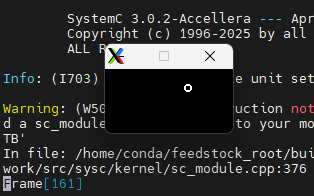
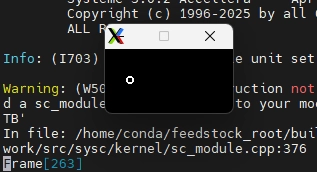
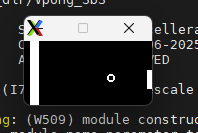
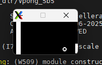

# BFM / TLM / FSM

## 05. BFM (Bus Functional Model), TLM

### Step 0. BFM이란?

- **정의**: 어떤 장치를 **"내부 구현"이 아니라 "인터페이스에서의 동작(기능)"만으로** 모델링한 것.
    - "이 장치가 **내부적으로 어떻게 만들어졌는지**는 신경 안 써. **인터페이스에서 뭘 주고받고, 그 결과가 뭔지**만 맞으면 돼." 가 핵심 아이디어.
- **용도**: 테스트벤치에서 **진짜 장치를 대신 세워두는 빠른 대역 배우.** 실제 칩을 RTL로 다 구현하지 않고, "요청 오면 이렇게 응답한다"만 흉내내 검증 속도를 높임.
- BFM 구현 (`Display_Thread`), Functional 모델
    
    ```c
    wait(p_tick.posedge_event());   // 1. 인터페이스: "픽셀 왔다" (Valid)
    busy.write(true);               //    "받는 중" (Ready 내림)
    wait(p_tick.negedge_event());
    x = x_pos.read(); y = y_pos.read();      // 2. 기능: 좌표 읽어서
    SDL_RenderDrawPoint(renderer, x, y);     //          점 그린다
    busy.write(false);              // 3 "완료"
    ```
    
    - **기능(function)** : "픽셀 받으면 화면에 그린다"를 정확히 재현
    - **내부 구현** : GDRAM 메모리, 버스 디코딩, RS/RW/E 타이밍 등은 **모두 생략**
    - 04의 칩 모델(`sc_glcd128x64.cpp`, 297줄)이 `gMemory[2][8][64]`와 버스 사이클을 다 구현한 것과 반대.
- TLM (Transaction-Level Modeling)
    - 정의 : 핀(배선)이 어떻게 꿈틀거리는가"가 아니라 **"어떤 동작(트랜잭션)이 일어나는가"** 수준에서 모델링하는 것.
    - 추상화 수준
        
        ```c
        높음 ┌──────────────────────────────────────┐ 빠름
         ▲    Algorithm    "공이 튕긴다" (순수 C++)     ▲
         │    TLM          "픽셀 그려" (트랜잭션)  05   │
         │    Cycle Accurate  클럭 단위 정확       04   │
         ▼    RTL/Gate     게이트·배선까지              ▼
        낮음 └─────────────────────────────────────┘  느림
        
        /*    [진짜 장치를 어떻게 흉내낼까?]
                            │
              ┌─────────────┴─────────────┐
           내부까지 구현            기능만 흉내 (BFM)
           Cycle-Accurate(04)      TLM 스타일로 작성 (05)
           느림, 정밀               Display_Thread
           프로토콜 검증            빠름, 로직 검증
        */
        ```
        
    - 용도
        
        
        |  | Cycle-Accurate (04) | TLM (05) |
        | --- | --- | --- |
        | 정밀도 | 클럭·배선까지 정확 | 동작만 (타이밍 대충) |
        | 속도 | 느림 (픽셀당 18클럭) | 빠름 (~0클럭) |
        | 언제 | 프로토콜/타이밍 검증 | **기능 로직 빠르게 검증** |

### Step 1. 구동

- 03, 04, 05에서의 변화는 아래와 같다.
    
    
    | 단계 | RTL (우리 칩) | 검증 모델 |
    | --- | --- | --- |
    | **03** | 탁구대 중앙선 | Cycle-Accurate GLCD |
    | **04** | + **공** (v_sync, 위치, 방향, ROM) | **동일** (Cycle-Accurate) |
    | **05** | 04와 동일 + 공 버그수정 | **BFM/TLM** (← 여기서 검증 모델이 바뀜) |
- 활용 코드는 아래와 같다. (TLM 스타일로 짠 BFM.)
    - `pong_SbS.V` (수정된 04와 동일)
        
        ```c
        //
        // Filename: pong_SbS.v
        // Purpose: Draw Table
        //
        
        `define TABLE_WIDTH     128
        `define TABLE_HEIGHT    64
        
        module pong_SbS(clk, reset, x_pos, y_pos, pixel, p_tick, busy);
        input           clk;
        input           reset;
        output [6:0]    x_pos;
        output [5:0]    y_pos;
        output          pixel;
        output          p_tick;
        input           busy;
        
            reg [6:0]   x_pos;
            reg [5:0]   y_pos;
            reg         pixel;
            reg         p_tick;
        
            reg         v_sync;
        
            // FSM //////////////////////////////////////////////////////////
            reg [1:0]   State;
            parameter sWait  = 2'b01;
            parameter sPixel = 2'b10;
        
            always @(posedge clk or posedge reset)
            begin
                if (reset)
                begin
                    x_pos  <= 127;
                    y_pos  <= 63;
                    p_tick <= 0;
                    v_sync <= 0;
                    State <= sWait;
                end
                else
                    case(State)
                    sWait:
                        begin
                            if (!busy)
                            begin
                                x_pos <= x_pos + 1;
                                if (x_pos==127)
                                begin
                                    y_pos <= y_pos + 1;
                                    if(y_pos==63)
                                       v_sync <= 1;
                                end
                                p_tick <= 1'b1;
                                State <= sPixel;
                            end
                        end
                    sPixel:
                        begin
                            v_sync <= 0;
                            if (busy)
                            begin
                                p_tick <= 1'b0;
                                State <= sWait;
                            end
                        end
                    default:
                        State <= sWait;
                    endcase
            end
        
            // Update Ball position -----------------------------------------
            reg [6:0] x_ball;
            reg [5:0] y_ball;
            always @(posedge clk or posedge reset)
            begin
                if (reset)
                begin
                    x_ball <= 0;
                    y_ball <= 50;
                end
                else
                begin
                    if (v_sync)
                    begin
                        if (sign_x) x_ball <= x_ball - 1;
                        else        x_ball <= x_ball + 1;
                        if (sign_y) y_ball <= y_ball - 1;
                        else        y_ball <= y_ball + 1;
                    end;
                end
            end
        
            reg sign_x;
            reg sign_y;
            always @(posedge clk or posedge reset)
            begin
                if (reset)
                begin
                    sign_x <= 0;
                    sign_y <= 0;
                end
                else if (v_sync)
                begin
                    if (x_ball==119)    sign_x <= 1;
                    else if (x_ball==0) sign_x <= 0;
                    if (y_ball==55)     sign_y <= 1;
                    else if (y_ball==0) sign_y <= 0;
                end
            end
        
            // Ball Image ROM -----------------------------------------------
            reg  [7:0]  rom_data;
            always @*
            begin
                case(rom_addr)
                    3'b000 :    rom_data = 8'b00111100; //   ****  
                    3'b001 :    rom_data = 8'b01111110; //  ******
                    3'b010 :    rom_data = 8'b11000011; // **    **
                    3'b011 :    rom_data = 8'b11000011; // **    **
                    3'b100 :    rom_data = 8'b11000011; // **    **
                    3'b101 :    rom_data = 8'b11000011; // **    **
                    3'b110 :    rom_data = 8'b01111110; //  ******
                    3'b111 :    rom_data = 8'b00111100; //   ****
                endcase
            end
            // Ball rom address ---------------------------------------------
            wire [2:0]  rom_addr;
            assign rom_addr = y_pos-y_ball;
            // Ball rom bit-position ----------------------------------------
            wire [2:0]  rom_bit;
            assign rom_bit = x_pos - x_ball;
        
        //    assign pixel = rom_data[rom_bit];
            always @*
                if ((x_ball<=x_pos) && ((x_ball+7)>=x_pos) &&
                    (y_ball<=y_pos) && ((y_ball+7)>=y_pos))
                    pixel = rom_data[rom_bit];
                else
                    pixel = 0;
        endmodule
        
        ```
        
    - `sc_glcd128x64_TB` (04까지는 TB사용)
        
        ```c
        //
        // Filename: sc_glcd128x64_TB.cpp
        //
        
        #include <unistd.h>
        #include "sc_glcd128x64_TB.h"
        
        #define SET_INST(_CS1_,_CS2_,_INST_)    \
        {                                       \
            RS.write(false);                    \
            RW.write(false);                    \
            CS1.write(_CS1_? false:true);       \
            CS2.write(_CS2_? false:true);       \
            DBi.write(_INST_);                  \
            wait(clk.posedge_event());          \
            E.write(true);                      \
            wait(clk.posedge_event());          \
            E.write(false);                     \
            wait(clk.posedge_event());          \
        }
        #define SET_DATA(_CS1_,_CS2_,_DATA_)    \
        {                                       \
            RS.write(true);                     \
            RW.write(false);                    \
            CS1.write(_CS1_? false:true);       \
            CS2.write(_CS2_? false:true);       \
            DBi.write(_DATA_);                  \
            wait(clk.posedge_event());          \
            E.write(true);                      \
            wait(clk.posedge_event());          \
            E.write(false);                     \
            wait(clk.posedge_event());          \
        }
        #define GET_DATA(_CS1_,_CS2_,_DATA_)    \
        {                                       \
            RS.write(true);                     \
            RW.write(true);                     \
            CS1.write(_CS1_? false:true);       \
            CS2.write(_CS2_? false:true);       \
            wait(clk.posedge_event());          \
            E.write(true);                      \
            wait(clk.posedge_event());          \
            E.write(false);                     \
            wait(clk.posedge_event());          \
            _DATA_ = DBo.read();                \
        }
        #define SET_PIXEL(_X_,_Y_,_01_)         \
        {                                       \
            SET_INST(true, true, INST_SET_Z_ADDRESS|0x00) \
            SET_INST((_Y_<64? true:false), (_Y_>63? true:false), INST_SET_Y_ADDRESS|(_Y_%64)) \
            SET_INST((_Y_<64? true:false), (_Y_>63? true:false), INST_SET_X_ADDRESS|(_X_/8)) \
            sc_uint<8>  _GD_DATA_; \
            GET_DATA((_Y_<64? true:false), (_Y_>63? true:false), _GD_DATA_) \
            if (_01_) _GD_DATA_ |=  (0x01<<(x%8)); \
            else      _GD_DATA_ &= ~(0x01<<(x%8)); \
            SET_INST((_Y_<64? true:false), (_Y_>63? true:false), INST_SET_Y_ADDRESS|(_Y_%64)) \
            SET_DATA((_Y_<64? true:false), (_Y_>63? true:false), _GD_DATA_) \
        }
        
        //    SET_INST(true, true, INST_DISPLAY|0x01) \
        
        void sc_glcd128x64_TB::Test_Gen(void)
        {
            int x, y;
        
            while(true)
            {
                wait(clk.posedge_event());
                if (reset.read())
                {
                    // Reset Sequence
                    busy.write(true);
                    RS.write(false);    // Register Mode Select: Instruction(L), Data(H)
                    RW.write(true);     // Read(H), Write(L)
                    E.write(false);     // Enable @ Posedge
                    DBi.write(0x00);    // Data Bus
                    CS1.write(true);    // Chip-Select #1
                    CS2.write(true);    // Chip-Select #2
                    RST.write(true);    // Reset
                    wait(clk.posedge_event());
                    RST.write(false);   // Reset(L)
                    wait(clk.posedge_event());
                    wait(clk.posedge_event());
                    RST.write(true);
                    wait(clk.posedge_event());
                    SET_INST(true, true, INST_DISPLAY|0x01) // DISPLAY ON
                    busy.write(false);
                    continue;
                }
        
                if (p_tick.read())
                {
                    busy.write(true);
                    y = x_pos.read();
                    x = y_pos.read();
                    if (pixel.read())
                        SET_PIXEL( x, y, true)
                    else
                        SET_PIXEL( x, y, false)
                   busy.write(false);
                }
            }
        }
        
        ```
        
    - `sc_glcd128x64_TLM` (05에서는 TLM사용)
        
        ```c
        //
        // Filename: sc_glcd128x64_TLM.cpp
        //
        
        #include <unistd.h>
        #include "sc_glcd128x64_TLM.h"
        
        void sc_glcd128x64_TLM::Display_Thread(void)
        {
            int x, y;
        
            busy.write(false);
        
            while(true)
            {
                // SDL QUIT event
                if (SDL_PollEvent(&event) && (event.type == SDL_QUIT))
                {
                    SDL_DestroyRenderer(renderer);
                    SDL_DestroyWindow(window);
                    SDL_Quit();
                    sc_stop();
                }
        
                wait(p_tick.posedge_event());
        
                busy.write(true);
        
                wait(p_tick.negedge_event());
        
                x = x_pos.read();
                y = y_pos.read();
                if (pixel.read())
                    SDL_SetRenderDrawColor(renderer,255,255,255,SDL_ALPHA_OPAQUE);
                else
                    SDL_SetRenderDrawColor(renderer,0,0,0,SDL_ALPHA_OPAQUE);
        
                SDL_RenderDrawPoint(renderer, x, y);
        
                if (x==127 && y==63)
                    SDL_RenderPresent(renderer);                
        
                busy.write(false);
            }
        }
        
        ```
        
- 04와 05의 차이. (같은 Transaction, 다른 표현)
    - **04 (Pin/Cycle-Accurate): 트랜잭션 1개 = 18클럭**
    
    ```cpp
    SET_PIXEL(x, y, 1) {
        SET_INST(Z주소)  → RS=0; E=1; 대기; E=0; 대기;   // 3클럭
        SET_INST(Y주소)  → ...                            // 3클럭
        SET_INST(X주소)  → ...                            // 3클럭
        GET_DATA()       → E토글, DBo 읽기                // 3클럭
        비트 하나 수정
        SET_INST(Y주소)  → ...                            // 3클럭
        SET_DATA(data)   → ...                            // 3클럭
    }   // 총 18클럭, 핀들이 실제로 어떻게 움직이는지 다 시뮬
    
    /*
    RTL(우리칩) ──x_pos,y_pos,pixel,p_tick,busy──▶ [어댑터 sc_glcd128x64_TB]
                                                        │
                                        RS,RW,E,DBi,DBo,CS1,CS2,RST  ← 버스 핀 8개
                                                        ▼
                                              [칩 모델 sc_glcd128x64]  ← 297줄!
                                              gMemory[2][8][64], 버스 디코딩
                                                        ▼
                                                     SDL 화면
    */
    ```
    
    - **05 (Transaction-Level): 트랜잭션 1개 = 바로 그림**
    
    ```cpp
    wait(p_tick.posedge_event());   // "픽셀 나감" (핸드셰이크만)
    busy.write(true);
    wait(p_tick.negedge_event());
    x = x_pos.read();  y = y_pos.read();     // ★ 그냥 값 읽고
    SDL_RenderDrawPoint(renderer, x, y);     // ★ 바로 그림
    busy.write(false);
    
    /*
    RTL(우리칩) ──x_pos,y_pos,pixel,p_tick,busy──▶ [TLM sc_glcd128x64_TLM]
                                                        ▼
                                                     SDL 화면
    */
    ```
    
    **"핀이 어떻게 움직여서 데이터가 전달되는가"를 건너뛰고, "결과적으로 픽셀이 찍힌다"만** 표현.
    

|  | 언제 쓰나 | 검증 대상 |
| --- | --- | --- |
| **Pin-Accurate (04)** | **버스 드라이버/프로토콜 자체를 검증**할 때 | "데이터시트대로 RS/RW/E를 두드리나?" |
| **TLM (05)** | 프로토콜은 믿고, **상위 로직을 빠르게 검증**할 때 | "게임 로직이 맞나? 공이 튕기나?" |
- 구동
    
    ```c
    (chip-eda) pgh@turtle:~/project/PGH_Chip_Open_Source/work/04_Ball/simulation$ cd ~/project/PGH_Chip_Open_Source/work/05_Ball_GLCD_BFM/simulation
    (chip-eda) pgh@turtle:~/project/PGH_Chip_Open_Source/work/05_Ball_GLCD_BFM/simulation$ make run SYSTEMC=$CONDA_PREFIX
    ./obj_dir/Vpong_SbS
    
            SystemC 3.0.2-Accellera --- Apr  2 2026 20:35:08
            Copyright (c) 1996-2025 by all Contributors,
            ALL RIGHTS RESERVED
    
    ```
    
- 결과 확인
    
    
    
    
    

### Step 2. 결과 분석



- 속도 향상. (Frame 올라가는 수가 훨씬 빨라짐.)
    - **트랜잭션**: 의미가 있는 동작 하나, 여기선, (X,Y)에 픽셀 그리라는 동작이 트랜잭션 단위.
    - Bus 동작을 흉내낸, 18클럭을 건너뛰고 결과만 표현하므로 빨라짐.
    - 프로토콜이 맞음을 가정하고, 트랜잭션을 추상화하여 검증 속도 향상된 것을 확인 가능.

## 06. Table Ball Paddle

### Step 1. 전체 구조 확인

```c
┌───────────────────────────────────────────────────────────────┐
  sc_pong_SbS_TB (최상위)                                    
                                                             
   ┌─ Vpong_SbS (우리 칩) ────────┐     ┌─ sc_glcd128x64_TLM ──┐
     + up,down 입력 포트 (신규)           [Display_Thread]    
     + paddle 위치 레지스터         ◀──    화면 그림 (05과 동일)
     + pixel 합성(중앙선+공+패들)         [Button_Thread] 신규
                                   ──▶     키보드→up/down 신호 
   └──────────────────────────────┘     └──────────────────────┘
          ▲   x_pos,y_pos,pixel,p_tick,busy   +  up,down   
└───────────────────────────────────────────────────────────────┘

/*즉, 이를 보다 구체적으로 살펴보면 전체 흐름은 아래와 같다.
Vpong_SbS (칩)                sc_glcd128x64_TLM (환경 모델, 화면 + 컨트롤러)
─────────────                ──────────────────────────
x_pos  (output) ──────────▶  x_pos  (sc_in)      "픽셀 좌표 보냄"
y_pos  (output) ──────────▶  y_pos  (sc_in)
pixel  (output) ──────────▶  pixel  (sc_in)      "이 점 흰색?"
p_tick (output) ──────────▶  p_tick (sc_in)      "지금 유효!"

busy   (input)  ◀──────────  busy   (sc_out)     "나 그리는 중"
up     (input)  ◀──────────  up     (sc_out)     "↑ 눌림"    ← ★
down   (input)  ◀──────────  down   (sc_out)     "↓ 눌림"    ← ★

이때, 키보드로 부터의 외부 신호 up/down도 Button_Thread을 통해,
환경 모델(TLM)이 칩에게 보내는 신호.

즉, 키보드에서 위 혹은 아래 버튼이 눌리면, sc_glcd128x64_TLM의 Button_Thread가 해당 신호
를 up/down으로 변경해 Vpong_SbS에 전달하고, 해당 신호는 Vpong_SbS에서 패들이동에 활용
이후, raster 스캔해서, Vpong_SbS에서 x_pos, y_pos, pixel 신호를 생성하고 sc_glcd128x64_TLM
에 전달하면 sc_glcd128x64_TLM는 해당 신호를 받아, Display_thread가 점 찍기 및 busy 신호를
생성한다. busy신호는 다시 Vpong_SbS에 전달되어 다음 픽셀 타이밍을 조절하는 데 활용된다.
*/
```

- 각 신호의 역할 및 전체 구조
    - 픽셀 단위 Hand Shake
        
        
        | 신호 | 방향 | 의미 |
        | --- | --- | --- |
        | **x_pos** [6:0] | 칩→모델 | 지금 그릴 픽셀의 **가로 좌표** (0~127) |
        | **y_pos** [5:0] | 칩→모델 | **세로 좌표** (0~63) |
        | **pixel** | 칩→모델 | 그 좌표가 **흰색(1)/검정(0)** |
        | **p_tick** | 칩→모델 | **"지금 이 좌표 유효! 그려!"** (Valid) |
        | **busy** | 모델→칩 | **"나 이 픽셀 그리는 중"** (Ready의 반대) |
    - Frame 단위
        
        
        | 신호 | 의미 |
        | --- | --- |
        | **v_sync** | **"화면 8192픽셀 다 그렸다!"** (127,63 도달 시 1클럭 펄스) |
    - 전체 구조 흐름
    
    ```c
    // Pixel 하나를 그리는 Cycle
    1. 칩(sWait): busy=0 확인 → "모델이 한가하네"
    2. 칩: x_pos++, pixel 계산, p_tick=1 올림 → "5번 픽셀 그려!"
    3. 모델: p_tick=1 봄 → busy=1 올림 → "받았어, 그리는 중"
    4. 칩(sPixel): busy=1 봄 → p_tick=0 내림
    5. 모델: 점 찍음 → busy=0 내림 → "다 그렸어"
    6. 칩: busy=0 봄 → ①로 (다음 픽셀)
    
    // 프레임의 구조
    프레임 1장 = 픽셀 8192개
    ├─ 픽셀 (0,0):   [p_tick↑ -> busy↑ -> 그림 -> P_tick↓ -> busy↓]
    ├─ 픽셀 (1,0):   [p_tick↑ -> busy↑ -> 그림 -> P_tick↓ -> busy↓]
    ├─ ...
    ├─ 픽셀 (127,63): [p_tick↑ -> busy↑ -> 그림 -> P_tick↓ -> busy↓] ← 마지막
    │                                       └─▶ v_sync=1 (프레임 완료!)
    └─ (v_sync 뜨면 → 공/패들 한 칸 이동)
    
    // Signal
    busy/p_tick: 8192번 반복 (픽셀마다)
    v_sync: 프레임당 1번 (마지막 픽셀에서)
    ```
    
- TLM에 대해 다시 한번 이해를 해볼 경우, 아래와 같다.
    
    ```c
    04 (Cycle-Accurate):  입력 → [GDRAM 주소설정 → E토글 → 읽기 → 비트수정 → 쓰기] → 화면
                                 └─      내부 동작 과정을 전부 재현 (297줄)    ─┘
    
    05/06 (TLM):          입력 → [                                      ] → 화면
                                 └─ 과정 생략, 결과만 (DrawPoint 한 방) ─┘
    ```
    
    해당 과정에서, 인터페이스들간 HandShake의 경우, 동일하게 지킴.
    
- 활용 코드는 아래와 같다.
    - `pong_SbS.v`
        
        ```c
        //
        // Filename: pong_SbS.v
        // Purpose: Draw Table
        //
        
        `define TABLE_WIDTH     128
        `define TABLE_HEIGHT    64
        
        module pong_SbS(clk, reset, x_pos, y_pos, pixel, p_tick, busy, up, down);
        input           clk;
        input           reset;
        output [6:0]    x_pos;
        output [5:0]    y_pos;
        output          pixel;
        output          p_tick;
        input           busy;
        input           up;
        input           down;
        
            reg [6:0]   x_pos;
            reg [5:0]   y_pos;
            reg         pixel;
            reg         p_tick;
        
            reg         v_sync;
        
            // FSM //////////////////////////////////////////////////////////
            reg [1:0]   State;
            parameter sWait  = 2'b01;
            parameter sPixel = 2'b10;
        
            always @(posedge clk or posedge reset)
            begin
                if (reset)
                begin
                    x_pos  <= 127;
                    y_pos  <= 63;
                    p_tick <= 0;
                    v_sync <= 0;
                    State <= sWait;
                end
                else
                    case(State)
                    sWait:
                        begin
                            if (!busy)
                            begin
                                x_pos <= x_pos + 1;
                                if (x_pos==127)
                                begin
                                    y_pos <= y_pos + 1;
                                    if(y_pos==63)
                                       v_sync <= 1;
                                end
                                p_tick <= 1'b1;
                                State <= sPixel;
                            end
                        end
                    sPixel:
                        begin
                            v_sync <= 0;
                            if (busy)
                            begin
                                p_tick <= 1'b0;
                                State <= sWait;
                            end
                        end
                    default:
                        State <= sWait;
                    endcase
            end
        
            // Update Ball position -----------------------------------------
            reg [6:0] x_ball;
            reg [5:0] y_ball;
            always @(posedge clk or posedge reset)
            begin
                if (reset)
                begin
                    x_ball <= 0;
                    y_ball <= 50;
                end
                else
                begin
                    if (v_sync)
                    begin
                        if (sign_x) x_ball <= x_ball - 1;
                        else        x_ball <= x_ball + 1;
                        if (sign_y) y_ball <= y_ball - 1;
                        else        y_ball <= y_ball + 1;
                    end;
                end
            end
        
            reg sign_x;
            reg sign_y;
            always @(posedge clk or posedge reset)
            begin
                if (reset)
                begin
                    sign_x <= 0;
                    sign_y <= 0;
                end
                else if (v_sync)
                begin
                    if (x_ball==119)    sign_x <= 1;
                    else if (x_ball==0) sign_x <= 0;
                    if (y_ball==55)     sign_y <= 1;
                    else if (y_ball==0) sign_y <= 0;
                end
            end
        
            // Ball Image ROM -----------------------------------------------
            reg  [7:0]  rom_data;
            always @*
            begin
                case(rom_addr)
                    3'b000 :    rom_data = 8'b00111100; //   ****  
                    3'b001 :    rom_data = 8'b01111110; //  ******
                    3'b010 :    rom_data = 8'b11000011; // **    **
                    3'b011 :    rom_data = 8'b11000011; // **    **
                    3'b100 :    rom_data = 8'b11000011; // **    **
                    3'b101 :    rom_data = 8'b11000011; // **    **
                    3'b110 :    rom_data = 8'b01111110; //  ******
                    3'b111 :    rom_data = 8'b00111100; //   ****
                endcase
            end
            // Ball rom address ---------------------------------------------
            wire [2:0]  rom_addr;
            assign rom_addr = y_pos-y_ball;
            // Ball rom bit-position ----------------------------------------
            wire [2:0]  rom_bit;
            assign rom_bit = x_pos - x_ball;
        
            // Paddle Postion -----------------------------------------------
            reg [5:0]   paddle;
            always @(posedge clk or posedge reset)
            begin
                if (reset)
                begin
                    paddle <= 0;
                end
                else
                begin
                    if (up && paddle > 0 && v_sync)
                        paddle <= paddle - 1;
                    if (down && paddle < 44 && v_sync)
                        paddle <= paddle + 1;
                end
            end
        
            // Table --------------------------------------------------------
            wire pixel_table = ((x_pos>5) && (x_pos<15))? 1:0;
            // Ball ---------------------------------------------------------
            reg pixel_ball;
            always @*
                if ((x_ball<=x_pos) && ((x_ball+7)>=x_pos) &&
                    (y_ball<=y_pos) && ((y_ball+7)>=y_pos))
                    pixel_ball = rom_data[rom_bit];
                else
                    pixel_ball = 0;
            // Paddle -------------------------------------------------------
            wire pixel_paddle;
            assign pixel_paddle = ((x_pos>122) && (y_pos>paddle) && (y_pos<(paddle+20)))? 1:0;
        
            // Pixel --------------------------------------------------------
            assign pixel = (pixel_table ^ pixel_ball) | pixel_paddle;
        
        endmodule
        
        ```
        
    - `sc_glcdx64_TML.cpp`
        
        ```c
        //
        // Filename: sc_glcd128x64_TLM.cpp
        //
        
        #include <unistd.h>
        #include "sc_glcd128x64_TLM.h"
        
        void sc_glcd128x64_TLM::Button_Thread(void)
        {
            SDL_Event event;
            bool quit = false;
        
            up.write(false);
            down.write(false);
        
            while(!quit)
            {
                if (SDL_PollEvent(&event))
                {
                    switch (event.type)
                    {
                    case SDL_QUIT:
                        quit = true;
                        break;
                    case SDL_KEYDOWN:
                        //std::cout << "Key pressed: " << SDL_GetKeyName(event.key.keysym.sym) << std::endl;
                        switch( event.key.keysym.sym )
                        {
                            case SDLK_UP:
                                up.write(true);
                                break;
                            case SDLK_DOWN:
                                down.write(true);
                                break;
                            case SDLK_r:
                                goto EXIT;
                                break;
                            default:
                                break;
                        }
                        //SDL_FlushEvents(SDL_KEYDOWN, SDL_KEYUP);
                        break;
                    case SDL_KEYUP:
                        //std::cout << "Key released: " << SDL_GetKeyName(event.key.keysym.sym) << std::endl;
                        switch( event.key.keysym.sym )
                        {
                            case SDLK_UP:
                                up.write(false);
                                break;
                            case SDLK_DOWN:
                                down.write(false);
                                break;
                            default:
                                break;
                        }
                        //SDL_FlushEvents(SDL_KEYDOWN, SDL_KEYUP);
                        break;
                    default:
                        break;
                    }
                }
                else
                    wait(100, SC_NS);
            }
        
            EXIT:
            SDL_DestroyRenderer(renderer);
            SDL_DestroyWindow(window);
            SDL_Quit();
            sc_stop();
        }
        
        void sc_glcd128x64_TLM::Display_Thread(void)
        {
            int x, y;
        
            busy.write(false);
        
            while(true)
            {
                wait(p_tick.posedge_event());
        
                busy.write(true);
        
                wait(p_tick.negedge_event());
        
                x = x_pos.read();
                y = y_pos.read();
                if (pixel.read())
                    SDL_SetRenderDrawColor(renderer,255,255,255,SDL_ALPHA_OPAQUE);
                else
                    SDL_SetRenderDrawColor(renderer,0,0,0,SDL_ALPHA_OPAQUE);
        
                SDL_RenderDrawPoint(renderer, x, y);
        
                if (x==127 && y==63)
                    SDL_RenderPresent(renderer);                
        
                busy.write(false);
            }
        }
        
        ```
        
    - `sc_pong_SbS_TB.h`
        
        ```cpp
        //
        // Filename: sc_pong_SbS_TB.h
        //
        
        #ifndef _SC_PONG_SBS_TB_H_
        #define _SC_PONG_SBS_TB_H_
        
        #include <systemc.h>
        #ifdef VCD_TRACE_DUT_VERILOG
        #include <verilated_vcd_sc.h>
        #endif
        
        #include "Vpong_SbS.h"
        #include "sc_glcd128x64_TLM.h"
        
        SC_MODULE(sc_pong_SbS_TB)
        {
            sc_clock                clk;
            sc_signal<bool>         reset;
            sc_signal<bool>         pixel;
            sc_signal<sc_uint<7> >  x_pos;
            sc_signal<sc_uint<6> >  y_pos;
        
            sc_signal<bool>         p_tick;
            sc_signal<bool>         busy;
        
            sc_signal<bool>         up;
            sc_signal<bool>         down;
        
            Vpong_SbS*              u_pong_SbS;
            sc_glcd128x64_TLM*      u_sc_glcd128x64_TLM;
        
        #ifdef  VCD_TRACE_TEST_TB
            sc_trace_file* fp;  // VCD file
        #endif
        
        #ifdef VCD_TRACE_DUT_VERILOG
            VerilatedVcdSc*     tfp;    // Verilator VCD
        #endif
        
            void Test_Gen(void);
        
            SC_CTOR(sc_pong_SbS_TB):clk("clk", 100, SC_NS, 0.5, 0.0, SC_NS, false)
            {
                SC_THREAD(Test_Gen);
                sensitive << clk;
        
                // Instantiate DUT --------------------------------
                u_pong_SbS = new Vpong_SbS("u_pong_SbS");
                u_pong_SbS->clk(clk);
                u_pong_SbS->reset(reset);
                u_pong_SbS->x_pos(x_pos);
                u_pong_SbS->y_pos(y_pos);
                u_pong_SbS->pixel(pixel);
                u_pong_SbS->p_tick(p_tick);
                u_pong_SbS->busy(busy);
                u_pong_SbS->up(up);
                u_pong_SbS->down(down);
                // Instantiate Display Device model ---------------
                u_sc_glcd128x64_TLM = new sc_glcd128x64_TLM("u_sc_glcd128x64_TLM");
                u_sc_glcd128x64_TLM->reset(reset);
                u_sc_glcd128x64_TLM->x_pos(x_pos);
                u_sc_glcd128x64_TLM->y_pos(y_pos);
                u_sc_glcd128x64_TLM->pixel(pixel);
                u_sc_glcd128x64_TLM->p_tick(p_tick);
                u_sc_glcd128x64_TLM->busy(busy);
                u_sc_glcd128x64_TLM->up(up);
                u_sc_glcd128x64_TLM->down(down);
        
        #ifdef VCD_TRACE_TEST_TB
                // VCD Trace
                fp = sc_create_vcd_trace_file("sc_pong_SbS_TB");
                fp->set_time_unit(100, SC_PS);
                sc_trace(fp, clk,   "clk");
                sc_trace(fp, reset, "reset");
                sc_trace(fp, x_pos, "x_pos");
                sc_trace(fp, y_pos, "y_pos");
                sc_trace(fp, pixel, "pixel");
                sc_trace(fp, p_tick,"p_tick");
                sc_trace(fp, busy,  "busy");
                sc_trace(fp, up,    "up");
                sc_trace(fp, down,  "down");
        #endif
        
        #ifdef VCD_TRACE_DUT_VERILOG
                // Trace Verilated Verilog internals
                Verilated::traceEverOn(true);
        
                tfp = new VerilatedVcdSc;
                sc_start(SC_ZERO_TIME);
                u_pong_SbS->trace(tfp, 99);  // Trace levels of hierarchy
                tfp->open("Vpong_SbS.vcd");
        #endif
            }
        };
        #endif
        
        ```
        
    - `sc_pong_SbS_TB.cpp`
        
        ```cpp
        //
        // Filename: sc_pong_SbS_TB.cpp
        //
        
        #include "sc_pong_SbS_TB.h"
        
        void sc_pong_SbS_TB::Test_Gen()
        {
            int nFrame = 0;
            reset.write(true);
        
            wait(clk.posedge_event());
            wait(clk.posedge_event());
            wait(clk.posedge_event());
        
            reset.write(false);
        
            while(true)
            {
                wait(clk.posedge_event());
        
                if (p_tick.read() && x_pos.read()==127 && y_pos.read()==63)
                    fprintf(stderr, "Frame[%d]\r", nFrame++);
            }
        }
        
        ```
        
- Testbench 분석 (`sc_pong_SbS_TB.h`/`.cpp`)
    
    Testbench의 구조는 크게 4가지로 구분 가능
    
    - 신호 선언
        
        ```c
        sc_clock        clk;      // 클럭 생성기 (100ns 주기)
        sc_signal<bool> reset, pixel, p_tick, busy, up, down;
        sc_signal<sc_uint<7>> x_pos;
        sc_signal<sc_uint<6>> y_pos;
        ```
        
    - 인스턴스화
        
        ```c
        Vpong_SbS*         u_pong_SbS;          // 우리 칩
        sc_glcd128x64_TLM* u_sc_glcd128x64_TLM; // 환경 모델
        ```
        
    - 배선 (`SC_CTOR` 내부)
        
        ```c
        // 칩을 만들고 전선 연결
        u_pong_SbS = new Vpong_SbS("u_pong_SbS");
        u_pong_SbS->x_pos(x_pos);    // 칩의 x_pos 핀 ── x_pos 전선
        u_pong_SbS->busy(busy);      // 칩의 busy 핀 ── busy 전선
        u_pong_SbS->up(up);          // ...
           ⋮
        // 모델을 만들고 같은 전선에 연결
        u_sc_glcd128x64_TLM = new sc_glcd128x64_TLM("...");
        u_sc_glcd128x64_TLM->x_pos(x_pos);   // ★ 같은 x_pos 전선 → 칩과 모델이 이어짐!
        u_sc_glcd128x64_TLM->busy(busy);
        u_sc_glcd128x64_TLM->up(up);
        
        // 해당 과정에서 칩의 x_pos와 모델의 x_pos를 같은 x_pos 전선에 물림
        // → 둘이 연결됨. 이게 배선(binding).
        
        u_pong_SbS.x_pos ──┐
                           ├── [x_pos 전선] ── 둘이 연결
        u_sc_glcd..x_pos ──┘
        
        /* 즉, 실제 Tb 안에서, x_pos는 세 개가 나옴.
        sc_signal<sc_uint<7>>  x_pos;              // 1. 전선 (wire)
        
        u_pong_SbS->x_pos(x_pos);                  // 2. 칩의 포트 ← 1. 에 연결
        u_sc_glcd128x64_TLM->x_pos(x_pos);         // 3. 모델의 포트 ← 1. 에 연결 
        
             칩(Vpong_SbS)                    모델(TLM)
           ┌───────────────┐               ┌──────────────┐
                   2.        x_pos 전선(1.)       3.           
              x_pos(sc_out)────────────────  x_pos(sc_in)  
              "값을 씀"                      "값을 읽음"   
           └───────────────┘               └──────────────┘
                칩이 write         →        모델이 read
        
        된 구조.
        */
        ```
        
        - 전선은 하나지만 **방향은 포트가 정함.**
            - 칩의 `x_pos` = **`sc_out`** → **전선에 값을 씀** (`x_pos.write(5)`)
            - 모델의 `x_pos` = **`sc_in`** → **전선에서 값을 읽음** (`x_pos.read()`)
        
        ```
        칩: x_pos.write(5) ──▶ [x_pos 전선 = 5] ──▶ 모델: x_pos.read() → 5
        ```
        
    - 자극 생성 (`Test_Gen`)
        
        `.cpp`를 보면 TB가 실제로 **하는 일은 단, 두 가지**.
        
        ```c
        void sc_pong_SbS_TB::Test_Gen()
        {
            reset.write(true);              // 1. 리셋 걸고
            wait(clk.posedge_event()) × 3;  //    3클럭 유지
            reset.write(false);             //    리셋 해제
        
            while(true) {                   // 2. 프레임 카운터
                wait(clk.posedge_event());
                if (p_tick && x_pos==127 && y_pos==63)   // 화면 끝 도달?
                    fprintf(stderr, "Frame[%d]\r", nFrame++);  // 프레임 수 출력
            }
        }
        
        // 즉, TB가 능동적으로 하는 건 리셋 시퀀스 + 프레임 세기뿐. 
        // 나머지(up/down, 화면)는 모델(TLM)이 알아서 함.
        // 이, TB덕분에  터미널에 Frame[0], Frame[1]... 이 올라감.
        ```
        
- RTL (`pong_SbS.v`) : 05에 비하여, 많은 변화가 존재
    
    
    | 추가 | 코드 |
    | --- | --- |
    | **입력 포트** | `input up, down;` ← 진짜 칩 핀 |
    | **패들 위치** | `reg [5:0] paddle;` — up/down + v_sync에 따라 이동 |
    | **화면 합성** | 중앙선·공·패들을 하나로 합침 |
    
    ```c
    // 패들 이동 (v_sync 게이팅 = 프레임당 한 칸)
    if (up   && paddle>0  && v_sync) paddle <= paddle - 1;
    if (down && paddle<44 && v_sync) paddle <= paddle + 1;
    
    // 세 그림을 합성
    wire pixel_table  = (x_pos>5 && x_pos<15);                       // 중앙선
         pixel_ball   = (공 영역) ? rom_data[rom_bit] : 0;           // 공
    wire pixel_paddle = (x_pos>122 && paddle<y_pos<paddle+20);       // 오른쪽 패들
    assign pixel = (pixel_table ^ pixel_ball) | pixel_paddle;        // 합성
    ```
    
- TLM/BFM 모델 : Thread가 하나 더 생김.
    - 05의 경우, Thread가 1개 (Display_Thread)였으나, 06에서는 Button_Thread가 하나 더 생김
        - Thread란, 독립적으로 동시에 돌아가는 실행 흐름을 이야기함.
        - SystemC에서 `SC_THREAD`로 등록한 함수는 **다른 프로세스들과 병렬**로 돌아감.
            
            ```c
            SC_THREAD(Display_Thread);   // 스레드 A: 화면 그리기
            SC_THREAD(Button_Thread);    // 스레드 B: 키보드 읽기
            ```
            
        - 위와 같다면, 둘이 동시에 도므로 화면이 갱신되는 와중에도 키 입력을 받을 수 있음.
    - Button_Thread가 하는 일
        
        ```c
        if (SDL_PollEvent(&event)) {
            case SDL_KEYDOWN:
                SDLK_UP   → up.write(true);      // ↑ 누름
                SDLK_DOWN → down.write(true);    // ↓ 누름
                SDLK_r    → goto EXIT;           // r = 종료
            case SDL_KEYUP:
                SDLK_UP   → up.write(false);     // ↑ 뗌
                SDLK_DOWN → down.write(false);
        }
        else wait(100, SC_NS);   // 키 없으면 잠깐 대기
        ```
        
    - 나머지의 경우, 05와 거의 유사함.

### Step2. 구동

- 구동
    
    ```c
    (base) pgh@turtle:~$ conda deactivate
    coopgh@turtle:~$ conda activate chip-eda
    (chip-eda) pgh@turtle:~$ export LD_LIBRARY_PATH=$CONDA_PREFIX/lib:$LD_LIBRARY_PATH
    (chip-eda) pgh@turtle:~$ cd ~/project/PGH_Chip_Open_Source/work/06_Table_Ball_Paddle/simulation
    (chip-eda) pgh@turtle:~/project/PGH_Chip_Open_Source/work/06_Table_Ball_Paddle/simulation$ make run SYSTEMC=$CONDA_PREFIX./obj_dir/Vpong_SbS
    
            SystemC 3.0.2-Accellera --- Apr  2 2026 20:35:08
            Copyright (c) 1996-2025 by all Contributors,
            ALL RIGHTS RESERVED
    
    Info: (I703) tracing timescale unit set: 100 ps (sc_pong_SbS_TB.vcd)
    
    Warning: (W509) module construction not properly completed: did you forget to add a sc_module_name parameter to your module constructor?: module 'u_sc_pong_SbS_TB'
    In file: /home/conda/feedstock_root/build_artifacts/systemc-split_1775161875211/work/src/sysc/kernel/sc_module.cpp:376
    ```
    
- 결과 확인
    
    
    
    
    
    
- SDL 창을 통해, 키보드로부터 입력된 up/down 신호를 활용하여 패들을 위, 아래로 이동 가능.
    - up/down은 실제 Chip핀으로, 실제 Chip에서 버튼으로 연결될 입력.
- TLM을 활용하여, 속도가 빠르며, `v_sync` 의 경우 Frame 당 한번 Toggle됨.
- 이때, Paddle 및 공도 Frame 당 한 칸씩만 움직임.
- 화면 합성 과정에서 선과, 공을 XOR하였으며 이를 통해 공이 선을 지나는 경우, 공의 색이 반전되어 공을 확인 가능.