# Synthesis / GDS / Chip-top

## 07. Synthesis & Verilog VPI

### Step 1. 전체 구조 확인

- 흐름 및 도구
    - 프로젝트 전체 흐름
        
        ```
        RTL → 합성(Yosys) → 배치(GrayWolf) → 라우팅(QRouter)→ 레이아웃(Magic) 
        → LVS 검증(Netgen) → 시뮬(ngSpice)
        
        전체를 QFlow가 묶고, 검증에 iverilog/verilator/gtkwave, 
        시스템검증에 SystemC 사용.
        
        흐름
        ┌─── 논리 합성 (Logic Synthesis) ───┐   ┌─── 물리 설계 (Physical Design) ───┐
           탁구7                                  탁구8                            
                                                                                 
           Yosys → ABC                            Floorplan → Place → Route        
           "어떤 셀? 어떻게 연결?"                 "셀을 어디에? 배선을 어디로?"      
                                                                                 
           결과: 네트리스트 (좌표 없음)            결과: 레이아웃 (좌표 있음)         
                  GrayWolf ✗                             GrayWolf ✓ QRouter ✓      
        └───────────────────────────────────┘   └───────────────────────────────────┘
        ```
        
    - 도구
        
        
        | 백엔드(APR) | 시뮬/검증 | 레이아웃 |
        | --- | --- | --- |
        | `yosys`,`graywolf`,`qrouter`, `qflow(+etri050)`, `netgen` | `verilator`, `systemc`, `iverilog`, `gtkwave`, `ngspice`, `SDL2` | `magic`, `klayout` |
    - BackGround (Standard Cell, GDSII)
        
        
        | 개념 | 정체 |
        | --- | --- |
        | **Standard Cell** | 미리 설계된 **논리 게이트 블록** (INV, NAND, DFF...). **높이가 똑같아서** 줄지어 배치 가능. 레고 블록 같은 거 |
        | **.mag** | 그 셀의 **물리 레이아웃**을 담은 **Magic 전용 파일 형식** (텍스트) |
        | **GDSII** | **업계 표준 최종 레이아웃 형식** (바이너리). 칩 공장에 넘기는 것 |
        | .lib | **Liberty 파일,** 타이밍/면적/전력을 나타냄. |
        - **관계**: 표준셀(개념) →`.mag`(Magic 작업용) →[make generate_gds] →GDSII (납품용)
        - **물리 레이아웃**을 Magic은 `.mag`로, 최종 산출은 `.gds`로 표현
    - `.mag`의 형식
        - `INVX1.mag` (예시)
            
            ```c
            magic
            tech scmos
            magscale 1 2
            timestamp 1727732874
            << nwell >>
            rect -12 134 72 252
            << ntransistor >>
            rect 20 14 24 34
            << ptransistor >>
            rect 20 186 24 226
            << ndiffusion >>
            rect 18 14 20 34
            rect 24 14 26 34
            << pdiffusion >>
            rect 18 186 20 226
            rect 24 186 26 226
            << ndcontact >>
            rect 6 14 18 34
            rect 26 14 38 34
            << pdcontact >>
            rect 6 186 18 226
            rect 26 186 38 226
            << psubstratepcontact >>
            rect -6 -6 66 6
            << nsubstratencontact >>
            rect -6 234 66 246
            << polysilicon >>
            rect 20 226 24 230
            rect 20 89 24 186
            rect 16 77 24 89
            rect 20 34 24 77
            rect 20 10 24 14
            << polycontact >>
            rect 4 77 16 89
            << metal1 >>
            rect -6 246 66 248
            rect -6 232 66 234
            rect 6 226 18 232
            rect 26 117 34 186
            rect 23 103 37 117
            rect 3 63 17 77
            rect 26 34 34 103
            rect 6 8 18 14
            rect -6 6 66 8
            rect -6 -8 66 -6
            << m1p >>
            rect 23 103 37 117
            rect 3 63 17 77
            << labels >>
            rlabel metal1 -6 -8 66 8 0 gnd
            port 3 nsew ground bidirectional abutment
            rlabel metal1 23 103 37 117 0 Y
            port 1 nsew signal output
            rlabel metal1 -6 232 66 248 0 vdd
            port 2 nsew power bidirectional abutment
            rlabel metal1 3 63 17 77 0 A
            port 0 nsew signal input
            << properties >>
            string FIXED_BBOX 0 0 60 240
            string LEFclass CORE
            string LEFsite core
            string LEFsymmetry X Y
            << end >>
            
            ```
            
        
        ```c
        magic
        tech scmos              ← 어떤 공정 기술
        << nwell >>             ← N-웰 레이어
        rect -12 134 72 252     ← 사각형 (좌표)
        << polysilicon >>       ← 폴리실리콘 (게이트)
        rect 20 89 24 186
        << ndiffusion >>        ← N 확산 영역
        ...
        ```
        
        - 레이어별로 "사각형(rect)들"의 목록을 나타낸 것.
        - 각 레이어(nwell, polysilicon, metal1, diffusion...)에 어디에 무슨 사각형을 놓을지 좌표로 작성하며, 이것이 Transistor의 실제 물리적인 모양임.
    - .`lib` 의 형식
        
        ```c
        /*
         delay model :       typ
         check model :       typ
         power model :       typ
         capacitance model : typ
         other model :       typ
        */
        library(etri05_stdcells) {
        
          delay_model : table_lookup;
          in_place_swap_mode : match_footprint;
        
          /* unit attributes */
          time_unit : "1ns";
          voltage_unit : "1V";
          current_unit : "1uA";
          pulling_resistance_unit : "1kohm";
          leakage_power_unit : "1nW";
          capacitive_load_unit (1,pf);
        
          slew_upper_threshold_pct_rise : 80;
          slew_lower_threshold_pct_rise : 20;
          slew_upper_threshold_pct_fall : 80;
          slew_lower_threshold_pct_fall : 20;
          input_threshold_pct_rise : 50;
          input_threshold_pct_fall : 50;
          output_threshold_pct_rise : 50;
          output_threshold_pct_fall : 50;
          nom_process : 1;
          nom_voltage : 5;
          nom_temperature : 25;
          operating_conditions ( typical ) {
             process : 1;
             voltage : 5;
             temperature : 25;
          }
          default_operating_conditions : typical;
        
          lu_table_template(delay_template_5x1) {
            variable_1 : input_net_transition;
            index_1 ("1000.0, 1001.0, 1002.0, 1003.0, 1004.0");
          }
          lu_table_template(delay_template_5x5) {
            variable_1 : total_output_net_capacitance;
            variable_2 : input_net_transition;
            index_1 ("1000.0, 1001.0, 1002.0, 1003.0, 1004.0");
            index_2 ("1000.0, 1001.0, 1002.0, 1003.0, 1004.0");
          }
          lu_table_template(delay_template_5x6) {
            variable_1 : total_output_net_capacitance;
            variable_2 : input_net_transition;
            index_1 ("1000.0, 1001.0, 1002.0, 1003.0, 1004.0");
            index_2 ("1000.0, 1001.0, 1002.0, 1003.0, 1004.0, 1005.0");
          }
          lu_table_template(delay_template_6x1) {
            variable_1 : input_net_transition;
            index_1 ("1000.0, 1001.0, 1002.0, 1003.0, 1004.0, 1005.0");
          }
          lu_table_template(delay_template_6x6) {
            variable_1 : total_output_net_capacitance;
            variable_2 : input_net_transition;
            index_1 ("1000.0, 1001.0, 1002.0, 1003.0, 1004.0, 1005.0");
            index_2 ("1000.0, 1001.0, 1002.0, 1003.0, 1004.0, 1005.0");
          }
          power_lut_template(energy_template_5x5) {
            variable_1 : total_output_net_capacitance;
            variable_2 : input_transition_time;
            index_1 ("1000.0, 1001.0, 1002.0, 1003.0, 1004.0");
            index_2 ("1000.0, 1001.0, 1002.0, 1003.0, 1004.0");
          }
          power_lut_template(energy_template_5x6) {
            variable_1 : total_output_net_capacitance;
            variable_2 : input_transition_time;
            index_1 ("1000.0, 1001.0, 1002.0, 1003.0, 1004.0");
            index_2 ("1000.0, 1001.0, 1002.0, 1003.0, 1004.0, 1005.0");
          }
          power_lut_template(energy_template_6x6) {
            variable_1 : total_output_net_capacitance;
            variable_2 : input_transition_time;
            index_1 ("1000.0, 1001.0, 1002.0, 1003.0, 1004.0, 1005.0");
            index_2 ("1000.0, 1001.0, 1002.0, 1003.0, 1004.0, 1005.0");
          }
          lu_table_template(hold_template_3x5) {
            variable_1 : related_pin_transition;
            variable_2 : constrained_pin_transition;
            index_1 ("1000.0, 1001.0, 1002.0");
            index_2 ("1000.0, 1001.0, 1002.0, 1003.0, 1004.0");
          }
          lu_table_template(hold_template_3x6) {
            variable_1 : related_pin_transition;
            variable_2 : constrained_pin_transition;
            index_1 ("1000.0, 1001.0, 1002.0");
            index_2 ("1000.0, 1001.0, 1002.0, 1003.0, 1004.0, 1005.0");
          }
          power_lut_template(passive_energy_template_5x1) {
            variable_1 : input_transition_time;
            index_1 ("1000.0, 1001.0, 1002.0, 1003.0, 1004.0");
          }
          power_lut_template(passive_energy_template_6x1) {
            variable_1 : input_transition_time;
            index_1 ("1000.0, 1001.0, 1002.0, 1003.0, 1004.0, 1005.0");
          }
          lu_table_template(recovery_template_3x6) {
            variable_1 : related_pin_transition;
            variable_2 : constrained_pin_transition;
            index_1 ("1000.0, 1001.0, 1002.0");
            index_2 ("1000.0, 1001.0, 1002.0, 1003.0, 1004.0, 1005.0");
          }
          lu_table_template(recovery_template_6x6) {
            variable_1 : related_pin_transition;
            variable_2 : constrained_pin_transition;
            index_1 ("1000.0, 1001.0, 1002.0, 1003.0, 1004.0, 1005.0");
            index_2 ("1000.0, 1001.0, 1002.0, 1003.0, 1004.0, 1005.0");
          }
          lu_table_template(removal_template_3x6) {
            variable_1 : related_pin_transition;
            variable_2 : constrained_pin_transition;
            index_1 ("1000.0, 1001.0, 1002.0");
            index_2 ("1000.0, 1001.0, 1002.0, 1003.0, 1004.0, 1005.0");
          }
          lu_table_template(setup_template_3x5) {
            variable_1 : related_pin_transition;
            variable_2 : constrained_pin_transition;
            index_1 ("1000.0, 1001.0, 1002.0");
            index_2 ("1000.0, 1001.0, 1002.0, 1003.0, 1004.0");
          }
          lu_table_template(setup_template_3x6) {
            variable_1 : related_pin_transition;
            variable_2 : constrained_pin_transition;
            index_1 ("1000.0, 1001.0, 1002.0");
            index_2 ("1000.0, 1001.0, 1002.0, 1003.0, 1004.0, 1005.0");
          }
        
        /* --------------- *
         * Design : AND2X1 *
         * --------------- */
        cell (AND2X1) {
        area : 288;
          cell_leakage_power : 0.1173;
          pin(A)  {
            direction : input;
            capacitance : 0.021636;
            rise_capacitance : 0.021558;
            fall_capacitance : 0.021636;
          }
          pin(B)  {
            direction : input;
            capacitance : 0.021487;
            rise_capacitance : 0.0214248;
            fall_capacitance : 0.021487;
          }
          pin(Y)  {
            direction : output;
            capacitance : 0;
            rise_capacitance : 0;
            fall_capacitance : 0;
            max_capacitance : 0.412286;
            function : "(A B)";
            timing() {
              related_pin : "A";
              timing_sense : positive_unate;
              cell_rise(delay_template_5x5) {
                index_1 ("0.025, 0.05, 0.1, 0.3, 0.6");
                index_2 ("0.06, 0.18, 0.42, 0.6, 1.2");
                values ( \
                  "0.135468, 0.140265, 0.143242, 0.13881, 0.114394", \
                  "0.183319, 0.188338, 0.192664, 0.189481, 0.166138", \
                  "0.273479, 0.278684, 0.28851, 0.283829, 0.263192", \
                  "0.633258, 0.642891, 0.649771, 0.649274, 0.635584", \
                  "1.17327, 1.18296, 1.18962, 1.18895, 1.17762");
              }
              rise_transition(delay_template_5x5) {
                index_1 ("0.025, 0.05, 0.1, 0.3, 0.6");
                index_2 ("0.06, 0.18, 0.42, 0.6, 1.2");
                values ( \
                  "0.0882, 0.0924, 0.0966, 0.099, 0.1194", \
                  "0.15, 0.153, 0.1608, 0.1644, 0.1788", \
                  "0.2802, 0.282, 0.2862, 0.2916, 0.3078", \
                  "0.816, 0.816, 0.8178, 0.8202, 0.8334", \
                  "1.6218, 1.6218, 1.6218, 1.6224, 1.6278");
              }
              cell_fall(delay_template_5x5) {
                index_1 ("0.025, 0.05, 0.1, 0.3, 0.6");
                index_2 ("0.06, 0.18, 0.42, 0.6, 1.2");
                values ( \
                  "0.167177, 0.202284, 0.265877, 0.308151, 0.430135", \
                  "0.224319, 0.259107, 0.322892, 0.36637, 0.491938", \
                  "0.335646, 0.36992, 0.433808, 0.478536, 0.607888", \
                  "0.780065, 0.81504, 0.877625, 0.920222, 1.05187", \
                  "1.44281, 1.47773, 1.54009, 1.58262, 1.71347");
              }
              fall_transition(delay_template_5x5) {
                index_1 ("0.025, 0.05, 0.1, 0.3, 0.6");
                index_2 ("0.06, 0.18, 0.42, 0.6, 1.2");
                values ( \
                  "0.0924, 0.093, 0.1026, 0.1098, 0.123", \
                  "0.1596, 0.1602, 0.1626, 0.1692, 0.1848", \
                  "0.3, 0.2994, 0.3024, 0.3054, 0.3198", \
                  "0.8784, 0.8778, 0.8778, 0.879, 0.8832", \
                  "1.7466, 1.7466, 1.7472, 1.7466, 1.7472");
              }
            }
            timing() {
              related_pin : "B";
              timing_sense : positive_unate;
              cell_rise(delay_template_5x5) {
                index_1 ("0.025, 0.05, 0.1, 0.3, 0.6");
                index_2 ("0.06, 0.18, 0.42, 0.6, 1.2");
                values ( \
                  "0.136152, 0.134149, 0.125177, 0.110593, 0.042182", \
                  "0.183231, 0.182144, 0.17419, 0.160977, 0.096749", \
                  "0.274689, 0.272369, 0.266243, 0.255334, 0.19685", \
                  "0.634485, 0.635477, 0.627876, 0.618186, 0.573561", \
                  "1.17451, 1.17509, 1.1673, 1.15736, 1.11436");
              }
              rise_transition(delay_template_5x5) {
                index_1 ("0.025, 0.05, 0.1, 0.3, 0.6");
                index_2 ("0.06, 0.18, 0.42, 0.6, 1.2");
                values ( \
                  "0.0882, 0.0924, 0.1062, 0.1128, 0.1254", \
                  "0.15, 0.1518, 0.162, 0.168, 0.1836", \
                  "0.2796, 0.2814, 0.2874, 0.2922, 0.3132", \
                  "0.8166, 0.816, 0.8166, 0.819, 0.8364", \
                  "1.6218, 1.6218, 1.6218, 1.6224, 1.6278");
              }
              cell_fall(delay_template_5x5) {
                index_1 ("0.025, 0.05, 0.1, 0.3, 0.6");
                index_2 ("0.06, 0.18, 0.42, 0.6, 1.2");
                values ( \
                  "0.184677, 0.225252, 0.305561, 0.360668, 0.524913", \
                  "0.242571, 0.284064, 0.362196, 0.417523, 0.585336", \
                  "0.35573, 0.394873, 0.473847, 0.52801, 0.697587", \
                  "0.797996, 0.837006, 0.915518, 0.968772, 1.13728", \
                  "1.46119, 1.49974, 1.57798, 1.63114, 1.79857");
              }
              fall_transition(delay_template_5x5) {
                index_1 ("0.025, 0.05, 0.1, 0.3, 0.6");
                index_2 ("0.06, 0.18, 0.42, 0.6, 1.2");
                values ( \
                  "0.0948, 0.0966, 0.1014, 0.1044, 0.1242", \
                  "0.1602, 0.1602, 0.1626, 0.168, 0.1854", \
                  "0.3012, 0.3012, 0.3024, 0.3042, 0.3144", \
                  "0.8784, 0.8784, 0.8784, 0.8784, 0.8808", \
                  "1.7466, 1.7472, 1.7472, 1.7466, 1.7472");
              }
            }
            internal_power() {
              related_pin : "A";
              rise_power(energy_template_5x5) {
                index_1 ("0.025, 0.05, 0.1, 0.3, 0.6");
                index_2 ("0.06, 0.18, 0.42, 0.6, 1.2");
                values ( \
                  "0.175608, 0.272801, 0.56388, 0.796823, 1.60912", \
                  "0.179968, 0.272459, 0.560982, 0.787696, 1.58173", \
                  "0.183768, 0.275337, 0.554906, 0.779866, 1.55639", \
                  "0.186245, 0.28634, 0.555533, 0.774262, 1.53242", \
                  "0.187373, 0.286781, 0.556141, 0.773763, 1.52594");
              }
              fall_power(energy_template_5x5) {
                index_1 ("0.025, 0.05, 0.1, 0.3, 0.6");
                index_2 ("0.06, 0.18, 0.42, 0.6, 1.2");
                values ( \
                  "0.682097, 0.778941, 1.07036, 1.30235, 2.11129", \
                  "0.689417, 0.782563, 1.06662, 1.29547, 2.08731", \
                  "0.695489, 0.786172, 1.06565, 1.29154, 2.06909", \
                  "0.695343, 0.788895, 1.06847, 1.29133, 2.05413", \
                  "0.69663, 0.790587, 1.06979, 1.29218, 2.05161");
              }
            }
            internal_power() {
              related_pin : "B";
              rise_power(energy_template_5x5) {
                index_1 ("0.025, 0.05, 0.1, 0.3, 0.6");
                index_2 ("0.06, 0.18, 0.42, 0.6, 1.2");
                values ( \
                  "0.160502, 0.275229, 0.589983, 0.855199, 1.76734", \
                  "0.167535, 0.276072, 0.579905, 0.83989, 1.73518", \
                  "0.172685, 0.276093, 0.574742, 0.828704, 1.70676", \
                  "0.177439, 0.274921, 0.574026, 0.821518, 1.67723", \
                  "0.178672, 0.274961, 0.57311, 0.818917, 1.66749");
              }
              fall_power(energy_template_5x5) {
                index_1 ("0.025, 0.05, 0.1, 0.3, 0.6");
                index_2 ("0.06, 0.18, 0.42, 0.6, 1.2");
                values ( \
                  "0.849374, 0.958819, 1.29574, 1.55392, 2.45958", \
                  "0.857665, 0.975853, 1.28725, 1.54387, 2.4309", \
                  "0.863952, 0.977353, 1.28374, 1.53701, 2.40901", \
                  "0.87666, 0.981387, 1.28499, 1.53302, 2.38627", \
                  "0.872437, 0.982928, 1.28642, 1.53364, 2.3813");
              }
            }
          }
        }
        
        /* --------------- *
         * Design : AND2X2 *
         * --------------- */
        cell (AND2X2) {
        area : 288;
          cell_leakage_power : 0.117282;
          pin(A)  {
            direction : input;
            capacitance : 0.021674;
            rise_capacitance : 0.021579;
            fall_capacitance : 0.021674;
          }
          pin(B)  {
            direction : input;
            capacitance : 0.0214177;
            rise_capacitance : 0.0214177;
            fall_capacitance : 0.0214044;
          }
          pin(Y)  {
            direction : output;
            capacitance : 0;
            rise_capacitance : 0;
            fall_capacitance : 0;
            max_capacitance : 0.924889;
            function : "(A B)";
            timing() {
              related_pin : "A";
              timing_sense : positive_unate;
              cell_rise(delay_template_5x5) {
                index_1 ("0.05, 0.1, 0.2, 0.6, 1.2");
                index_2 ("0.06, 0.18, 0.42, 0.6, 1.2");
                values ( \
                  "0.16526, 0.180035, 0.193325, 0.200733, 0.189787", \
                  "0.212238, 0.22752, 0.241381, 0.247528, 0.240223", \
                  "0.299235, 0.31434, 0.330401, 0.33598, 0.331624", \
                  "0.646012, 0.658718, 0.676894, 0.681547, 0.681522", \
                  "1.16308, 1.17522, 1.19322, 1.19738, 1.19816");
              }
              rise_transition(delay_template_5x5) {
                index_1 ("0.05, 0.1, 0.2, 0.6, 1.2");
                index_2 ("0.06, 0.18, 0.42, 0.6, 1.2");
                values ( \
                  "0.096, 0.0966, 0.102, 0.1152, 0.1284", \
                  "0.1506, 0.153, 0.1608, 0.1638, 0.1806", \
                  "0.273, 0.2736, 0.2796, 0.2832, 0.2988", \
                  "0.7842, 0.7842, 0.786, 0.7878, 0.798", \
                  "1.5558, 1.5564, 1.5558, 1.5564, 1.5612");
              }
              cell_fall(delay_template_5x5) {
                index_1 ("0.05, 0.1, 0.2, 0.6, 1.2");
                index_2 ("0.06, 0.18, 0.42, 0.6, 1.2");
                values ( \
                  "0.197548, 0.231544, 0.306209, 0.354388, 0.49364", \
                  "0.249715, 0.286902, 0.358967, 0.408648, 0.550371", \
                  "0.349848, 0.385404, 0.458573, 0.506863, 0.651114", \
                  "0.743952, 0.778747, 0.850043, 0.897371, 1.04067", \
                  "1.3333, 1.36811, 1.4389, 1.48577, 1.62697");
              }
              fall_transition(delay_template_5x5) {
                index_1 ("0.05, 0.1, 0.2, 0.6, 1.2");
                index_2 ("0.06, 0.18, 0.42, 0.6, 1.2");
                values ( \
                  "0.0972, 0.0936, 0.102, 0.1134, 0.1296", \
                  "0.1506, 0.1512, 0.156, 0.1632, 0.1806", \
                  "0.2724, 0.2712, 0.2742, 0.2772, 0.2916", \
                  "0.7854, 0.7854, 0.7854, 0.786, 0.7896", \
                  "1.5582, 1.5588, 1.5582, 1.5588, 1.5594");
              }
            }
            timing() {
              related_pin : "B";
              timing_sense : positive_unate;
              cell_rise(delay_template_5x5) {
                index_1 ("0.05, 0.1, 0.2, 0.6, 1.2");
                index_2 ("0.06, 0.18, 0.42, 0.6, 1.2");
                values ( \
                  "0.165586, 0.166809, 0.166253, 0.157225, 0.104642", \
                  "0.211339, 0.215068, 0.214009, 0.20615, 0.157", \
                  "0.299964, 0.303444, 0.303219, 0.296412, 0.251118", \
                  "0.645329, 0.647501, 0.647076, 0.640889, 0.605902", \
                  "1.16218, 1.16501, 1.16328, 1.15657, 1.12223");
              }
              rise_transition(delay_template_5x5) {
                index_1 ("0.05, 0.1, 0.2, 0.6, 1.2");
                index_2 ("0.06, 0.18, 0.42, 0.6, 1.2");
                values ( \
                  "0.0954, 0.0978, 0.111, 0.1164, 0.1356", \
                  "0.1506, 0.1512, 0.162, 0.1692, 0.186", \
                  "0.2718, 0.2742, 0.279, 0.2844, 0.3054", \
                  "0.7842, 0.7848, 0.7848, 0.7866, 0.8022", \
                  "1.5564, 1.5564, 1.5564, 1.5564, 1.5618");
              }
              cell_fall(delay_template_5x5) {
                index_1 ("0.05, 0.1, 0.2, 0.6, 1.2");
                index_2 ("0.06, 0.18, 0.42, 0.6, 1.2");
                values ( \
                  "0.21246, 0.254797, 0.338379, 0.39659, 0.572482", \
                  "0.267132, 0.307439, 0.39168, 0.450338, 0.629499", \
                  "0.366797, 0.406971, 0.48993, 0.548577, 0.728192", \
                  "0.760704, 0.799639, 0.88134, 0.937988, 1.11466", \
                  "1.35006, 1.38878, 1.47003, 1.52613, 1.70059");
              }
              fall_transition(delay_template_5x5) {
                index_1 ("0.05, 0.1, 0.2, 0.6, 1.2");
                index_2 ("0.06, 0.18, 0.42, 0.6, 1.2");
                values ( \
                  "0.1002, 0.0966, 0.105, 0.1134, 0.132", \
                  "0.1554, 0.1542, 0.1584, 0.1638, 0.1842", \
                  "0.2742, 0.2742, 0.276, 0.2778, 0.2922", \
                  "0.7854, 0.7854, 0.7848, 0.7854, 0.7884", \
                  "1.5588, 1.5588, 1.5588, 1.5588, 1.5594");
              }
            }
            internal_power() {
              related_pin : "A";
              rise_power(energy_template_5x5) {
                index_1 ("0.05, 0.1, 0.2, 0.6, 1.2");
                index_2 ("0.06, 0.18, 0.42, 0.6, 1.2");
                values ( \
                  "0.550436, 0.664023, 0.96665, 1.23134, 2.15451", \
                  "0.544768, 0.651863, 0.933768, 1.18069, 2.06101", \
                  "0.550936, 0.64341, 0.913994, 1.14231, 1.97533", \
                  "0.547375, 0.639463, 0.888303, 1.10629, 1.87794", \
                  "0.550038, 0.638493, 0.883497, 1.09518, 1.84421");
              }
              fall_power(energy_template_5x5) {
                index_1 ("0.05, 0.1, 0.2, 0.6, 1.2");
                index_2 ("0.06, 0.18, 0.42, 0.6, 1.2");
                values ( \
                  "0.990991, 1.08013, 1.39516, 1.66179, 2.58247", \
                  "0.992902, 1.08392, 1.36624, 1.61767, 2.49374", \
                  "1.00434, 1.07979, 1.35237, 1.5849, 2.41827", \
                  "1.00127, 1.08168, 1.33875, 1.55753, 2.33651", \
                  "1.00395, 1.08255, 1.3361, 1.55098, 2.3112");
              }
            }
            internal_power() {
              related_pin : "B";
              rise_power(energy_template_5x5) {
                index_1 ("0.05, 0.1, 0.2, 0.6, 1.2");
                index_2 ("0.06, 0.18, 0.42, 0.6, 1.2");
                values ( \
                  "0.521776, 0.637392, 0.990058, 1.28424, 2.3133", \
                  "0.50981, 0.630318, 0.952322, 1.22979, 2.21669", \
                  "0.519249, 0.637226, 0.92901, 1.19034, 2.12887", \
                  "0.530496, 0.631393, 0.905822, 1.15057, 2.02578", \
                  "0.534133, 0.623731, 0.899503, 1.13791, 1.98904");
              }
              fall_power(energy_template_5x5) {
                index_1 ("0.05, 0.1, 0.2, 0.6, 1.2");
                index_2 ("0.06, 0.18, 0.42, 0.6, 1.2");
                values ( \
                  "1.1656, 1.28796, 1.6285, 1.92597, 2.9544", \
                  "1.1669, 1.27683, 1.59573, 1.8772, 2.86498", \
                  "1.16814, 1.27073, 1.56835, 1.83873, 2.77892", \
                  "1.17044, 1.26729, 1.55186, 1.80184, 2.67927", \
                  "1.1715, 1.26705, 1.54774, 1.79243, 2.64577");
              }
            }
          }
        }
        
        /* ---------------- *
         * Design : AOI21X1 *
         * ---------------- */
        cell (AOI21X1) {
        area : 288;
          cell_leakage_power : 0.0702509;
          pin(A)  {
            direction : input;
            capacitance : 0.0323272;
            rise_capacitance : 0.0320917;
            fall_capacitance : 0.0323272;
          }
          pin(B)  {
            direction : input;
            capacitance : 0.032547;
            rise_capacitance : 0.032239;
            fall_capacitance : 0.032547;
          }
          pin(C)  {
            direction : input;
            capacitance : 0.0276516;
            rise_capacitance : 0.0276516;
            fall_capacitance : 0.0276422;
          }
          pin(Y)  {
            direction : output;
            capacitance : 0;
            rise_capacitance : 0;
            fall_capacitance : 0;
            max_capacitance : 0.375698;
            function : "(!((A B)+C))";
            timing() {
              related_pin : "A";
              timing_sense : negative_unate;
              cell_fall(delay_template_5x5) {
                index_1 ("0.025, 0.05, 0.1, 0.3, 0.6");
                index_2 ("0.06, 0.18, 0.42, 0.6, 1.2");
                values ( \
                  "0.110736, 0.116546, 0.125238, 0.128187, 0.126309", \
                  "0.149473, 0.155697, 0.169115, 0.176143, 0.184264", \
                  "0.225055, 0.228474, 0.24576, 0.258762, 0.284295", \
                  "0.519861, 0.522087, 0.531809, 0.545778, 0.599723", \
                  "0.965237, 0.961468, 0.965839, 0.974167, 1.02087");
              }
              fall_transition(delay_template_5x5) {
                index_1 ("0.025, 0.05, 0.1, 0.3, 0.6");
                index_2 ("0.06, 0.18, 0.42, 0.6, 1.2");
                values ( \
                  "0.114, 0.1368, 0.1998, 0.2538, 0.4158", \
                  "0.168, 0.18, 0.2376, 0.2868, 0.4566", \
                  "0.2718, 0.276, 0.315, 0.36, 0.5298", \
                  "0.6918, 0.6918, 0.6984, 0.7134, 0.825", \
                  "1.323, 1.323, 1.323, 1.326, 1.3668");
              }
              cell_rise(delay_template_5x5) {
                index_1 ("0.025, 0.05, 0.1, 0.3, 0.6");
                index_2 ("0.06, 0.18, 0.42, 0.6, 1.2");
                values ( \
                  "0.119567, 0.134511, 0.170117, 0.194609, 0.264796", \
                  "0.157895, 0.176979, 0.215572, 0.243856, 0.32476", \
                  "0.242825, 0.254443, 0.29654, 0.329958, 0.427664", \
                  "0.562378, 0.573998, 0.60582, 0.637254, 0.757475", \
                  "1.0436, 1.05541, 1.08013, 1.10453, 1.20926");
              }
              rise_transition(delay_template_5x5) {
                index_1 ("0.025, 0.05, 0.1, 0.3, 0.6");
                index_2 ("0.06, 0.18, 0.42, 0.6, 1.2");
                values ( \
                  "0.1158, 0.1368, 0.2004, 0.2508, 0.411", \
                  "0.177, 0.1884, 0.2406, 0.2898, 0.4572", \
                  "0.2994, 0.3024, 0.3366, 0.3774, 0.5406", \
                  "0.789, 0.789, 0.7932, 0.8052, 0.9024", \
                  "1.5234, 1.5234, 1.5234, 1.524, 1.5588");
              }
            }
            timing() {
              related_pin : "B";
              timing_sense : negative_unate;
              cell_fall(delay_template_5x5) {
                index_1 ("0.025, 0.05, 0.1, 0.3, 0.6");
                index_2 ("0.06, 0.18, 0.42, 0.6, 1.2");
                values ( \
                  "0.110229, 0.133439, 0.167846, 0.187453, 0.239349", \
                  "0.148929, 0.171947, 0.215725, 0.240118, 0.305039", \
                  "0.222966, 0.245313, 0.297516, 0.329599, 0.413836", \
                  "0.517156, 0.537962, 0.584459, 0.624459, 0.755747", \
                  "0.960257, 0.977772, 1.01904, 1.05393, 1.18664");
              }
              fall_transition(delay_template_5x5) {
                index_1 ("0.025, 0.05, 0.1, 0.3, 0.6");
                index_2 ("0.06, 0.18, 0.42, 0.6, 1.2");
                values ( \
                  "0.114, 0.1386, 0.2022, 0.2472, 0.396", \
                  "0.1674, 0.1806, 0.2436, 0.2904, 0.447", \
                  "0.2718, 0.2742, 0.3216, 0.369, 0.5292", \
                  "0.6918, 0.6918, 0.6978, 0.7188, 0.8472", \
                  "1.323, 1.323, 1.3224, 1.3236, 1.383");
              }
              cell_rise(delay_template_5x5) {
                index_1 ("0.025, 0.05, 0.1, 0.3, 0.6");
                index_2 ("0.06, 0.18, 0.42, 0.6, 1.2");
                values ( \
                  "0.105819, 0.119117, 0.141437, 0.154159, 0.184093", \
                  "0.14773, 0.163023, 0.192298, 0.210563, 0.254656", \
                  "0.232402, 0.243627, 0.279571, 0.304886, 0.370791", \
                  "0.55558, 0.564857, 0.594142, 0.622588, 0.725951", \
                  "1.03727, 1.04696, 1.07031, 1.09314, 1.18884");
              }
              rise_transition(delay_template_5x5) {
                index_1 ("0.025, 0.05, 0.1, 0.3, 0.6");
                index_2 ("0.06, 0.18, 0.42, 0.6, 1.2");
                values ( \
                  "0.0948, 0.1146, 0.1752, 0.2208, 0.3522", \
                  "0.1554, 0.1662, 0.2178, 0.2622, 0.4074", \
                  "0.2766, 0.279, 0.3132, 0.354, 0.5022", \
                  "0.7656, 0.765, 0.7692, 0.783, 0.8766", \
                  "1.5, 1.5, 1.5, 1.5006, 1.5366");
              }
            }
            timing() {
              related_pin : "C";
              timing_sense : negative_unate;
              cell_fall(delay_template_5x5) {
                index_1 ("0.025, 0.05, 0.1, 0.3, 0.6");
                index_2 ("0.06, 0.18, 0.42, 0.6, 1.2");
                values ( \
                  "0.120576, 0.147646, 0.196084, 0.226332, 0.307893", \
                  "0.180713, 0.204616, 0.264302, 0.300184, 0.401908", \
                  "0.294861, 0.316986, 0.378034, 0.424821, 0.552437", \
                  "0.743315, 0.762377, 0.812552, 0.856597, 1.01961", \
                  "1.40713, 1.42661, 1.4727, 1.51154, 1.6565");
              }
              fall_transition(delay_template_5x5) {
                index_1 ("0.025, 0.05, 0.1, 0.3, 0.6");
                index_2 ("0.06, 0.18, 0.42, 0.6, 1.2");
                values ( \
                  "0.1074, 0.12, 0.1713, 0.2052, 0.3102", \
                  "0.1767, 0.1824, 0.228, 0.2649, 0.3819", \
                  "0.3216, 0.3216, 0.3447, 0.3792, 0.5052", \
                  "0.8997, 0.8997, 0.8997, 0.9039, 0.9753", \
                  "1.7679, 1.7679, 1.7682, 1.7679, 1.7787");
              }
              cell_rise(delay_template_5x5) {
                index_1 ("0.025, 0.05, 0.1, 0.3, 0.6");
                index_2 ("0.06, 0.18, 0.42, 0.6, 1.2");
                values ( \
                  "0.085249, 0.108994, 0.132902, 0.14321, 0.158167", \
                  "0.121403, 0.150257, 0.188769, 0.20723, 0.243054", \
                  "0.192009, 0.221072, 0.277881, 0.30843, 0.376533", \
                  "0.474451, 0.502132, 0.56228, 0.610196, 0.751808", \
                  "0.898213, 0.924335, 0.981235, 1.02633, 1.18532");
              }
              rise_transition(delay_template_5x5) {
                index_1 ("0.025, 0.05, 0.1, 0.3, 0.6");
                index_2 ("0.06, 0.18, 0.42, 0.6, 1.2");
                values ( \
                  "0.0933, 0.1224, 0.1746, 0.2073, 0.3105", \
                  "0.1452, 0.1647, 0.2211, 0.2598, 0.3798", \
                  "0.2517, 0.2592, 0.3063, 0.3498, 0.4848", \
                  "0.6816, 0.6819, 0.6888, 0.7119, 0.8361", \
                  "1.3266, 1.3266, 1.3266, 1.3284, 1.389");
              }
            }
            internal_power() {
              related_pin : "A";
              fall_power(energy_template_5x5) {
                index_1 ("0.025, 0.05, 0.1, 0.3, 0.6");
                index_2 ("0.06, 0.18, 0.42, 0.6, 1.2");
                values ( \
                  "0.29687, 0.222655, 0.122605, 0.436342, 1.57895", \
                  "0.293242, 0.237274, 0.057812, 0.345188, 1.43489", \
                  "0.289841, 0.252855, 0.019205, 0.224042, 1.21193", \
                  "0.28506, 0.269709, 0.138659, 0.015985, 0.728423", \
                  "0.284319, 0.276829, 0.195883, 0.093314, 0.419142");
              }
              rise_power(energy_template_5x5) {
                index_1 ("0.025, 0.05, 0.1, 0.3, 0.6");
                index_2 ("0.06, 0.18, 0.42, 0.6, 1.2");
                values ( \
                  "1.27972, 1.34109, 1.71482, 2.04087, 3.21173", \
                  "1.28883, 1.34929, 1.65335, 1.95687, 3.08518", \
                  "1.30955, 1.33248, 1.58042, 1.83715, 2.88206", \
                  "1.30666, 1.32739, 1.45959, 1.62967, 2.41518", \
                  "1.30968, 1.31218, 1.40205, 1.5165, 2.09617");
              }
            }
            internal_power() {
              related_pin : "B";
              fall_power(energy_template_5x5) {
                index_1 ("0.025, 0.05, 0.1, 0.3, 0.6");
                index_2 ("0.06, 0.18, 0.42, 0.6, 1.2");
                values ( \
                  "0.290731, 0.222857, 0.072844, 0.340664, 1.30932", \
                  "0.289007, 0.238743, 0.01643, 0.259548, 1.18173", \
                  "0.289195, 0.250037, 0.053785, 0.151325, 0.984675", \
                  "0.285856, 0.270345, 0.161142, 0.032868, 0.561902", \
                  "0.283066, 0.275765, 0.211523, 0.127681, 0.294485");
              }
              rise_power(energy_template_5x5) {
                index_1 ("0.025, 0.05, 0.1, 0.3, 0.6");
                index_2 ("0.06, 0.18, 0.42, 0.6, 1.2");
                values ( \
                  "1.10171, 1.17164, 1.48495, 1.76347, 2.76103", \
                  "1.12798, 1.17505, 1.43601, 1.69444, 2.65289", \
                  "1.1618, 1.1713, 1.38233, 1.59926, 2.48281", \
                  "1.18045, 1.18411, 1.29476, 1.44191, 2.11398", \
                  "1.18614, 1.17527, 1.25437, 1.35498, 1.8622");
              }
            }
            internal_power() {
              related_pin : "C";
              fall_power(energy_template_5x5) {
                index_1 ("0.025, 0.05, 0.1, 0.3, 0.6");
                index_2 ("0.06, 0.18, 0.42, 0.6, 1.2");
                values ( \
                  "0.297115, 0.247614, 0.052811, 0.12478, 0.764071", \
                  "0.270615, 0.247149, 0.088965, 0.069217, 0.668455", \
                  "0.240987, 0.239092, 0.12664, 0.009379, 0.53465", \
                  "0.214124, 0.217256, 0.167843, 0.094038, 0.273445", \
                  "0.205678, 0.207736, 0.18114, 0.135431, 0.117978");
              }
              rise_power(energy_template_5x5) {
                index_1 ("0.025, 0.05, 0.1, 0.3, 0.6");
                index_2 ("0.06, 0.18, 0.42, 0.6, 1.2");
                values ( \
                  "0.728773, 0.784537, 1.00022, 1.17587, 1.80773", \
                  "0.732113, 0.776167, 0.957843, 1.11957, 1.71993", \
                  "0.738964, 0.767825, 0.909699, 1.04731, 1.5904", \
                  "0.74827, 0.760769, 0.83915, 0.927185, 1.32418", \
                  "0.751637, 0.757303, 0.8061, 0.864341, 1.15225");
              }
            }
          }
        }
        
        /* ---------------- *
         * Design : AOI22X1 *
         * ---------------- */
        cell (AOI22X1) {
        area : 360;
          cell_leakage_power : 0.0919588;
          pin(A)  {
            direction : input;
            capacitance : 0.0323074;
            rise_capacitance : 0.0320974;
            fall_capacitance : 0.0323074;
          }
          pin(B)  {
            direction : input;
            capacitance : 0.0325293;
            rise_capacitance : 0.0322408;
            fall_capacitance : 0.0325293;
          }
          pin(C)  {
            direction : input;
            capacitance : 0.0330061;
            rise_capacitance : 0.0330061;
            fall_capacitance : 0.0329569;
          }
          pin(D)  {
            direction : input;
            capacitance : 0.0331821;
            rise_capacitance : 0.0331737;
            fall_capacitance : 0.0331821;
          }
          pin(Y)  {
            direction : output;
            capacitance : 0;
            rise_capacitance : 0;
            fall_capacitance : 0;
            max_capacitance : 0.478959;
            function : "(!((A B)+(C D)))";
            timing() {
              related_pin : "A";
              timing_sense : negative_unate;
              cell_fall(delay_template_5x5) {
                index_1 ("0.025, 0.05, 0.1, 0.3, 0.6");
                index_2 ("0.06, 0.18, 0.42, 0.6, 1.2");
                values ( \
                  "0.133942, 0.139404, 0.153411, 0.160854, 0.171855", \
                  "0.173177, 0.177028, 0.194646, 0.205409, 0.225845", \
                  "0.248094, 0.250987, 0.269538, 0.284487, 0.320305", \
                  "0.545638, 0.545061, 0.555391, 0.569777, 0.62771", \
                  "0.988558, 0.985025, 0.989934, 0.998578, 1.0475");
              }
              fall_transition(delay_template_5x5) {
                index_1 ("0.025, 0.05, 0.1, 0.3, 0.6");
                index_2 ("0.06, 0.18, 0.42, 0.6, 1.2");
                values ( \
                  "0.1419, 0.1575, 0.222, 0.2742, 0.4305", \
                  "0.1935, 0.2037, 0.2577, 0.3087, 0.4728", \
                  "0.2979, 0.3015, 0.3369, 0.381, 0.5454", \
                  "0.7188, 0.7188, 0.7242, 0.7371, 0.8472", \
                  "1.3497, 1.3497, 1.3497, 1.3521, 1.3902");
              }
              cell_rise(delay_template_5x5) {
                index_1 ("0.025, 0.05, 0.1, 0.3, 0.6");
                index_2 ("0.06, 0.18, 0.42, 0.6, 1.2");
                values ( \
                  "0.131377, 0.149582, 0.187374, 0.213689, 0.28829", \
                  "0.166138, 0.184826, 0.227862, 0.257652, 0.3416", \
                  "0.237079, 0.254949, 0.301357, 0.3355, 0.435552", \
                  "0.51926, 0.535104, 0.575388, 0.611278, 0.738875", \
                  "0.941452, 0.957737, 0.991798, 1.02232, 1.14372");
              }
              rise_transition(delay_template_5x5) {
                index_1 ("0.025, 0.05, 0.1, 0.3, 0.6");
                index_2 ("0.06, 0.18, 0.42, 0.6, 1.2");
                values ( \
                  "0.1332, 0.15, 0.2121, 0.2622, 0.4269", \
                  "0.1866, 0.1983, 0.2502, 0.2985, 0.4668", \
                  "0.2937, 0.2976, 0.333, 0.3747, 0.5385", \
                  "0.723, 0.723, 0.729, 0.7443, 0.8505", \
                  "1.3662, 1.3665, 1.3668, 1.3683, 1.4127");
              }
            }
            timing() {
              related_pin : "B";
              timing_sense : negative_unate;
              cell_fall(delay_template_5x5) {
                index_1 ("0.025, 0.05, 0.1, 0.3, 0.6");
                index_2 ("0.06, 0.18, 0.42, 0.6, 1.2");
                values ( \
                  "0.133469, 0.156828, 0.198161, 0.223143, 0.287376", \
                  "0.172125, 0.194604, 0.242959, 0.271679, 0.346918", \
                  "0.246527, 0.267786, 0.32206, 0.35708, 0.450743", \
                  "0.540513, 0.561325, 0.60795, 0.648235, 0.784765", \
                  "0.983908, 1.00167, 1.04303, 1.07824, 1.21254");
              }
              fall_transition(delay_template_5x5) {
                index_1 ("0.025, 0.05, 0.1, 0.3, 0.6");
                index_2 ("0.06, 0.18, 0.42, 0.6, 1.2");
                values ( \
                  "0.1416, 0.1599, 0.2241, 0.2745, 0.4179", \
                  "0.1929, 0.204, 0.2643, 0.3126, 0.4641", \
                  "0.2982, 0.2997, 0.3438, 0.3912, 0.5469", \
                  "0.7188, 0.7185, 0.723, 0.7425, 0.8694", \
                  "1.3497, 1.35, 1.3497, 1.3503, 1.4064");
              }
              cell_rise(delay_template_5x5) {
                index_1 ("0.025, 0.05, 0.1, 0.3, 0.6");
                index_2 ("0.06, 0.18, 0.42, 0.6, 1.2");
                values ( \
                  "0.120762, 0.137158, 0.163494, 0.17898, 0.214673", \
                  "0.156844, 0.173968, 0.208266, 0.228831, 0.278458", \
                  "0.228853, 0.24494, 0.286421, 0.314022, 0.384289", \
                  "0.511562, 0.52698, 0.564964, 0.598494, 0.710528", \
                  "0.934743, 0.950317, 0.983248, 1.01224, 1.12575");
              }
              rise_transition(delay_template_5x5) {
                index_1 ("0.025, 0.05, 0.1, 0.3, 0.6");
                index_2 ("0.06, 0.18, 0.42, 0.6, 1.2");
                values ( \
                  "0.1155, 0.1323, 0.1893, 0.2343, 0.3702", \
                  "0.168, 0.1767, 0.2307, 0.2751, 0.4233", \
                  "0.2739, 0.2772, 0.3141, 0.3546, 0.5043", \
                  "0.7023, 0.7026, 0.7089, 0.7248, 0.8289", \
                  "1.3461, 1.3461, 1.3461, 1.3482, 1.3938");
              }
            }
            timing() {
              related_pin : "C";
              timing_sense : negative_unate;
              cell_fall(delay_template_5x5) {
                index_1 ("0.025, 0.05, 0.1, 0.3, 0.6");
                index_2 ("0.06, 0.18, 0.42, 0.6, 1.2");
                values ( \
                  "0.094805, 0.098112, 0.097165, 0.089902, 0.057001", \
                  "0.13492, 0.137899, 0.145042, 0.143383, 0.125334", \
                  "0.210258, 0.212772, 0.226472, 0.232624, 0.23676", \
                  "0.511062, 0.507938, 0.516994, 0.528639, 0.570254", \
                  "0.952153, 0.948322, 0.952303, 0.959873, 0.999257");
              }
              fall_transition(delay_template_5x5) {
                index_1 ("0.025, 0.05, 0.1, 0.3, 0.6");
                index_2 ("0.06, 0.18, 0.42, 0.6, 1.2");
                values ( \
                  "0.0906, 0.111, 0.1695, 0.216, 0.3444", \
                  "0.1446, 0.1563, 0.2088, 0.2517, 0.3939", \
                  "0.2472, 0.2517, 0.2895, 0.3291, 0.477", \
                  "0.6678, 0.6675, 0.6738, 0.6885, 0.792", \
                  "1.2984, 1.299, 1.2984, 1.3014, 1.3407");
              }
              cell_rise(delay_template_5x5) {
                index_1 ("0.025, 0.05, 0.1, 0.3, 0.6");
                index_2 ("0.06, 0.18, 0.42, 0.6, 1.2");
                values ( \
                  "0.107957, 0.140423, 0.199308, 0.238722, 0.35358", \
                  "0.143267, 0.176041, 0.242979, 0.286583, 0.414347", \
                  "0.213791, 0.245251, 0.318747, 0.368548, 0.516322", \
                  "0.496468, 0.524697, 0.591383, 0.646603, 0.83256", \
                  "0.920304, 0.946905, 1.0077, 1.05753, 1.24003");
              }
              rise_transition(delay_template_5x5) {
                index_1 ("0.025, 0.05, 0.1, 0.3, 0.6");
                index_2 ("0.06, 0.18, 0.42, 0.6, 1.2");
                values ( \
                  "0.1209, 0.1449, 0.2025, 0.2418, 0.372", \
                  "0.1734, 0.1869, 0.2421, 0.2844, 0.4233", \
                  "0.2811, 0.285, 0.3252, 0.3666, 0.5115", \
                  "0.711, 0.711, 0.7161, 0.7332, 0.8436", \
                  "1.3557, 1.356, 1.356, 1.3572, 1.4049");
              }
            }
            timing() {
              related_pin : "D";
              timing_sense : negative_unate;
              cell_fall(delay_template_5x5) {
                index_1 ("0.025, 0.05, 0.1, 0.3, 0.6");
                index_2 ("0.06, 0.18, 0.42, 0.6, 1.2");
                values ( \
                  "0.093716, 0.114399, 0.134085, 0.142044, 0.155595", \
                  "0.133812, 0.155092, 0.187912, 0.202717, 0.234887", \
                  "0.209328, 0.22982, 0.277122, 0.301806, 0.360104", \
                  "0.506307, 0.523849, 0.56927, 0.607543, 0.72615", \
                  "0.947465, 0.964314, 1.00524, 1.03973, 1.16646");
              }
              fall_transition(delay_template_5x5) {
                index_1 ("0.025, 0.05, 0.1, 0.3, 0.6");
                index_2 ("0.06, 0.18, 0.42, 0.6, 1.2");
                values ( \
                  "0.0933, 0.1161, 0.1734, 0.2118, 0.3303", \
                  "0.1437, 0.1569, 0.2151, 0.2568, 0.3897", \
                  "0.2487, 0.2508, 0.2991, 0.3429, 0.4824", \
                  "0.6675, 0.6678, 0.6738, 0.6948, 0.8205", \
                  "1.2984, 1.2984, 1.2984, 1.2996, 1.3593");
              }
              cell_rise(delay_template_5x5) {
                index_1 ("0.025, 0.05, 0.1, 0.3, 0.6");
                index_2 ("0.06, 0.18, 0.42, 0.6, 1.2");
                values ( \
                  "0.097961, 0.126761, 0.171037, 0.199143, 0.273357", \
                  "0.133073, 0.165308, 0.220632, 0.255106, 0.346934", \
                  "0.206093, 0.234995, 0.303405, 0.346441, 0.464455", \
                  "0.489408, 0.516775, 0.581029, 0.634034, 0.806549", \
                  "0.913538, 0.939506, 0.999094, 1.04759, 1.22358");
              }
              rise_transition(delay_template_5x5) {
                index_1 ("0.025, 0.05, 0.1, 0.3, 0.6");
                index_2 ("0.06, 0.18, 0.42, 0.6, 1.2");
                values ( \
                  "0.1029, 0.1239, 0.1773, 0.2124, 0.3261", \
                  "0.1554, 0.1668, 0.2241, 0.2631, 0.3879", \
                  "0.261, 0.2652, 0.3072, 0.3477, 0.4839", \
                  "0.6906, 0.6909, 0.696, 0.7146, 0.8268", \
                  "1.3356, 1.3356, 1.3356, 1.3365, 1.3872");
              }
            }
            internal_power() {
              related_pin : "A";
              fall_power(energy_template_5x5) {
                index_1 ("0.025, 0.05, 0.1, 0.3, 0.6");
                index_2 ("0.06, 0.18, 0.42, 0.6, 1.2");
                values ( \
                  "0.258876, 0.1976, 0.125317, 0.428745, 1.55188", \
                  "0.255714, 0.209038, 0.073819, 0.353847, 1.42816", \
                  "0.251722, 0.221317, 0.031873, 0.248835, 1.23083", \
                  "0.247485, 0.232519, 0.10103, 0.056029, 0.782186", \
                  "0.245874, 0.238796, 0.156228, 0.049934, 0.480762");
              }
              rise_power(energy_template_5x5) {
                index_1 ("0.025, 0.05, 0.1, 0.3, 0.6");
                index_2 ("0.06, 0.18, 0.42, 0.6, 1.2");
                values ( \
                  "1.58073, 1.62417, 1.9712, 2.29074, 3.45755", \
                  "1.58493, 1.61459, 1.91329, 2.21156, 3.33688", \
                  "1.59216, 1.60095, 1.84515, 2.09928, 3.1391", \
                  "1.5888, 1.59712, 1.73371, 1.90247, 2.68532", \
                  "1.59198, 1.58715, 1.67944, 1.79298, 2.3722");
              }
            }
            internal_power() {
              related_pin : "B";
              fall_power(energy_template_5x5) {
                index_1 ("0.025, 0.05, 0.1, 0.3, 0.6");
                index_2 ("0.06, 0.18, 0.42, 0.6, 1.2");
                values ( \
                  "0.253975, 0.200975, 0.079448, 0.337626, 1.28592", \
                  "0.251568, 0.207984, 0.033417, 0.27057, 1.17638", \
                  "0.249888, 0.218555, 0.031128, 0.17622, 1.00281", \
                  "0.247012, 0.234655, 0.124052, 0.040025, 0.612091", \
                  "0.245084, 0.238562, 0.172384, 0.085585, 0.351591");
              }
              rise_power(energy_template_5x5) {
                index_1 ("0.025, 0.05, 0.1, 0.3, 0.6");
                index_2 ("0.06, 0.18, 0.42, 0.6, 1.2");
                values ( \
                  "1.40296, 1.44811, 1.74186, 2.01351, 3.00692", \
                  "1.42043, 1.43279, 1.69857, 1.95043, 2.90417", \
                  "1.44146, 1.4387, 1.64776, 1.86283, 2.74109", \
                  "1.46267, 1.45205, 1.56942, 1.71448, 2.38354", \
                  "1.4611, 1.4512, 1.53174, 1.63181, 2.13746");
              }
            }
            internal_power() {
              related_pin : "C";
              fall_power(energy_template_5x5) {
                index_1 ("0.025, 0.05, 0.1, 0.3, 0.6");
                index_2 ("0.06, 0.18, 0.42, 0.6, 1.2");
                values ( \
                  "0.285626, 0.193461, 0.130731, 0.418857, 1.44825", \
                  "0.263278, 0.203088, 0.075179, 0.340098, 1.3221", \
                  "0.240518, 0.204635, 0.013109, 0.236969, 1.12894", \
                  "0.215155, 0.199002, 0.078185, 0.067182, 0.724109", \
                  "0.206241, 0.196789, 0.12078, 0.022451, 0.463224");
              }
              rise_power(energy_template_5x5) {
                index_1 ("0.025, 0.05, 0.1, 0.3, 0.6");
                index_2 ("0.06, 0.18, 0.42, 0.6, 1.2");
                values ( \
                  "1.04933, 1.13985, 1.47009, 1.75007, 2.76679", \
                  "1.05149, 1.12147, 1.41263, 1.67105, 2.64813", \
                  "1.05918, 1.10576, 1.33964, 1.56505, 2.45844", \
                  "1.06998, 1.09125, 1.22203, 1.3702, 2.03437", \
                  "1.07354, 1.08347, 1.16503, 1.26326, 1.74818");
              }
            }
            internal_power() {
              related_pin : "D";
              fall_power(energy_template_5x5) {
                index_1 ("0.025, 0.05, 0.1, 0.3, 0.6");
                index_2 ("0.06, 0.18, 0.42, 0.6, 1.2");
                values ( \
                  "0.28082, 0.194848, 0.086609, 0.336541, 1.22985", \
                  "0.258331, 0.200666, 0.036043, 0.264216, 1.11227", \
                  "0.238623, 0.206684, 0.021122, 0.170671, 0.937248", \
                  "0.21439, 0.203397, 0.102253, 0.019017, 0.576123", \
                  "0.206348, 0.2001, 0.138064, 0.057957, 0.345998");
              }
              rise_power(energy_template_5x5) {
                index_1 ("0.025, 0.05, 0.1, 0.3, 0.6");
                index_2 ("0.06, 0.18, 0.42, 0.6, 1.2");
                values ( \
                  "0.882481, 0.963731, 1.25453, 1.49962, 2.37203", \
                  "0.898584, 0.952551, 1.20575, 1.43514, 2.26902", \
                  "0.915432, 0.944591, 1.1488, 1.34606, 2.11565", \
                  "0.935943, 0.948848, 1.05968, 1.18999, 1.77331", \
                  "0.942835, 0.948406, 1.01792, 1.10544, 1.53781");
              }
            }
          }
        }
        
        /* -------------- *
         * Design : BUFX2 *
         * -------------- */
        cell (BUFX2) {
          cell_footprint : buf;
        area : 216;
          cell_leakage_power : 0.0809721;
          pin(A)  {
            direction : input;
            capacitance : 0.0161375;
            rise_capacitance : 0.0160881;
            fall_capacitance : 0.0161375;
          }
          pin(Y)  {
            direction : output;
            capacitance : 0;
            rise_capacitance : 0;
            fall_capacitance : 0;
            max_capacitance : 0.924801;
            function : "A";
            timing() {
              related_pin : "A";
              timing_sense : positive_unate;
              cell_rise(delay_template_5x5) {
                index_1 ("0.05, 0.1, 0.2, 0.6, 1.2");
                index_2 ("0.06, 0.18, 0.42, 0.6, 1.2");
                values ( \
                  "0.190325, 0.216056, 0.26074, 0.287074, 0.351181", \
                  "0.234315, 0.260074, 0.307124, 0.333203, 0.39978", \
                  "0.3214, 0.34692, 0.393164, 0.419512, 0.487611", \
                  "0.665339, 0.691956, 0.735686, 0.761221, 0.828256", \
                  "1.18375, 1.20853, 1.25168, 1.27682, 1.34254");
              }
              rise_transition(delay_template_5x5) {
                index_1 ("0.05, 0.1, 0.2, 0.6, 1.2");
                index_2 ("0.06, 0.18, 0.42, 0.6, 1.2");
                values ( \
                  "0.099, 0.0966, 0.1098, 0.114, 0.1314", \
                  "0.1518, 0.153, 0.1584, 0.1668, 0.18", \
                  "0.2742, 0.2742, 0.276, 0.2796, 0.291", \
                  "0.7854, 0.7854, 0.7848, 0.786, 0.7902", \
                  "1.5564, 1.5564, 1.5564, 1.557, 1.5576");
              }
              cell_fall(delay_template_5x5) {
                index_1 ("0.05, 0.1, 0.2, 0.6, 1.2");
                index_2 ("0.06, 0.18, 0.42, 0.6, 1.2");
                values ( \
                  "0.184353, 0.217728, 0.270187, 0.303335, 0.38378", \
                  "0.235989, 0.268542, 0.322913, 0.356567, 0.440069", \
                  "0.336318, 0.368633, 0.422414, 0.454204, 0.539954", \
                  "0.730027, 0.761404, 0.81343, 0.844475, 0.929557", \
                  "1.31946, 1.35049, 1.40208, 1.43256, 1.51581");
              }
              fall_transition(delay_template_5x5) {
                index_1 ("0.05, 0.1, 0.2, 0.6, 1.2");
                index_2 ("0.06, 0.18, 0.42, 0.6, 1.2");
                values ( \
                  "0.0942, 0.0954, 0.1068, 0.111, 0.1314", \
                  "0.1506, 0.1518, 0.156, 0.1644, 0.183", \
                  "0.2706, 0.273, 0.276, 0.2778, 0.294", \
                  "0.7854, 0.7848, 0.7854, 0.786, 0.7902", \
                  "1.5588, 1.5588, 1.5582, 1.5588, 1.56");
              }
            }
            internal_power() {
              related_pin : "A";
              rise_power(energy_template_5x5) {
                index_1 ("0.05, 0.1, 0.2, 0.6, 1.2");
                index_2 ("0.06, 0.18, 0.42, 0.6, 1.2");
                values ( \
                  "0.551657, 0.63377, 0.87801, 1.08251, 1.8116", \
                  "0.546195, 0.61657, 0.834861, 1.02955, 1.71636", \
                  "0.554851, 0.606647, 0.809922, 0.985103, 1.62802", \
                  "0.554584, 0.601755, 0.784366, 0.946842, 1.52367", \
                  "0.548723, 0.600775, 0.778583, 0.934625, 1.48924");
              }
              fall_power(energy_template_5x5) {
                index_1 ("0.05, 0.1, 0.2, 0.6, 1.2");
                index_2 ("0.06, 0.18, 0.42, 0.6, 1.2");
                values ( \
                  "0.869491, 0.960076, 1.20771, 1.41637, 2.15226", \
                  "0.880931, 0.952646, 1.17617, 1.37483, 2.06021", \
                  "0.879651, 0.957525, 1.15792, 1.33949, 1.97958", \
                  "0.889355, 0.956152, 1.1432, 1.30846, 1.89439", \
                  "0.892702, 0.956454, 1.14086, 1.30064, 1.86633");
              }
            }
          }
        }
        
        /* -------------- *
         * Design : BUFX4 *
         * -------------- */
        cell (BUFX4) {
          cell_footprint : buf;
        area : 288;
          cell_leakage_power : 0.112274;
          pin(A)  {
            direction : input;
            capacitance : 0.0247079;
            rise_capacitance : 0.0246304;
            fall_capacitance : 0.0247079;
          }
          pin(Y)  {
            direction : output;
            capacitance : 0;
            rise_capacitance : 0;
            fall_capacitance : 0;
            max_capacitance : 1.84805;
            function : "A";
            timing() {
              related_pin : "A";
              timing_sense : positive_unate;
              cell_rise(delay_template_5x5) {
                index_1 ("0.1, 0.2, 0.4, 1.2, 2.4");
                index_2 ("0.06, 0.18, 0.42, 0.6, 1.2");
                values ( \
                  "0.206474, 0.232894, 0.278073, 0.305279, 0.367866", \
                  "0.253522, 0.279189, 0.32518, 0.352259, 0.417491", \
                  "0.340848, 0.365561, 0.412811, 0.43896, 0.504769", \
                  "0.686975, 0.710488, 0.754864, 0.77997, 0.844549", \
                  "1.20353, 1.22695, 1.27097, 1.29523, 1.35804");
              }
              rise_transition(delay_template_5x5) {
                index_1 ("0.1, 0.2, 0.4, 1.2, 2.4");
                index_2 ("0.06, 0.18, 0.42, 0.6, 1.2");
                values ( \
                  "0.1044, 0.1032, 0.108, 0.117, 0.1386", \
                  "0.156, 0.1572, 0.1632, 0.1698, 0.186", \
                  "0.2766, 0.2772, 0.2808, 0.2826, 0.297", \
                  "0.786, 0.786, 0.786, 0.7872, 0.7908", \
                  "1.5576, 1.5576, 1.5582, 1.5576, 1.5588");
              }
              cell_fall(delay_template_5x5) {
                index_1 ("0.1, 0.2, 0.4, 1.2, 2.4");
                index_2 ("0.06, 0.18, 0.42, 0.6, 1.2");
                values ( \
                  "0.204188, 0.239046, 0.302821, 0.341028, 0.441807", \
                  "0.25833, 0.293505, 0.357014, 0.395703, 0.498973", \
                  "0.359092, 0.392998, 0.45567, 0.494151, 0.599202", \
                  "0.752802, 0.785757, 0.846603, 0.883499, 0.986702", \
                  "1.34241, 1.37495, 1.43512, 1.4713, 1.57211");
              }
              fall_transition(delay_template_5x5) {
                index_1 ("0.1, 0.2, 0.4, 1.2, 2.4");
                index_2 ("0.06, 0.18, 0.42, 0.6, 1.2");
                values ( \
                  "0.102, 0.0984, 0.1068, 0.1188, 0.1374", \
                  "0.1542, 0.1548, 0.1638, 0.168, 0.1884", \
                  "0.2754, 0.2754, 0.2778, 0.282, 0.297", \
                  "0.7866, 0.786, 0.7866, 0.7866, 0.7914", \
                  "1.56, 1.56, 1.56, 1.56, 1.5606");
              }
            }
            internal_power() {
              related_pin : "A";
              rise_power(energy_template_5x5) {
                index_1 ("0.1, 0.2, 0.4, 1.2, 2.4");
                index_2 ("0.06, 0.18, 0.42, 0.6, 1.2");
                values ( \
                  "1.21884, 1.36285, 1.79645, 2.18187, 3.50201", \
                  "1.20907, 1.30938, 1.7077, 2.05528, 3.28369", \
                  "1.18153, 1.27573, 1.63319, 1.94608, 3.07973", \
                  "1.18518, 1.26362, 1.56877, 1.83476, 2.83405", \
                  "1.18331, 1.26107, 1.5508, 1.803, 2.74614");
              }
              fall_power(energy_template_5x5) {
                index_1 ("0.1, 0.2, 0.4, 1.2, 2.4");
                index_2 ("0.06, 0.18, 0.42, 0.6, 1.2");
                values ( \
                  "1.63512, 1.78318, 2.24202, 2.61251, 3.93548", \
                  "1.62542, 1.76007, 2.15492, 2.49742, 3.72607", \
                  "1.63918, 1.74332, 2.10025, 2.4086, 3.53675", \
                  "1.63918, 1.73662, 2.05373, 2.32859, 3.32485", \
                  "1.64289, 1.73637, 2.04173, 2.30518, 3.25377");
              }
            }
          }
        }
        
        /* ---------------- *
         * Design : CLKBUF1 *
         * ---------------- */
        cell (CLKBUF1) {
          cell_footprint : buf;
        area : 648;
          cell_leakage_power : 0.357836;
          pin(A)  {
            direction : input;
            capacitance : 0.0667175;
            rise_capacitance : 0.0664987;
            fall_capacitance : 0.0667175;
          }
          pin(Y)  {
            direction : output;
            capacitance : 0;
            rise_capacitance : 0;
            fall_capacitance : 0;
            max_capacitance : 1.85327;
            function : "A";
            timing() {
              related_pin : "A";
              timing_sense : positive_unate;
              cell_rise(delay_template_6x6) {
                index_1 ("0.1, 0.5, 1.2, 3, 4, 5");
                index_2 ("0.06, 0.24, 0.48, 0.9, 1.2, 1.8");
                values ( \
                  "0.254868, 0.280123, 0.302911, 0.327524, 0.336479, 0.352921", \
                  "0.429701, 0.455468, 0.476542, 0.501112, 0.513182, 0.526916", \
                  "0.730952, 0.756883, 0.782016, 0.806295, 0.814636, 0.827973", \
                  "1.50606, 1.5319, 1.55736, 1.58178, 1.59008, 1.6071", \
                  "1.93657, 1.96274, 1.98784, 2.01241, 2.02057, 2.03794", \
                  "2.36746, 2.39346, 2.41855, 2.44323, 2.45136, 2.46879");
              }
              rise_transition(delay_template_6x6) {
                index_1 ("0.1, 0.5, 1.2, 3, 4, 5");
                index_2 ("0.06, 0.24, 0.48, 0.9, 1.2, 1.8");
                values ( \
                  "0.0858, 0.0828, 0.0876, 0.0882, 0.0828, 0.0828", \
                  "0.3318, 0.333, 0.333, 0.3336, 0.3324, 0.3324", \
                  "0.7824, 0.7824, 0.7824, 0.7824, 0.7824, 0.7824", \
                  "1.9404, 1.941, 1.9398, 1.9404, 1.9404, 1.941", \
                  "2.5836, 2.5842, 2.5842, 2.5836, 2.5836, 2.5836", \
                  "3.2274, 3.2274, 3.2274, 3.2274, 3.2274, 3.2274");
              }
              cell_fall(delay_template_6x6) {
                index_1 ("0.1, 0.5, 1.2, 3, 4, 5");
                index_2 ("0.06, 0.24, 0.48, 0.9, 1.2, 1.8");
                values ( \
                  "0.262935, 0.306442, 0.347206, 0.409454, 0.44062, 0.498908", \
                  "0.462532, 0.506176, 0.552227, 0.613017, 0.644448, 0.704269", \
                  "0.806485, 0.852272, 0.896178, 0.957099, 0.98849, 1.0483", \
                  "1.6903, 1.73612, 1.77996, 1.84122, 1.8724, 1.93198", \
                  "2.18104, 2.22706, 2.27074, 2.33213, 2.36351, 2.4228", \
                  "2.67207, 2.71797, 2.76152, 2.82272, 2.85443, 2.9139");
              }
              fall_transition(delay_template_6x6) {
                index_1 ("0.1, 0.5, 1.2, 3, 4, 5");
                index_2 ("0.06, 0.24, 0.48, 0.9, 1.2, 1.8");
                values ( \
                  "0.0828, 0.0846, 0.0834, 0.0858, 0.0852, 0.0852", \
                  "0.333, 0.333, 0.333, 0.3324, 0.3324, 0.333", \
                  "0.783, 0.783, 0.783, 0.783, 0.783, 0.7824", \
                  "1.9434, 1.9434, 1.9434, 1.9434, 1.9434, 1.9434", \
                  "2.5884, 2.5884, 2.5884, 2.5884, 2.5884, 2.5884", \
                  "3.2328, 3.2334, 3.2334, 3.2334, 3.2328, 3.2334");
              }
            }
            internal_power() {
              related_pin : "A";
              rise_power(energy_template_6x6) {
                index_1 ("0.1, 0.5, 1.2, 3, 4, 5");
                index_2 ("0.06, 0.24, 0.48, 0.9, 1.2, 1.8");
                values ( \
                  "3.10502, 3.73111, 4.81821, 6.87917, 8.40509, 11.5137", \
                  "3.2163, 3.76455, 4.88668, 6.94699, 8.47503, 11.5028", \
                  "3.22334, 3.77813, 4.91662, 6.97688, 8.48353, 11.5059", \
                  "3.22652, 3.78517, 4.92312, 6.98404, 8.48745, 11.4783", \
                  "3.22731, 3.78599, 4.92423, 6.98506, 8.48915, 11.4797", \
                  "3.22749, 3.78806, 4.9249, 6.98583, 8.4887, 11.4805");
              }
              fall_power(energy_template_6x6) {
                index_1 ("0.1, 0.5, 1.2, 3, 4, 5");
                index_2 ("0.06, 0.24, 0.48, 0.9, 1.2, 1.8");
                values ( \
                  "4.80123, 5.47708, 6.61471, 8.72719, 10.1404, 13.1527", \
                  "4.8404, 5.54398, 6.7013, 8.79741, 10.2485, 13.2711", \
                  "4.85166, 5.54709, 6.71028, 8.81233, 10.2602, 13.2848", \
                  "4.85747, 5.55556, 6.715, 8.81963, 10.2664, 13.2902", \
                  "4.85844, 5.5575, 6.71562, 8.82111, 10.2668, 13.291", \
                  "4.85977, 5.55844, 6.71567, 8.82229, 10.2679, 13.2918");
              }
            }
          }
        }
        
        ...
        
        ```
        
    - 물리적인 Layout (INVX1)
        
        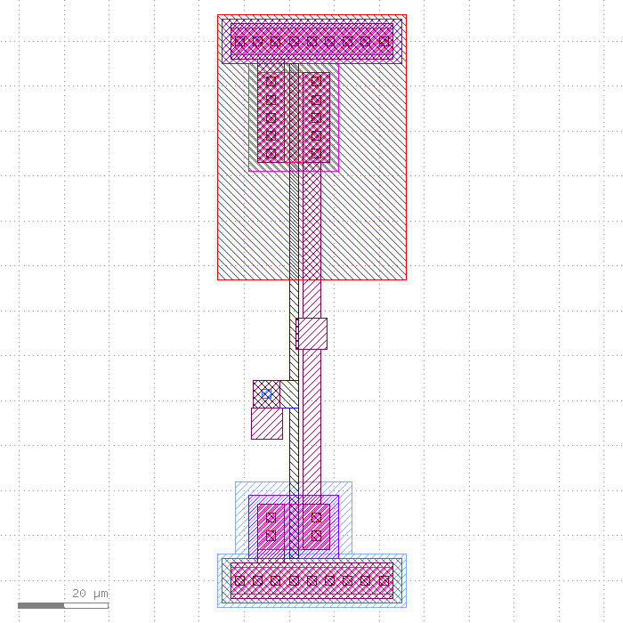
        
        - 구조
        
        ```c
        ┌─ 위쪽 (빨간 박스 = N-웰) ────┐
        │  PMOS 트랜지스터               ← 위: PMOS (P타입, 웰 안)
        │  ▓▓ 자주색 = VDD 전원 레일   
        │  세로 줄 = 폴리실리콘 게이트  
        └──────────────┬──────────────┘
               중간 작은 사각형 = 콘택트/비아 (층 연결)
        ┌──────────────┴──────────────┐
        │  NMOS 트랜지스터                ← 아래: NMOS (N타입)
        │  ▓▓ 자주색 = GND 전원 레일    
        └─────────────────────────────┘
        
        /*
        위/아래 가로 자주색 띠 = 전원(VDD)·접지(GND) 레일: 셀 위아래로 지나가서 옆 셀과 이어짐
        세로로 관통하는 줄 = 폴리실리콘 게이트 (입력 신호가 여기로). PMOS와 NMOS 게이트가 하나로 연결 = 인버터의 입력
        작은 격자 사각형들 = 콘택트(contact):확산층↔금속층을 잇는 구멍
        빨간 큰 박스 = N-웰 (PMOS가 사는 곳)
        */
        ```
        
- 07~09.의 경우, 보다 완성된 버전인 `pong_pt1`으로 프로젝트를 수행.
    - `pong_pt1`
        
        ```c
        `timescale 1ns / 1ps
        
        //`define GLCD_128x64
        
        `define MAX_TABLE_WIDTH     640
        `define MAX_TABLE_HEIGHT    480
        
        module pong_pt1(
            input           clk,
            input           reset,
            input           enable,
            input           up,
            input           down,
            output          p_tick,
            output          hsync,
            output          vsync,
            output          rgb
            );
        
        `ifdef MAX_TABLE_SIZE
            parameter TABLE_WIDTH   = `MAX_TABLE_WIDTH;
            parameter TABLE_HEIGHT  = `MAX_TABLE_HEIGHT;
            `define MAX_HALF_TABLE_SIZE
        `elsif HALF_TABLE_SIZE
            parameter TABLE_WIDTH   = `MAX_TABLE_WIDTH/2;
            parameter TABLE_HEIGHT  = `MAX_TABLE_HEIGHT/2;
            `define MAX_HALF_TABLE_SIZE
        `elsif VGAX_120x60
            parameter TABLE_WIDTH   = 120;
            parameter TABLE_HEIGHT  = 60;
        `else	//if GLCD_128x64
            parameter TABLE_WIDTH   = 128;
            parameter TABLE_HEIGHT  = 64;
        `endif    
        
            parameter SCREEN_WIDTH  = TABLE_WIDTH  + 2;
            parameter SCREEN_HEIGHT = TABLE_HEIGHT + 1;
        
        `ifdef MAX_HALF_TABLE_SIZE
            // Table's Dimension
            parameter TX_BIT_WIDTH   = $bits(TABLE_WIDTH);
            parameter TY_BIT_WIDTH   = $bits(TABLE_HEIGHT);
            // Screen's Dimension
            parameter SX_BIT_WIDTH   = $bits(SCREEN_WIDTH);
            parameter SY_BIT_WIDTH   = $bits(SCREEN_HEIGHT);
        `else
        // Yosys interprete $bits(integer) as 32-bits
        // Exact bit-width must be provided according to Table's width & height
            parameter TX_BIT_WIDTH   = 9;
            parameter TY_BIT_WIDTH   = 9;
        
            parameter SX_BIT_WIDTH   = 9;
            parameter SY_BIT_WIDTH   = 9;
        `endif
        
            wire                    vid_on;
            wire                    p_tick_en;
            reg                     pixel_tick;
            reg [SX_BIT_WIDTH-1:0]   x;
            reg [SY_BIT_WIDTH-1:0]   y;
        
            always @(posedge clk or posedge reset)
            begin
                if (reset)
                    pixel_tick <= 0;
                else
                    if (enable)
                        pixel_tick <= ~p_tick_en;  // Toggle
                    else
                        pixel_tick <= 0;
            end
            assign p_tick_en = pixel_tick;
        
            always @(posedge clk or posedge reset)
            begin
                if (reset)
                begin
                    x <= TABLE_WIDTH;
                    y <= TABLE_HEIGHT;
                end
                else
                begin
                    if (p_tick_en)
                    begin
                        if (x>=SX_BIT_WIDTH'(SCREEN_WIDTH))
                        begin
                            x <= 0;
                            if (y>=SY_BIT_WIDTH'(SCREEN_HEIGHT))
                               y <= 0;
                            else
                                y <= y + 1;
                        end
                        else
                            x <= x + 1;
                    end
                end
            end
            assign hsync  =    (x>SX_BIT_WIDTH'(TABLE_WIDTH))
                            && (y<SY_BIT_WIDTH'(TABLE_HEIGHT))
                            && (x<SX_BIT_WIDTH'(SCREEN_WIDTH));
            assign vsync  =    (y>SY_BIT_WIDTH'(TABLE_HEIGHT-1));
            assign vid_on =    (x<=SX_BIT_WIDTH'(TABLE_WIDTH))
                            && (y<=SY_BIT_WIDTH'(TABLE_HEIGHT));
            assign p_tick = vid_on & pixel_tick & (!vsync);
        
            pixel_gen
                #(  .TABLE_WIDTH(TABLE_WIDTH),
                    .TABLE_HEIGHT(TABLE_HEIGHT),
                    .WALL_THICKNESS(8),
                    .PADDLE_HEIGHT(TABLE_HEIGHT/4),
                    .PADDLE_VELOCITY(1),
                    .BALL_VELOCITY_POS(+1),
                    .BALL_VELOCITY_NEG(-1),
                    .X_BIT_WIDTH(TX_BIT_WIDTH),
                    .Y_BIT_WIDTH(TY_BIT_WIDTH)
                )
                pg
                (   .clk(clk),
                    .reset(reset),
                    .up(up),
                    .down(down), 
                    .video_on(vid_on),
                    .x(x),
                    .y(y),
                    .rgb(rgb)
                );
        
        endmodule
        
        ```
        
    
    ```c
    module pong_pt1(
        input  clk, reset, enable, up, down,
        output p_tick, hsync, vsync, rgb      // GLCD 버스가 아니라 "비디오 신호"!
    );
    ```
    
- 지금까지의 설계의 방향성 또한 달라짐. (Frontend → Backend)
    
    ```c
    탁구1~6 (Frontend)              탁구7~9 (백엔드)
    ──────────────────              ──────────────────
    "동작이 맞나?"                   "이걸 실리콘으로 어떻게?"
    Verilator+SystemC               Yosys→GrayWolf→QRouter→Magic
    화면에서 게임                    게이트→배치→배선→GDS
    ```
    
- 07의 경우, 크게 두 부분으로 나타낼 수 있다.
    
    
    | 부분 | 하는 일 | 툴 |
    | --- | --- | --- |
    | **① 합성 (synthesize)** | RTL → **게이트 네트리스트** (표준셀로 변환) | Yosys + ABC |
    | **② 타이밍 시뮬 (VPI)** | 합성된 **게이트가 여전히 맞는지** 검증 (게이트 지연 포함) | iVerilog + VPI |
    - VPI는 Synthesis를 통해 Gate로 바꿨는데, 해당 **Gate의 동작이 원래와 같은가**를 확인하는 것.

### Step 2. Synthesis

- Synthesis 실행
    
    ```c
    (chip-eda) pgh@turtle:~$ export LD_LIBRARY_PATH=$CONDA_PREFIX/lib:$LD_LIBRARY_PATH
    (chip-eda) pgh@turtle:~$ cd ~/project/PGH_Chip_Open_Source/work/pong_pt1
    (chip-eda) pgh@turtle:~/project/PGH_Chip_Open_Source/work/pong_pt1$ source env_settings
    #************************************************************************
    #* Environment setting for RTL, Co-Simulmatio/Emulation & ETRI050
    #************************************************************************
    Setting Environment variables as follows;
        PROJECT_DIR=/hai/home/pgh/project/PGH_Chip_Open_Source/work/pong_pt1
        TOP_MODULE=pong_pt1
        HW_STYLE=NONE
        MODE=CA
        MI=PI_PICO
    (chip-eda) pgh@turtle:~/project/PGH_Chip_Open_Source/work/pong_pt1$ cd ETRI050
    (chip-eda) pgh@turtle:~/project/PGH_Chip_Open_Source/work/pong_pt1/ETRI050$ make
    Makefile for "Verilog-RTL Ex.: pong_pt1" QFlow RTL-to-Layout using ETRI 0.5um CMOS Technology
    
        TOP_MODULE=pong_pt1 make synthesize
        TOP_MODULE=pong_pt1 make place
        TOP_MODULE=pong_pt1 make sta
        TOP_MODULE=pong_pt1 make route
        TOP_MODULE=pong_pt1 make migrate
        TOP_MODULE=pong_pt1 make lvs
        TOP_MODULE=pong_pt1 make size
    
                 config_m1f
                 config_m2f
                 clean_cell
    
    (chip-eda) pgh@turtle:~/project/PGH_Chip_Open_Source/work/pong_pt1/ETRI050$ make config_m1f
    cd ~/ETRI050_DesignKit/digital_ETRI
    cp -f ~/ETRI050_DesignKit/digital_ETRI050_m1f/AND2X1.mag        ~/ETRI050_DesignKit/digital_ETRI/AND2X1.mag
    cp -f ~/ETRI050_DesignKit/digital_ETRI050_m1f/AND2X2.mag        ~/ETRI050_DesignKit/digital_ETRI/AND2X2.mag
    cp -f ~/ETRI050_DesignKit/digital_ETRI050_m1f/AOI21X1.mag       ~/ETRI050_DesignKit/digital_ETRI/AOI21X1.mag
    cp -f ~/ETRI050_DesignKit/digital_ETRI050_m1f/AOI22X1.mag       ~/ETRI050_DesignKit/digital_ETRI/AOI22X1.mag
    cp -f ~/ETRI050_DesignKit/digital_ETRI050_m1f/BUFX2.mag ~/ETRI050_DesignKit/digital_ETRI/BUFX2.mag
    cp -f ~/ETRI050_DesignKit/digital_ETRI050_m1f/BUFX4.mag ~/ETRI050_DesignKit/digital_ETRI/BUFX4.mag
    cp -f ~/ETRI050_DesignKit/digital_ETRI050_m1f/CLKBUF1.mag       ~/ETRI050_DesignKit/digital_ETRI/CLKBUF1.mag
    cp -f ~/ETRI050_DesignKit/digital_ETRI050_m1f/CLKBUF2.mag       ~/ETRI050_DesignKit/digital_ETRI/CLKBUF2.mag
    cp -f ~/ETRI050_DesignKit/digital_ETRI050_m1f/CLKBUF3.mag       ~/ETRI050_DesignKit/digital_ETRI/CLKBUF3.mag
    cp -f ~/ETRI050_DesignKit/digital_ETRI050_m1f/DFFNEGX1.mag      ~/ETRI050_DesignKit/digital_ETRI/DFFNEGX1.mag
    cp -f ~/ETRI050_DesignKit/digital_ETRI050_m1f/DFFPOSX1.mag      ~/ETRI050_DesignKit/digital_ETRI/DFFPOSX1.mag
    cp -f ~/ETRI050_DesignKit/digital_ETRI050_m1f/DFFSR.mag ~/ETRI050_DesignKit/digital_ETRI/DFFSR.mag
    cp -f ~/ETRI050_DesignKit/digital_ETRI050_m1f/FILL.mag  ~/ETRI050_DesignKit/digital_ETRI/FILL.mag
    cp -f ~/ETRI050_DesignKit/digital_ETRI050_m1f/INVX1.mag ~/ETRI050_DesignKit/digital_ETRI/INVX1.mag
    cp -f ~/ETRI050_DesignKit/digital_ETRI050_m1f/INVX2.mag ~/ETRI050_DesignKit/digital_ETRI/INVX2.mag
    cp -f ~/ETRI050_DesignKit/digital_ETRI050_m1f/INVX4.mag ~/ETRI050_DesignKit/digital_ETRI/INVX4.mag
    cp -f ~/ETRI050_DesignKit/digital_ETRI050_m1f/INVX8.mag ~/ETRI050_DesignKit/digital_ETRI/INVX8.mag
    cp -f ~/ETRI050_DesignKit/digital_ETRI050_m1f/MUX2X1.mag        ~/ETRI050_DesignKit/digital_ETRI/MUX2X1.mag
    cp -f ~/ETRI050_DesignKit/digital_ETRI050_m1f/NAND2X1.mag       ~/ETRI050_DesignKit/digital_ETRI/NAND2X1.mag
    cp -f ~/ETRI050_DesignKit/digital_ETRI050_m1f/NAND3X1.mag       ~/ETRI050_DesignKit/digital_ETRI/NAND3X1.mag
    cp -f ~/ETRI050_DesignKit/digital_ETRI050_m1f/NOR2X1.mag        ~/ETRI050_DesignKit/digital_ETRI/NOR2X1.mag
    cp -f ~/ETRI050_DesignKit/digital_ETRI050_m1f/NOR3X1.mag        ~/ETRI050_DesignKit/digital_ETRI/NOR3X1.mag
    cp -f ~/ETRI050_DesignKit/digital_ETRI050_m1f/OAI21X1.mag       ~/ETRI050_DesignKit/digital_ETRI/OAI21X1.mag
    cp -f ~/ETRI050_DesignKit/digital_ETRI050_m1f/OAI22X1.mag       ~/ETRI050_DesignKit/digital_ETRI/OAI22X1.mag
    cp -f ~/ETRI050_DesignKit/digital_ETRI050_m1f/OR2X1.mag ~/ETRI050_DesignKit/digital_ETRI/OR2X1.mag
    cp -f ~/ETRI050_DesignKit/digital_ETRI050_m1f/OR2X2.mag ~/ETRI050_DesignKit/digital_ETRI/OR2X2.mag
    cp -f ~/ETRI050_DesignKit/digital_ETRI050_m1f/TBUFX1.mag        ~/ETRI050_DesignKit/digital_ETRI/TBUFX1.mag
    cp -f ~/ETRI050_DesignKit/digital_ETRI050_m1f/TBUFX2.mag        ~/ETRI050_DesignKit/digital_ETRI/TBUFX2.mag
    cp -f ~/ETRI050_DesignKit/digital_ETRI050_m1f/HAX1.mag  ~/ETRI050_DesignKit/digital_ETRI/HAX1.mag
    cp -f ~/ETRI050_DesignKit/digital_ETRI050_m1f/FAX1.mag  ~/ETRI050_DesignKit/digital_ETRI/FAX1.mag
    cp -f ~/ETRI050_DesignKit/digital_ETRI050_m1f/XNOR2X1.mag       ~/ETRI050_DesignKit/digital_ETRI/XNOR2X1.mag
    cp -f ~/ETRI050_DesignKit/digital_ETRI050_m1f/XOR2X1.mag        ~/ETRI050_DesignKit/digital_ETRI/XOR2X1.mag
    cp -f ~/ETRI050_DesignKit/digital_ETRI050_m1f/LATCH.mag ~/ETRI050_DesignKit/digital_ETRI/LATCH.mag
    cp -f ~/ETRI050_DesignKit/digital_ETRI050_m1f/khu_etri050_stdcells.mag  ~/ETRI050_DesignKit/digital_ETRI/khu_etri050_stdcells.mag
    cd ~/ETRI050_DesignKit/digital_ETRI && make clean && make
    make[1]: Entering directory '/hai/home/pgh/project/PGH_Chip_Open_Source/ETRI-0.5um-CMOS-MPW-Std-Cell-DK/digital_ETRI'
    rm -f *.ext
    make[1]: Leaving directory '/hai/home/pgh/project/PGH_Chip_Open_Source/ETRI-0.5um-CMOS-MPW-Std-Cell-DK/digital_ETRI'
    make[1]: Entering directory '/hai/home/pgh/project/PGH_Chip_Open_Source/ETRI-0.5um-CMOS-MPW-Std-Cell-DK/digital_ETRI'
    --------------------------------------------
    Generating SPICE netlist
    --------------------------------------------
    
    Magic 8.3 revision 465 - Compiled on Tue Mar 19 23:17:55 UTC 2024.
    Starting magic under Tcl interpreter
    Using the terminal as the console.
    Using NULL graphics device.
    Processing system .magicrc file
    Input style lambda=0.30(p): scaleFactor=30, multiplier=1
    Contact size value ignored (using GDS generation rules).
    Contact size value ignored (using GDS generation rules).
    Contact size value ignored (using GDS generation rules).
    Contact size value ignored (using GDS generation rules).
    Contact size value ignored (using GDS generation rules).
    Contact size value ignored (using GDS generation rules).
    The following types are not handled by extraction and will be treated as non-electrical types:
        n_field_implant p_field_implant nselect pselect glass filln filla fillb xp m1p m2p m3p comment bb
    2 Magic internal units = 1 Lambda
    Using technology "scmos", version 2001a
    Root cell box:
               width x height  (   llx,  lly  ), (   urx,  ury  )
    
    microns:   0.000 x 0.000   ( 0.000,  0.000), ( 0.000,  0.000)
    lambda:     0.00 x 0.00    (  0.00,  0.00 ), (  0.00,  0.00 )
    internal:      0 x 0       (     0,  0    ), (     0,  0    )
    Cell khu_etri050_stdcells read from current working directory
    Cell XOR2X1 read from current working directory
    Cell XNOR2X1 read from current working directory
    Cell TBUFX2 read from current working directory
    Cell TBUFX1 read from current working directory
    Cell OR2X2 read from current working directory
    Cell OR2X1 read from current working directory
    Cell OAI22X1 read from current working directory
    Cell OAI21X1 read from current working directory
    Cell NOR3X1 read from current working directory
    Cell NOR2X1 read from current working directory
    Cell NAND3X1 read from current working directory
    Cell NAND2X1 read from current working directory
    Cell MUX2X1 read from current working directory
    Cell LATCH read from current working directory
    Cell INVX8 read from current working directory
    Cell INVX4 read from current working directory
    Cell INVX2 read from current working directory
    Cell INVX1 read from current working directory
    Cell HAX1 read from current working directory
    Cell FILL read from current working directory
    Scaled magic input cell FILL geometry by factor of 2
    Cell FAX1 read from current working directory
    Cell DFFSR read from current working directory
    Cell DFFPOSX1 read from current working directory
    Cell DFFNEGX1 read from current working directory
    Cell CLKBUF3 read from current working directory
    Cell CLKBUF2 read from current working directory
    Cell CLKBUF1 read from current working directory
    Cell BUFX4 read from current working directory
    Cell BUFX2 read from current working directory
    Cell AOI22X1 read from current working directory
    Cell AOI21X1 read from current working directory
    Cell AND2X2 read from current working directory
    Cell AND2X1 read from current working directory
    Processing timestamp mismatches.
    Timestamp mismatches found in these cells: OAI22X1, OAI21X1, NOR3X1, NOR2X1, NAND3X1, DFFSR, BUFX4, BUFX2, AOI22X1, AOI21X1, AND2X2, AND2X1.
    Extracting OAI22X1 into OAI22X1.ext:
    Extracting OAI21X1 into OAI21X1.ext:
    Extracting NOR3X1 into NOR3X1.ext:
    Extracting NOR2X1 into NOR2X1.ext:
    Extracting NAND3X1 into NAND3X1.ext:
    Extracting DFFSR into DFFSR.ext:
    Extracting BUFX4 into BUFX4.ext:
    Extracting BUFX2 into BUFX2.ext:
    Extracting AOI22X1 into AOI22X1.ext:
    Extracting AOI21X1 into AOI21X1.ext:
    Extracting AND2X2 into AND2X2.ext:
    Extracting AND2X1 into AND2X1.ext:
    Extracting XOR2X1 into XOR2X1.ext:
    Extracting XNOR2X1 into XNOR2X1.ext:
    Extracting TBUFX2 into TBUFX2.ext:
    Extracting TBUFX1 into TBUFX1.ext:
    Extracting OR2X2 into OR2X2.ext:
    Extracting OR2X1 into OR2X1.ext:
    Extracting NAND2X1 into NAND2X1.ext:
    Extracting MUX2X1 into MUX2X1.ext:
    Extracting LATCH into LATCH.ext:
    Extracting INVX8 into INVX8.ext:
    Extracting INVX4 into INVX4.ext:
    Extracting INVX2 into INVX2.ext:
    Extracting INVX1 into INVX1.ext:
    Extracting HAX1 into HAX1.ext:
    Extracting FILL into FILL.ext:
    Extracting FAX1 into FAX1.ext:
    Extracting DFFPOSX1 into DFFPOSX1.ext:
    Extracting DFFNEGX1 into DFFNEGX1.ext:
    Extracting CLKBUF3 into CLKBUF3.ext:
    Extracting CLKBUF2 into CLKBUF2.ext:
    Extracting CLKBUF1 into CLKBUF1.ext:
    Extracting khu_etri050_stdcells into khu_etri050_stdcells.ext:
    exttospice finished.
    --------------------------------------------
    Generating GDS2
    --------------------------------------------
    
    Magic 8.3 revision 465 - Compiled on Tue Mar 19 23:17:55 UTC 2024.
    Starting magic under Tcl interpreter
    Using the terminal as the console.
    Using NULL graphics device.
    Processing system .magicrc file
    Input style lambda=0.30(p): scaleFactor=30, multiplier=1
    Contact size value ignored (using GDS generation rules).
    Contact size value ignored (using GDS generation rules).
    Contact size value ignored (using GDS generation rules).
    Contact size value ignored (using GDS generation rules).
    Contact size value ignored (using GDS generation rules).
    Contact size value ignored (using GDS generation rules).
    The following types are not handled by extraction and will be treated as non-electrical types:
        n_field_implant p_field_implant nselect pselect glass filln filla fillb xp m1p m2p m3p comment bb
    2 Magic internal units = 1 Lambda
    Using technology "scmos", version 2001a
    Root cell box:
               width x height  (   llx,  lly  ), (   urx,  ury  )
    
    microns:   0.000 x 0.000   ( 0.000,  0.000), ( 0.000,  0.000)
    lambda:     0.00 x 0.00    (  0.00,  0.00 ), (  0.00,  0.00 )
    internal:      0 x 0       (     0,  0    ), (     0,  0    )
    Cell khu_etri050_stdcells read from current working directory
    Cell XOR2X1 read from current working directory
    Cell XNOR2X1 read from current working directory
    Cell TBUFX2 read from current working directory
    Cell TBUFX1 read from current working directory
    Cell OR2X2 read from current working directory
    Cell OR2X1 read from current working directory
    Cell OAI22X1 read from current working directory
    Cell OAI21X1 read from current working directory
    Cell NOR3X1 read from current working directory
    Cell NOR2X1 read from current working directory
    Cell NAND3X1 read from current working directory
    Cell NAND2X1 read from current working directory
    Cell MUX2X1 read from current working directory
    Cell LATCH read from current working directory
    Cell INVX8 read from current working directory
    Cell INVX4 read from current working directory
    Cell INVX2 read from current working directory
    Cell INVX1 read from current working directory
    Cell HAX1 read from current working directory
    Cell FILL read from current working directory
    Scaled magic input cell FILL geometry by factor of 2
    Cell FAX1 read from current working directory
    Cell DFFSR read from current working directory
    Cell DFFPOSX1 read from current working directory
    Cell DFFNEGX1 read from current working directory
    Cell CLKBUF3 read from current working directory
    Cell CLKBUF2 read from current working directory
    Cell CLKBUF1 read from current working directory
    Cell BUFX4 read from current working directory
    Cell BUFX2 read from current working directory
    Cell AOI22X1 read from current working directory
    Cell AOI21X1 read from current working directory
    Cell AND2X2 read from current working directory
    Cell AND2X1 read from current working directory
    Processing timestamp mismatches.
    Timestamp mismatches found in these cells: OAI22X1, OAI21X1, NOR3X1, NOR2X1, NAND3X1, DFFSR, BUFX4, BUFX2, AOI22X1, AOI21X1, AND2X2, AND2X1.
       Generating output for cell OAI22X1
       Generating output for cell OAI21X1
       Generating output for cell NOR3X1
       Generating output for cell NOR2X1
       Generating output for cell NAND3X1
       Generating output for cell DFFSR
       Generating output for cell BUFX4
       Generating output for cell BUFX2
       Generating output for cell AOI22X1
       Generating output for cell AOI21X1
       Generating output for cell AND2X2
       Generating output for cell AND2X1
       Generating output for cell XOR2X1
       Generating output for cell XNOR2X1
       Generating output for cell TBUFX2
       Generating output for cell TBUFX1
       Generating output for cell OR2X2
       Generating output for cell OR2X1
       Generating output for cell NAND2X1
       Generating output for cell MUX2X1
       Generating output for cell LATCH
       Generating output for cell INVX8
       Generating output for cell INVX4
       Generating output for cell INVX2
       Generating output for cell INVX1
       Generating output for cell HAX1
       Generating output for cell FILL
       Generating output for cell FAX1
       Generating output for cell DFFPOSX1
       Generating output for cell DFFNEGX1
       Generating output for cell CLKBUF3
       Generating output for cell CLKBUF2
       Generating output for cell CLKBUF1
       Generating output for cell khu_etri050_stdcells
    --------------------------------------------
    Generating LEF
    --------------------------------------------
    ./gen_lef_stdcells.py khu_etri050_stdcells
    
    Magic 8.3 revision 465 - Compiled on Tue Mar 19 23:17:55 UTC 2024.
    Starting magic under Tcl interpreter
    Using the terminal as the console.
    Using NULL graphics device.
    Processing system .magicrc file
    Input style lambda=0.30(p): scaleFactor=30, multiplier=1
    Contact size value ignored (using GDS generation rules).
    Contact size value ignored (using GDS generation rules).
    Contact size value ignored (using GDS generation rules).
    Contact size value ignored (using GDS generation rules).
    Contact size value ignored (using GDS generation rules).
    Contact size value ignored (using GDS generation rules).
    The following types are not handled by extraction and will be treated as non-electrical types:
        n_field_implant p_field_implant nselect pselect glass filln filla fillb xp m1p m2p m3p comment bb
    2 Magic internal units = 1 Lambda
    Using technology "scmos", version 2001a
    Root cell box:
               width x height  (   llx,  lly  ), (   urx,  ury  )
    
    microns:   0.000 x 0.000   ( 0.000,  0.000), ( 0.000,  0.000)
    lambda:     0.00 x 0.00    (  0.00,  0.00 ), (  0.00,  0.00 )
    internal:      0 x 0       (     0,  0    ), (     0,  0    )
    Cell AND2X1 read from current working directory
    Root cell box:
               width x height  (   llx,  lly  ), (   urx,  ury  )  area (units^2)
    
    microns:   1.800 x 1.800   ( 0.600,  13.650), ( 2.400,  15.450)  3.240
    lambda:     6.00 x 6.00    (  2.00,  45.50), (  8.00,  51.50)  36.00
    internal:     12 x 12      (     4,  91   ), (    16,  103  )  144
    Root cell box:
               width x height  (   llx,  lly  ), (   urx,  ury  )  area (units^2)
    
    microns:   1.800 x 1.800   ( 6.600,  20.550), ( 8.400,  22.350)  3.240
    lambda:     6.00 x 6.00    ( 22.00,  68.50), ( 28.00,  74.50)  36.00
    internal:     12 x 12      (    44,  137  ), (    56,  149  )  144
    Root cell box:
               width x height  (   llx,  lly  ), (   urx,  ury  )  area (units^2)
    
    microns:   1.800 x 1.800   ( 6.600,  9.000), ( 8.400,  10.800)  3.240
    lambda:     6.00 x 6.00    ( 22.00,  30.00), ( 28.00,  36.00)  36.00
    internal:     12 x 12      (    44,  60   ), (    56,  72   )  144
    Root cell box:
               width x height  (   llx,  lly  ), (   urx,  ury  )  area (units^2)
    
    microns:   2.400 x 0.150   ( 6.300,  18.300), ( 8.700,  18.450)  0.360
    lambda:     8.00 x 0.50    ( 21.00,  61.00), ( 29.00,  61.50)  4.00
    internal:     16 x 1       (    42,  122  ), (    58,  123  )  16
    Root cell box:
               width x height  (   llx,  lly  ), (   urx,  ury  )  area (units^2)
    
    microns:   2.400 x 0.150   ( 6.300,  20.550), ( 8.700,  20.700)  0.360
    lambda:     8.00 x 0.50    ( 21.00,  68.50), ( 29.00,  69.00)  4.00
    internal:     16 x 1       (    42,  137  ), (    58,  138  )  16
    Root cell box:
               width x height  (   llx,  lly  ), (   urx,  ury  )  area (units^2)
    
    microns:   0.150 x 2.250   ( 6.300,  18.300), ( 6.450,  20.550)  0.338
    lambda:     0.50 x 7.50    ( 21.00,  61.00), ( 21.50,  68.50)  3.75
    internal:      1 x 15      (    42,  122  ), (    43,  137  )  15
    Root cell box:
               width x height  (   llx,  lly  ), (   urx,  ury  )  area (units^2)
    
    microns:   0.150 x 2.100   ( 8.550,  18.450), ( 8.700,  20.550)  0.315
    lambda:     0.50 x 7.00    ( 28.50,  61.50), ( 29.00,  68.50)  3.50
    internal:      1 x 14      (    57,  123  ), (    58,  137  )  14
    Root cell box:
               width x height  (   llx,  lly  ), (   urx,  ury  )  area (units^2)
    
    microns:   2.400 x 0.150   ( 0.300,  15.300), ( 2.700,  15.450)  0.360
    lambda:     8.00 x 0.50    (  1.00,  51.00), (  9.00,  51.50)  4.00
    internal:     16 x 1       (     2,  102  ), (    18,  103  )  16
    Root cell box:
               width x height  (   llx,  lly  ), (   urx,  ury  )  area (units^2)
    
    microns:   2.400 x 0.150   ( 0.300,  17.550), ( 2.700,  17.700)  0.360
    lambda:     8.00 x 0.50    (  1.00,  58.50), (  9.00,  59.00)  4.00
    internal:     16 x 1       (     2,  117  ), (    18,  118  )  16
    Root cell box:
               width x height  (   llx,  lly  ), (   urx,  ury  )  area (units^2)
    
    microns:   0.150 x 2.250   ( 0.300,  15.300), ( 0.450,  17.550)  0.338
    lambda:     0.50 x 7.50    (  1.00,  51.00), (  1.50,  58.50)  3.75
    internal:      1 x 15      (     2,  102  ), (     3,  117  )  15
    Root cell box:
               width x height  (   llx,  lly  ), (   urx,  ury  )  area (units^2)
    
    microns:   0.150 x 2.100   ( 2.550,  15.450), ( 2.700,  17.550)  0.315
    lambda:     0.50 x 7.00    (  8.50,  51.50), (  9.00,  58.50)  3.50
    internal:      1 x 14      (    17,  103  ), (    18,  117  )  14
    Root cell box:
               width x height  (   llx,  lly  ), (   urx,  ury  )  area (units^2)
    
    microns:   2.400 x 0.150   ( 9.300,  12.300), ( 11.700,  12.450)  0.360
    lambda:     8.00 x 0.50    ( 31.00,  41.00), ( 39.00,  41.50)  4.00
    internal:     16 x 1       (    62,  82   ), (    78,  83   )  16
    Root cell box:
               width x height  (   llx,  lly  ), (   urx,  ury  )  area (units^2)
    
    microns:   2.400 x 0.150   ( 9.300,  14.550), ( 11.700,  14.700)  0.360
    lambda:     8.00 x 0.50    ( 31.00,  48.50), ( 39.00,  49.00)  4.00
    internal:     16 x 1       (    62,  97   ), (    78,  98   )  16
    Root cell box:
               width x height  (   llx,  lly  ), (   urx,  ury  )  area (units^2)
    
    microns:   0.150 x 2.250   ( 9.300,  12.300), ( 9.450,  14.550)  0.338
    lambda:     0.50 x 7.50    ( 31.00,  41.00), ( 31.50,  48.50)  3.75
    internal:      1 x 15      (    62,  82   ), (    63,  97   )  15
    Root cell box:
               width x height  (   llx,  lly  ), (   urx,  ury  )  area (units^2)
    
    microns:   0.150 x 2.100   ( 11.550,  12.450), ( 11.700,  14.550)  0.315
    lambda:     0.50 x 7.00    ( 38.50,  41.50), ( 39.00,  48.50)  3.50
    internal:      1 x 14      (    77,  83   ), (    78,  97   )  14
    Generating LEF output _AND2X1.lef for cell AND2X1:
    Diagnostic:  Write LEF header for cell AND2X1
    Diagnostic:  Writing LEF output for cell AND2X1
    Diagnostic:  Scale value is 0.150000
    
    Magic 8.3 revision 465 - Compiled on Tue Mar 19 23:17:55 UTC 2024.
    Starting magic under Tcl interpreter
    Using the terminal as the console.
    Using NULL graphics device.
    Processing system .magicrc file
    Input style lambda=0.30(p): scaleFactor=30, multiplier=1
    Contact size value ignored (using GDS generation rules).
    Contact size value ignored (using GDS generation rules).
    Contact size value ignored (using GDS generation rules).
    Contact size value ignored (using GDS generation rules).
    Contact size value ignored (using GDS generation rules).
    Contact size value ignored (using GDS generation rules).
    The following types are not handled by extraction and will be treated as non-electrical types:
        n_field_implant p_field_implant nselect pselect glass filln filla fillb xp m1p m2p m3p comment bb
    2 Magic internal units = 1 Lambda
    Using technology "scmos", version 2001a
    Root cell box:
               width x height  (   llx,  lly  ), (   urx,  ury  )
    
    microns:   0.000 x 0.000   ( 0.000,  0.000), ( 0.000,  0.000)
    lambda:     0.00 x 0.00    (  0.00,  0.00 ), (  0.00,  0.00 )
    internal:      0 x 0       (     0,  0    ), (     0,  0    )
    Cell AND2X1 read from current working directory
    Root cell box:
               width x height  (   llx,  lly  ), (   urx,  ury  )  area (units^2)
    
    microns:   4.200 x 1.050   ( 5.400,  17.400), ( 9.600,  18.450)  4.410
    lambda:    14.00 x 3.50    ( 18.00,  58.00), ( 32.00,  61.50)  49.00
    internal:     28 x 7       (    36,  116  ), (    64,  123  )  196
    Root cell box:
               width x height  (   llx,  lly  ), (   urx,  ury  )  area (units^2)
    
    microns:   4.200 x 1.050   ( 5.400,  20.550), ( 9.600,  21.600)  4.410
    lambda:    14.00 x 3.50    ( 18.00,  68.50), ( 32.00,  72.00)  49.00
    internal:     28 x 7       (    36,  137  ), (    64,  144  )  196
    Root cell box:
               width x height  (   llx,  lly  ), (   urx,  ury  )  area (units^2)
    
    microns:   1.050 x 3.150   ( 5.400,  17.400), ( 6.450,  20.550)  3.308
    lambda:     3.50 x 10.50   ( 18.00,  58.00), ( 21.50,  68.50)  36.75
    internal:      7 x 21      (    36,  116  ), (    43,  137  )  147
    Root cell box:
               width x height  (   llx,  lly  ), (   urx,  ury  )  area (units^2)
    
    microns:   1.050 x 2.100   ( 8.550,  18.450), ( 9.600,  20.550)  2.205
    lambda:     3.50 x 7.00    ( 28.50,  61.50), ( 32.00,  68.50)  24.50
    internal:      7 x 14      (    57,  123  ), (    64,  137  )  98
    Root cell box:
               width x height  (   llx,  lly  ), (   urx,  ury  )  area (units^2)
    
    microns:   4.200 x 1.050   (-0.600,  14.400), ( 3.600,  15.450)  4.410
    lambda:    14.00 x 3.50    ( -2.00,  48.00), ( 12.00,  51.50)  49.00
    internal:     28 x 7       (    -4,  96   ), (    24,  103  )  196
    Root cell box:
               width x height  (   llx,  lly  ), (   urx,  ury  )  area (units^2)
    
    microns:   4.200 x 1.050   (-0.600,  17.550), ( 3.600,  18.600)  4.410
    lambda:    14.00 x 3.50    ( -2.00,  58.50), ( 12.00,  62.00)  49.00
    internal:     28 x 7       (    -4,  117  ), (    24,  124  )  196
    Root cell box:
               width x height  (   llx,  lly  ), (   urx,  ury  )  area (units^2)
    
    microns:   1.050 x 3.150   (-0.600,  14.400), ( 0.450,  17.550)  3.308
    lambda:     3.50 x 10.50   ( -2.00,  48.00), (  1.50,  58.50)  36.75
    internal:      7 x 21      (    -4,  96   ), (     3,  117  )  147
    Root cell box:
               width x height  (   llx,  lly  ), (   urx,  ury  )  area (units^2)
    
    microns:   1.050 x 2.100   ( 2.550,  15.450), ( 3.600,  17.550)  2.205
    lambda:     3.50 x 7.00    (  8.50,  51.50), ( 12.00,  58.50)  24.50
    internal:      7 x 14      (    17,  103  ), (    24,  117  )  98
    Root cell box:
               width x height  (   llx,  lly  ), (   urx,  ury  )  area (units^2)
    
    microns:   4.200 x 1.050   ( 8.400,  11.400), ( 12.600,  12.450)  4.410
    lambda:    14.00 x 3.50    ( 28.00,  38.00), ( 42.00,  41.50)  49.00
    internal:     28 x 7       (    56,  76   ), (    84,  83   )  196
    Root cell box:
               width x height  (   llx,  lly  ), (   urx,  ury  )  area (units^2)
    
    microns:   4.200 x 1.050   ( 8.400,  14.550), ( 12.600,  15.600)  4.410
    lambda:    14.00 x 3.50    ( 28.00,  48.50), ( 42.00,  52.00)  49.00
    internal:     28 x 7       (    56,  97   ), (    84,  104  )  196
    Root cell box:
               width x height  (   llx,  lly  ), (   urx,  ury  )  area (units^2)
    
    microns:   1.050 x 3.150   ( 8.400,  11.400), ( 9.450,  14.550)  3.308
    lambda:     3.50 x 10.50   ( 28.00,  38.00), ( 31.50,  48.50)  36.75
    internal:      7 x 21      (    56,  76   ), (    63,  97   )  147
    Root cell box:
               width x height  (   llx,  lly  ), (   urx,  ury  )  area (units^2)
    
    microns:   1.050 x 2.100   ( 11.550,  12.450), ( 12.600,  14.550)  2.205
    lambda:     3.50 x 7.00    ( 38.50,  41.50), ( 42.00,  48.50)  24.50
    internal:      7 x 14      (    77,  83   ), (    84,  97   )  98
    Root cell box:
               width x height  (   llx,  lly  ), (   urx,  ury  )  area (units^2)
    
    microns:   2.100 x 2.100   ( 6.450,  18.450), ( 8.550,  20.550)  4.410
    lambda:     7.00 x 7.00    ( 21.50,  61.50), ( 28.50,  68.50)  49.00
    internal:     14 x 14      (    43,  123  ), (    57,  137  )  196
    Root cell box:
               width x height  (   llx,  lly  ), (   urx,  ury  )  area (units^2)
    
    microns:   2.100 x 2.100   ( 0.450,  15.450), ( 2.550,  17.550)  4.410
    lambda:     7.00 x 7.00    (  1.50,  51.50), (  8.50,  58.50)  49.00
    internal:     14 x 14      (     3,  103  ), (    17,  117  )  196
    Root cell box:
               width x height  (   llx,  lly  ), (   urx,  ury  )  area (units^2)
    
    microns:   2.100 x 2.100   ( 9.450,  12.450), ( 11.550,  14.550)  4.410
    lambda:     7.00 x 7.00    ( 31.50,  41.50), ( 38.50,  48.50)  49.00
    internal:     14 x 14      (    63,  83   ), (    77,  97   )  196
    Generating LEF output __AND2X1.lef for cell AND2X1:
    Diagnostic:  Write LEF header for cell AND2X1
    Diagnostic:  Writing LEF output for cell AND2X1
    Diagnostic:  Scale value is 0.150000
    Merging MACRO PORT+OBS LEF.......................
    
    Magic 8.3 revision 465 - Compiled on Tue Mar 19 23:17:55 UTC 2024.
    Starting magic under Tcl interpreter
    Using the terminal as the console.
    Using NULL graphics device.
    Processing system .magicrc file
    Input style lambda=0.30(p): scaleFactor=30, multiplier=1
    Contact size value ignored (using GDS generation rules).
    Contact size value ignored (using GDS generation rules).
    Contact size value ignored (using GDS generation rules).
    Contact size value ignored (using GDS generation rules).
    Contact size value ignored (using GDS generation rules).
    Contact size value ignored (using GDS generation rules).
    The following types are not handled by extraction and will be treated as non-electrical types:
        n_field_implant p_field_implant nselect pselect glass filln filla fillb xp m1p m2p m3p comment bb
    2 Magic internal units = 1 Lambda
    Using technology "scmos", version 2001a
    Root cell box:
               width x height  (   llx,  lly  ), (   urx,  ury  )
    
    microns:   0.000 x 0.000   ( 0.000,  0.000), ( 0.000,  0.000)
    lambda:     0.00 x 0.00    (  0.00,  0.00 ), (  0.00,  0.00 )
    internal:      0 x 0       (     0,  0    ), (     0,  0    )
    Cell AND2X2 read from current working directory
    Root cell box:
               width x height  (   llx,  lly  ), (   urx,  ury  )  area (units^2)
    
    microns:   1.800 x 1.800   ( 0.600,  14.550), ( 2.400,  16.350)  3.240
    lambda:     6.00 x 6.00    (  2.00,  48.50), (  8.00,  54.50)  36.00
    internal:     12 x 12      (     4,  97   ), (    16,  109  )  144
    Root cell box:
               width x height  (   llx,  lly  ), (   urx,  ury  )  area (units^2)
    
    microns:   1.800 x 1.800   ( 6.600,  13.650), ( 8.400,  15.450)  3.240
    lambda:     6.00 x 6.00    ( 22.00,  45.50), ( 28.00,  51.50)  36.00
    internal:     12 x 12      (    44,  91   ), (    56,  103  )  144
    Root cell box:
               width x height  (   llx,  lly  ), (   urx,  ury  )  area (units^2)
    
    microns:   1.800 x 1.800   ( 6.600,  9.000), ( 8.400,  10.800)  3.240
    lambda:     6.00 x 6.00    ( 22.00,  30.00), ( 28.00,  36.00)  36.00
    internal:     12 x 12      (    44,  60   ), (    56,  72   )  144
    Root cell box:
               width x height  (   llx,  lly  ), (   urx,  ury  )  area (units^2)
    
    microns:   2.400 x 0.150   ( 6.300,  15.300), ( 8.700,  15.450)  0.360
    lambda:     8.00 x 0.50    ( 21.00,  51.00), ( 29.00,  51.50)  4.00
    internal:     16 x 1       (    42,  102  ), (    58,  103  )  16
    Root cell box:
               width x height  (   llx,  lly  ), (   urx,  ury  )  area (units^2)
    
    microns:   2.400 x 0.150   ( 6.300,  17.550), ( 8.700,  17.700)  0.360
    lambda:     8.00 x 0.50    ( 21.00,  58.50), ( 29.00,  59.00)  4.00
    internal:     16 x 1       (    42,  117  ), (    58,  118  )  16
    Root cell box:
               width x height  (   llx,  lly  ), (   urx,  ury  )  area (units^2)
    
    microns:   0.150 x 2.250   ( 6.300,  15.300), ( 6.450,  17.550)  0.338
    lambda:     0.50 x 7.50    ( 21.00,  51.00), ( 21.50,  58.50)  3.75
    internal:      1 x 15      (    42,  102  ), (    43,  117  )  15
    Root cell box:
               width x height  (   llx,  lly  ), (   urx,  ury  )  area (units^2)
    
    microns:   0.150 x 2.100   ( 8.550,  15.450), ( 8.700,  17.550)  0.315
    lambda:     0.50 x 7.00    ( 28.50,  51.50), ( 29.00,  58.50)  3.50
    internal:      1 x 14      (    57,  103  ), (    58,  117  )  14
    Root cell box:
               width x height  (   llx,  lly  ), (   urx,  ury  )  area (units^2)
    
    microns:   2.400 x 0.150   ( 0.300,  12.300), ( 2.700,  12.450)  0.360
    lambda:     8.00 x 0.50    (  1.00,  41.00), (  9.00,  41.50)  4.00
    internal:     16 x 1       (     2,  82   ), (    18,  83   )  16
    Root cell box:
               width x height  (   llx,  lly  ), (   urx,  ury  )  area (units^2)
    
    microns:   2.400 x 0.150   ( 0.300,  14.550), ( 2.700,  14.700)  0.360
    lambda:     8.00 x 0.50    (  1.00,  48.50), (  9.00,  49.00)  4.00
    internal:     16 x 1       (     2,  97   ), (    18,  98   )  16
    Root cell box:
               width x height  (   llx,  lly  ), (   urx,  ury  )  area (units^2)
    
    microns:   0.150 x 2.250   ( 0.300,  12.300), ( 0.450,  14.550)  0.338
    lambda:     0.50 x 7.50    (  1.00,  41.00), (  1.50,  48.50)  3.75
    internal:      1 x 15      (     2,  82   ), (     3,  97   )  15
    Root cell box:
               width x height  (   llx,  lly  ), (   urx,  ury  )  area (units^2)
    
    microns:   0.150 x 2.100   ( 2.550,  12.450), ( 2.700,  14.550)  0.315
    lambda:     0.50 x 7.00    (  8.50,  41.50), (  9.00,  48.50)  3.50
    internal:      1 x 14      (    17,  83   ), (    18,  97   )  14
    Root cell box:
               width x height  (   llx,  lly  ), (   urx,  ury  )  area (units^2)
    
    microns:   2.400 x 0.150   ( 9.300,  12.300), ( 11.700,  12.450)  0.360
    lambda:     8.00 x 0.50    ( 31.00,  41.00), ( 39.00,  41.50)  4.00
    internal:     16 x 1       (    62,  82   ), (    78,  83   )  16
    Root cell box:
               width x height  (   llx,  lly  ), (   urx,  ury  )  area (units^2)
    
    microns:   2.400 x 0.150   ( 9.300,  14.550), ( 11.700,  14.700)  0.360
    lambda:     8.00 x 0.50    ( 31.00,  48.50), ( 39.00,  49.00)  4.00
    internal:     16 x 1       (    62,  97   ), (    78,  98   )  16
    Root cell box:
               width x height  (   llx,  lly  ), (   urx,  ury  )  area (units^2)
    
    microns:   0.150 x 2.250   ( 9.300,  12.300), ( 9.450,  14.550)  0.338
    lambda:     0.50 x 7.50    ( 31.00,  41.00), ( 31.50,  48.50)  3.75
    internal:      1 x 15      (    62,  82   ), (    63,  97   )  15
    Root cell box:
               width x height  (   llx,  lly  ), (   urx,  ury  )  area (units^2)
    
    microns:   0.150 x 2.100   ( 11.550,  12.450), ( 11.700,  14.550)  0.315
    lambda:     0.50 x 7.00    ( 38.50,  41.50), ( 39.00,  48.50)  3.50
    internal:      1 x 14      (    77,  83   ), (    78,  97   )  14
    Generating LEF output _AND2X2.lef for cell AND2X2:
    Diagnostic:  Write LEF header for cell AND2X2
    Diagnostic:  Writing LEF output for cell AND2X2
    Diagnostic:  Scale value is 0.150000
    
    Magic 8.3 revision 465 - Compiled on Tue Mar 19 23:17:55 UTC 2024.
    Starting magic under Tcl interpreter
    Using the terminal as the console.
    Using NULL graphics device.
    Processing system .magicrc file
    Input style lambda=0.30(p): scaleFactor=30, multiplier=1
    Contact size value ignored (using GDS generation rules).
    Contact size value ignored (using GDS generation rules).
    Contact size value ignored (using GDS generation rules).
    Contact size value ignored (using GDS generation rules).
    Contact size value ignored (using GDS generation rules).
    Contact size value ignored (using GDS generation rules).
    The following types are not handled by extraction and will be treated as non-electrical types:
        n_field_implant p_field_implant nselect pselect glass filln filla fillb xp m1p m2p m3p comment bb
    2 Magic internal units = 1 Lambda
    Using technology "scmos", version 2001a
    Root cell box:
               width x height  (   llx,  lly  ), (   urx,  ury  )
    
    microns:   0.000 x 0.000   ( 0.000,  0.000), ( 0.000,  0.000)
    lambda:     0.00 x 0.00    (  0.00,  0.00 ), (  0.00,  0.00 )
    internal:      0 x 0       (     0,  0    ), (     0,  0    )
    Cell AND2X2 read from current working directory
    Root cell box:
               width x height  (   llx,  lly  ), (   urx,  ury  )  area (units^2)
    
    microns:   4.200 x 1.050   ( 5.400,  14.400), ( 9.600,  15.450)  4.410
    lambda:    14.00 x 3.50    ( 18.00,  48.00), ( 32.00,  51.50)  49.00
    internal:     28 x 7       (    36,  96   ), (    64,  103  )  196
    Moving label "Y" from metal1 to space in cell AND2X2.
    Root cell box:
               width x height  (   llx,  lly  ), (   urx,  ury  )  area (units^2)
    
    microns:   4.200 x 1.050   ( 5.400,  17.550), ( 9.600,  18.600)  4.410
    lambda:    14.00 x 3.50    ( 18.00,  58.50), ( 32.00,  62.00)  49.00
    internal:     28 x 7       (    36,  117  ), (    64,  124  )  196
    Root cell box:
               width x height  (   llx,  lly  ), (   urx,  ury  )  area (units^2)
    
    microns:   1.050 x 3.150   ( 5.400,  14.400), ( 6.450,  17.550)  3.308
    lambda:     3.50 x 10.50   ( 18.00,  48.00), ( 21.50,  58.50)  36.75
    internal:      7 x 21      (    36,  96   ), (    43,  117  )  147
    Root cell box:
               width x height  (   llx,  lly  ), (   urx,  ury  )  area (units^2)
    
    microns:   1.050 x 2.100   ( 8.550,  15.450), ( 9.600,  17.550)  2.205
    lambda:     3.50 x 7.00    ( 28.50,  51.50), ( 32.00,  58.50)  24.50
    internal:      7 x 14      (    57,  103  ), (    64,  117  )  98
    Root cell box:
               width x height  (   llx,  lly  ), (   urx,  ury  )  area (units^2)
    
    microns:   4.200 x 1.050   (-0.600,  11.400), ( 3.600,  12.450)  4.410
    lambda:    14.00 x 3.50    ( -2.00,  38.00), ( 12.00,  41.50)  49.00
    internal:     28 x 7       (    -4,  76   ), (    24,  83   )  196
    Root cell box:
               width x height  (   llx,  lly  ), (   urx,  ury  )  area (units^2)
    
    microns:   4.200 x 1.050   (-0.600,  14.550), ( 3.600,  15.600)  4.410
    lambda:    14.00 x 3.50    ( -2.00,  48.50), ( 12.00,  52.00)  49.00
    internal:     28 x 7       (    -4,  97   ), (    24,  104  )  196
    Root cell box:
               width x height  (   llx,  lly  ), (   urx,  ury  )  area (units^2)
    
    microns:   1.050 x 3.150   (-0.600,  11.400), ( 0.450,  14.550)  3.308
    lambda:     3.50 x 10.50   ( -2.00,  38.00), (  1.50,  48.50)  36.75
    internal:      7 x 21      (    -4,  76   ), (     3,  97   )  147
    Root cell box:
               width x height  (   llx,  lly  ), (   urx,  ury  )  area (units^2)
    
    microns:   1.050 x 2.100   ( 2.550,  12.450), ( 3.600,  14.550)  2.205
    lambda:     3.50 x 7.00    (  8.50,  41.50), ( 12.00,  48.50)  24.50
    internal:      7 x 14      (    17,  83   ), (    24,  97   )  98
    Root cell box:
               width x height  (   llx,  lly  ), (   urx,  ury  )  area (units^2)
    
    microns:   4.200 x 1.050   ( 8.400,  11.400), ( 12.600,  12.450)  4.410
    lambda:    14.00 x 3.50    ( 28.00,  38.00), ( 42.00,  41.50)  49.00
    internal:     28 x 7       (    56,  76   ), (    84,  83   )  196
    Moving label "Y" from space to m1p in cell AND2X2.
    Root cell box:
               width x height  (   llx,  lly  ), (   urx,  ury  )  area (units^2)
    
    microns:   4.200 x 1.050   ( 8.400,  14.550), ( 12.600,  15.600)  4.410
    lambda:    14.00 x 3.50    ( 28.00,  48.50), ( 42.00,  52.00)  49.00
    internal:     28 x 7       (    56,  97   ), (    84,  104  )  196
    Moving label "B" from metal1 to space in cell AND2X2.
    Root cell box:
               width x height  (   llx,  lly  ), (   urx,  ury  )  area (units^2)
    
    microns:   1.050 x 3.150   ( 8.400,  11.400), ( 9.450,  14.550)  3.308
    lambda:     3.50 x 10.50   ( 28.00,  38.00), ( 31.50,  48.50)  36.75
    internal:      7 x 21      (    56,  76   ), (    63,  97   )  147
    Root cell box:
               width x height  (   llx,  lly  ), (   urx,  ury  )  area (units^2)
    
    microns:   1.050 x 2.100   ( 11.550,  12.450), ( 12.600,  14.550)  2.205
    lambda:     3.50 x 7.00    ( 38.50,  41.50), ( 42.00,  48.50)  24.50
    internal:      7 x 14      (    77,  83   ), (    84,  97   )  98
    Root cell box:
               width x height  (   llx,  lly  ), (   urx,  ury  )  area (units^2)
    
    microns:   2.100 x 2.100   ( 6.450,  15.450), ( 8.550,  17.550)  4.410
    lambda:     7.00 x 7.00    ( 21.50,  51.50), ( 28.50,  58.50)  49.00
    internal:     14 x 14      (    43,  103  ), (    57,  117  )  196
    Root cell box:
               width x height  (   llx,  lly  ), (   urx,  ury  )  area (units^2)
    
    microns:   2.100 x 2.100   ( 0.450,  12.450), ( 2.550,  14.550)  4.410
    lambda:     7.00 x 7.00    (  1.50,  41.50), (  8.50,  48.50)  49.00
    internal:     14 x 14      (     3,  83   ), (    17,  97   )  196
    Root cell box:
               width x height  (   llx,  lly  ), (   urx,  ury  )  area (units^2)
    
    microns:   2.100 x 2.100   ( 9.450,  12.450), ( 11.550,  14.550)  4.410
    lambda:     7.00 x 7.00    ( 31.50,  41.50), ( 38.50,  48.50)  49.00
    internal:     14 x 14      (    63,  83   ), (    77,  97   )  196
    Generating LEF output __AND2X2.lef for cell AND2X2:
    Diagnostic:  Write LEF header for cell AND2X2
    Diagnostic:  Writing LEF output for cell AND2X2
    Diagnostic:  Scale value is 0.150000
    Merging MACRO PORT+OBS LEF.......................
    
    Magic 8.3 revision 465 - Compiled on Tue Mar 19 23:17:55 UTC 2024.
    Starting magic under Tcl interpreter
    Using the terminal as the console.
    Using NULL graphics device.
    Processing system .magicrc file
    Input style lambda=0.30(p): scaleFactor=30, multiplier=1
    Contact size value ignored (using GDS generation rules).
    Contact size value ignored (using GDS generation rules).
    Contact size value ignored (using GDS generation rules).
    Contact size value ignored (using GDS generation rules).
    Contact size value ignored (using GDS generation rules).
    Contact size value ignored (using GDS generation rules).
    The following types are not handled by extraction and will be treated as non-electrical types:
        n_field_implant p_field_implant nselect pselect glass filln filla fillb xp m1p m2p m3p comment bb
    2 Magic internal units = 1 Lambda
    Using technology "scmos", version 2001a
    Root cell box:
               width x height  (   llx,  lly  ), (   urx,  ury  )
    
    microns:   0.000 x 0.000   ( 0.000,  0.000), ( 0.000,  0.000)
    lambda:     0.00 x 0.00    (  0.00,  0.00 ), (  0.00,  0.00 )
    internal:      0 x 0       (     0,  0    ), (     0,  0    )
    Cell AOI21X1 read from current working directory
    Root cell box:
               width x height  (   llx,  lly  ), (   urx,  ury  )  area (units^2)
    
    microns:   1.800 x 1.800   ( 0.600,  13.650), ( 2.400,  15.450)  3.240
    lambda:     6.00 x 6.00    (  2.00,  45.50), (  8.00,  51.50)  36.00
    internal:     12 x 12      (     4,  91   ), (    16,  103  )  144
    Root cell box:
               width x height  (   llx,  lly  ), (   urx,  ury  )  area (units^2)
    
    microns:   1.800 x 1.800   ( 3.600,  14.550), ( 5.400,  16.350)  3.240
    lambda:     6.00 x 6.00    ( 12.00,  48.50), ( 18.00,  54.50)  36.00
    internal:     12 x 12      (    24,  97   ), (    36,  109  )  144
    Root cell box:
               width x height  (   llx,  lly  ), (   urx,  ury  )  area (units^2)
    
    microns:   1.800 x 1.800   ( 6.600,  13.650), ( 8.400,  15.450)  3.240
    lambda:     6.00 x 6.00    ( 22.00,  45.50), ( 28.00,  51.50)  36.00
    internal:     12 x 12      (    44,  91   ), (    56,  103  )  144
    Root cell box:
               width x height  (   llx,  lly  ), (   urx,  ury  )  area (units^2)
    
    microns:   2.400 x 0.150   ( 0.300,  15.300), ( 2.700,  15.450)  0.360
    lambda:     8.00 x 0.50    (  1.00,  51.00), (  9.00,  51.50)  4.00
    internal:     16 x 1       (     2,  102  ), (    18,  103  )  16
    Root cell box:
               width x height  (   llx,  lly  ), (   urx,  ury  )  area (units^2)
    
    microns:   2.400 x 0.150   ( 0.300,  17.550), ( 2.700,  17.700)  0.360
    lambda:     8.00 x 0.50    (  1.00,  58.50), (  9.00,  59.00)  4.00
    internal:     16 x 1       (     2,  117  ), (    18,  118  )  16
    Root cell box:
               width x height  (   llx,  lly  ), (   urx,  ury  )  area (units^2)
    
    microns:   0.150 x 2.250   ( 0.300,  15.300), ( 0.450,  17.550)  0.338
    lambda:     0.50 x 7.50    (  1.00,  51.00), (  1.50,  58.50)  3.75
    internal:      1 x 15      (     2,  102  ), (     3,  117  )  15
    Root cell box:
               width x height  (   llx,  lly  ), (   urx,  ury  )  area (units^2)
    
    microns:   0.150 x 2.100   ( 2.550,  15.450), ( 2.700,  17.550)  0.315
    lambda:     0.50 x 7.00    (  8.50,  51.50), (  9.00,  58.50)  3.50
    internal:      1 x 14      (    17,  103  ), (    18,  117  )  14
    Root cell box:
               width x height  (   llx,  lly  ), (   urx,  ury  )  area (units^2)
    
    microns:   2.400 x 0.150   ( 6.300,  15.300), ( 8.700,  15.450)  0.360
    lambda:     8.00 x 0.50    ( 21.00,  51.00), ( 29.00,  51.50)  4.00
    internal:     16 x 1       (    42,  102  ), (    58,  103  )  16
    Root cell box:
               width x height  (   llx,  lly  ), (   urx,  ury  )  area (units^2)
    
    microns:   2.400 x 0.150   ( 6.300,  17.550), ( 8.700,  17.700)  0.360
    lambda:     8.00 x 0.50    ( 21.00,  58.50), ( 29.00,  59.00)  4.00
    internal:     16 x 1       (    42,  117  ), (    58,  118  )  16
    Root cell box:
               width x height  (   llx,  lly  ), (   urx,  ury  )  area (units^2)
    
    microns:   0.150 x 2.250   ( 6.300,  15.300), ( 6.450,  17.550)  0.338
    lambda:     0.50 x 7.50    ( 21.00,  51.00), ( 21.50,  58.50)  3.75
    internal:      1 x 15      (    42,  102  ), (    43,  117  )  15
    Root cell box:
               width x height  (   llx,  lly  ), (   urx,  ury  )  area (units^2)
    
    microns:   0.150 x 2.100   ( 8.550,  15.450), ( 8.700,  17.550)  0.315
    lambda:     0.50 x 7.00    ( 28.50,  51.50), ( 29.00,  58.50)  3.50
    internal:      1 x 14      (    57,  103  ), (    58,  117  )  14
    Root cell box:
               width x height  (   llx,  lly  ), (   urx,  ury  )  area (units^2)
    
    microns:   2.400 x 0.150   ( 3.300,  12.300), ( 5.700,  12.450)  0.360
    lambda:     8.00 x 0.50    ( 11.00,  41.00), ( 19.00,  41.50)  4.00
    internal:     16 x 1       (    22,  82   ), (    38,  83   )  16
    Root cell box:
               width x height  (   llx,  lly  ), (   urx,  ury  )  area (units^2)
    
    microns:   2.400 x 0.150   ( 3.300,  14.550), ( 5.700,  14.700)  0.360
    lambda:     8.00 x 0.50    ( 11.00,  48.50), ( 19.00,  49.00)  4.00
    internal:     16 x 1       (    22,  97   ), (    38,  98   )  16
    Root cell box:
               width x height  (   llx,  lly  ), (   urx,  ury  )  area (units^2)
    
    microns:   0.150 x 2.250   ( 3.300,  12.300), ( 3.450,  14.550)  0.338
    lambda:     0.50 x 7.50    ( 11.00,  41.00), ( 11.50,  48.50)  3.75
    internal:      1 x 15      (    22,  82   ), (    23,  97   )  15
    Root cell box:
               width x height  (   llx,  lly  ), (   urx,  ury  )  area (units^2)
    
    microns:   0.150 x 2.100   ( 5.550,  12.450), ( 5.700,  14.550)  0.315
    lambda:     0.50 x 7.00    ( 18.50,  41.50), ( 19.00,  48.50)  3.50
    internal:      1 x 14      (    37,  83   ), (    38,  97   )  14
    Root cell box:
               width x height  (   llx,  lly  ), (   urx,  ury  )  area (units^2)
    
    microns:   2.400 x 0.150   ( 9.300,  12.300), ( 11.700,  12.450)  0.360
    lambda:     8.00 x 0.50    ( 31.00,  41.00), ( 39.00,  41.50)  4.00
    internal:     16 x 1       (    62,  82   ), (    78,  83   )  16
    Root cell box:
               width x height  (   llx,  lly  ), (   urx,  ury  )  area (units^2)
    
    microns:   2.400 x 0.150   ( 9.300,  14.550), ( 11.700,  14.700)  0.360
    lambda:     8.00 x 0.50    ( 31.00,  48.50), ( 39.00,  49.00)  4.00
    internal:     16 x 1       (    62,  97   ), (    78,  98   )  16
    Root cell box:
               width x height  (   llx,  lly  ), (   urx,  ury  )  area (units^2)
    
    microns:   0.150 x 2.250   ( 9.300,  12.300), ( 9.450,  14.550)  0.338
    lambda:     0.50 x 7.50    ( 31.00,  41.00), ( 31.50,  48.50)  3.75
    internal:      1 x 15      (    62,  82   ), (    63,  97   )  15
    Root cell box:
               width x height  (   llx,  lly  ), (   urx,  ury  )  area (units^2)
    
    microns:   0.150 x 2.100   ( 11.550,  12.450), ( 11.700,  14.550)  0.315
    lambda:     0.50 x 7.00    ( 38.50,  41.50), ( 39.00,  48.50)  3.50
    internal:      1 x 14      (    77,  83   ), (    78,  97   )  14
    Generating LEF output _AOI21X1.lef for cell AOI21X1:
    Diagnostic:  Write LEF header for cell AOI21X1
    Diagnostic:  Writing LEF output for cell AOI21X1
    Diagnostic:  Scale value is 0.150000
    
    Magic 8.3 revision 465 - Compiled on Tue Mar 19 23:17:55 UTC 2024.
    Starting magic under Tcl interpreter
    Using the terminal as the console.
    Using NULL graphics device.
    Processing system .magicrc file
    Input style lambda=0.30(p): scaleFactor=30, multiplier=1
    Contact size value ignored (using GDS generation rules).
    Contact size value ignored (using GDS generation rules).
    Contact size value ignored (using GDS generation rules).
    Contact size value ignored (using GDS generation rules).
    Contact size value ignored (using GDS generation rules).
    Contact size value ignored (using GDS generation rules).
    The following types are not handled by extraction and will be treated as non-electrical types:
        n_field_implant p_field_implant nselect pselect glass filln filla fillb xp m1p m2p m3p comment bb
    2 Magic internal units = 1 Lambda
    Using technology "scmos", version 2001a
    Root cell box:
               width x height  (   llx,  lly  ), (   urx,  ury  )
    
    microns:   0.000 x 0.000   ( 0.000,  0.000), ( 0.000,  0.000)
    lambda:     0.00 x 0.00    (  0.00,  0.00 ), (  0.00,  0.00 )
    internal:      0 x 0       (     0,  0    ), (     0,  0    )
    Cell AOI21X1 read from current working directory
    Root cell box:
               width x height  (   llx,  lly  ), (   urx,  ury  )  area (units^2)
    
    microns:   4.200 x 1.050   (-0.600,  14.400), ( 3.600,  15.450)  4.410
    lambda:    14.00 x 3.50    ( -2.00,  48.00), ( 12.00,  51.50)  49.00
    internal:     28 x 7       (    -4,  96   ), (    24,  103  )  196
    Moving label "B" from metal1 to space in cell AOI21X1.
    Root cell box:
               width x height  (   llx,  lly  ), (   urx,  ury  )  area (units^2)
    
    microns:   4.200 x 1.050   (-0.600,  17.550), ( 3.600,  18.600)  4.410
    lambda:    14.00 x 3.50    ( -2.00,  58.50), ( 12.00,  62.00)  49.00
    internal:     28 x 7       (    -4,  117  ), (    24,  124  )  196
    Root cell box:
               width x height  (   llx,  lly  ), (   urx,  ury  )  area (units^2)
    
    microns:   1.050 x 3.150   (-0.600,  14.400), ( 0.450,  17.550)  3.308
    lambda:     3.50 x 10.50   ( -2.00,  48.00), (  1.50,  58.50)  36.75
    internal:      7 x 21      (    -4,  96   ), (     3,  117  )  147
    Root cell box:
               width x height  (   llx,  lly  ), (   urx,  ury  )  area (units^2)
    
    microns:   1.050 x 2.100   ( 2.550,  15.450), ( 3.600,  17.550)  2.205
    lambda:     3.50 x 7.00    (  8.50,  51.50), ( 12.00,  58.50)  24.50
    internal:      7 x 14      (    17,  103  ), (    24,  117  )  98
    Root cell box:
               width x height  (   llx,  lly  ), (   urx,  ury  )  area (units^2)
    
    microns:   4.200 x 1.050   ( 5.400,  14.400), ( 9.600,  15.450)  4.410
    lambda:    14.00 x 3.50    ( 18.00,  48.00), ( 32.00,  51.50)  49.00
    internal:     28 x 7       (    36,  96   ), (    64,  103  )  196
    Moving label "B" from space to m1p in cell AOI21X1.
    Moving label "Y" from metal1 to space in cell AOI21X1.
    Root cell box:
               width x height  (   llx,  lly  ), (   urx,  ury  )  area (units^2)
    
    microns:   4.200 x 1.050   ( 5.400,  17.550), ( 9.600,  18.600)  4.410
    lambda:    14.00 x 3.50    ( 18.00,  58.50), ( 32.00,  62.00)  49.00
    internal:     28 x 7       (    36,  117  ), (    64,  124  )  196
    Root cell box:
               width x height  (   llx,  lly  ), (   urx,  ury  )  area (units^2)
    
    microns:   1.050 x 3.150   ( 5.400,  14.400), ( 6.450,  17.550)  3.308
    lambda:     3.50 x 10.50   ( 18.00,  48.00), ( 21.50,  58.50)  36.75
    internal:      7 x 21      (    36,  96   ), (    43,  117  )  147
    Root cell box:
               width x height  (   llx,  lly  ), (   urx,  ury  )  area (units^2)
    
    microns:   1.050 x 2.100   ( 8.550,  15.450), ( 9.600,  17.550)  2.205
    lambda:     3.50 x 7.00    ( 28.50,  51.50), ( 32.00,  58.50)  24.50
    internal:      7 x 14      (    57,  103  ), (    64,  117  )  98
    Root cell box:
               width x height  (   llx,  lly  ), (   urx,  ury  )  area (units^2)
    
    microns:   4.200 x 1.050   ( 2.400,  11.400), ( 6.600,  12.450)  4.410
    lambda:    14.00 x 3.50    (  8.00,  38.00), ( 22.00,  41.50)  49.00
    internal:     28 x 7       (    16,  76   ), (    44,  83   )  196
    Root cell box:
               width x height  (   llx,  lly  ), (   urx,  ury  )  area (units^2)
    
    microns:   4.200 x 1.050   ( 2.400,  14.550), ( 6.600,  15.600)  4.410
    lambda:    14.00 x 3.50    (  8.00,  48.50), ( 22.00,  52.00)  49.00
    internal:     28 x 7       (    16,  97   ), (    44,  104  )  196
    Moving label "A" from metal1 to space in cell AOI21X1.
    Moving label "C" from metal1 to space in cell AOI21X1.
    Root cell box:
               width x height  (   llx,  lly  ), (   urx,  ury  )  area (units^2)
    
    microns:   1.050 x 3.150   ( 2.400,  11.400), ( 3.450,  14.550)  3.308
    lambda:     3.50 x 10.50   (  8.00,  38.00), ( 11.50,  48.50)  36.75
    internal:      7 x 21      (    16,  76   ), (    23,  97   )  147
    Root cell box:
               width x height  (   llx,  lly  ), (   urx,  ury  )  area (units^2)
    
    microns:   1.050 x 2.100   ( 5.550,  12.450), ( 6.600,  14.550)  2.205
    lambda:     3.50 x 7.00    ( 18.50,  41.50), ( 22.00,  48.50)  24.50
    internal:      7 x 14      (    37,  83   ), (    44,  97   )  98
    Root cell box:
               width x height  (   llx,  lly  ), (   urx,  ury  )  area (units^2)
    
    microns:   4.200 x 1.050   ( 8.400,  11.400), ( 12.600,  12.450)  4.410
    lambda:    14.00 x 3.50    ( 28.00,  38.00), ( 42.00,  41.50)  49.00
    internal:     28 x 7       (    56,  76   ), (    84,  83   )  196
    Moving label "Y" from space to m1p in cell AOI21X1.
    Root cell box:
               width x height  (   llx,  lly  ), (   urx,  ury  )  area (units^2)
    
    microns:   4.200 x 1.050   ( 8.400,  14.550), ( 12.600,  15.600)  4.410
    lambda:    14.00 x 3.50    ( 28.00,  48.50), ( 42.00,  52.00)  49.00
    internal:     28 x 7       (    56,  97   ), (    84,  104  )  196
    Moving label "C" from space to m1p in cell AOI21X1.
    Root cell box:
               width x height  (   llx,  lly  ), (   urx,  ury  )  area (units^2)
    
    microns:   1.050 x 3.150   ( 8.400,  11.400), ( 9.450,  14.550)  3.308
    lambda:     3.50 x 10.50   ( 28.00,  38.00), ( 31.50,  48.50)  36.75
    internal:      7 x 21      (    56,  76   ), (    63,  97   )  147
    Root cell box:
               width x height  (   llx,  lly  ), (   urx,  ury  )  area (units^2)
    
    microns:   1.050 x 2.100   ( 11.550,  12.450), ( 12.600,  14.550)  2.205
    lambda:     3.50 x 7.00    ( 38.50,  41.50), ( 42.00,  48.50)  24.50
    internal:      7 x 14      (    77,  83   ), (    84,  97   )  98
    Root cell box:
               width x height  (   llx,  lly  ), (   urx,  ury  )  area (units^2)
    
    microns:   2.100 x 2.100   ( 0.450,  15.450), ( 2.550,  17.550)  4.410
    lambda:     7.00 x 7.00    (  1.50,  51.50), (  8.50,  58.50)  49.00
    internal:     14 x 14      (     3,  103  ), (    17,  117  )  196
    Root cell box:
               width x height  (   llx,  lly  ), (   urx,  ury  )  area (units^2)
    
    microns:   2.100 x 2.100   ( 6.450,  15.450), ( 8.550,  17.550)  4.410
    lambda:     7.00 x 7.00    ( 21.50,  51.50), ( 28.50,  58.50)  49.00
    internal:     14 x 14      (    43,  103  ), (    57,  117  )  196
    Root cell box:
               width x height  (   llx,  lly  ), (   urx,  ury  )  area (units^2)
    
    microns:   2.100 x 2.100   ( 3.450,  12.450), ( 5.550,  14.550)  4.410
    lambda:     7.00 x 7.00    ( 11.50,  41.50), ( 18.50,  48.50)  49.00
    internal:     14 x 14      (    23,  83   ), (    37,  97   )  196
    Root cell box:
               width x height  (   llx,  lly  ), (   urx,  ury  )  area (units^2)
    
    microns:   2.100 x 2.100   ( 9.450,  12.450), ( 11.550,  14.550)  4.410
    lambda:     7.00 x 7.00    ( 31.50,  41.50), ( 38.50,  48.50)  49.00
    internal:     14 x 14      (    63,  83   ), (    77,  97   )  196
    Generating LEF output __AOI21X1.lef for cell AOI21X1:
    Diagnostic:  Write LEF header for cell AOI21X1
    Diagnostic:  Writing LEF output for cell AOI21X1
    Diagnostic:  Scale value is 0.150000
    Merging MACRO PORT+OBS LEF.......................
    
    Magic 8.3 revision 465 - Compiled on Tue Mar 19 23:17:55 UTC 2024.
    Starting magic under Tcl interpreter
    Using the terminal as the console.
    Using NULL graphics device.
    Processing system .magicrc file
    Input style lambda=0.30(p): scaleFactor=30, multiplier=1
    Contact size value ignored (using GDS generation rules).
    Contact size value ignored (using GDS generation rules).
    Contact size value ignored (using GDS generation rules).
    Contact size value ignored (using GDS generation rules).
    Contact size value ignored (using GDS generation rules).
    Contact size value ignored (using GDS generation rules).
    The following types are not handled by extraction and will be treated as non-electrical types:
        n_field_implant p_field_implant nselect pselect glass filln filla fillb xp m1p m2p m3p comment bb
    2 Magic internal units = 1 Lambda
    Using technology "scmos", version 2001a
    Root cell box:
               width x height  (   llx,  lly  ), (   urx,  ury  )
    
    microns:   0.000 x 0.000   ( 0.000,  0.000), ( 0.000,  0.000)
    lambda:     0.00 x 0.00    (  0.00,  0.00 ), (  0.00,  0.00 )
    internal:      0 x 0       (     0,  0    ), (     0,  0    )
    Cell AOI22X1 read from current working directory
    Root cell box:
               width x height  (   llx,  lly  ), (   urx,  ury  )  area (units^2)
    
    microns:   1.800 x 1.800   ( 0.750,  14.550), ( 2.550,  16.350)  3.240
    lambda:     6.00 x 6.00    (  2.50,  48.50), (  8.50,  54.50)  36.00
    internal:     12 x 12      (     5,  97   ), (    17,  109  )  144
    Root cell box:
               width x height  (   llx,  lly  ), (   urx,  ury  )  area (units^2)
    
    microns:   1.800 x 1.800   ( 3.750,  13.650), ( 5.550,  15.450)  3.240
    lambda:     6.00 x 6.00    ( 12.50,  45.50), ( 18.50,  51.50)  36.00
    internal:     12 x 12      (    25,  91   ), (    37,  103  )  144
    Root cell box:
               width x height  (   llx,  lly  ), (   urx,  ury  )  area (units^2)
    
    microns:   1.800 x 1.800   ( 9.450,  13.650), ( 11.250,  15.450)  3.240
    lambda:     6.00 x 6.00    ( 31.50,  45.50), ( 37.50,  51.50)  36.00
    internal:     12 x 12      (    63,  91   ), (    75,  103  )  144
    Root cell box:
               width x height  (   llx,  lly  ), (   urx,  ury  )  area (units^2)
    
    microns:   1.800 x 1.800   ( 12.600,  14.550), ( 14.400,  16.350)  3.240
    lambda:     6.00 x 6.00    ( 42.00,  48.50), ( 48.00,  54.50)  36.00
    internal:     12 x 12      (    84,  97   ), (    96,  109  )  144
    Root cell box:
               width x height  (   llx,  lly  ), (   urx,  ury  )  area (units^2)
    
    microns:   2.400 x 0.150   ( 3.300,  15.300), ( 5.700,  15.450)  0.360
    lambda:     8.00 x 0.50    ( 11.00,  51.00), ( 19.00,  51.50)  4.00
    internal:     16 x 1       (    22,  102  ), (    38,  103  )  16
    Root cell box:
               width x height  (   llx,  lly  ), (   urx,  ury  )  area (units^2)
    
    microns:   2.400 x 0.150   ( 3.300,  17.550), ( 5.700,  17.700)  0.360
    lambda:     8.00 x 0.50    ( 11.00,  58.50), ( 19.00,  59.00)  4.00
    internal:     16 x 1       (    22,  117  ), (    38,  118  )  16
    Root cell box:
               width x height  (   llx,  lly  ), (   urx,  ury  )  area (units^2)
    
    microns:   0.150 x 2.250   ( 3.300,  15.300), ( 3.450,  17.550)  0.338
    lambda:     0.50 x 7.50    ( 11.00,  51.00), ( 11.50,  58.50)  3.75
    internal:      1 x 15      (    22,  102  ), (    23,  117  )  15
    Root cell box:
               width x height  (   llx,  lly  ), (   urx,  ury  )  area (units^2)
    
    microns:   0.150 x 2.100   ( 5.550,  15.450), ( 5.700,  17.550)  0.315
    lambda:     0.50 x 7.00    ( 18.50,  51.50), ( 19.00,  58.50)  3.50
    internal:      1 x 14      (    37,  103  ), (    38,  117  )  14
    Root cell box:
               width x height  (   llx,  lly  ), (   urx,  ury  )  area (units^2)
    
    microns:   2.400 x 0.150   ( 9.300,  15.300), ( 11.700,  15.450)  0.360
    lambda:     8.00 x 0.50    ( 31.00,  51.00), ( 39.00,  51.50)  4.00
    internal:     16 x 1       (    62,  102  ), (    78,  103  )  16
    Root cell box:
               width x height  (   llx,  lly  ), (   urx,  ury  )  area (units^2)
    
    microns:   2.400 x 0.150   ( 9.300,  17.550), ( 11.700,  17.700)  0.360
    lambda:     8.00 x 0.50    ( 31.00,  58.50), ( 39.00,  59.00)  4.00
    internal:     16 x 1       (    62,  117  ), (    78,  118  )  16
    Root cell box:
               width x height  (   llx,  lly  ), (   urx,  ury  )  area (units^2)
    
    microns:   0.150 x 2.250   ( 9.300,  15.300), ( 9.450,  17.550)  0.338
    lambda:     0.50 x 7.50    ( 31.00,  51.00), ( 31.50,  58.50)  3.75
    internal:      1 x 15      (    62,  102  ), (    63,  117  )  15
    Root cell box:
               width x height  (   llx,  lly  ), (   urx,  ury  )  area (units^2)
    
    microns:   0.150 x 2.100   ( 11.550,  15.450), ( 11.700,  17.550)  0.315
    lambda:     0.50 x 7.00    ( 38.50,  51.50), ( 39.00,  58.50)  3.50
    internal:      1 x 14      (    77,  103  ), (    78,  117  )  14
    Root cell box:
               width x height  (   llx,  lly  ), (   urx,  ury  )  area (units^2)
    
    microns:   2.400 x 0.150   ( 0.300,  12.300), ( 2.700,  12.450)  0.360
    lambda:     8.00 x 0.50    (  1.00,  41.00), (  9.00,  41.50)  4.00
    internal:     16 x 1       (     2,  82   ), (    18,  83   )  16
    Root cell box:
               width x height  (   llx,  lly  ), (   urx,  ury  )  area (units^2)
    
    microns:   2.400 x 0.150   ( 0.300,  14.550), ( 2.700,  14.700)  0.360
    lambda:     8.00 x 0.50    (  1.00,  48.50), (  9.00,  49.00)  4.00
    internal:     16 x 1       (     2,  97   ), (    18,  98   )  16
    Root cell box:
               width x height  (   llx,  lly  ), (   urx,  ury  )  area (units^2)
    
    microns:   0.150 x 2.250   ( 0.300,  12.300), ( 0.450,  14.550)  0.338
    lambda:     0.50 x 7.50    (  1.00,  41.00), (  1.50,  48.50)  3.75
    internal:      1 x 15      (     2,  82   ), (     3,  97   )  15
    Root cell box:
               width x height  (   llx,  lly  ), (   urx,  ury  )  area (units^2)
    
    microns:   0.150 x 2.100   ( 2.550,  12.450), ( 2.700,  14.550)  0.315
    lambda:     0.50 x 7.00    (  8.50,  41.50), (  9.00,  48.50)  3.50
    internal:      1 x 14      (    17,  83   ), (    18,  97   )  14
    Root cell box:
               width x height  (   llx,  lly  ), (   urx,  ury  )  area (units^2)
    
    microns:   2.400 x 0.150   ( 6.300,  12.300), ( 8.700,  12.450)  0.360
    lambda:     8.00 x 0.50    ( 21.00,  41.00), ( 29.00,  41.50)  4.00
    internal:     16 x 1       (    42,  82   ), (    58,  83   )  16
    Root cell box:
               width x height  (   llx,  lly  ), (   urx,  ury  )  area (units^2)
    
    microns:   2.400 x 0.150   ( 6.300,  14.550), ( 8.700,  14.700)  0.360
    lambda:     8.00 x 0.50    ( 21.00,  48.50), ( 29.00,  49.00)  4.00
    internal:     16 x 1       (    42,  97   ), (    58,  98   )  16
    Root cell box:
               width x height  (   llx,  lly  ), (   urx,  ury  )  area (units^2)
    
    microns:   0.150 x 2.250   ( 6.300,  12.300), ( 6.450,  14.550)  0.338
    lambda:     0.50 x 7.50    ( 21.00,  41.00), ( 21.50,  48.50)  3.75
    internal:      1 x 15      (    42,  82   ), (    43,  97   )  15
    Root cell box:
               width x height  (   llx,  lly  ), (   urx,  ury  )  area (units^2)
    
    microns:   0.150 x 2.100   ( 8.550,  12.450), ( 8.700,  14.550)  0.315
    lambda:     0.50 x 7.00    ( 28.50,  41.50), ( 29.00,  48.50)  3.50
    internal:      1 x 14      (    57,  83   ), (    58,  97   )  14
    Root cell box:
               width x height  (   llx,  lly  ), (   urx,  ury  )  area (units^2)
    
    microns:   2.400 x 0.150   ( 12.300,  12.300), ( 14.700,  12.450)  0.360
    lambda:     8.00 x 0.50    ( 41.00,  41.00), ( 49.00,  41.50)  4.00
    internal:     16 x 1       (    82,  82   ), (    98,  83   )  16
    Root cell box:
               width x height  (   llx,  lly  ), (   urx,  ury  )  area (units^2)
    
    microns:   2.400 x 0.150   ( 12.300,  14.550), ( 14.700,  14.700)  0.360
    lambda:     8.00 x 0.50    ( 41.00,  48.50), ( 49.00,  49.00)  4.00
    internal:     16 x 1       (    82,  97   ), (    98,  98   )  16
    Root cell box:
               width x height  (   llx,  lly  ), (   urx,  ury  )  area (units^2)
    
    microns:   0.150 x 2.250   ( 12.300,  12.300), ( 12.450,  14.550)  0.338
    lambda:     0.50 x 7.50    ( 41.00,  41.00), ( 41.50,  48.50)  3.75
    internal:      1 x 15      (    82,  82   ), (    83,  97   )  15
    Root cell box:
               width x height  (   llx,  lly  ), (   urx,  ury  )  area (units^2)
    
    microns:   0.150 x 2.100   ( 14.550,  12.450), ( 14.700,  14.550)  0.315
    lambda:     0.50 x 7.00    ( 48.50,  41.50), ( 49.00,  48.50)  3.50
    internal:      1 x 14      (    97,  83   ), (    98,  97   )  14
    Generating LEF output _AOI22X1.lef for cell AOI22X1:
    Diagnostic:  Write LEF header for cell AOI22X1
    Diagnostic:  Writing LEF output for cell AOI22X1
    Diagnostic:  Scale value is 0.150000
    
    Magic 8.3 revision 465 - Compiled on Tue Mar 19 23:17:55 UTC 2024.
    Starting magic under Tcl interpreter
    Using the terminal as the console.
    Using NULL graphics device.
    Processing system .magicrc file
    Input style lambda=0.30(p): scaleFactor=30, multiplier=1
    Contact size value ignored (using GDS generation rules).
    Contact size value ignored (using GDS generation rules).
    Contact size value ignored (using GDS generation rules).
    Contact size value ignored (using GDS generation rules).
    Contact size value ignored (using GDS generation rules).
    Contact size value ignored (using GDS generation rules).
    The following types are not handled by extraction and will be treated as non-electrical types:
        n_field_implant p_field_implant nselect pselect glass filln filla fillb xp m1p m2p m3p comment bb
    2 Magic internal units = 1 Lambda
    Using technology "scmos", version 2001a
    Root cell box:
               width x height  (   llx,  lly  ), (   urx,  ury  )
    
    microns:   0.000 x 0.000   ( 0.000,  0.000), ( 0.000,  0.000)
    lambda:     0.00 x 0.00    (  0.00,  0.00 ), (  0.00,  0.00 )
    internal:      0 x 0       (     0,  0    ), (     0,  0    )
    Cell AOI22X1 read from current working directory
    Root cell box:
               width x height  (   llx,  lly  ), (   urx,  ury  )  area (units^2)
    
    microns:   4.200 x 1.050   ( 2.400,  14.400), ( 6.600,  15.450)  4.410
    lambda:    14.00 x 3.50    (  8.00,  48.00), ( 22.00,  51.50)  49.00
    internal:     28 x 7       (    16,  96   ), (    44,  103  )  196
    Moving label "A" from metal1 to space in cell AOI22X1.
    Moving label "Y" from metal1 to space in cell AOI22X1.
    Root cell box:
               width x height  (   llx,  lly  ), (   urx,  ury  )  area (units^2)
    
    microns:   4.200 x 1.050   ( 2.400,  17.550), ( 6.600,  18.600)  4.410
    lambda:    14.00 x 3.50    (  8.00,  58.50), ( 22.00,  62.00)  49.00
    internal:     28 x 7       (    16,  117  ), (    44,  124  )  196
    Root cell box:
               width x height  (   llx,  lly  ), (   urx,  ury  )  area (units^2)
    
    microns:   1.050 x 3.150   ( 2.400,  14.400), ( 3.450,  17.550)  3.308
    lambda:     3.50 x 10.50   (  8.00,  48.00), ( 11.50,  58.50)  36.75
    internal:      7 x 21      (    16,  96   ), (    23,  117  )  147
    Moving label "A" from space to m1p in cell AOI22X1.
    Root cell box:
               width x height  (   llx,  lly  ), (   urx,  ury  )  area (units^2)
    
    microns:   1.050 x 2.100   ( 5.550,  15.450), ( 6.600,  17.550)  2.205
    lambda:     3.50 x 7.00    ( 18.50,  51.50), ( 22.00,  58.50)  24.50
    internal:      7 x 14      (    37,  103  ), (    44,  117  )  98
    Root cell box:
               width x height  (   llx,  lly  ), (   urx,  ury  )  area (units^2)
    
    microns:   4.200 x 1.050   ( 8.400,  14.400), ( 12.600,  15.450)  4.410
    lambda:    14.00 x 3.50    ( 28.00,  48.00), ( 42.00,  51.50)  49.00
    internal:     28 x 7       (    56,  96   ), (    84,  103  )  196
    Moving label "Y" from space to m1p in cell AOI22X1.
    Moving label "C" from metal1 to space in cell AOI22X1.
    Root cell box:
               width x height  (   llx,  lly  ), (   urx,  ury  )  area (units^2)
    
    microns:   4.200 x 1.050   ( 8.400,  17.550), ( 12.600,  18.600)  4.410
    lambda:    14.00 x 3.50    ( 28.00,  58.50), ( 42.00,  62.00)  49.00
    internal:     28 x 7       (    56,  117  ), (    84,  124  )  196
    Root cell box:
               width x height  (   llx,  lly  ), (   urx,  ury  )  area (units^2)
    
    microns:   1.050 x 3.150   ( 8.400,  14.400), ( 9.450,  17.550)  3.308
    lambda:     3.50 x 10.50   ( 28.00,  48.00), ( 31.50,  58.50)  36.75
    internal:      7 x 21      (    56,  96   ), (    63,  117  )  147
    Root cell box:
               width x height  (   llx,  lly  ), (   urx,  ury  )  area (units^2)
    
    microns:   1.050 x 2.100   ( 11.550,  15.450), ( 12.600,  17.550)  2.205
    lambda:     3.50 x 7.00    ( 38.50,  51.50), ( 42.00,  58.50)  24.50
    internal:      7 x 14      (    77,  103  ), (    84,  117  )  98
    Root cell box:
               width x height  (   llx,  lly  ), (   urx,  ury  )  area (units^2)
    
    microns:   4.200 x 1.050   (-0.600,  11.400), ( 3.600,  12.450)  4.410
    lambda:    14.00 x 3.50    ( -2.00,  38.00), ( 12.00,  41.50)  49.00
    internal:     28 x 7       (    -4,  76   ), (    24,  83   )  196
    Root cell box:
               width x height  (   llx,  lly  ), (   urx,  ury  )  area (units^2)
    
    microns:   4.200 x 1.050   (-0.600,  14.550), ( 3.600,  15.600)  4.410
    lambda:    14.00 x 3.50    ( -2.00,  48.50), ( 12.00,  52.00)  49.00
    internal:     28 x 7       (    -4,  97   ), (    24,  104  )  196
    Moving label "B" from metal1 to space in cell AOI22X1.
    Root cell box:
               width x height  (   llx,  lly  ), (   urx,  ury  )  area (units^2)
    
    microns:   1.050 x 3.150   (-0.600,  11.400), ( 0.450,  14.550)  3.308
    lambda:     3.50 x 10.50   ( -2.00,  38.00), (  1.50,  48.50)  36.75
    internal:      7 x 21      (    -4,  76   ), (     3,  97   )  147
    Root cell box:
               width x height  (   llx,  lly  ), (   urx,  ury  )  area (units^2)
    
    microns:   1.050 x 2.100   ( 2.550,  12.450), ( 3.600,  14.550)  2.205
    lambda:     3.50 x 7.00    (  8.50,  41.50), ( 12.00,  48.50)  24.50
    internal:      7 x 14      (    17,  83   ), (    24,  97   )  98
    Root cell box:
               width x height  (   llx,  lly  ), (   urx,  ury  )  area (units^2)
    
    microns:   4.200 x 1.050   ( 5.400,  11.400), ( 9.600,  12.450)  4.410
    lambda:    14.00 x 3.50    ( 18.00,  38.00), ( 32.00,  41.50)  49.00
    internal:     28 x 7       (    36,  76   ), (    64,  83   )  196
    Root cell box:
               width x height  (   llx,  lly  ), (   urx,  ury  )  area (units^2)
    
    microns:   4.200 x 1.050   ( 5.400,  14.550), ( 9.600,  15.600)  4.410
    lambda:    14.00 x 3.50    ( 18.00,  48.50), ( 32.00,  52.00)  49.00
    internal:     28 x 7       (    36,  97   ), (    64,  104  )  196
    Moving label "B" from space to m1p in cell AOI22X1.
    Moving label "D" from metal1 to space in cell AOI22X1.
    Root cell box:
               width x height  (   llx,  lly  ), (   urx,  ury  )  area (units^2)
    
    microns:   1.050 x 3.150   ( 5.400,  11.400), ( 6.450,  14.550)  3.308
    lambda:     3.50 x 10.50   ( 18.00,  38.00), ( 21.50,  48.50)  36.75
    internal:      7 x 21      (    36,  76   ), (    43,  97   )  147
    Root cell box:
               width x height  (   llx,  lly  ), (   urx,  ury  )  area (units^2)
    
    microns:   1.050 x 2.100   ( 8.550,  12.450), ( 9.600,  14.550)  2.205
    lambda:     3.50 x 7.00    ( 28.50,  41.50), ( 32.00,  48.50)  24.50
    internal:      7 x 14      (    57,  83   ), (    64,  97   )  98
    Root cell box:
               width x height  (   llx,  lly  ), (   urx,  ury  )  area (units^2)
    
    microns:   4.200 x 1.050   ( 11.400,  11.400), ( 15.600,  12.450)  4.410
    lambda:    14.00 x 3.50    ( 38.00,  38.00), ( 52.00,  41.50)  49.00
    internal:     28 x 7       (    76,  76   ), (   104,  83   )  196
    Moving label "C" from space to m1p in cell AOI22X1.
    Root cell box:
               width x height  (   llx,  lly  ), (   urx,  ury  )  area (units^2)
    
    microns:   4.200 x 1.050   ( 11.400,  14.550), ( 15.600,  15.600)  4.410
    lambda:    14.00 x 3.50    ( 38.00,  48.50), ( 52.00,  52.00)  49.00
    internal:     28 x 7       (    76,  97   ), (   104,  104  )  196
    Moving label "D" from space to m1p in cell AOI22X1.
    Root cell box:
               width x height  (   llx,  lly  ), (   urx,  ury  )  area (units^2)
    
    microns:   1.050 x 3.150   ( 11.400,  11.400), ( 12.450,  14.550)  3.308
    lambda:     3.50 x 10.50   ( 38.00,  38.00), ( 41.50,  48.50)  36.75
    internal:      7 x 21      (    76,  76   ), (    83,  97   )  147
    Root cell box:
               width x height  (   llx,  lly  ), (   urx,  ury  )  area (units^2)
    
    microns:   1.050 x 2.100   ( 14.550,  12.450), ( 15.600,  14.550)  2.205
    lambda:     3.50 x 7.00    ( 48.50,  41.50), ( 52.00,  48.50)  24.50
    internal:      7 x 14      (    97,  83   ), (   104,  97   )  98
    Root cell box:
               width x height  (   llx,  lly  ), (   urx,  ury  )  area (units^2)
    
    microns:   2.100 x 2.100   ( 3.450,  15.450), ( 5.550,  17.550)  4.410
    lambda:     7.00 x 7.00    ( 11.50,  51.50), ( 18.50,  58.50)  49.00
    internal:     14 x 14      (    23,  103  ), (    37,  117  )  196
    Root cell box:
               width x height  (   llx,  lly  ), (   urx,  ury  )  area (units^2)
    
    microns:   2.100 x 2.100   ( 9.450,  15.450), ( 11.550,  17.550)  4.410
    lambda:     7.00 x 7.00    ( 31.50,  51.50), ( 38.50,  58.50)  49.00
    internal:     14 x 14      (    63,  103  ), (    77,  117  )  196
    Root cell box:
               width x height  (   llx,  lly  ), (   urx,  ury  )  area (units^2)
    
    microns:   2.100 x 2.100   ( 0.450,  12.450), ( 2.550,  14.550)  4.410
    lambda:     7.00 x 7.00    (  1.50,  41.50), (  8.50,  48.50)  49.00
    internal:     14 x 14      (     3,  83   ), (    17,  97   )  196
    Root cell box:
               width x height  (   llx,  lly  ), (   urx,  ury  )  area (units^2)
    
    microns:   2.100 x 2.100   ( 6.450,  12.450), ( 8.550,  14.550)  4.410
    lambda:     7.00 x 7.00    ( 21.50,  41.50), ( 28.50,  48.50)  49.00
    internal:     14 x 14      (    43,  83   ), (    57,  97   )  196
    Root cell box:
               width x height  (   llx,  lly  ), (   urx,  ury  )  area (units^2)
    
    microns:   2.100 x 2.100   ( 12.450,  12.450), ( 14.550,  14.550)  4.410
    lambda:     7.00 x 7.00    ( 41.50,  41.50), ( 48.50,  48.50)  49.00
    internal:     14 x 14      (    83,  83   ), (    97,  97   )  196
    Generating LEF output __AOI22X1.lef for cell AOI22X1:
    Diagnostic:  Write LEF header for cell AOI22X1
    Diagnostic:  Writing LEF output for cell AOI22X1
    Diagnostic:  Scale value is 0.150000
    Merging MACRO PORT+OBS LEF.......................
    
    Magic 8.3 revision 465 - Compiled on Tue Mar 19 23:17:55 UTC 2024.
    Starting magic under Tcl interpreter
    Using the terminal as the console.
    Using NULL graphics device.
    Processing system .magicrc file
    Input style lambda=0.30(p): scaleFactor=30, multiplier=1
    Contact size value ignored (using GDS generation rules).
    Contact size value ignored (using GDS generation rules).
    Contact size value ignored (using GDS generation rules).
    Contact size value ignored (using GDS generation rules).
    Contact size value ignored (using GDS generation rules).
    Contact size value ignored (using GDS generation rules).
    The following types are not handled by extraction and will be treated as non-electrical types:
        n_field_implant p_field_implant nselect pselect glass filln filla fillb xp m1p m2p m3p comment bb
    2 Magic internal units = 1 Lambda
    Using technology "scmos", version 2001a
    Root cell box:
               width x height  (   llx,  lly  ), (   urx,  ury  )
    
    microns:   0.000 x 0.000   ( 0.000,  0.000), ( 0.000,  0.000)
    lambda:     0.00 x 0.00    (  0.00,  0.00 ), (  0.00,  0.00 )
    internal:      0 x 0       (     0,  0    ), (     0,  0    )
    Cell BUFX2 read from current working directory
    Root cell box:
               width x height  (   llx,  lly  ), (   urx,  ury  )  area (units^2)
    
    microns:   1.800 x 1.800   ( 4.800,  19.200), ( 6.600,  21.000)  3.240
    lambda:     6.00 x 6.00    ( 16.00,  64.00), ( 22.00,  70.00)  36.00
    internal:     12 x 12      (    32,  128  ), (    44,  140  )  144
    Root cell box:
               width x height  (   llx,  lly  ), (   urx,  ury  )  area (units^2)
    
    microns:   1.800 x 1.800   ( 0.600,  14.550), ( 2.400,  16.350)  3.240
    lambda:     6.00 x 6.00    (  2.00,  48.50), (  8.00,  54.50)  36.00
    internal:     12 x 12      (     4,  97   ), (    16,  109  )  144
    Root cell box:
               width x height  (   llx,  lly  ), (   urx,  ury  )  area (units^2)
    
    microns:   1.800 x 1.800   ( 4.800,  9.000), ( 6.600,  10.800)  3.240
    lambda:     6.00 x 6.00    ( 16.00,  30.00), ( 22.00,  36.00)  36.00
    internal:     12 x 12      (    32,  60   ), (    44,  72   )  144
    Root cell box:
               width x height  (   llx,  lly  ), (   urx,  ury  )  area (units^2)
    
    microns:   2.400 x 0.150   ( 0.300,  12.300), ( 2.700,  12.450)  0.360
    lambda:     8.00 x 0.50    (  1.00,  41.00), (  9.00,  41.50)  4.00
    internal:     16 x 1       (     2,  82   ), (    18,  83   )  16
    Root cell box:
               width x height  (   llx,  lly  ), (   urx,  ury  )  area (units^2)
    
    microns:   2.400 x 0.150   ( 0.300,  14.550), ( 2.700,  14.700)  0.360
    lambda:     8.00 x 0.50    (  1.00,  48.50), (  9.00,  49.00)  4.00
    internal:     16 x 1       (     2,  97   ), (    18,  98   )  16
    Root cell box:
               width x height  (   llx,  lly  ), (   urx,  ury  )  area (units^2)
    
    microns:   0.150 x 2.250   ( 0.300,  12.300), ( 0.450,  14.550)  0.338
    lambda:     0.50 x 7.50    (  1.00,  41.00), (  1.50,  48.50)  3.75
    internal:      1 x 15      (     2,  82   ), (     3,  97   )  15
    Root cell box:
               width x height  (   llx,  lly  ), (   urx,  ury  )  area (units^2)
    
    microns:   0.150 x 2.100   ( 2.550,  12.450), ( 2.700,  14.550)  0.315
    lambda:     0.50 x 7.00    (  8.50,  41.50), (  9.00,  48.50)  3.50
    internal:      1 x 14      (    17,  83   ), (    18,  97   )  14
    Root cell box:
               width x height  (   llx,  lly  ), (   urx,  ury  )  area (units^2)
    
    microns:   2.400 x 0.150   ( 6.300,  12.300), ( 8.700,  12.450)  0.360
    lambda:     8.00 x 0.50    ( 21.00,  41.00), ( 29.00,  41.50)  4.00
    internal:     16 x 1       (    42,  82   ), (    58,  83   )  16
    Root cell box:
               width x height  (   llx,  lly  ), (   urx,  ury  )  area (units^2)
    
    microns:   2.400 x 0.150   ( 6.300,  14.550), ( 8.700,  14.700)  0.360
    lambda:     8.00 x 0.50    ( 21.00,  48.50), ( 29.00,  49.00)  4.00
    internal:     16 x 1       (    42,  97   ), (    58,  98   )  16
    Root cell box:
               width x height  (   llx,  lly  ), (   urx,  ury  )  area (units^2)
    
    microns:   0.150 x 2.250   ( 6.300,  12.300), ( 6.450,  14.550)  0.338
    lambda:     0.50 x 7.50    ( 21.00,  41.00), ( 21.50,  48.50)  3.75
    internal:      1 x 15      (    42,  82   ), (    43,  97   )  15
    Root cell box:
               width x height  (   llx,  lly  ), (   urx,  ury  )  area (units^2)
    
    microns:   0.150 x 2.100   ( 8.550,  12.450), ( 8.700,  14.550)  0.315
    lambda:     0.50 x 7.00    ( 28.50,  41.50), ( 29.00,  48.50)  3.50
    internal:      1 x 14      (    57,  83   ), (    58,  97   )  14
    Generating LEF output _BUFX2.lef for cell BUFX2:
    Diagnostic:  Write LEF header for cell BUFX2
    Diagnostic:  Writing LEF output for cell BUFX2
    Diagnostic:  Scale value is 0.150000
    
    Magic 8.3 revision 465 - Compiled on Tue Mar 19 23:17:55 UTC 2024.
    Starting magic under Tcl interpreter
    Using the terminal as the console.
    Using NULL graphics device.
    Processing system .magicrc file
    Input style lambda=0.30(p): scaleFactor=30, multiplier=1
    Contact size value ignored (using GDS generation rules).
    Contact size value ignored (using GDS generation rules).
    Contact size value ignored (using GDS generation rules).
    Contact size value ignored (using GDS generation rules).
    Contact size value ignored (using GDS generation rules).
    Contact size value ignored (using GDS generation rules).
    The following types are not handled by extraction and will be treated as non-electrical types:
        n_field_implant p_field_implant nselect pselect glass filln filla fillb xp m1p m2p m3p comment bb
    2 Magic internal units = 1 Lambda
    Using technology "scmos", version 2001a
    Root cell box:
               width x height  (   llx,  lly  ), (   urx,  ury  )
    
    microns:   0.000 x 0.000   ( 0.000,  0.000), ( 0.000,  0.000)
    lambda:     0.00 x 0.00    (  0.00,  0.00 ), (  0.00,  0.00 )
    internal:      0 x 0       (     0,  0    ), (     0,  0    )
    Cell BUFX2 read from current working directory
    Root cell box:
               width x height  (   llx,  lly  ), (   urx,  ury  )  area (units^2)
    
    microns:   4.200 x 1.050   (-0.600,  11.400), ( 3.600,  12.450)  4.410
    lambda:    14.00 x 3.50    ( -2.00,  38.00), ( 12.00,  41.50)  49.00
    internal:     28 x 7       (    -4,  76   ), (    24,  83   )  196
    Root cell box:
               width x height  (   llx,  lly  ), (   urx,  ury  )  area (units^2)
    
    microns:   4.200 x 1.050   (-0.600,  14.550), ( 3.600,  15.600)  4.410
    lambda:    14.00 x 3.50    ( -2.00,  48.50), ( 12.00,  52.00)  49.00
    internal:     28 x 7       (    -4,  97   ), (    24,  104  )  196
    Root cell box:
               width x height  (   llx,  lly  ), (   urx,  ury  )  area (units^2)
    
    microns:   1.050 x 3.150   (-0.600,  11.400), ( 0.450,  14.550)  3.308
    lambda:     3.50 x 10.50   ( -2.00,  38.00), (  1.50,  48.50)  36.75
    internal:      7 x 21      (    -4,  76   ), (     3,  97   )  147
    Root cell box:
               width x height  (   llx,  lly  ), (   urx,  ury  )  area (units^2)
    
    microns:   1.050 x 2.100   ( 2.550,  12.450), ( 3.600,  14.550)  2.205
    lambda:     3.50 x 7.00    (  8.50,  41.50), ( 12.00,  48.50)  24.50
    internal:      7 x 14      (    17,  83   ), (    24,  97   )  98
    Root cell box:
               width x height  (   llx,  lly  ), (   urx,  ury  )  area (units^2)
    
    microns:   4.200 x 1.050   ( 5.400,  11.400), ( 9.600,  12.450)  4.410
    lambda:    14.00 x 3.50    ( 18.00,  38.00), ( 32.00,  41.50)  49.00
    internal:     28 x 7       (    36,  76   ), (    64,  83   )  196
    Root cell box:
               width x height  (   llx,  lly  ), (   urx,  ury  )  area (units^2)
    
    microns:   4.200 x 1.050   ( 5.400,  14.550), ( 9.600,  15.600)  4.410
    lambda:    14.00 x 3.50    ( 18.00,  48.50), ( 32.00,  52.00)  49.00
    internal:     28 x 7       (    36,  97   ), (    64,  104  )  196
    Root cell box:
               width x height  (   llx,  lly  ), (   urx,  ury  )  area (units^2)
    
    microns:   1.050 x 3.150   ( 5.400,  11.400), ( 6.450,  14.550)  3.308
    lambda:     3.50 x 10.50   ( 18.00,  38.00), ( 21.50,  48.50)  36.75
    internal:      7 x 21      (    36,  76   ), (    43,  97   )  147
    Root cell box:
               width x height  (   llx,  lly  ), (   urx,  ury  )  area (units^2)
    
    microns:   1.050 x 2.100   ( 8.550,  12.450), ( 9.600,  14.550)  2.205
    lambda:     3.50 x 7.00    ( 28.50,  41.50), ( 32.00,  48.50)  24.50
    internal:      7 x 14      (    57,  83   ), (    64,  97   )  98
    Root cell box:
               width x height  (   llx,  lly  ), (   urx,  ury  )  area (units^2)
    
    microns:   2.100 x 2.100   ( 0.450,  12.450), ( 2.550,  14.550)  4.410
    lambda:     7.00 x 7.00    (  1.50,  41.50), (  8.50,  48.50)  49.00
    internal:     14 x 14      (     3,  83   ), (    17,  97   )  196
    Root cell box:
               width x height  (   llx,  lly  ), (   urx,  ury  )  area (units^2)
    
    microns:   2.100 x 2.100   ( 6.450,  12.450), ( 8.550,  14.550)  4.410
    lambda:     7.00 x 7.00    ( 21.50,  41.50), ( 28.50,  48.50)  49.00
    internal:     14 x 14      (    43,  83   ), (    57,  97   )  196
    Generating LEF output __BUFX2.lef for cell BUFX2:
    Diagnostic:  Write LEF header for cell BUFX2
    Diagnostic:  Writing LEF output for cell BUFX2
    Diagnostic:  Scale value is 0.150000
    Merging MACRO PORT+OBS LEF.......................
    
    Magic 8.3 revision 465 - Compiled on Tue Mar 19 23:17:55 UTC 2024.
    Starting magic under Tcl interpreter
    Using the terminal as the console.
    Using NULL graphics device.
    Processing system .magicrc file
    Input style lambda=0.30(p): scaleFactor=30, multiplier=1
    Contact size value ignored (using GDS generation rules).
    Contact size value ignored (using GDS generation rules).
    Contact size value ignored (using GDS generation rules).
    Contact size value ignored (using GDS generation rules).
    Contact size value ignored (using GDS generation rules).
    Contact size value ignored (using GDS generation rules).
    The following types are not handled by extraction and will be treated as non-electrical types:
        n_field_implant p_field_implant nselect pselect glass filln filla fillb xp m1p m2p m3p comment bb
    2 Magic internal units = 1 Lambda
    Using technology "scmos", version 2001a
    Root cell box:
               width x height  (   llx,  lly  ), (   urx,  ury  )
    
    microns:   0.000 x 0.000   ( 0.000,  0.000), ( 0.000,  0.000)
    lambda:     0.00 x 0.00    (  0.00,  0.00 ), (  0.00,  0.00 )
    internal:      0 x 0       (     0,  0    ), (     0,  0    )
    Cell BUFX4 read from current working directory
    Root cell box:
               width x height  (   llx,  lly  ), (   urx,  ury  )  area (units^2)
    
    microns:   1.800 x 1.800   ( 4.950,  19.200), ( 6.750,  21.000)  3.240
    lambda:     6.00 x 6.00    ( 16.50,  64.00), ( 22.50,  70.00)  36.00
    internal:     12 x 12      (    33,  128  ), (    45,  140  )  144
    Root cell box:
               width x height  (   llx,  lly  ), (   urx,  ury  )  area (units^2)
    
    microns:   1.800 x 1.800   ( 0.600,  14.550), ( 2.400,  16.350)  3.240
    lambda:     6.00 x 6.00    (  2.00,  48.50), (  8.00,  54.50)  36.00
    internal:     12 x 12      (     4,  97   ), (    16,  109  )  144
    Root cell box:
               width x height  (   llx,  lly  ), (   urx,  ury  )  area (units^2)
    
    microns:   1.800 x 1.800   ( 4.950,  9.000), ( 6.750,  10.800)  3.240
    lambda:     6.00 x 6.00    ( 16.50,  30.00), ( 22.50,  36.00)  36.00
    internal:     12 x 12      (    33,  60   ), (    45,  72   )  144
    Root cell box:
               width x height  (   llx,  lly  ), (   urx,  ury  )  area (units^2)
    
    microns:   2.400 x 0.150   ( 0.300,  12.300), ( 2.700,  12.450)  0.360
    lambda:     8.00 x 0.50    (  1.00,  41.00), (  9.00,  41.50)  4.00
    internal:     16 x 1       (     2,  82   ), (    18,  83   )  16
    Root cell box:
               width x height  (   llx,  lly  ), (   urx,  ury  )  area (units^2)
    
    microns:   2.400 x 0.150   ( 0.300,  14.550), ( 2.700,  14.700)  0.360
    lambda:     8.00 x 0.50    (  1.00,  48.50), (  9.00,  49.00)  4.00
    internal:     16 x 1       (     2,  97   ), (    18,  98   )  16
    Root cell box:
               width x height  (   llx,  lly  ), (   urx,  ury  )  area (units^2)
    
    microns:   0.150 x 2.250   ( 0.300,  12.300), ( 0.450,  14.550)  0.338
    lambda:     0.50 x 7.50    (  1.00,  41.00), (  1.50,  48.50)  3.75
    internal:      1 x 15      (     2,  82   ), (     3,  97   )  15
    Root cell box:
               width x height  (   llx,  lly  ), (   urx,  ury  )  area (units^2)
    
    microns:   0.150 x 2.100   ( 2.550,  12.450), ( 2.700,  14.550)  0.315
    lambda:     0.50 x 7.00    (  8.50,  41.50), (  9.00,  48.50)  3.50
    internal:      1 x 14      (    17,  83   ), (    18,  97   )  14
    Root cell box:
               width x height  (   llx,  lly  ), (   urx,  ury  )  area (units^2)
    
    microns:   2.400 x 0.150   ( 9.300,  12.300), ( 11.700,  12.450)  0.360
    lambda:     8.00 x 0.50    ( 31.00,  41.00), ( 39.00,  41.50)  4.00
    internal:     16 x 1       (    62,  82   ), (    78,  83   )  16
    Root cell box:
               width x height  (   llx,  lly  ), (   urx,  ury  )  area (units^2)
    
    microns:   2.400 x 0.150   ( 9.300,  14.550), ( 11.700,  14.700)  0.360
    lambda:     8.00 x 0.50    ( 31.00,  48.50), ( 39.00,  49.00)  4.00
    internal:     16 x 1       (    62,  97   ), (    78,  98   )  16
    Root cell box:
               width x height  (   llx,  lly  ), (   urx,  ury  )  area (units^2)
    
    microns:   0.150 x 2.250   ( 9.300,  12.300), ( 9.450,  14.550)  0.338
    lambda:     0.50 x 7.50    ( 31.00,  41.00), ( 31.50,  48.50)  3.75
    internal:      1 x 15      (    62,  82   ), (    63,  97   )  15
    Root cell box:
               width x height  (   llx,  lly  ), (   urx,  ury  )  area (units^2)
    
    microns:   0.150 x 2.100   ( 11.550,  12.450), ( 11.700,  14.550)  0.315
    lambda:     0.50 x 7.00    ( 38.50,  41.50), ( 39.00,  48.50)  3.50
    internal:      1 x 14      (    77,  83   ), (    78,  97   )  14
    Generating LEF output _BUFX4.lef for cell BUFX4:
    Diagnostic:  Write LEF header for cell BUFX4
    Diagnostic:  Writing LEF output for cell BUFX4
    Diagnostic:  Scale value is 0.150000
    
    Magic 8.3 revision 465 - Compiled on Tue Mar 19 23:17:55 UTC 2024.
    Starting magic under Tcl interpreter
    Using the terminal as the console.
    Using NULL graphics device.
    Processing system .magicrc file
    Input style lambda=0.30(p): scaleFactor=30, multiplier=1
    Contact size value ignored (using GDS generation rules).
    Contact size value ignored (using GDS generation rules).
    Contact size value ignored (using GDS generation rules).
    Contact size value ignored (using GDS generation rules).
    Contact size value ignored (using GDS generation rules).
    Contact size value ignored (using GDS generation rules).
    The following types are not handled by extraction and will be treated as non-electrical types:
        n_field_implant p_field_implant nselect pselect glass filln filla fillb xp m1p m2p m3p comment bb
    2 Magic internal units = 1 Lambda
    Using technology "scmos", version 2001a
    Root cell box:
               width x height  (   llx,  lly  ), (   urx,  ury  )
    
    microns:   0.000 x 0.000   ( 0.000,  0.000), ( 0.000,  0.000)
    lambda:     0.00 x 0.00    (  0.00,  0.00 ), (  0.00,  0.00 )
    internal:      0 x 0       (     0,  0    ), (     0,  0    )
    Cell BUFX4 read from current working directory
    Root cell box:
               width x height  (   llx,  lly  ), (   urx,  ury  )  area (units^2)
    
    microns:   4.200 x 1.050   (-0.600,  11.400), ( 3.600,  12.450)  4.410
    lambda:    14.00 x 3.50    ( -2.00,  38.00), ( 12.00,  41.50)  49.00
    internal:     28 x 7       (    -4,  76   ), (    24,  83   )  196
    Root cell box:
               width x height  (   llx,  lly  ), (   urx,  ury  )  area (units^2)
    
    microns:   4.200 x 1.050   (-0.600,  14.550), ( 3.600,  15.600)  4.410
    lambda:    14.00 x 3.50    ( -2.00,  48.50), ( 12.00,  52.00)  49.00
    internal:     28 x 7       (    -4,  97   ), (    24,  104  )  196
    Root cell box:
               width x height  (   llx,  lly  ), (   urx,  ury  )  area (units^2)
    
    microns:   1.050 x 3.150   (-0.600,  11.400), ( 0.450,  14.550)  3.308
    lambda:     3.50 x 10.50   ( -2.00,  38.00), (  1.50,  48.50)  36.75
    internal:      7 x 21      (    -4,  76   ), (     3,  97   )  147
    Root cell box:
               width x height  (   llx,  lly  ), (   urx,  ury  )  area (units^2)
    
    microns:   1.050 x 2.100   ( 2.550,  12.450), ( 3.600,  14.550)  2.205
    lambda:     3.50 x 7.00    (  8.50,  41.50), ( 12.00,  48.50)  24.50
    internal:      7 x 14      (    17,  83   ), (    24,  97   )  98
    Root cell box:
               width x height  (   llx,  lly  ), (   urx,  ury  )  area (units^2)
    
    microns:   4.200 x 1.050   ( 8.400,  11.400), ( 12.600,  12.450)  4.410
    lambda:    14.00 x 3.50    ( 28.00,  38.00), ( 42.00,  41.50)  49.00
    internal:     28 x 7       (    56,  76   ), (    84,  83   )  196
    Root cell box:
               width x height  (   llx,  lly  ), (   urx,  ury  )  area (units^2)
    
    microns:   4.200 x 1.050   ( 8.400,  14.550), ( 12.600,  15.600)  4.410
    lambda:    14.00 x 3.50    ( 28.00,  48.50), ( 42.00,  52.00)  49.00
    internal:     28 x 7       (    56,  97   ), (    84,  104  )  196
    Root cell box:
               width x height  (   llx,  lly  ), (   urx,  ury  )  area (units^2)
    
    microns:   1.050 x 3.150   ( 8.400,  11.400), ( 9.450,  14.550)  3.308
    lambda:     3.50 x 10.50   ( 28.00,  38.00), ( 31.50,  48.50)  36.75
    internal:      7 x 21      (    56,  76   ), (    63,  97   )  147
    Root cell box:
               width x height  (   llx,  lly  ), (   urx,  ury  )  area (units^2)
    
    microns:   1.050 x 2.100   ( 11.550,  12.450), ( 12.600,  14.550)  2.205
    lambda:     3.50 x 7.00    ( 38.50,  41.50), ( 42.00,  48.50)  24.50
    internal:      7 x 14      (    77,  83   ), (    84,  97   )  98
    Root cell box:
               width x height  (   llx,  lly  ), (   urx,  ury  )  area (units^2)
    
    microns:   2.100 x 2.100   ( 0.450,  12.450), ( 2.550,  14.550)  4.410
    lambda:     7.00 x 7.00    (  1.50,  41.50), (  8.50,  48.50)  49.00
    internal:     14 x 14      (     3,  83   ), (    17,  97   )  196
    Root cell box:
               width x height  (   llx,  lly  ), (   urx,  ury  )  area (units^2)
    
    microns:   2.100 x 2.100   ( 9.450,  12.450), ( 11.550,  14.550)  4.410
    lambda:     7.00 x 7.00    ( 31.50,  41.50), ( 38.50,  48.50)  49.00
    internal:     14 x 14      (    63,  83   ), (    77,  97   )  196
    Generating LEF output __BUFX4.lef for cell BUFX4:
    Diagnostic:  Write LEF header for cell BUFX4
    Diagnostic:  Writing LEF output for cell BUFX4
    Diagnostic:  Scale value is 0.150000
    Merging MACRO PORT+OBS LEF.......................
    
    Magic 8.3 revision 465 - Compiled on Tue Mar 19 23:17:55 UTC 2024.
    Starting magic under Tcl interpreter
    Using the terminal as the console.
    Using NULL graphics device.
    Processing system .magicrc file
    Input style lambda=0.30(p): scaleFactor=30, multiplier=1
    Contact size value ignored (using GDS generation rules).
    Contact size value ignored (using GDS generation rules).
    Contact size value ignored (using GDS generation rules).
    Contact size value ignored (using GDS generation rules).
    Contact size value ignored (using GDS generation rules).
    Contact size value ignored (using GDS generation rules).
    The following types are not handled by extraction and will be treated as non-electrical types:
        n_field_implant p_field_implant nselect pselect glass filln filla fillb xp m1p m2p m3p comment bb
    2 Magic internal units = 1 Lambda
    Using technology "scmos", version 2001a
    Root cell box:
               width x height  (   llx,  lly  ), (   urx,  ury  )
    
    microns:   0.000 x 0.000   ( 0.000,  0.000), ( 0.000,  0.000)
    lambda:     0.00 x 0.00    (  0.00,  0.00 ), (  0.00,  0.00 )
    internal:      0 x 0       (     0,  0    ), (     0,  0    )
    Cell CLKBUF1 read from current working directory
    Root cell box:
               width x height  (   llx,  lly  ), (   urx,  ury  )  area (units^2)
    
    microns:   1.800 x 1.800   ( 3.600,  13.650), ( 5.400,  15.450)  3.240
    lambda:     6.00 x 6.00    ( 12.00,  45.50), ( 18.00,  51.50)  36.00
    internal:     12 x 12      (    24,  91   ), (    36,  103  )  144
    Root cell box:
               width x height  (   llx,  lly  ), (   urx,  ury  )  area (units^2)
    
    microns:   1.800 x 1.800   ( 9.000,  11.100), ( 10.800,  12.900)  3.240
    lambda:     6.00 x 6.00    ( 30.00,  37.00), ( 36.00,  43.00)  36.00
    internal:     12 x 12      (    60,  74   ), (    72,  86   )  144
    Root cell box:
               width x height  (   llx,  lly  ), (   urx,  ury  )  area (units^2)
    
    microns:   1.800 x 1.800   ( 15.000,  11.100), ( 16.800,  12.900)  3.240
    lambda:     6.00 x 6.00    ( 50.00,  37.00), ( 56.00,  43.00)  36.00
    internal:     12 x 12      (   100,  74   ), (   112,  86   )  144
    Root cell box:
               width x height  (   llx,  lly  ), (   urx,  ury  )  area (units^2)
    
    microns:   1.800 x 1.800   ( 21.000,  11.100), ( 22.800,  12.900)  3.240
    lambda:     6.00 x 6.00    ( 70.00,  37.00), ( 76.00,  43.00)  36.00
    internal:     12 x 12      (   140,  74   ), (   152,  86   )  144
    Root cell box:
               width x height  (   llx,  lly  ), (   urx,  ury  )  area (units^2)
    
    microns:   2.400 x 0.150   ( 3.300,  15.300), ( 5.700,  15.450)  0.360
    lambda:     8.00 x 0.50    ( 11.00,  51.00), ( 19.00,  51.50)  4.00
    internal:     16 x 1       (    22,  102  ), (    38,  103  )  16
    Root cell box:
               width x height  (   llx,  lly  ), (   urx,  ury  )  area (units^2)
    
    microns:   2.400 x 0.150   ( 3.300,  17.550), ( 5.700,  17.700)  0.360
    lambda:     8.00 x 0.50    ( 11.00,  58.50), ( 19.00,  59.00)  4.00
    internal:     16 x 1       (    22,  117  ), (    38,  118  )  16
    Root cell box:
               width x height  (   llx,  lly  ), (   urx,  ury  )  area (units^2)
    
    microns:   0.150 x 2.250   ( 3.300,  15.300), ( 3.450,  17.550)  0.338
    lambda:     0.50 x 7.50    ( 11.00,  51.00), ( 11.50,  58.50)  3.75
    internal:      1 x 15      (    22,  102  ), (    23,  117  )  15
    Root cell box:
               width x height  (   llx,  lly  ), (   urx,  ury  )  area (units^2)
    
    microns:   0.150 x 2.100   ( 5.550,  15.450), ( 5.700,  17.550)  0.315
    lambda:     0.50 x 7.00    ( 18.50,  51.50), ( 19.00,  58.50)  3.50
    internal:      1 x 14      (    37,  103  ), (    38,  117  )  14
    Root cell box:
               width x height  (   llx,  lly  ), (   urx,  ury  )  area (units^2)
    
    microns:   2.400 x 0.150   ( 24.300,  15.300), ( 26.700,  15.450)  0.360
    lambda:     8.00 x 0.50    ( 81.00,  51.00), ( 89.00,  51.50)  4.00
    internal:     16 x 1       (   162,  102  ), (   178,  103  )  16
    Root cell box:
               width x height  (   llx,  lly  ), (   urx,  ury  )  area (units^2)
    
    microns:   2.400 x 0.150   ( 24.300,  17.550), ( 26.700,  17.700)  0.360
    lambda:     8.00 x 0.50    ( 81.00,  58.50), ( 89.00,  59.00)  4.00
    internal:     16 x 1       (   162,  117  ), (   178,  118  )  16
    Root cell box:
               width x height  (   llx,  lly  ), (   urx,  ury  )  area (units^2)
    
    microns:   0.150 x 2.250   ( 24.300,  15.300), ( 24.450,  17.550)  0.338
    lambda:     0.50 x 7.50    ( 81.00,  51.00), ( 81.50,  58.50)  3.75
    internal:      1 x 15      (   162,  102  ), (   163,  117  )  15
    Root cell box:
               width x height  (   llx,  lly  ), (   urx,  ury  )  area (units^2)
    
    microns:   0.150 x 2.100   ( 26.550,  15.450), ( 26.700,  17.550)  0.315
    lambda:     0.50 x 7.00    ( 88.50,  51.50), ( 89.00,  58.50)  3.50
    internal:      1 x 14      (   177,  103  ), (   178,  117  )  14
    Generating LEF output _CLKBUF1.lef for cell CLKBUF1:
    Diagnostic:  Write LEF header for cell CLKBUF1
    Diagnostic:  Writing LEF output for cell CLKBUF1
    Diagnostic:  Scale value is 0.150000
    
    Magic 8.3 revision 465 - Compiled on Tue Mar 19 23:17:55 UTC 2024.
    Starting magic under Tcl interpreter
    Using the terminal as the console.
    Using NULL graphics device.
    Processing system .magicrc file
    Input style lambda=0.30(p): scaleFactor=30, multiplier=1
    Contact size value ignored (using GDS generation rules).
    Contact size value ignored (using GDS generation rules).
    Contact size value ignored (using GDS generation rules).
    Contact size value ignored (using GDS generation rules).
    Contact size value ignored (using GDS generation rules).
    Contact size value ignored (using GDS generation rules).
    The following types are not handled by extraction and will be treated as non-electrical types:
        n_field_implant p_field_implant nselect pselect glass filln filla fillb xp m1p m2p m3p comment bb
    2 Magic internal units = 1 Lambda
    Using technology "scmos", version 2001a
    Root cell box:
               width x height  (   llx,  lly  ), (   urx,  ury  )
    
    microns:   0.000 x 0.000   ( 0.000,  0.000), ( 0.000,  0.000)
    lambda:     0.00 x 0.00    (  0.00,  0.00 ), (  0.00,  0.00 )
    internal:      0 x 0       (     0,  0    ), (     0,  0    )
    Cell CLKBUF1 read from current working directory
    Root cell box:
               width x height  (   llx,  lly  ), (   urx,  ury  )  area (units^2)
    
    microns:   4.200 x 1.050   ( 2.400,  14.400), ( 6.600,  15.450)  4.410
    lambda:    14.00 x 3.50    (  8.00,  48.00), ( 22.00,  51.50)  49.00
    internal:     28 x 7       (    16,  96   ), (    44,  103  )  196
    Root cell box:
               width x height  (   llx,  lly  ), (   urx,  ury  )  area (units^2)
    
    microns:   4.200 x 1.050   ( 2.400,  17.550), ( 6.600,  18.600)  4.410
    lambda:    14.00 x 3.50    (  8.00,  58.50), ( 22.00,  62.00)  49.00
    internal:     28 x 7       (    16,  117  ), (    44,  124  )  196
    Root cell box:
               width x height  (   llx,  lly  ), (   urx,  ury  )  area (units^2)
    
    microns:   1.050 x 3.150   ( 2.400,  14.400), ( 3.450,  17.550)  3.308
    lambda:     3.50 x 10.50   (  8.00,  48.00), ( 11.50,  58.50)  36.75
    internal:      7 x 21      (    16,  96   ), (    23,  117  )  147
    Root cell box:
               width x height  (   llx,  lly  ), (   urx,  ury  )  area (units^2)
    
    microns:   1.050 x 2.100   ( 5.550,  15.450), ( 6.600,  17.550)  2.205
    lambda:     3.50 x 7.00    ( 18.50,  51.50), ( 22.00,  58.50)  24.50
    internal:      7 x 14      (    37,  103  ), (    44,  117  )  98
    Root cell box:
               width x height  (   llx,  lly  ), (   urx,  ury  )  area (units^2)
    
    microns:   4.200 x 1.050   ( 23.400,  14.400), ( 27.600,  15.450)  4.410
    lambda:    14.00 x 3.50    ( 78.00,  48.00), ( 92.00,  51.50)  49.00
    internal:     28 x 7       (   156,  96   ), (   184,  103  )  196
    Root cell box:
               width x height  (   llx,  lly  ), (   urx,  ury  )  area (units^2)
    
    microns:   4.200 x 1.050   ( 23.400,  17.550), ( 27.600,  18.600)  4.410
    lambda:    14.00 x 3.50    ( 78.00,  58.50), ( 92.00,  62.00)  49.00
    internal:     28 x 7       (   156,  117  ), (   184,  124  )  196
    Root cell box:
               width x height  (   llx,  lly  ), (   urx,  ury  )  area (units^2)
    
    microns:   1.050 x 3.150   ( 23.400,  14.400), ( 24.450,  17.550)  3.308
    lambda:     3.50 x 10.50   ( 78.00,  48.00), ( 81.50,  58.50)  36.75
    internal:      7 x 21      (   156,  96   ), (   163,  117  )  147
    Root cell box:
               width x height  (   llx,  lly  ), (   urx,  ury  )  area (units^2)
    
    microns:   1.050 x 2.100   ( 26.550,  15.450), ( 27.600,  17.550)  2.205
    lambda:     3.50 x 7.00    ( 88.50,  51.50), ( 92.00,  58.50)  24.50
    internal:      7 x 14      (   177,  103  ), (   184,  117  )  98
    Root cell box:
               width x height  (   llx,  lly  ), (   urx,  ury  )  area (units^2)
    
    microns:   2.100 x 2.100   ( 3.450,  15.450), ( 5.550,  17.550)  4.410
    lambda:     7.00 x 7.00    ( 11.50,  51.50), ( 18.50,  58.50)  49.00
    internal:     14 x 14      (    23,  103  ), (    37,  117  )  196
    Root cell box:
               width x height  (   llx,  lly  ), (   urx,  ury  )  area (units^2)
    
    microns:   2.100 x 2.100   ( 24.450,  15.450), ( 26.550,  17.550)  4.410
    lambda:     7.00 x 7.00    ( 81.50,  51.50), ( 88.50,  58.50)  49.00
    internal:     14 x 14      (   163,  103  ), (   177,  117  )  196
    Generating LEF output __CLKBUF1.lef for cell CLKBUF1:
    Diagnostic:  Write LEF header for cell CLKBUF1
    Diagnostic:  Writing LEF output for cell CLKBUF1
    Diagnostic:  Scale value is 0.150000
    Merging MACRO PORT+OBS LEF.......................
    
    Magic 8.3 revision 465 - Compiled on Tue Mar 19 23:17:55 UTC 2024.
    Starting magic under Tcl interpreter
    Using the terminal as the console.
    Using NULL graphics device.
    Processing system .magicrc file
    Input style lambda=0.30(p): scaleFactor=30, multiplier=1
    Contact size value ignored (using GDS generation rules).
    Contact size value ignored (using GDS generation rules).
    Contact size value ignored (using GDS generation rules).
    Contact size value ignored (using GDS generation rules).
    Contact size value ignored (using GDS generation rules).
    Contact size value ignored (using GDS generation rules).
    The following types are not handled by extraction and will be treated as non-electrical types:
        n_field_implant p_field_implant nselect pselect glass filln filla fillb xp m1p m2p m3p comment bb
    2 Magic internal units = 1 Lambda
    Using technology "scmos", version 2001a
    Root cell box:
               width x height  (   llx,  lly  ), (   urx,  ury  )
    
    microns:   0.000 x 0.000   ( 0.000,  0.000), ( 0.000,  0.000)
    lambda:     0.00 x 0.00    (  0.00,  0.00 ), (  0.00,  0.00 )
    internal:      0 x 0       (     0,  0    ), (     0,  0    )
    Cell CLKBUF2 read from current working directory
    Root cell box:
               width x height  (   llx,  lly  ), (   urx,  ury  )  area (units^2)
    
    microns:   1.800 x 1.800   ( 3.600,  13.650), ( 5.400,  15.450)  3.240
    lambda:     6.00 x 6.00    ( 12.00,  45.50), ( 18.00,  51.50)  36.00
    internal:     12 x 12      (    24,  91   ), (    36,  103  )  144
    Root cell box:
               width x height  (   llx,  lly  ), (   urx,  ury  )  area (units^2)
    
    microns:   1.800 x 1.800   ( 9.000,  11.100), ( 10.800,  12.900)  3.240
    lambda:     6.00 x 6.00    ( 30.00,  37.00), ( 36.00,  43.00)  36.00
    internal:     12 x 12      (    60,  74   ), (    72,  86   )  144
    Root cell box:
               width x height  (   llx,  lly  ), (   urx,  ury  )  area (units^2)
    
    microns:   1.800 x 1.800   ( 15.000,  11.100), ( 16.800,  12.900)  3.240
    lambda:     6.00 x 6.00    ( 50.00,  37.00), ( 56.00,  43.00)  36.00
    internal:     12 x 12      (   100,  74   ), (   112,  86   )  144
    Root cell box:
               width x height  (   llx,  lly  ), (   urx,  ury  )  area (units^2)
    
    microns:   1.800 x 1.800   ( 21.000,  11.100), ( 22.800,  12.900)  3.240
    lambda:     6.00 x 6.00    ( 70.00,  37.00), ( 76.00,  43.00)  36.00
    internal:     12 x 12      (   140,  74   ), (   152,  86   )  144
    Root cell box:
               width x height  (   llx,  lly  ), (   urx,  ury  )  area (units^2)
    
    microns:   1.800 x 1.800   ( 27.000,  11.100), ( 28.800,  12.900)  3.240
    lambda:     6.00 x 6.00    ( 90.00,  37.00), ( 96.00,  43.00)  36.00
    internal:     12 x 12      (   180,  74   ), (   192,  86   )  144
    Root cell box:
               width x height  (   llx,  lly  ), (   urx,  ury  )  area (units^2)
    
    microns:   1.800 x 1.800   ( 33.000,  11.100), ( 34.800,  12.900)  3.240
    lambda:     6.00 x 6.00    ( 110.00,  37.00), ( 116.00,  43.00)  36.00
    internal:     12 x 12      (   220,  74   ), (   232,  86   )  144
    Root cell box:
               width x height  (   llx,  lly  ), (   urx,  ury  )  area (units^2)
    
    microns:   2.400 x 0.150   ( 3.300,  15.300), ( 5.700,  15.450)  0.360
    lambda:     8.00 x 0.50    ( 11.00,  51.00), ( 19.00,  51.50)  4.00
    internal:     16 x 1       (    22,  102  ), (    38,  103  )  16
    Root cell box:
               width x height  (   llx,  lly  ), (   urx,  ury  )  area (units^2)
    
    microns:   2.400 x 0.150   ( 3.300,  17.550), ( 5.700,  17.700)  0.360
    lambda:     8.00 x 0.50    ( 11.00,  58.50), ( 19.00,  59.00)  4.00
    internal:     16 x 1       (    22,  117  ), (    38,  118  )  16
    Root cell box:
               width x height  (   llx,  lly  ), (   urx,  ury  )  area (units^2)
    
    microns:   0.150 x 2.250   ( 3.300,  15.300), ( 3.450,  17.550)  0.338
    lambda:     0.50 x 7.50    ( 11.00,  51.00), ( 11.50,  58.50)  3.75
    internal:      1 x 15      (    22,  102  ), (    23,  117  )  15
    Root cell box:
               width x height  (   llx,  lly  ), (   urx,  ury  )  area (units^2)
    
    microns:   0.150 x 2.100   ( 5.550,  15.450), ( 5.700,  17.550)  0.315
    lambda:     0.50 x 7.00    ( 18.50,  51.50), ( 19.00,  58.50)  3.50
    internal:      1 x 14      (    37,  103  ), (    38,  117  )  14
    Root cell box:
               width x height  (   llx,  lly  ), (   urx,  ury  )  area (units^2)
    
    microns:   2.400 x 0.150   ( 36.300,  15.300), ( 38.700,  15.450)  0.360
    lambda:     8.00 x 0.50    ( 121.00,  51.00), ( 129.00,  51.50)  4.00
    internal:     16 x 1       (   242,  102  ), (   258,  103  )  16
    Root cell box:
               width x height  (   llx,  lly  ), (   urx,  ury  )  area (units^2)
    
    microns:   2.400 x 0.150   ( 36.300,  17.550), ( 38.700,  17.700)  0.360
    lambda:     8.00 x 0.50    ( 121.00,  58.50), ( 129.00,  59.00)  4.00
    internal:     16 x 1       (   242,  117  ), (   258,  118  )  16
    Root cell box:
               width x height  (   llx,  lly  ), (   urx,  ury  )  area (units^2)
    
    microns:   0.150 x 2.250   ( 36.300,  15.300), ( 36.450,  17.550)  0.338
    lambda:     0.50 x 7.50    ( 121.00,  51.00), ( 121.50,  58.50)  3.75
    internal:      1 x 15      (   242,  102  ), (   243,  117  )  15
    Root cell box:
               width x height  (   llx,  lly  ), (   urx,  ury  )  area (units^2)
    
    microns:   0.150 x 2.100   ( 38.550,  15.450), ( 38.700,  17.550)  0.315
    lambda:     0.50 x 7.00    ( 128.50,  51.50), ( 129.00,  58.50)  3.50
    internal:      1 x 14      (   257,  103  ), (   258,  117  )  14
    Generating LEF output _CLKBUF2.lef for cell CLKBUF2:
    Diagnostic:  Write LEF header for cell CLKBUF2
    Diagnostic:  Writing LEF output for cell CLKBUF2
    Diagnostic:  Scale value is 0.150000
    
    Magic 8.3 revision 465 - Compiled on Tue Mar 19 23:17:55 UTC 2024.
    Starting magic under Tcl interpreter
    Using the terminal as the console.
    Using NULL graphics device.
    Processing system .magicrc file
    Input style lambda=0.30(p): scaleFactor=30, multiplier=1
    Contact size value ignored (using GDS generation rules).
    Contact size value ignored (using GDS generation rules).
    Contact size value ignored (using GDS generation rules).
    Contact size value ignored (using GDS generation rules).
    Contact size value ignored (using GDS generation rules).
    Contact size value ignored (using GDS generation rules).
    The following types are not handled by extraction and will be treated as non-electrical types:
        n_field_implant p_field_implant nselect pselect glass filln filla fillb xp m1p m2p m3p comment bb
    2 Magic internal units = 1 Lambda
    Using technology "scmos", version 2001a
    Root cell box:
               width x height  (   llx,  lly  ), (   urx,  ury  )
    
    microns:   0.000 x 0.000   ( 0.000,  0.000), ( 0.000,  0.000)
    lambda:     0.00 x 0.00    (  0.00,  0.00 ), (  0.00,  0.00 )
    internal:      0 x 0       (     0,  0    ), (     0,  0    )
    Cell CLKBUF2 read from current working directory
    Root cell box:
               width x height  (   llx,  lly  ), (   urx,  ury  )  area (units^2)
    
    microns:   4.200 x 1.050   ( 2.400,  14.400), ( 6.600,  15.450)  4.410
    lambda:    14.00 x 3.50    (  8.00,  48.00), ( 22.00,  51.50)  49.00
    internal:     28 x 7       (    16,  96   ), (    44,  103  )  196
    Root cell box:
               width x height  (   llx,  lly  ), (   urx,  ury  )  area (units^2)
    
    microns:   4.200 x 1.050   ( 2.400,  17.550), ( 6.600,  18.600)  4.410
    lambda:    14.00 x 3.50    (  8.00,  58.50), ( 22.00,  62.00)  49.00
    internal:     28 x 7       (    16,  117  ), (    44,  124  )  196
    Root cell box:
               width x height  (   llx,  lly  ), (   urx,  ury  )  area (units^2)
    
    microns:   1.050 x 3.150   ( 2.400,  14.400), ( 3.450,  17.550)  3.308
    lambda:     3.50 x 10.50   (  8.00,  48.00), ( 11.50,  58.50)  36.75
    internal:      7 x 21      (    16,  96   ), (    23,  117  )  147
    Root cell box:
               width x height  (   llx,  lly  ), (   urx,  ury  )  area (units^2)
    
    microns:   1.050 x 2.100   ( 5.550,  15.450), ( 6.600,  17.550)  2.205
    lambda:     3.50 x 7.00    ( 18.50,  51.50), ( 22.00,  58.50)  24.50
    internal:      7 x 14      (    37,  103  ), (    44,  117  )  98
    Root cell box:
               width x height  (   llx,  lly  ), (   urx,  ury  )  area (units^2)
    
    microns:   4.200 x 1.050   ( 35.400,  14.400), ( 39.600,  15.450)  4.410
    lambda:    14.00 x 3.50    ( 118.00,  48.00), ( 132.00,  51.50)  49.00
    internal:     28 x 7       (   236,  96   ), (   264,  103  )  196
    Root cell box:
               width x height  (   llx,  lly  ), (   urx,  ury  )  area (units^2)
    
    microns:   4.200 x 1.050   ( 35.400,  17.550), ( 39.600,  18.600)  4.410
    lambda:    14.00 x 3.50    ( 118.00,  58.50), ( 132.00,  62.00)  49.00
    internal:     28 x 7       (   236,  117  ), (   264,  124  )  196
    Root cell box:
               width x height  (   llx,  lly  ), (   urx,  ury  )  area (units^2)
    
    microns:   1.050 x 3.150   ( 35.400,  14.400), ( 36.450,  17.550)  3.308
    lambda:     3.50 x 10.50   ( 118.00,  48.00), ( 121.50,  58.50)  36.75
    internal:      7 x 21      (   236,  96   ), (   243,  117  )  147
    Root cell box:
               width x height  (   llx,  lly  ), (   urx,  ury  )  area (units^2)
    
    microns:   1.050 x 2.100   ( 38.550,  15.450), ( 39.600,  17.550)  2.205
    lambda:     3.50 x 7.00    ( 128.50,  51.50), ( 132.00,  58.50)  24.50
    internal:      7 x 14      (   257,  103  ), (   264,  117  )  98
    Root cell box:
               width x height  (   llx,  lly  ), (   urx,  ury  )  area (units^2)
    
    microns:   2.100 x 2.100   ( 3.450,  15.450), ( 5.550,  17.550)  4.410
    lambda:     7.00 x 7.00    ( 11.50,  51.50), ( 18.50,  58.50)  49.00
    internal:     14 x 14      (    23,  103  ), (    37,  117  )  196
    Root cell box:
               width x height  (   llx,  lly  ), (   urx,  ury  )  area (units^2)
    
    microns:   2.100 x 2.100   ( 36.450,  15.450), ( 38.550,  17.550)  4.410
    lambda:     7.00 x 7.00    ( 121.50,  51.50), ( 128.50,  58.50)  49.00
    internal:     14 x 14      (   243,  103  ), (   257,  117  )  196
    Generating LEF output __CLKBUF2.lef for cell CLKBUF2:
    Diagnostic:  Write LEF header for cell CLKBUF2
    Diagnostic:  Writing LEF output for cell CLKBUF2
    Diagnostic:  Scale value is 0.150000
    Merging MACRO PORT+OBS LEF.......................
    
    Magic 8.3 revision 465 - Compiled on Tue Mar 19 23:17:55 UTC 2024.
    Starting magic under Tcl interpreter
    Using the terminal as the console.
    Using NULL graphics device.
    Processing system .magicrc file
    Input style lambda=0.30(p): scaleFactor=30, multiplier=1
    Contact size value ignored (using GDS generation rules).
    Contact size value ignored (using GDS generation rules).
    Contact size value ignored (using GDS generation rules).
    Contact size value ignored (using GDS generation rules).
    Contact size value ignored (using GDS generation rules).
    Contact size value ignored (using GDS generation rules).
    The following types are not handled by extraction and will be treated as non-electrical types:
        n_field_implant p_field_implant nselect pselect glass filln filla fillb xp m1p m2p m3p comment bb
    2 Magic internal units = 1 Lambda
    Using technology "scmos", version 2001a
    Root cell box:
               width x height  (   llx,  lly  ), (   urx,  ury  )
    
    microns:   0.000 x 0.000   ( 0.000,  0.000), ( 0.000,  0.000)
    lambda:     0.00 x 0.00    (  0.00,  0.00 ), (  0.00,  0.00 )
    internal:      0 x 0       (     0,  0    ), (     0,  0    )
    Cell CLKBUF3 read from current working directory
    Root cell box:
               width x height  (   llx,  lly  ), (   urx,  ury  )  area (units^2)
    
    microns:   1.800 x 1.800   ( 3.600,  13.650), ( 5.400,  15.450)  3.240
    lambda:     6.00 x 6.00    ( 12.00,  45.50), ( 18.00,  51.50)  36.00
    internal:     12 x 12      (    24,  91   ), (    36,  103  )  144
    Root cell box:
               width x height  (   llx,  lly  ), (   urx,  ury  )  area (units^2)
    
    microns:   1.800 x 1.800   ( 9.000,  11.100), ( 10.800,  12.900)  3.240
    lambda:     6.00 x 6.00    ( 30.00,  37.00), ( 36.00,  43.00)  36.00
    internal:     12 x 12      (    60,  74   ), (    72,  86   )  144
    Root cell box:
               width x height  (   llx,  lly  ), (   urx,  ury  )  area (units^2)
    
    microns:   1.800 x 1.800   ( 15.000,  11.100), ( 16.800,  12.900)  3.240
    lambda:     6.00 x 6.00    ( 50.00,  37.00), ( 56.00,  43.00)  36.00
    internal:     12 x 12      (   100,  74   ), (   112,  86   )  144
    Root cell box:
               width x height  (   llx,  lly  ), (   urx,  ury  )  area (units^2)
    
    microns:   1.800 x 1.800   ( 21.000,  11.100), ( 22.800,  12.900)  3.240
    lambda:     6.00 x 6.00    ( 70.00,  37.00), ( 76.00,  43.00)  36.00
    internal:     12 x 12      (   140,  74   ), (   152,  86   )  144
    Root cell box:
               width x height  (   llx,  lly  ), (   urx,  ury  )  area (units^2)
    
    microns:   1.800 x 1.800   ( 27.000,  11.100), ( 28.800,  12.900)  3.240
    lambda:     6.00 x 6.00    ( 90.00,  37.00), ( 96.00,  43.00)  36.00
    internal:     12 x 12      (   180,  74   ), (   192,  86   )  144
    Root cell box:
               width x height  (   llx,  lly  ), (   urx,  ury  )  area (units^2)
    
    microns:   1.800 x 1.800   ( 33.000,  11.100), ( 34.800,  12.900)  3.240
    lambda:     6.00 x 6.00    ( 110.00,  37.00), ( 116.00,  43.00)  36.00
    internal:     12 x 12      (   220,  74   ), (   232,  86   )  144
    Root cell box:
               width x height  (   llx,  lly  ), (   urx,  ury  )  area (units^2)
    
    microns:   1.800 x 1.800   ( 39.000,  11.100), ( 40.800,  12.900)  3.240
    lambda:     6.00 x 6.00    ( 130.00,  37.00), ( 136.00,  43.00)  36.00
    internal:     12 x 12      (   260,  74   ), (   272,  86   )  144
    Root cell box:
               width x height  (   llx,  lly  ), (   urx,  ury  )  area (units^2)
    
    microns:   1.800 x 1.800   ( 45.000,  11.100), ( 46.800,  12.900)  3.240
    lambda:     6.00 x 6.00    ( 150.00,  37.00), ( 156.00,  43.00)  36.00
    internal:     12 x 12      (   300,  74   ), (   312,  86   )  144
    Root cell box:
               width x height  (   llx,  lly  ), (   urx,  ury  )  area (units^2)
    
    microns:   2.400 x 0.150   ( 3.300,  15.300), ( 5.700,  15.450)  0.360
    lambda:     8.00 x 0.50    ( 11.00,  51.00), ( 19.00,  51.50)  4.00
    internal:     16 x 1       (    22,  102  ), (    38,  103  )  16
    Root cell box:
               width x height  (   llx,  lly  ), (   urx,  ury  )  area (units^2)
    
    microns:   2.400 x 0.150   ( 3.300,  17.550), ( 5.700,  17.700)  0.360
    lambda:     8.00 x 0.50    ( 11.00,  58.50), ( 19.00,  59.00)  4.00
    internal:     16 x 1       (    22,  117  ), (    38,  118  )  16
    Root cell box:
               width x height  (   llx,  lly  ), (   urx,  ury  )  area (units^2)
    
    microns:   0.150 x 2.250   ( 3.300,  15.300), ( 3.450,  17.550)  0.338
    lambda:     0.50 x 7.50    ( 11.00,  51.00), ( 11.50,  58.50)  3.75
    internal:      1 x 15      (    22,  102  ), (    23,  117  )  15
    Root cell box:
               width x height  (   llx,  lly  ), (   urx,  ury  )  area (units^2)
    
    microns:   0.150 x 2.100   ( 5.550,  15.450), ( 5.700,  17.550)  0.315
    lambda:     0.50 x 7.00    ( 18.50,  51.50), ( 19.00,  58.50)  3.50
    internal:      1 x 14      (    37,  103  ), (    38,  117  )  14
    Root cell box:
               width x height  (   llx,  lly  ), (   urx,  ury  )  area (units^2)
    
    microns:   2.400 x 0.150   ( 48.300,  15.300), ( 50.700,  15.450)  0.360
    lambda:     8.00 x 0.50    ( 161.00,  51.00), ( 169.00,  51.50)  4.00
    internal:     16 x 1       (   322,  102  ), (   338,  103  )  16
    Root cell box:
               width x height  (   llx,  lly  ), (   urx,  ury  )  area (units^2)
    
    microns:   2.400 x 0.150   ( 48.300,  17.550), ( 50.700,  17.700)  0.360
    lambda:     8.00 x 0.50    ( 161.00,  58.50), ( 169.00,  59.00)  4.00
    internal:     16 x 1       (   322,  117  ), (   338,  118  )  16
    Root cell box:
               width x height  (   llx,  lly  ), (   urx,  ury  )  area (units^2)
    
    microns:   0.150 x 2.250   ( 48.300,  15.300), ( 48.450,  17.550)  0.338
    lambda:     0.50 x 7.50    ( 161.00,  51.00), ( 161.50,  58.50)  3.75
    internal:      1 x 15      (   322,  102  ), (   323,  117  )  15
    Root cell box:
               width x height  (   llx,  lly  ), (   urx,  ury  )  area (units^2)
    
    microns:   0.150 x 2.100   ( 50.550,  15.450), ( 50.700,  17.550)  0.315
    lambda:     0.50 x 7.00    ( 168.50,  51.50), ( 169.00,  58.50)  3.50
    internal:      1 x 14      (   337,  103  ), (   338,  117  )  14
    Generating LEF output _CLKBUF3.lef for cell CLKBUF3:
    Diagnostic:  Write LEF header for cell CLKBUF3
    Diagnostic:  Writing LEF output for cell CLKBUF3
    Diagnostic:  Scale value is 0.150000
    
    Magic 8.3 revision 465 - Compiled on Tue Mar 19 23:17:55 UTC 2024.
    Starting magic under Tcl interpreter
    Using the terminal as the console.
    Using NULL graphics device.
    Processing system .magicrc file
    Input style lambda=0.30(p): scaleFactor=30, multiplier=1
    Contact size value ignored (using GDS generation rules).
    Contact size value ignored (using GDS generation rules).
    Contact size value ignored (using GDS generation rules).
    Contact size value ignored (using GDS generation rules).
    Contact size value ignored (using GDS generation rules).
    Contact size value ignored (using GDS generation rules).
    The following types are not handled by extraction and will be treated as non-electrical types:
        n_field_implant p_field_implant nselect pselect glass filln filla fillb xp m1p m2p m3p comment bb
    2 Magic internal units = 1 Lambda
    Using technology "scmos", version 2001a
    Root cell box:
               width x height  (   llx,  lly  ), (   urx,  ury  )
    
    microns:   0.000 x 0.000   ( 0.000,  0.000), ( 0.000,  0.000)
    lambda:     0.00 x 0.00    (  0.00,  0.00 ), (  0.00,  0.00 )
    internal:      0 x 0       (     0,  0    ), (     0,  0    )
    Cell CLKBUF3 read from current working directory
    Root cell box:
               width x height  (   llx,  lly  ), (   urx,  ury  )  area (units^2)
    
    microns:   4.200 x 1.050   ( 2.400,  14.400), ( 6.600,  15.450)  4.410
    lambda:    14.00 x 3.50    (  8.00,  48.00), ( 22.00,  51.50)  49.00
    internal:     28 x 7       (    16,  96   ), (    44,  103  )  196
    Root cell box:
               width x height  (   llx,  lly  ), (   urx,  ury  )  area (units^2)
    
    microns:   4.200 x 1.050   ( 2.400,  17.550), ( 6.600,  18.600)  4.410
    lambda:    14.00 x 3.50    (  8.00,  58.50), ( 22.00,  62.00)  49.00
    internal:     28 x 7       (    16,  117  ), (    44,  124  )  196
    Root cell box:
               width x height  (   llx,  lly  ), (   urx,  ury  )  area (units^2)
    
    microns:   1.050 x 3.150   ( 2.400,  14.400), ( 3.450,  17.550)  3.308
    lambda:     3.50 x 10.50   (  8.00,  48.00), ( 11.50,  58.50)  36.75
    internal:      7 x 21      (    16,  96   ), (    23,  117  )  147
    Root cell box:
               width x height  (   llx,  lly  ), (   urx,  ury  )  area (units^2)
    
    microns:   1.050 x 2.100   ( 5.550,  15.450), ( 6.600,  17.550)  2.205
    lambda:     3.50 x 7.00    ( 18.50,  51.50), ( 22.00,  58.50)  24.50
    internal:      7 x 14      (    37,  103  ), (    44,  117  )  98
    Root cell box:
               width x height  (   llx,  lly  ), (   urx,  ury  )  area (units^2)
    
    microns:   4.200 x 1.050   ( 47.400,  14.400), ( 51.600,  15.450)  4.410
    lambda:    14.00 x 3.50    ( 158.00,  48.00), ( 172.00,  51.50)  49.00
    internal:     28 x 7       (   316,  96   ), (   344,  103  )  196
    Root cell box:
               width x height  (   llx,  lly  ), (   urx,  ury  )  area (units^2)
    
    microns:   4.200 x 1.050   ( 47.400,  17.550), ( 51.600,  18.600)  4.410
    lambda:    14.00 x 3.50    ( 158.00,  58.50), ( 172.00,  62.00)  49.00
    internal:     28 x 7       (   316,  117  ), (   344,  124  )  196
    Root cell box:
               width x height  (   llx,  lly  ), (   urx,  ury  )  area (units^2)
    
    microns:   1.050 x 3.150   ( 47.400,  14.400), ( 48.450,  17.550)  3.308
    lambda:     3.50 x 10.50   ( 158.00,  48.00), ( 161.50,  58.50)  36.75
    internal:      7 x 21      (   316,  96   ), (   323,  117  )  147
    Root cell box:
               width x height  (   llx,  lly  ), (   urx,  ury  )  area (units^2)
    
    microns:   1.050 x 2.100   ( 50.550,  15.450), ( 51.600,  17.550)  2.205
    lambda:     3.50 x 7.00    ( 168.50,  51.50), ( 172.00,  58.50)  24.50
    internal:      7 x 14      (   337,  103  ), (   344,  117  )  98
    Root cell box:
               width x height  (   llx,  lly  ), (   urx,  ury  )  area (units^2)
    
    microns:   2.100 x 2.100   ( 3.450,  15.450), ( 5.550,  17.550)  4.410
    lambda:     7.00 x 7.00    ( 11.50,  51.50), ( 18.50,  58.50)  49.00
    internal:     14 x 14      (    23,  103  ), (    37,  117  )  196
    Root cell box:
               width x height  (   llx,  lly  ), (   urx,  ury  )  area (units^2)
    
    microns:   2.100 x 2.100   ( 48.450,  15.450), ( 50.550,  17.550)  4.410
    lambda:     7.00 x 7.00    ( 161.50,  51.50), ( 168.50,  58.50)  49.00
    internal:     14 x 14      (   323,  103  ), (   337,  117  )  196
    Generating LEF output __CLKBUF3.lef for cell CLKBUF3:
    Diagnostic:  Write LEF header for cell CLKBUF3
    Diagnostic:  Writing LEF output for cell CLKBUF3
    Diagnostic:  Scale value is 0.150000
    Merging MACRO PORT+OBS LEF.......................
    
    Magic 8.3 revision 465 - Compiled on Tue Mar 19 23:17:55 UTC 2024.
    Starting magic under Tcl interpreter
    Using the terminal as the console.
    Using NULL graphics device.
    Processing system .magicrc file
    Input style lambda=0.30(p): scaleFactor=30, multiplier=1
    Contact size value ignored (using GDS generation rules).
    Contact size value ignored (using GDS generation rules).
    Contact size value ignored (using GDS generation rules).
    Contact size value ignored (using GDS generation rules).
    Contact size value ignored (using GDS generation rules).
    Contact size value ignored (using GDS generation rules).
    The following types are not handled by extraction and will be treated as non-electrical types:
        n_field_implant p_field_implant nselect pselect glass filln filla fillb xp m1p m2p m3p comment bb
    2 Magic internal units = 1 Lambda
    Using technology "scmos", version 2001a
    Root cell box:
               width x height  (   llx,  lly  ), (   urx,  ury  )
    
    microns:   0.000 x 0.000   ( 0.000,  0.000), ( 0.000,  0.000)
    lambda:     0.00 x 0.00    (  0.00,  0.00 ), (  0.00,  0.00 )
    internal:      0 x 0       (     0,  0    ), (     0,  0    )
    Cell DFFNEGX1 read from current working directory
    Root cell box:
               width x height  (   llx,  lly  ), (   urx,  ury  )  area (units^2)
    
    microns:   1.800 x 1.800   ( 9.600,  25.200), ( 11.400,  27.000)  3.240
    lambda:     6.00 x 6.00    ( 32.00,  84.00), ( 38.00,  90.00)  36.00
    internal:     12 x 12      (    64,  168  ), (    76,  180  )  144
    Root cell box:
               width x height  (   llx,  lly  ), (   urx,  ury  )  area (units^2)
    
    microns:   1.800 x 1.800   ( 12.600,  25.200), ( 14.400,  27.000)  3.240
    lambda:     6.00 x 6.00    ( 42.00,  84.00), ( 48.00,  90.00)  36.00
    internal:     12 x 12      (    84,  168  ), (    96,  180  )  144
    Root cell box:
               width x height  (   llx,  lly  ), (   urx,  ury  )  area (units^2)
    
    microns:   1.800 x 1.800   ( 7.800,  19.500), ( 9.600,  21.300)  3.240
    lambda:     6.00 x 6.00    ( 26.00,  65.00), ( 32.00,  71.00)  36.00
    internal:     12 x 12      (    52,  130  ), (    64,  142  )  144
    Root cell box:
               width x height  (   llx,  lly  ), (   urx,  ury  )  area (units^2)
    
    microns:   1.800 x 1.800   ( 3.600,  14.550), ( 5.400,  16.350)  3.240
    lambda:     6.00 x 6.00    ( 12.00,  48.50), ( 18.00,  54.50)  36.00
    internal:     12 x 12      (    24,  97   ), (    36,  109  )  144
    Root cell box:
               width x height  (   llx,  lly  ), (   urx,  ury  )  area (units^2)
    
    microns:   1.800 x 1.800   ( 2.850,  9.600), ( 4.650,  11.400)  3.240
    lambda:     6.00 x 6.00    (  9.50,  32.00), ( 15.50,  38.00)  36.00
    internal:     12 x 12      (    19,  64   ), (    31,  76   )  144
    Root cell box:
               width x height  (   llx,  lly  ), (   urx,  ury  )  area (units^2)
    
    microns:   1.800 x 1.800   ( 7.800,  9.000), ( 9.600,  10.800)  3.240
    lambda:     6.00 x 6.00    ( 26.00,  30.00), ( 32.00,  36.00)  36.00
    internal:     12 x 12      (    52,  60   ), (    64,  72   )  144
    Root cell box:
               width x height  (   llx,  lly  ), (   urx,  ury  )  area (units^2)
    
    microns:   1.800 x 1.800   ( 14.400,  17.400), ( 16.200,  19.200)  3.240
    lambda:     6.00 x 6.00    ( 48.00,  58.00), ( 54.00,  64.00)  36.00
    internal:     12 x 12      (    96,  116  ), (   108,  128  )  144
    Root cell box:
               width x height  (   llx,  lly  ), (   urx,  ury  )  area (units^2)
    
    microns:   1.800 x 1.800   ( 12.600,  6.000), ( 14.400,  7.800)  3.240
    lambda:     6.00 x 6.00    ( 42.00,  20.00), ( 48.00,  26.00)  36.00
    internal:     12 x 12      (    84,  40   ), (    96,  52   )  144
    Root cell box:
               width x height  (   llx,  lly  ), (   urx,  ury  )  area (units^2)
    
    microns:   1.800 x 1.800   ( 17.400,  25.200), ( 19.200,  27.000)  3.240
    lambda:     6.00 x 6.00    ( 58.00,  84.00), ( 64.00,  90.00)  36.00
    internal:     12 x 12      (   116,  168  ), (   128,  180  )  144
    Root cell box:
               width x height  (   llx,  lly  ), (   urx,  ury  )  area (units^2)
    
    microns:   1.800 x 1.800   ( 20.100,  22.200), ( 21.900,  24.000)  3.240
    lambda:     6.00 x 6.00    ( 67.00,  74.00), ( 73.00,  80.00)  36.00
    internal:     12 x 12      (   134,  148  ), (   146,  160  )  144
    Root cell box:
               width x height  (   llx,  lly  ), (   urx,  ury  )  area (units^2)
    
    microns:   1.800 x 1.800   ( 25.200,  22.800), ( 27.000,  24.600)  3.240
    lambda:     6.00 x 6.00    ( 84.00,  76.00), ( 90.00,  82.00)  36.00
    internal:     12 x 12      (   168,  152  ), (   180,  164  )  144
    Root cell box:
               width x height  (   llx,  lly  ), (   urx,  ury  )  area (units^2)
    
    microns:   1.800 x 1.800   ( 21.900,  9.600), ( 23.700,  11.400)  3.240
    lambda:     6.00 x 6.00    ( 73.00,  32.00), ( 79.00,  38.00)  36.00
    internal:     12 x 12      (   146,  64   ), (   158,  76   )  144
    Root cell box:
               width x height  (   llx,  lly  ), (   urx,  ury  )  area (units^2)
    
    microns:   1.800 x 1.800   ( 29.400,  16.800), ( 31.200,  18.600)  3.240
    lambda:     6.00 x 6.00    ( 98.00,  56.00), ( 104.00,  62.00)  36.00
    internal:     12 x 12      (   196,  112  ), (   208,  124  )  144
    Root cell box:
               width x height  (   llx,  lly  ), (   urx,  ury  )  area (units^2)
    
    microns:   1.800 x 1.800   ( 27.000,  12.450), ( 28.800,  14.250)  3.240
    lambda:     6.00 x 6.00    ( 90.00,  41.50), ( 96.00,  47.50)  36.00
    internal:     12 x 12      (   180,  83   ), (   192,  95   )  144
    Root cell box:
               width x height  (   llx,  lly  ), (   urx,  ury  )  area (units^2)
    
    microns:   2.400 x 0.150   ( 3.300,  12.300), ( 5.700,  12.450)  0.360
    lambda:     8.00 x 0.50    ( 11.00,  41.00), ( 19.00,  41.50)  4.00
    internal:     16 x 1       (    22,  82   ), (    38,  83   )  16
    Root cell box:
               width x height  (   llx,  lly  ), (   urx,  ury  )  area (units^2)
    
    microns:   2.400 x 0.150   ( 3.300,  14.550), ( 5.700,  14.700)  0.360
    lambda:     8.00 x 0.50    ( 11.00,  48.50), ( 19.00,  49.00)  4.00
    internal:     16 x 1       (    22,  97   ), (    38,  98   )  16
    Root cell box:
               width x height  (   llx,  lly  ), (   urx,  ury  )  area (units^2)
    
    microns:   0.150 x 2.250   ( 3.300,  12.300), ( 3.450,  14.550)  0.338
    lambda:     0.50 x 7.50    ( 11.00,  41.00), ( 11.50,  48.50)  3.75
    internal:      1 x 15      (    22,  82   ), (    23,  97   )  15
    Root cell box:
               width x height  (   llx,  lly  ), (   urx,  ury  )  area (units^2)
    
    microns:   0.150 x 2.100   ( 5.550,  12.450), ( 5.700,  14.550)  0.315
    lambda:     0.50 x 7.00    ( 18.50,  41.50), ( 19.00,  48.50)  3.50
    internal:      1 x 14      (    37,  83   ), (    38,  97   )  14
    Root cell box:
               width x height  (   llx,  lly  ), (   urx,  ury  )  area (units^2)
    
    microns:   2.400 x 0.150   ( 15.300,  12.300), ( 17.700,  12.450)  0.360
    lambda:     8.00 x 0.50    ( 51.00,  41.00), ( 59.00,  41.50)  4.00
    internal:     16 x 1       (   102,  82   ), (   118,  83   )  16
    Root cell box:
               width x height  (   llx,  lly  ), (   urx,  ury  )  area (units^2)
    
    microns:   2.400 x 0.150   ( 15.300,  14.550), ( 17.700,  14.700)  0.360
    lambda:     8.00 x 0.50    ( 51.00,  48.50), ( 59.00,  49.00)  4.00
    internal:     16 x 1       (   102,  97   ), (   118,  98   )  16
    Root cell box:
               width x height  (   llx,  lly  ), (   urx,  ury  )  area (units^2)
    
    microns:   0.150 x 2.250   ( 15.300,  12.300), ( 15.450,  14.550)  0.338
    lambda:     0.50 x 7.50    ( 51.00,  41.00), ( 51.50,  48.50)  3.75
    internal:      1 x 15      (   102,  82   ), (   103,  97   )  15
    Root cell box:
               width x height  (   llx,  lly  ), (   urx,  ury  )  area (units^2)
    
    microns:   0.150 x 2.100   ( 17.550,  12.450), ( 17.700,  14.550)  0.315
    lambda:     0.50 x 7.00    ( 58.50,  41.50), ( 59.00,  48.50)  3.50
    internal:      1 x 14      (   117,  83   ), (   118,  97   )  14
    Root cell box:
               width x height  (   llx,  lly  ), (   urx,  ury  )  area (units^2)
    
    microns:   2.400 x 0.150   ( 30.300,  12.300), ( 32.700,  12.450)  0.360
    lambda:     8.00 x 0.50    ( 101.00,  41.00), ( 109.00,  41.50)  4.00
    internal:     16 x 1       (   202,  82   ), (   218,  83   )  16
    Root cell box:
               width x height  (   llx,  lly  ), (   urx,  ury  )  area (units^2)
    
    microns:   2.400 x 0.150   ( 30.300,  14.550), ( 32.700,  14.700)  0.360
    lambda:     8.00 x 0.50    ( 101.00,  48.50), ( 109.00,  49.00)  4.00
    internal:     16 x 1       (   202,  97   ), (   218,  98   )  16
    Root cell box:
               width x height  (   llx,  lly  ), (   urx,  ury  )  area (units^2)
    
    microns:   0.150 x 2.250   ( 30.300,  12.300), ( 30.450,  14.550)  0.338
    lambda:     0.50 x 7.50    ( 101.00,  41.00), ( 101.50,  48.50)  3.75
    internal:      1 x 15      (   202,  82   ), (   203,  97   )  15
    Root cell box:
               width x height  (   llx,  lly  ), (   urx,  ury  )  area (units^2)
    
    microns:   0.150 x 2.100   ( 32.550,  12.450), ( 32.700,  14.550)  0.315
    lambda:     0.50 x 7.00    ( 108.50,  41.50), ( 109.00,  48.50)  3.50
    internal:      1 x 14      (   217,  83   ), (   218,  97   )  14
    Root cell box:
               width x height  (   llx,  lly  ), (   urx,  ury  )  area (units^2)
    
    microns:   2.100 x 2.100   ( 6.450,  25.200), ( 8.550,  27.300)  4.410
    lambda:     7.00 x 7.00    ( 21.50,  84.00), ( 28.50,  91.00)  49.00
    internal:     14 x 14      (    43,  168  ), (    57,  182  )  196
    Root cell box:
               width x height  (   llx,  lly  ), (   urx,  ury  )  area (units^2)
    
    microns:   2.100 x 2.100   ( 24.300,  25.800), ( 26.400,  27.900)  4.410
    lambda:     7.00 x 7.00    ( 81.00,  86.00), ( 88.00,  93.00)  49.00
    internal:     14 x 14      (   162,  172  ), (   176,  186  )  196
    Root cell box:
               width x height  (   llx,  lly  ), (   urx,  ury  )  area (units^2)
    
    microns:   2.100 x 2.100   ( 9.450,  22.200), ( 11.550,  24.300)  4.410
    lambda:     7.00 x 7.00    ( 31.50,  74.00), ( 38.50,  81.00)  49.00
    internal:     14 x 14      (    63,  148  ), (    77,  162  )  196
    Root cell box:
               width x height  (   llx,  lly  ), (   urx,  ury  )  area (units^2)
    
    microns:   2.100 x 2.100   ( 6.450,  16.500), ( 8.550,  18.600)  4.410
    lambda:     7.00 x 7.00    ( 21.50,  55.00), ( 28.50,  62.00)  49.00
    internal:     14 x 14      (    43,  110  ), (    57,  124  )  196
    Root cell box:
               width x height  (   llx,  lly  ), (   urx,  ury  )  area (units^2)
    
    microns:   2.100 x 2.100   ( 24.300,  16.500), ( 26.400,  18.600)  4.410
    lambda:     7.00 x 7.00    ( 81.00,  55.00), ( 88.00,  62.00)  49.00
    internal:     14 x 14      (   162,  110  ), (   176,  124  )  196
    Root cell box:
               width x height  (   llx,  lly  ), (   urx,  ury  )  area (units^2)
    
    microns:   2.100 x 2.100   ( 9.450,  11.100), ( 11.550,  13.200)  4.410
    lambda:     7.00 x 7.00    ( 31.50,  37.00), ( 38.50,  44.00)  49.00
    internal:     14 x 14      (    63,  74   ), (    77,  88   )  196
    Root cell box:
               width x height  (   llx,  lly  ), (   urx,  ury  )  area (units^2)
    
    microns:   2.100 x 2.100   ( 6.450,  6.000), ( 8.550,  8.100)  4.410
    lambda:     7.00 x 7.00    ( 21.50,  20.00), ( 28.50,  27.00)  49.00
    internal:     14 x 14      (    43,  40   ), (    57,  54   )  196
    Root cell box:
               width x height  (   llx,  lly  ), (   urx,  ury  )  area (units^2)
    
    microns:   2.100 x 2.100   ( 24.300,  5.100), ( 26.400,  7.200)  4.410
    lambda:     7.00 x 7.00    ( 81.00,  17.00), ( 88.00,  24.00)  49.00
    internal:     14 x 14      (   162,  34   ), (   176,  48   )  196
    Generating LEF output _DFFNEGX1.lef for cell DFFNEGX1:
    Diagnostic:  Write LEF header for cell DFFNEGX1
    Diagnostic:  Writing LEF output for cell DFFNEGX1
    Diagnostic:  Scale value is 0.150000
    
    Magic 8.3 revision 465 - Compiled on Tue Mar 19 23:17:55 UTC 2024.
    Starting magic under Tcl interpreter
    Using the terminal as the console.
    Using NULL graphics device.
    Processing system .magicrc file
    Input style lambda=0.30(p): scaleFactor=30, multiplier=1
    Contact size value ignored (using GDS generation rules).
    Contact size value ignored (using GDS generation rules).
    Contact size value ignored (using GDS generation rules).
    Contact size value ignored (using GDS generation rules).
    Contact size value ignored (using GDS generation rules).
    Contact size value ignored (using GDS generation rules).
    The following types are not handled by extraction and will be treated as non-electrical types:
        n_field_implant p_field_implant nselect pselect glass filln filla fillb xp m1p m2p m3p comment bb
    2 Magic internal units = 1 Lambda
    Using technology "scmos", version 2001a
    Root cell box:
               width x height  (   llx,  lly  ), (   urx,  ury  )
    
    microns:   0.000 x 0.000   ( 0.000,  0.000), ( 0.000,  0.000)
    lambda:     0.00 x 0.00    (  0.00,  0.00 ), (  0.00,  0.00 )
    internal:      0 x 0       (     0,  0    ), (     0,  0    )
    Cell DFFNEGX1 read from current working directory
    Root cell box:
               width x height  (   llx,  lly  ), (   urx,  ury  )  area (units^2)
    
    microns:   4.200 x 1.050   ( 2.400,  11.400), ( 6.600,  12.450)  4.410
    lambda:    14.00 x 3.50    (  8.00,  38.00), ( 22.00,  41.50)  49.00
    internal:     28 x 7       (    16,  76   ), (    44,  83   )  196
    Root cell box:
               width x height  (   llx,  lly  ), (   urx,  ury  )  area (units^2)
    
    microns:   4.200 x 1.050   ( 2.400,  14.550), ( 6.600,  15.600)  4.410
    lambda:    14.00 x 3.50    (  8.00,  48.50), ( 22.00,  52.00)  49.00
    internal:     28 x 7       (    16,  97   ), (    44,  104  )  196
    Root cell box:
               width x height  (   llx,  lly  ), (   urx,  ury  )  area (units^2)
    
    microns:   1.050 x 3.150   ( 2.400,  11.400), ( 3.450,  14.550)  3.308
    lambda:     3.50 x 10.50   (  8.00,  38.00), ( 11.50,  48.50)  36.75
    internal:      7 x 21      (    16,  76   ), (    23,  97   )  147
    Root cell box:
               width x height  (   llx,  lly  ), (   urx,  ury  )  area (units^2)
    
    microns:   1.050 x 2.100   ( 5.550,  12.450), ( 6.600,  14.550)  2.205
    lambda:     3.50 x 7.00    ( 18.50,  41.50), ( 22.00,  48.50)  24.50
    internal:      7 x 14      (    37,  83   ), (    44,  97   )  98
    Root cell box:
               width x height  (   llx,  lly  ), (   urx,  ury  )  area (units^2)
    
    microns:   4.200 x 1.050   ( 14.400,  11.400), ( 18.600,  12.450)  4.410
    lambda:    14.00 x 3.50    ( 48.00,  38.00), ( 62.00,  41.50)  49.00
    internal:     28 x 7       (    96,  76   ), (   124,  83   )  196
    Root cell box:
               width x height  (   llx,  lly  ), (   urx,  ury  )  area (units^2)
    
    microns:   4.200 x 1.050   ( 14.400,  14.550), ( 18.600,  15.600)  4.410
    lambda:    14.00 x 3.50    ( 48.00,  48.50), ( 62.00,  52.00)  49.00
    internal:     28 x 7       (    96,  97   ), (   124,  104  )  196
    Root cell box:
               width x height  (   llx,  lly  ), (   urx,  ury  )  area (units^2)
    
    microns:   1.050 x 3.150   ( 14.400,  11.400), ( 15.450,  14.550)  3.308
    lambda:     3.50 x 10.50   ( 48.00,  38.00), ( 51.50,  48.50)  36.75
    internal:      7 x 21      (    96,  76   ), (   103,  97   )  147
    Root cell box:
               width x height  (   llx,  lly  ), (   urx,  ury  )  area (units^2)
    
    microns:   1.050 x 2.100   ( 17.550,  12.450), ( 18.600,  14.550)  2.205
    lambda:     3.50 x 7.00    ( 58.50,  41.50), ( 62.00,  48.50)  24.50
    internal:      7 x 14      (   117,  83   ), (   124,  97   )  98
    Root cell box:
               width x height  (   llx,  lly  ), (   urx,  ury  )  area (units^2)
    
    microns:   4.200 x 1.050   ( 29.400,  11.400), ( 33.600,  12.450)  4.410
    lambda:    14.00 x 3.50    ( 98.00,  38.00), ( 112.00,  41.50)  49.00
    internal:     28 x 7       (   196,  76   ), (   224,  83   )  196
    Root cell box:
               width x height  (   llx,  lly  ), (   urx,  ury  )  area (units^2)
    
    microns:   4.200 x 1.050   ( 29.400,  14.550), ( 33.600,  15.600)  4.410
    lambda:    14.00 x 3.50    ( 98.00,  48.50), ( 112.00,  52.00)  49.00
    internal:     28 x 7       (   196,  97   ), (   224,  104  )  196
    Root cell box:
               width x height  (   llx,  lly  ), (   urx,  ury  )  area (units^2)
    
    microns:   1.050 x 3.150   ( 29.400,  11.400), ( 30.450,  14.550)  3.308
    lambda:     3.50 x 10.50   ( 98.00,  38.00), ( 101.50,  48.50)  36.75
    internal:      7 x 21      (   196,  76   ), (   203,  97   )  147
    Root cell box:
               width x height  (   llx,  lly  ), (   urx,  ury  )  area (units^2)
    
    microns:   1.050 x 2.100   ( 32.550,  12.450), ( 33.600,  14.550)  2.205
    lambda:     3.50 x 7.00    ( 108.50,  41.50), ( 112.00,  48.50)  24.50
    internal:      7 x 14      (   217,  83   ), (   224,  97   )  98
    Root cell box:
               width x height  (   llx,  lly  ), (   urx,  ury  )  area (units^2)
    
    microns:   2.100 x 2.100   ( 3.450,  12.450), ( 5.550,  14.550)  4.410
    lambda:     7.00 x 7.00    ( 11.50,  41.50), ( 18.50,  48.50)  49.00
    internal:     14 x 14      (    23,  83   ), (    37,  97   )  196
    Root cell box:
               width x height  (   llx,  lly  ), (   urx,  ury  )  area (units^2)
    
    microns:   2.100 x 2.100   ( 15.450,  12.450), ( 17.550,  14.550)  4.410
    lambda:     7.00 x 7.00    ( 51.50,  41.50), ( 58.50,  48.50)  49.00
    internal:     14 x 14      (   103,  83   ), (   117,  97   )  196
    Root cell box:
               width x height  (   llx,  lly  ), (   urx,  ury  )  area (units^2)
    
    microns:   2.100 x 2.100   ( 30.450,  12.450), ( 32.550,  14.550)  4.410
    lambda:     7.00 x 7.00    ( 101.50,  41.50), ( 108.50,  48.50)  49.00
    internal:     14 x 14      (   203,  83   ), (   217,  97   )  196
    Generating LEF output __DFFNEGX1.lef for cell DFFNEGX1:
    Diagnostic:  Write LEF header for cell DFFNEGX1
    Diagnostic:  Writing LEF output for cell DFFNEGX1
    Diagnostic:  Scale value is 0.150000
    Merging MACRO PORT+OBS LEF.......................
    
    Magic 8.3 revision 465 - Compiled on Tue Mar 19 23:17:55 UTC 2024.
    Starting magic under Tcl interpreter
    Using the terminal as the console.
    Using NULL graphics device.
    Processing system .magicrc file
    Input style lambda=0.30(p): scaleFactor=30, multiplier=1
    Contact size value ignored (using GDS generation rules).
    Contact size value ignored (using GDS generation rules).
    Contact size value ignored (using GDS generation rules).
    Contact size value ignored (using GDS generation rules).
    Contact size value ignored (using GDS generation rules).
    Contact size value ignored (using GDS generation rules).
    The following types are not handled by extraction and will be treated as non-electrical types:
        n_field_implant p_field_implant nselect pselect glass filln filla fillb xp m1p m2p m3p comment bb
    2 Magic internal units = 1 Lambda
    Using technology "scmos", version 2001a
    Root cell box:
               width x height  (   llx,  lly  ), (   urx,  ury  )
    
    microns:   0.000 x 0.000   ( 0.000,  0.000), ( 0.000,  0.000)
    lambda:     0.00 x 0.00    (  0.00,  0.00 ), (  0.00,  0.00 )
    internal:      0 x 0       (     0,  0    ), (     0,  0    )
    Cell DFFPOSX1 read from current working directory
    Root cell box:
               width x height  (   llx,  lly  ), (   urx,  ury  )  area (units^2)
    
    microns:   1.800 x 1.800   ( 13.950,  25.200), ( 15.750,  27.000)  3.240
    lambda:     6.00 x 6.00    ( 46.50,  84.00), ( 52.50,  90.00)  36.00
    internal:     12 x 12      (    93,  168  ), (   105,  180  )  144
    Root cell box:
               width x height  (   llx,  lly  ), (   urx,  ury  )  area (units^2)
    
    microns:   1.800 x 1.800   ( 10.950,  20.100), ( 12.750,  21.900)  3.240
    lambda:     6.00 x 6.00    ( 36.50,  67.00), ( 42.50,  73.00)  36.00
    internal:     12 x 12      (    73,  134  ), (    85,  146  )  144
    Root cell box:
               width x height  (   llx,  lly  ), (   urx,  ury  )  area (units^2)
    
    microns:   1.800 x 1.800   ( 3.600,  13.650), ( 5.400,  15.450)  3.240
    lambda:     6.00 x 6.00    ( 12.00,  45.50), ( 18.00,  51.50)  36.00
    internal:     12 x 12      (    24,  91   ), (    36,  103  )  144
    Root cell box:
               width x height  (   llx,  lly  ), (   urx,  ury  )  area (units^2)
    
    microns:   1.800 x 1.800   ( 6.600,  13.800), ( 8.400,  15.600)  3.240
    lambda:     6.00 x 6.00    ( 22.00,  46.00), ( 28.00,  52.00)  36.00
    internal:     12 x 12      (    44,  92   ), (    56,  104  )  144
    Root cell box:
               width x height  (   llx,  lly  ), (   urx,  ury  )  area (units^2)
    
    microns:   1.800 x 1.800   ( 9.600,  11.700), ( 11.400,  13.500)  3.240
    lambda:     6.00 x 6.00    ( 32.00,  39.00), ( 38.00,  45.00)  36.00
    internal:     12 x 12      (    64,  78   ), (    76,  90   )  144
    Root cell box:
               width x height  (   llx,  lly  ), (   urx,  ury  )  area (units^2)
    
    microns:   1.800 x 1.800   ( 15.750,  22.200), ( 17.550,  24.000)  3.240
    lambda:     6.00 x 6.00    ( 52.50,  74.00), ( 58.50,  80.00)  36.00
    internal:     12 x 12      (   105,  148  ), (   117,  160  )  144
    Root cell box:
               width x height  (   llx,  lly  ), (   urx,  ury  )  area (units^2)
    
    microns:   1.800 x 1.800   ( 18.750,  25.200), ( 20.550,  27.000)  3.240
    lambda:     6.00 x 6.00    ( 62.50,  84.00), ( 68.50,  90.00)  36.00
    internal:     12 x 12      (   125,  168  ), (   137,  180  )  144
    Root cell box:
               width x height  (   llx,  lly  ), (   urx,  ury  )  area (units^2)
    
    microns:   1.800 x 1.800   ( 10.050,  6.900), ( 11.850,  8.700)  3.240
    lambda:     6.00 x 6.00    ( 33.50,  23.00), ( 39.50,  29.00)  36.00
    internal:     12 x 12      (    67,  46   ), (    79,  58   )  144
    Root cell box:
               width x height  (   llx,  lly  ), (   urx,  ury  )  area (units^2)
    
    microns:   1.800 x 1.800   ( 13.350,  6.900), ( 15.150,  8.700)  3.240
    lambda:     6.00 x 6.00    ( 44.50,  23.00), ( 50.50,  29.00)  36.00
    internal:     12 x 12      (    89,  46   ), (   101,  58   )  144
    Root cell box:
               width x height  (   llx,  lly  ), (   urx,  ury  )  area (units^2)
    
    microns:   1.800 x 1.800   ( 22.950,  23.100), ( 24.750,  24.900)  3.240
    lambda:     6.00 x 6.00    ( 76.50,  77.00), ( 82.50,  83.00)  36.00
    internal:     12 x 12      (   153,  154  ), (   165,  166  )  144
    Root cell box:
               width x height  (   llx,  lly  ), (   urx,  ury  )  area (units^2)
    
    microns:   1.800 x 1.800   ( 26.550,  23.100), ( 28.350,  24.900)  3.240
    lambda:     6.00 x 6.00    ( 88.50,  77.00), ( 94.50,  83.00)  36.00
    internal:     12 x 12      (   177,  154  ), (   189,  166  )  144
    Root cell box:
               width x height  (   llx,  lly  ), (   urx,  ury  )  area (units^2)
    
    microns:   1.800 x 1.800   ( 20.550,  7.500), ( 22.350,  9.300)  3.240
    lambda:     6.00 x 6.00    ( 68.50,  25.00), ( 74.50,  31.00)  36.00
    internal:     12 x 12      (   137,  50   ), (   149,  62   )  144
    Root cell box:
               width x height  (   llx,  lly  ), (   urx,  ury  )  area (units^2)
    
    microns:   1.800 x 1.800   ( 30.750,  18.300), ( 32.550,  20.100)  3.240
    lambda:     6.00 x 6.00    ( 102.50,  61.00), ( 108.50,  67.00)  36.00
    internal:     12 x 12      (   205,  122  ), (   217,  134  )  144
    Root cell box:
               width x height  (   llx,  lly  ), (   urx,  ury  )  area (units^2)
    
    microns:   1.800 x 1.800   ( 28.650,  12.450), ( 30.450,  14.250)  3.240
    lambda:     6.00 x 6.00    ( 95.50,  41.50), ( 101.50,  47.50)  36.00
    internal:     12 x 12      (   191,  83   ), (   203,  95   )  144
    Root cell box:
               width x height  (   llx,  lly  ), (   urx,  ury  )  area (units^2)
    
    microns:   2.400 x 0.150   ( 12.300,  12.300), ( 14.700,  12.450)  0.360
    lambda:     8.00 x 0.50    ( 41.00,  41.00), ( 49.00,  41.50)  4.00
    internal:     16 x 1       (    82,  82   ), (    98,  83   )  16
    Root cell box:
               width x height  (   llx,  lly  ), (   urx,  ury  )  area (units^2)
    
    microns:   2.400 x 0.150   ( 12.300,  14.550), ( 14.700,  14.700)  0.360
    lambda:     8.00 x 0.50    ( 41.00,  48.50), ( 49.00,  49.00)  4.00
    internal:     16 x 1       (    82,  97   ), (    98,  98   )  16
    Root cell box:
               width x height  (   llx,  lly  ), (   urx,  ury  )  area (units^2)
    
    microns:   0.150 x 2.250   ( 12.300,  12.300), ( 12.450,  14.550)  0.338
    lambda:     0.50 x 7.50    ( 41.00,  41.00), ( 41.50,  48.50)  3.75
    internal:      1 x 15      (    82,  82   ), (    83,  97   )  15
    Root cell box:
               width x height  (   llx,  lly  ), (   urx,  ury  )  area (units^2)
    
    microns:   0.150 x 2.100   ( 14.550,  12.450), ( 14.700,  14.550)  0.315
    lambda:     0.50 x 7.00    ( 48.50,  41.50), ( 49.00,  48.50)  3.50
    internal:      1 x 14      (    97,  83   ), (    98,  97   )  14
    Root cell box:
               width x height  (   llx,  lly  ), (   urx,  ury  )  area (units^2)
    
    microns:   2.400 x 0.150   ( 18.300,  12.300), ( 20.700,  12.450)  0.360
    lambda:     8.00 x 0.50    ( 61.00,  41.00), ( 69.00,  41.50)  4.00
    internal:     16 x 1       (   122,  82   ), (   138,  83   )  16
    Root cell box:
               width x height  (   llx,  lly  ), (   urx,  ury  )  area (units^2)
    
    microns:   2.400 x 0.150   ( 18.300,  14.550), ( 20.700,  14.700)  0.360
    lambda:     8.00 x 0.50    ( 61.00,  48.50), ( 69.00,  49.00)  4.00
    internal:     16 x 1       (   122,  97   ), (   138,  98   )  16
    Root cell box:
               width x height  (   llx,  lly  ), (   urx,  ury  )  area (units^2)
    
    microns:   0.150 x 2.250   ( 18.300,  12.300), ( 18.450,  14.550)  0.338
    lambda:     0.50 x 7.50    ( 61.00,  41.00), ( 61.50,  48.50)  3.75
    internal:      1 x 15      (   122,  82   ), (   123,  97   )  15
    Root cell box:
               width x height  (   llx,  lly  ), (   urx,  ury  )  area (units^2)
    
    microns:   0.150 x 2.100   ( 20.550,  12.450), ( 20.700,  14.550)  0.315
    lambda:     0.50 x 7.00    ( 68.50,  41.50), ( 69.00,  48.50)  3.50
    internal:      1 x 14      (   137,  83   ), (   138,  97   )  14
    Root cell box:
               width x height  (   llx,  lly  ), (   urx,  ury  )  area (units^2)
    
    microns:   2.400 x 0.150   ( 30.300,  12.300), ( 32.700,  12.450)  0.360
    lambda:     8.00 x 0.50    ( 101.00,  41.00), ( 109.00,  41.50)  4.00
    internal:     16 x 1       (   202,  82   ), (   218,  83   )  16
    Root cell box:
               width x height  (   llx,  lly  ), (   urx,  ury  )  area (units^2)
    
    microns:   2.400 x 0.150   ( 30.300,  14.550), ( 32.700,  14.700)  0.360
    lambda:     8.00 x 0.50    ( 101.00,  48.50), ( 109.00,  49.00)  4.00
    internal:     16 x 1       (   202,  97   ), (   218,  98   )  16
    Root cell box:
               width x height  (   llx,  lly  ), (   urx,  ury  )  area (units^2)
    
    microns:   0.150 x 2.250   ( 30.300,  12.300), ( 30.450,  14.550)  0.338
    lambda:     0.50 x 7.50    ( 101.00,  41.00), ( 101.50,  48.50)  3.75
    internal:      1 x 15      (   202,  82   ), (   203,  97   )  15
    Root cell box:
               width x height  (   llx,  lly  ), (   urx,  ury  )  area (units^2)
    
    microns:   0.150 x 2.100   ( 32.550,  12.450), ( 32.700,  14.550)  0.315
    lambda:     0.50 x 7.00    ( 108.50,  41.50), ( 109.00,  48.50)  3.50
    internal:      1 x 14      (   217,  83   ), (   218,  97   )  14
    Root cell box:
               width x height  (   llx,  lly  ), (   urx,  ury  )  area (units^2)
    
    microns:   2.100 x 2.100   ( 6.450,  24.900), ( 8.550,  27.000)  4.410
    lambda:     7.00 x 7.00    ( 21.50,  83.00), ( 28.50,  90.00)  49.00
    internal:     14 x 14      (    43,  166  ), (    57,  180  )  196
    Root cell box:
               width x height  (   llx,  lly  ), (   urx,  ury  )  area (units^2)
    
    microns:   2.100 x 2.100   ( 27.450,  25.800), ( 29.550,  27.900)  4.410
    lambda:     7.00 x 7.00    ( 91.50,  86.00), ( 98.50,  93.00)  49.00
    internal:     14 x 14      (   183,  172  ), (   197,  186  )  196
    Root cell box:
               width x height  (   llx,  lly  ), (   urx,  ury  )  area (units^2)
    
    microns:   2.100 x 2.100   ( 27.450,  20.100), ( 29.550,  22.200)  4.410
    lambda:     7.00 x 7.00    ( 91.50,  67.00), ( 98.50,  74.00)  49.00
    internal:     14 x 14      (   183,  134  ), (   197,  148  )  196
    Root cell box:
               width x height  (   llx,  lly  ), (   urx,  ury  )  area (units^2)
    
    microns:   2.100 x 2.100   ( 6.450,  6.000), ( 8.550,  8.100)  4.410
    lambda:     7.00 x 7.00    ( 21.50,  20.00), ( 28.50,  27.00)  49.00
    internal:     14 x 14      (    43,  40   ), (    57,  54   )  196
    Root cell box:
               width x height  (   llx,  lly  ), (   urx,  ury  )  area (units^2)
    
    microns:   2.100 x 2.100   ( 27.450,  6.000), ( 29.550,  8.100)  4.410
    lambda:     7.00 x 7.00    ( 91.50,  20.00), ( 98.50,  27.00)  49.00
    internal:     14 x 14      (   183,  40   ), (   197,  54   )  196
    Generating LEF output _DFFPOSX1.lef for cell DFFPOSX1:
    Diagnostic:  Write LEF header for cell DFFPOSX1
    Diagnostic:  Writing LEF output for cell DFFPOSX1
    Diagnostic:  Scale value is 0.150000
    
    Magic 8.3 revision 465 - Compiled on Tue Mar 19 23:17:55 UTC 2024.
    Starting magic under Tcl interpreter
    Using the terminal as the console.
    Using NULL graphics device.
    Processing system .magicrc file
    Input style lambda=0.30(p): scaleFactor=30, multiplier=1
    Contact size value ignored (using GDS generation rules).
    Contact size value ignored (using GDS generation rules).
    Contact size value ignored (using GDS generation rules).
    Contact size value ignored (using GDS generation rules).
    Contact size value ignored (using GDS generation rules).
    Contact size value ignored (using GDS generation rules).
    The following types are not handled by extraction and will be treated as non-electrical types:
        n_field_implant p_field_implant nselect pselect glass filln filla fillb xp m1p m2p m3p comment bb
    2 Magic internal units = 1 Lambda
    Using technology "scmos", version 2001a
    Root cell box:
               width x height  (   llx,  lly  ), (   urx,  ury  )
    
    microns:   0.000 x 0.000   ( 0.000,  0.000), ( 0.000,  0.000)
    lambda:     0.00 x 0.00    (  0.00,  0.00 ), (  0.00,  0.00 )
    internal:      0 x 0       (     0,  0    ), (     0,  0    )
    Cell DFFPOSX1 read from current working directory
    Root cell box:
               width x height  (   llx,  lly  ), (   urx,  ury  )  area (units^2)
    
    microns:   4.200 x 1.050   ( 11.400,  11.400), ( 15.600,  12.450)  4.410
    lambda:    14.00 x 3.50    ( 38.00,  38.00), ( 52.00,  41.50)  49.00
    internal:     28 x 7       (    76,  76   ), (   104,  83   )  196
    Root cell box:
               width x height  (   llx,  lly  ), (   urx,  ury  )  area (units^2)
    
    microns:   4.200 x 1.050   ( 11.400,  14.550), ( 15.600,  15.600)  4.410
    lambda:    14.00 x 3.50    ( 38.00,  48.50), ( 52.00,  52.00)  49.00
    internal:     28 x 7       (    76,  97   ), (   104,  104  )  196
    Root cell box:
               width x height  (   llx,  lly  ), (   urx,  ury  )  area (units^2)
    
    microns:   1.050 x 3.150   ( 11.400,  11.400), ( 12.450,  14.550)  3.308
    lambda:     3.50 x 10.50   ( 38.00,  38.00), ( 41.50,  48.50)  36.75
    internal:      7 x 21      (    76,  76   ), (    83,  97   )  147
    Root cell box:
               width x height  (   llx,  lly  ), (   urx,  ury  )  area (units^2)
    
    microns:   1.050 x 2.100   ( 14.550,  12.450), ( 15.600,  14.550)  2.205
    lambda:     3.50 x 7.00    ( 48.50,  41.50), ( 52.00,  48.50)  24.50
    internal:      7 x 14      (    97,  83   ), (   104,  97   )  98
    Root cell box:
               width x height  (   llx,  lly  ), (   urx,  ury  )  area (units^2)
    
    microns:   4.200 x 1.050   ( 17.400,  11.400), ( 21.600,  12.450)  4.410
    lambda:    14.00 x 3.50    ( 58.00,  38.00), ( 72.00,  41.50)  49.00
    internal:     28 x 7       (   116,  76   ), (   144,  83   )  196
    Root cell box:
               width x height  (   llx,  lly  ), (   urx,  ury  )  area (units^2)
    
    microns:   4.200 x 1.050   ( 17.400,  14.550), ( 21.600,  15.600)  4.410
    lambda:    14.00 x 3.50    ( 58.00,  48.50), ( 72.00,  52.00)  49.00
    internal:     28 x 7       (   116,  97   ), (   144,  104  )  196
    Root cell box:
               width x height  (   llx,  lly  ), (   urx,  ury  )  area (units^2)
    
    microns:   1.050 x 3.150   ( 17.400,  11.400), ( 18.450,  14.550)  3.308
    lambda:     3.50 x 10.50   ( 58.00,  38.00), ( 61.50,  48.50)  36.75
    internal:      7 x 21      (   116,  76   ), (   123,  97   )  147
    Root cell box:
               width x height  (   llx,  lly  ), (   urx,  ury  )  area (units^2)
    
    microns:   1.050 x 2.100   ( 20.550,  12.450), ( 21.600,  14.550)  2.205
    lambda:     3.50 x 7.00    ( 68.50,  41.50), ( 72.00,  48.50)  24.50
    internal:      7 x 14      (   137,  83   ), (   144,  97   )  98
    Root cell box:
               width x height  (   llx,  lly  ), (   urx,  ury  )  area (units^2)
    
    microns:   4.200 x 1.050   ( 29.400,  11.400), ( 33.600,  12.450)  4.410
    lambda:    14.00 x 3.50    ( 98.00,  38.00), ( 112.00,  41.50)  49.00
    internal:     28 x 7       (   196,  76   ), (   224,  83   )  196
    Root cell box:
               width x height  (   llx,  lly  ), (   urx,  ury  )  area (units^2)
    
    microns:   4.200 x 1.050   ( 29.400,  14.550), ( 33.600,  15.600)  4.410
    lambda:    14.00 x 3.50    ( 98.00,  48.50), ( 112.00,  52.00)  49.00
    internal:     28 x 7       (   196,  97   ), (   224,  104  )  196
    Root cell box:
               width x height  (   llx,  lly  ), (   urx,  ury  )  area (units^2)
    
    microns:   1.050 x 3.150   ( 29.400,  11.400), ( 30.450,  14.550)  3.308
    lambda:     3.50 x 10.50   ( 98.00,  38.00), ( 101.50,  48.50)  36.75
    internal:      7 x 21      (   196,  76   ), (   203,  97   )  147
    Root cell box:
               width x height  (   llx,  lly  ), (   urx,  ury  )  area (units^2)
    
    microns:   1.050 x 2.100   ( 32.550,  12.450), ( 33.600,  14.550)  2.205
    lambda:     3.50 x 7.00    ( 108.50,  41.50), ( 112.00,  48.50)  24.50
    internal:      7 x 14      (   217,  83   ), (   224,  97   )  98
    Root cell box:
               width x height  (   llx,  lly  ), (   urx,  ury  )  area (units^2)
    
    microns:   2.100 x 2.100   ( 12.450,  12.450), ( 14.550,  14.550)  4.410
    lambda:     7.00 x 7.00    ( 41.50,  41.50), ( 48.50,  48.50)  49.00
    internal:     14 x 14      (    83,  83   ), (    97,  97   )  196
    Root cell box:
               width x height  (   llx,  lly  ), (   urx,  ury  )  area (units^2)
    
    microns:   2.100 x 2.100   ( 18.450,  12.450), ( 20.550,  14.550)  4.410
    lambda:     7.00 x 7.00    ( 61.50,  41.50), ( 68.50,  48.50)  49.00
    internal:     14 x 14      (   123,  83   ), (   137,  97   )  196
    Root cell box:
               width x height  (   llx,  lly  ), (   urx,  ury  )  area (units^2)
    
    microns:   2.100 x 2.100   ( 30.450,  12.450), ( 32.550,  14.550)  4.410
    lambda:     7.00 x 7.00    ( 101.50,  41.50), ( 108.50,  48.50)  49.00
    internal:     14 x 14      (   203,  83   ), (   217,  97   )  196
    Generating LEF output __DFFPOSX1.lef for cell DFFPOSX1:
    Diagnostic:  Write LEF header for cell DFFPOSX1
    Diagnostic:  Writing LEF output for cell DFFPOSX1
    Diagnostic:  Scale value is 0.150000
    Merging MACRO PORT+OBS LEF.......................
    
    Magic 8.3 revision 465 - Compiled on Tue Mar 19 23:17:55 UTC 2024.
    Starting magic under Tcl interpreter
    Using the terminal as the console.
    Using NULL graphics device.
    Processing system .magicrc file
    Input style lambda=0.30(p): scaleFactor=30, multiplier=1
    Contact size value ignored (using GDS generation rules).
    Contact size value ignored (using GDS generation rules).
    Contact size value ignored (using GDS generation rules).
    Contact size value ignored (using GDS generation rules).
    Contact size value ignored (using GDS generation rules).
    Contact size value ignored (using GDS generation rules).
    The following types are not handled by extraction and will be treated as non-electrical types:
        n_field_implant p_field_implant nselect pselect glass filln filla fillb xp m1p m2p m3p comment bb
    2 Magic internal units = 1 Lambda
    Using technology "scmos", version 2001a
    Root cell box:
               width x height  (   llx,  lly  ), (   urx,  ury  )
    
    microns:   0.000 x 0.000   ( 0.000,  0.000), ( 0.000,  0.000)
    lambda:     0.00 x 0.00    (  0.00,  0.00 ), (  0.00,  0.00 )
    internal:      0 x 0       (     0,  0    ), (     0,  0    )
    Cell DFFSR read from current working directory
    Root cell box:
               width x height  (   llx,  lly  ), (   urx,  ury  )  area (units^2)
    
    microns:   1.800 x 1.800   ( 5.700,  23.400), ( 7.500,  25.200)  3.240
    lambda:     6.00 x 6.00    ( 19.00,  78.00), ( 25.00,  84.00)  36.00
    internal:     12 x 12      (    38,  156  ), (    50,  168  )  144
    Root cell box:
               width x height  (   llx,  lly  ), (   urx,  ury  )  area (units^2)
    
    microns:   1.800 x 1.800   ( 3.600,  16.650), ( 5.400,  18.450)  3.240
    lambda:     6.00 x 6.00    ( 12.00,  55.50), ( 18.00,  61.50)  36.00
    internal:     12 x 12      (    24,  111  ), (    36,  123  )  144
    Root cell box:
               width x height  (   llx,  lly  ), (   urx,  ury  )  area (units^2)
    
    microns:   1.800 x 1.800   ( 5.400,  9.000), ( 7.200,  10.800)  3.240
    lambda:     6.00 x 6.00    ( 18.00,  30.00), ( 24.00,  36.00)  36.00
    internal:     12 x 12      (    36,  60   ), (    48,  72   )  144
    Root cell box:
               width x height  (   llx,  lly  ), (   urx,  ury  )  area (units^2)
    
    microns:   1.800 x 1.800   ( 9.000,  20.850), ( 10.800,  22.650)  3.240
    lambda:     6.00 x 6.00    ( 30.00,  69.50), ( 36.00,  75.50)  36.00
    internal:     12 x 12      (    60,  139  ), (    72,  151  )  144
    Root cell box:
               width x height  (   llx,  lly  ), (   urx,  ury  )  area (units^2)
    
    microns:   1.800 x 1.800   ( 11.550,  15.600), ( 13.350,  17.400)  3.240
    lambda:     6.00 x 6.00    ( 38.50,  52.00), ( 44.50,  58.00)  36.00
    internal:     12 x 12      (    77,  104  ), (    89,  116  )  144
    Root cell box:
               width x height  (   llx,  lly  ), (   urx,  ury  )  area (units^2)
    
    microns:   1.800 x 1.800   ( 17.250,  14.250), ( 19.050,  16.050)  3.240
    lambda:     6.00 x 6.00    ( 57.50,  47.50), ( 63.50,  53.50)  36.00
    internal:     12 x 12      (   115,  95   ), (   127,  107  )  144
    Root cell box:
               width x height  (   llx,  lly  ), (   urx,  ury  )  area (units^2)
    
    microns:   1.800 x 1.800   ( 21.900,  15.750), ( 23.700,  17.550)  3.240
    lambda:     6.00 x 6.00    ( 73.00,  52.50), ( 79.00,  58.50)  36.00
    internal:     12 x 12      (   146,  105  ), (   158,  117  )  144
    Root cell box:
               width x height  (   llx,  lly  ), (   urx,  ury  )  area (units^2)
    
    microns:   1.800 x 1.800   ( 36.600,  23.850), ( 38.400,  25.650)  3.240
    lambda:     6.00 x 6.00    ( 122.00,  79.50), ( 128.00,  85.50)  36.00
    internal:     12 x 12      (   244,  159  ), (   256,  171  )  144
    Root cell box:
               width x height  (   llx,  lly  ), (   urx,  ury  )  area (units^2)
    
    microns:   1.800 x 1.800   ( 32.850,  13.950), ( 34.650,  15.750)  3.240
    lambda:     6.00 x 6.00    ( 109.50,  46.50), ( 115.50,  52.50)  36.00
    internal:     12 x 12      (   219,  93   ), (   231,  105  )  144
    Root cell box:
               width x height  (   llx,  lly  ), (   urx,  ury  )  area (units^2)
    
    microns:   1.800 x 1.800   ( 24.300,  11.250), ( 26.100,  13.050)  3.240
    lambda:     6.00 x 6.00    ( 81.00,  37.50), ( 87.00,  43.50)  36.00
    internal:     12 x 12      (   162,  75   ), (   174,  87   )  144
    Root cell box:
               width x height  (   llx,  lly  ), (   urx,  ury  )  area (units^2)
    
    microns:   1.800 x 1.800   ( 20.550,  9.450), ( 22.350,  11.250)  3.240
    lambda:     6.00 x 6.00    ( 68.50,  31.50), ( 74.50,  37.50)  36.00
    internal:     12 x 12      (   137,  63   ), (   149,  75   )  144
    Root cell box:
               width x height  (   llx,  lly  ), (   urx,  ury  )  area (units^2)
    
    microns:   1.800 x 1.800   ( 49.200,  25.200), ( 51.000,  27.000)  3.240
    lambda:     6.00 x 6.00    ( 164.00,  84.00), ( 170.00,  90.00)  36.00
    internal:     12 x 12      (   328,  168  ), (   340,  180  )  144
    Root cell box:
               width x height  (   llx,  lly  ), (   urx,  ury  )  area (units^2)
    
    microns:   1.800 x 1.800   ( 43.200,  15.750), ( 45.000,  17.550)  3.240
    lambda:     6.00 x 6.00    ( 144.00,  52.50), ( 150.00,  58.50)  36.00
    internal:     12 x 12      (   288,  105  ), (   300,  117  )  144
    Root cell box:
               width x height  (   llx,  lly  ), (   urx,  ury  )  area (units^2)
    
    microns:   1.800 x 1.800   ( 33.600,  9.000), ( 35.400,  10.800)  3.240
    lambda:     6.00 x 6.00    ( 112.00,  30.00), ( 118.00,  36.00)  36.00
    internal:     12 x 12      (   224,  60   ), (   236,  72   )  144
    Root cell box:
               width x height  (   llx,  lly  ), (   urx,  ury  )  area (units^2)
    
    microns:   1.800 x 1.800   ( 27.000,  6.300), ( 28.800,  8.100)  3.240
    lambda:     6.00 x 6.00    ( 90.00,  21.00), ( 96.00,  27.00)  36.00
    internal:     12 x 12      (   180,  42   ), (   192,  54   )  144
    Root cell box:
               width x height  (   llx,  lly  ), (   urx,  ury  )  area (units^2)
    
    microns:   1.800 x 1.800   ( 41.400,  9.000), ( 43.200,  10.800)  3.240
    lambda:     6.00 x 6.00    ( 138.00,  30.00), ( 144.00,  36.00)  36.00
    internal:     12 x 12      (   276,  60   ), (   288,  72   )  144
    Root cell box:
               width x height  (   llx,  lly  ), (   urx,  ury  )  area (units^2)
    
    microns:   1.800 x 1.800   ( 46.200,  9.000), ( 48.000,  10.800)  3.240
    lambda:     6.00 x 6.00    ( 154.00,  30.00), ( 160.00,  36.00)  36.00
    internal:     12 x 12      (   308,  60   ), (   320,  72   )  144
    Root cell box:
               width x height  (   llx,  lly  ), (   urx,  ury  )  area (units^2)
    
    microns:   1.800 x 1.800   ( 55.800,  25.200), ( 57.600,  27.000)  3.240
    lambda:     6.00 x 6.00    ( 186.00,  84.00), ( 192.00,  90.00)  36.00
    internal:     12 x 12      (   372,  168  ), (   384,  180  )  144
    Root cell box:
               width x height  (   llx,  lly  ), (   urx,  ury  )  area (units^2)
    
    microns:   1.800 x 1.800   ( 51.600,  16.500), ( 53.400,  18.300)  3.240
    lambda:     6.00 x 6.00    ( 172.00,  55.00), ( 178.00,  61.00)  36.00
    internal:     12 x 12      (   344,  110  ), (   356,  122  )  144
    Root cell box:
               width x height  (   llx,  lly  ), (   urx,  ury  )  area (units^2)
    
    microns:   1.800 x 1.800   ( 58.800,  19.650), ( 60.600,  21.450)  3.240
    lambda:     6.00 x 6.00    ( 196.00,  65.50), ( 202.00,  71.50)  36.00
    internal:     12 x 12      (   392,  131  ), (   404,  143  )  144
    Root cell box:
               width x height  (   llx,  lly  ), (   urx,  ury  )  area (units^2)
    
    microns:   1.800 x 1.800   ( 54.000,  11.700), ( 55.800,  13.500)  3.240
    lambda:     6.00 x 6.00    ( 180.00,  39.00), ( 186.00,  45.00)  36.00
    internal:     12 x 12      (   360,  78   ), (   372,  90   )  144
    Root cell box:
               width x height  (   llx,  lly  ), (   urx,  ury  )  area (units^2)
    
    microns:   1.800 x 1.800   ( 58.800,  11.700), ( 60.600,  13.500)  3.240
    lambda:     6.00 x 6.00    ( 196.00,  39.00), ( 202.00,  45.00)  36.00
    internal:     12 x 12      (   392,  78   ), (   404,  90   )  144
    Root cell box:
               width x height  (   llx,  lly  ), (   urx,  ury  )  area (units^2)
    
    microns:   2.400 x 0.150   ( 3.300,  18.300), ( 5.700,  18.450)  0.360
    lambda:     8.00 x 0.50    ( 11.00,  61.00), ( 19.00,  61.50)  4.00
    internal:     16 x 1       (    22,  122  ), (    38,  123  )  16
    Root cell box:
               width x height  (   llx,  lly  ), (   urx,  ury  )  area (units^2)
    
    microns:   2.400 x 0.150   ( 3.300,  20.550), ( 5.700,  20.700)  0.360
    lambda:     8.00 x 0.50    ( 11.00,  68.50), ( 19.00,  69.00)  4.00
    internal:     16 x 1       (    22,  137  ), (    38,  138  )  16
    Root cell box:
               width x height  (   llx,  lly  ), (   urx,  ury  )  area (units^2)
    
    microns:   0.150 x 2.250   ( 3.300,  18.300), ( 3.450,  20.550)  0.338
    lambda:     0.50 x 7.50    ( 11.00,  61.00), ( 11.50,  68.50)  3.75
    internal:      1 x 15      (    22,  122  ), (    23,  137  )  15
    Root cell box:
               width x height  (   llx,  lly  ), (   urx,  ury  )  area (units^2)
    
    microns:   0.150 x 2.100   ( 5.550,  18.450), ( 5.700,  20.550)  0.315
    lambda:     0.50 x 7.00    ( 18.50,  61.50), ( 19.00,  68.50)  3.50
    internal:      1 x 14      (    37,  123  ), (    38,  137  )  14
    Root cell box:
               width x height  (   llx,  lly  ), (   urx,  ury  )  area (units^2)
    
    microns:   2.400 x 0.150   ( 9.300,  15.300), ( 11.700,  15.450)  0.360
    lambda:     8.00 x 0.50    ( 31.00,  51.00), ( 39.00,  51.50)  4.00
    internal:     16 x 1       (    62,  102  ), (    78,  103  )  16
    Root cell box:
               width x height  (   llx,  lly  ), (   urx,  ury  )  area (units^2)
    
    microns:   2.400 x 0.150   ( 9.300,  17.550), ( 11.700,  17.700)  0.360
    lambda:     8.00 x 0.50    ( 31.00,  58.50), ( 39.00,  59.00)  4.00
    internal:     16 x 1       (    62,  117  ), (    78,  118  )  16
    Root cell box:
               width x height  (   llx,  lly  ), (   urx,  ury  )  area (units^2)
    
    microns:   0.150 x 2.250   ( 9.300,  15.300), ( 9.450,  17.550)  0.338
    lambda:     0.50 x 7.50    ( 31.00,  51.00), ( 31.50,  58.50)  3.75
    internal:      1 x 15      (    62,  102  ), (    63,  117  )  15
    Root cell box:
               width x height  (   llx,  lly  ), (   urx,  ury  )  area (units^2)
    
    microns:   0.150 x 2.100   ( 11.550,  15.450), ( 11.700,  17.550)  0.315
    lambda:     0.50 x 7.00    ( 38.50,  51.50), ( 39.00,  58.50)  3.50
    internal:      1 x 14      (    77,  103  ), (    78,  117  )  14
    Root cell box:
               width x height  (   llx,  lly  ), (   urx,  ury  )  area (units^2)
    
    microns:   2.400 x 0.150   ( 54.300,  15.300), ( 56.700,  15.450)  0.360
    lambda:     8.00 x 0.50    ( 181.00,  51.00), ( 189.00,  51.50)  4.00
    internal:     16 x 1       (   362,  102  ), (   378,  103  )  16
    Root cell box:
               width x height  (   llx,  lly  ), (   urx,  ury  )  area (units^2)
    
    microns:   2.400 x 0.150   ( 54.300,  17.550), ( 56.700,  17.700)  0.360
    lambda:     8.00 x 0.50    ( 181.00,  58.50), ( 189.00,  59.00)  4.00
    internal:     16 x 1       (   362,  117  ), (   378,  118  )  16
    Root cell box:
               width x height  (   llx,  lly  ), (   urx,  ury  )  area (units^2)
    
    microns:   0.150 x 2.250   ( 54.300,  15.300), ( 54.450,  17.550)  0.338
    lambda:     0.50 x 7.50    ( 181.00,  51.00), ( 181.50,  58.50)  3.75
    internal:      1 x 15      (   362,  102  ), (   363,  117  )  15
    Root cell box:
               width x height  (   llx,  lly  ), (   urx,  ury  )  area (units^2)
    
    microns:   0.150 x 2.100   ( 56.550,  15.450), ( 56.700,  17.550)  0.315
    lambda:     0.50 x 7.00    ( 188.50,  51.50), ( 189.00,  58.50)  3.50
    internal:      1 x 14      (   377,  103  ), (   378,  117  )  14
    Root cell box:
               width x height  (   llx,  lly  ), (   urx,  ury  )  area (units^2)
    
    microns:   2.400 x 0.150   ( 66.300,  15.300), ( 68.700,  15.450)  0.360
    lambda:     8.00 x 0.50    ( 221.00,  51.00), ( 229.00,  51.50)  4.00
    internal:     16 x 1       (   442,  102  ), (   458,  103  )  16
    Root cell box:
               width x height  (   llx,  lly  ), (   urx,  ury  )  area (units^2)
    
    microns:   2.400 x 0.150   ( 66.300,  17.550), ( 68.700,  17.700)  0.360
    lambda:     8.00 x 0.50    ( 221.00,  58.50), ( 229.00,  59.00)  4.00
    internal:     16 x 1       (   442,  117  ), (   458,  118  )  16
    Root cell box:
               width x height  (   llx,  lly  ), (   urx,  ury  )  area (units^2)
    
    microns:   0.150 x 2.250   ( 66.300,  15.300), ( 66.450,  17.550)  0.338
    lambda:     0.50 x 7.50    ( 221.00,  51.00), ( 221.50,  58.50)  3.75
    internal:      1 x 15      (   442,  102  ), (   443,  117  )  15
    Root cell box:
               width x height  (   llx,  lly  ), (   urx,  ury  )  area (units^2)
    
    microns:   0.150 x 2.100   ( 68.550,  15.450), ( 68.700,  17.550)  0.315
    lambda:     0.50 x 7.00    ( 228.50,  51.50), ( 229.00,  58.50)  3.50
    internal:      1 x 14      (   457,  103  ), (   458,  117  )  14
    Root cell box:
               width x height  (   llx,  lly  ), (   urx,  ury  )  area (units^2)
    
    microns:   2.400 x 0.150   ( 27.300,  9.300), ( 29.700,  9.450)  0.360
    lambda:     8.00 x 0.50    ( 91.00,  31.00), ( 99.00,  31.50)  4.00
    internal:     16 x 1       (   182,  62   ), (   198,  63   )  16
    Root cell box:
               width x height  (   llx,  lly  ), (   urx,  ury  )  area (units^2)
    
    microns:   2.400 x 0.150   ( 27.300,  11.550), ( 29.700,  11.700)  0.360
    lambda:     8.00 x 0.50    ( 91.00,  38.50), ( 99.00,  39.00)  4.00
    internal:     16 x 1       (   182,  77   ), (   198,  78   )  16
    Root cell box:
               width x height  (   llx,  lly  ), (   urx,  ury  )  area (units^2)
    
    microns:   0.150 x 2.250   ( 27.300,  9.300), ( 27.450,  11.550)  0.338
    lambda:     0.50 x 7.50    ( 91.00,  31.00), ( 91.50,  38.50)  3.75
    internal:      1 x 15      (   182,  62   ), (   183,  77   )  15
    Root cell box:
               width x height  (   llx,  lly  ), (   urx,  ury  )  area (units^2)
    
    microns:   0.150 x 2.100   ( 29.550,  9.450), ( 29.700,  11.550)  0.315
    lambda:     0.50 x 7.00    ( 98.50,  31.50), ( 99.00,  38.50)  3.50
    internal:      1 x 14      (   197,  63   ), (   198,  77   )  14
    Root cell box:
               width x height  (   llx,  lly  ), (   urx,  ury  )  area (units^2)
    
    microns:   2.100 x 2.100   ( 15.450,  27.450), ( 17.550,  29.550)  4.410
    lambda:     7.00 x 7.00    ( 51.50,  91.50), ( 58.50,  98.50)  49.00
    internal:     14 x 14      (   103,  183  ), (   117,  197  )  196
    Root cell box:
               width x height  (   llx,  lly  ), (   urx,  ury  )  area (units^2)
    
    microns:   2.100 x 2.100   ( 18.450,  27.450), ( 20.550,  29.550)  4.410
    lambda:     7.00 x 7.00    ( 61.50,  91.50), ( 68.50,  98.50)  49.00
    internal:     14 x 14      (   123,  183  ), (   137,  197  )  196
    Root cell box:
               width x height  (   llx,  lly  ), (   urx,  ury  )  area (units^2)
    
    microns:   2.100 x 2.100   ( 21.450,  27.450), ( 23.550,  29.550)  4.410
    lambda:     7.00 x 7.00    ( 71.50,  91.50), ( 78.50,  98.50)  49.00
    internal:     14 x 14      (   143,  183  ), (   157,  197  )  196
    Root cell box:
               width x height  (   llx,  lly  ), (   urx,  ury  )  area (units^2)
    
    microns:   2.100 x 2.100   ( 30.450,  24.900), ( 32.550,  27.000)  4.410
    lambda:     7.00 x 7.00    ( 101.50,  83.00), ( 108.50,  90.00)  49.00
    internal:     14 x 14      (   203,  166  ), (   217,  180  )  196
    Root cell box:
               width x height  (   llx,  lly  ), (   urx,  ury  )  area (units^2)
    
    microns:   2.100 x 2.100   ( 35.550,  25.800), ( 37.650,  27.900)  4.410
    lambda:     7.00 x 7.00    ( 118.50,  86.00), ( 125.50,  93.00)  49.00
    internal:     14 x 14      (   237,  172  ), (   251,  186  )  196
    Root cell box:
               width x height  (   llx,  lly  ), (   urx,  ury  )  area (units^2)
    
    microns:   2.100 x 2.100   ( 39.450,  25.800), ( 41.550,  27.900)  4.410
    lambda:     7.00 x 7.00    ( 131.50,  86.00), ( 138.50,  93.00)  49.00
    internal:     14 x 14      (   263,  172  ), (   277,  186  )  196
    Root cell box:
               width x height  (   llx,  lly  ), (   urx,  ury  )  area (units^2)
    
    microns:   2.100 x 2.100   ( 42.450,  25.800), ( 44.550,  27.900)  4.410
    lambda:     7.00 x 7.00    ( 141.50,  86.00), ( 148.50,  93.00)  49.00
    internal:     14 x 14      (   283,  172  ), (   297,  186  )  196
    Root cell box:
               width x height  (   llx,  lly  ), (   urx,  ury  )  area (units^2)
    
    microns:   2.100 x 2.100   ( 45.450,  27.600), ( 47.550,  29.700)  4.410
    lambda:     7.00 x 7.00    ( 151.50,  92.00), ( 158.50,  99.00)  49.00
    internal:     14 x 14      (   303,  184  ), (   317,  198  )  196
    Root cell box:
               width x height  (   llx,  lly  ), (   urx,  ury  )  area (units^2)
    
    microns:   2.100 x 2.100   ( 18.450,  20.550), ( 20.550,  22.650)  4.410
    lambda:     7.00 x 7.00    ( 61.50,  68.50), ( 68.50,  75.50)  49.00
    internal:     14 x 14      (   123,  137  ), (   137,  151  )  196
    Root cell box:
               width x height  (   llx,  lly  ), (   urx,  ury  )  area (units^2)
    
    microns:   2.100 x 2.100   ( 39.450,  21.750), ( 41.550,  23.850)  4.410
    lambda:     7.00 x 7.00    ( 131.50,  72.50), ( 138.50,  79.50)  49.00
    internal:     14 x 14      (   263,  145  ), (   277,  159  )  196
    Root cell box:
               width x height  (   llx,  lly  ), (   urx,  ury  )  area (units^2)
    
    microns:   2.100 x 2.100   ( 45.450,  21.750), ( 47.550,  23.850)  4.410
    lambda:     7.00 x 7.00    ( 151.50,  72.50), ( 158.50,  79.50)  49.00
    internal:     14 x 14      (   303,  145  ), (   317,  159  )  196
    Root cell box:
               width x height  (   llx,  lly  ), (   urx,  ury  )  area (units^2)
    
    microns:   2.100 x 2.100   ( 30.450,  16.650), ( 32.550,  18.750)  4.410
    lambda:     7.00 x 7.00    ( 101.50,  55.50), ( 108.50,  62.50)  49.00
    internal:     14 x 14      (   203,  111  ), (   217,  125  )  196
    Root cell box:
               width x height  (   llx,  lly  ), (   urx,  ury  )  area (units^2)
    
    microns:   2.100 x 2.100   ( 34.650,  13.950), ( 36.750,  16.050)  4.410
    lambda:     7.00 x 7.00    ( 115.50,  46.50), ( 122.50,  53.50)  49.00
    internal:     14 x 14      (   231,  93   ), (   245,  107  )  196
    Root cell box:
               width x height  (   llx,  lly  ), (   urx,  ury  )  area (units^2)
    
    microns:   2.100 x 2.100   ( 15.450,  6.450), ( 17.550,  8.550)  4.410
    lambda:     7.00 x 7.00    ( 51.50,  21.50), ( 58.50,  28.50)  49.00
    internal:     14 x 14      (   103,  43   ), (   117,  57   )  196
    Root cell box:
               width x height  (   llx,  lly  ), (   urx,  ury  )  area (units^2)
    
    microns:   2.100 x 2.100   ( 18.450,  6.450), ( 20.550,  8.550)  4.410
    lambda:     7.00 x 7.00    ( 61.50,  21.50), ( 68.50,  28.50)  49.00
    internal:     14 x 14      (   123,  43   ), (   137,  57   )  196
    Root cell box:
               width x height  (   llx,  lly  ), (   urx,  ury  )  area (units^2)
    
    microns:   2.100 x 2.100   ( 21.450,  6.450), ( 23.550,  8.550)  4.410
    lambda:     7.00 x 7.00    ( 71.50,  21.50), ( 78.50,  28.50)  49.00
    internal:     14 x 14      (   143,  43   ), (   157,  57   )  196
    Root cell box:
               width x height  (   llx,  lly  ), (   urx,  ury  )  area (units^2)
    
    microns:   2.100 x 2.100   ( 30.450,  6.000), ( 32.550,  8.100)  4.410
    lambda:     7.00 x 7.00    ( 101.50,  20.00), ( 108.50,  27.00)  49.00
    internal:     14 x 14      (   203,  40   ), (   217,  54   )  196
    Root cell box:
               width x height  (   llx,  lly  ), (   urx,  ury  )  area (units^2)
    
    microns:   2.100 x 2.100   ( 35.550,  6.000), ( 37.650,  8.100)  4.410
    lambda:     7.00 x 7.00    ( 118.50,  20.00), ( 125.50,  27.00)  49.00
    internal:     14 x 14      (   237,  40   ), (   251,  54   )  196
    Root cell box:
               width x height  (   llx,  lly  ), (   urx,  ury  )  area (units^2)
    
    microns:   2.100 x 2.100   ( 39.450,  6.000), ( 41.550,  8.100)  4.410
    lambda:     7.00 x 7.00    ( 131.50,  20.00), ( 138.50,  27.00)  49.00
    internal:     14 x 14      (   263,  40   ), (   277,  54   )  196
    Root cell box:
               width x height  (   llx,  lly  ), (   urx,  ury  )  area (units^2)
    
    microns:   2.100 x 2.100   ( 42.450,  6.000), ( 44.550,  8.100)  4.410
    lambda:     7.00 x 7.00    ( 141.50,  20.00), ( 148.50,  27.00)  49.00
    internal:     14 x 14      (   283,  40   ), (   297,  54   )  196
    Root cell box:
               width x height  (   llx,  lly  ), (   urx,  ury  )  area (units^2)
    
    microns:   2.100 x 2.100   ( 45.450,  6.000), ( 47.550,  8.100)  4.410
    lambda:     7.00 x 7.00    ( 151.50,  20.00), ( 158.50,  27.00)  49.00
    internal:     14 x 14      (   303,  40   ), (   317,  54   )  196
    Generating LEF output _DFFSR.lef for cell DFFSR:
    Diagnostic:  Write LEF header for cell DFFSR
    Diagnostic:  Writing LEF output for cell DFFSR
    Diagnostic:  Scale value is 0.150000
    
    Magic 8.3 revision 465 - Compiled on Tue Mar 19 23:17:55 UTC 2024.
    Starting magic under Tcl interpreter
    Using the terminal as the console.
    Using NULL graphics device.
    Processing system .magicrc file
    Input style lambda=0.30(p): scaleFactor=30, multiplier=1
    Contact size value ignored (using GDS generation rules).
    Contact size value ignored (using GDS generation rules).
    Contact size value ignored (using GDS generation rules).
    Contact size value ignored (using GDS generation rules).
    Contact size value ignored (using GDS generation rules).
    Contact size value ignored (using GDS generation rules).
    The following types are not handled by extraction and will be treated as non-electrical types:
        n_field_implant p_field_implant nselect pselect glass filln filla fillb xp m1p m2p m3p comment bb
    2 Magic internal units = 1 Lambda
    Using technology "scmos", version 2001a
    Root cell box:
               width x height  (   llx,  lly  ), (   urx,  ury  )
    
    microns:   0.000 x 0.000   ( 0.000,  0.000), ( 0.000,  0.000)
    lambda:     0.00 x 0.00    (  0.00,  0.00 ), (  0.00,  0.00 )
    internal:      0 x 0       (     0,  0    ), (     0,  0    )
    Cell DFFSR read from current working directory
    Root cell box:
               width x height  (   llx,  lly  ), (   urx,  ury  )  area (units^2)
    
    microns:   4.200 x 1.050   ( 2.400,  17.400), ( 6.600,  18.450)  4.410
    lambda:    14.00 x 3.50    (  8.00,  58.00), ( 22.00,  61.50)  49.00
    internal:     28 x 7       (    16,  116  ), (    44,  123  )  196
    Root cell box:
               width x height  (   llx,  lly  ), (   urx,  ury  )  area (units^2)
    
    microns:   4.200 x 1.050   ( 2.400,  20.550), ( 6.600,  21.600)  4.410
    lambda:    14.00 x 3.50    (  8.00,  68.50), ( 22.00,  72.00)  49.00
    internal:     28 x 7       (    16,  137  ), (    44,  144  )  196
    Root cell box:
               width x height  (   llx,  lly  ), (   urx,  ury  )  area (units^2)
    
    microns:   1.050 x 3.150   ( 2.400,  17.400), ( 3.450,  20.550)  3.308
    lambda:     3.50 x 10.50   (  8.00,  58.00), ( 11.50,  68.50)  36.75
    internal:      7 x 21      (    16,  116  ), (    23,  137  )  147
    Root cell box:
               width x height  (   llx,  lly  ), (   urx,  ury  )  area (units^2)
    
    microns:   1.050 x 2.100   ( 5.550,  18.450), ( 6.600,  20.550)  2.205
    lambda:     3.50 x 7.00    ( 18.50,  61.50), ( 22.00,  68.50)  24.50
    internal:      7 x 14      (    37,  123  ), (    44,  137  )  98
    Root cell box:
               width x height  (   llx,  lly  ), (   urx,  ury  )  area (units^2)
    
    microns:   4.200 x 1.050   ( 8.400,  14.400), ( 12.600,  15.450)  4.410
    lambda:    14.00 x 3.50    ( 28.00,  48.00), ( 42.00,  51.50)  49.00
    internal:     28 x 7       (    56,  96   ), (    84,  103  )  196
    Root cell box:
               width x height  (   llx,  lly  ), (   urx,  ury  )  area (units^2)
    
    microns:   4.200 x 1.050   ( 8.400,  17.550), ( 12.600,  18.600)  4.410
    lambda:    14.00 x 3.50    ( 28.00,  58.50), ( 42.00,  62.00)  49.00
    internal:     28 x 7       (    56,  117  ), (    84,  124  )  196
    Root cell box:
               width x height  (   llx,  lly  ), (   urx,  ury  )  area (units^2)
    
    microns:   1.050 x 3.150   ( 8.400,  14.400), ( 9.450,  17.550)  3.308
    lambda:     3.50 x 10.50   ( 28.00,  48.00), ( 31.50,  58.50)  36.75
    internal:      7 x 21      (    56,  96   ), (    63,  117  )  147
    Root cell box:
               width x height  (   llx,  lly  ), (   urx,  ury  )  area (units^2)
    
    microns:   1.050 x 2.100   ( 11.550,  15.450), ( 12.600,  17.550)  2.205
    lambda:     3.50 x 7.00    ( 38.50,  51.50), ( 42.00,  58.50)  24.50
    internal:      7 x 14      (    77,  103  ), (    84,  117  )  98
    Root cell box:
               width x height  (   llx,  lly  ), (   urx,  ury  )  area (units^2)
    
    microns:   4.200 x 1.050   ( 53.400,  14.400), ( 57.600,  15.450)  4.410
    lambda:    14.00 x 3.50    ( 178.00,  48.00), ( 192.00,  51.50)  49.00
    internal:     28 x 7       (   356,  96   ), (   384,  103  )  196
    Root cell box:
               width x height  (   llx,  lly  ), (   urx,  ury  )  area (units^2)
    
    microns:   4.200 x 1.050   ( 53.400,  17.550), ( 57.600,  18.600)  4.410
    lambda:    14.00 x 3.50    ( 178.00,  58.50), ( 192.00,  62.00)  49.00
    internal:     28 x 7       (   356,  117  ), (   384,  124  )  196
    Root cell box:
               width x height  (   llx,  lly  ), (   urx,  ury  )  area (units^2)
    
    microns:   1.050 x 3.150   ( 53.400,  14.400), ( 54.450,  17.550)  3.308
    lambda:     3.50 x 10.50   ( 178.00,  48.00), ( 181.50,  58.50)  36.75
    internal:      7 x 21      (   356,  96   ), (   363,  117  )  147
    Root cell box:
               width x height  (   llx,  lly  ), (   urx,  ury  )  area (units^2)
    
    microns:   1.050 x 2.100   ( 56.550,  15.450), ( 57.600,  17.550)  2.205
    lambda:     3.50 x 7.00    ( 188.50,  51.50), ( 192.00,  58.50)  24.50
    internal:      7 x 14      (   377,  103  ), (   384,  117  )  98
    Root cell box:
               width x height  (   llx,  lly  ), (   urx,  ury  )  area (units^2)
    
    microns:   4.200 x 1.050   ( 65.400,  14.400), ( 69.600,  15.450)  4.410
    lambda:    14.00 x 3.50    ( 218.00,  48.00), ( 232.00,  51.50)  49.00
    internal:     28 x 7       (   436,  96   ), (   464,  103  )  196
    Root cell box:
               width x height  (   llx,  lly  ), (   urx,  ury  )  area (units^2)
    
    microns:   4.200 x 1.050   ( 65.400,  17.550), ( 69.600,  18.600)  4.410
    lambda:    14.00 x 3.50    ( 218.00,  58.50), ( 232.00,  62.00)  49.00
    internal:     28 x 7       (   436,  117  ), (   464,  124  )  196
    Root cell box:
               width x height  (   llx,  lly  ), (   urx,  ury  )  area (units^2)
    
    microns:   1.050 x 3.150   ( 65.400,  14.400), ( 66.450,  17.550)  3.308
    lambda:     3.50 x 10.50   ( 218.00,  48.00), ( 221.50,  58.50)  36.75
    internal:      7 x 21      (   436,  96   ), (   443,  117  )  147
    Root cell box:
               width x height  (   llx,  lly  ), (   urx,  ury  )  area (units^2)
    
    microns:   1.050 x 2.100   ( 68.550,  15.450), ( 69.600,  17.550)  2.205
    lambda:     3.50 x 7.00    ( 228.50,  51.50), ( 232.00,  58.50)  24.50
    internal:      7 x 14      (   457,  103  ), (   464,  117  )  98
    Root cell box:
               width x height  (   llx,  lly  ), (   urx,  ury  )  area (units^2)
    
    microns:   4.200 x 1.050   ( 26.400,  8.400), ( 30.600,  9.450)  4.410
    lambda:    14.00 x 3.50    ( 88.00,  28.00), ( 102.00,  31.50)  49.00
    internal:     28 x 7       (   176,  56   ), (   204,  63   )  196
    Root cell box:
               width x height  (   llx,  lly  ), (   urx,  ury  )  area (units^2)
    
    microns:   4.200 x 1.050   ( 26.400,  11.550), ( 30.600,  12.600)  4.410
    lambda:    14.00 x 3.50    ( 88.00,  38.50), ( 102.00,  42.00)  49.00
    internal:     28 x 7       (   176,  77   ), (   204,  84   )  196
    Root cell box:
               width x height  (   llx,  lly  ), (   urx,  ury  )  area (units^2)
    
    microns:   1.050 x 3.150   ( 26.400,  8.400), ( 27.450,  11.550)  3.308
    lambda:     3.50 x 10.50   ( 88.00,  28.00), ( 91.50,  38.50)  36.75
    internal:      7 x 21      (   176,  56   ), (   183,  77   )  147
    Root cell box:
               width x height  (   llx,  lly  ), (   urx,  ury  )  area (units^2)
    
    microns:   1.050 x 2.100   ( 29.550,  9.450), ( 30.600,  11.550)  2.205
    lambda:     3.50 x 7.00    ( 98.50,  31.50), ( 102.00,  38.50)  24.50
    internal:      7 x 14      (   197,  63   ), (   204,  77   )  98
    Root cell box:
               width x height  (   llx,  lly  ), (   urx,  ury  )  area (units^2)
    
    microns:   2.100 x 2.100   ( 3.450,  18.450), ( 5.550,  20.550)  4.410
    lambda:     7.00 x 7.00    ( 11.50,  61.50), ( 18.50,  68.50)  49.00
    internal:     14 x 14      (    23,  123  ), (    37,  137  )  196
    Root cell box:
               width x height  (   llx,  lly  ), (   urx,  ury  )  area (units^2)
    
    microns:   2.100 x 2.100   ( 9.450,  15.450), ( 11.550,  17.550)  4.410
    lambda:     7.00 x 7.00    ( 31.50,  51.50), ( 38.50,  58.50)  49.00
    internal:     14 x 14      (    63,  103  ), (    77,  117  )  196
    Root cell box:
               width x height  (   llx,  lly  ), (   urx,  ury  )  area (units^2)
    
    microns:   2.100 x 2.100   ( 54.450,  15.450), ( 56.550,  17.550)  4.410
    lambda:     7.00 x 7.00    ( 181.50,  51.50), ( 188.50,  58.50)  49.00
    internal:     14 x 14      (   363,  103  ), (   377,  117  )  196
    Root cell box:
               width x height  (   llx,  lly  ), (   urx,  ury  )  area (units^2)
    
    microns:   2.100 x 2.100   ( 66.450,  15.450), ( 68.550,  17.550)  4.410
    lambda:     7.00 x 7.00    ( 221.50,  51.50), ( 228.50,  58.50)  49.00
    internal:     14 x 14      (   443,  103  ), (   457,  117  )  196
    Root cell box:
               width x height  (   llx,  lly  ), (   urx,  ury  )  area (units^2)
    
    microns:   2.100 x 2.100   ( 27.450,  9.450), ( 29.550,  11.550)  4.410
    lambda:     7.00 x 7.00    ( 91.50,  31.50), ( 98.50,  38.50)  49.00
    internal:     14 x 14      (   183,  63   ), (   197,  77   )  196
    Generating LEF output __DFFSR.lef for cell DFFSR:
    Diagnostic:  Write LEF header for cell DFFSR
    Diagnostic:  Writing LEF output for cell DFFSR
    Diagnostic:  Scale value is 0.150000
    Merging MACRO PORT+OBS LEF.......................
    
    Magic 8.3 revision 465 - Compiled on Tue Mar 19 23:17:55 UTC 2024.
    Starting magic under Tcl interpreter
    Using the terminal as the console.
    Using NULL graphics device.
    Processing system .magicrc file
    Input style lambda=0.30(p): scaleFactor=30, multiplier=1
    Contact size value ignored (using GDS generation rules).
    Contact size value ignored (using GDS generation rules).
    Contact size value ignored (using GDS generation rules).
    Contact size value ignored (using GDS generation rules).
    Contact size value ignored (using GDS generation rules).
    Contact size value ignored (using GDS generation rules).
    The following types are not handled by extraction and will be treated as non-electrical types:
        n_field_implant p_field_implant nselect pselect glass filln filla fillb xp m1p m2p m3p comment bb
    2 Magic internal units = 1 Lambda
    Using technology "scmos", version 2001a
    Root cell box:
               width x height  (   llx,  lly  ), (   urx,  ury  )
    
    microns:   0.000 x 0.000   ( 0.000,  0.000), ( 0.000,  0.000)
    lambda:     0.00 x 0.00    (  0.00,  0.00 ), (  0.00,  0.00 )
    internal:      0 x 0       (     0,  0    ), (     0,  0    )
    Cell FAX1 read from current working directory
    Root cell box:
               width x height  (   llx,  lly  ), (   urx,  ury  )  area (units^2)
    
    microns:   1.800 x 1.800   ( 3.000,  17.550), ( 4.800,  19.350)  3.240
    lambda:     6.00 x 6.00    ( 10.00,  58.50), ( 16.00,  64.50)  36.00
    internal:     12 x 12      (    20,  117  ), (    32,  129  )  144
    Root cell box:
               width x height  (   llx,  lly  ), (   urx,  ury  )  area (units^2)
    
    microns:   1.800 x 1.800   ( 8.550,  15.750), ( 10.350,  17.550)  3.240
    lambda:     6.00 x 6.00    ( 28.50,  52.50), ( 34.50,  58.50)  36.00
    internal:     12 x 12      (    57,  105  ), (    69,  117  )  144
    Root cell box:
               width x height  (   llx,  lly  ), (   urx,  ury  )  area (units^2)
    
    microns:   1.800 x 1.950   ( 6.000,  12.600), ( 7.800,  14.550)  3.510
    lambda:     6.00 x 6.50    ( 20.00,  42.00), ( 26.00,  48.50)  39.00
    internal:     12 x 13      (    40,  84   ), (    52,  97   )  156
    Root cell box:
               width x height  (   llx,  lly  ), (   urx,  ury  )  area (units^2)
    
    microns:   1.800 x 1.950   ( 11.400,  12.600), ( 13.200,  14.550)  3.510
    lambda:     6.00 x 6.50    ( 38.00,  42.00), ( 44.00,  48.50)  39.00
    internal:     12 x 13      (    76,  84   ), (    88,  97   )  156
    Root cell box:
               width x height  (   llx,  lly  ), (   urx,  ury  )  area (units^2)
    
    microns:   1.800 x 1.800   ( 21.900,  19.500), ( 23.700,  21.300)  3.240
    lambda:     6.00 x 6.00    ( 73.00,  65.00), ( 79.00,  71.00)  36.00
    internal:     12 x 12      (   146,  130  ), (   158,  142  )  144
    Root cell box:
               width x height  (   llx,  lly  ), (   urx,  ury  )  area (units^2)
    
    microns:   1.800 x 1.800   ( 19.800,  16.500), ( 21.600,  18.300)  3.240
    lambda:     6.00 x 6.00    ( 66.00,  55.00), ( 72.00,  61.00)  36.00
    internal:     12 x 12      (   132,  110  ), (   144,  122  )  144
    Root cell box:
               width x height  (   llx,  lly  ), (   urx,  ury  )  area (units^2)
    
    microns:   1.800 x 1.950   ( 17.400,  12.600), ( 19.200,  14.550)  3.510
    lambda:     6.00 x 6.50    ( 58.00,  42.00), ( 64.00,  48.50)  39.00
    internal:     12 x 13      (   116,  84   ), (   128,  97   )  156
    Root cell box:
               width x height  (   llx,  lly  ), (   urx,  ury  )  area (units^2)
    
    microns:   1.800 x 1.800   ( 14.400,  9.900), ( 16.200,  11.700)  3.240
    lambda:     6.00 x 6.00    ( 48.00,  33.00), ( 54.00,  39.00)  36.00
    internal:     12 x 12      (    96,  66   ), (   108,  78   )  144
    Root cell box:
               width x height  (   llx,  lly  ), (   urx,  ury  )  area (units^2)
    
    microns:   1.800 x 1.950   ( 25.800,  16.500), ( 27.600,  18.450)  3.510
    lambda:     6.00 x 6.50    ( 86.00,  55.00), ( 92.00,  61.50)  39.00
    internal:     12 x 13      (   172,  110  ), (   184,  123  )  156
    Root cell box:
               width x height  (   llx,  lly  ), (   urx,  ury  )  area (units^2)
    
    microns:   1.800 x 1.950   ( 28.800,  16.500), ( 30.600,  18.450)  3.510
    lambda:     6.00 x 6.50    ( 96.00,  55.00), ( 102.00,  61.50)  39.00
    internal:     12 x 13      (   192,  110  ), (   204,  123  )  156
    Root cell box:
               width x height  (   llx,  lly  ), (   urx,  ury  )  area (units^2)
    
    microns:   1.800 x 1.800   ( 39.600,  24.600), ( 41.400,  26.400)  3.240
    lambda:     6.00 x 6.00    ( 132.00,  82.00), ( 138.00,  88.00)  36.00
    internal:     12 x 12      (   264,  164  ), (   276,  176  )  144
    Root cell box:
               width x height  (   llx,  lly  ), (   urx,  ury  )  area (units^2)
    
    microns:   1.800 x 1.800   ( 34.500,  19.350), ( 36.300,  21.150)  3.240
    lambda:     6.00 x 6.00    ( 115.00,  64.50), ( 121.00,  70.50)  36.00
    internal:     12 x 12      (   230,  129  ), (   242,  141  )  144
    Root cell box:
               width x height  (   llx,  lly  ), (   urx,  ury  )  area (units^2)
    
    microns:   1.800 x 1.950   ( 32.100,  9.750), ( 33.900,  11.700)  3.510
    lambda:     6.00 x 6.50    ( 107.00,  32.50), ( 113.00,  39.00)  39.00
    internal:     12 x 13      (   214,  65   ), (   226,  78   )  156
    Root cell box:
               width x height  (   llx,  lly  ), (   urx,  ury  )  area (units^2)
    
    microns:  47.100 x 0.150   (-1.050,  37.650), ( 46.050,  37.800)  7.065
    lambda:   157.00 x 0.50    ( -3.50,  125.50), ( 153.50,  126.00)  78.50
    internal:    314 x 1       (    -7,  251  ), (   307,  252  )  314
    Root cell box:
               width x height  (   llx,  lly  ), (   urx,  ury  )  area (units^2)
    
    microns:  47.100 x 0.150   (-1.050,  40.200), ( 46.050,  40.350)  7.065
    lambda:   157.00 x 0.50    ( -3.50,  134.00), ( 153.50,  134.50)  78.50
    internal:    314 x 1       (    -7,  268  ), (   307,  269  )  314
    Root cell box:
               width x height  (   llx,  lly  ), (   urx,  ury  )  area (units^2)
    
    microns:   0.150 x 2.550   (-1.050,  37.650), (-0.900,  40.200)  0.383
    lambda:     0.50 x 8.50    ( -3.50,  125.50), ( -3.00,  134.00)  4.25
    internal:      1 x 17      (    -7,  251  ), (    -6,  268  )  17
    Root cell box:
               width x height  (   llx,  lly  ), (   urx,  ury  )  area (units^2)
    
    microns:   0.150 x 2.400   ( 45.900,  37.800), ( 46.050,  40.200)  0.360
    lambda:     0.50 x 8.00    ( 153.00,  126.00), ( 153.50,  134.00)  4.00
    internal:      1 x 16      (   306,  252  ), (   307,  268  )  16
    Root cell box:
               width x height  (   llx,  lly  ), (   urx,  ury  )  area (units^2)
    
    microns:  47.100 x 0.150   (-1.050, -1.350), ( 46.050, -1.200)  7.065
    lambda:   157.00 x 0.50    ( -3.50, -4.50 ), ( 153.50, -4.00 )  78.50
    internal:    314 x 1       (    -7, -9    ), (   307, -8    )  314
    Root cell box:
               width x height  (   llx,  lly  ), (   urx,  ury  )  area (units^2)
    
    microns:  47.100 x 0.150   (-1.050,  1.200), ( 46.050,  1.350)  7.065
    lambda:   157.00 x 0.50    ( -3.50,  4.00 ), ( 153.50,  4.50 )  78.50
    internal:    314 x 1       (    -7,  8    ), (   307,  9    )  314
    Root cell box:
               width x height  (   llx,  lly  ), (   urx,  ury  )  area (units^2)
    
    microns:   0.150 x 2.550   (-1.050, -1.350), (-0.900,  1.200)  0.383
    lambda:     0.50 x 8.50    ( -3.50, -4.50 ), ( -3.00,  4.00 )  4.25
    internal:      1 x 17      (    -7, -9    ), (    -6,  8    )  17
    Root cell box:
               width x height  (   llx,  lly  ), (   urx,  ury  )  area (units^2)
    
    microns:   0.150 x 2.400   ( 45.900, -1.200), ( 46.050,  1.200)  0.360
    lambda:     0.50 x 8.00    ( 153.00, -4.00 ), ( 153.50,  4.00 )  4.00
    internal:      1 x 16      (   306, -8    ), (   307,  8    )  16
    Root cell box:
               width x height  (   llx,  lly  ), (   urx,  ury  )  area (units^2)
    
    microns:   2.100 x 2.100   ( 9.450,  24.000), ( 11.550,  26.100)  4.410
    lambda:     7.00 x 7.00    ( 31.50,  80.00), ( 38.50,  87.00)  49.00
    internal:     14 x 14      (    63,  160  ), (    77,  174  )  196
    Root cell box:
               width x height  (   llx,  lly  ), (   urx,  ury  )  area (units^2)
    
    microns:   2.100 x 2.100   ( 21.450,  21.900), ( 23.550,  24.000)  4.410
    lambda:     7.00 x 7.00    ( 71.50,  73.00), ( 78.50,  80.00)  49.00
    internal:     14 x 14      (   143,  146  ), (   157,  160  )  196
    Root cell box:
               width x height  (   llx,  lly  ), (   urx,  ury  )  area (units^2)
    
    microns:   2.100 x 2.100   ( 24.450,  21.900), ( 26.550,  24.000)  4.410
    lambda:     7.00 x 7.00    ( 81.50,  73.00), ( 88.50,  80.00)  49.00
    internal:     14 x 14      (   163,  146  ), (   177,  160  )  196
    Root cell box:
               width x height  (   llx,  lly  ), (   urx,  ury  )  area (units^2)
    
    microns:   2.100 x 2.100   ( 37.500,  24.450), ( 39.600,  26.550)  4.410
    lambda:     7.00 x 7.00    ( 125.00,  81.50), ( 132.00,  88.50)  49.00
    internal:     14 x 14      (   250,  163  ), (   264,  177  )  196
    Root cell box:
               width x height  (   llx,  lly  ), (   urx,  ury  )  area (units^2)
    
    microns:   2.100 x 2.100   ( 3.450,  15.450), ( 5.550,  17.550)  4.410
    lambda:     7.00 x 7.00    ( 11.50,  51.50), ( 18.50,  58.50)  49.00
    internal:     14 x 14      (    23,  103  ), (    37,  117  )  196
    Root cell box:
               width x height  (   llx,  lly  ), (   urx,  ury  )  area (units^2)
    
    microns:   2.100 x 2.100   ( 6.450,  15.450), ( 8.550,  17.550)  4.410
    lambda:     7.00 x 7.00    ( 21.50,  51.50), ( 28.50,  58.50)  49.00
    internal:     14 x 14      (    43,  103  ), (    57,  117  )  196
    Root cell box:
               width x height  (   llx,  lly  ), (   urx,  ury  )  area (units^2)
    
    microns:   0.150 x 1.050   ( 30.450,  16.500), ( 30.600,  17.550)  0.158
    lambda:     0.50 x 3.50    ( 101.50,  55.00), ( 102.00,  58.50)  1.75
    internal:      1 x 7       (   203,  110  ), (   204,  117  )  7
    Root cell box:
               width x height  (   llx,  lly  ), (   urx,  ury  )  area (units^2)
    
    microns:   1.950 x 1.050   ( 30.600,  16.500), ( 32.550,  17.550)  2.048
    lambda:     6.50 x 3.50    ( 102.00,  55.00), ( 108.50,  58.50)  22.75
    internal:     13 x 7       (   204,  110  ), (   217,  117  )  91
    Root cell box:
               width x height  (   llx,  lly  ), (   urx,  ury  )  area (units^2)
    
    microns:   2.100 x 1.050   ( 30.450,  15.450), ( 32.550,  16.500)  2.205
    lambda:     7.00 x 3.50    ( 101.50,  51.50), ( 108.50,  55.00)  24.50
    internal:     14 x 7       (   203,  103  ), (   217,  110  )  98
    Root cell box:
               width x height  (   llx,  lly  ), (   urx,  ury  )  area (units^2)
    
    microns:   2.100 x 2.100   ( 36.450,  15.450), ( 38.550,  17.550)  4.410
    lambda:     7.00 x 7.00    ( 121.50,  51.50), ( 128.50,  58.50)  49.00
    internal:     14 x 14      (   243,  103  ), (   257,  117  )  196
    Root cell box:
               width x height  (   llx,  lly  ), (   urx,  ury  )  area (units^2)
    
    microns:   2.100 x 2.100   ( 39.450,  15.450), ( 41.550,  17.550)  4.410
    lambda:     7.00 x 7.00    ( 131.50,  51.50), ( 138.50,  58.50)  49.00
    internal:     14 x 14      (   263,  103  ), (   277,  117  )  196
    Root cell box:
               width x height  (   llx,  lly  ), (   urx,  ury  )  area (units^2)
    
    microns:   2.100 x 2.100   ( 9.450,  7.800), ( 11.550,  9.900)  4.410
    lambda:     7.00 x 7.00    ( 31.50,  26.00), ( 38.50,  33.00)  49.00
    internal:     14 x 14      (    63,  52   ), (    77,  66   )  196
    Root cell box:
               width x height  (   llx,  lly  ), (   urx,  ury  )  area (units^2)
    
    microns:   2.100 x 2.100   ( 24.450,  8.700), ( 26.550,  10.800)  4.410
    lambda:     7.00 x 7.00    ( 81.50,  29.00), ( 88.50,  36.00)  49.00
    internal:     14 x 14      (   163,  58   ), (   177,  72   )  196
    Root cell box:
               width x height  (   llx,  lly  ), (   urx,  ury  )  area (units^2)
    
    microns:   1.500 x 0.150   ( 6.750,  17.400), ( 8.250,  17.550)  0.225
    lambda:     5.00 x 0.50    ( 22.50,  58.00), ( 27.50,  58.50)  2.50
    internal:     10 x 1       (    45,  116  ), (    55,  117  )  10
    Root cell box:
               width x height  (   llx,  lly  ), (   urx,  ury  )  area (units^2)
    
    microns:   1.500 x 0.150   ( 6.750,  20.100), ( 8.250,  20.250)  0.225
    lambda:     5.00 x 0.50    ( 22.50,  67.00), ( 27.50,  67.50)  2.50
    internal:     10 x 1       (    45,  134  ), (    55,  135  )  10
    Root cell box:
               width x height  (   llx,  lly  ), (   urx,  ury  )  area (units^2)
    
    microns:   0.150 x 2.700   ( 6.750,  17.400), ( 6.900,  20.100)  0.405
    lambda:     0.50 x 9.00    ( 22.50,  58.00), ( 23.00,  67.00)  4.50
    internal:      1 x 18      (    45,  116  ), (    46,  134  )  18
    Root cell box:
               width x height  (   llx,  lly  ), (   urx,  ury  )  area (units^2)
    
    microns:   0.150 x 2.550   ( 8.100,  17.550), ( 8.250,  20.100)  0.383
    lambda:     0.50 x 8.50    ( 27.00,  58.50), ( 27.50,  67.00)  4.25
    internal:      1 x 17      (    54,  117  ), (    55,  134  )  17
    Root cell box:
               width x height  (   llx,  lly  ), (   urx,  ury  )  area (units^2)
    
    microns:   1.500 x 0.150   ( 39.750,  17.400), ( 41.250,  17.550)  0.225
    lambda:     5.00 x 0.50    ( 132.50,  58.00), ( 137.50,  58.50)  2.50
    internal:     10 x 1       (   265,  116  ), (   275,  117  )  10
    Root cell box:
               width x height  (   llx,  lly  ), (   urx,  ury  )  area (units^2)
    
    microns:   1.500 x 0.150   ( 39.750,  20.100), ( 41.250,  20.250)  0.225
    lambda:     5.00 x 0.50    ( 132.50,  67.00), ( 137.50,  67.50)  2.50
    internal:     10 x 1       (   265,  134  ), (   275,  135  )  10
    Root cell box:
               width x height  (   llx,  lly  ), (   urx,  ury  )  area (units^2)
    
    microns:   0.150 x 2.700   ( 39.750,  17.400), ( 39.900,  20.100)  0.405
    lambda:     0.50 x 9.00    ( 132.50,  58.00), ( 133.00,  67.00)  4.50
    internal:      1 x 18      (   265,  116  ), (   266,  134  )  18
    Root cell box:
               width x height  (   llx,  lly  ), (   urx,  ury  )  area (units^2)
    
    microns:   0.150 x 2.550   ( 41.100,  17.550), ( 41.250,  20.100)  0.383
    lambda:     0.50 x 8.50    ( 137.00,  58.50), ( 137.50,  67.00)  4.25
    internal:      1 x 17      (   274,  117  ), (   275,  134  )  17
    Root cell box:
               width x height  (   llx,  lly  ), (   urx,  ury  )  area (units^2)
    
    microns:   1.500 x 0.150   ( 3.750,  12.750), ( 5.250,  12.900)  0.225
    lambda:     5.00 x 0.50    ( 12.50,  42.50), ( 17.50,  43.00)  2.50
    internal:     10 x 1       (    25,  85   ), (    35,  86   )  10
    Root cell box:
               width x height  (   llx,  lly  ), (   urx,  ury  )  area (units^2)
    
    microns:   1.500 x 0.150   ( 3.750,  15.450), ( 5.250,  15.600)  0.225
    lambda:     5.00 x 0.50    ( 12.50,  51.50), ( 17.50,  52.00)  2.50
    internal:     10 x 1       (    25,  103  ), (    35,  104  )  10
    Root cell box:
               width x height  (   llx,  lly  ), (   urx,  ury  )  area (units^2)
    
    microns:   0.150 x 2.700   ( 3.750,  12.750), ( 3.900,  15.450)  0.405
    lambda:     0.50 x 9.00    ( 12.50,  42.50), ( 13.00,  51.50)  4.50
    internal:      1 x 18      (    25,  85   ), (    26,  103  )  18
    Root cell box:
               width x height  (   llx,  lly  ), (   urx,  ury  )  area (units^2)
    
    microns:   0.150 x 2.550   ( 5.100,  12.900), ( 5.250,  15.450)  0.383
    lambda:     0.50 x 8.50    ( 17.00,  43.00), ( 17.50,  51.50)  4.25
    internal:      1 x 17      (    34,  86   ), (    35,  103  )  17
    Root cell box:
               width x height  (   llx,  lly  ), (   urx,  ury  )  area (units^2)
    
    microns:   1.500 x 0.150   ( 30.750,  12.750), ( 32.250,  12.900)  0.225
    lambda:     5.00 x 0.50    ( 102.50,  42.50), ( 107.50,  43.00)  2.50
    internal:     10 x 1       (   205,  85   ), (   215,  86   )  10
    Root cell box:
               width x height  (   llx,  lly  ), (   urx,  ury  )  area (units^2)
    
    microns:   1.500 x 0.150   ( 30.750,  15.450), ( 32.250,  15.600)  0.225
    lambda:     5.00 x 0.50    ( 102.50,  51.50), ( 107.50,  52.00)  2.50
    internal:     10 x 1       (   205,  103  ), (   215,  104  )  10
    Root cell box:
               width x height  (   llx,  lly  ), (   urx,  ury  )  area (units^2)
    
    microns:   0.150 x 2.700   ( 30.750,  12.750), ( 30.900,  15.450)  0.405
    lambda:     0.50 x 9.00    ( 102.50,  42.50), ( 103.00,  51.50)  4.50
    internal:      1 x 18      (   205,  85   ), (   206,  103  )  18
    Root cell box:
               width x height  (   llx,  lly  ), (   urx,  ury  )  area (units^2)
    
    microns:   0.150 x 2.550   ( 32.100,  12.900), ( 32.250,  15.450)  0.383
    lambda:     0.50 x 8.50    ( 107.00,  43.00), ( 107.50,  51.50)  4.25
    internal:      1 x 17      (   214,  86   ), (   215,  103  )  17
    Root cell box:
               width x height  (   llx,  lly  ), (   urx,  ury  )  area (units^2)
    
    microns:   1.500 x 0.150   ( 36.750,  12.750), ( 38.250,  12.900)  0.225
    lambda:     5.00 x 0.50    ( 122.50,  42.50), ( 127.50,  43.00)  2.50
    internal:     10 x 1       (   245,  85   ), (   255,  86   )  10
    Root cell box:
               width x height  (   llx,  lly  ), (   urx,  ury  )  area (units^2)
    
    microns:   1.500 x 0.150   ( 36.750,  15.450), ( 38.250,  15.600)  0.225
    lambda:     5.00 x 0.50    ( 122.50,  51.50), ( 127.50,  52.00)  2.50
    internal:     10 x 1       (   245,  103  ), (   255,  104  )  10
    Root cell box:
               width x height  (   llx,  lly  ), (   urx,  ury  )  area (units^2)
    
    microns:   0.150 x 2.700   ( 36.750,  12.750), ( 36.900,  15.450)  0.405
    lambda:     0.50 x 9.00    ( 122.50,  42.50), ( 123.00,  51.50)  4.50
    internal:      1 x 18      (   245,  85   ), (   246,  103  )  18
    Root cell box:
               width x height  (   llx,  lly  ), (   urx,  ury  )  area (units^2)
    
    microns:   0.150 x 2.550   ( 38.100,  12.900), ( 38.250,  15.450)  0.383
    lambda:     0.50 x 8.50    ( 127.00,  43.00), ( 127.50,  51.50)  4.25
    internal:      1 x 17      (   254,  86   ), (   255,  103  )  17
    Generating LEF output _FAX1.lef for cell FAX1:
    Diagnostic:  Write LEF header for cell FAX1
    Diagnostic:  Writing LEF output for cell FAX1
    Diagnostic:  Scale value is 0.150000
    
    Magic 8.3 revision 465 - Compiled on Tue Mar 19 23:17:55 UTC 2024.
    Starting magic under Tcl interpreter
    Using the terminal as the console.
    Using NULL graphics device.
    Processing system .magicrc file
    Input style lambda=0.30(p): scaleFactor=30, multiplier=1
    Contact size value ignored (using GDS generation rules).
    Contact size value ignored (using GDS generation rules).
    Contact size value ignored (using GDS generation rules).
    Contact size value ignored (using GDS generation rules).
    Contact size value ignored (using GDS generation rules).
    Contact size value ignored (using GDS generation rules).
    The following types are not handled by extraction and will be treated as non-electrical types:
        n_field_implant p_field_implant nselect pselect glass filln filla fillb xp m1p m2p m3p comment bb
    2 Magic internal units = 1 Lambda
    Using technology "scmos", version 2001a
    Root cell box:
               width x height  (   llx,  lly  ), (   urx,  ury  )
    
    microns:   0.000 x 0.000   ( 0.000,  0.000), ( 0.000,  0.000)
    lambda:     0.00 x 0.00    (  0.00,  0.00 ), (  0.00,  0.00 )
    internal:      0 x 0       (     0,  0    ), (     0,  0    )
    Cell FAX1 read from current working directory
    Root cell box:
               width x height  (   llx,  lly  ), (   urx,  ury  )  area (units^2)
    
    microns:  48.900 x 1.050   (-1.950,  36.750), ( 46.950,  37.800)  51.345
    lambda:   163.00 x 3.50    ( -6.50,  122.50), ( 156.50,  126.00)  570.50
    internal:    326 x 7       (   -13,  245  ), (   313,  252  )  2282
    Root cell box:
               width x height  (   llx,  lly  ), (   urx,  ury  )  area (units^2)
    
    microns:  48.900 x 1.050   (-1.950,  40.200), ( 46.950,  41.250)  51.345
    lambda:   163.00 x 3.50    ( -6.50,  134.00), ( 156.50,  137.50)  570.50
    internal:    326 x 7       (   -13,  268  ), (   313,  275  )  2282
    Root cell box:
               width x height  (   llx,  lly  ), (   urx,  ury  )  area (units^2)
    
    microns:   1.050 x 3.450   (-1.950,  36.750), (-0.900,  40.200)  3.623
    lambda:     3.50 x 11.50   ( -6.50,  122.50), ( -3.00,  134.00)  40.25
    internal:      7 x 23      (   -13,  245  ), (    -6,  268  )  161
    Root cell box:
               width x height  (   llx,  lly  ), (   urx,  ury  )  area (units^2)
    
    microns:   1.050 x 2.400   ( 45.900,  37.800), ( 46.950,  40.200)  2.520
    lambda:     3.50 x 8.00    ( 153.00,  126.00), ( 156.50,  134.00)  28.00
    internal:      7 x 16      (   306,  252  ), (   313,  268  )  112
    Root cell box:
               width x height  (   llx,  lly  ), (   urx,  ury  )  area (units^2)
    
    microns:  48.900 x 1.050   (-1.950, -2.250), ( 46.950, -1.200)  51.345
    lambda:   163.00 x 3.50    ( -6.50, -7.50 ), ( 156.50, -4.00 )  570.50
    internal:    326 x 7       (   -13, -15   ), (   313, -8    )  2282
    Root cell box:
               width x height  (   llx,  lly  ), (   urx,  ury  )  area (units^2)
    
    microns:  48.900 x 1.050   (-1.950,  1.200), ( 46.950,  2.250)  51.345
    lambda:   163.00 x 3.50    ( -6.50,  4.00 ), ( 156.50,  7.50 )  570.50
    internal:    326 x 7       (   -13,  8    ), (   313,  15   )  2282
    Root cell box:
               width x height  (   llx,  lly  ), (   urx,  ury  )  area (units^2)
    
    microns:   1.050 x 3.450   (-1.950, -2.250), (-0.900,  1.200)  3.623
    lambda:     3.50 x 11.50   ( -6.50, -7.50 ), ( -3.00,  4.00 )  40.25
    internal:      7 x 23      (   -13, -15   ), (    -6,  8    )  161
    Root cell box:
               width x height  (   llx,  lly  ), (   urx,  ury  )  area (units^2)
    
    microns:   1.050 x 2.400   ( 45.900, -1.200), ( 46.950,  1.200)  2.520
    lambda:     3.50 x 8.00    ( 153.00, -4.00 ), ( 156.50,  4.00 )  28.00
    internal:      7 x 16      (   306, -8    ), (   313,  8    )  112
    Root cell box:
               width x height  (   llx,  lly  ), (   urx,  ury  )  area (units^2)
    
    microns:  46.800 x 2.400   (-0.900,  37.800), ( 45.900,  40.200)  112.320
    lambda:   156.00 x 8.00    ( -3.00,  126.00), ( 153.00,  134.00)  1248.00
    internal:    312 x 16      (    -6,  252  ), (   306,  268  )  4992
    Root cell box:
               width x height  (   llx,  lly  ), (   urx,  ury  )  area (units^2)
    
    microns:  46.800 x 2.400   (-0.900, -1.200), ( 45.900,  1.200)  112.320
    lambda:   156.00 x 8.00    ( -3.00, -4.00 ), ( 153.00,  4.00 )  1248.00
    internal:    312 x 16      (    -6, -8    ), (   306,  8    )  4992
    Root cell box:
               width x height  (   llx,  lly  ), (   urx,  ury  )  area (units^2)
    
    microns:   3.600 x 1.200   ( 5.700,  16.350), ( 9.300,  17.550)  4.320
    lambda:    12.00 x 4.00    ( 19.00,  54.50), ( 31.00,  58.50)  48.00
    internal:     24 x 8       (    38,  109  ), (    62,  117  )  192
    Root cell box:
               width x height  (   llx,  lly  ), (   urx,  ury  )  area (units^2)
    
    microns:   3.600 x 1.200   ( 5.700,  20.100), ( 9.300,  21.300)  4.320
    lambda:    12.00 x 4.00    ( 19.00,  67.00), ( 31.00,  71.00)  48.00
    internal:     24 x 8       (    38,  134  ), (    62,  142  )  192
    Root cell box:
               width x height  (   llx,  lly  ), (   urx,  ury  )  area (units^2)
    
    microns:   1.200 x 3.750   ( 5.700,  16.350), ( 6.900,  20.100)  4.500
    lambda:     4.00 x 12.50   ( 19.00,  54.50), ( 23.00,  67.00)  50.00
    internal:      8 x 25      (    38,  109  ), (    46,  134  )  200
    Root cell box:
               width x height  (   llx,  lly  ), (   urx,  ury  )  area (units^2)
    
    microns:   1.200 x 2.550   ( 8.100,  17.550), ( 9.300,  20.100)  3.060
    lambda:     4.00 x 8.50    ( 27.00,  58.50), ( 31.00,  67.00)  34.00
    internal:      8 x 17      (    54,  117  ), (    62,  134  )  136
    Root cell box:
               width x height  (   llx,  lly  ), (   urx,  ury  )  area (units^2)
    
    microns:   3.600 x 1.200   ( 38.700,  16.350), ( 42.300,  17.550)  4.320
    lambda:    12.00 x 4.00    ( 129.00,  54.50), ( 141.00,  58.50)  48.00
    internal:     24 x 8       (   258,  109  ), (   282,  117  )  192
    Root cell box:
               width x height  (   llx,  lly  ), (   urx,  ury  )  area (units^2)
    
    microns:   3.600 x 1.200   ( 38.700,  20.100), ( 42.300,  21.300)  4.320
    lambda:    12.00 x 4.00    ( 129.00,  67.00), ( 141.00,  71.00)  48.00
    internal:     24 x 8       (   258,  134  ), (   282,  142  )  192
    Root cell box:
               width x height  (   llx,  lly  ), (   urx,  ury  )  area (units^2)
    
    microns:   1.200 x 3.750   ( 38.700,  16.350), ( 39.900,  20.100)  4.500
    lambda:     4.00 x 12.50   ( 129.00,  54.50), ( 133.00,  67.00)  50.00
    internal:      8 x 25      (   258,  109  ), (   266,  134  )  200
    Root cell box:
               width x height  (   llx,  lly  ), (   urx,  ury  )  area (units^2)
    
    microns:   1.200 x 2.550   ( 41.100,  17.550), ( 42.300,  20.100)  3.060
    lambda:     4.00 x 8.50    ( 137.00,  58.50), ( 141.00,  67.00)  34.00
    internal:      8 x 17      (   274,  117  ), (   282,  134  )  136
    Root cell box:
               width x height  (   llx,  lly  ), (   urx,  ury  )  area (units^2)
    
    microns:   3.600 x 1.200   ( 2.700,  11.700), ( 6.300,  12.900)  4.320
    lambda:    12.00 x 4.00    (  9.00,  39.00), ( 21.00,  43.00)  48.00
    internal:     24 x 8       (    18,  78   ), (    42,  86   )  192
    Root cell box:
               width x height  (   llx,  lly  ), (   urx,  ury  )  area (units^2)
    
    microns:   3.600 x 1.200   ( 2.700,  15.450), ( 6.300,  16.650)  4.320
    lambda:    12.00 x 4.00    (  9.00,  51.50), ( 21.00,  55.50)  48.00
    internal:     24 x 8       (    18,  103  ), (    42,  111  )  192
    Root cell box:
               width x height  (   llx,  lly  ), (   urx,  ury  )  area (units^2)
    
    microns:   1.200 x 3.750   ( 2.700,  11.700), ( 3.900,  15.450)  4.500
    lambda:     4.00 x 12.50   (  9.00,  39.00), ( 13.00,  51.50)  50.00
    internal:      8 x 25      (    18,  78   ), (    26,  103  )  200
    Root cell box:
               width x height  (   llx,  lly  ), (   urx,  ury  )  area (units^2)
    
    microns:   1.200 x 2.550   ( 5.100,  12.900), ( 6.300,  15.450)  3.060
    lambda:     4.00 x 8.50    ( 17.00,  43.00), ( 21.00,  51.50)  34.00
    internal:      8 x 17      (    34,  86   ), (    42,  103  )  136
    Root cell box:
               width x height  (   llx,  lly  ), (   urx,  ury  )  area (units^2)
    
    microns:   3.600 x 1.200   ( 29.700,  11.700), ( 33.300,  12.900)  4.320
    lambda:    12.00 x 4.00    ( 99.00,  39.00), ( 111.00,  43.00)  48.00
    internal:     24 x 8       (   198,  78   ), (   222,  86   )  192
    Root cell box:
               width x height  (   llx,  lly  ), (   urx,  ury  )  area (units^2)
    
    microns:   3.600 x 1.200   ( 29.700,  15.450), ( 33.300,  16.650)  4.320
    lambda:    12.00 x 4.00    ( 99.00,  51.50), ( 111.00,  55.50)  48.00
    internal:     24 x 8       (   198,  103  ), (   222,  111  )  192
    Root cell box:
               width x height  (   llx,  lly  ), (   urx,  ury  )  area (units^2)
    
    microns:   1.200 x 3.750   ( 29.700,  11.700), ( 30.900,  15.450)  4.500
    lambda:     4.00 x 12.50   ( 99.00,  39.00), ( 103.00,  51.50)  50.00
    internal:      8 x 25      (   198,  78   ), (   206,  103  )  200
    Root cell box:
               width x height  (   llx,  lly  ), (   urx,  ury  )  area (units^2)
    
    microns:   1.200 x 2.550   ( 32.100,  12.900), ( 33.300,  15.450)  3.060
    lambda:     4.00 x 8.50    ( 107.00,  43.00), ( 111.00,  51.50)  34.00
    internal:      8 x 17      (   214,  86   ), (   222,  103  )  136
    Root cell box:
               width x height  (   llx,  lly  ), (   urx,  ury  )  area (units^2)
    
    microns:   3.600 x 1.200   ( 35.700,  11.700), ( 39.300,  12.900)  4.320
    lambda:    12.00 x 4.00    ( 119.00,  39.00), ( 131.00,  43.00)  48.00
    internal:     24 x 8       (   238,  78   ), (   262,  86   )  192
    Root cell box:
               width x height  (   llx,  lly  ), (   urx,  ury  )  area (units^2)
    
    microns:   3.600 x 1.200   ( 35.700,  15.450), ( 39.300,  16.650)  4.320
    lambda:    12.00 x 4.00    ( 119.00,  51.50), ( 131.00,  55.50)  48.00
    internal:     24 x 8       (   238,  103  ), (   262,  111  )  192
    Root cell box:
               width x height  (   llx,  lly  ), (   urx,  ury  )  area (units^2)
    
    microns:   1.200 x 3.750   ( 35.700,  11.700), ( 36.900,  15.450)  4.500
    lambda:     4.00 x 12.50   ( 119.00,  39.00), ( 123.00,  51.50)  50.00
    internal:      8 x 25      (   238,  78   ), (   246,  103  )  200
    Root cell box:
               width x height  (   llx,  lly  ), (   urx,  ury  )  area (units^2)
    
    microns:   1.200 x 2.550   ( 38.100,  12.900), ( 39.300,  15.450)  3.060
    lambda:     4.00 x 8.50    ( 127.00,  43.00), ( 131.00,  51.50)  34.00
    internal:      8 x 17      (   254,  86   ), (   262,  103  )  136
    Root cell box:
               width x height  (   llx,  lly  ), (   urx,  ury  )  area (units^2)
    
    microns:   1.200 x 2.550   ( 6.900,  17.550), ( 8.100,  20.100)  3.060
    lambda:     4.00 x 8.50    ( 23.00,  58.50), ( 27.00,  67.00)  34.00
    internal:      8 x 17      (    46,  117  ), (    54,  134  )  136
    Root cell box:
               width x height  (   llx,  lly  ), (   urx,  ury  )  area (units^2)
    
    microns:   1.200 x 2.550   ( 39.900,  17.550), ( 41.100,  20.100)  3.060
    lambda:     4.00 x 8.50    ( 133.00,  58.50), ( 137.00,  67.00)  34.00
    internal:      8 x 17      (   266,  117  ), (   274,  134  )  136
    Root cell box:
               width x height  (   llx,  lly  ), (   urx,  ury  )  area (units^2)
    
    microns:   1.200 x 2.550   ( 3.900,  12.900), ( 5.100,  15.450)  3.060
    lambda:     4.00 x 8.50    ( 13.00,  43.00), ( 17.00,  51.50)  34.00
    internal:      8 x 17      (    26,  86   ), (    34,  103  )  136
    Root cell box:
               width x height  (   llx,  lly  ), (   urx,  ury  )  area (units^2)
    
    microns:   1.200 x 2.550   ( 30.900,  12.900), ( 32.100,  15.450)  3.060
    lambda:     4.00 x 8.50    ( 103.00,  43.00), ( 107.00,  51.50)  34.00
    internal:      8 x 17      (   206,  86   ), (   214,  103  )  136
    Root cell box:
               width x height  (   llx,  lly  ), (   urx,  ury  )  area (units^2)
    
    microns:   1.200 x 2.550   ( 36.900,  12.900), ( 38.100,  15.450)  3.060
    lambda:     4.00 x 8.50    ( 123.00,  43.00), ( 127.00,  51.50)  34.00
    internal:      8 x 17      (   246,  86   ), (   254,  103  )  136
    Generating LEF output __FAX1.lef for cell FAX1:
    Diagnostic:  Write LEF header for cell FAX1
    Diagnostic:  Writing LEF output for cell FAX1
    Diagnostic:  Scale value is 0.150000
    Merging MACRO PORT+OBS LEF.......................
    
    Magic 8.3 revision 465 - Compiled on Tue Mar 19 23:17:55 UTC 2024.
    Starting magic under Tcl interpreter
    Using the terminal as the console.
    Using NULL graphics device.
    Processing system .magicrc file
    Input style lambda=0.30(p): scaleFactor=30, multiplier=1
    Contact size value ignored (using GDS generation rules).
    Contact size value ignored (using GDS generation rules).
    Contact size value ignored (using GDS generation rules).
    Contact size value ignored (using GDS generation rules).
    Contact size value ignored (using GDS generation rules).
    Contact size value ignored (using GDS generation rules).
    The following types are not handled by extraction and will be treated as non-electrical types:
        n_field_implant p_field_implant nselect pselect glass filln filla fillb xp m1p m2p m3p comment bb
    2 Magic internal units = 1 Lambda
    Using technology "scmos", version 2001a
    Root cell box:
               width x height  (   llx,  lly  ), (   urx,  ury  )
    
    microns:   0.000 x 0.000   ( 0.000,  0.000), ( 0.000,  0.000)
    lambda:     0.00 x 0.00    (  0.00,  0.00 ), (  0.00,  0.00 )
    internal:      0 x 0       (     0,  0    ), (     0,  0    )
    Cell FILL read from current working directory
    Scaled magic input cell FILL geometry by factor of 2
    Generating LEF output _FILL.lef for cell FILL:
    Diagnostic:  Write LEF header for cell FILL
    Diagnostic:  Writing LEF output for cell FILL
    Diagnostic:  Scale value is 0.150000
    
    Magic 8.3 revision 465 - Compiled on Tue Mar 19 23:17:55 UTC 2024.
    Starting magic under Tcl interpreter
    Using the terminal as the console.
    Using NULL graphics device.
    Processing system .magicrc file
    Input style lambda=0.30(p): scaleFactor=30, multiplier=1
    Contact size value ignored (using GDS generation rules).
    Contact size value ignored (using GDS generation rules).
    Contact size value ignored (using GDS generation rules).
    Contact size value ignored (using GDS generation rules).
    Contact size value ignored (using GDS generation rules).
    Contact size value ignored (using GDS generation rules).
    The following types are not handled by extraction and will be treated as non-electrical types:
        n_field_implant p_field_implant nselect pselect glass filln filla fillb xp m1p m2p m3p comment bb
    2 Magic internal units = 1 Lambda
    Using technology "scmos", version 2001a
    Root cell box:
               width x height  (   llx,  lly  ), (   urx,  ury  )
    
    microns:   0.000 x 0.000   ( 0.000,  0.000), ( 0.000,  0.000)
    lambda:     0.00 x 0.00    (  0.00,  0.00 ), (  0.00,  0.00 )
    internal:      0 x 0       (     0,  0    ), (     0,  0    )
    Cell FILL read from current working directory
    Scaled magic input cell FILL geometry by factor of 2
    Generating LEF output __FILL.lef for cell FILL:
    Diagnostic:  Write LEF header for cell FILL
    Diagnostic:  Writing LEF output for cell FILL
    Diagnostic:  Scale value is 0.150000
    Merging MACRO PORT+OBS LEF.......................
    
    Magic 8.3 revision 465 - Compiled on Tue Mar 19 23:17:55 UTC 2024.
    Starting magic under Tcl interpreter
    Using the terminal as the console.
    Using NULL graphics device.
    Processing system .magicrc file
    Input style lambda=0.30(p): scaleFactor=30, multiplier=1
    Contact size value ignored (using GDS generation rules).
    Contact size value ignored (using GDS generation rules).
    Contact size value ignored (using GDS generation rules).
    Contact size value ignored (using GDS generation rules).
    Contact size value ignored (using GDS generation rules).
    Contact size value ignored (using GDS generation rules).
    The following types are not handled by extraction and will be treated as non-electrical types:
        n_field_implant p_field_implant nselect pselect glass filln filla fillb xp m1p m2p m3p comment bb
    2 Magic internal units = 1 Lambda
    Using technology "scmos", version 2001a
    Root cell box:
               width x height  (   llx,  lly  ), (   urx,  ury  )
    
    microns:   0.000 x 0.000   ( 0.000,  0.000), ( 0.000,  0.000)
    lambda:     0.00 x 0.00    (  0.00,  0.00 ), (  0.00,  0.00 )
    internal:      0 x 0       (     0,  0    ), (     0,  0    )
    Cell HAX1 read from current working directory
    Root cell box:
               width x height  (   llx,  lly  ), (   urx,  ury  )  area (units^2)
    
    microns:   1.800 x 1.950   ( 2.550,  15.450), ( 4.350,  17.400)  3.510
    lambda:     6.00 x 6.50    (  8.50,  51.50), ( 14.50,  58.00)  39.00
    internal:     12 x 13      (    17,  103  ), (    29,  116  )  156
    Root cell box:
               width x height  (   llx,  lly  ), (   urx,  ury  )  area (units^2)
    
    microns:   1.800 x 1.800   ( 6.000,  13.050), ( 7.800,  14.850)  3.240
    lambda:     6.00 x 6.00    ( 20.00,  43.50), ( 26.00,  49.50)  36.00
    internal:     12 x 12      (    40,  87   ), (    52,  99   )  144
    Root cell box:
               width x height  (   llx,  lly  ), (   urx,  ury  )  area (units^2)
    
    microns:   1.800 x 1.800   ( 15.600,  13.650), ( 17.400,  15.450)  3.240
    lambda:     6.00 x 6.00    ( 52.00,  45.50), ( 58.00,  51.50)  36.00
    internal:     12 x 12      (   104,  91   ), (   116,  103  )  144
    Root cell box:
               width x height  (   llx,  lly  ), (   urx,  ury  )  area (units^2)
    
    microns:   1.800 x 1.800   ( 9.750,  8.100), ( 11.550,  9.900)  3.240
    lambda:     6.00 x 6.00    ( 32.50,  27.00), ( 38.50,  33.00)  36.00
    internal:     12 x 12      (    65,  54   ), (    77,  66   )  144
    Root cell box:
               width x height  (   llx,  lly  ), (   urx,  ury  )  area (units^2)
    
    microns:   1.800 x 1.800   ( 18.600,  10.650), ( 20.400,  12.450)  3.240
    lambda:     6.00 x 6.00    ( 62.00,  35.50), ( 68.00,  41.50)  36.00
    internal:     12 x 12      (   124,  71   ), (   136,  83   )  144
    Root cell box:
               width x height  (   llx,  lly  ), (   urx,  ury  )  area (units^2)
    
    microns:   1.800 x 1.800   ( 21.600,  8.850), ( 23.400,  10.650)  3.240
    lambda:     6.00 x 6.00    ( 72.00,  29.50), ( 78.00,  35.50)  36.00
    internal:     12 x 12      (   144,  59   ), (   156,  71   )  144
    Root cell box:
               width x height  (   llx,  lly  ), (   urx,  ury  )  area (units^2)
    
    microns:  32.100 x 0.150   (-1.050,  37.650), ( 31.050,  37.800)  4.815
    lambda:   107.00 x 0.50    ( -3.50,  125.50), ( 103.50,  126.00)  53.50
    internal:    214 x 1       (    -7,  251  ), (   207,  252  )  214
    Root cell box:
               width x height  (   llx,  lly  ), (   urx,  ury  )  area (units^2)
    
    microns:  32.100 x 0.150   (-1.050,  40.200), ( 31.050,  40.350)  4.815
    lambda:   107.00 x 0.50    ( -3.50,  134.00), ( 103.50,  134.50)  53.50
    internal:    214 x 1       (    -7,  268  ), (   207,  269  )  214
    Root cell box:
               width x height  (   llx,  lly  ), (   urx,  ury  )  area (units^2)
    
    microns:   0.150 x 2.550   (-1.050,  37.650), (-0.900,  40.200)  0.383
    lambda:     0.50 x 8.50    ( -3.50,  125.50), ( -3.00,  134.00)  4.25
    internal:      1 x 17      (    -7,  251  ), (    -6,  268  )  17
    Root cell box:
               width x height  (   llx,  lly  ), (   urx,  ury  )  area (units^2)
    
    microns:   0.150 x 2.400   ( 30.900,  37.800), ( 31.050,  40.200)  0.360
    lambda:     0.50 x 8.00    ( 103.00,  126.00), ( 103.50,  134.00)  4.00
    internal:      1 x 16      (   206,  252  ), (   207,  268  )  16
    Root cell box:
               width x height  (   llx,  lly  ), (   urx,  ury  )  area (units^2)
    
    microns:  32.100 x 0.150   (-1.050, -1.350), ( 31.050, -1.200)  4.815
    lambda:   107.00 x 0.50    ( -3.50, -4.50 ), ( 103.50, -4.00 )  53.50
    internal:    214 x 1       (    -7, -9    ), (   207, -8    )  214
    Root cell box:
               width x height  (   llx,  lly  ), (   urx,  ury  )  area (units^2)
    
    microns:  32.100 x 0.150   (-1.050,  1.200), ( 31.050,  1.350)  4.815
    lambda:   107.00 x 0.50    ( -3.50,  4.00 ), ( 103.50,  4.50 )  53.50
    internal:    214 x 1       (    -7,  8    ), (   207,  9    )  214
    Root cell box:
               width x height  (   llx,  lly  ), (   urx,  ury  )  area (units^2)
    
    microns:   0.150 x 2.550   (-1.050, -1.350), (-0.900,  1.200)  0.383
    lambda:     0.50 x 8.50    ( -3.50, -4.50 ), ( -3.00,  4.00 )  4.25
    internal:      1 x 17      (    -7, -9    ), (    -6,  8    )  17
    Root cell box:
               width x height  (   llx,  lly  ), (   urx,  ury  )  area (units^2)
    
    microns:   0.150 x 2.400   ( 30.900, -1.200), ( 31.050,  1.200)  0.360
    lambda:     0.50 x 8.00    ( 103.00, -4.00 ), ( 103.50,  4.00 )  4.00
    internal:      1 x 16      (   206, -8    ), (   207,  8    )  16
    Root cell box:
               width x height  (   llx,  lly  ), (   urx,  ury  )  area (units^2)
    
    microns:   2.100 x 2.100   ( 0.450,  15.450), ( 2.550,  17.550)  4.410
    lambda:     7.00 x 7.00    (  1.50,  51.50), (  8.50,  58.50)  49.00
    internal:     14 x 14      (     3,  103  ), (    17,  117  )  196
    Root cell box:
               width x height  (   llx,  lly  ), (   urx,  ury  )  area (units^2)
    
    microns:   2.100 x 2.100   ( 6.450,  15.750), ( 8.550,  17.850)  4.410
    lambda:     7.00 x 7.00    ( 21.50,  52.50), ( 28.50,  59.50)  49.00
    internal:     14 x 14      (    43,  105  ), (    57,  119  )  196
    Root cell box:
               width x height  (   llx,  lly  ), (   urx,  ury  )  area (units^2)
    
    microns:   2.100 x 2.100   ( 9.450,  15.450), ( 11.550,  17.550)  4.410
    lambda:     7.00 x 7.00    ( 31.50,  51.50), ( 38.50,  58.50)  49.00
    internal:     14 x 14      (    63,  103  ), (    77,  117  )  196
    Root cell box:
               width x height  (   llx,  lly  ), (   urx,  ury  )  area (units^2)
    
    microns:   2.100 x 2.100   ( 15.450,  15.450), ( 17.550,  17.550)  4.410
    lambda:     7.00 x 7.00    ( 51.50,  51.50), ( 58.50,  58.50)  49.00
    internal:     14 x 14      (   103,  103  ), (   117,  117  )  196
    Root cell box:
               width x height  (   llx,  lly  ), (   urx,  ury  )  area (units^2)
    
    microns:   2.100 x 2.100   ( 21.450,  15.450), ( 23.550,  17.550)  4.410
    lambda:     7.00 x 7.00    ( 71.50,  51.50), ( 78.50,  58.50)  49.00
    internal:     14 x 14      (   143,  103  ), (   157,  117  )  196
    Root cell box:
               width x height  (   llx,  lly  ), (   urx,  ury  )  area (units^2)
    
    microns:   2.100 x 2.100   ( 6.450,  8.100), ( 8.550,  10.200)  4.410
    lambda:     7.00 x 7.00    ( 21.50,  27.00), ( 28.50,  34.00)  49.00
    internal:     14 x 14      (    43,  54   ), (    57,  68   )  196
    Root cell box:
               width x height  (   llx,  lly  ), (   urx,  ury  )  area (units^2)
    
    microns:   2.100 x 2.100   ( 8.700,  5.100), ( 10.800,  7.200)  4.410
    lambda:     7.00 x 7.00    ( 29.00,  17.00), ( 36.00,  24.00)  49.00
    internal:     14 x 14      (    58,  34   ), (    72,  48   )  196
    Root cell box:
               width x height  (   llx,  lly  ), (   urx,  ury  )  area (units^2)
    
    microns:   1.500 x 0.150   ( 9.750,  17.400), ( 11.250,  17.550)  0.225
    lambda:     5.00 x 0.50    ( 32.50,  58.00), ( 37.50,  58.50)  2.50
    internal:     10 x 1       (    65,  116  ), (    75,  117  )  10
    Root cell box:
               width x height  (   llx,  lly  ), (   urx,  ury  )  area (units^2)
    
    microns:   1.500 x 0.150   ( 9.750,  20.100), ( 11.250,  20.250)  0.225
    lambda:     5.00 x 0.50    ( 32.50,  67.00), ( 37.50,  67.50)  2.50
    internal:     10 x 1       (    65,  134  ), (    75,  135  )  10
    Root cell box:
               width x height  (   llx,  lly  ), (   urx,  ury  )  area (units^2)
    
    microns:   0.150 x 2.700   ( 9.750,  17.400), ( 9.900,  20.100)  0.405
    lambda:     0.50 x 9.00    ( 32.50,  58.00), ( 33.00,  67.00)  4.50
    internal:      1 x 18      (    65,  116  ), (    66,  134  )  18
    Root cell box:
               width x height  (   llx,  lly  ), (   urx,  ury  )  area (units^2)
    
    microns:   0.150 x 2.550   ( 11.100,  17.550), ( 11.250,  20.100)  0.383
    lambda:     0.50 x 8.50    ( 37.00,  58.50), ( 37.50,  67.00)  4.25
    internal:      1 x 17      (    74,  117  ), (    75,  134  )  17
    Root cell box:
               width x height  (   llx,  lly  ), (   urx,  ury  )  area (units^2)
    
    microns:   1.500 x 0.150   ( 15.750,  17.400), ( 17.250,  17.550)  0.225
    lambda:     5.00 x 0.50    ( 52.50,  58.00), ( 57.50,  58.50)  2.50
    internal:     10 x 1       (   105,  116  ), (   115,  117  )  10
    Root cell box:
               width x height  (   llx,  lly  ), (   urx,  ury  )  area (units^2)
    
    microns:   1.500 x 0.150   ( 15.750,  20.100), ( 17.250,  20.250)  0.225
    lambda:     5.00 x 0.50    ( 52.50,  67.00), ( 57.50,  67.50)  2.50
    internal:     10 x 1       (   105,  134  ), (   115,  135  )  10
    Root cell box:
               width x height  (   llx,  lly  ), (   urx,  ury  )  area (units^2)
    
    microns:   0.150 x 2.700   ( 15.750,  17.400), ( 15.900,  20.100)  0.405
    lambda:     0.50 x 9.00    ( 52.50,  58.00), ( 53.00,  67.00)  4.50
    internal:      1 x 18      (   105,  116  ), (   106,  134  )  18
    Root cell box:
               width x height  (   llx,  lly  ), (   urx,  ury  )  area (units^2)
    
    microns:   0.150 x 2.550   ( 17.100,  17.550), ( 17.250,  20.100)  0.383
    lambda:     0.50 x 8.50    ( 57.00,  58.50), ( 57.50,  67.00)  4.25
    internal:      1 x 17      (   114,  117  ), (   115,  134  )  17
    Root cell box:
               width x height  (   llx,  lly  ), (   urx,  ury  )  area (units^2)
    
    microns:   1.500 x 0.150   ( 0.750,  12.750), ( 2.250,  12.900)  0.225
    lambda:     5.00 x 0.50    (  2.50,  42.50), (  7.50,  43.00)  2.50
    internal:     10 x 1       (     5,  85   ), (    15,  86   )  10
    Root cell box:
               width x height  (   llx,  lly  ), (   urx,  ury  )  area (units^2)
    
    microns:   1.500 x 0.150   ( 0.750,  15.450), ( 2.250,  15.600)  0.225
    lambda:     5.00 x 0.50    (  2.50,  51.50), (  7.50,  52.00)  2.50
    internal:     10 x 1       (     5,  103  ), (    15,  104  )  10
    Root cell box:
               width x height  (   llx,  lly  ), (   urx,  ury  )  area (units^2)
    
    microns:   0.150 x 2.700   ( 0.750,  12.750), ( 0.900,  15.450)  0.405
    lambda:     0.50 x 9.00    (  2.50,  42.50), (  3.00,  51.50)  4.50
    internal:      1 x 18      (     5,  85   ), (     6,  103  )  18
    Root cell box:
               width x height  (   llx,  lly  ), (   urx,  ury  )  area (units^2)
    
    microns:   0.150 x 2.550   ( 2.100,  12.900), ( 2.250,  15.450)  0.383
    lambda:     0.50 x 8.50    (  7.00,  43.00), (  7.50,  51.50)  4.25
    internal:      1 x 17      (    14,  86   ), (    15,  103  )  17
    Root cell box:
               width x height  (   llx,  lly  ), (   urx,  ury  )  area (units^2)
    
    microns:   1.500 x 0.150   ( 21.750,  12.750), ( 23.250,  12.900)  0.225
    lambda:     5.00 x 0.50    ( 72.50,  42.50), ( 77.50,  43.00)  2.50
    internal:     10 x 1       (   145,  85   ), (   155,  86   )  10
    Root cell box:
               width x height  (   llx,  lly  ), (   urx,  ury  )  area (units^2)
    
    microns:   1.500 x 0.150   ( 21.750,  15.450), ( 23.250,  15.600)  0.225
    lambda:     5.00 x 0.50    ( 72.50,  51.50), ( 77.50,  52.00)  2.50
    internal:     10 x 1       (   145,  103  ), (   155,  104  )  10
    Root cell box:
               width x height  (   llx,  lly  ), (   urx,  ury  )  area (units^2)
    
    microns:   0.150 x 2.700   ( 21.750,  12.750), ( 21.900,  15.450)  0.405
    lambda:     0.50 x 9.00    ( 72.50,  42.50), ( 73.00,  51.50)  4.50
    internal:      1 x 18      (   145,  85   ), (   146,  103  )  18
    Root cell box:
               width x height  (   llx,  lly  ), (   urx,  ury  )  area (units^2)
    
    microns:   0.150 x 2.550   ( 23.100,  12.900), ( 23.250,  15.450)  0.383
    lambda:     0.50 x 8.50    ( 77.00,  43.00), ( 77.50,  51.50)  4.25
    internal:      1 x 17      (   154,  86   ), (   155,  103  )  17
    Generating LEF output _HAX1.lef for cell HAX1:
    Diagnostic:  Write LEF header for cell HAX1
    Diagnostic:  Writing LEF output for cell HAX1
    Diagnostic:  Scale value is 0.150000
    
    Magic 8.3 revision 465 - Compiled on Tue Mar 19 23:17:55 UTC 2024.
    Starting magic under Tcl interpreter
    Using the terminal as the console.
    Using NULL graphics device.
    Processing system .magicrc file
    Input style lambda=0.30(p): scaleFactor=30, multiplier=1
    Contact size value ignored (using GDS generation rules).
    Contact size value ignored (using GDS generation rules).
    Contact size value ignored (using GDS generation rules).
    Contact size value ignored (using GDS generation rules).
    Contact size value ignored (using GDS generation rules).
    Contact size value ignored (using GDS generation rules).
    The following types are not handled by extraction and will be treated as non-electrical types:
        n_field_implant p_field_implant nselect pselect glass filln filla fillb xp m1p m2p m3p comment bb
    2 Magic internal units = 1 Lambda
    Using technology "scmos", version 2001a
    Root cell box:
               width x height  (   llx,  lly  ), (   urx,  ury  )
    
    microns:   0.000 x 0.000   ( 0.000,  0.000), ( 0.000,  0.000)
    lambda:     0.00 x 0.00    (  0.00,  0.00 ), (  0.00,  0.00 )
    internal:      0 x 0       (     0,  0    ), (     0,  0    )
    Cell HAX1 read from current working directory
    Root cell box:
               width x height  (   llx,  lly  ), (   urx,  ury  )  area (units^2)
    
    microns:  33.900 x 1.050   (-1.950,  36.750), ( 31.950,  37.800)  35.595
    lambda:   113.00 x 3.50    ( -6.50,  122.50), ( 106.50,  126.00)  395.50
    internal:    226 x 7       (   -13,  245  ), (   213,  252  )  1582
    Root cell box:
               width x height  (   llx,  lly  ), (   urx,  ury  )  area (units^2)
    
    microns:  33.900 x 1.050   (-1.950,  40.200), ( 31.950,  41.250)  35.595
    lambda:   113.00 x 3.50    ( -6.50,  134.00), ( 106.50,  137.50)  395.50
    internal:    226 x 7       (   -13,  268  ), (   213,  275  )  1582
    Root cell box:
               width x height  (   llx,  lly  ), (   urx,  ury  )  area (units^2)
    
    microns:   1.050 x 3.450   (-1.950,  36.750), (-0.900,  40.200)  3.623
    lambda:     3.50 x 11.50   ( -6.50,  122.50), ( -3.00,  134.00)  40.25
    internal:      7 x 23      (   -13,  245  ), (    -6,  268  )  161
    Root cell box:
               width x height  (   llx,  lly  ), (   urx,  ury  )  area (units^2)
    
    microns:   1.050 x 2.400   ( 30.900,  37.800), ( 31.950,  40.200)  2.520
    lambda:     3.50 x 8.00    ( 103.00,  126.00), ( 106.50,  134.00)  28.00
    internal:      7 x 16      (   206,  252  ), (   213,  268  )  112
    Root cell box:
               width x height  (   llx,  lly  ), (   urx,  ury  )  area (units^2)
    
    microns:  33.900 x 1.050   (-1.950, -2.250), ( 31.950, -1.200)  35.595
    lambda:   113.00 x 3.50    ( -6.50, -7.50 ), ( 106.50, -4.00 )  395.50
    internal:    226 x 7       (   -13, -15   ), (   213, -8    )  1582
    Root cell box:
               width x height  (   llx,  lly  ), (   urx,  ury  )  area (units^2)
    
    microns:  33.900 x 1.050   (-1.950,  1.200), ( 31.950,  2.250)  35.595
    lambda:   113.00 x 3.50    ( -6.50,  4.00 ), ( 106.50,  7.50 )  395.50
    internal:    226 x 7       (   -13,  8    ), (   213,  15   )  1582
    Root cell box:
               width x height  (   llx,  lly  ), (   urx,  ury  )  area (units^2)
    
    microns:   1.050 x 3.450   (-1.950, -2.250), (-0.900,  1.200)  3.623
    lambda:     3.50 x 11.50   ( -6.50, -7.50 ), ( -3.00,  4.00 )  40.25
    internal:      7 x 23      (   -13, -15   ), (    -6,  8    )  161
    Root cell box:
               width x height  (   llx,  lly  ), (   urx,  ury  )  area (units^2)
    
    microns:   1.050 x 2.400   ( 30.900, -1.200), ( 31.950,  1.200)  2.520
    lambda:     3.50 x 8.00    ( 103.00, -4.00 ), ( 106.50,  4.00 )  28.00
    internal:      7 x 16      (   206, -8    ), (   213,  8    )  112
    Root cell box:
               width x height  (   llx,  lly  ), (   urx,  ury  )  area (units^2)
    
    microns:  31.800 x 2.400   (-0.900,  37.800), ( 30.900,  40.200)  76.320
    lambda:   106.00 x 8.00    ( -3.00,  126.00), ( 103.00,  134.00)  848.00
    internal:    212 x 16      (    -6,  252  ), (   206,  268  )  3392
    Root cell box:
               width x height  (   llx,  lly  ), (   urx,  ury  )  area (units^2)
    
    microns:  31.800 x 2.400   (-0.900, -1.200), ( 30.900,  1.200)  76.320
    lambda:   106.00 x 8.00    ( -3.00, -4.00 ), ( 103.00,  4.00 )  848.00
    internal:    212 x 16      (    -6, -8    ), (   206,  8    )  3392
    Root cell box:
               width x height  (   llx,  lly  ), (   urx,  ury  )  area (units^2)
    
    microns:   3.600 x 1.200   ( 8.700,  16.350), ( 12.300,  17.550)  4.320
    lambda:    12.00 x 4.00    ( 29.00,  54.50), ( 41.00,  58.50)  48.00
    internal:     24 x 8       (    58,  109  ), (    82,  117  )  192
    Root cell box:
               width x height  (   llx,  lly  ), (   urx,  ury  )  area (units^2)
    
    microns:   3.600 x 1.200   ( 8.700,  20.100), ( 12.300,  21.300)  4.320
    lambda:    12.00 x 4.00    ( 29.00,  67.00), ( 41.00,  71.00)  48.00
    internal:     24 x 8       (    58,  134  ), (    82,  142  )  192
    Root cell box:
               width x height  (   llx,  lly  ), (   urx,  ury  )  area (units^2)
    
    microns:   1.200 x 3.750   ( 8.700,  16.350), ( 9.900,  20.100)  4.500
    lambda:     4.00 x 12.50   ( 29.00,  54.50), ( 33.00,  67.00)  50.00
    internal:      8 x 25      (    58,  109  ), (    66,  134  )  200
    Root cell box:
               width x height  (   llx,  lly  ), (   urx,  ury  )  area (units^2)
    
    microns:   1.200 x 2.550   ( 11.100,  17.550), ( 12.300,  20.100)  3.060
    lambda:     4.00 x 8.50    ( 37.00,  58.50), ( 41.00,  67.00)  34.00
    internal:      8 x 17      (    74,  117  ), (    82,  134  )  136
    Root cell box:
               width x height  (   llx,  lly  ), (   urx,  ury  )  area (units^2)
    
    microns:   3.600 x 1.200   ( 14.700,  16.350), ( 18.300,  17.550)  4.320
    lambda:    12.00 x 4.00    ( 49.00,  54.50), ( 61.00,  58.50)  48.00
    internal:     24 x 8       (    98,  109  ), (   122,  117  )  192
    Root cell box:
               width x height  (   llx,  lly  ), (   urx,  ury  )  area (units^2)
    
    microns:   3.600 x 1.200   ( 14.700,  20.100), ( 18.300,  21.300)  4.320
    lambda:    12.00 x 4.00    ( 49.00,  67.00), ( 61.00,  71.00)  48.00
    internal:     24 x 8       (    98,  134  ), (   122,  142  )  192
    Root cell box:
               width x height  (   llx,  lly  ), (   urx,  ury  )  area (units^2)
    
    microns:   1.200 x 3.750   ( 14.700,  16.350), ( 15.900,  20.100)  4.500
    lambda:     4.00 x 12.50   ( 49.00,  54.50), ( 53.00,  67.00)  50.00
    internal:      8 x 25      (    98,  109  ), (   106,  134  )  200
    Root cell box:
               width x height  (   llx,  lly  ), (   urx,  ury  )  area (units^2)
    
    microns:   1.200 x 2.550   ( 17.100,  17.550), ( 18.300,  20.100)  3.060
    lambda:     4.00 x 8.50    ( 57.00,  58.50), ( 61.00,  67.00)  34.00
    internal:      8 x 17      (   114,  117  ), (   122,  134  )  136
    Root cell box:
               width x height  (   llx,  lly  ), (   urx,  ury  )  area (units^2)
    
    microns:   3.600 x 1.200   (-0.300,  11.700), ( 3.300,  12.900)  4.320
    lambda:    12.00 x 4.00    ( -1.00,  39.00), ( 11.00,  43.00)  48.00
    internal:     24 x 8       (    -2,  78   ), (    22,  86   )  192
    Root cell box:
               width x height  (   llx,  lly  ), (   urx,  ury  )  area (units^2)
    
    microns:   3.600 x 1.200   (-0.300,  15.450), ( 3.300,  16.650)  4.320
    lambda:    12.00 x 4.00    ( -1.00,  51.50), ( 11.00,  55.50)  48.00
    internal:     24 x 8       (    -2,  103  ), (    22,  111  )  192
    Root cell box:
               width x height  (   llx,  lly  ), (   urx,  ury  )  area (units^2)
    
    microns:   1.200 x 3.750   (-0.300,  11.700), ( 0.900,  15.450)  4.500
    lambda:     4.00 x 12.50   ( -1.00,  39.00), (  3.00,  51.50)  50.00
    internal:      8 x 25      (    -2,  78   ), (     6,  103  )  200
    Root cell box:
               width x height  (   llx,  lly  ), (   urx,  ury  )  area (units^2)
    
    microns:   1.200 x 2.550   ( 2.100,  12.900), ( 3.300,  15.450)  3.060
    lambda:     4.00 x 8.50    (  7.00,  43.00), ( 11.00,  51.50)  34.00
    internal:      8 x 17      (    14,  86   ), (    22,  103  )  136
    Root cell box:
               width x height  (   llx,  lly  ), (   urx,  ury  )  area (units^2)
    
    microns:   3.600 x 1.200   ( 20.700,  11.700), ( 24.300,  12.900)  4.320
    lambda:    12.00 x 4.00    ( 69.00,  39.00), ( 81.00,  43.00)  48.00
    internal:     24 x 8       (   138,  78   ), (   162,  86   )  192
    Root cell box:
               width x height  (   llx,  lly  ), (   urx,  ury  )  area (units^2)
    
    microns:   3.600 x 1.200   ( 20.700,  15.450), ( 24.300,  16.650)  4.320
    lambda:    12.00 x 4.00    ( 69.00,  51.50), ( 81.00,  55.50)  48.00
    internal:     24 x 8       (   138,  103  ), (   162,  111  )  192
    Root cell box:
               width x height  (   llx,  lly  ), (   urx,  ury  )  area (units^2)
    
    microns:   1.200 x 3.750   ( 20.700,  11.700), ( 21.900,  15.450)  4.500
    lambda:     4.00 x 12.50   ( 69.00,  39.00), ( 73.00,  51.50)  50.00
    internal:      8 x 25      (   138,  78   ), (   146,  103  )  200
    Root cell box:
               width x height  (   llx,  lly  ), (   urx,  ury  )  area (units^2)
    
    microns:   1.200 x 2.550   ( 23.100,  12.900), ( 24.300,  15.450)  3.060
    lambda:     4.00 x 8.50    ( 77.00,  43.00), ( 81.00,  51.50)  34.00
    internal:      8 x 17      (   154,  86   ), (   162,  103  )  136
    Root cell box:
               width x height  (   llx,  lly  ), (   urx,  ury  )  area (units^2)
    
    microns:   1.200 x 2.550   ( 9.900,  17.550), ( 11.100,  20.100)  3.060
    lambda:     4.00 x 8.50    ( 33.00,  58.50), ( 37.00,  67.00)  34.00
    internal:      8 x 17      (    66,  117  ), (    74,  134  )  136
    Root cell box:
               width x height  (   llx,  lly  ), (   urx,  ury  )  area (units^2)
    
    microns:   1.200 x 2.550   ( 15.900,  17.550), ( 17.100,  20.100)  3.060
    lambda:     4.00 x 8.50    ( 53.00,  58.50), ( 57.00,  67.00)  34.00
    internal:      8 x 17      (   106,  117  ), (   114,  134  )  136
    Root cell box:
               width x height  (   llx,  lly  ), (   urx,  ury  )  area (units^2)
    
    microns:   1.200 x 2.550   ( 0.900,  12.900), ( 2.100,  15.450)  3.060
    lambda:     4.00 x 8.50    (  3.00,  43.00), (  7.00,  51.50)  34.00
    internal:      8 x 17      (     6,  86   ), (    14,  103  )  136
    Root cell box:
               width x height  (   llx,  lly  ), (   urx,  ury  )  area (units^2)
    
    microns:   1.200 x 2.550   ( 21.900,  12.900), ( 23.100,  15.450)  3.060
    lambda:     4.00 x 8.50    ( 73.00,  43.00), ( 77.00,  51.50)  34.00
    internal:      8 x 17      (   146,  86   ), (   154,  103  )  136
    Generating LEF output __HAX1.lef for cell HAX1:
    Diagnostic:  Write LEF header for cell HAX1
    Diagnostic:  Writing LEF output for cell HAX1
    Diagnostic:  Scale value is 0.150000
    Merging MACRO PORT+OBS LEF.......................
    
    Magic 8.3 revision 465 - Compiled on Tue Mar 19 23:17:55 UTC 2024.
    Starting magic under Tcl interpreter
    Using the terminal as the console.
    Using NULL graphics device.
    Processing system .magicrc file
    Input style lambda=0.30(p): scaleFactor=30, multiplier=1
    Contact size value ignored (using GDS generation rules).
    Contact size value ignored (using GDS generation rules).
    Contact size value ignored (using GDS generation rules).
    Contact size value ignored (using GDS generation rules).
    Contact size value ignored (using GDS generation rules).
    Contact size value ignored (using GDS generation rules).
    The following types are not handled by extraction and will be treated as non-electrical types:
        n_field_implant p_field_implant nselect pselect glass filln filla fillb xp m1p m2p m3p comment bb
    2 Magic internal units = 1 Lambda
    Using technology "scmos", version 2001a
    Root cell box:
               width x height  (   llx,  lly  ), (   urx,  ury  )
    
    microns:   0.000 x 0.000   ( 0.000,  0.000), ( 0.000,  0.000)
    lambda:     0.00 x 0.00    (  0.00,  0.00 ), (  0.00,  0.00 )
    internal:      0 x 0       (     0,  0    ), (     0,  0    )
    Cell INVX1 read from current working directory
    Root cell box:
               width x height  (   llx,  lly  ), (   urx,  ury  )  area (units^2)
    
    microns:   1.800 x 1.800   ( 0.600,  11.550), ( 2.400,  13.350)  3.240
    lambda:     6.00 x 6.00    (  2.00,  38.50), (  8.00,  44.50)  36.00
    internal:     12 x 12      (     4,  77   ), (    16,  89   )  144
    Root cell box:
               width x height  (   llx,  lly  ), (   urx,  ury  )  area (units^2)
    
    microns:   2.400 x 0.150   ( 3.300,  15.300), ( 5.700,  15.450)  0.360
    lambda:     8.00 x 0.50    ( 11.00,  51.00), ( 19.00,  51.50)  4.00
    internal:     16 x 1       (    22,  102  ), (    38,  103  )  16
    Root cell box:
               width x height  (   llx,  lly  ), (   urx,  ury  )  area (units^2)
    
    microns:   2.400 x 0.150   ( 3.300,  17.550), ( 5.700,  17.700)  0.360
    lambda:     8.00 x 0.50    ( 11.00,  58.50), ( 19.00,  59.00)  4.00
    internal:     16 x 1       (    22,  117  ), (    38,  118  )  16
    Root cell box:
               width x height  (   llx,  lly  ), (   urx,  ury  )  area (units^2)
    
    microns:   0.150 x 2.250   ( 3.300,  15.300), ( 3.450,  17.550)  0.338
    lambda:     0.50 x 7.50    ( 11.00,  51.00), ( 11.50,  58.50)  3.75
    internal:      1 x 15      (    22,  102  ), (    23,  117  )  15
    Root cell box:
               width x height  (   llx,  lly  ), (   urx,  ury  )  area (units^2)
    
    microns:   0.150 x 2.100   ( 5.550,  15.450), ( 5.700,  17.550)  0.315
    lambda:     0.50 x 7.00    ( 18.50,  51.50), ( 19.00,  58.50)  3.50
    internal:      1 x 14      (    37,  103  ), (    38,  117  )  14
    Root cell box:
               width x height  (   llx,  lly  ), (   urx,  ury  )  area (units^2)
    
    microns:   2.400 x 0.150   ( 0.300,  9.300), ( 2.700,  9.450)  0.360
    lambda:     8.00 x 0.50    (  1.00,  31.00), (  9.00,  31.50)  4.00
    internal:     16 x 1       (     2,  62   ), (    18,  63   )  16
    Root cell box:
               width x height  (   llx,  lly  ), (   urx,  ury  )  area (units^2)
    
    microns:   2.400 x 0.150   ( 0.300,  11.550), ( 2.700,  11.700)  0.360
    lambda:     8.00 x 0.50    (  1.00,  38.50), (  9.00,  39.00)  4.00
    internal:     16 x 1       (     2,  77   ), (    18,  78   )  16
    Root cell box:
               width x height  (   llx,  lly  ), (   urx,  ury  )  area (units^2)
    
    microns:   0.150 x 2.250   ( 0.300,  9.300), ( 0.450,  11.550)  0.338
    lambda:     0.50 x 7.50    (  1.00,  31.00), (  1.50,  38.50)  3.75
    internal:      1 x 15      (     2,  62   ), (     3,  77   )  15
    Root cell box:
               width x height  (   llx,  lly  ), (   urx,  ury  )  area (units^2)
    
    microns:   0.150 x 2.100   ( 2.550,  9.450), ( 2.700,  11.550)  0.315
    lambda:     0.50 x 7.00    (  8.50,  31.50), (  9.00,  38.50)  3.50
    internal:      1 x 14      (    17,  63   ), (    18,  77   )  14
    Generating LEF output _INVX1.lef for cell INVX1:
    Diagnostic:  Write LEF header for cell INVX1
    Diagnostic:  Writing LEF output for cell INVX1
    Diagnostic:  Scale value is 0.150000
    
    Magic 8.3 revision 465 - Compiled on Tue Mar 19 23:17:55 UTC 2024.
    Starting magic under Tcl interpreter
    Using the terminal as the console.
    Using NULL graphics device.
    Processing system .magicrc file
    Input style lambda=0.30(p): scaleFactor=30, multiplier=1
    Contact size value ignored (using GDS generation rules).
    Contact size value ignored (using GDS generation rules).
    Contact size value ignored (using GDS generation rules).
    Contact size value ignored (using GDS generation rules).
    Contact size value ignored (using GDS generation rules).
    Contact size value ignored (using GDS generation rules).
    The following types are not handled by extraction and will be treated as non-electrical types:
        n_field_implant p_field_implant nselect pselect glass filln filla fillb xp m1p m2p m3p comment bb
    2 Magic internal units = 1 Lambda
    Using technology "scmos", version 2001a
    Root cell box:
               width x height  (   llx,  lly  ), (   urx,  ury  )
    
    microns:   0.000 x 0.000   ( 0.000,  0.000), ( 0.000,  0.000)
    lambda:     0.00 x 0.00    (  0.00,  0.00 ), (  0.00,  0.00 )
    internal:      0 x 0       (     0,  0    ), (     0,  0    )
    Cell INVX1 read from current working directory
    Root cell box:
               width x height  (   llx,  lly  ), (   urx,  ury  )  area (units^2)
    
    microns:   4.200 x 1.050   ( 2.400,  14.400), ( 6.600,  15.450)  4.410
    lambda:    14.00 x 3.50    (  8.00,  48.00), ( 22.00,  51.50)  49.00
    internal:     28 x 7       (    16,  96   ), (    44,  103  )  196
    Root cell box:
               width x height  (   llx,  lly  ), (   urx,  ury  )  area (units^2)
    
    microns:   4.200 x 1.050   ( 2.400,  17.550), ( 6.600,  18.600)  4.410
    lambda:    14.00 x 3.50    (  8.00,  58.50), ( 22.00,  62.00)  49.00
    internal:     28 x 7       (    16,  117  ), (    44,  124  )  196
    Root cell box:
               width x height  (   llx,  lly  ), (   urx,  ury  )  area (units^2)
    
    microns:   1.050 x 3.150   ( 2.400,  14.400), ( 3.450,  17.550)  3.308
    lambda:     3.50 x 10.50   (  8.00,  48.00), ( 11.50,  58.50)  36.75
    internal:      7 x 21      (    16,  96   ), (    23,  117  )  147
    Root cell box:
               width x height  (   llx,  lly  ), (   urx,  ury  )  area (units^2)
    
    microns:   1.050 x 2.100   ( 5.550,  15.450), ( 6.600,  17.550)  2.205
    lambda:     3.50 x 7.00    ( 18.50,  51.50), ( 22.00,  58.50)  24.50
    internal:      7 x 14      (    37,  103  ), (    44,  117  )  98
    Root cell box:
               width x height  (   llx,  lly  ), (   urx,  ury  )  area (units^2)
    
    microns:   4.200 x 1.050   (-0.600,  8.400), ( 3.600,  9.450)  4.410
    lambda:    14.00 x 3.50    ( -2.00,  28.00), ( 12.00,  31.50)  49.00
    internal:     28 x 7       (    -4,  56   ), (    24,  63   )  196
    Root cell box:
               width x height  (   llx,  lly  ), (   urx,  ury  )  area (units^2)
    
    microns:   4.200 x 1.050   (-0.600,  11.550), ( 3.600,  12.600)  4.410
    lambda:    14.00 x 3.50    ( -2.00,  38.50), ( 12.00,  42.00)  49.00
    internal:     28 x 7       (    -4,  77   ), (    24,  84   )  196
    Root cell box:
               width x height  (   llx,  lly  ), (   urx,  ury  )  area (units^2)
    
    microns:   1.050 x 3.150   (-0.600,  8.400), ( 0.450,  11.550)  3.308
    lambda:     3.50 x 10.50   ( -2.00,  28.00), (  1.50,  38.50)  36.75
    internal:      7 x 21      (    -4,  56   ), (     3,  77   )  147
    Root cell box:
               width x height  (   llx,  lly  ), (   urx,  ury  )  area (units^2)
    
    microns:   1.050 x 2.100   ( 2.550,  9.450), ( 3.600,  11.550)  2.205
    lambda:     3.50 x 7.00    (  8.50,  31.50), ( 12.00,  38.50)  24.50
    internal:      7 x 14      (    17,  63   ), (    24,  77   )  98
    Root cell box:
               width x height  (   llx,  lly  ), (   urx,  ury  )  area (units^2)
    
    microns:   2.100 x 2.100   ( 3.450,  15.450), ( 5.550,  17.550)  4.410
    lambda:     7.00 x 7.00    ( 11.50,  51.50), ( 18.50,  58.50)  49.00
    internal:     14 x 14      (    23,  103  ), (    37,  117  )  196
    Root cell box:
               width x height  (   llx,  lly  ), (   urx,  ury  )  area (units^2)
    
    microns:   2.100 x 2.100   ( 0.450,  9.450), ( 2.550,  11.550)  4.410
    lambda:     7.00 x 7.00    (  1.50,  31.50), (  8.50,  38.50)  49.00
    internal:     14 x 14      (     3,  63   ), (    17,  77   )  196
    Generating LEF output __INVX1.lef for cell INVX1:
    Diagnostic:  Write LEF header for cell INVX1
    Diagnostic:  Writing LEF output for cell INVX1
    Diagnostic:  Scale value is 0.150000
    Merging MACRO PORT+OBS LEF.......................
    
    Magic 8.3 revision 465 - Compiled on Tue Mar 19 23:17:55 UTC 2024.
    Starting magic under Tcl interpreter
    Using the terminal as the console.
    Using NULL graphics device.
    Processing system .magicrc file
    Input style lambda=0.30(p): scaleFactor=30, multiplier=1
    Contact size value ignored (using GDS generation rules).
    Contact size value ignored (using GDS generation rules).
    Contact size value ignored (using GDS generation rules).
    Contact size value ignored (using GDS generation rules).
    Contact size value ignored (using GDS generation rules).
    Contact size value ignored (using GDS generation rules).
    The following types are not handled by extraction and will be treated as non-electrical types:
        n_field_implant p_field_implant nselect pselect glass filln filla fillb xp m1p m2p m3p comment bb
    2 Magic internal units = 1 Lambda
    Using technology "scmos", version 2001a
    Root cell box:
               width x height  (   llx,  lly  ), (   urx,  ury  )
    
    microns:   0.000 x 0.000   ( 0.000,  0.000), ( 0.000,  0.000)
    lambda:     0.00 x 0.00    (  0.00,  0.00 ), (  0.00,  0.00 )
    internal:      0 x 0       (     0,  0    ), (     0,  0    )
    Cell INVX2 read from current working directory
    Root cell box:
               width x height  (   llx,  lly  ), (   urx,  ury  )  area (units^2)
    
    microns:   1.800 x 1.800   ( 0.600,  13.650), ( 2.400,  15.450)  3.240
    lambda:     6.00 x 6.00    (  2.00,  45.50), (  8.00,  51.50)  36.00
    internal:     12 x 12      (     4,  91   ), (    16,  103  )  144
    Root cell box:
               width x height  (   llx,  lly  ), (   urx,  ury  )  area (units^2)
    
    microns:   2.400 x 0.150   ( 0.300,  15.300), ( 2.700,  15.450)  0.360
    lambda:     8.00 x 0.50    (  1.00,  51.00), (  9.00,  51.50)  4.00
    internal:     16 x 1       (     2,  102  ), (    18,  103  )  16
    Root cell box:
               width x height  (   llx,  lly  ), (   urx,  ury  )  area (units^2)
    
    microns:   2.400 x 0.150   ( 0.300,  17.550), ( 2.700,  17.700)  0.360
    lambda:     8.00 x 0.50    (  1.00,  58.50), (  9.00,  59.00)  4.00
    internal:     16 x 1       (     2,  117  ), (    18,  118  )  16
    Root cell box:
               width x height  (   llx,  lly  ), (   urx,  ury  )  area (units^2)
    
    microns:   0.150 x 2.250   ( 0.300,  15.300), ( 0.450,  17.550)  0.338
    lambda:     0.50 x 7.50    (  1.00,  51.00), (  1.50,  58.50)  3.75
    internal:      1 x 15      (     2,  102  ), (     3,  117  )  15
    Root cell box:
               width x height  (   llx,  lly  ), (   urx,  ury  )  area (units^2)
    
    microns:   0.150 x 2.100   ( 2.550,  15.450), ( 2.700,  17.550)  0.315
    lambda:     0.50 x 7.00    (  8.50,  51.50), (  9.00,  58.50)  3.50
    internal:      1 x 14      (    17,  103  ), (    18,  117  )  14
    Root cell box:
               width x height  (   llx,  lly  ), (   urx,  ury  )  area (units^2)
    
    microns:   2.400 x 0.150   ( 3.300,  12.300), ( 5.700,  12.450)  0.360
    lambda:     8.00 x 0.50    ( 11.00,  41.00), ( 19.00,  41.50)  4.00
    internal:     16 x 1       (    22,  82   ), (    38,  83   )  16
    Root cell box:
               width x height  (   llx,  lly  ), (   urx,  ury  )  area (units^2)
    
    microns:   2.400 x 0.150   ( 3.300,  14.550), ( 5.700,  14.700)  0.360
    lambda:     8.00 x 0.50    ( 11.00,  48.50), ( 19.00,  49.00)  4.00
    internal:     16 x 1       (    22,  97   ), (    38,  98   )  16
    Root cell box:
               width x height  (   llx,  lly  ), (   urx,  ury  )  area (units^2)
    
    microns:   0.150 x 2.250   ( 3.300,  12.300), ( 3.450,  14.550)  0.338
    lambda:     0.50 x 7.50    ( 11.00,  41.00), ( 11.50,  48.50)  3.75
    internal:      1 x 15      (    22,  82   ), (    23,  97   )  15
    Root cell box:
               width x height  (   llx,  lly  ), (   urx,  ury  )  area (units^2)
    
    microns:   0.150 x 2.100   ( 5.550,  12.450), ( 5.700,  14.550)  0.315
    lambda:     0.50 x 7.00    ( 18.50,  41.50), ( 19.00,  48.50)  3.50
    internal:      1 x 14      (    37,  83   ), (    38,  97   )  14
    Generating LEF output _INVX2.lef for cell INVX2:
    Diagnostic:  Write LEF header for cell INVX2
    Diagnostic:  Writing LEF output for cell INVX2
    Diagnostic:  Scale value is 0.150000
    
    Magic 8.3 revision 465 - Compiled on Tue Mar 19 23:17:55 UTC 2024.
    Starting magic under Tcl interpreter
    Using the terminal as the console.
    Using NULL graphics device.
    Processing system .magicrc file
    Input style lambda=0.30(p): scaleFactor=30, multiplier=1
    Contact size value ignored (using GDS generation rules).
    Contact size value ignored (using GDS generation rules).
    Contact size value ignored (using GDS generation rules).
    Contact size value ignored (using GDS generation rules).
    Contact size value ignored (using GDS generation rules).
    Contact size value ignored (using GDS generation rules).
    The following types are not handled by extraction and will be treated as non-electrical types:
        n_field_implant p_field_implant nselect pselect glass filln filla fillb xp m1p m2p m3p comment bb
    2 Magic internal units = 1 Lambda
    Using technology "scmos", version 2001a
    Root cell box:
               width x height  (   llx,  lly  ), (   urx,  ury  )
    
    microns:   0.000 x 0.000   ( 0.000,  0.000), ( 0.000,  0.000)
    lambda:     0.00 x 0.00    (  0.00,  0.00 ), (  0.00,  0.00 )
    internal:      0 x 0       (     0,  0    ), (     0,  0    )
    Cell INVX2 read from current working directory
    Root cell box:
               width x height  (   llx,  lly  ), (   urx,  ury  )  area (units^2)
    
    microns:   4.200 x 1.050   (-0.600,  14.400), ( 3.600,  15.450)  4.410
    lambda:    14.00 x 3.50    ( -2.00,  48.00), ( 12.00,  51.50)  49.00
    internal:     28 x 7       (    -4,  96   ), (    24,  103  )  196
    Moving label "Y" from metal1 to space in cell INVX2.
    Root cell box:
               width x height  (   llx,  lly  ), (   urx,  ury  )  area (units^2)
    
    microns:   4.200 x 1.050   (-0.600,  17.550), ( 3.600,  18.600)  4.410
    lambda:    14.00 x 3.50    ( -2.00,  58.50), ( 12.00,  62.00)  49.00
    internal:     28 x 7       (    -4,  117  ), (    24,  124  )  196
    Root cell box:
               width x height  (   llx,  lly  ), (   urx,  ury  )  area (units^2)
    
    microns:   1.050 x 3.150   (-0.600,  14.400), ( 0.450,  17.550)  3.308
    lambda:     3.50 x 10.50   ( -2.00,  48.00), (  1.50,  58.50)  36.75
    internal:      7 x 21      (    -4,  96   ), (     3,  117  )  147
    Root cell box:
               width x height  (   llx,  lly  ), (   urx,  ury  )  area (units^2)
    
    microns:   1.050 x 2.100   ( 2.550,  15.450), ( 3.600,  17.550)  2.205
    lambda:     3.50 x 7.00    (  8.50,  51.50), ( 12.00,  58.50)  24.50
    internal:      7 x 14      (    17,  103  ), (    24,  117  )  98
    Root cell box:
               width x height  (   llx,  lly  ), (   urx,  ury  )  area (units^2)
    
    microns:   4.200 x 1.050   ( 2.400,  11.400), ( 6.600,  12.450)  4.410
    lambda:    14.00 x 3.50    (  8.00,  38.00), ( 22.00,  41.50)  49.00
    internal:     28 x 7       (    16,  76   ), (    44,  83   )  196
    Moving label "Y" from space to m1p in cell INVX2.
    Root cell box:
               width x height  (   llx,  lly  ), (   urx,  ury  )  area (units^2)
    
    microns:   4.200 x 1.050   ( 2.400,  14.550), ( 6.600,  15.600)  4.410
    lambda:    14.00 x 3.50    (  8.00,  48.50), ( 22.00,  52.00)  49.00
    internal:     28 x 7       (    16,  97   ), (    44,  104  )  196
    Moving label "A" from metal1 to space in cell INVX2.
    Root cell box:
               width x height  (   llx,  lly  ), (   urx,  ury  )  area (units^2)
    
    microns:   1.050 x 3.150   ( 2.400,  11.400), ( 3.450,  14.550)  3.308
    lambda:     3.50 x 10.50   (  8.00,  38.00), ( 11.50,  48.50)  36.75
    internal:      7 x 21      (    16,  76   ), (    23,  97   )  147
    Root cell box:
               width x height  (   llx,  lly  ), (   urx,  ury  )  area (units^2)
    
    microns:   1.050 x 2.100   ( 5.550,  12.450), ( 6.600,  14.550)  2.205
    lambda:     3.50 x 7.00    ( 18.50,  41.50), ( 22.00,  48.50)  24.50
    internal:      7 x 14      (    37,  83   ), (    44,  97   )  98
    Root cell box:
               width x height  (   llx,  lly  ), (   urx,  ury  )  area (units^2)
    
    microns:   2.100 x 2.100   ( 0.450,  15.450), ( 2.550,  17.550)  4.410
    lambda:     7.00 x 7.00    (  1.50,  51.50), (  8.50,  58.50)  49.00
    internal:     14 x 14      (     3,  103  ), (    17,  117  )  196
    Root cell box:
               width x height  (   llx,  lly  ), (   urx,  ury  )  area (units^2)
    
    microns:   2.100 x 2.100   ( 3.450,  12.450), ( 5.550,  14.550)  4.410
    lambda:     7.00 x 7.00    ( 11.50,  41.50), ( 18.50,  48.50)  49.00
    internal:     14 x 14      (    23,  83   ), (    37,  97   )  196
    Generating LEF output __INVX2.lef for cell INVX2:
    Diagnostic:  Write LEF header for cell INVX2
    Diagnostic:  Writing LEF output for cell INVX2
    Diagnostic:  Scale value is 0.150000
    Merging MACRO PORT+OBS LEF.......................
    
    Magic 8.3 revision 465 - Compiled on Tue Mar 19 23:17:55 UTC 2024.
    Starting magic under Tcl interpreter
    Using the terminal as the console.
    Using NULL graphics device.
    Processing system .magicrc file
    Input style lambda=0.30(p): scaleFactor=30, multiplier=1
    Contact size value ignored (using GDS generation rules).
    Contact size value ignored (using GDS generation rules).
    Contact size value ignored (using GDS generation rules).
    Contact size value ignored (using GDS generation rules).
    Contact size value ignored (using GDS generation rules).
    Contact size value ignored (using GDS generation rules).
    The following types are not handled by extraction and will be treated as non-electrical types:
        n_field_implant p_field_implant nselect pselect glass filln filla fillb xp m1p m2p m3p comment bb
    2 Magic internal units = 1 Lambda
    Using technology "scmos", version 2001a
    Root cell box:
               width x height  (   llx,  lly  ), (   urx,  ury  )
    
    microns:   0.000 x 0.000   ( 0.000,  0.000), ( 0.000,  0.000)
    lambda:     0.00 x 0.00    (  0.00,  0.00 ), (  0.00,  0.00 )
    internal:      0 x 0       (     0,  0    ), (     0,  0    )
    Cell INVX4 read from current working directory
    Root cell box:
               width x height  (   llx,  lly  ), (   urx,  ury  )  area (units^2)
    
    microns:   1.800 x 1.800   ( 0.600,  13.650), ( 2.400,  15.450)  3.240
    lambda:     6.00 x 6.00    (  2.00,  45.50), (  8.00,  51.50)  36.00
    internal:     12 x 12      (     4,  91   ), (    16,  103  )  144
    Root cell box:
               width x height  (   llx,  lly  ), (   urx,  ury  )  area (units^2)
    
    microns:   2.400 x 0.150   ( 0.300,  15.300), ( 2.700,  15.450)  0.360
    lambda:     8.00 x 0.50    (  1.00,  51.00), (  9.00,  51.50)  4.00
    internal:     16 x 1       (     2,  102  ), (    18,  103  )  16
    Root cell box:
               width x height  (   llx,  lly  ), (   urx,  ury  )  area (units^2)
    
    microns:   2.400 x 0.150   ( 0.300,  17.550), ( 2.700,  17.700)  0.360
    lambda:     8.00 x 0.50    (  1.00,  58.50), (  9.00,  59.00)  4.00
    internal:     16 x 1       (     2,  117  ), (    18,  118  )  16
    Root cell box:
               width x height  (   llx,  lly  ), (   urx,  ury  )  area (units^2)
    
    microns:   0.150 x 2.250   ( 0.300,  15.300), ( 0.450,  17.550)  0.338
    lambda:     0.50 x 7.50    (  1.00,  51.00), (  1.50,  58.50)  3.75
    internal:      1 x 15      (     2,  102  ), (     3,  117  )  15
    Root cell box:
               width x height  (   llx,  lly  ), (   urx,  ury  )  area (units^2)
    
    microns:   0.150 x 2.100   ( 2.550,  15.450), ( 2.700,  17.550)  0.315
    lambda:     0.50 x 7.00    (  8.50,  51.50), (  9.00,  58.50)  3.50
    internal:      1 x 14      (    17,  103  ), (    18,  117  )  14
    Root cell box:
               width x height  (   llx,  lly  ), (   urx,  ury  )  area (units^2)
    
    microns:   2.400 x 0.150   ( 6.300,  15.300), ( 8.700,  15.450)  0.360
    lambda:     8.00 x 0.50    ( 21.00,  51.00), ( 29.00,  51.50)  4.00
    internal:     16 x 1       (    42,  102  ), (    58,  103  )  16
    Root cell box:
               width x height  (   llx,  lly  ), (   urx,  ury  )  area (units^2)
    
    microns:   2.400 x 0.150   ( 6.300,  17.550), ( 8.700,  17.700)  0.360
    lambda:     8.00 x 0.50    ( 21.00,  58.50), ( 29.00,  59.00)  4.00
    internal:     16 x 1       (    42,  117  ), (    58,  118  )  16
    Root cell box:
               width x height  (   llx,  lly  ), (   urx,  ury  )  area (units^2)
    
    microns:   0.150 x 2.250   ( 6.300,  15.300), ( 6.450,  17.550)  0.338
    lambda:     0.50 x 7.50    ( 21.00,  51.00), ( 21.50,  58.50)  3.75
    internal:      1 x 15      (    42,  102  ), (    43,  117  )  15
    Root cell box:
               width x height  (   llx,  lly  ), (   urx,  ury  )  area (units^2)
    
    microns:   0.150 x 2.100   ( 8.550,  15.450), ( 8.700,  17.550)  0.315
    lambda:     0.50 x 7.00    ( 28.50,  51.50), ( 29.00,  58.50)  3.50
    internal:      1 x 14      (    57,  103  ), (    58,  117  )  14
    Generating LEF output _INVX4.lef for cell INVX4:
    Diagnostic:  Write LEF header for cell INVX4
    Diagnostic:  Writing LEF output for cell INVX4
    Diagnostic:  Scale value is 0.150000
    
    Magic 8.3 revision 465 - Compiled on Tue Mar 19 23:17:55 UTC 2024.
    Starting magic under Tcl interpreter
    Using the terminal as the console.
    Using NULL graphics device.
    Processing system .magicrc file
    Input style lambda=0.30(p): scaleFactor=30, multiplier=1
    Contact size value ignored (using GDS generation rules).
    Contact size value ignored (using GDS generation rules).
    Contact size value ignored (using GDS generation rules).
    Contact size value ignored (using GDS generation rules).
    Contact size value ignored (using GDS generation rules).
    Contact size value ignored (using GDS generation rules).
    The following types are not handled by extraction and will be treated as non-electrical types:
        n_field_implant p_field_implant nselect pselect glass filln filla fillb xp m1p m2p m3p comment bb
    2 Magic internal units = 1 Lambda
    Using technology "scmos", version 2001a
    Root cell box:
               width x height  (   llx,  lly  ), (   urx,  ury  )
    
    microns:   0.000 x 0.000   ( 0.000,  0.000), ( 0.000,  0.000)
    lambda:     0.00 x 0.00    (  0.00,  0.00 ), (  0.00,  0.00 )
    internal:      0 x 0       (     0,  0    ), (     0,  0    )
    Cell INVX4 read from current working directory
    Root cell box:
               width x height  (   llx,  lly  ), (   urx,  ury  )  area (units^2)
    
    microns:   4.200 x 1.050   (-0.600,  14.400), ( 3.600,  15.450)  4.410
    lambda:    14.00 x 3.50    ( -2.00,  48.00), ( 12.00,  51.50)  49.00
    internal:     28 x 7       (    -4,  96   ), (    24,  103  )  196
    Root cell box:
               width x height  (   llx,  lly  ), (   urx,  ury  )  area (units^2)
    
    microns:   4.200 x 1.050   (-0.600,  17.550), ( 3.600,  18.600)  4.410
    lambda:    14.00 x 3.50    ( -2.00,  58.50), ( 12.00,  62.00)  49.00
    internal:     28 x 7       (    -4,  117  ), (    24,  124  )  196
    Root cell box:
               width x height  (   llx,  lly  ), (   urx,  ury  )  area (units^2)
    
    microns:   1.050 x 3.150   (-0.600,  14.400), ( 0.450,  17.550)  3.308
    lambda:     3.50 x 10.50   ( -2.00,  48.00), (  1.50,  58.50)  36.75
    internal:      7 x 21      (    -4,  96   ), (     3,  117  )  147
    Root cell box:
               width x height  (   llx,  lly  ), (   urx,  ury  )  area (units^2)
    
    microns:   1.050 x 2.100   ( 2.550,  15.450), ( 3.600,  17.550)  2.205
    lambda:     3.50 x 7.00    (  8.50,  51.50), ( 12.00,  58.50)  24.50
    internal:      7 x 14      (    17,  103  ), (    24,  117  )  98
    Root cell box:
               width x height  (   llx,  lly  ), (   urx,  ury  )  area (units^2)
    
    microns:   4.200 x 1.050   ( 5.400,  14.400), ( 9.600,  15.450)  4.410
    lambda:    14.00 x 3.50    ( 18.00,  48.00), ( 32.00,  51.50)  49.00
    internal:     28 x 7       (    36,  96   ), (    64,  103  )  196
    Root cell box:
               width x height  (   llx,  lly  ), (   urx,  ury  )  area (units^2)
    
    microns:   4.200 x 1.050   ( 5.400,  17.550), ( 9.600,  18.600)  4.410
    lambda:    14.00 x 3.50    ( 18.00,  58.50), ( 32.00,  62.00)  49.00
    internal:     28 x 7       (    36,  117  ), (    64,  124  )  196
    Root cell box:
               width x height  (   llx,  lly  ), (   urx,  ury  )  area (units^2)
    
    microns:   1.050 x 3.150   ( 5.400,  14.400), ( 6.450,  17.550)  3.308
    lambda:     3.50 x 10.50   ( 18.00,  48.00), ( 21.50,  58.50)  36.75
    internal:      7 x 21      (    36,  96   ), (    43,  117  )  147
    Root cell box:
               width x height  (   llx,  lly  ), (   urx,  ury  )  area (units^2)
    
    microns:   1.050 x 2.100   ( 8.550,  15.450), ( 9.600,  17.550)  2.205
    lambda:     3.50 x 7.00    ( 28.50,  51.50), ( 32.00,  58.50)  24.50
    internal:      7 x 14      (    57,  103  ), (    64,  117  )  98
    Root cell box:
               width x height  (   llx,  lly  ), (   urx,  ury  )  area (units^2)
    
    microns:   2.100 x 2.100   ( 0.450,  15.450), ( 2.550,  17.550)  4.410
    lambda:     7.00 x 7.00    (  1.50,  51.50), (  8.50,  58.50)  49.00
    internal:     14 x 14      (     3,  103  ), (    17,  117  )  196
    Root cell box:
               width x height  (   llx,  lly  ), (   urx,  ury  )  area (units^2)
    
    microns:   2.100 x 2.100   ( 6.450,  15.450), ( 8.550,  17.550)  4.410
    lambda:     7.00 x 7.00    ( 21.50,  51.50), ( 28.50,  58.50)  49.00
    internal:     14 x 14      (    43,  103  ), (    57,  117  )  196
    Generating LEF output __INVX4.lef for cell INVX4:
    Diagnostic:  Write LEF header for cell INVX4
    Diagnostic:  Writing LEF output for cell INVX4
    Diagnostic:  Scale value is 0.150000
    Merging MACRO PORT+OBS LEF.......................
    
    Magic 8.3 revision 465 - Compiled on Tue Mar 19 23:17:55 UTC 2024.
    Starting magic under Tcl interpreter
    Using the terminal as the console.
    Using NULL graphics device.
    Processing system .magicrc file
    Input style lambda=0.30(p): scaleFactor=30, multiplier=1
    Contact size value ignored (using GDS generation rules).
    Contact size value ignored (using GDS generation rules).
    Contact size value ignored (using GDS generation rules).
    Contact size value ignored (using GDS generation rules).
    Contact size value ignored (using GDS generation rules).
    Contact size value ignored (using GDS generation rules).
    The following types are not handled by extraction and will be treated as non-electrical types:
        n_field_implant p_field_implant nselect pselect glass filln filla fillb xp m1p m2p m3p comment bb
    2 Magic internal units = 1 Lambda
    Using technology "scmos", version 2001a
    Root cell box:
               width x height  (   llx,  lly  ), (   urx,  ury  )
    
    microns:   0.000 x 0.000   ( 0.000,  0.000), ( 0.000,  0.000)
    lambda:     0.00 x 0.00    (  0.00,  0.00 ), (  0.00,  0.00 )
    internal:      0 x 0       (     0,  0    ), (     0,  0    )
    Cell INVX8 read from current working directory
    Root cell box:
               width x height  (   llx,  lly  ), (   urx,  ury  )  area (units^2)
    
    microns:   1.800 x 1.800   ( 3.600,  14.550), ( 5.400,  16.350)  3.240
    lambda:     6.00 x 6.00    ( 12.00,  48.50), ( 18.00,  54.50)  36.00
    internal:     12 x 12      (    24,  97   ), (    36,  109  )  144
    Root cell box:
               width x height  (   llx,  lly  ), (   urx,  ury  )  area (units^2)
    
    microns:   2.400 x 0.150   ( 3.300,  12.300), ( 5.700,  12.450)  0.360
    lambda:     8.00 x 0.50    ( 11.00,  41.00), ( 19.00,  41.50)  4.00
    internal:     16 x 1       (    22,  82   ), (    38,  83   )  16
    Root cell box:
               width x height  (   llx,  lly  ), (   urx,  ury  )  area (units^2)
    
    microns:   2.400 x 0.150   ( 3.300,  14.550), ( 5.700,  14.700)  0.360
    lambda:     8.00 x 0.50    ( 11.00,  48.50), ( 19.00,  49.00)  4.00
    internal:     16 x 1       (    22,  97   ), (    38,  98   )  16
    Root cell box:
               width x height  (   llx,  lly  ), (   urx,  ury  )  area (units^2)
    
    microns:   0.150 x 2.250   ( 3.300,  12.300), ( 3.450,  14.550)  0.338
    lambda:     0.50 x 7.50    ( 11.00,  41.00), ( 11.50,  48.50)  3.75
    internal:      1 x 15      (    22,  82   ), (    23,  97   )  15
    Root cell box:
               width x height  (   llx,  lly  ), (   urx,  ury  )  area (units^2)
    
    microns:   0.150 x 2.100   ( 5.550,  12.450), ( 5.700,  14.550)  0.315
    lambda:     0.50 x 7.00    ( 18.50,  41.50), ( 19.00,  48.50)  3.50
    internal:      1 x 14      (    37,  83   ), (    38,  97   )  14
    Root cell box:
               width x height  (   llx,  lly  ), (   urx,  ury  )  area (units^2)
    
    microns:   2.400 x 0.150   ( 9.300,  12.300), ( 11.700,  12.450)  0.360
    lambda:     8.00 x 0.50    ( 31.00,  41.00), ( 39.00,  41.50)  4.00
    internal:     16 x 1       (    62,  82   ), (    78,  83   )  16
    Root cell box:
               width x height  (   llx,  lly  ), (   urx,  ury  )  area (units^2)
    
    microns:   2.400 x 0.150   ( 9.300,  14.550), ( 11.700,  14.700)  0.360
    lambda:     8.00 x 0.50    ( 31.00,  48.50), ( 39.00,  49.00)  4.00
    internal:     16 x 1       (    62,  97   ), (    78,  98   )  16
    Root cell box:
               width x height  (   llx,  lly  ), (   urx,  ury  )  area (units^2)
    
    microns:   0.150 x 2.250   ( 9.300,  12.300), ( 9.450,  14.550)  0.338
    lambda:     0.50 x 7.50    ( 31.00,  41.00), ( 31.50,  48.50)  3.75
    internal:      1 x 15      (    62,  82   ), (    63,  97   )  15
    Root cell box:
               width x height  (   llx,  lly  ), (   urx,  ury  )  area (units^2)
    
    microns:   0.150 x 2.100   ( 11.550,  12.450), ( 11.700,  14.550)  0.315
    lambda:     0.50 x 7.00    ( 38.50,  41.50), ( 39.00,  48.50)  3.50
    internal:      1 x 14      (    77,  83   ), (    78,  97   )  14
    Generating LEF output _INVX8.lef for cell INVX8:
    Diagnostic:  Write LEF header for cell INVX8
    Diagnostic:  Writing LEF output for cell INVX8
    Diagnostic:  Scale value is 0.150000
    
    Magic 8.3 revision 465 - Compiled on Tue Mar 19 23:17:55 UTC 2024.
    Starting magic under Tcl interpreter
    Using the terminal as the console.
    Using NULL graphics device.
    Processing system .magicrc file
    Input style lambda=0.30(p): scaleFactor=30, multiplier=1
    Contact size value ignored (using GDS generation rules).
    Contact size value ignored (using GDS generation rules).
    Contact size value ignored (using GDS generation rules).
    Contact size value ignored (using GDS generation rules).
    Contact size value ignored (using GDS generation rules).
    Contact size value ignored (using GDS generation rules).
    The following types are not handled by extraction and will be treated as non-electrical types:
        n_field_implant p_field_implant nselect pselect glass filln filla fillb xp m1p m2p m3p comment bb
    2 Magic internal units = 1 Lambda
    Using technology "scmos", version 2001a
    Root cell box:
               width x height  (   llx,  lly  ), (   urx,  ury  )
    
    microns:   0.000 x 0.000   ( 0.000,  0.000), ( 0.000,  0.000)
    lambda:     0.00 x 0.00    (  0.00,  0.00 ), (  0.00,  0.00 )
    internal:      0 x 0       (     0,  0    ), (     0,  0    )
    Cell INVX8 read from current working directory
    Root cell box:
               width x height  (   llx,  lly  ), (   urx,  ury  )  area (units^2)
    
    microns:   4.200 x 1.050   ( 2.400,  11.400), ( 6.600,  12.450)  4.410
    lambda:    14.00 x 3.50    (  8.00,  38.00), ( 22.00,  41.50)  49.00
    internal:     28 x 7       (    16,  76   ), (    44,  83   )  196
    Root cell box:
               width x height  (   llx,  lly  ), (   urx,  ury  )  area (units^2)
    
    microns:   4.200 x 1.050   ( 2.400,  14.550), ( 6.600,  15.600)  4.410
    lambda:    14.00 x 3.50    (  8.00,  48.50), ( 22.00,  52.00)  49.00
    internal:     28 x 7       (    16,  97   ), (    44,  104  )  196
    Root cell box:
               width x height  (   llx,  lly  ), (   urx,  ury  )  area (units^2)
    
    microns:   1.050 x 3.150   ( 2.400,  11.400), ( 3.450,  14.550)  3.308
    lambda:     3.50 x 10.50   (  8.00,  38.00), ( 11.50,  48.50)  36.75
    internal:      7 x 21      (    16,  76   ), (    23,  97   )  147
    Root cell box:
               width x height  (   llx,  lly  ), (   urx,  ury  )  area (units^2)
    
    microns:   1.050 x 2.100   ( 5.550,  12.450), ( 6.600,  14.550)  2.205
    lambda:     3.50 x 7.00    ( 18.50,  41.50), ( 22.00,  48.50)  24.50
    internal:      7 x 14      (    37,  83   ), (    44,  97   )  98
    Root cell box:
               width x height  (   llx,  lly  ), (   urx,  ury  )  area (units^2)
    
    microns:   4.200 x 1.050   ( 8.400,  11.400), ( 12.600,  12.450)  4.410
    lambda:    14.00 x 3.50    ( 28.00,  38.00), ( 42.00,  41.50)  49.00
    internal:     28 x 7       (    56,  76   ), (    84,  83   )  196
    Root cell box:
               width x height  (   llx,  lly  ), (   urx,  ury  )  area (units^2)
    
    microns:   4.200 x 1.050   ( 8.400,  14.550), ( 12.600,  15.600)  4.410
    lambda:    14.00 x 3.50    ( 28.00,  48.50), ( 42.00,  52.00)  49.00
    internal:     28 x 7       (    56,  97   ), (    84,  104  )  196
    Root cell box:
               width x height  (   llx,  lly  ), (   urx,  ury  )  area (units^2)
    
    microns:   1.050 x 3.150   ( 8.400,  11.400), ( 9.450,  14.550)  3.308
    lambda:     3.50 x 10.50   ( 28.00,  38.00), ( 31.50,  48.50)  36.75
    internal:      7 x 21      (    56,  76   ), (    63,  97   )  147
    Root cell box:
               width x height  (   llx,  lly  ), (   urx,  ury  )  area (units^2)
    
    microns:   1.050 x 2.100   ( 11.550,  12.450), ( 12.600,  14.550)  2.205
    lambda:     3.50 x 7.00    ( 38.50,  41.50), ( 42.00,  48.50)  24.50
    internal:      7 x 14      (    77,  83   ), (    84,  97   )  98
    Root cell box:
               width x height  (   llx,  lly  ), (   urx,  ury  )  area (units^2)
    
    microns:   2.100 x 2.100   ( 3.450,  12.450), ( 5.550,  14.550)  4.410
    lambda:     7.00 x 7.00    ( 11.50,  41.50), ( 18.50,  48.50)  49.00
    internal:     14 x 14      (    23,  83   ), (    37,  97   )  196
    Root cell box:
               width x height  (   llx,  lly  ), (   urx,  ury  )  area (units^2)
    
    microns:   2.100 x 2.100   ( 9.450,  12.450), ( 11.550,  14.550)  4.410
    lambda:     7.00 x 7.00    ( 31.50,  41.50), ( 38.50,  48.50)  49.00
    internal:     14 x 14      (    63,  83   ), (    77,  97   )  196
    Generating LEF output __INVX8.lef for cell INVX8:
    Diagnostic:  Write LEF header for cell INVX8
    Diagnostic:  Writing LEF output for cell INVX8
    Diagnostic:  Scale value is 0.150000
    Merging MACRO PORT+OBS LEF.......................
    
    Magic 8.3 revision 465 - Compiled on Tue Mar 19 23:17:55 UTC 2024.
    Starting magic under Tcl interpreter
    Using the terminal as the console.
    Using NULL graphics device.
    Processing system .magicrc file
    Input style lambda=0.30(p): scaleFactor=30, multiplier=1
    Contact size value ignored (using GDS generation rules).
    Contact size value ignored (using GDS generation rules).
    Contact size value ignored (using GDS generation rules).
    Contact size value ignored (using GDS generation rules).
    Contact size value ignored (using GDS generation rules).
    Contact size value ignored (using GDS generation rules).
    The following types are not handled by extraction and will be treated as non-electrical types:
        n_field_implant p_field_implant nselect pselect glass filln filla fillb xp m1p m2p m3p comment bb
    2 Magic internal units = 1 Lambda
    Using technology "scmos", version 2001a
    Root cell box:
               width x height  (   llx,  lly  ), (   urx,  ury  )
    
    microns:   0.000 x 0.000   ( 0.000,  0.000), ( 0.000,  0.000)
    lambda:     0.00 x 0.00    (  0.00,  0.00 ), (  0.00,  0.00 )
    internal:      0 x 0       (     0,  0    ), (     0,  0    )
    Cell LATCH read from current working directory
    Root cell box:
               width x height  (   llx,  lly  ), (   urx,  ury  )  area (units^2)
    
    microns:   1.800 x 1.800   ( 5.100,  17.550), ( 6.900,  19.350)  3.240
    lambda:     6.00 x 6.00    ( 17.00,  58.50), ( 23.00,  64.50)  36.00
    internal:     12 x 12      (    34,  117  ), (    46,  129  )  144
    Root cell box:
               width x height  (   llx,  lly  ), (   urx,  ury  )  area (units^2)
    
    microns:   1.800 x 1.800   ( 3.300,  10.650), ( 5.100,  12.450)  3.240
    lambda:     6.00 x 6.00    ( 11.00,  35.50), ( 17.00,  41.50)  36.00
    internal:     12 x 12      (    22,  71   ), (    34,  83   )  144
    Root cell box:
               width x height  (   llx,  lly  ), (   urx,  ury  )  area (units^2)
    
    microns:   1.800 x 1.800   ( 8.100,  19.500), ( 9.900,  21.300)  3.240
    lambda:     6.00 x 6.00    ( 27.00,  65.00), ( 33.00,  71.00)  36.00
    internal:     12 x 12      (    54,  130  ), (    66,  142  )  144
    Root cell box:
               width x height  (   llx,  lly  ), (   urx,  ury  )  area (units^2)
    
    microns:   1.800 x 1.800   ( 15.600,  22.200), ( 17.400,  24.000)  3.240
    lambda:     6.00 x 6.00    ( 52.00,  74.00), ( 58.00,  80.00)  36.00
    internal:     12 x 12      (   104,  148  ), (   116,  160  )  144
    Root cell box:
               width x height  (   llx,  lly  ), (   urx,  ury  )  area (units^2)
    
    microns:   1.800 x 1.800   ( 13.650,  15.450), ( 15.450,  17.250)  3.240
    lambda:     6.00 x 6.00    ( 45.50,  51.50), ( 51.50,  57.50)  36.00
    internal:     12 x 12      (    91,  103  ), (   103,  115  )  144
    Root cell box:
               width x height  (   llx,  lly  ), (   urx,  ury  )  area (units^2)
    
    microns:   1.800 x 1.800   ( 9.900,  13.050), ( 11.700,  14.850)  3.240
    lambda:     6.00 x 6.00    ( 33.00,  43.50), ( 39.00,  49.50)  36.00
    internal:     12 x 12      (    66,  87   ), (    78,  99   )  144
    Root cell box:
               width x height  (   llx,  lly  ), (   urx,  ury  )  area (units^2)
    
    microns:   1.800 x 1.800   ( 8.550,  8.100), ( 10.350,  9.900)  3.240
    lambda:     6.00 x 6.00    ( 28.50,  27.00), ( 34.50,  33.00)  36.00
    internal:     12 x 12      (    57,  54   ), (    69,  66   )  144
    Root cell box:
               width x height  (   llx,  lly  ), (   urx,  ury  )  area (units^2)
    
    microns:  23.100 x 0.150   (-1.050,  37.650), ( 22.050,  37.800)  3.465
    lambda:    77.00 x 0.50    ( -3.50,  125.50), ( 73.50,  126.00)  38.50
    internal:    154 x 1       (    -7,  251  ), (   147,  252  )  154
    Root cell box:
               width x height  (   llx,  lly  ), (   urx,  ury  )  area (units^2)
    
    microns:  23.100 x 0.150   (-1.050,  40.200), ( 22.050,  40.350)  3.465
    lambda:    77.00 x 0.50    ( -3.50,  134.00), ( 73.50,  134.50)  38.50
    internal:    154 x 1       (    -7,  268  ), (   147,  269  )  154
    Root cell box:
               width x height  (   llx,  lly  ), (   urx,  ury  )  area (units^2)
    
    microns:   0.150 x 2.550   (-1.050,  37.650), (-0.900,  40.200)  0.383
    lambda:     0.50 x 8.50    ( -3.50,  125.50), ( -3.00,  134.00)  4.25
    internal:      1 x 17      (    -7,  251  ), (    -6,  268  )  17
    Root cell box:
               width x height  (   llx,  lly  ), (   urx,  ury  )  area (units^2)
    
    microns:   0.150 x 2.400   ( 21.900,  37.800), ( 22.050,  40.200)  0.360
    lambda:     0.50 x 8.00    ( 73.00,  126.00), ( 73.50,  134.00)  4.00
    internal:      1 x 16      (   146,  252  ), (   147,  268  )  16
    Root cell box:
               width x height  (   llx,  lly  ), (   urx,  ury  )  area (units^2)
    
    microns:  23.100 x 0.150   (-1.050, -1.350), ( 22.050, -1.200)  3.465
    lambda:    77.00 x 0.50    ( -3.50, -4.50 ), ( 73.50, -4.00 )  38.50
    internal:    154 x 1       (    -7, -9    ), (   147, -8    )  154
    Root cell box:
               width x height  (   llx,  lly  ), (   urx,  ury  )  area (units^2)
    
    microns:  23.100 x 0.150   (-1.050,  1.200), ( 22.050,  1.350)  3.465
    lambda:    77.00 x 0.50    ( -3.50,  4.00 ), ( 73.50,  4.50 )  38.50
    internal:    154 x 1       (    -7,  8    ), (   147,  9    )  154
    Root cell box:
               width x height  (   llx,  lly  ), (   urx,  ury  )  area (units^2)
    
    microns:   0.150 x 2.550   (-1.050, -1.350), (-0.900,  1.200)  0.383
    lambda:     0.50 x 8.50    ( -3.50, -4.50 ), ( -3.00,  4.00 )  4.25
    internal:      1 x 17      (    -7, -9    ), (    -6,  8    )  17
    Root cell box:
               width x height  (   llx,  lly  ), (   urx,  ury  )  area (units^2)
    
    microns:   0.150 x 2.400   ( 21.900, -1.200), ( 22.050,  1.200)  0.360
    lambda:     0.50 x 8.00    ( 73.00, -4.00 ), ( 73.50,  4.00 )  4.00
    internal:      1 x 16      (   146, -8    ), (   147,  8    )  16
    Root cell box:
               width x height  (   llx,  lly  ), (   urx,  ury  )  area (units^2)
    
    microns:   2.100 x 2.100   ( 9.450,  28.800), ( 11.550,  30.900)  4.410
    lambda:     7.00 x 7.00    ( 31.50,  96.00), ( 38.50,  103.00)  49.00
    internal:     14 x 14      (    63,  192  ), (    77,  206  )  196
    Root cell box:
               width x height  (   llx,  lly  ), (   urx,  ury  )  area (units^2)
    
    microns:   2.100 x 2.100   ( 9.450,  22.800), ( 11.550,  24.900)  4.410
    lambda:     7.00 x 7.00    ( 31.50,  76.00), ( 38.50,  83.00)  49.00
    internal:     14 x 14      (    63,  152  ), (    77,  166  )  196
    Root cell box:
               width x height  (   llx,  lly  ), (   urx,  ury  )  area (units^2)
    
    microns:   2.100 x 2.100   ( 12.450,  18.450), ( 14.550,  20.550)  4.410
    lambda:     7.00 x 7.00    ( 41.50,  61.50), ( 48.50,  68.50)  49.00
    internal:     14 x 14      (    83,  123  ), (    97,  137  )  196
    Root cell box:
               width x height  (   llx,  lly  ), (   urx,  ury  )  area (units^2)
    
    microns:   2.100 x 2.100   ( 15.450,  15.450), ( 17.550,  17.550)  4.410
    lambda:     7.00 x 7.00    ( 51.50,  51.50), ( 58.50,  58.50)  49.00
    internal:     14 x 14      (   103,  103  ), (   117,  117  )  196
    Root cell box:
               width x height  (   llx,  lly  ), (   urx,  ury  )  area (units^2)
    
    microns:   2.100 x 2.100   ( 3.450,  12.450), ( 5.550,  14.550)  4.410
    lambda:     7.00 x 7.00    ( 11.50,  41.50), ( 18.50,  48.50)  49.00
    internal:     14 x 14      (    23,  83   ), (    37,  97   )  196
    Root cell box:
               width x height  (   llx,  lly  ), (   urx,  ury  )  area (units^2)
    
    microns:   2.100 x 2.100   ( 9.450,  5.100), ( 11.550,  7.200)  4.410
    lambda:     7.00 x 7.00    ( 31.50,  17.00), ( 38.50,  24.00)  49.00
    internal:     14 x 14      (    63,  34   ), (    77,  48   )  196
    Root cell box:
               width x height  (   llx,  lly  ), (   urx,  ury  )  area (units^2)
    
    microns:   1.500 x 0.150   ( 12.750,  20.400), ( 14.250,  20.550)  0.225
    lambda:     5.00 x 0.50    ( 42.50,  68.00), ( 47.50,  68.50)  2.50
    internal:     10 x 1       (    85,  136  ), (    95,  137  )  10
    Root cell box:
               width x height  (   llx,  lly  ), (   urx,  ury  )  area (units^2)
    
    microns:   1.500 x 0.150   ( 12.750,  23.100), ( 14.250,  23.250)  0.225
    lambda:     5.00 x 0.50    ( 42.50,  77.00), ( 47.50,  77.50)  2.50
    internal:     10 x 1       (    85,  154  ), (    95,  155  )  10
    Root cell box:
               width x height  (   llx,  lly  ), (   urx,  ury  )  area (units^2)
    
    microns:   0.150 x 2.700   ( 12.750,  20.400), ( 12.900,  23.100)  0.405
    lambda:     0.50 x 9.00    ( 42.50,  68.00), ( 43.00,  77.00)  4.50
    internal:      1 x 18      (    85,  136  ), (    86,  154  )  18
    Root cell box:
               width x height  (   llx,  lly  ), (   urx,  ury  )  area (units^2)
    
    microns:   0.150 x 2.550   ( 14.100,  20.550), ( 14.250,  23.100)  0.383
    lambda:     0.50 x 8.50    ( 47.00,  68.50), ( 47.50,  77.00)  4.25
    internal:      1 x 17      (    94,  137  ), (    95,  154  )  17
    Root cell box:
               width x height  (   llx,  lly  ), (   urx,  ury  )  area (units^2)
    
    microns:   1.500 x 0.150   ( 3.750,  14.400), ( 5.250,  14.550)  0.225
    lambda:     5.00 x 0.50    ( 12.50,  48.00), ( 17.50,  48.50)  2.50
    internal:     10 x 1       (    25,  96   ), (    35,  97   )  10
    Root cell box:
               width x height  (   llx,  lly  ), (   urx,  ury  )  area (units^2)
    
    microns:   1.500 x 0.150   ( 3.750,  17.100), ( 5.250,  17.250)  0.225
    lambda:     5.00 x 0.50    ( 12.50,  57.00), ( 17.50,  57.50)  2.50
    internal:     10 x 1       (    25,  114  ), (    35,  115  )  10
    Root cell box:
               width x height  (   llx,  lly  ), (   urx,  ury  )  area (units^2)
    
    microns:   0.150 x 2.700   ( 3.750,  14.400), ( 3.900,  17.100)  0.405
    lambda:     0.50 x 9.00    ( 12.50,  48.00), ( 13.00,  57.00)  4.50
    internal:      1 x 18      (    25,  96   ), (    26,  114  )  18
    Root cell box:
               width x height  (   llx,  lly  ), (   urx,  ury  )  area (units^2)
    
    microns:   0.150 x 2.550   ( 5.100,  14.550), ( 5.250,  17.100)  0.383
    lambda:     0.50 x 8.50    ( 17.00,  48.50), ( 17.50,  57.00)  4.25
    internal:      1 x 17      (    34,  97   ), (    35,  114  )  17
    Root cell box:
               width x height  (   llx,  lly  ), (   urx,  ury  )  area (units^2)
    
    microns:   1.500 x 0.150   ( 15.750,  12.750), ( 17.250,  12.900)  0.225
    lambda:     5.00 x 0.50    ( 52.50,  42.50), ( 57.50,  43.00)  2.50
    internal:     10 x 1       (   105,  85   ), (   115,  86   )  10
    Root cell box:
               width x height  (   llx,  lly  ), (   urx,  ury  )  area (units^2)
    
    microns:   1.500 x 0.150   ( 15.750,  15.450), ( 17.250,  15.600)  0.225
    lambda:     5.00 x 0.50    ( 52.50,  51.50), ( 57.50,  52.00)  2.50
    internal:     10 x 1       (   105,  103  ), (   115,  104  )  10
    Root cell box:
               width x height  (   llx,  lly  ), (   urx,  ury  )  area (units^2)
    
    microns:   0.150 x 2.700   ( 15.750,  12.750), ( 15.900,  15.450)  0.405
    lambda:     0.50 x 9.00    ( 52.50,  42.50), ( 53.00,  51.50)  4.50
    internal:      1 x 18      (   105,  85   ), (   106,  103  )  18
    Root cell box:
               width x height  (   llx,  lly  ), (   urx,  ury  )  area (units^2)
    
    microns:   0.150 x 2.550   ( 17.100,  12.900), ( 17.250,  15.450)  0.383
    lambda:     0.50 x 8.50    ( 57.00,  43.00), ( 57.50,  51.50)  4.25
    internal:      1 x 17      (   114,  86   ), (   115,  103  )  17
    Generating LEF output _LATCH.lef for cell LATCH:
    Diagnostic:  Write LEF header for cell LATCH
    Diagnostic:  Writing LEF output for cell LATCH
    Diagnostic:  Scale value is 0.150000
    
    Magic 8.3 revision 465 - Compiled on Tue Mar 19 23:17:55 UTC 2024.
    Starting magic under Tcl interpreter
    Using the terminal as the console.
    Using NULL graphics device.
    Processing system .magicrc file
    Input style lambda=0.30(p): scaleFactor=30, multiplier=1
    Contact size value ignored (using GDS generation rules).
    Contact size value ignored (using GDS generation rules).
    Contact size value ignored (using GDS generation rules).
    Contact size value ignored (using GDS generation rules).
    Contact size value ignored (using GDS generation rules).
    Contact size value ignored (using GDS generation rules).
    The following types are not handled by extraction and will be treated as non-electrical types:
        n_field_implant p_field_implant nselect pselect glass filln filla fillb xp m1p m2p m3p comment bb
    2 Magic internal units = 1 Lambda
    Using technology "scmos", version 2001a
    Root cell box:
               width x height  (   llx,  lly  ), (   urx,  ury  )
    
    microns:   0.000 x 0.000   ( 0.000,  0.000), ( 0.000,  0.000)
    lambda:     0.00 x 0.00    (  0.00,  0.00 ), (  0.00,  0.00 )
    internal:      0 x 0       (     0,  0    ), (     0,  0    )
    Cell LATCH read from current working directory
    Root cell box:
               width x height  (   llx,  lly  ), (   urx,  ury  )  area (units^2)
    
    microns:  24.900 x 1.050   (-1.950,  36.750), ( 22.950,  37.800)  26.145
    lambda:    83.00 x 3.50    ( -6.50,  122.50), ( 76.50,  126.00)  290.50
    internal:    166 x 7       (   -13,  245  ), (   153,  252  )  1162
    Root cell box:
               width x height  (   llx,  lly  ), (   urx,  ury  )  area (units^2)
    
    microns:  24.900 x 1.050   (-1.950,  40.200), ( 22.950,  41.250)  26.145
    lambda:    83.00 x 3.50    ( -6.50,  134.00), ( 76.50,  137.50)  290.50
    internal:    166 x 7       (   -13,  268  ), (   153,  275  )  1162
    Root cell box:
               width x height  (   llx,  lly  ), (   urx,  ury  )  area (units^2)
    
    microns:   1.050 x 3.450   (-1.950,  36.750), (-0.900,  40.200)  3.623
    lambda:     3.50 x 11.50   ( -6.50,  122.50), ( -3.00,  134.00)  40.25
    internal:      7 x 23      (   -13,  245  ), (    -6,  268  )  161
    Root cell box:
               width x height  (   llx,  lly  ), (   urx,  ury  )  area (units^2)
    
    microns:   1.050 x 2.400   ( 21.900,  37.800), ( 22.950,  40.200)  2.520
    lambda:     3.50 x 8.00    ( 73.00,  126.00), ( 76.50,  134.00)  28.00
    internal:      7 x 16      (   146,  252  ), (   153,  268  )  112
    Root cell box:
               width x height  (   llx,  lly  ), (   urx,  ury  )  area (units^2)
    
    microns:  24.900 x 1.050   (-1.950, -2.250), ( 22.950, -1.200)  26.145
    lambda:    83.00 x 3.50    ( -6.50, -7.50 ), ( 76.50, -4.00 )  290.50
    internal:    166 x 7       (   -13, -15   ), (   153, -8    )  1162
    Root cell box:
               width x height  (   llx,  lly  ), (   urx,  ury  )  area (units^2)
    
    microns:  24.900 x 1.050   (-1.950,  1.200), ( 22.950,  2.250)  26.145
    lambda:    83.00 x 3.50    ( -6.50,  4.00 ), ( 76.50,  7.50 )  290.50
    internal:    166 x 7       (   -13,  8    ), (   153,  15   )  1162
    Root cell box:
               width x height  (   llx,  lly  ), (   urx,  ury  )  area (units^2)
    
    microns:   1.050 x 3.450   (-1.950, -2.250), (-0.900,  1.200)  3.623
    lambda:     3.50 x 11.50   ( -6.50, -7.50 ), ( -3.00,  4.00 )  40.25
    internal:      7 x 23      (   -13, -15   ), (    -6,  8    )  161
    Root cell box:
               width x height  (   llx,  lly  ), (   urx,  ury  )  area (units^2)
    
    microns:   1.050 x 2.400   ( 21.900, -1.200), ( 22.950,  1.200)  2.520
    lambda:     3.50 x 8.00    ( 73.00, -4.00 ), ( 76.50,  4.00 )  28.00
    internal:      7 x 16      (   146, -8    ), (   153,  8    )  112
    Root cell box:
               width x height  (   llx,  lly  ), (   urx,  ury  )  area (units^2)
    
    microns:  22.800 x 2.400   (-0.900,  37.800), ( 21.900,  40.200)  54.720
    lambda:    76.00 x 8.00    ( -3.00,  126.00), ( 73.00,  134.00)  608.00
    internal:    152 x 16      (    -6,  252  ), (   146,  268  )  2432
    Root cell box:
               width x height  (   llx,  lly  ), (   urx,  ury  )  area (units^2)
    
    microns:  22.800 x 2.400   (-0.900, -1.200), ( 21.900,  1.200)  54.720
    lambda:    76.00 x 8.00    ( -3.00, -4.00 ), ( 73.00,  4.00 )  608.00
    internal:    152 x 16      (    -6, -8    ), (   146,  8    )  2432
    Root cell box:
               width x height  (   llx,  lly  ), (   urx,  ury  )  area (units^2)
    
    microns:   3.600 x 1.200   ( 11.700,  19.350), ( 15.300,  20.550)  4.320
    lambda:    12.00 x 4.00    ( 39.00,  64.50), ( 51.00,  68.50)  48.00
    internal:     24 x 8       (    78,  129  ), (   102,  137  )  192
    Root cell box:
               width x height  (   llx,  lly  ), (   urx,  ury  )  area (units^2)
    
    microns:   3.600 x 1.200   ( 11.700,  23.100), ( 15.300,  24.300)  4.320
    lambda:    12.00 x 4.00    ( 39.00,  77.00), ( 51.00,  81.00)  48.00
    internal:     24 x 8       (    78,  154  ), (   102,  162  )  192
    Root cell box:
               width x height  (   llx,  lly  ), (   urx,  ury  )  area (units^2)
    
    microns:   1.200 x 3.750   ( 11.700,  19.350), ( 12.900,  23.100)  4.500
    lambda:     4.00 x 12.50   ( 39.00,  64.50), ( 43.00,  77.00)  50.00
    internal:      8 x 25      (    78,  129  ), (    86,  154  )  200
    Root cell box:
               width x height  (   llx,  lly  ), (   urx,  ury  )  area (units^2)
    
    microns:   1.200 x 2.550   ( 14.100,  20.550), ( 15.300,  23.100)  3.060
    lambda:     4.00 x 8.50    ( 47.00,  68.50), ( 51.00,  77.00)  34.00
    internal:      8 x 17      (    94,  137  ), (   102,  154  )  136
    Root cell box:
               width x height  (   llx,  lly  ), (   urx,  ury  )  area (units^2)
    
    microns:   3.600 x 1.200   ( 2.700,  13.350), ( 6.300,  14.550)  4.320
    lambda:    12.00 x 4.00    (  9.00,  44.50), ( 21.00,  48.50)  48.00
    internal:     24 x 8       (    18,  89   ), (    42,  97   )  192
    Root cell box:
               width x height  (   llx,  lly  ), (   urx,  ury  )  area (units^2)
    
    microns:   3.600 x 1.200   ( 2.700,  17.100), ( 6.300,  18.300)  4.320
    lambda:    12.00 x 4.00    (  9.00,  57.00), ( 21.00,  61.00)  48.00
    internal:     24 x 8       (    18,  114  ), (    42,  122  )  192
    Root cell box:
               width x height  (   llx,  lly  ), (   urx,  ury  )  area (units^2)
    
    microns:   1.200 x 3.750   ( 2.700,  13.350), ( 3.900,  17.100)  4.500
    lambda:     4.00 x 12.50   (  9.00,  44.50), ( 13.00,  57.00)  50.00
    internal:      8 x 25      (    18,  89   ), (    26,  114  )  200
    Root cell box:
               width x height  (   llx,  lly  ), (   urx,  ury  )  area (units^2)
    
    microns:   1.200 x 2.550   ( 5.100,  14.550), ( 6.300,  17.100)  3.060
    lambda:     4.00 x 8.50    ( 17.00,  48.50), ( 21.00,  57.00)  34.00
    internal:      8 x 17      (    34,  97   ), (    42,  114  )  136
    Root cell box:
               width x height  (   llx,  lly  ), (   urx,  ury  )  area (units^2)
    
    microns:   3.600 x 1.200   ( 14.700,  11.700), ( 18.300,  12.900)  4.320
    lambda:    12.00 x 4.00    ( 49.00,  39.00), ( 61.00,  43.00)  48.00
    internal:     24 x 8       (    98,  78   ), (   122,  86   )  192
    Root cell box:
               width x height  (   llx,  lly  ), (   urx,  ury  )  area (units^2)
    
    microns:   3.600 x 1.200   ( 14.700,  15.450), ( 18.300,  16.650)  4.320
    lambda:    12.00 x 4.00    ( 49.00,  51.50), ( 61.00,  55.50)  48.00
    internal:     24 x 8       (    98,  103  ), (   122,  111  )  192
    Root cell box:
               width x height  (   llx,  lly  ), (   urx,  ury  )  area (units^2)
    
    microns:   1.200 x 3.750   ( 14.700,  11.700), ( 15.900,  15.450)  4.500
    lambda:     4.00 x 12.50   ( 49.00,  39.00), ( 53.00,  51.50)  50.00
    internal:      8 x 25      (    98,  78   ), (   106,  103  )  200
    Root cell box:
               width x height  (   llx,  lly  ), (   urx,  ury  )  area (units^2)
    
    microns:   1.200 x 2.550   ( 17.100,  12.900), ( 18.300,  15.450)  3.060
    lambda:     4.00 x 8.50    ( 57.00,  43.00), ( 61.00,  51.50)  34.00
    internal:      8 x 17      (   114,  86   ), (   122,  103  )  136
    Root cell box:
               width x height  (   llx,  lly  ), (   urx,  ury  )  area (units^2)
    
    microns:   1.200 x 2.550   ( 12.900,  20.550), ( 14.100,  23.100)  3.060
    lambda:     4.00 x 8.50    ( 43.00,  68.50), ( 47.00,  77.00)  34.00
    internal:      8 x 17      (    86,  137  ), (    94,  154  )  136
    Root cell box:
               width x height  (   llx,  lly  ), (   urx,  ury  )  area (units^2)
    
    microns:   1.200 x 2.550   ( 3.900,  14.550), ( 5.100,  17.100)  3.060
    lambda:     4.00 x 8.50    ( 13.00,  48.50), ( 17.00,  57.00)  34.00
    internal:      8 x 17      (    26,  97   ), (    34,  114  )  136
    Root cell box:
               width x height  (   llx,  lly  ), (   urx,  ury  )  area (units^2)
    
    microns:   1.200 x 2.550   ( 15.900,  12.900), ( 17.100,  15.450)  3.060
    lambda:     4.00 x 8.50    ( 53.00,  43.00), ( 57.00,  51.50)  34.00
    internal:      8 x 17      (   106,  86   ), (   114,  103  )  136
    Generating LEF output __LATCH.lef for cell LATCH:
    Diagnostic:  Write LEF header for cell LATCH
    Diagnostic:  Writing LEF output for cell LATCH
    Diagnostic:  Scale value is 0.150000
    Merging MACRO PORT+OBS LEF.......................
    
    Magic 8.3 revision 465 - Compiled on Tue Mar 19 23:17:55 UTC 2024.
    Starting magic under Tcl interpreter
    Using the terminal as the console.
    Using NULL graphics device.
    Processing system .magicrc file
    Input style lambda=0.30(p): scaleFactor=30, multiplier=1
    Contact size value ignored (using GDS generation rules).
    Contact size value ignored (using GDS generation rules).
    Contact size value ignored (using GDS generation rules).
    Contact size value ignored (using GDS generation rules).
    Contact size value ignored (using GDS generation rules).
    Contact size value ignored (using GDS generation rules).
    The following types are not handled by extraction and will be treated as non-electrical types:
        n_field_implant p_field_implant nselect pselect glass filln filla fillb xp m1p m2p m3p comment bb
    2 Magic internal units = 1 Lambda
    Using technology "scmos", version 2001a
    Root cell box:
               width x height  (   llx,  lly  ), (   urx,  ury  )
    
    microns:   0.000 x 0.000   ( 0.000,  0.000), ( 0.000,  0.000)
    lambda:     0.00 x 0.00    (  0.00,  0.00 ), (  0.00,  0.00 )
    internal:      0 x 0       (     0,  0    ), (     0,  0    )
    Cell MUX2X1 read from current working directory
    Root cell box:
               width x height  (   llx,  lly  ), (   urx,  ury  )  area (units^2)
    
    microns:   1.800 x 1.800   ( 0.600,  13.650), ( 2.400,  15.450)  3.240
    lambda:     6.00 x 6.00    (  2.00,  45.50), (  8.00,  51.50)  36.00
    internal:     12 x 12      (     4,  91   ), (    16,  103  )  144
    Root cell box:
               width x height  (   llx,  lly  ), (   urx,  ury  )  area (units^2)
    
    microns:   1.800 x 1.800   ( 3.600,  14.550), ( 5.400,  16.350)  3.240
    lambda:     6.00 x 6.00    ( 12.00,  48.50), ( 18.00,  54.50)  36.00
    internal:     12 x 12      (    24,  97   ), (    36,  109  )  144
    Root cell box:
               width x height  (   llx,  lly  ), (   urx,  ury  )  area (units^2)
    
    microns:   1.800 x 1.800   ( 6.750,  16.200), ( 8.550,  18.000)  3.240
    lambda:     6.00 x 6.00    ( 22.50,  54.00), ( 28.50,  60.00)  36.00
    internal:     12 x 12      (    45,  108  ), (    57,  120  )  144
    Root cell box:
               width x height  (   llx,  lly  ), (   urx,  ury  )  area (units^2)
    
    microns:   1.800 x 1.800   ( 12.600,  14.550), ( 14.400,  16.350)  3.240
    lambda:     6.00 x 6.00    ( 42.00,  48.50), ( 48.00,  54.50)  36.00
    internal:     12 x 12      (    84,  97   ), (    96,  109  )  144
    Root cell box:
               width x height  (   llx,  lly  ), (   urx,  ury  )  area (units^2)
    
    microns:   2.400 x 0.150   ( 0.300,  15.300), ( 2.700,  15.450)  0.360
    lambda:     8.00 x 0.50    (  1.00,  51.00), (  9.00,  51.50)  4.00
    internal:     16 x 1       (     2,  102  ), (    18,  103  )  16
    Root cell box:
               width x height  (   llx,  lly  ), (   urx,  ury  )  area (units^2)
    
    microns:   2.400 x 0.150   ( 0.300,  17.550), ( 2.700,  17.700)  0.360
    lambda:     8.00 x 0.50    (  1.00,  58.50), (  9.00,  59.00)  4.00
    internal:     16 x 1       (     2,  117  ), (    18,  118  )  16
    Root cell box:
               width x height  (   llx,  lly  ), (   urx,  ury  )  area (units^2)
    
    microns:   0.150 x 2.250   ( 0.300,  15.300), ( 0.450,  17.550)  0.338
    lambda:     0.50 x 7.50    (  1.00,  51.00), (  1.50,  58.50)  3.75
    internal:      1 x 15      (     2,  102  ), (     3,  117  )  15
    Root cell box:
               width x height  (   llx,  lly  ), (   urx,  ury  )  area (units^2)
    
    microns:   0.150 x 2.100   ( 2.550,  15.450), ( 2.700,  17.550)  0.315
    lambda:     0.50 x 7.00    (  8.50,  51.50), (  9.00,  58.50)  3.50
    internal:      1 x 14      (    17,  103  ), (    18,  117  )  14
    Root cell box:
               width x height  (   llx,  lly  ), (   urx,  ury  )  area (units^2)
    
    microns:   2.400 x 0.150   ( 9.300,  15.300), ( 11.700,  15.450)  0.360
    lambda:     8.00 x 0.50    ( 31.00,  51.00), ( 39.00,  51.50)  4.00
    internal:     16 x 1       (    62,  102  ), (    78,  103  )  16
    Root cell box:
               width x height  (   llx,  lly  ), (   urx,  ury  )  area (units^2)
    
    microns:   2.400 x 0.150   ( 9.300,  17.550), ( 11.700,  17.700)  0.360
    lambda:     8.00 x 0.50    ( 31.00,  58.50), ( 39.00,  59.00)  4.00
    internal:     16 x 1       (    62,  117  ), (    78,  118  )  16
    Root cell box:
               width x height  (   llx,  lly  ), (   urx,  ury  )  area (units^2)
    
    microns:   0.150 x 2.250   ( 9.300,  15.300), ( 9.450,  17.550)  0.338
    lambda:     0.50 x 7.50    ( 31.00,  51.00), ( 31.50,  58.50)  3.75
    internal:      1 x 15      (    62,  102  ), (    63,  117  )  15
    Root cell box:
               width x height  (   llx,  lly  ), (   urx,  ury  )  area (units^2)
    
    microns:   0.150 x 2.100   ( 11.550,  15.450), ( 11.700,  17.550)  0.315
    lambda:     0.50 x 7.00    ( 38.50,  51.50), ( 39.00,  58.50)  3.50
    internal:      1 x 14      (    77,  103  ), (    78,  117  )  14
    Root cell box:
               width x height  (   llx,  lly  ), (   urx,  ury  )  area (units^2)
    
    microns:   2.400 x 0.150   ( 3.300,  12.300), ( 5.700,  12.450)  0.360
    lambda:     8.00 x 0.50    ( 11.00,  41.00), ( 19.00,  41.50)  4.00
    internal:     16 x 1       (    22,  82   ), (    38,  83   )  16
    Root cell box:
               width x height  (   llx,  lly  ), (   urx,  ury  )  area (units^2)
    
    microns:   2.400 x 0.150   ( 3.300,  14.550), ( 5.700,  14.700)  0.360
    lambda:     8.00 x 0.50    ( 11.00,  48.50), ( 19.00,  49.00)  4.00
    internal:     16 x 1       (    22,  97   ), (    38,  98   )  16
    Root cell box:
               width x height  (   llx,  lly  ), (   urx,  ury  )  area (units^2)
    
    microns:   0.150 x 2.250   ( 3.300,  12.300), ( 3.450,  14.550)  0.338
    lambda:     0.50 x 7.50    ( 11.00,  41.00), ( 11.50,  48.50)  3.75
    internal:      1 x 15      (    22,  82   ), (    23,  97   )  15
    Root cell box:
               width x height  (   llx,  lly  ), (   urx,  ury  )  area (units^2)
    
    microns:   0.150 x 2.100   ( 5.550,  12.450), ( 5.700,  14.550)  0.315
    lambda:     0.50 x 7.00    ( 18.50,  41.50), ( 19.00,  48.50)  3.50
    internal:      1 x 14      (    37,  83   ), (    38,  97   )  14
    Root cell box:
               width x height  (   llx,  lly  ), (   urx,  ury  )  area (units^2)
    
    microns:   2.400 x 0.150   ( 12.300,  12.300), ( 14.700,  12.450)  0.360
    lambda:     8.00 x 0.50    ( 41.00,  41.00), ( 49.00,  41.50)  4.00
    internal:     16 x 1       (    82,  82   ), (    98,  83   )  16
    Root cell box:
               width x height  (   llx,  lly  ), (   urx,  ury  )  area (units^2)
    
    microns:   2.400 x 0.150   ( 12.300,  14.550), ( 14.700,  14.700)  0.360
    lambda:     8.00 x 0.50    ( 41.00,  48.50), ( 49.00,  49.00)  4.00
    internal:     16 x 1       (    82,  97   ), (    98,  98   )  16
    Root cell box:
               width x height  (   llx,  lly  ), (   urx,  ury  )  area (units^2)
    
    microns:   0.150 x 2.250   ( 12.300,  12.300), ( 12.450,  14.550)  0.338
    lambda:     0.50 x 7.50    ( 41.00,  41.00), ( 41.50,  48.50)  3.75
    internal:      1 x 15      (    82,  82   ), (    83,  97   )  15
    Root cell box:
               width x height  (   llx,  lly  ), (   urx,  ury  )  area (units^2)
    
    microns:   0.150 x 2.100   ( 14.550,  12.450), ( 14.700,  14.550)  0.315
    lambda:     0.50 x 7.00    ( 48.50,  41.50), ( 49.00,  48.50)  3.50
    internal:      1 x 14      (    97,  83   ), (    98,  97   )  14
    Generating LEF output _MUX2X1.lef for cell MUX2X1:
    Diagnostic:  Write LEF header for cell MUX2X1
    Diagnostic:  Writing LEF output for cell MUX2X1
    Diagnostic:  Scale value is 0.150000
    
    Magic 8.3 revision 465 - Compiled on Tue Mar 19 23:17:55 UTC 2024.
    Starting magic under Tcl interpreter
    Using the terminal as the console.
    Using NULL graphics device.
    Processing system .magicrc file
    Input style lambda=0.30(p): scaleFactor=30, multiplier=1
    Contact size value ignored (using GDS generation rules).
    Contact size value ignored (using GDS generation rules).
    Contact size value ignored (using GDS generation rules).
    Contact size value ignored (using GDS generation rules).
    Contact size value ignored (using GDS generation rules).
    Contact size value ignored (using GDS generation rules).
    The following types are not handled by extraction and will be treated as non-electrical types:
        n_field_implant p_field_implant nselect pselect glass filln filla fillb xp m1p m2p m3p comment bb
    2 Magic internal units = 1 Lambda
    Using technology "scmos", version 2001a
    Root cell box:
               width x height  (   llx,  lly  ), (   urx,  ury  )
    
    microns:   0.000 x 0.000   ( 0.000,  0.000), ( 0.000,  0.000)
    lambda:     0.00 x 0.00    (  0.00,  0.00 ), (  0.00,  0.00 )
    internal:      0 x 0       (     0,  0    ), (     0,  0    )
    Cell MUX2X1 read from current working directory
    Root cell box:
               width x height  (   llx,  lly  ), (   urx,  ury  )  area (units^2)
    
    microns:   4.200 x 1.050   (-0.600,  14.400), ( 3.600,  15.450)  4.410
    lambda:    14.00 x 3.50    ( -2.00,  48.00), ( 12.00,  51.50)  49.00
    internal:     28 x 7       (    -4,  96   ), (    24,  103  )  196
    Moving label "B" from metal1 to space in cell MUX2X1.
    Root cell box:
               width x height  (   llx,  lly  ), (   urx,  ury  )  area (units^2)
    
    microns:   4.200 x 1.050   (-0.600,  17.550), ( 3.600,  18.600)  4.410
    lambda:    14.00 x 3.50    ( -2.00,  58.50), ( 12.00,  62.00)  49.00
    internal:     28 x 7       (    -4,  117  ), (    24,  124  )  196
    Root cell box:
               width x height  (   llx,  lly  ), (   urx,  ury  )  area (units^2)
    
    microns:   1.050 x 3.150   (-0.600,  14.400), ( 0.450,  17.550)  3.308
    lambda:     3.50 x 10.50   ( -2.00,  48.00), (  1.50,  58.50)  36.75
    internal:      7 x 21      (    -4,  96   ), (     3,  117  )  147
    Root cell box:
               width x height  (   llx,  lly  ), (   urx,  ury  )  area (units^2)
    
    microns:   1.050 x 2.100   ( 2.550,  15.450), ( 3.600,  17.550)  2.205
    lambda:     3.50 x 7.00    (  8.50,  51.50), ( 12.00,  58.50)  24.50
    internal:      7 x 14      (    17,  103  ), (    24,  117  )  98
    Root cell box:
               width x height  (   llx,  lly  ), (   urx,  ury  )  area (units^2)
    
    microns:   4.200 x 1.050   ( 8.400,  14.400), ( 12.600,  15.450)  4.410
    lambda:    14.00 x 3.50    ( 28.00,  48.00), ( 42.00,  51.50)  49.00
    internal:     28 x 7       (    56,  96   ), (    84,  103  )  196
    Moving label "A" from metal1 to space in cell MUX2X1.
    Root cell box:
               width x height  (   llx,  lly  ), (   urx,  ury  )  area (units^2)
    
    microns:   4.200 x 1.050   ( 8.400,  17.550), ( 12.600,  18.600)  4.410
    lambda:    14.00 x 3.50    ( 28.00,  58.50), ( 42.00,  62.00)  49.00
    internal:     28 x 7       (    56,  117  ), (    84,  124  )  196
    Root cell box:
               width x height  (   llx,  lly  ), (   urx,  ury  )  area (units^2)
    
    microns:   1.050 x 3.150   ( 8.400,  14.400), ( 9.450,  17.550)  3.308
    lambda:     3.50 x 10.50   ( 28.00,  48.00), ( 31.50,  58.50)  36.75
    internal:      7 x 21      (    56,  96   ), (    63,  117  )  147
    Root cell box:
               width x height  (   llx,  lly  ), (   urx,  ury  )  area (units^2)
    
    microns:   1.050 x 2.100   ( 11.550,  15.450), ( 12.600,  17.550)  2.205
    lambda:     3.50 x 7.00    ( 38.50,  51.50), ( 42.00,  58.50)  24.50
    internal:      7 x 14      (    77,  103  ), (    84,  117  )  98
    Root cell box:
               width x height  (   llx,  lly  ), (   urx,  ury  )  area (units^2)
    
    microns:   4.200 x 1.050   ( 2.400,  11.400), ( 6.600,  12.450)  4.410
    lambda:    14.00 x 3.50    (  8.00,  38.00), ( 22.00,  41.50)  49.00
    internal:     28 x 7       (    16,  76   ), (    44,  83   )  196
    Moving label "B" from space to m1p in cell MUX2X1.
    Root cell box:
               width x height  (   llx,  lly  ), (   urx,  ury  )  area (units^2)
    
    microns:   4.200 x 1.050   ( 2.400,  14.550), ( 6.600,  15.600)  4.410
    lambda:    14.00 x 3.50    (  8.00,  48.50), ( 22.00,  52.00)  49.00
    internal:     28 x 7       (    16,  97   ), (    44,  104  )  196
    Moving label "S" from metal1 to space in cell MUX2X1.
    Root cell box:
               width x height  (   llx,  lly  ), (   urx,  ury  )  area (units^2)
    
    microns:   1.050 x 3.150   ( 2.400,  11.400), ( 3.450,  14.550)  3.308
    lambda:     3.50 x 10.50   (  8.00,  38.00), ( 11.50,  48.50)  36.75
    internal:      7 x 21      (    16,  76   ), (    23,  97   )  147
    Root cell box:
               width x height  (   llx,  lly  ), (   urx,  ury  )  area (units^2)
    
    microns:   1.050 x 2.100   ( 5.550,  12.450), ( 6.600,  14.550)  2.205
    lambda:     3.50 x 7.00    ( 18.50,  41.50), ( 22.00,  48.50)  24.50
    internal:      7 x 14      (    37,  83   ), (    44,  97   )  98
    Root cell box:
               width x height  (   llx,  lly  ), (   urx,  ury  )  area (units^2)
    
    microns:   4.200 x 1.050   ( 11.400,  11.400), ( 15.600,  12.450)  4.410
    lambda:    14.00 x 3.50    ( 38.00,  38.00), ( 52.00,  41.50)  49.00
    internal:     28 x 7       (    76,  76   ), (   104,  83   )  196
    Moving label "A" from space to m1p in cell MUX2X1.
    Root cell box:
               width x height  (   llx,  lly  ), (   urx,  ury  )  area (units^2)
    
    microns:   4.200 x 1.050   ( 11.400,  14.550), ( 15.600,  15.600)  4.410
    lambda:    14.00 x 3.50    ( 38.00,  48.50), ( 52.00,  52.00)  49.00
    internal:     28 x 7       (    76,  97   ), (   104,  104  )  196
    Moving label "Y" from metal1 to space in cell MUX2X1.
    Root cell box:
               width x height  (   llx,  lly  ), (   urx,  ury  )  area (units^2)
    
    microns:   1.050 x 3.150   ( 11.400,  11.400), ( 12.450,  14.550)  3.308
    lambda:     3.50 x 10.50   ( 38.00,  38.00), ( 41.50,  48.50)  36.75
    internal:      7 x 21      (    76,  76   ), (    83,  97   )  147
    Root cell box:
               width x height  (   llx,  lly  ), (   urx,  ury  )  area (units^2)
    
    microns:   1.050 x 2.100   ( 14.550,  12.450), ( 15.600,  14.550)  2.205
    lambda:     3.50 x 7.00    ( 48.50,  41.50), ( 52.00,  48.50)  24.50
    internal:      7 x 14      (    97,  83   ), (   104,  97   )  98
    Root cell box:
               width x height  (   llx,  lly  ), (   urx,  ury  )  area (units^2)
    
    microns:   2.100 x 2.100   ( 0.450,  15.450), ( 2.550,  17.550)  4.410
    lambda:     7.00 x 7.00    (  1.50,  51.50), (  8.50,  58.50)  49.00
    internal:     14 x 14      (     3,  103  ), (    17,  117  )  196
    Root cell box:
               width x height  (   llx,  lly  ), (   urx,  ury  )  area (units^2)
    
    microns:   2.100 x 2.100   ( 9.450,  15.450), ( 11.550,  17.550)  4.410
    lambda:     7.00 x 7.00    ( 31.50,  51.50), ( 38.50,  58.50)  49.00
    internal:     14 x 14      (    63,  103  ), (    77,  117  )  196
    Root cell box:
               width x height  (   llx,  lly  ), (   urx,  ury  )  area (units^2)
    
    microns:   2.100 x 2.100   ( 3.450,  12.450), ( 5.550,  14.550)  4.410
    lambda:     7.00 x 7.00    ( 11.50,  41.50), ( 18.50,  48.50)  49.00
    internal:     14 x 14      (    23,  83   ), (    37,  97   )  196
    Root cell box:
               width x height  (   llx,  lly  ), (   urx,  ury  )  area (units^2)
    
    microns:   2.100 x 2.100   ( 12.450,  12.450), ( 14.550,  14.550)  4.410
    lambda:     7.00 x 7.00    ( 41.50,  41.50), ( 48.50,  48.50)  49.00
    internal:     14 x 14      (    83,  83   ), (    97,  97   )  196
    Generating LEF output __MUX2X1.lef for cell MUX2X1:
    Diagnostic:  Write LEF header for cell MUX2X1
    Diagnostic:  Writing LEF output for cell MUX2X1
    Diagnostic:  Scale value is 0.150000
    Merging MACRO PORT+OBS LEF.......................
    
    Magic 8.3 revision 465 - Compiled on Tue Mar 19 23:17:55 UTC 2024.
    Starting magic under Tcl interpreter
    Using the terminal as the console.
    Using NULL graphics device.
    Processing system .magicrc file
    Input style lambda=0.30(p): scaleFactor=30, multiplier=1
    Contact size value ignored (using GDS generation rules).
    Contact size value ignored (using GDS generation rules).
    Contact size value ignored (using GDS generation rules).
    Contact size value ignored (using GDS generation rules).
    Contact size value ignored (using GDS generation rules).
    Contact size value ignored (using GDS generation rules).
    The following types are not handled by extraction and will be treated as non-electrical types:
        n_field_implant p_field_implant nselect pselect glass filln filla fillb xp m1p m2p m3p comment bb
    2 Magic internal units = 1 Lambda
    Using technology "scmos", version 2001a
    Root cell box:
               width x height  (   llx,  lly  ), (   urx,  ury  )
    
    microns:   0.000 x 0.000   ( 0.000,  0.000), ( 0.000,  0.000)
    lambda:     0.00 x 0.00    (  0.00,  0.00 ), (  0.00,  0.00 )
    internal:      0 x 0       (     0,  0    ), (     0,  0    )
    Cell NAND2X1 read from current working directory
    Root cell box:
               width x height  (   llx,  lly  ), (   urx,  ury  )  area (units^2)
    
    microns:   1.800 x 1.800   ( 0.600,  16.650), ( 2.400,  18.450)  3.240
    lambda:     6.00 x 6.00    (  2.00,  55.50), (  8.00,  61.50)  36.00
    internal:     12 x 12      (     4,  111  ), (    16,  123  )  144
    Root cell box:
               width x height  (   llx,  lly  ), (   urx,  ury  )  area (units^2)
    
    microns:   1.800 x 1.800   ( 6.600,  16.650), ( 8.400,  18.450)  3.240
    lambda:     6.00 x 6.00    ( 22.00,  55.50), ( 28.00,  61.50)  36.00
    internal:     12 x 12      (    44,  111  ), (    56,  123  )  144
    Root cell box:
               width x height  (   llx,  lly  ), (   urx,  ury  )  area (units^2)
    
    microns:   2.400 x 0.150   ( 0.300,  18.300), ( 2.700,  18.450)  0.360
    lambda:     8.00 x 0.50    (  1.00,  61.00), (  9.00,  61.50)  4.00
    internal:     16 x 1       (     2,  122  ), (    18,  123  )  16
    Root cell box:
               width x height  (   llx,  lly  ), (   urx,  ury  )  area (units^2)
    
    microns:   2.400 x 0.150   ( 0.300,  20.550), ( 2.700,  20.700)  0.360
    lambda:     8.00 x 0.50    (  1.00,  68.50), (  9.00,  69.00)  4.00
    internal:     16 x 1       (     2,  137  ), (    18,  138  )  16
    Root cell box:
               width x height  (   llx,  lly  ), (   urx,  ury  )  area (units^2)
    
    microns:   0.150 x 2.250   ( 0.300,  18.300), ( 0.450,  20.550)  0.338
    lambda:     0.50 x 7.50    (  1.00,  61.00), (  1.50,  68.50)  3.75
    internal:      1 x 15      (     2,  122  ), (     3,  137  )  15
    Root cell box:
               width x height  (   llx,  lly  ), (   urx,  ury  )  area (units^2)
    
    microns:   0.150 x 2.100   ( 2.550,  18.450), ( 2.700,  20.550)  0.315
    lambda:     0.50 x 7.00    (  8.50,  61.50), (  9.00,  68.50)  3.50
    internal:      1 x 14      (    17,  123  ), (    18,  137  )  14
    Root cell box:
               width x height  (   llx,  lly  ), (   urx,  ury  )  area (units^2)
    
    microns:   2.400 x 0.150   ( 6.300,  18.300), ( 8.700,  18.450)  0.360
    lambda:     8.00 x 0.50    ( 21.00,  61.00), ( 29.00,  61.50)  4.00
    internal:     16 x 1       (    42,  122  ), (    58,  123  )  16
    Root cell box:
               width x height  (   llx,  lly  ), (   urx,  ury  )  area (units^2)
    
    microns:   2.400 x 0.150   ( 6.300,  20.550), ( 8.700,  20.700)  0.360
    lambda:     8.00 x 0.50    ( 21.00,  68.50), ( 29.00,  69.00)  4.00
    internal:     16 x 1       (    42,  137  ), (    58,  138  )  16
    Root cell box:
               width x height  (   llx,  lly  ), (   urx,  ury  )  area (units^2)
    
    microns:   0.150 x 2.250   ( 6.300,  18.300), ( 6.450,  20.550)  0.338
    lambda:     0.50 x 7.50    ( 21.00,  61.00), ( 21.50,  68.50)  3.75
    internal:      1 x 15      (    42,  122  ), (    43,  137  )  15
    Root cell box:
               width x height  (   llx,  lly  ), (   urx,  ury  )  area (units^2)
    
    microns:   0.150 x 2.100   ( 8.550,  18.450), ( 8.700,  20.550)  0.315
    lambda:     0.50 x 7.00    ( 28.50,  61.50), ( 29.00,  68.50)  3.50
    internal:      1 x 14      (    57,  123  ), (    58,  137  )  14
    Root cell box:
               width x height  (   llx,  lly  ), (   urx,  ury  )  area (units^2)
    
    microns:   2.400 x 0.150   ( 3.300,  15.300), ( 5.700,  15.450)  0.360
    lambda:     8.00 x 0.50    ( 11.00,  51.00), ( 19.00,  51.50)  4.00
    internal:     16 x 1       (    22,  102  ), (    38,  103  )  16
    Root cell box:
               width x height  (   llx,  lly  ), (   urx,  ury  )  area (units^2)
    
    microns:   2.400 x 0.150   ( 3.300,  17.550), ( 5.700,  17.700)  0.360
    lambda:     8.00 x 0.50    ( 11.00,  58.50), ( 19.00,  59.00)  4.00
    internal:     16 x 1       (    22,  117  ), (    38,  118  )  16
    Root cell box:
               width x height  (   llx,  lly  ), (   urx,  ury  )  area (units^2)
    
    microns:   0.150 x 2.250   ( 3.300,  15.300), ( 3.450,  17.550)  0.338
    lambda:     0.50 x 7.50    ( 11.00,  51.00), ( 11.50,  58.50)  3.75
    internal:      1 x 15      (    22,  102  ), (    23,  117  )  15
    Root cell box:
               width x height  (   llx,  lly  ), (   urx,  ury  )  area (units^2)
    
    microns:   0.150 x 2.100   ( 5.550,  15.450), ( 5.700,  17.550)  0.315
    lambda:     0.50 x 7.00    ( 18.50,  51.50), ( 19.00,  58.50)  3.50
    internal:      1 x 14      (    37,  103  ), (    38,  117  )  14
    Generating LEF output _NAND2X1.lef for cell NAND2X1:
    Diagnostic:  Write LEF header for cell NAND2X1
    Diagnostic:  Writing LEF output for cell NAND2X1
    Diagnostic:  Scale value is 0.150000
    
    Magic 8.3 revision 465 - Compiled on Tue Mar 19 23:17:55 UTC 2024.
    Starting magic under Tcl interpreter
    Using the terminal as the console.
    Using NULL graphics device.
    Processing system .magicrc file
    Input style lambda=0.30(p): scaleFactor=30, multiplier=1
    Contact size value ignored (using GDS generation rules).
    Contact size value ignored (using GDS generation rules).
    Contact size value ignored (using GDS generation rules).
    Contact size value ignored (using GDS generation rules).
    Contact size value ignored (using GDS generation rules).
    Contact size value ignored (using GDS generation rules).
    The following types are not handled by extraction and will be treated as non-electrical types:
        n_field_implant p_field_implant nselect pselect glass filln filla fillb xp m1p m2p m3p comment bb
    2 Magic internal units = 1 Lambda
    Using technology "scmos", version 2001a
    Root cell box:
               width x height  (   llx,  lly  ), (   urx,  ury  )
    
    microns:   0.000 x 0.000   ( 0.000,  0.000), ( 0.000,  0.000)
    lambda:     0.00 x 0.00    (  0.00,  0.00 ), (  0.00,  0.00 )
    internal:      0 x 0       (     0,  0    ), (     0,  0    )
    Cell NAND2X1 read from current working directory
    Root cell box:
               width x height  (   llx,  lly  ), (   urx,  ury  )  area (units^2)
    
    microns:   4.200 x 1.050   (-0.600,  17.400), ( 3.600,  18.450)  4.410
    lambda:    14.00 x 3.50    ( -2.00,  58.00), ( 12.00,  61.50)  49.00
    internal:     28 x 7       (    -4,  116  ), (    24,  123  )  196
    Moving label "Y" from metal1 to space in cell NAND2X1.
    Root cell box:
               width x height  (   llx,  lly  ), (   urx,  ury  )  area (units^2)
    
    microns:   4.200 x 1.050   (-0.600,  20.550), ( 3.600,  21.600)  4.410
    lambda:    14.00 x 3.50    ( -2.00,  68.50), ( 12.00,  72.00)  49.00
    internal:     28 x 7       (    -4,  137  ), (    24,  144  )  196
    Root cell box:
               width x height  (   llx,  lly  ), (   urx,  ury  )  area (units^2)
    
    microns:   1.050 x 3.150   (-0.600,  17.400), ( 0.450,  20.550)  3.308
    lambda:     3.50 x 10.50   ( -2.00,  58.00), (  1.50,  68.50)  36.75
    internal:      7 x 21      (    -4,  116  ), (     3,  137  )  147
    Root cell box:
               width x height  (   llx,  lly  ), (   urx,  ury  )  area (units^2)
    
    microns:   1.050 x 2.100   ( 2.550,  18.450), ( 3.600,  20.550)  2.205
    lambda:     3.50 x 7.00    (  8.50,  61.50), ( 12.00,  68.50)  24.50
    internal:      7 x 14      (    17,  123  ), (    24,  137  )  98
    Root cell box:
               width x height  (   llx,  lly  ), (   urx,  ury  )  area (units^2)
    
    microns:   4.200 x 1.050   ( 5.400,  17.400), ( 9.600,  18.450)  4.410
    lambda:    14.00 x 3.50    ( 18.00,  58.00), ( 32.00,  61.50)  49.00
    internal:     28 x 7       (    36,  116  ), (    64,  123  )  196
    Moving label "Y" from space to m1p in cell NAND2X1.
    Root cell box:
               width x height  (   llx,  lly  ), (   urx,  ury  )  area (units^2)
    
    microns:   4.200 x 1.050   ( 5.400,  20.550), ( 9.600,  21.600)  4.410
    lambda:    14.00 x 3.50    ( 18.00,  68.50), ( 32.00,  72.00)  49.00
    internal:     28 x 7       (    36,  137  ), (    64,  144  )  196
    Root cell box:
               width x height  (   llx,  lly  ), (   urx,  ury  )  area (units^2)
    
    microns:   1.050 x 3.150   ( 5.400,  17.400), ( 6.450,  20.550)  3.308
    lambda:     3.50 x 10.50   ( 18.00,  58.00), ( 21.50,  68.50)  36.75
    internal:      7 x 21      (    36,  116  ), (    43,  137  )  147
    Root cell box:
               width x height  (   llx,  lly  ), (   urx,  ury  )  area (units^2)
    
    microns:   1.050 x 2.100   ( 8.550,  18.450), ( 9.600,  20.550)  2.205
    lambda:     3.50 x 7.00    ( 28.50,  61.50), ( 32.00,  68.50)  24.50
    internal:      7 x 14      (    57,  123  ), (    64,  137  )  98
    Root cell box:
               width x height  (   llx,  lly  ), (   urx,  ury  )  area (units^2)
    
    microns:   4.200 x 1.050   ( 2.400,  14.400), ( 6.600,  15.450)  4.410
    lambda:    14.00 x 3.50    (  8.00,  48.00), ( 22.00,  51.50)  49.00
    internal:     28 x 7       (    16,  96   ), (    44,  103  )  196
    Root cell box:
               width x height  (   llx,  lly  ), (   urx,  ury  )  area (units^2)
    
    microns:   4.200 x 1.050   ( 2.400,  17.550), ( 6.600,  18.600)  4.410
    lambda:    14.00 x 3.50    (  8.00,  58.50), ( 22.00,  62.00)  49.00
    internal:     28 x 7       (    16,  117  ), (    44,  124  )  196
    Moving label "A" from metal1 to space in cell NAND2X1.
    Moving label "B" from metal1 to space in cell NAND2X1.
    Root cell box:
               width x height  (   llx,  lly  ), (   urx,  ury  )  area (units^2)
    
    microns:   1.050 x 3.150   ( 2.400,  14.400), ( 3.450,  17.550)  3.308
    lambda:     3.50 x 10.50   (  8.00,  48.00), ( 11.50,  58.50)  36.75
    internal:      7 x 21      (    16,  96   ), (    23,  117  )  147
    Root cell box:
               width x height  (   llx,  lly  ), (   urx,  ury  )  area (units^2)
    
    microns:   1.050 x 2.100   ( 5.550,  15.450), ( 6.600,  17.550)  2.205
    lambda:     3.50 x 7.00    ( 18.50,  51.50), ( 22.00,  58.50)  24.50
    internal:      7 x 14      (    37,  103  ), (    44,  117  )  98
    Root cell box:
               width x height  (   llx,  lly  ), (   urx,  ury  )  area (units^2)
    
    microns:   2.100 x 2.100   ( 0.450,  18.450), ( 2.550,  20.550)  4.410
    lambda:     7.00 x 7.00    (  1.50,  61.50), (  8.50,  68.50)  49.00
    internal:     14 x 14      (     3,  123  ), (    17,  137  )  196
    Root cell box:
               width x height  (   llx,  lly  ), (   urx,  ury  )  area (units^2)
    
    microns:   2.100 x 2.100   ( 6.450,  18.450), ( 8.550,  20.550)  4.410
    lambda:     7.00 x 7.00    ( 21.50,  61.50), ( 28.50,  68.50)  49.00
    internal:     14 x 14      (    43,  123  ), (    57,  137  )  196
    Root cell box:
               width x height  (   llx,  lly  ), (   urx,  ury  )  area (units^2)
    
    microns:   2.100 x 2.100   ( 3.450,  15.450), ( 5.550,  17.550)  4.410
    lambda:     7.00 x 7.00    ( 11.50,  51.50), ( 18.50,  58.50)  49.00
    internal:     14 x 14      (    23,  103  ), (    37,  117  )  196
    Generating LEF output __NAND2X1.lef for cell NAND2X1:
    Diagnostic:  Write LEF header for cell NAND2X1
    Diagnostic:  Writing LEF output for cell NAND2X1
    Diagnostic:  Scale value is 0.150000
    Merging MACRO PORT+OBS LEF.......................
    
    Magic 8.3 revision 465 - Compiled on Tue Mar 19 23:17:55 UTC 2024.
    Starting magic under Tcl interpreter
    Using the terminal as the console.
    Using NULL graphics device.
    Processing system .magicrc file
    Input style lambda=0.30(p): scaleFactor=30, multiplier=1
    Contact size value ignored (using GDS generation rules).
    Contact size value ignored (using GDS generation rules).
    Contact size value ignored (using GDS generation rules).
    Contact size value ignored (using GDS generation rules).
    Contact size value ignored (using GDS generation rules).
    Contact size value ignored (using GDS generation rules).
    The following types are not handled by extraction and will be treated as non-electrical types:
        n_field_implant p_field_implant nselect pselect glass filln filla fillb xp m1p m2p m3p comment bb
    2 Magic internal units = 1 Lambda
    Using technology "scmos", version 2001a
    Root cell box:
               width x height  (   llx,  lly  ), (   urx,  ury  )
    
    microns:   0.000 x 0.000   ( 0.000,  0.000), ( 0.000,  0.000)
    lambda:     0.00 x 0.00    (  0.00,  0.00 ), (  0.00,  0.00 )
    internal:      0 x 0       (     0,  0    ), (     0,  0    )
    Cell NAND3X1 read from current working directory
    Root cell box:
               width x height  (   llx,  lly  ), (   urx,  ury  )  area (units^2)
    
    microns:   1.800 x 1.800   ( 3.600,  20.550), ( 5.400,  22.350)  3.240
    lambda:     6.00 x 6.00    ( 12.00,  68.50), ( 18.00,  74.50)  36.00
    internal:     12 x 12      (    24,  137  ), (    36,  149  )  144
    Root cell box:
               width x height  (   llx,  lly  ), (   urx,  ury  )  area (units^2)
    
    microns:   1.800 x 1.800   ( 0.600,  13.650), ( 2.400,  15.450)  3.240
    lambda:     6.00 x 6.00    (  2.00,  45.50), (  8.00,  51.50)  36.00
    internal:     12 x 12      (     4,  91   ), (    16,  103  )  144
    Root cell box:
               width x height  (   llx,  lly  ), (   urx,  ury  )  area (units^2)
    
    microns:   1.800 x 1.800   ( 6.600,  13.650), ( 8.400,  15.450)  3.240
    lambda:     6.00 x 6.00    ( 22.00,  45.50), ( 28.00,  51.50)  36.00
    internal:     12 x 12      (    44,  91   ), (    56,  103  )  144
    Root cell box:
               width x height  (   llx,  lly  ), (   urx,  ury  )  area (units^2)
    
    microns:   2.400 x 0.150   ( 3.300,  18.300), ( 5.700,  18.450)  0.360
    lambda:     8.00 x 0.50    ( 11.00,  61.00), ( 19.00,  61.50)  4.00
    internal:     16 x 1       (    22,  122  ), (    38,  123  )  16
    Root cell box:
               width x height  (   llx,  lly  ), (   urx,  ury  )  area (units^2)
    
    microns:   2.400 x 0.150   ( 3.300,  20.550), ( 5.700,  20.700)  0.360
    lambda:     8.00 x 0.50    ( 11.00,  68.50), ( 19.00,  69.00)  4.00
    internal:     16 x 1       (    22,  137  ), (    38,  138  )  16
    Root cell box:
               width x height  (   llx,  lly  ), (   urx,  ury  )  area (units^2)
    
    microns:   0.150 x 2.250   ( 3.300,  18.300), ( 3.450,  20.550)  0.338
    lambda:     0.50 x 7.50    ( 11.00,  61.00), ( 11.50,  68.50)  3.75
    internal:      1 x 15      (    22,  122  ), (    23,  137  )  15
    Root cell box:
               width x height  (   llx,  lly  ), (   urx,  ury  )  area (units^2)
    
    microns:   0.150 x 2.100   ( 5.550,  18.450), ( 5.700,  20.550)  0.315
    lambda:     0.50 x 7.00    ( 18.50,  61.50), ( 19.00,  68.50)  3.50
    internal:      1 x 14      (    37,  123  ), (    38,  137  )  14
    Root cell box:
               width x height  (   llx,  lly  ), (   urx,  ury  )  area (units^2)
    
    microns:   2.400 x 0.150   ( 9.300,  18.300), ( 11.700,  18.450)  0.360
    lambda:     8.00 x 0.50    ( 31.00,  61.00), ( 39.00,  61.50)  4.00
    internal:     16 x 1       (    62,  122  ), (    78,  123  )  16
    Root cell box:
               width x height  (   llx,  lly  ), (   urx,  ury  )  area (units^2)
    
    microns:   2.400 x 0.150   ( 9.300,  20.550), ( 11.700,  20.700)  0.360
    lambda:     8.00 x 0.50    ( 31.00,  68.50), ( 39.00,  69.00)  4.00
    internal:     16 x 1       (    62,  137  ), (    78,  138  )  16
    Root cell box:
               width x height  (   llx,  lly  ), (   urx,  ury  )  area (units^2)
    
    microns:   0.150 x 2.250   ( 9.300,  18.300), ( 9.450,  20.550)  0.338
    lambda:     0.50 x 7.50    ( 31.00,  61.00), ( 31.50,  68.50)  3.75
    internal:      1 x 15      (    62,  122  ), (    63,  137  )  15
    Root cell box:
               width x height  (   llx,  lly  ), (   urx,  ury  )  area (units^2)
    
    microns:   0.150 x 2.100   ( 11.550,  18.450), ( 11.700,  20.550)  0.315
    lambda:     0.50 x 7.00    ( 38.50,  61.50), ( 39.00,  68.50)  3.50
    internal:      1 x 14      (    77,  123  ), (    78,  137  )  14
    Root cell box:
               width x height  (   llx,  lly  ), (   urx,  ury  )  area (units^2)
    
    microns:   2.400 x 0.150   ( 0.300,  15.300), ( 2.700,  15.450)  0.360
    lambda:     8.00 x 0.50    (  1.00,  51.00), (  9.00,  51.50)  4.00
    internal:     16 x 1       (     2,  102  ), (    18,  103  )  16
    Root cell box:
               width x height  (   llx,  lly  ), (   urx,  ury  )  area (units^2)
    
    microns:   2.400 x 0.150   ( 0.300,  17.550), ( 2.700,  17.700)  0.360
    lambda:     8.00 x 0.50    (  1.00,  58.50), (  9.00,  59.00)  4.00
    internal:     16 x 1       (     2,  117  ), (    18,  118  )  16
    Root cell box:
               width x height  (   llx,  lly  ), (   urx,  ury  )  area (units^2)
    
    microns:   0.150 x 2.250   ( 0.300,  15.300), ( 0.450,  17.550)  0.338
    lambda:     0.50 x 7.50    (  1.00,  51.00), (  1.50,  58.50)  3.75
    internal:      1 x 15      (     2,  102  ), (     3,  117  )  15
    Root cell box:
               width x height  (   llx,  lly  ), (   urx,  ury  )  area (units^2)
    
    microns:   0.150 x 2.100   ( 2.550,  15.450), ( 2.700,  17.550)  0.315
    lambda:     0.50 x 7.00    (  8.50,  51.50), (  9.00,  58.50)  3.50
    internal:      1 x 14      (    17,  103  ), (    18,  117  )  14
    Root cell box:
               width x height  (   llx,  lly  ), (   urx,  ury  )  area (units^2)
    
    microns:   2.400 x 0.150   ( 6.300,  15.300), ( 8.700,  15.450)  0.360
    lambda:     8.00 x 0.50    ( 21.00,  51.00), ( 29.00,  51.50)  4.00
    internal:     16 x 1       (    42,  102  ), (    58,  103  )  16
    Root cell box:
               width x height  (   llx,  lly  ), (   urx,  ury  )  area (units^2)
    
    microns:   2.400 x 0.150   ( 6.300,  17.550), ( 8.700,  17.700)  0.360
    lambda:     8.00 x 0.50    ( 21.00,  58.50), ( 29.00,  59.00)  4.00
    internal:     16 x 1       (    42,  117  ), (    58,  118  )  16
    Root cell box:
               width x height  (   llx,  lly  ), (   urx,  ury  )  area (units^2)
    
    microns:   0.150 x 2.250   ( 6.300,  15.300), ( 6.450,  17.550)  0.338
    lambda:     0.50 x 7.50    ( 21.00,  51.00), ( 21.50,  58.50)  3.75
    internal:      1 x 15      (    42,  102  ), (    43,  117  )  15
    Root cell box:
               width x height  (   llx,  lly  ), (   urx,  ury  )  area (units^2)
    
    microns:   0.150 x 2.100   ( 8.550,  15.450), ( 8.700,  17.550)  0.315
    lambda:     0.50 x 7.00    ( 28.50,  51.50), ( 29.00,  58.50)  3.50
    internal:      1 x 14      (    57,  103  ), (    58,  117  )  14
    Generating LEF output _NAND3X1.lef for cell NAND3X1:
    Diagnostic:  Write LEF header for cell NAND3X1
    Diagnostic:  Writing LEF output for cell NAND3X1
    Diagnostic:  Scale value is 0.150000
    
    Magic 8.3 revision 465 - Compiled on Tue Mar 19 23:17:55 UTC 2024.
    Starting magic under Tcl interpreter
    Using the terminal as the console.
    Using NULL graphics device.
    Processing system .magicrc file
    Input style lambda=0.30(p): scaleFactor=30, multiplier=1
    Contact size value ignored (using GDS generation rules).
    Contact size value ignored (using GDS generation rules).
    Contact size value ignored (using GDS generation rules).
    Contact size value ignored (using GDS generation rules).
    Contact size value ignored (using GDS generation rules).
    Contact size value ignored (using GDS generation rules).
    The following types are not handled by extraction and will be treated as non-electrical types:
        n_field_implant p_field_implant nselect pselect glass filln filla fillb xp m1p m2p m3p comment bb
    2 Magic internal units = 1 Lambda
    Using technology "scmos", version 2001a
    Root cell box:
               width x height  (   llx,  lly  ), (   urx,  ury  )
    
    microns:   0.000 x 0.000   ( 0.000,  0.000), ( 0.000,  0.000)
    lambda:     0.00 x 0.00    (  0.00,  0.00 ), (  0.00,  0.00 )
    internal:      0 x 0       (     0,  0    ), (     0,  0    )
    Cell NAND3X1 read from current working directory
    Root cell box:
               width x height  (   llx,  lly  ), (   urx,  ury  )  area (units^2)
    
    microns:   4.200 x 1.050   ( 2.400,  17.400), ( 6.600,  18.450)  4.410
    lambda:    14.00 x 3.50    (  8.00,  58.00), ( 22.00,  61.50)  49.00
    internal:     28 x 7       (    16,  116  ), (    44,  123  )  196
    Moving label "C" from metal1 to space in cell NAND3X1.
    Moving label "A" from metal1 to space in cell NAND3X1.
    Root cell box:
               width x height  (   llx,  lly  ), (   urx,  ury  )  area (units^2)
    
    microns:   4.200 x 1.050   ( 2.400,  20.550), ( 6.600,  21.600)  4.410
    lambda:    14.00 x 3.50    (  8.00,  68.50), ( 22.00,  72.00)  49.00
    internal:     28 x 7       (    16,  137  ), (    44,  144  )  196
    Root cell box:
               width x height  (   llx,  lly  ), (   urx,  ury  )  area (units^2)
    
    microns:   1.050 x 3.150   ( 2.400,  17.400), ( 3.450,  20.550)  3.308
    lambda:     3.50 x 10.50   (  8.00,  58.00), ( 11.50,  68.50)  36.75
    internal:      7 x 21      (    16,  116  ), (    23,  137  )  147
    Moving label "A" from space to m1p in cell NAND3X1.
    Root cell box:
               width x height  (   llx,  lly  ), (   urx,  ury  )  area (units^2)
    
    microns:   1.050 x 2.100   ( 5.550,  18.450), ( 6.600,  20.550)  2.205
    lambda:     3.50 x 7.00    ( 18.50,  61.50), ( 22.00,  68.50)  24.50
    internal:      7 x 14      (    37,  123  ), (    44,  137  )  98
    Root cell box:
               width x height  (   llx,  lly  ), (   urx,  ury  )  area (units^2)
    
    microns:   4.200 x 1.050   ( 8.400,  17.400), ( 12.600,  18.450)  4.410
    lambda:    14.00 x 3.50    ( 28.00,  58.00), ( 42.00,  61.50)  49.00
    internal:     28 x 7       (    56,  116  ), (    84,  123  )  196
    Moving label "C" from space to m1p in cell NAND3X1.
    Root cell box:
               width x height  (   llx,  lly  ), (   urx,  ury  )  area (units^2)
    
    microns:   4.200 x 1.050   ( 8.400,  20.550), ( 12.600,  21.600)  4.410
    lambda:    14.00 x 3.50    ( 28.00,  68.50), ( 42.00,  72.00)  49.00
    internal:     28 x 7       (    56,  137  ), (    84,  144  )  196
    Root cell box:
               width x height  (   llx,  lly  ), (   urx,  ury  )  area (units^2)
    
    microns:   1.050 x 3.150   ( 8.400,  17.400), ( 9.450,  20.550)  3.308
    lambda:     3.50 x 10.50   ( 28.00,  58.00), ( 31.50,  68.50)  36.75
    internal:      7 x 21      (    56,  116  ), (    63,  137  )  147
    Root cell box:
               width x height  (   llx,  lly  ), (   urx,  ury  )  area (units^2)
    
    microns:   1.050 x 2.100   ( 11.550,  18.450), ( 12.600,  20.550)  2.205
    lambda:     3.50 x 7.00    ( 38.50,  61.50), ( 42.00,  68.50)  24.50
    internal:      7 x 14      (    77,  123  ), (    84,  137  )  98
    Root cell box:
               width x height  (   llx,  lly  ), (   urx,  ury  )  area (units^2)
    
    microns:   4.200 x 1.050   (-0.600,  14.400), ( 3.600,  15.450)  4.410
    lambda:    14.00 x 3.50    ( -2.00,  48.00), ( 12.00,  51.50)  49.00
    internal:     28 x 7       (    -4,  96   ), (    24,  103  )  196
    Root cell box:
               width x height  (   llx,  lly  ), (   urx,  ury  )  area (units^2)
    
    microns:   4.200 x 1.050   (-0.600,  17.550), ( 3.600,  18.600)  4.410
    lambda:    14.00 x 3.50    ( -2.00,  58.50), ( 12.00,  62.00)  49.00
    internal:     28 x 7       (    -4,  117  ), (    24,  124  )  196
    Moving label "B" from metal1 to space in cell NAND3X1.
    Root cell box:
               width x height  (   llx,  lly  ), (   urx,  ury  )  area (units^2)
    
    microns:   1.050 x 3.150   (-0.600,  14.400), ( 0.450,  17.550)  3.308
    lambda:     3.50 x 10.50   ( -2.00,  48.00), (  1.50,  58.50)  36.75
    internal:      7 x 21      (    -4,  96   ), (     3,  117  )  147
    Root cell box:
               width x height  (   llx,  lly  ), (   urx,  ury  )  area (units^2)
    
    microns:   1.050 x 2.100   ( 2.550,  15.450), ( 3.600,  17.550)  2.205
    lambda:     3.50 x 7.00    (  8.50,  51.50), ( 12.00,  58.50)  24.50
    internal:      7 x 14      (    17,  103  ), (    24,  117  )  98
    Root cell box:
               width x height  (   llx,  lly  ), (   urx,  ury  )  area (units^2)
    
    microns:   4.200 x 1.050   ( 5.400,  14.400), ( 9.600,  15.450)  4.410
    lambda:    14.00 x 3.50    ( 18.00,  48.00), ( 32.00,  51.50)  49.00
    internal:     28 x 7       (    36,  96   ), (    64,  103  )  196
    Root cell box:
               width x height  (   llx,  lly  ), (   urx,  ury  )  area (units^2)
    
    microns:   4.200 x 1.050   ( 5.400,  17.550), ( 9.600,  18.600)  4.410
    lambda:    14.00 x 3.50    ( 18.00,  58.50), ( 32.00,  62.00)  49.00
    internal:     28 x 7       (    36,  117  ), (    64,  124  )  196
    Moving label "Y" from metal1 to space in cell NAND3X1.
    Moving label "B" from space to m1p in cell NAND3X1.
    Root cell box:
               width x height  (   llx,  lly  ), (   urx,  ury  )  area (units^2)
    
    microns:   1.050 x 3.150   ( 5.400,  14.400), ( 6.450,  17.550)  3.308
    lambda:     3.50 x 10.50   ( 18.00,  48.00), ( 21.50,  58.50)  36.75
    internal:      7 x 21      (    36,  96   ), (    43,  117  )  147
    Root cell box:
               width x height  (   llx,  lly  ), (   urx,  ury  )  area (units^2)
    
    microns:   1.050 x 2.100   ( 8.550,  15.450), ( 9.600,  17.550)  2.205
    lambda:     3.50 x 7.00    ( 28.50,  51.50), ( 32.00,  58.50)  24.50
    internal:      7 x 14      (    57,  103  ), (    64,  117  )  98
    Root cell box:
               width x height  (   llx,  lly  ), (   urx,  ury  )  area (units^2)
    
    microns:   2.100 x 2.100   ( 3.450,  18.450), ( 5.550,  20.550)  4.410
    lambda:     7.00 x 7.00    ( 11.50,  61.50), ( 18.50,  68.50)  49.00
    internal:     14 x 14      (    23,  123  ), (    37,  137  )  196
    Root cell box:
               width x height  (   llx,  lly  ), (   urx,  ury  )  area (units^2)
    
    microns:   2.100 x 2.100   ( 9.450,  18.450), ( 11.550,  20.550)  4.410
    lambda:     7.00 x 7.00    ( 31.50,  61.50), ( 38.50,  68.50)  49.00
    internal:     14 x 14      (    63,  123  ), (    77,  137  )  196
    Root cell box:
               width x height  (   llx,  lly  ), (   urx,  ury  )  area (units^2)
    
    microns:   2.100 x 2.100   ( 0.450,  15.450), ( 2.550,  17.550)  4.410
    lambda:     7.00 x 7.00    (  1.50,  51.50), (  8.50,  58.50)  49.00
    internal:     14 x 14      (     3,  103  ), (    17,  117  )  196
    Root cell box:
               width x height  (   llx,  lly  ), (   urx,  ury  )  area (units^2)
    
    microns:   2.100 x 2.100   ( 6.450,  15.450), ( 8.550,  17.550)  4.410
    lambda:     7.00 x 7.00    ( 21.50,  51.50), ( 28.50,  58.50)  49.00
    internal:     14 x 14      (    43,  103  ), (    57,  117  )  196
    Generating LEF output __NAND3X1.lef for cell NAND3X1:
    Diagnostic:  Write LEF header for cell NAND3X1
    Diagnostic:  Writing LEF output for cell NAND3X1
    Diagnostic:  Scale value is 0.150000
    Merging MACRO PORT+OBS LEF.......................
    
    Magic 8.3 revision 465 - Compiled on Tue Mar 19 23:17:55 UTC 2024.
    Starting magic under Tcl interpreter
    Using the terminal as the console.
    Using NULL graphics device.
    Processing system .magicrc file
    Input style lambda=0.30(p): scaleFactor=30, multiplier=1
    Contact size value ignored (using GDS generation rules).
    Contact size value ignored (using GDS generation rules).
    Contact size value ignored (using GDS generation rules).
    Contact size value ignored (using GDS generation rules).
    Contact size value ignored (using GDS generation rules).
    Contact size value ignored (using GDS generation rules).
    The following types are not handled by extraction and will be treated as non-electrical types:
        n_field_implant p_field_implant nselect pselect glass filln filla fillb xp m1p m2p m3p comment bb
    2 Magic internal units = 1 Lambda
    Using technology "scmos", version 2001a
    Root cell box:
               width x height  (   llx,  lly  ), (   urx,  ury  )
    
    microns:   0.000 x 0.000   ( 0.000,  0.000), ( 0.000,  0.000)
    lambda:     0.00 x 0.00    (  0.00,  0.00 ), (  0.00,  0.00 )
    internal:      0 x 0       (     0,  0    ), (     0,  0    )
    Cell NOR2X1 read from current working directory
    Root cell box:
               width x height  (   llx,  lly  ), (   urx,  ury  )  area (units^2)
    
    microns:   1.800 x 1.800   ( 0.600,  14.550), ( 2.400,  16.350)  3.240
    lambda:     6.00 x 6.00    (  2.00,  48.50), (  8.00,  54.50)  36.00
    internal:     12 x 12      (     4,  97   ), (    16,  109  )  144
    Root cell box:
               width x height  (   llx,  lly  ), (   urx,  ury  )  area (units^2)
    
    microns:   1.800 x 1.800   ( 6.600,  14.550), ( 8.400,  16.350)  3.240
    lambda:     6.00 x 6.00    ( 22.00,  48.50), ( 28.00,  54.50)  36.00
    internal:     12 x 12      (    44,  97   ), (    56,  109  )  144
    Root cell box:
               width x height  (   llx,  lly  ), (   urx,  ury  )  area (units^2)
    
    microns:   2.400 x 0.150   ( 0.300,  12.300), ( 2.700,  12.450)  0.360
    lambda:     8.00 x 0.50    (  1.00,  41.00), (  9.00,  41.50)  4.00
    internal:     16 x 1       (     2,  82   ), (    18,  83   )  16
    Root cell box:
               width x height  (   llx,  lly  ), (   urx,  ury  )  area (units^2)
    
    microns:   2.400 x 0.150   ( 0.300,  14.550), ( 2.700,  14.700)  0.360
    lambda:     8.00 x 0.50    (  1.00,  48.50), (  9.00,  49.00)  4.00
    internal:     16 x 1       (     2,  97   ), (    18,  98   )  16
    Root cell box:
               width x height  (   llx,  lly  ), (   urx,  ury  )  area (units^2)
    
    microns:   0.150 x 2.250   ( 0.300,  12.300), ( 0.450,  14.550)  0.338
    lambda:     0.50 x 7.50    (  1.00,  41.00), (  1.50,  48.50)  3.75
    internal:      1 x 15      (     2,  82   ), (     3,  97   )  15
    Root cell box:
               width x height  (   llx,  lly  ), (   urx,  ury  )  area (units^2)
    
    microns:   0.150 x 2.100   ( 2.550,  12.450), ( 2.700,  14.550)  0.315
    lambda:     0.50 x 7.00    (  8.50,  41.50), (  9.00,  48.50)  3.50
    internal:      1 x 14      (    17,  83   ), (    18,  97   )  14
    Root cell box:
               width x height  (   llx,  lly  ), (   urx,  ury  )  area (units^2)
    
    microns:   2.400 x 0.150   ( 6.300,  12.300), ( 8.700,  12.450)  0.360
    lambda:     8.00 x 0.50    ( 21.00,  41.00), ( 29.00,  41.50)  4.00
    internal:     16 x 1       (    42,  82   ), (    58,  83   )  16
    Root cell box:
               width x height  (   llx,  lly  ), (   urx,  ury  )  area (units^2)
    
    microns:   2.400 x 0.150   ( 6.300,  14.550), ( 8.700,  14.700)  0.360
    lambda:     8.00 x 0.50    ( 21.00,  48.50), ( 29.00,  49.00)  4.00
    internal:     16 x 1       (    42,  97   ), (    58,  98   )  16
    Root cell box:
               width x height  (   llx,  lly  ), (   urx,  ury  )  area (units^2)
    
    microns:   0.150 x 2.250   ( 6.300,  12.300), ( 6.450,  14.550)  0.338
    lambda:     0.50 x 7.50    ( 21.00,  41.00), ( 21.50,  48.50)  3.75
    internal:      1 x 15      (    42,  82   ), (    43,  97   )  15
    Root cell box:
               width x height  (   llx,  lly  ), (   urx,  ury  )  area (units^2)
    
    microns:   0.150 x 2.100   ( 8.550,  12.450), ( 8.700,  14.550)  0.315
    lambda:     0.50 x 7.00    ( 28.50,  41.50), ( 29.00,  48.50)  3.50
    internal:      1 x 14      (    57,  83   ), (    58,  97   )  14
    Root cell box:
               width x height  (   llx,  lly  ), (   urx,  ury  )  area (units^2)
    
    microns:   2.400 x 0.150   ( 3.300,  9.300), ( 5.700,  9.450)  0.360
    lambda:     8.00 x 0.50    ( 11.00,  31.00), ( 19.00,  31.50)  4.00
    internal:     16 x 1       (    22,  62   ), (    38,  63   )  16
    Root cell box:
               width x height  (   llx,  lly  ), (   urx,  ury  )  area (units^2)
    
    microns:   2.400 x 0.150   ( 3.300,  11.550), ( 5.700,  11.700)  0.360
    lambda:     8.00 x 0.50    ( 11.00,  38.50), ( 19.00,  39.00)  4.00
    internal:     16 x 1       (    22,  77   ), (    38,  78   )  16
    Root cell box:
               width x height  (   llx,  lly  ), (   urx,  ury  )  area (units^2)
    
    microns:   0.150 x 2.250   ( 3.300,  9.300), ( 3.450,  11.550)  0.338
    lambda:     0.50 x 7.50    ( 11.00,  31.00), ( 11.50,  38.50)  3.75
    internal:      1 x 15      (    22,  62   ), (    23,  77   )  15
    Root cell box:
               width x height  (   llx,  lly  ), (   urx,  ury  )  area (units^2)
    
    microns:   0.150 x 2.100   ( 5.550,  9.450), ( 5.700,  11.550)  0.315
    lambda:     0.50 x 7.00    ( 18.50,  31.50), ( 19.00,  38.50)  3.50
    internal:      1 x 14      (    37,  63   ), (    38,  77   )  14
    Generating LEF output _NOR2X1.lef for cell NOR2X1:
    Diagnostic:  Write LEF header for cell NOR2X1
    Diagnostic:  Writing LEF output for cell NOR2X1
    Diagnostic:  Scale value is 0.150000
    
    Magic 8.3 revision 465 - Compiled on Tue Mar 19 23:17:55 UTC 2024.
    Starting magic under Tcl interpreter
    Using the terminal as the console.
    Using NULL graphics device.
    Processing system .magicrc file
    Input style lambda=0.30(p): scaleFactor=30, multiplier=1
    Contact size value ignored (using GDS generation rules).
    Contact size value ignored (using GDS generation rules).
    Contact size value ignored (using GDS generation rules).
    Contact size value ignored (using GDS generation rules).
    Contact size value ignored (using GDS generation rules).
    Contact size value ignored (using GDS generation rules).
    The following types are not handled by extraction and will be treated as non-electrical types:
        n_field_implant p_field_implant nselect pselect glass filln filla fillb xp m1p m2p m3p comment bb
    2 Magic internal units = 1 Lambda
    Using technology "scmos", version 2001a
    Root cell box:
               width x height  (   llx,  lly  ), (   urx,  ury  )
    
    microns:   0.000 x 0.000   ( 0.000,  0.000), ( 0.000,  0.000)
    lambda:     0.00 x 0.00    (  0.00,  0.00 ), (  0.00,  0.00 )
    internal:      0 x 0       (     0,  0    ), (     0,  0    )
    Cell NOR2X1 read from current working directory
    Root cell box:
               width x height  (   llx,  lly  ), (   urx,  ury  )  area (units^2)
    
    microns:   4.200 x 1.050   (-0.600,  11.400), ( 3.600,  12.450)  4.410
    lambda:    14.00 x 3.50    ( -2.00,  38.00), ( 12.00,  41.50)  49.00
    internal:     28 x 7       (    -4,  76   ), (    24,  83   )  196
    Moving label "Y" from metal1 to space in cell NOR2X1.
    Root cell box:
               width x height  (   llx,  lly  ), (   urx,  ury  )  area (units^2)
    
    microns:   4.200 x 1.050   (-0.600,  14.550), ( 3.600,  15.600)  4.410
    lambda:    14.00 x 3.50    ( -2.00,  48.50), ( 12.00,  52.00)  49.00
    internal:     28 x 7       (    -4,  97   ), (    24,  104  )  196
    Root cell box:
               width x height  (   llx,  lly  ), (   urx,  ury  )  area (units^2)
    
    microns:   1.050 x 3.150   (-0.600,  11.400), ( 0.450,  14.550)  3.308
    lambda:     3.50 x 10.50   ( -2.00,  38.00), (  1.50,  48.50)  36.75
    internal:      7 x 21      (    -4,  76   ), (     3,  97   )  147
    Root cell box:
               width x height  (   llx,  lly  ), (   urx,  ury  )  area (units^2)
    
    microns:   1.050 x 2.100   ( 2.550,  12.450), ( 3.600,  14.550)  2.205
    lambda:     3.50 x 7.00    (  8.50,  41.50), ( 12.00,  48.50)  24.50
    internal:      7 x 14      (    17,  83   ), (    24,  97   )  98
    Root cell box:
               width x height  (   llx,  lly  ), (   urx,  ury  )  area (units^2)
    
    microns:   4.200 x 1.050   ( 5.400,  11.400), ( 9.600,  12.450)  4.410
    lambda:    14.00 x 3.50    ( 18.00,  38.00), ( 32.00,  41.50)  49.00
    internal:     28 x 7       (    36,  76   ), (    64,  83   )  196
    Moving label "Y" from space to m1p in cell NOR2X1.
    Root cell box:
               width x height  (   llx,  lly  ), (   urx,  ury  )  area (units^2)
    
    microns:   4.200 x 1.050   ( 5.400,  14.550), ( 9.600,  15.600)  4.410
    lambda:    14.00 x 3.50    ( 18.00,  48.50), ( 32.00,  52.00)  49.00
    internal:     28 x 7       (    36,  97   ), (    64,  104  )  196
    Root cell box:
               width x height  (   llx,  lly  ), (   urx,  ury  )  area (units^2)
    
    microns:   1.050 x 3.150   ( 5.400,  11.400), ( 6.450,  14.550)  3.308
    lambda:     3.50 x 10.50   ( 18.00,  38.00), ( 21.50,  48.50)  36.75
    internal:      7 x 21      (    36,  76   ), (    43,  97   )  147
    Root cell box:
               width x height  (   llx,  lly  ), (   urx,  ury  )  area (units^2)
    
    microns:   1.050 x 2.100   ( 8.550,  12.450), ( 9.600,  14.550)  2.205
    lambda:     3.50 x 7.00    ( 28.50,  41.50), ( 32.00,  48.50)  24.50
    internal:      7 x 14      (    57,  83   ), (    64,  97   )  98
    Root cell box:
               width x height  (   llx,  lly  ), (   urx,  ury  )  area (units^2)
    
    microns:   4.200 x 1.050   ( 2.400,  8.400), ( 6.600,  9.450)  4.410
    lambda:    14.00 x 3.50    (  8.00,  28.00), ( 22.00,  31.50)  49.00
    internal:     28 x 7       (    16,  56   ), (    44,  63   )  196
    Root cell box:
               width x height  (   llx,  lly  ), (   urx,  ury  )  area (units^2)
    
    microns:   4.200 x 1.050   ( 2.400,  11.550), ( 6.600,  12.600)  4.410
    lambda:    14.00 x 3.50    (  8.00,  38.50), ( 22.00,  42.00)  49.00
    internal:     28 x 7       (    16,  77   ), (    44,  84   )  196
    Moving label "B" from metal1 to space in cell NOR2X1.
    Moving label "A" from metal1 to space in cell NOR2X1.
    Root cell box:
               width x height  (   llx,  lly  ), (   urx,  ury  )  area (units^2)
    
    microns:   1.050 x 3.150   ( 2.400,  8.400), ( 3.450,  11.550)  3.308
    lambda:     3.50 x 10.50   (  8.00,  28.00), ( 11.50,  38.50)  36.75
    internal:      7 x 21      (    16,  56   ), (    23,  77   )  147
    Root cell box:
               width x height  (   llx,  lly  ), (   urx,  ury  )  area (units^2)
    
    microns:   1.050 x 2.100   ( 5.550,  9.450), ( 6.600,  11.550)  2.205
    lambda:     3.50 x 7.00    ( 18.50,  31.50), ( 22.00,  38.50)  24.50
    internal:      7 x 14      (    37,  63   ), (    44,  77   )  98
    Root cell box:
               width x height  (   llx,  lly  ), (   urx,  ury  )  area (units^2)
    
    microns:   2.100 x 2.100   ( 0.450,  12.450), ( 2.550,  14.550)  4.410
    lambda:     7.00 x 7.00    (  1.50,  41.50), (  8.50,  48.50)  49.00
    internal:     14 x 14      (     3,  83   ), (    17,  97   )  196
    Root cell box:
               width x height  (   llx,  lly  ), (   urx,  ury  )  area (units^2)
    
    microns:   2.100 x 2.100   ( 6.450,  12.450), ( 8.550,  14.550)  4.410
    lambda:     7.00 x 7.00    ( 21.50,  41.50), ( 28.50,  48.50)  49.00
    internal:     14 x 14      (    43,  83   ), (    57,  97   )  196
    Root cell box:
               width x height  (   llx,  lly  ), (   urx,  ury  )  area (units^2)
    
    microns:   2.100 x 2.100   ( 3.450,  9.450), ( 5.550,  11.550)  4.410
    lambda:     7.00 x 7.00    ( 11.50,  31.50), ( 18.50,  38.50)  49.00
    internal:     14 x 14      (    23,  63   ), (    37,  77   )  196
    Generating LEF output __NOR2X1.lef for cell NOR2X1:
    Diagnostic:  Write LEF header for cell NOR2X1
    Diagnostic:  Writing LEF output for cell NOR2X1
    Diagnostic:  Scale value is 0.150000
    Merging MACRO PORT+OBS LEF.......................
    
    Magic 8.3 revision 465 - Compiled on Tue Mar 19 23:17:55 UTC 2024.
    Starting magic under Tcl interpreter
    Using the terminal as the console.
    Using NULL graphics device.
    Processing system .magicrc file
    Input style lambda=0.30(p): scaleFactor=30, multiplier=1
    Contact size value ignored (using GDS generation rules).
    Contact size value ignored (using GDS generation rules).
    Contact size value ignored (using GDS generation rules).
    Contact size value ignored (using GDS generation rules).
    Contact size value ignored (using GDS generation rules).
    Contact size value ignored (using GDS generation rules).
    The following types are not handled by extraction and will be treated as non-electrical types:
        n_field_implant p_field_implant nselect pselect glass filln filla fillb xp m1p m2p m3p comment bb
    2 Magic internal units = 1 Lambda
    Using technology "scmos", version 2001a
    Root cell box:
               width x height  (   llx,  lly  ), (   urx,  ury  )
    
    microns:   0.000 x 0.000   ( 0.000,  0.000), ( 0.000,  0.000)
    lambda:     0.00 x 0.00    (  0.00,  0.00 ), (  0.00,  0.00 )
    internal:      0 x 0       (     0,  0    ), (     0,  0    )
    Cell NOR3X1 read from current working directory
    Root cell box:
               width x height  (   llx,  lly  ), (   urx,  ury  )  area (units^2)
    
    microns:   1.800 x 1.800   ( 3.600,  14.550), ( 5.400,  16.350)  3.240
    lambda:     6.00 x 6.00    ( 12.00,  48.50), ( 18.00,  54.50)  36.00
    internal:     12 x 12      (    24,  97   ), (    36,  109  )  144
    Root cell box:
               width x height  (   llx,  lly  ), (   urx,  ury  )  area (units^2)
    
    microns:   1.800 x 1.800   ( 9.600,  13.650), ( 11.400,  15.450)  3.240
    lambda:     6.00 x 6.00    ( 32.00,  45.50), ( 38.00,  51.50)  36.00
    internal:     12 x 12      (    64,  91   ), (    76,  103  )  144
    Root cell box:
               width x height  (   llx,  lly  ), (   urx,  ury  )  area (units^2)
    
    microns:   1.800 x 1.800   ( 12.600,  14.550), ( 14.400,  16.350)  3.240
    lambda:     6.00 x 6.00    ( 42.00,  48.50), ( 48.00,  54.50)  36.00
    internal:     12 x 12      (    84,  97   ), (    96,  109  )  144
    Root cell box:
               width x height  (   llx,  lly  ), (   urx,  ury  )  area (units^2)
    
    microns:   2.400 x 0.150   ( 9.300,  15.300), ( 11.700,  15.450)  0.360
    lambda:     8.00 x 0.50    ( 31.00,  51.00), ( 39.00,  51.50)  4.00
    internal:     16 x 1       (    62,  102  ), (    78,  103  )  16
    Root cell box:
               width x height  (   llx,  lly  ), (   urx,  ury  )  area (units^2)
    
    microns:   2.400 x 0.150   ( 9.300,  17.550), ( 11.700,  17.700)  0.360
    lambda:     8.00 x 0.50    ( 31.00,  58.50), ( 39.00,  59.00)  4.00
    internal:     16 x 1       (    62,  117  ), (    78,  118  )  16
    Root cell box:
               width x height  (   llx,  lly  ), (   urx,  ury  )  area (units^2)
    
    microns:   0.150 x 2.250   ( 9.300,  15.300), ( 9.450,  17.550)  0.338
    lambda:     0.50 x 7.50    ( 31.00,  51.00), ( 31.50,  58.50)  3.75
    internal:      1 x 15      (    62,  102  ), (    63,  117  )  15
    Root cell box:
               width x height  (   llx,  lly  ), (   urx,  ury  )  area (units^2)
    
    microns:   0.150 x 2.100   ( 11.550,  15.450), ( 11.700,  17.550)  0.315
    lambda:     0.50 x 7.00    ( 38.50,  51.50), ( 39.00,  58.50)  3.50
    internal:      1 x 14      (    77,  103  ), (    78,  117  )  14
    Root cell box:
               width x height  (   llx,  lly  ), (   urx,  ury  )  area (units^2)
    
    microns:   2.400 x 0.150   ( 18.300,  15.300), ( 20.700,  15.450)  0.360
    lambda:     8.00 x 0.50    ( 61.00,  51.00), ( 69.00,  51.50)  4.00
    internal:     16 x 1       (   122,  102  ), (   138,  103  )  16
    Root cell box:
               width x height  (   llx,  lly  ), (   urx,  ury  )  area (units^2)
    
    microns:   2.400 x 0.150   ( 18.300,  17.550), ( 20.700,  17.700)  0.360
    lambda:     8.00 x 0.50    ( 61.00,  58.50), ( 69.00,  59.00)  4.00
    internal:     16 x 1       (   122,  117  ), (   138,  118  )  16
    Root cell box:
               width x height  (   llx,  lly  ), (   urx,  ury  )  area (units^2)
    
    microns:   0.150 x 2.250   ( 18.300,  15.300), ( 18.450,  17.550)  0.338
    lambda:     0.50 x 7.50    ( 61.00,  51.00), ( 61.50,  58.50)  3.75
    internal:      1 x 15      (   122,  102  ), (   123,  117  )  15
    Root cell box:
               width x height  (   llx,  lly  ), (   urx,  ury  )  area (units^2)
    
    microns:   0.150 x 2.100   ( 20.550,  15.450), ( 20.700,  17.550)  0.315
    lambda:     0.50 x 7.00    ( 68.50,  51.50), ( 69.00,  58.50)  3.50
    internal:      1 x 14      (   137,  103  ), (   138,  117  )  14
    Root cell box:
               width x height  (   llx,  lly  ), (   urx,  ury  )  area (units^2)
    
    microns:   2.400 x 0.150   ( 3.300,  12.300), ( 5.700,  12.450)  0.360
    lambda:     8.00 x 0.50    ( 11.00,  41.00), ( 19.00,  41.50)  4.00
    internal:     16 x 1       (    22,  82   ), (    38,  83   )  16
    Root cell box:
               width x height  (   llx,  lly  ), (   urx,  ury  )  area (units^2)
    
    microns:   2.400 x 0.150   ( 3.300,  14.550), ( 5.700,  14.700)  0.360
    lambda:     8.00 x 0.50    ( 11.00,  48.50), ( 19.00,  49.00)  4.00
    internal:     16 x 1       (    22,  97   ), (    38,  98   )  16
    Root cell box:
               width x height  (   llx,  lly  ), (   urx,  ury  )  area (units^2)
    
    microns:   0.150 x 2.250   ( 3.300,  12.300), ( 3.450,  14.550)  0.338
    lambda:     0.50 x 7.50    ( 11.00,  41.00), ( 11.50,  48.50)  3.75
    internal:      1 x 15      (    22,  82   ), (    23,  97   )  15
    Root cell box:
               width x height  (   llx,  lly  ), (   urx,  ury  )  area (units^2)
    
    microns:   0.150 x 2.100   ( 5.550,  12.450), ( 5.700,  14.550)  0.315
    lambda:     0.50 x 7.00    ( 18.50,  41.50), ( 19.00,  48.50)  3.50
    internal:      1 x 14      (    37,  83   ), (    38,  97   )  14
    Root cell box:
               width x height  (   llx,  lly  ), (   urx,  ury  )  area (units^2)
    
    microns:   2.400 x 0.150   ( 12.300,  12.300), ( 14.700,  12.450)  0.360
    lambda:     8.00 x 0.50    ( 41.00,  41.00), ( 49.00,  41.50)  4.00
    internal:     16 x 1       (    82,  82   ), (    98,  83   )  16
    Root cell box:
               width x height  (   llx,  lly  ), (   urx,  ury  )  area (units^2)
    
    microns:   2.400 x 0.150   ( 12.300,  14.550), ( 14.700,  14.700)  0.360
    lambda:     8.00 x 0.50    ( 41.00,  48.50), ( 49.00,  49.00)  4.00
    internal:     16 x 1       (    82,  97   ), (    98,  98   )  16
    Root cell box:
               width x height  (   llx,  lly  ), (   urx,  ury  )  area (units^2)
    
    microns:   0.150 x 2.250   ( 12.300,  12.300), ( 12.450,  14.550)  0.338
    lambda:     0.50 x 7.50    ( 41.00,  41.00), ( 41.50,  48.50)  3.75
    internal:      1 x 15      (    82,  82   ), (    83,  97   )  15
    Root cell box:
               width x height  (   llx,  lly  ), (   urx,  ury  )  area (units^2)
    
    microns:   0.150 x 2.100   ( 14.550,  12.450), ( 14.700,  14.550)  0.315
    lambda:     0.50 x 7.00    ( 48.50,  41.50), ( 49.00,  48.50)  3.50
    internal:      1 x 14      (    97,  83   ), (    98,  97   )  14
    Generating LEF output _NOR3X1.lef for cell NOR3X1:
    Diagnostic:  Write LEF header for cell NOR3X1
    Diagnostic:  Writing LEF output for cell NOR3X1
    Diagnostic:  Scale value is 0.150000
    
    Magic 8.3 revision 465 - Compiled on Tue Mar 19 23:17:55 UTC 2024.
    Starting magic under Tcl interpreter
    Using the terminal as the console.
    Using NULL graphics device.
    Processing system .magicrc file
    Input style lambda=0.30(p): scaleFactor=30, multiplier=1
    Contact size value ignored (using GDS generation rules).
    Contact size value ignored (using GDS generation rules).
    Contact size value ignored (using GDS generation rules).
    Contact size value ignored (using GDS generation rules).
    Contact size value ignored (using GDS generation rules).
    Contact size value ignored (using GDS generation rules).
    The following types are not handled by extraction and will be treated as non-electrical types:
        n_field_implant p_field_implant nselect pselect glass filln filla fillb xp m1p m2p m3p comment bb
    2 Magic internal units = 1 Lambda
    Using technology "scmos", version 2001a
    Root cell box:
               width x height  (   llx,  lly  ), (   urx,  ury  )
    
    microns:   0.000 x 0.000   ( 0.000,  0.000), ( 0.000,  0.000)
    lambda:     0.00 x 0.00    (  0.00,  0.00 ), (  0.00,  0.00 )
    internal:      0 x 0       (     0,  0    ), (     0,  0    )
    Cell NOR3X1 read from current working directory
    Root cell box:
               width x height  (   llx,  lly  ), (   urx,  ury  )  area (units^2)
    
    microns:   4.200 x 1.050   ( 8.400,  14.400), ( 12.600,  15.450)  4.410
    lambda:    14.00 x 3.50    ( 28.00,  48.00), ( 42.00,  51.50)  49.00
    internal:     28 x 7       (    56,  96   ), (    84,  103  )  196
    Moving label "C" from metal1 to space in cell NOR3X1.
    Root cell box:
               width x height  (   llx,  lly  ), (   urx,  ury  )  area (units^2)
    
    microns:   4.200 x 1.050   ( 8.400,  17.550), ( 12.600,  18.600)  4.410
    lambda:    14.00 x 3.50    ( 28.00,  58.50), ( 42.00,  62.00)  49.00
    internal:     28 x 7       (    56,  117  ), (    84,  124  )  196
    Root cell box:
               width x height  (   llx,  lly  ), (   urx,  ury  )  area (units^2)
    
    microns:   1.050 x 3.150   ( 8.400,  14.400), ( 9.450,  17.550)  3.308
    lambda:     3.50 x 10.50   ( 28.00,  48.00), ( 31.50,  58.50)  36.75
    internal:      7 x 21      (    56,  96   ), (    63,  117  )  147
    Root cell box:
               width x height  (   llx,  lly  ), (   urx,  ury  )  area (units^2)
    
    microns:   1.050 x 2.100   ( 11.550,  15.450), ( 12.600,  17.550)  2.205
    lambda:     3.50 x 7.00    ( 38.50,  51.50), ( 42.00,  58.50)  24.50
    internal:      7 x 14      (    77,  103  ), (    84,  117  )  98
    Root cell box:
               width x height  (   llx,  lly  ), (   urx,  ury  )  area (units^2)
    
    microns:   4.200 x 1.050   ( 17.400,  14.400), ( 21.600,  15.450)  4.410
    lambda:    14.00 x 3.50    ( 58.00,  48.00), ( 72.00,  51.50)  49.00
    internal:     28 x 7       (   116,  96   ), (   144,  103  )  196
    Root cell box:
               width x height  (   llx,  lly  ), (   urx,  ury  )  area (units^2)
    
    microns:   4.200 x 1.050   ( 17.400,  17.550), ( 21.600,  18.600)  4.410
    lambda:    14.00 x 3.50    ( 58.00,  58.50), ( 72.00,  62.00)  49.00
    internal:     28 x 7       (   116,  117  ), (   144,  124  )  196
    Root cell box:
               width x height  (   llx,  lly  ), (   urx,  ury  )  area (units^2)
    
    microns:   1.050 x 3.150   ( 17.400,  14.400), ( 18.450,  17.550)  3.308
    lambda:     3.50 x 10.50   ( 58.00,  48.00), ( 61.50,  58.50)  36.75
    internal:      7 x 21      (   116,  96   ), (   123,  117  )  147
    Root cell box:
               width x height  (   llx,  lly  ), (   urx,  ury  )  area (units^2)
    
    microns:   1.050 x 2.100   ( 20.550,  15.450), ( 21.600,  17.550)  2.205
    lambda:     3.50 x 7.00    ( 68.50,  51.50), ( 72.00,  58.50)  24.50
    internal:      7 x 14      (   137,  103  ), (   144,  117  )  98
    Root cell box:
               width x height  (   llx,  lly  ), (   urx,  ury  )  area (units^2)
    
    microns:   4.200 x 1.050   ( 2.400,  11.400), ( 6.600,  12.450)  4.410
    lambda:    14.00 x 3.50    (  8.00,  38.00), ( 22.00,  41.50)  49.00
    internal:     28 x 7       (    16,  76   ), (    44,  83   )  196
    Root cell box:
               width x height  (   llx,  lly  ), (   urx,  ury  )  area (units^2)
    
    microns:   4.200 x 1.050   ( 2.400,  14.550), ( 6.600,  15.600)  4.410
    lambda:    14.00 x 3.50    (  8.00,  48.50), ( 22.00,  52.00)  49.00
    internal:     28 x 7       (    16,  97   ), (    44,  104  )  196
    Root cell box:
               width x height  (   llx,  lly  ), (   urx,  ury  )  area (units^2)
    
    microns:   1.050 x 3.150   ( 2.400,  11.400), ( 3.450,  14.550)  3.308
    lambda:     3.50 x 10.50   (  8.00,  38.00), ( 11.50,  48.50)  36.75
    internal:      7 x 21      (    16,  76   ), (    23,  97   )  147
    Root cell box:
               width x height  (   llx,  lly  ), (   urx,  ury  )  area (units^2)
    
    microns:   1.050 x 2.100   ( 5.550,  12.450), ( 6.600,  14.550)  2.205
    lambda:     3.50 x 7.00    ( 18.50,  41.50), ( 22.00,  48.50)  24.50
    internal:      7 x 14      (    37,  83   ), (    44,  97   )  98
    Root cell box:
               width x height  (   llx,  lly  ), (   urx,  ury  )  area (units^2)
    
    microns:   4.200 x 1.050   ( 11.400,  11.400), ( 15.600,  12.450)  4.410
    lambda:    14.00 x 3.50    ( 38.00,  38.00), ( 52.00,  41.50)  49.00
    internal:     28 x 7       (    76,  76   ), (   104,  83   )  196
    Moving label "C" from space to m1p in cell NOR3X1.
    Root cell box:
               width x height  (   llx,  lly  ), (   urx,  ury  )  area (units^2)
    
    microns:   4.200 x 1.050   ( 11.400,  14.550), ( 15.600,  15.600)  4.410
    lambda:    14.00 x 3.50    ( 38.00,  48.50), ( 52.00,  52.00)  49.00
    internal:     28 x 7       (    76,  97   ), (   104,  104  )  196
    Moving label "B" from metal1 to space in cell NOR3X1.
    Root cell box:
               width x height  (   llx,  lly  ), (   urx,  ury  )  area (units^2)
    
    microns:   1.050 x 3.150   ( 11.400,  11.400), ( 12.450,  14.550)  3.308
    lambda:     3.50 x 10.50   ( 38.00,  38.00), ( 41.50,  48.50)  36.75
    internal:      7 x 21      (    76,  76   ), (    83,  97   )  147
    Root cell box:
               width x height  (   llx,  lly  ), (   urx,  ury  )  area (units^2)
    
    microns:   1.050 x 2.100   ( 14.550,  12.450), ( 15.600,  14.550)  2.205
    lambda:     3.50 x 7.00    ( 48.50,  41.50), ( 52.00,  48.50)  24.50
    internal:      7 x 14      (    97,  83   ), (   104,  97   )  98
    Root cell box:
               width x height  (   llx,  lly  ), (   urx,  ury  )  area (units^2)
    
    microns:   2.100 x 2.100   ( 9.450,  15.450), ( 11.550,  17.550)  4.410
    lambda:     7.00 x 7.00    ( 31.50,  51.50), ( 38.50,  58.50)  49.00
    internal:     14 x 14      (    63,  103  ), (    77,  117  )  196
    Root cell box:
               width x height  (   llx,  lly  ), (   urx,  ury  )  area (units^2)
    
    microns:   2.100 x 2.100   ( 18.450,  15.450), ( 20.550,  17.550)  4.410
    lambda:     7.00 x 7.00    ( 61.50,  51.50), ( 68.50,  58.50)  49.00
    internal:     14 x 14      (   123,  103  ), (   137,  117  )  196
    Root cell box:
               width x height  (   llx,  lly  ), (   urx,  ury  )  area (units^2)
    
    microns:   2.100 x 2.100   ( 3.450,  12.450), ( 5.550,  14.550)  4.410
    lambda:     7.00 x 7.00    ( 11.50,  41.50), ( 18.50,  48.50)  49.00
    internal:     14 x 14      (    23,  83   ), (    37,  97   )  196
    Root cell box:
               width x height  (   llx,  lly  ), (   urx,  ury  )  area (units^2)
    
    microns:   2.100 x 2.100   ( 12.450,  12.450), ( 14.550,  14.550)  4.410
    lambda:     7.00 x 7.00    ( 41.50,  41.50), ( 48.50,  48.50)  49.00
    internal:     14 x 14      (    83,  83   ), (    97,  97   )  196
    Generating LEF output __NOR3X1.lef for cell NOR3X1:
    Diagnostic:  Write LEF header for cell NOR3X1
    Diagnostic:  Writing LEF output for cell NOR3X1
    Diagnostic:  Scale value is 0.150000
    Merging MACRO PORT+OBS LEF.......................
    
    Magic 8.3 revision 465 - Compiled on Tue Mar 19 23:17:55 UTC 2024.
    Starting magic under Tcl interpreter
    Using the terminal as the console.
    Using NULL graphics device.
    Processing system .magicrc file
    Input style lambda=0.30(p): scaleFactor=30, multiplier=1
    Contact size value ignored (using GDS generation rules).
    Contact size value ignored (using GDS generation rules).
    Contact size value ignored (using GDS generation rules).
    Contact size value ignored (using GDS generation rules).
    Contact size value ignored (using GDS generation rules).
    Contact size value ignored (using GDS generation rules).
    The following types are not handled by extraction and will be treated as non-electrical types:
        n_field_implant p_field_implant nselect pselect glass filln filla fillb xp m1p m2p m3p comment bb
    2 Magic internal units = 1 Lambda
    Using technology "scmos", version 2001a
    Root cell box:
               width x height  (   llx,  lly  ), (   urx,  ury  )
    
    microns:   0.000 x 0.000   ( 0.000,  0.000), ( 0.000,  0.000)
    lambda:     0.00 x 0.00    (  0.00,  0.00 ), (  0.00,  0.00 )
    internal:      0 x 0       (     0,  0    ), (     0,  0    )
    Cell OAI21X1 read from current working directory
    Root cell box:
               width x height  (   llx,  lly  ), (   urx,  ury  )  area (units^2)
    
    microns:   1.800 x 1.800   ( 0.600,  14.550), ( 2.400,  16.350)  3.240
    lambda:     6.00 x 6.00    (  2.00,  48.50), (  8.00,  54.50)  36.00
    internal:     12 x 12      (     4,  97   ), (    16,  109  )  144
    Root cell box:
               width x height  (   llx,  lly  ), (   urx,  ury  )  area (units^2)
    
    microns:   1.800 x 1.800   ( 3.600,  13.650), ( 5.400,  15.450)  3.240
    lambda:     6.00 x 6.00    ( 12.00,  45.50), ( 18.00,  51.50)  36.00
    internal:     12 x 12      (    24,  91   ), (    36,  103  )  144
    Root cell box:
               width x height  (   llx,  lly  ), (   urx,  ury  )  area (units^2)
    
    microns:   1.800 x 1.800   ( 9.600,  13.650), ( 11.400,  15.450)  3.240
    lambda:     6.00 x 6.00    ( 32.00,  45.50), ( 38.00,  51.50)  36.00
    internal:     12 x 12      (    64,  91   ), (    76,  103  )  144
    Root cell box:
               width x height  (   llx,  lly  ), (   urx,  ury  )  area (units^2)
    
    microns:   2.400 x 0.150   ( 3.300,  15.300), ( 5.700,  15.450)  0.360
    lambda:     8.00 x 0.50    ( 11.00,  51.00), ( 19.00,  51.50)  4.00
    internal:     16 x 1       (    22,  102  ), (    38,  103  )  16
    Root cell box:
               width x height  (   llx,  lly  ), (   urx,  ury  )  area (units^2)
    
    microns:   2.400 x 0.150   ( 3.300,  17.550), ( 5.700,  17.700)  0.360
    lambda:     8.00 x 0.50    ( 11.00,  58.50), ( 19.00,  59.00)  4.00
    internal:     16 x 1       (    22,  117  ), (    38,  118  )  16
    Root cell box:
               width x height  (   llx,  lly  ), (   urx,  ury  )  area (units^2)
    
    microns:   0.150 x 2.250   ( 3.300,  15.300), ( 3.450,  17.550)  0.338
    lambda:     0.50 x 7.50    ( 11.00,  51.00), ( 11.50,  58.50)  3.75
    internal:      1 x 15      (    22,  102  ), (    23,  117  )  15
    Root cell box:
               width x height  (   llx,  lly  ), (   urx,  ury  )  area (units^2)
    
    microns:   0.150 x 2.100   ( 5.550,  15.450), ( 5.700,  17.550)  0.315
    lambda:     0.50 x 7.00    ( 18.50,  51.50), ( 19.00,  58.50)  3.50
    internal:      1 x 14      (    37,  103  ), (    38,  117  )  14
    Root cell box:
               width x height  (   llx,  lly  ), (   urx,  ury  )  area (units^2)
    
    microns:   2.400 x 0.150   ( 9.300,  15.300), ( 11.700,  15.450)  0.360
    lambda:     8.00 x 0.50    ( 31.00,  51.00), ( 39.00,  51.50)  4.00
    internal:     16 x 1       (    62,  102  ), (    78,  103  )  16
    Root cell box:
               width x height  (   llx,  lly  ), (   urx,  ury  )  area (units^2)
    
    microns:   2.400 x 0.150   ( 9.300,  17.550), ( 11.700,  17.700)  0.360
    lambda:     8.00 x 0.50    ( 31.00,  58.50), ( 39.00,  59.00)  4.00
    internal:     16 x 1       (    62,  117  ), (    78,  118  )  16
    Root cell box:
               width x height  (   llx,  lly  ), (   urx,  ury  )  area (units^2)
    
    microns:   0.150 x 2.250   ( 9.300,  15.300), ( 9.450,  17.550)  0.338
    lambda:     0.50 x 7.50    ( 31.00,  51.00), ( 31.50,  58.50)  3.75
    internal:      1 x 15      (    62,  102  ), (    63,  117  )  15
    Root cell box:
               width x height  (   llx,  lly  ), (   urx,  ury  )  area (units^2)
    
    microns:   0.150 x 2.100   ( 11.550,  15.450), ( 11.700,  17.550)  0.315
    lambda:     0.50 x 7.00    ( 38.50,  51.50), ( 39.00,  58.50)  3.50
    internal:      1 x 14      (    77,  103  ), (    78,  117  )  14
    Root cell box:
               width x height  (   llx,  lly  ), (   urx,  ury  )  area (units^2)
    
    microns:   2.400 x 0.150   ( 0.300,  12.300), ( 2.700,  12.450)  0.360
    lambda:     8.00 x 0.50    (  1.00,  41.00), (  9.00,  41.50)  4.00
    internal:     16 x 1       (     2,  82   ), (    18,  83   )  16
    Root cell box:
               width x height  (   llx,  lly  ), (   urx,  ury  )  area (units^2)
    
    microns:   2.400 x 0.150   ( 0.300,  14.550), ( 2.700,  14.700)  0.360
    lambda:     8.00 x 0.50    (  1.00,  48.50), (  9.00,  49.00)  4.00
    internal:     16 x 1       (     2,  97   ), (    18,  98   )  16
    Root cell box:
               width x height  (   llx,  lly  ), (   urx,  ury  )  area (units^2)
    
    microns:   0.150 x 2.250   ( 0.300,  12.300), ( 0.450,  14.550)  0.338
    lambda:     0.50 x 7.50    (  1.00,  41.00), (  1.50,  48.50)  3.75
    internal:      1 x 15      (     2,  82   ), (     3,  97   )  15
    Root cell box:
               width x height  (   llx,  lly  ), (   urx,  ury  )  area (units^2)
    
    microns:   0.150 x 2.100   ( 2.550,  12.450), ( 2.700,  14.550)  0.315
    lambda:     0.50 x 7.00    (  8.50,  41.50), (  9.00,  48.50)  3.50
    internal:      1 x 14      (    17,  83   ), (    18,  97   )  14
    Root cell box:
               width x height  (   llx,  lly  ), (   urx,  ury  )  area (units^2)
    
    microns:   2.400 x 0.150   ( 6.300,  12.300), ( 8.700,  12.450)  0.360
    lambda:     8.00 x 0.50    ( 21.00,  41.00), ( 29.00,  41.50)  4.00
    internal:     16 x 1       (    42,  82   ), (    58,  83   )  16
    Root cell box:
               width x height  (   llx,  lly  ), (   urx,  ury  )  area (units^2)
    
    microns:   2.400 x 0.150   ( 6.300,  14.550), ( 8.700,  14.700)  0.360
    lambda:     8.00 x 0.50    ( 21.00,  48.50), ( 29.00,  49.00)  4.00
    internal:     16 x 1       (    42,  97   ), (    58,  98   )  16
    Root cell box:
               width x height  (   llx,  lly  ), (   urx,  ury  )  area (units^2)
    
    microns:   0.150 x 2.250   ( 6.300,  12.300), ( 6.450,  14.550)  0.338
    lambda:     0.50 x 7.50    ( 21.00,  41.00), ( 21.50,  48.50)  3.75
    internal:      1 x 15      (    42,  82   ), (    43,  97   )  15
    Root cell box:
               width x height  (   llx,  lly  ), (   urx,  ury  )  area (units^2)
    
    microns:   0.150 x 2.100   ( 8.550,  12.450), ( 8.700,  14.550)  0.315
    lambda:     0.50 x 7.00    ( 28.50,  41.50), ( 29.00,  48.50)  3.50
    internal:      1 x 14      (    57,  83   ), (    58,  97   )  14
    Generating LEF output _OAI21X1.lef for cell OAI21X1:
    Diagnostic:  Write LEF header for cell OAI21X1
    Diagnostic:  Writing LEF output for cell OAI21X1
    Diagnostic:  Scale value is 0.150000
    
    Magic 8.3 revision 465 - Compiled on Tue Mar 19 23:17:55 UTC 2024.
    Starting magic under Tcl interpreter
    Using the terminal as the console.
    Using NULL graphics device.
    Processing system .magicrc file
    Input style lambda=0.30(p): scaleFactor=30, multiplier=1
    Contact size value ignored (using GDS generation rules).
    Contact size value ignored (using GDS generation rules).
    Contact size value ignored (using GDS generation rules).
    Contact size value ignored (using GDS generation rules).
    Contact size value ignored (using GDS generation rules).
    Contact size value ignored (using GDS generation rules).
    The following types are not handled by extraction and will be treated as non-electrical types:
        n_field_implant p_field_implant nselect pselect glass filln filla fillb xp m1p m2p m3p comment bb
    2 Magic internal units = 1 Lambda
    Using technology "scmos", version 2001a
    Root cell box:
               width x height  (   llx,  lly  ), (   urx,  ury  )
    
    microns:   0.000 x 0.000   ( 0.000,  0.000), ( 0.000,  0.000)
    lambda:     0.00 x 0.00    (  0.00,  0.00 ), (  0.00,  0.00 )
    internal:      0 x 0       (     0,  0    ), (     0,  0    )
    Cell OAI21X1 read from current working directory
    Root cell box:
               width x height  (   llx,  lly  ), (   urx,  ury  )  area (units^2)
    
    microns:   4.200 x 1.050   ( 2.400,  14.400), ( 6.600,  15.450)  4.410
    lambda:    14.00 x 3.50    (  8.00,  48.00), ( 22.00,  51.50)  49.00
    internal:     28 x 7       (    16,  96   ), (    44,  103  )  196
    Moving label "A" from metal1 to space in cell OAI21X1.
    Moving label "Y" from metal1 to space in cell OAI21X1.
    Root cell box:
               width x height  (   llx,  lly  ), (   urx,  ury  )  area (units^2)
    
    microns:   4.200 x 1.050   ( 2.400,  17.550), ( 6.600,  18.600)  4.410
    lambda:    14.00 x 3.50    (  8.00,  58.50), ( 22.00,  62.00)  49.00
    internal:     28 x 7       (    16,  117  ), (    44,  124  )  196
    Root cell box:
               width x height  (   llx,  lly  ), (   urx,  ury  )  area (units^2)
    
    microns:   1.050 x 3.150   ( 2.400,  14.400), ( 3.450,  17.550)  3.308
    lambda:     3.50 x 10.50   (  8.00,  48.00), ( 11.50,  58.50)  36.75
    internal:      7 x 21      (    16,  96   ), (    23,  117  )  147
    Moving label "A" from space to m1p in cell OAI21X1.
    Root cell box:
               width x height  (   llx,  lly  ), (   urx,  ury  )  area (units^2)
    
    microns:   1.050 x 2.100   ( 5.550,  15.450), ( 6.600,  17.550)  2.205
    lambda:     3.50 x 7.00    ( 18.50,  51.50), ( 22.00,  58.50)  24.50
    internal:      7 x 14      (    37,  103  ), (    44,  117  )  98
    Root cell box:
               width x height  (   llx,  lly  ), (   urx,  ury  )  area (units^2)
    
    microns:   4.200 x 1.050   ( 8.400,  14.400), ( 12.600,  15.450)  4.410
    lambda:    14.00 x 3.50    ( 28.00,  48.00), ( 42.00,  51.50)  49.00
    internal:     28 x 7       (    56,  96   ), (    84,  103  )  196
    Moving label "Y" from space to m1p in cell OAI21X1.
    Root cell box:
               width x height  (   llx,  lly  ), (   urx,  ury  )  area (units^2)
    
    microns:   4.200 x 1.050   ( 8.400,  17.550), ( 12.600,  18.600)  4.410
    lambda:    14.00 x 3.50    ( 28.00,  58.50), ( 42.00,  62.00)  49.00
    internal:     28 x 7       (    56,  117  ), (    84,  124  )  196
    Root cell box:
               width x height  (   llx,  lly  ), (   urx,  ury  )  area (units^2)
    
    microns:   1.050 x 3.150   ( 8.400,  14.400), ( 9.450,  17.550)  3.308
    lambda:     3.50 x 10.50   ( 28.00,  48.00), ( 31.50,  58.50)  36.75
    internal:      7 x 21      (    56,  96   ), (    63,  117  )  147
    Root cell box:
               width x height  (   llx,  lly  ), (   urx,  ury  )  area (units^2)
    
    microns:   1.050 x 2.100   ( 11.550,  15.450), ( 12.600,  17.550)  2.205
    lambda:     3.50 x 7.00    ( 38.50,  51.50), ( 42.00,  58.50)  24.50
    internal:      7 x 14      (    77,  103  ), (    84,  117  )  98
    Root cell box:
               width x height  (   llx,  lly  ), (   urx,  ury  )  area (units^2)
    
    microns:   4.200 x 1.050   (-0.600,  11.400), ( 3.600,  12.450)  4.410
    lambda:    14.00 x 3.50    ( -2.00,  38.00), ( 12.00,  41.50)  49.00
    internal:     28 x 7       (    -4,  76   ), (    24,  83   )  196
    Root cell box:
               width x height  (   llx,  lly  ), (   urx,  ury  )  area (units^2)
    
    microns:   4.200 x 1.050   (-0.600,  14.550), ( 3.600,  15.600)  4.410
    lambda:    14.00 x 3.50    ( -2.00,  48.50), ( 12.00,  52.00)  49.00
    internal:     28 x 7       (    -4,  97   ), (    24,  104  )  196
    Moving label "B" from metal1 to space in cell OAI21X1.
    Root cell box:
               width x height  (   llx,  lly  ), (   urx,  ury  )  area (units^2)
    
    microns:   1.050 x 3.150   (-0.600,  11.400), ( 0.450,  14.550)  3.308
    lambda:     3.50 x 10.50   ( -2.00,  38.00), (  1.50,  48.50)  36.75
    internal:      7 x 21      (    -4,  76   ), (     3,  97   )  147
    Root cell box:
               width x height  (   llx,  lly  ), (   urx,  ury  )  area (units^2)
    
    microns:   1.050 x 2.100   ( 2.550,  12.450), ( 3.600,  14.550)  2.205
    lambda:     3.50 x 7.00    (  8.50,  41.50), ( 12.00,  48.50)  24.50
    internal:      7 x 14      (    17,  83   ), (    24,  97   )  98
    Root cell box:
               width x height  (   llx,  lly  ), (   urx,  ury  )  area (units^2)
    
    microns:   4.200 x 1.050   ( 5.400,  11.400), ( 9.600,  12.450)  4.410
    lambda:    14.00 x 3.50    ( 18.00,  38.00), ( 32.00,  41.50)  49.00
    internal:     28 x 7       (    36,  76   ), (    64,  83   )  196
    Root cell box:
               width x height  (   llx,  lly  ), (   urx,  ury  )  area (units^2)
    
    microns:   4.200 x 1.050   ( 5.400,  14.550), ( 9.600,  15.600)  4.410
    lambda:    14.00 x 3.50    ( 18.00,  48.50), ( 32.00,  52.00)  49.00
    internal:     28 x 7       (    36,  97   ), (    64,  104  )  196
    Moving label "B" from space to m1p in cell OAI21X1.
    Moving label "C" from metal1 to space in cell OAI21X1.
    Root cell box:
               width x height  (   llx,  lly  ), (   urx,  ury  )  area (units^2)
    
    microns:   1.050 x 3.150   ( 5.400,  11.400), ( 6.450,  14.550)  3.308
    lambda:     3.50 x 10.50   ( 18.00,  38.00), ( 21.50,  48.50)  36.75
    internal:      7 x 21      (    36,  76   ), (    43,  97   )  147
    Root cell box:
               width x height  (   llx,  lly  ), (   urx,  ury  )  area (units^2)
    
    microns:   1.050 x 2.100   ( 8.550,  12.450), ( 9.600,  14.550)  2.205
    lambda:     3.50 x 7.00    ( 28.50,  41.50), ( 32.00,  48.50)  24.50
    internal:      7 x 14      (    57,  83   ), (    64,  97   )  98
    Root cell box:
               width x height  (   llx,  lly  ), (   urx,  ury  )  area (units^2)
    
    microns:   2.100 x 2.100   ( 3.450,  15.450), ( 5.550,  17.550)  4.410
    lambda:     7.00 x 7.00    ( 11.50,  51.50), ( 18.50,  58.50)  49.00
    internal:     14 x 14      (    23,  103  ), (    37,  117  )  196
    Root cell box:
               width x height  (   llx,  lly  ), (   urx,  ury  )  area (units^2)
    
    microns:   2.100 x 2.100   ( 9.450,  15.450), ( 11.550,  17.550)  4.410
    lambda:     7.00 x 7.00    ( 31.50,  51.50), ( 38.50,  58.50)  49.00
    internal:     14 x 14      (    63,  103  ), (    77,  117  )  196
    Root cell box:
               width x height  (   llx,  lly  ), (   urx,  ury  )  area (units^2)
    
    microns:   2.100 x 2.100   ( 0.450,  12.450), ( 2.550,  14.550)  4.410
    lambda:     7.00 x 7.00    (  1.50,  41.50), (  8.50,  48.50)  49.00
    internal:     14 x 14      (     3,  83   ), (    17,  97   )  196
    Root cell box:
               width x height  (   llx,  lly  ), (   urx,  ury  )  area (units^2)
    
    microns:   2.100 x 2.100   ( 6.450,  12.450), ( 8.550,  14.550)  4.410
    lambda:     7.00 x 7.00    ( 21.50,  41.50), ( 28.50,  48.50)  49.00
    internal:     14 x 14      (    43,  83   ), (    57,  97   )  196
    Generating LEF output __OAI21X1.lef for cell OAI21X1:
    Diagnostic:  Write LEF header for cell OAI21X1
    Diagnostic:  Writing LEF output for cell OAI21X1
    Diagnostic:  Scale value is 0.150000
    Merging MACRO PORT+OBS LEF.......................
    
    Magic 8.3 revision 465 - Compiled on Tue Mar 19 23:17:55 UTC 2024.
    Starting magic under Tcl interpreter
    Using the terminal as the console.
    Using NULL graphics device.
    Processing system .magicrc file
    Input style lambda=0.30(p): scaleFactor=30, multiplier=1
    Contact size value ignored (using GDS generation rules).
    Contact size value ignored (using GDS generation rules).
    Contact size value ignored (using GDS generation rules).
    Contact size value ignored (using GDS generation rules).
    Contact size value ignored (using GDS generation rules).
    Contact size value ignored (using GDS generation rules).
    The following types are not handled by extraction and will be treated as non-electrical types:
        n_field_implant p_field_implant nselect pselect glass filln filla fillb xp m1p m2p m3p comment bb
    2 Magic internal units = 1 Lambda
    Using technology "scmos", version 2001a
    Root cell box:
               width x height  (   llx,  lly  ), (   urx,  ury  )
    
    microns:   0.000 x 0.000   ( 0.000,  0.000), ( 0.000,  0.000)
    lambda:     0.00 x 0.00    (  0.00,  0.00 ), (  0.00,  0.00 )
    internal:      0 x 0       (     0,  0    ), (     0,  0    )
    Cell OAI22X1 read from current working directory
    Root cell box:
               width x height  (   llx,  lly  ), (   urx,  ury  )  area (units^2)
    
    microns:   1.800 x 1.800   ( 3.600,  13.650), ( 5.400,  15.450)  3.240
    lambda:     6.00 x 6.00    ( 12.00,  45.50), ( 18.00,  51.50)  36.00
    internal:     12 x 12      (    24,  91   ), (    36,  103  )  144
    Root cell box:
               width x height  (   llx,  lly  ), (   urx,  ury  )  area (units^2)
    
    microns:   1.800 x 1.800   ( 0.750,  10.650), ( 2.550,  12.450)  3.240
    lambda:     6.00 x 6.00    (  2.50,  35.50), (  8.50,  41.50)  36.00
    internal:     12 x 12      (     5,  71   ), (    17,  83   )  144
    Root cell box:
               width x height  (   llx,  lly  ), (   urx,  ury  )  area (units^2)
    
    microns:   1.800 x 1.800   ( 9.450,  13.650), ( 11.250,  15.450)  3.240
    lambda:     6.00 x 6.00    ( 31.50,  45.50), ( 37.50,  51.50)  36.00
    internal:     12 x 12      (    63,  91   ), (    75,  103  )  144
    Root cell box:
               width x height  (   llx,  lly  ), (   urx,  ury  )  area (units^2)
    
    microns:   1.800 x 1.800   ( 12.000,  10.650), ( 13.800,  12.450)  3.240
    lambda:     6.00 x 6.00    ( 40.00,  35.50), ( 46.00,  41.50)  36.00
    internal:     12 x 12      (    80,  71   ), (    92,  83   )  144
    Root cell box:
               width x height  (   llx,  lly  ), (   urx,  ury  )  area (units^2)
    
    microns:   2.400 x 0.150   ( 3.300,  15.300), ( 5.700,  15.450)  0.360
    lambda:     8.00 x 0.50    ( 11.00,  51.00), ( 19.00,  51.50)  4.00
    internal:     16 x 1       (    22,  102  ), (    38,  103  )  16
    Root cell box:
               width x height  (   llx,  lly  ), (   urx,  ury  )  area (units^2)
    
    microns:   2.400 x 0.150   ( 3.300,  17.550), ( 5.700,  17.700)  0.360
    lambda:     8.00 x 0.50    ( 11.00,  58.50), ( 19.00,  59.00)  4.00
    internal:     16 x 1       (    22,  117  ), (    38,  118  )  16
    Root cell box:
               width x height  (   llx,  lly  ), (   urx,  ury  )  area (units^2)
    
    microns:   0.150 x 2.250   ( 3.300,  15.300), ( 3.450,  17.550)  0.338
    lambda:     0.50 x 7.50    ( 11.00,  51.00), ( 11.50,  58.50)  3.75
    internal:      1 x 15      (    22,  102  ), (    23,  117  )  15
    Root cell box:
               width x height  (   llx,  lly  ), (   urx,  ury  )  area (units^2)
    
    microns:   0.150 x 2.100   ( 5.550,  15.450), ( 5.700,  17.550)  0.315
    lambda:     0.50 x 7.00    ( 18.50,  51.50), ( 19.00,  58.50)  3.50
    internal:      1 x 14      (    37,  103  ), (    38,  117  )  14
    Root cell box:
               width x height  (   llx,  lly  ), (   urx,  ury  )  area (units^2)
    
    microns:   2.400 x 0.150   ( 9.300,  15.300), ( 11.700,  15.450)  0.360
    lambda:     8.00 x 0.50    ( 31.00,  51.00), ( 39.00,  51.50)  4.00
    internal:     16 x 1       (    62,  102  ), (    78,  103  )  16
    Root cell box:
               width x height  (   llx,  lly  ), (   urx,  ury  )  area (units^2)
    
    microns:   2.400 x 0.150   ( 9.300,  17.550), ( 11.700,  17.700)  0.360
    lambda:     8.00 x 0.50    ( 31.00,  58.50), ( 39.00,  59.00)  4.00
    internal:     16 x 1       (    62,  117  ), (    78,  118  )  16
    Root cell box:
               width x height  (   llx,  lly  ), (   urx,  ury  )  area (units^2)
    
    microns:   0.150 x 2.250   ( 9.300,  15.300), ( 9.450,  17.550)  0.338
    lambda:     0.50 x 7.50    ( 31.00,  51.00), ( 31.50,  58.50)  3.75
    internal:      1 x 15      (    62,  102  ), (    63,  117  )  15
    Root cell box:
               width x height  (   llx,  lly  ), (   urx,  ury  )  area (units^2)
    
    microns:   0.150 x 2.100   ( 11.550,  15.450), ( 11.700,  17.550)  0.315
    lambda:     0.50 x 7.00    ( 38.50,  51.50), ( 39.00,  58.50)  3.50
    internal:      1 x 14      (    77,  103  ), (    78,  117  )  14
    Root cell box:
               width x height  (   llx,  lly  ), (   urx,  ury  )  area (units^2)
    
    microns:   2.400 x 0.150   ( 0.300,  12.300), ( 2.700,  12.450)  0.360
    lambda:     8.00 x 0.50    (  1.00,  41.00), (  9.00,  41.50)  4.00
    internal:     16 x 1       (     2,  82   ), (    18,  83   )  16
    Root cell box:
               width x height  (   llx,  lly  ), (   urx,  ury  )  area (units^2)
    
    microns:   2.400 x 0.150   ( 0.300,  14.550), ( 2.700,  14.700)  0.360
    lambda:     8.00 x 0.50    (  1.00,  48.50), (  9.00,  49.00)  4.00
    internal:     16 x 1       (     2,  97   ), (    18,  98   )  16
    Root cell box:
               width x height  (   llx,  lly  ), (   urx,  ury  )  area (units^2)
    
    microns:   0.150 x 2.250   ( 0.300,  12.300), ( 0.450,  14.550)  0.338
    lambda:     0.50 x 7.50    (  1.00,  41.00), (  1.50,  48.50)  3.75
    internal:      1 x 15      (     2,  82   ), (     3,  97   )  15
    Root cell box:
               width x height  (   llx,  lly  ), (   urx,  ury  )  area (units^2)
    
    microns:   0.150 x 2.100   ( 2.550,  12.450), ( 2.700,  14.550)  0.315
    lambda:     0.50 x 7.00    (  8.50,  41.50), (  9.00,  48.50)  3.50
    internal:      1 x 14      (    17,  83   ), (    18,  97   )  14
    Root cell box:
               width x height  (   llx,  lly  ), (   urx,  ury  )  area (units^2)
    
    microns:   2.400 x 0.150   ( 6.300,  12.300), ( 8.700,  12.450)  0.360
    lambda:     8.00 x 0.50    ( 21.00,  41.00), ( 29.00,  41.50)  4.00
    internal:     16 x 1       (    42,  82   ), (    58,  83   )  16
    Root cell box:
               width x height  (   llx,  lly  ), (   urx,  ury  )  area (units^2)
    
    microns:   2.400 x 0.150   ( 6.300,  14.550), ( 8.700,  14.700)  0.360
    lambda:     8.00 x 0.50    ( 21.00,  48.50), ( 29.00,  49.00)  4.00
    internal:     16 x 1       (    42,  97   ), (    58,  98   )  16
    Root cell box:
               width x height  (   llx,  lly  ), (   urx,  ury  )  area (units^2)
    
    microns:   0.150 x 2.250   ( 6.300,  12.300), ( 6.450,  14.550)  0.338
    lambda:     0.50 x 7.50    ( 21.00,  41.00), ( 21.50,  48.50)  3.75
    internal:      1 x 15      (    42,  82   ), (    43,  97   )  15
    Root cell box:
               width x height  (   llx,  lly  ), (   urx,  ury  )  area (units^2)
    
    microns:   0.150 x 2.100   ( 8.550,  12.450), ( 8.700,  14.550)  0.315
    lambda:     0.50 x 7.00    ( 28.50,  41.50), ( 29.00,  48.50)  3.50
    internal:      1 x 14      (    57,  83   ), (    58,  97   )  14
    Root cell box:
               width x height  (   llx,  lly  ), (   urx,  ury  )  area (units^2)
    
    microns:   2.400 x 0.150   ( 12.300,  12.300), ( 14.700,  12.450)  0.360
    lambda:     8.00 x 0.50    ( 41.00,  41.00), ( 49.00,  41.50)  4.00
    internal:     16 x 1       (    82,  82   ), (    98,  83   )  16
    Root cell box:
               width x height  (   llx,  lly  ), (   urx,  ury  )  area (units^2)
    
    microns:   2.400 x 0.150   ( 12.300,  14.550), ( 14.700,  14.700)  0.360
    lambda:     8.00 x 0.50    ( 41.00,  48.50), ( 49.00,  49.00)  4.00
    internal:     16 x 1       (    82,  97   ), (    98,  98   )  16
    Root cell box:
               width x height  (   llx,  lly  ), (   urx,  ury  )  area (units^2)
    
    microns:   0.150 x 2.250   ( 12.300,  12.300), ( 12.450,  14.550)  0.338
    lambda:     0.50 x 7.50    ( 41.00,  41.00), ( 41.50,  48.50)  3.75
    internal:      1 x 15      (    82,  82   ), (    83,  97   )  15
    Root cell box:
               width x height  (   llx,  lly  ), (   urx,  ury  )  area (units^2)
    
    microns:   0.150 x 2.100   ( 14.550,  12.450), ( 14.700,  14.550)  0.315
    lambda:     0.50 x 7.00    ( 48.50,  41.50), ( 49.00,  48.50)  3.50
    internal:      1 x 14      (    97,  83   ), (    98,  97   )  14
    Generating LEF output _OAI22X1.lef for cell OAI22X1:
    Diagnostic:  Write LEF header for cell OAI22X1
    Diagnostic:  Writing LEF output for cell OAI22X1
    Diagnostic:  Scale value is 0.150000
    
    Magic 8.3 revision 465 - Compiled on Tue Mar 19 23:17:55 UTC 2024.
    Starting magic under Tcl interpreter
    Using the terminal as the console.
    Using NULL graphics device.
    Processing system .magicrc file
    Input style lambda=0.30(p): scaleFactor=30, multiplier=1
    Contact size value ignored (using GDS generation rules).
    Contact size value ignored (using GDS generation rules).
    Contact size value ignored (using GDS generation rules).
    Contact size value ignored (using GDS generation rules).
    Contact size value ignored (using GDS generation rules).
    Contact size value ignored (using GDS generation rules).
    The following types are not handled by extraction and will be treated as non-electrical types:
        n_field_implant p_field_implant nselect pselect glass filln filla fillb xp m1p m2p m3p comment bb
    2 Magic internal units = 1 Lambda
    Using technology "scmos", version 2001a
    Root cell box:
               width x height  (   llx,  lly  ), (   urx,  ury  )
    
    microns:   0.000 x 0.000   ( 0.000,  0.000), ( 0.000,  0.000)
    lambda:     0.00 x 0.00    (  0.00,  0.00 ), (  0.00,  0.00 )
    internal:      0 x 0       (     0,  0    ), (     0,  0    )
    Cell OAI22X1 read from current working directory
    Root cell box:
               width x height  (   llx,  lly  ), (   urx,  ury  )  area (units^2)
    
    microns:   4.200 x 1.050   ( 2.400,  14.400), ( 6.600,  15.450)  4.410
    lambda:    14.00 x 3.50    (  8.00,  48.00), ( 22.00,  51.50)  49.00
    internal:     28 x 7       (    16,  96   ), (    44,  103  )  196
    Moving label "A" from metal1 to space in cell OAI22X1.
    Moving label "Y" from metal1 to space in cell OAI22X1.
    Root cell box:
               width x height  (   llx,  lly  ), (   urx,  ury  )  area (units^2)
    
    microns:   4.200 x 1.050   ( 2.400,  17.550), ( 6.600,  18.600)  4.410
    lambda:    14.00 x 3.50    (  8.00,  58.50), ( 22.00,  62.00)  49.00
    internal:     28 x 7       (    16,  117  ), (    44,  124  )  196
    Root cell box:
               width x height  (   llx,  lly  ), (   urx,  ury  )  area (units^2)
    
    microns:   1.050 x 3.150   ( 2.400,  14.400), ( 3.450,  17.550)  3.308
    lambda:     3.50 x 10.50   (  8.00,  48.00), ( 11.50,  58.50)  36.75
    internal:      7 x 21      (    16,  96   ), (    23,  117  )  147
    Moving label "A" from space to m1p in cell OAI22X1.
    Root cell box:
               width x height  (   llx,  lly  ), (   urx,  ury  )  area (units^2)
    
    microns:   1.050 x 2.100   ( 5.550,  15.450), ( 6.600,  17.550)  2.205
    lambda:     3.50 x 7.00    ( 18.50,  51.50), ( 22.00,  58.50)  24.50
    internal:      7 x 14      (    37,  103  ), (    44,  117  )  98
    Root cell box:
               width x height  (   llx,  lly  ), (   urx,  ury  )  area (units^2)
    
    microns:   4.200 x 1.050   ( 8.400,  14.400), ( 12.600,  15.450)  4.410
    lambda:    14.00 x 3.50    ( 28.00,  48.00), ( 42.00,  51.50)  49.00
    internal:     28 x 7       (    56,  96   ), (    84,  103  )  196
    Moving label "C" from metal1 to space in cell OAI22X1.
    Moving label "Y" from space to m1p in cell OAI22X1.
    Root cell box:
               width x height  (   llx,  lly  ), (   urx,  ury  )  area (units^2)
    
    microns:   4.200 x 1.050   ( 8.400,  17.550), ( 12.600,  18.600)  4.410
    lambda:    14.00 x 3.50    ( 28.00,  58.50), ( 42.00,  62.00)  49.00
    internal:     28 x 7       (    56,  117  ), (    84,  124  )  196
    Root cell box:
               width x height  (   llx,  lly  ), (   urx,  ury  )  area (units^2)
    
    microns:   1.050 x 3.150   ( 8.400,  14.400), ( 9.450,  17.550)  3.308
    lambda:     3.50 x 10.50   ( 28.00,  48.00), ( 31.50,  58.50)  36.75
    internal:      7 x 21      (    56,  96   ), (    63,  117  )  147
    Root cell box:
               width x height  (   llx,  lly  ), (   urx,  ury  )  area (units^2)
    
    microns:   1.050 x 2.100   ( 11.550,  15.450), ( 12.600,  17.550)  2.205
    lambda:     3.50 x 7.00    ( 38.50,  51.50), ( 42.00,  58.50)  24.50
    internal:      7 x 14      (    77,  103  ), (    84,  117  )  98
    Root cell box:
               width x height  (   llx,  lly  ), (   urx,  ury  )  area (units^2)
    
    microns:   4.200 x 1.050   (-0.600,  11.400), ( 3.600,  12.450)  4.410
    lambda:    14.00 x 3.50    ( -2.00,  38.00), ( 12.00,  41.50)  49.00
    internal:     28 x 7       (    -4,  76   ), (    24,  83   )  196
    Root cell box:
               width x height  (   llx,  lly  ), (   urx,  ury  )  area (units^2)
    
    microns:   4.200 x 1.050   (-0.600,  14.550), ( 3.600,  15.600)  4.410
    lambda:    14.00 x 3.50    ( -2.00,  48.50), ( 12.00,  52.00)  49.00
    internal:     28 x 7       (    -4,  97   ), (    24,  104  )  196
    Moving label "B" from metal1 to space in cell OAI22X1.
    Root cell box:
               width x height  (   llx,  lly  ), (   urx,  ury  )  area (units^2)
    
    microns:   1.050 x 3.150   (-0.600,  11.400), ( 0.450,  14.550)  3.308
    lambda:     3.50 x 10.50   ( -2.00,  38.00), (  1.50,  48.50)  36.75
    internal:      7 x 21      (    -4,  76   ), (     3,  97   )  147
    Root cell box:
               width x height  (   llx,  lly  ), (   urx,  ury  )  area (units^2)
    
    microns:   1.050 x 2.100   ( 2.550,  12.450), ( 3.600,  14.550)  2.205
    lambda:     3.50 x 7.00    (  8.50,  41.50), ( 12.00,  48.50)  24.50
    internal:      7 x 14      (    17,  83   ), (    24,  97   )  98
    Root cell box:
               width x height  (   llx,  lly  ), (   urx,  ury  )  area (units^2)
    
    microns:   4.200 x 1.050   ( 5.400,  11.400), ( 9.600,  12.450)  4.410
    lambda:    14.00 x 3.50    ( 18.00,  38.00), ( 32.00,  41.50)  49.00
    internal:     28 x 7       (    36,  76   ), (    64,  83   )  196
    Root cell box:
               width x height  (   llx,  lly  ), (   urx,  ury  )  area (units^2)
    
    microns:   4.200 x 1.050   ( 5.400,  14.550), ( 9.600,  15.600)  4.410
    lambda:    14.00 x 3.50    ( 18.00,  48.50), ( 32.00,  52.00)  49.00
    internal:     28 x 7       (    36,  97   ), (    64,  104  )  196
    Moving label "D" from metal1 to space in cell OAI22X1.
    Moving label "B" from space to m1p in cell OAI22X1.
    Root cell box:
               width x height  (   llx,  lly  ), (   urx,  ury  )  area (units^2)
    
    microns:   1.050 x 3.150   ( 5.400,  11.400), ( 6.450,  14.550)  3.308
    lambda:     3.50 x 10.50   ( 18.00,  38.00), ( 21.50,  48.50)  36.75
    internal:      7 x 21      (    36,  76   ), (    43,  97   )  147
    Root cell box:
               width x height  (   llx,  lly  ), (   urx,  ury  )  area (units^2)
    
    microns:   1.050 x 2.100   ( 8.550,  12.450), ( 9.600,  14.550)  2.205
    lambda:     3.50 x 7.00    ( 28.50,  41.50), ( 32.00,  48.50)  24.50
    internal:      7 x 14      (    57,  83   ), (    64,  97   )  98
    Root cell box:
               width x height  (   llx,  lly  ), (   urx,  ury  )  area (units^2)
    
    microns:   4.200 x 1.050   ( 11.400,  11.400), ( 15.600,  12.450)  4.410
    lambda:    14.00 x 3.50    ( 38.00,  38.00), ( 52.00,  41.50)  49.00
    internal:     28 x 7       (    76,  76   ), (   104,  83   )  196
    Moving label "C" from space to m1p in cell OAI22X1.
    Root cell box:
               width x height  (   llx,  lly  ), (   urx,  ury  )  area (units^2)
    
    microns:   4.200 x 1.050   ( 11.400,  14.550), ( 15.600,  15.600)  4.410
    lambda:    14.00 x 3.50    ( 38.00,  48.50), ( 52.00,  52.00)  49.00
    internal:     28 x 7       (    76,  97   ), (   104,  104  )  196
    Moving label "D" from space to m1p in cell OAI22X1.
    Root cell box:
               width x height  (   llx,  lly  ), (   urx,  ury  )  area (units^2)
    
    microns:   1.050 x 3.150   ( 11.400,  11.400), ( 12.450,  14.550)  3.308
    lambda:     3.50 x 10.50   ( 38.00,  38.00), ( 41.50,  48.50)  36.75
    internal:      7 x 21      (    76,  76   ), (    83,  97   )  147
    Root cell box:
               width x height  (   llx,  lly  ), (   urx,  ury  )  area (units^2)
    
    microns:   1.050 x 2.100   ( 14.550,  12.450), ( 15.600,  14.550)  2.205
    lambda:     3.50 x 7.00    ( 48.50,  41.50), ( 52.00,  48.50)  24.50
    internal:      7 x 14      (    97,  83   ), (   104,  97   )  98
    Root cell box:
               width x height  (   llx,  lly  ), (   urx,  ury  )  area (units^2)
    
    microns:   2.100 x 2.100   ( 3.450,  15.450), ( 5.550,  17.550)  4.410
    lambda:     7.00 x 7.00    ( 11.50,  51.50), ( 18.50,  58.50)  49.00
    internal:     14 x 14      (    23,  103  ), (    37,  117  )  196
    Root cell box:
               width x height  (   llx,  lly  ), (   urx,  ury  )  area (units^2)
    
    microns:   2.100 x 2.100   ( 9.450,  15.450), ( 11.550,  17.550)  4.410
    lambda:     7.00 x 7.00    ( 31.50,  51.50), ( 38.50,  58.50)  49.00
    internal:     14 x 14      (    63,  103  ), (    77,  117  )  196
    Root cell box:
               width x height  (   llx,  lly  ), (   urx,  ury  )  area (units^2)
    
    microns:   2.100 x 2.100   ( 0.450,  12.450), ( 2.550,  14.550)  4.410
    lambda:     7.00 x 7.00    (  1.50,  41.50), (  8.50,  48.50)  49.00
    internal:     14 x 14      (     3,  83   ), (    17,  97   )  196
    Root cell box:
               width x height  (   llx,  lly  ), (   urx,  ury  )  area (units^2)
    
    microns:   2.100 x 2.100   ( 6.450,  12.450), ( 8.550,  14.550)  4.410
    lambda:     7.00 x 7.00    ( 21.50,  41.50), ( 28.50,  48.50)  49.00
    internal:     14 x 14      (    43,  83   ), (    57,  97   )  196
    Root cell box:
               width x height  (   llx,  lly  ), (   urx,  ury  )  area (units^2)
    
    microns:   2.100 x 2.100   ( 12.450,  12.450), ( 14.550,  14.550)  4.410
    lambda:     7.00 x 7.00    ( 41.50,  41.50), ( 48.50,  48.50)  49.00
    internal:     14 x 14      (    83,  83   ), (    97,  97   )  196
    Generating LEF output __OAI22X1.lef for cell OAI22X1:
    Diagnostic:  Write LEF header for cell OAI22X1
    Diagnostic:  Writing LEF output for cell OAI22X1
    Diagnostic:  Scale value is 0.150000
    Merging MACRO PORT+OBS LEF.......................
    
    Magic 8.3 revision 465 - Compiled on Tue Mar 19 23:17:55 UTC 2024.
    Starting magic under Tcl interpreter
    Using the terminal as the console.
    Using NULL graphics device.
    Processing system .magicrc file
    Input style lambda=0.30(p): scaleFactor=30, multiplier=1
    Contact size value ignored (using GDS generation rules).
    Contact size value ignored (using GDS generation rules).
    Contact size value ignored (using GDS generation rules).
    Contact size value ignored (using GDS generation rules).
    Contact size value ignored (using GDS generation rules).
    Contact size value ignored (using GDS generation rules).
    The following types are not handled by extraction and will be treated as non-electrical types:
        n_field_implant p_field_implant nselect pselect glass filln filla fillb xp m1p m2p m3p comment bb
    2 Magic internal units = 1 Lambda
    Using technology "scmos", version 2001a
    Root cell box:
               width x height  (   llx,  lly  ), (   urx,  ury  )
    
    microns:   0.000 x 0.000   ( 0.000,  0.000), ( 0.000,  0.000)
    lambda:     0.00 x 0.00    (  0.00,  0.00 ), (  0.00,  0.00 )
    internal:      0 x 0       (     0,  0    ), (     0,  0    )
    Cell OR2X1 read from current working directory
    Root cell box:
               width x height  (   llx,  lly  ), (   urx,  ury  )  area (units^2)
    
    microns:   1.800 x 1.800   ( 0.600,  11.550), ( 2.400,  13.350)  3.240
    lambda:     6.00 x 6.00    (  2.00,  38.50), (  8.00,  44.50)  36.00
    internal:     12 x 12      (     4,  77   ), (    16,  89   )  144
    Root cell box:
               width x height  (   llx,  lly  ), (   urx,  ury  )  area (units^2)
    
    microns:   1.800 x 1.800   ( 7.800,  19.200), ( 9.600,  21.000)  3.240
    lambda:     6.00 x 6.00    ( 26.00,  64.00), ( 32.00,  70.00)  36.00
    internal:     12 x 12      (    52,  128  ), (    64,  140  )  144
    Root cell box:
               width x height  (   llx,  lly  ), (   urx,  ury  )  area (units^2)
    
    microns:   1.800 x 1.800   ( 3.600,  10.650), ( 5.400,  12.450)  3.240
    lambda:     6.00 x 6.00    ( 12.00,  35.50), ( 18.00,  41.50)  36.00
    internal:     12 x 12      (    24,  71   ), (    36,  83   )  144
    Root cell box:
               width x height  (   llx,  lly  ), (   urx,  ury  )  area (units^2)
    
    microns:   1.800 x 1.800   ( 7.800,  6.600), ( 9.600,  8.400)  3.240
    lambda:     6.00 x 6.00    ( 26.00,  22.00), ( 32.00,  28.00)  36.00
    internal:     12 x 12      (    52,  44   ), (    64,  56   )  144
    Root cell box:
               width x height  (   llx,  lly  ), (   urx,  ury  )  area (units^2)
    
    microns:   2.400 x 0.150   ( 3.300,  12.300), ( 5.700,  12.450)  0.360
    lambda:     8.00 x 0.50    ( 11.00,  41.00), ( 19.00,  41.50)  4.00
    internal:     16 x 1       (    22,  82   ), (    38,  83   )  16
    Root cell box:
               width x height  (   llx,  lly  ), (   urx,  ury  )  area (units^2)
    
    microns:   2.400 x 0.150   ( 3.300,  14.550), ( 5.700,  14.700)  0.360
    lambda:     8.00 x 0.50    ( 11.00,  48.50), ( 19.00,  49.00)  4.00
    internal:     16 x 1       (    22,  97   ), (    38,  98   )  16
    Root cell box:
               width x height  (   llx,  lly  ), (   urx,  ury  )  area (units^2)
    
    microns:   0.150 x 2.250   ( 3.300,  12.300), ( 3.450,  14.550)  0.338
    lambda:     0.50 x 7.50    ( 11.00,  41.00), ( 11.50,  48.50)  3.75
    internal:      1 x 15      (    22,  82   ), (    23,  97   )  15
    Root cell box:
               width x height  (   llx,  lly  ), (   urx,  ury  )  area (units^2)
    
    microns:   0.150 x 2.100   ( 5.550,  12.450), ( 5.700,  14.550)  0.315
    lambda:     0.50 x 7.00    ( 18.50,  41.50), ( 19.00,  48.50)  3.50
    internal:      1 x 14      (    37,  83   ), (    38,  97   )  14
    Root cell box:
               width x height  (   llx,  lly  ), (   urx,  ury  )  area (units^2)
    
    microns:   2.400 x 0.150   ( 9.300,  12.300), ( 11.700,  12.450)  0.360
    lambda:     8.00 x 0.50    ( 31.00,  41.00), ( 39.00,  41.50)  4.00
    internal:     16 x 1       (    62,  82   ), (    78,  83   )  16
    Root cell box:
               width x height  (   llx,  lly  ), (   urx,  ury  )  area (units^2)
    
    microns:   2.400 x 0.150   ( 9.300,  14.550), ( 11.700,  14.700)  0.360
    lambda:     8.00 x 0.50    ( 31.00,  48.50), ( 39.00,  49.00)  4.00
    internal:     16 x 1       (    62,  97   ), (    78,  98   )  16
    Root cell box:
               width x height  (   llx,  lly  ), (   urx,  ury  )  area (units^2)
    
    microns:   0.150 x 2.250   ( 9.300,  12.300), ( 9.450,  14.550)  0.338
    lambda:     0.50 x 7.50    ( 31.00,  41.00), ( 31.50,  48.50)  3.75
    internal:      1 x 15      (    62,  82   ), (    63,  97   )  15
    Root cell box:
               width x height  (   llx,  lly  ), (   urx,  ury  )  area (units^2)
    
    microns:   0.150 x 2.100   ( 11.550,  12.450), ( 11.700,  14.550)  0.315
    lambda:     0.50 x 7.00    ( 38.50,  41.50), ( 39.00,  48.50)  3.50
    internal:      1 x 14      (    77,  83   ), (    78,  97   )  14
    Root cell box:
               width x height  (   llx,  lly  ), (   urx,  ury  )  area (units^2)
    
    microns:   2.400 x 0.150   ( 0.300,  9.300), ( 2.700,  9.450)  0.360
    lambda:     8.00 x 0.50    (  1.00,  31.00), (  9.00,  31.50)  4.00
    internal:     16 x 1       (     2,  62   ), (    18,  63   )  16
    Root cell box:
               width x height  (   llx,  lly  ), (   urx,  ury  )  area (units^2)
    
    microns:   2.400 x 0.150   ( 0.300,  11.550), ( 2.700,  11.700)  0.360
    lambda:     8.00 x 0.50    (  1.00,  38.50), (  9.00,  39.00)  4.00
    internal:     16 x 1       (     2,  77   ), (    18,  78   )  16
    Root cell box:
               width x height  (   llx,  lly  ), (   urx,  ury  )  area (units^2)
    
    microns:   0.150 x 2.250   ( 0.300,  9.300), ( 0.450,  11.550)  0.338
    lambda:     0.50 x 7.50    (  1.00,  31.00), (  1.50,  38.50)  3.75
    internal:      1 x 15      (     2,  62   ), (     3,  77   )  15
    Root cell box:
               width x height  (   llx,  lly  ), (   urx,  ury  )  area (units^2)
    
    microns:   0.150 x 2.100   ( 2.550,  9.450), ( 2.700,  11.550)  0.315
    lambda:     0.50 x 7.00    (  8.50,  31.50), (  9.00,  38.50)  3.50
    internal:      1 x 14      (    17,  63   ), (    18,  77   )  14
    Generating LEF output _OR2X1.lef for cell OR2X1:
    Diagnostic:  Write LEF header for cell OR2X1
    Diagnostic:  Writing LEF output for cell OR2X1
    Diagnostic:  Scale value is 0.150000
    
    Magic 8.3 revision 465 - Compiled on Tue Mar 19 23:17:55 UTC 2024.
    Starting magic under Tcl interpreter
    Using the terminal as the console.
    Using NULL graphics device.
    Processing system .magicrc file
    Input style lambda=0.30(p): scaleFactor=30, multiplier=1
    Contact size value ignored (using GDS generation rules).
    Contact size value ignored (using GDS generation rules).
    Contact size value ignored (using GDS generation rules).
    Contact size value ignored (using GDS generation rules).
    Contact size value ignored (using GDS generation rules).
    Contact size value ignored (using GDS generation rules).
    The following types are not handled by extraction and will be treated as non-electrical types:
        n_field_implant p_field_implant nselect pselect glass filln filla fillb xp m1p m2p m3p comment bb
    2 Magic internal units = 1 Lambda
    Using technology "scmos", version 2001a
    Root cell box:
               width x height  (   llx,  lly  ), (   urx,  ury  )
    
    microns:   0.000 x 0.000   ( 0.000,  0.000), ( 0.000,  0.000)
    lambda:     0.00 x 0.00    (  0.00,  0.00 ), (  0.00,  0.00 )
    internal:      0 x 0       (     0,  0    ), (     0,  0    )
    Cell OR2X1 read from current working directory
    Root cell box:
               width x height  (   llx,  lly  ), (   urx,  ury  )  area (units^2)
    
    microns:   4.200 x 1.050   ( 2.400,  11.400), ( 6.600,  12.450)  4.410
    lambda:    14.00 x 3.50    (  8.00,  38.00), ( 22.00,  41.50)  49.00
    internal:     28 x 7       (    16,  76   ), (    44,  83   )  196
    Moving label "A" from metal1 to space in cell OR2X1.
    Root cell box:
               width x height  (   llx,  lly  ), (   urx,  ury  )  area (units^2)
    
    microns:   4.200 x 1.050   ( 2.400,  14.550), ( 6.600,  15.600)  4.410
    lambda:    14.00 x 3.50    (  8.00,  48.50), ( 22.00,  52.00)  49.00
    internal:     28 x 7       (    16,  97   ), (    44,  104  )  196
    Root cell box:
               width x height  (   llx,  lly  ), (   urx,  ury  )  area (units^2)
    
    microns:   1.050 x 3.150   ( 2.400,  11.400), ( 3.450,  14.550)  3.308
    lambda:     3.50 x 10.50   (  8.00,  38.00), ( 11.50,  48.50)  36.75
    internal:      7 x 21      (    16,  76   ), (    23,  97   )  147
    Moving label "A" from space to m1p in cell OR2X1.
    Root cell box:
               width x height  (   llx,  lly  ), (   urx,  ury  )  area (units^2)
    
    microns:   1.050 x 2.100   ( 5.550,  12.450), ( 6.600,  14.550)  2.205
    lambda:     3.50 x 7.00    ( 18.50,  41.50), ( 22.00,  48.50)  24.50
    internal:      7 x 14      (    37,  83   ), (    44,  97   )  98
    Root cell box:
               width x height  (   llx,  lly  ), (   urx,  ury  )  area (units^2)
    
    microns:   4.200 x 1.050   ( 8.400,  11.400), ( 12.600,  12.450)  4.410
    lambda:    14.00 x 3.50    ( 28.00,  38.00), ( 42.00,  41.50)  49.00
    internal:     28 x 7       (    56,  76   ), (    84,  83   )  196
    Root cell box:
               width x height  (   llx,  lly  ), (   urx,  ury  )  area (units^2)
    
    microns:   4.200 x 1.050   ( 8.400,  14.550), ( 12.600,  15.600)  4.410
    lambda:    14.00 x 3.50    ( 28.00,  48.50), ( 42.00,  52.00)  49.00
    internal:     28 x 7       (    56,  97   ), (    84,  104  )  196
    Root cell box:
               width x height  (   llx,  lly  ), (   urx,  ury  )  area (units^2)
    
    microns:   1.050 x 3.150   ( 8.400,  11.400), ( 9.450,  14.550)  3.308
    lambda:     3.50 x 10.50   ( 28.00,  38.00), ( 31.50,  48.50)  36.75
    internal:      7 x 21      (    56,  76   ), (    63,  97   )  147
    Root cell box:
               width x height  (   llx,  lly  ), (   urx,  ury  )  area (units^2)
    
    microns:   1.050 x 2.100   ( 11.550,  12.450), ( 12.600,  14.550)  2.205
    lambda:     3.50 x 7.00    ( 38.50,  41.50), ( 42.00,  48.50)  24.50
    internal:      7 x 14      (    77,  83   ), (    84,  97   )  98
    Root cell box:
               width x height  (   llx,  lly  ), (   urx,  ury  )  area (units^2)
    
    microns:   4.200 x 1.050   (-0.600,  8.400), ( 3.600,  9.450)  4.410
    lambda:    14.00 x 3.50    ( -2.00,  28.00), ( 12.00,  31.50)  49.00
    internal:     28 x 7       (    -4,  56   ), (    24,  63   )  196
    Root cell box:
               width x height  (   llx,  lly  ), (   urx,  ury  )  area (units^2)
    
    microns:   4.200 x 1.050   (-0.600,  11.550), ( 3.600,  12.600)  4.410
    lambda:    14.00 x 3.50    ( -2.00,  38.50), ( 12.00,  42.00)  49.00
    internal:     28 x 7       (    -4,  77   ), (    24,  84   )  196
    Moving label "B" from metal1 to space in cell OR2X1.
    Root cell box:
               width x height  (   llx,  lly  ), (   urx,  ury  )  area (units^2)
    
    microns:   1.050 x 3.150   (-0.600,  8.400), ( 0.450,  11.550)  3.308
    lambda:     3.50 x 10.50   ( -2.00,  28.00), (  1.50,  38.50)  36.75
    internal:      7 x 21      (    -4,  56   ), (     3,  77   )  147
    Root cell box:
               width x height  (   llx,  lly  ), (   urx,  ury  )  area (units^2)
    
    microns:   1.050 x 2.100   ( 2.550,  9.450), ( 3.600,  11.550)  2.205
    lambda:     3.50 x 7.00    (  8.50,  31.50), ( 12.00,  38.50)  24.50
    internal:      7 x 14      (    17,  63   ), (    24,  77   )  98
    Root cell box:
               width x height  (   llx,  lly  ), (   urx,  ury  )  area (units^2)
    
    microns:   2.100 x 2.100   ( 3.450,  12.450), ( 5.550,  14.550)  4.410
    lambda:     7.00 x 7.00    ( 11.50,  41.50), ( 18.50,  48.50)  49.00
    internal:     14 x 14      (    23,  83   ), (    37,  97   )  196
    Root cell box:
               width x height  (   llx,  lly  ), (   urx,  ury  )  area (units^2)
    
    microns:   2.100 x 2.100   ( 9.450,  12.450), ( 11.550,  14.550)  4.410
    lambda:     7.00 x 7.00    ( 31.50,  41.50), ( 38.50,  48.50)  49.00
    internal:     14 x 14      (    63,  83   ), (    77,  97   )  196
    Root cell box:
               width x height  (   llx,  lly  ), (   urx,  ury  )  area (units^2)
    
    microns:   2.100 x 2.100   ( 0.450,  9.450), ( 2.550,  11.550)  4.410
    lambda:     7.00 x 7.00    (  1.50,  31.50), (  8.50,  38.50)  49.00
    internal:     14 x 14      (     3,  63   ), (    17,  77   )  196
    Generating LEF output __OR2X1.lef for cell OR2X1:
    Diagnostic:  Write LEF header for cell OR2X1
    Diagnostic:  Writing LEF output for cell OR2X1
    Diagnostic:  Scale value is 0.150000
    Merging MACRO PORT+OBS LEF.......................
    
    Magic 8.3 revision 465 - Compiled on Tue Mar 19 23:17:55 UTC 2024.
    Starting magic under Tcl interpreter
    Using the terminal as the console.
    Using NULL graphics device.
    Processing system .magicrc file
    Input style lambda=0.30(p): scaleFactor=30, multiplier=1
    Contact size value ignored (using GDS generation rules).
    Contact size value ignored (using GDS generation rules).
    Contact size value ignored (using GDS generation rules).
    Contact size value ignored (using GDS generation rules).
    Contact size value ignored (using GDS generation rules).
    Contact size value ignored (using GDS generation rules).
    The following types are not handled by extraction and will be treated as non-electrical types:
        n_field_implant p_field_implant nselect pselect glass filln filla fillb xp m1p m2p m3p comment bb
    2 Magic internal units = 1 Lambda
    Using technology "scmos", version 2001a
    Root cell box:
               width x height  (   llx,  lly  ), (   urx,  ury  )
    
    microns:   0.000 x 0.000   ( 0.000,  0.000), ( 0.000,  0.000)
    lambda:     0.00 x 0.00    (  0.00,  0.00 ), (  0.00,  0.00 )
    internal:      0 x 0       (     0,  0    ), (     0,  0    )
    Cell OR2X2 read from current working directory
    Root cell box:
               width x height  (   llx,  lly  ), (   urx,  ury  )  area (units^2)
    
    microns:   1.800 x 1.800   ( 6.300,  18.900), ( 8.100,  20.700)  3.240
    lambda:     6.00 x 6.00    ( 21.00,  63.00), ( 27.00,  69.00)  36.00
    internal:     12 x 12      (    42,  126  ), (    54,  138  )  144
    Root cell box:
               width x height  (   llx,  lly  ), (   urx,  ury  )  area (units^2)
    
    microns:   1.800 x 1.800   ( 3.600,  14.550), ( 5.400,  16.350)  3.240
    lambda:     6.00 x 6.00    ( 12.00,  48.50), ( 18.00,  54.50)  36.00
    internal:     12 x 12      (    24,  97   ), (    36,  109  )  144
    Root cell box:
               width x height  (   llx,  lly  ), (   urx,  ury  )  area (units^2)
    
    microns:   1.800 x 1.800   ( 0.600,  11.550), ( 2.400,  13.350)  3.240
    lambda:     6.00 x 6.00    (  2.00,  38.50), (  8.00,  44.50)  36.00
    internal:     12 x 12      (     4,  77   ), (    16,  89   )  144
    Root cell box:
               width x height  (   llx,  lly  ), (   urx,  ury  )  area (units^2)
    
    microns:   1.800 x 1.800   ( 6.450,  9.300), ( 8.250,  11.100)  3.240
    lambda:     6.00 x 6.00    ( 21.50,  31.00), ( 27.50,  37.00)  36.00
    internal:     12 x 12      (    43,  62   ), (    55,  74   )  144
    Root cell box:
               width x height  (   llx,  lly  ), (   urx,  ury  )  area (units^2)
    
    microns:   2.400 x 0.150   ( 9.300,  15.300), ( 11.700,  15.450)  0.360
    lambda:     8.00 x 0.50    ( 31.00,  51.00), ( 39.00,  51.50)  4.00
    internal:     16 x 1       (    62,  102  ), (    78,  103  )  16
    Root cell box:
               width x height  (   llx,  lly  ), (   urx,  ury  )  area (units^2)
    
    microns:   2.400 x 0.150   ( 9.300,  17.550), ( 11.700,  17.700)  0.360
    lambda:     8.00 x 0.50    ( 31.00,  58.50), ( 39.00,  59.00)  4.00
    internal:     16 x 1       (    62,  117  ), (    78,  118  )  16
    Root cell box:
               width x height  (   llx,  lly  ), (   urx,  ury  )  area (units^2)
    
    microns:   0.150 x 2.250   ( 9.300,  15.300), ( 9.450,  17.550)  0.338
    lambda:     0.50 x 7.50    ( 31.00,  51.00), ( 31.50,  58.50)  3.75
    internal:      1 x 15      (    62,  102  ), (    63,  117  )  15
    Root cell box:
               width x height  (   llx,  lly  ), (   urx,  ury  )  area (units^2)
    
    microns:   0.150 x 2.100   ( 11.550,  15.450), ( 11.700,  17.550)  0.315
    lambda:     0.50 x 7.00    ( 38.50,  51.50), ( 39.00,  58.50)  3.50
    internal:      1 x 14      (    77,  103  ), (    78,  117  )  14
    Root cell box:
               width x height  (   llx,  lly  ), (   urx,  ury  )  area (units^2)
    
    microns:   2.400 x 0.150   ( 3.300,  12.300), ( 5.700,  12.450)  0.360
    lambda:     8.00 x 0.50    ( 11.00,  41.00), ( 19.00,  41.50)  4.00
    internal:     16 x 1       (    22,  82   ), (    38,  83   )  16
    Root cell box:
               width x height  (   llx,  lly  ), (   urx,  ury  )  area (units^2)
    
    microns:   2.400 x 0.150   ( 3.300,  14.550), ( 5.700,  14.700)  0.360
    lambda:     8.00 x 0.50    ( 11.00,  48.50), ( 19.00,  49.00)  4.00
    internal:     16 x 1       (    22,  97   ), (    38,  98   )  16
    Root cell box:
               width x height  (   llx,  lly  ), (   urx,  ury  )  area (units^2)
    
    microns:   0.150 x 2.250   ( 3.300,  12.300), ( 3.450,  14.550)  0.338
    lambda:     0.50 x 7.50    ( 11.00,  41.00), ( 11.50,  48.50)  3.75
    internal:      1 x 15      (    22,  82   ), (    23,  97   )  15
    Root cell box:
               width x height  (   llx,  lly  ), (   urx,  ury  )  area (units^2)
    
    microns:   0.150 x 2.100   ( 5.550,  12.450), ( 5.700,  14.550)  0.315
    lambda:     0.50 x 7.00    ( 18.50,  41.50), ( 19.00,  48.50)  3.50
    internal:      1 x 14      (    37,  83   ), (    38,  97   )  14
    Root cell box:
               width x height  (   llx,  lly  ), (   urx,  ury  )  area (units^2)
    
    microns:   2.400 x 0.150   ( 0.300,  9.300), ( 2.700,  9.450)  0.360
    lambda:     8.00 x 0.50    (  1.00,  31.00), (  9.00,  31.50)  4.00
    internal:     16 x 1       (     2,  62   ), (    18,  63   )  16
    Root cell box:
               width x height  (   llx,  lly  ), (   urx,  ury  )  area (units^2)
    
    microns:   2.400 x 0.150   ( 0.300,  11.550), ( 2.700,  11.700)  0.360
    lambda:     8.00 x 0.50    (  1.00,  38.50), (  9.00,  39.00)  4.00
    internal:     16 x 1       (     2,  77   ), (    18,  78   )  16
    Root cell box:
               width x height  (   llx,  lly  ), (   urx,  ury  )  area (units^2)
    
    microns:   0.150 x 2.250   ( 0.300,  9.300), ( 0.450,  11.550)  0.338
    lambda:     0.50 x 7.50    (  1.00,  31.00), (  1.50,  38.50)  3.75
    internal:      1 x 15      (     2,  62   ), (     3,  77   )  15
    Root cell box:
               width x height  (   llx,  lly  ), (   urx,  ury  )  area (units^2)
    
    microns:   0.150 x 2.100   ( 2.550,  9.450), ( 2.700,  11.550)  0.315
    lambda:     0.50 x 7.00    (  8.50,  31.50), (  9.00,  38.50)  3.50
    internal:      1 x 14      (    17,  63   ), (    18,  77   )  14
    Generating LEF output _OR2X2.lef for cell OR2X2:
    Diagnostic:  Write LEF header for cell OR2X2
    Diagnostic:  Writing LEF output for cell OR2X2
    Diagnostic:  Scale value is 0.150000
    
    Magic 8.3 revision 465 - Compiled on Tue Mar 19 23:17:55 UTC 2024.
    Starting magic under Tcl interpreter
    Using the terminal as the console.
    Using NULL graphics device.
    Processing system .magicrc file
    Input style lambda=0.30(p): scaleFactor=30, multiplier=1
    Contact size value ignored (using GDS generation rules).
    Contact size value ignored (using GDS generation rules).
    Contact size value ignored (using GDS generation rules).
    Contact size value ignored (using GDS generation rules).
    Contact size value ignored (using GDS generation rules).
    Contact size value ignored (using GDS generation rules).
    The following types are not handled by extraction and will be treated as non-electrical types:
        n_field_implant p_field_implant nselect pselect glass filln filla fillb xp m1p m2p m3p comment bb
    2 Magic internal units = 1 Lambda
    Using technology "scmos", version 2001a
    Root cell box:
               width x height  (   llx,  lly  ), (   urx,  ury  )
    
    microns:   0.000 x 0.000   ( 0.000,  0.000), ( 0.000,  0.000)
    lambda:     0.00 x 0.00    (  0.00,  0.00 ), (  0.00,  0.00 )
    internal:      0 x 0       (     0,  0    ), (     0,  0    )
    Cell OR2X2 read from current working directory
    Root cell box:
               width x height  (   llx,  lly  ), (   urx,  ury  )  area (units^2)
    
    microns:   4.200 x 1.050   ( 8.400,  14.400), ( 12.600,  15.450)  4.410
    lambda:    14.00 x 3.50    ( 28.00,  48.00), ( 42.00,  51.50)  49.00
    internal:     28 x 7       (    56,  96   ), (    84,  103  )  196
    Root cell box:
               width x height  (   llx,  lly  ), (   urx,  ury  )  area (units^2)
    
    microns:   4.200 x 1.050   ( 8.400,  17.550), ( 12.600,  18.600)  4.410
    lambda:    14.00 x 3.50    ( 28.00,  58.50), ( 42.00,  62.00)  49.00
    internal:     28 x 7       (    56,  117  ), (    84,  124  )  196
    Root cell box:
               width x height  (   llx,  lly  ), (   urx,  ury  )  area (units^2)
    
    microns:   1.050 x 3.150   ( 8.400,  14.400), ( 9.450,  17.550)  3.308
    lambda:     3.50 x 10.50   ( 28.00,  48.00), ( 31.50,  58.50)  36.75
    internal:      7 x 21      (    56,  96   ), (    63,  117  )  147
    Root cell box:
               width x height  (   llx,  lly  ), (   urx,  ury  )  area (units^2)
    
    microns:   1.050 x 2.100   ( 11.550,  15.450), ( 12.600,  17.550)  2.205
    lambda:     3.50 x 7.00    ( 38.50,  51.50), ( 42.00,  58.50)  24.50
    internal:      7 x 14      (    77,  103  ), (    84,  117  )  98
    Root cell box:
               width x height  (   llx,  lly  ), (   urx,  ury  )  area (units^2)
    
    microns:   4.200 x 1.050   ( 2.400,  11.400), ( 6.600,  12.450)  4.410
    lambda:    14.00 x 3.50    (  8.00,  38.00), ( 22.00,  41.50)  49.00
    internal:     28 x 7       (    16,  76   ), (    44,  83   )  196
    Moving label "A" from metal1 to space in cell OR2X2.
    Root cell box:
               width x height  (   llx,  lly  ), (   urx,  ury  )  area (units^2)
    
    microns:   4.200 x 1.050   ( 2.400,  14.550), ( 6.600,  15.600)  4.410
    lambda:    14.00 x 3.50    (  8.00,  48.50), ( 22.00,  52.00)  49.00
    internal:     28 x 7       (    16,  97   ), (    44,  104  )  196
    Root cell box:
               width x height  (   llx,  lly  ), (   urx,  ury  )  area (units^2)
    
    microns:   1.050 x 3.150   ( 2.400,  11.400), ( 3.450,  14.550)  3.308
    lambda:     3.50 x 10.50   (  8.00,  38.00), ( 11.50,  48.50)  36.75
    internal:      7 x 21      (    16,  76   ), (    23,  97   )  147
    Moving label "A" from space to m1p in cell OR2X2.
    Root cell box:
               width x height  (   llx,  lly  ), (   urx,  ury  )  area (units^2)
    
    microns:   1.050 x 2.100   ( 5.550,  12.450), ( 6.600,  14.550)  2.205
    lambda:     3.50 x 7.00    ( 18.50,  41.50), ( 22.00,  48.50)  24.50
    internal:      7 x 14      (    37,  83   ), (    44,  97   )  98
    Root cell box:
               width x height  (   llx,  lly  ), (   urx,  ury  )  area (units^2)
    
    microns:   4.200 x 1.050   (-0.600,  8.400), ( 3.600,  9.450)  4.410
    lambda:    14.00 x 3.50    ( -2.00,  28.00), ( 12.00,  31.50)  49.00
    internal:     28 x 7       (    -4,  56   ), (    24,  63   )  196
    Root cell box:
               width x height  (   llx,  lly  ), (   urx,  ury  )  area (units^2)
    
    microns:   4.200 x 1.050   (-0.600,  11.550), ( 3.600,  12.600)  4.410
    lambda:    14.00 x 3.50    ( -2.00,  38.50), ( 12.00,  42.00)  49.00
    internal:     28 x 7       (    -4,  77   ), (    24,  84   )  196
    Moving label "B" from metal1 to space in cell OR2X2.
    Root cell box:
               width x height  (   llx,  lly  ), (   urx,  ury  )  area (units^2)
    
    microns:   1.050 x 3.150   (-0.600,  8.400), ( 0.450,  11.550)  3.308
    lambda:     3.50 x 10.50   ( -2.00,  28.00), (  1.50,  38.50)  36.75
    internal:      7 x 21      (    -4,  56   ), (     3,  77   )  147
    Root cell box:
               width x height  (   llx,  lly  ), (   urx,  ury  )  area (units^2)
    
    microns:   1.050 x 2.100   ( 2.550,  9.450), ( 3.600,  11.550)  2.205
    lambda:     3.50 x 7.00    (  8.50,  31.50), ( 12.00,  38.50)  24.50
    internal:      7 x 14      (    17,  63   ), (    24,  77   )  98
    Root cell box:
               width x height  (   llx,  lly  ), (   urx,  ury  )  area (units^2)
    
    microns:   2.100 x 2.100   ( 9.450,  15.450), ( 11.550,  17.550)  4.410
    lambda:     7.00 x 7.00    ( 31.50,  51.50), ( 38.50,  58.50)  49.00
    internal:     14 x 14      (    63,  103  ), (    77,  117  )  196
    Root cell box:
               width x height  (   llx,  lly  ), (   urx,  ury  )  area (units^2)
    
    microns:   2.100 x 2.100   ( 3.450,  12.450), ( 5.550,  14.550)  4.410
    lambda:     7.00 x 7.00    ( 11.50,  41.50), ( 18.50,  48.50)  49.00
    internal:     14 x 14      (    23,  83   ), (    37,  97   )  196
    Root cell box:
               width x height  (   llx,  lly  ), (   urx,  ury  )  area (units^2)
    
    microns:   2.100 x 2.100   ( 0.450,  9.450), ( 2.550,  11.550)  4.410
    lambda:     7.00 x 7.00    (  1.50,  31.50), (  8.50,  38.50)  49.00
    internal:     14 x 14      (     3,  63   ), (    17,  77   )  196
    Generating LEF output __OR2X2.lef for cell OR2X2:
    Diagnostic:  Write LEF header for cell OR2X2
    Diagnostic:  Writing LEF output for cell OR2X2
    Diagnostic:  Scale value is 0.150000
    Merging MACRO PORT+OBS LEF.......................
    
    Magic 8.3 revision 465 - Compiled on Tue Mar 19 23:17:55 UTC 2024.
    Starting magic under Tcl interpreter
    Using the terminal as the console.
    Using NULL graphics device.
    Processing system .magicrc file
    Input style lambda=0.30(p): scaleFactor=30, multiplier=1
    Contact size value ignored (using GDS generation rules).
    Contact size value ignored (using GDS generation rules).
    Contact size value ignored (using GDS generation rules).
    Contact size value ignored (using GDS generation rules).
    Contact size value ignored (using GDS generation rules).
    Contact size value ignored (using GDS generation rules).
    The following types are not handled by extraction and will be treated as non-electrical types:
        n_field_implant p_field_implant nselect pselect glass filln filla fillb xp m1p m2p m3p comment bb
    2 Magic internal units = 1 Lambda
    Using technology "scmos", version 2001a
    Root cell box:
               width x height  (   llx,  lly  ), (   urx,  ury  )
    
    microns:   0.000 x 0.000   ( 0.000,  0.000), ( 0.000,  0.000)
    lambda:     0.00 x 0.00    (  0.00,  0.00 ), (  0.00,  0.00 )
    internal:      0 x 0       (     0,  0    ), (     0,  0    )
    Cell TBUFX1 read from current working directory
    Root cell box:
               width x height  (   llx,  lly  ), (   urx,  ury  )  area (units^2)
    
    microns:   1.800 x 1.800   ( 5.100,  21.750), ( 6.900,  23.550)  3.240
    lambda:     6.00 x 6.00    ( 17.00,  72.50), ( 23.00,  78.50)  36.00
    internal:     12 x 12      (    34,  145  ), (    46,  157  )  144
    Root cell box:
               width x height  (   llx,  lly  ), (   urx,  ury  )  area (units^2)
    
    microns:   1.800 x 1.800   ( 1.200,  17.400), ( 3.000,  19.200)  3.240
    lambda:     6.00 x 6.00    (  4.00,  58.00), ( 10.00,  64.00)  36.00
    internal:     12 x 12      (     8,  116  ), (    20,  128  )  144
    Root cell box:
               width x height  (   llx,  lly  ), (   urx,  ury  )  area (units^2)
    
    microns:   1.800 x 1.800   ( 10.800,  17.400), ( 12.600,  19.200)  3.240
    lambda:     6.00 x 6.00    ( 36.00,  58.00), ( 42.00,  64.00)  36.00
    internal:     12 x 12      (    72,  116  ), (    84,  128  )  144
    Root cell box:
               width x height  (   llx,  lly  ), (   urx,  ury  )  area (units^2)
    
    microns:  17.400 x 0.150   (-1.200,  37.650), ( 16.200,  37.800)  2.610
    lambda:    58.00 x 0.50    ( -4.00,  125.50), ( 54.00,  126.00)  29.00
    internal:    116 x 1       (    -8,  251  ), (   108,  252  )  116
    Root cell box:
               width x height  (   llx,  lly  ), (   urx,  ury  )  area (units^2)
    
    microns:  17.400 x 0.150   (-1.200,  40.200), ( 16.200,  40.350)  2.610
    lambda:    58.00 x 0.50    ( -4.00,  134.00), ( 54.00,  134.50)  29.00
    internal:    116 x 1       (    -8,  268  ), (   108,  269  )  116
    Root cell box:
               width x height  (   llx,  lly  ), (   urx,  ury  )  area (units^2)
    
    microns:   0.150 x 2.550   (-1.200,  37.650), (-1.050,  40.200)  0.383
    lambda:     0.50 x 8.50    ( -4.00,  125.50), ( -3.50,  134.00)  4.25
    internal:      1 x 17      (    -8,  251  ), (    -7,  268  )  17
    Root cell box:
               width x height  (   llx,  lly  ), (   urx,  ury  )  area (units^2)
    
    microns:   0.150 x 2.400   ( 16.050,  37.800), ( 16.200,  40.200)  0.360
    lambda:     0.50 x 8.00    ( 53.50,  126.00), ( 54.00,  134.00)  4.00
    internal:      1 x 16      (   107,  252  ), (   108,  268  )  16
    Root cell box:
               width x height  (   llx,  lly  ), (   urx,  ury  )  area (units^2)
    
    microns:  17.400 x 0.150   (-1.200, -1.350), ( 16.200, -1.200)  2.610
    lambda:    58.00 x 0.50    ( -4.00, -4.50 ), ( 54.00, -4.00 )  29.00
    internal:    116 x 1       (    -8, -9    ), (   108, -8    )  116
    Root cell box:
               width x height  (   llx,  lly  ), (   urx,  ury  )  area (units^2)
    
    microns:  17.400 x 0.150   (-1.200,  1.200), ( 16.200,  1.350)  2.610
    lambda:    58.00 x 0.50    ( -4.00,  4.00 ), ( 54.00,  4.50 )  29.00
    internal:    116 x 1       (    -8,  8    ), (   108,  9    )  116
    Root cell box:
               width x height  (   llx,  lly  ), (   urx,  ury  )  area (units^2)
    
    microns:   0.150 x 2.550   (-1.200, -1.350), (-1.050,  1.200)  0.383
    lambda:     0.50 x 8.50    ( -4.00, -4.50 ), ( -3.50,  4.00 )  4.25
    internal:      1 x 17      (    -8, -9    ), (    -7,  8    )  17
    Root cell box:
               width x height  (   llx,  lly  ), (   urx,  ury  )  area (units^2)
    
    microns:   0.150 x 2.400   ( 16.050, -1.200), ( 16.200,  1.200)  0.360
    lambda:     0.50 x 8.00    ( 53.50, -4.00 ), ( 54.00,  4.00 )  4.00
    internal:      1 x 16      (   107, -8    ), (   108,  8    )  16
    Root cell box:
               width x height  (   llx,  lly  ), (   urx,  ury  )  area (units^2)
    
    microns:   0.300 x 0.150   ( 0.900,  17.400), ( 1.200,  17.550)  0.045
    lambda:     1.00 x 0.50    (  3.00,  58.00), (  4.00,  58.50)  0.50
    internal:      2 x 1       (     6,  116  ), (     8,  117  )  2
    Root cell box:
               width x height  (   llx,  lly  ), (   urx,  ury  )  area (units^2)
    
    microns:   1.800 x 0.150   ( 1.200,  17.400), ( 3.000,  17.550)  0.270
    lambda:     6.00 x 0.50    (  4.00,  58.00), ( 10.00,  58.50)  3.00
    internal:     12 x 1       (     8,  116  ), (    20,  117  )  12
    Root cell box:
               width x height  (   llx,  lly  ), (   urx,  ury  )  area (units^2)
    
    microns:   2.100 x 1.950   ( 0.900,  15.450), ( 3.000,  17.400)  4.095
    lambda:     7.00 x 6.50    (  3.00,  51.50), ( 10.00,  58.00)  45.50
    internal:     14 x 13      (     6,  103  ), (    20,  116  )  182
    Root cell box:
               width x height  (   llx,  lly  ), (   urx,  ury  )  area (units^2)
    
    microns:   2.100 x 2.100   ( 6.900,  15.450), ( 9.000,  17.550)  4.410
    lambda:     7.00 x 7.00    ( 23.00,  51.50), ( 30.00,  58.50)  49.00
    internal:     14 x 14      (    46,  103  ), (    60,  117  )  196
    Root cell box:
               width x height  (   llx,  lly  ), (   urx,  ury  )  area (units^2)
    
    microns:   0.300 x 0.150   ( 10.500,  17.400), ( 10.800,  17.550)  0.045
    lambda:     1.00 x 0.50    ( 35.00,  58.00), ( 36.00,  58.50)  0.50
    internal:      2 x 1       (    70,  116  ), (    72,  117  )  2
    Root cell box:
               width x height  (   llx,  lly  ), (   urx,  ury  )  area (units^2)
    
    microns:   1.800 x 0.150   ( 10.800,  17.400), ( 12.600,  17.550)  0.270
    lambda:     6.00 x 0.50    ( 36.00,  58.00), ( 42.00,  58.50)  3.00
    internal:     12 x 1       (    72,  116  ), (    84,  117  )  12
    Root cell box:
               width x height  (   llx,  lly  ), (   urx,  ury  )  area (units^2)
    
    microns:   2.100 x 1.950   ( 10.500,  15.450), ( 12.600,  17.400)  4.095
    lambda:     7.00 x 6.50    ( 35.00,  51.50), ( 42.00,  58.00)  45.50
    internal:     14 x 13      (    70,  103  ), (    84,  116  )  182
    Root cell box:
               width x height  (   llx,  lly  ), (   urx,  ury  )  area (units^2)
    
    microns:   1.500 x 0.150   ( 0.750,  17.250), ( 2.250,  17.400)  0.225
    lambda:     5.00 x 0.50    (  2.50,  57.50), (  7.50,  58.00)  2.50
    internal:     10 x 1       (     5,  115  ), (    15,  116  )  10
    Root cell box:
               width x height  (   llx,  lly  ), (   urx,  ury  )  area (units^2)
    
    microns:   1.500 x 0.150   ( 0.750,  20.100), ( 2.250,  20.250)  0.225
    lambda:     5.00 x 0.50    (  2.50,  67.00), (  7.50,  67.50)  2.50
    internal:     10 x 1       (     5,  134  ), (    15,  135  )  10
    Root cell box:
               width x height  (   llx,  lly  ), (   urx,  ury  )  area (units^2)
    
    microns:   0.150 x 2.850   ( 0.750,  17.250), ( 0.900,  20.100)  0.428
    lambda:     0.50 x 9.50    (  2.50,  57.50), (  3.00,  67.00)  4.75
    internal:      1 x 19      (     5,  115  ), (     6,  134  )  19
    Root cell box:
               width x height  (   llx,  lly  ), (   urx,  ury  )  area (units^2)
    
    microns:   0.150 x 2.700   ( 2.100,  17.400), ( 2.250,  20.100)  0.405
    lambda:     0.50 x 9.00    (  7.00,  58.00), (  7.50,  67.00)  4.50
    internal:      1 x 18      (    14,  116  ), (    15,  134  )  18
    Root cell box:
               width x height  (   llx,  lly  ), (   urx,  ury  )  area (units^2)
    
    microns:   1.500 x 0.150   ( 6.750,  17.400), ( 8.250,  17.550)  0.225
    lambda:     5.00 x 0.50    ( 22.50,  58.00), ( 27.50,  58.50)  2.50
    internal:     10 x 1       (    45,  116  ), (    55,  117  )  10
    Root cell box:
               width x height  (   llx,  lly  ), (   urx,  ury  )  area (units^2)
    
    microns:   1.500 x 0.150   ( 6.750,  20.100), ( 8.250,  20.250)  0.225
    lambda:     5.00 x 0.50    ( 22.50,  67.00), ( 27.50,  67.50)  2.50
    internal:     10 x 1       (    45,  134  ), (    55,  135  )  10
    Root cell box:
               width x height  (   llx,  lly  ), (   urx,  ury  )  area (units^2)
    
    microns:   0.150 x 2.700   ( 6.750,  17.400), ( 6.900,  20.100)  0.405
    lambda:     0.50 x 9.00    ( 22.50,  58.00), ( 23.00,  67.00)  4.50
    internal:      1 x 18      (    45,  116  ), (    46,  134  )  18
    Root cell box:
               width x height  (   llx,  lly  ), (   urx,  ury  )  area (units^2)
    
    microns:   0.150 x 2.550   ( 8.100,  17.550), ( 8.250,  20.100)  0.383
    lambda:     0.50 x 8.50    ( 27.00,  58.50), ( 27.50,  67.00)  4.25
    internal:      1 x 17      (    54,  117  ), (    55,  134  )  17
    Root cell box:
               width x height  (   llx,  lly  ), (   urx,  ury  )  area (units^2)
    
    microns:   1.500 x 0.150   ( 11.250,  17.400), ( 12.750,  17.550)  0.225
    lambda:     5.00 x 0.50    ( 37.50,  58.00), ( 42.50,  58.50)  2.50
    internal:     10 x 1       (    75,  116  ), (    85,  117  )  10
    Root cell box:
               width x height  (   llx,  lly  ), (   urx,  ury  )  area (units^2)
    
    microns:   1.500 x 0.150   ( 11.250,  20.100), ( 12.750,  20.250)  0.225
    lambda:     5.00 x 0.50    ( 37.50,  67.00), ( 42.50,  67.50)  2.50
    internal:     10 x 1       (    75,  134  ), (    85,  135  )  10
    Root cell box:
               width x height  (   llx,  lly  ), (   urx,  ury  )  area (units^2)
    
    microns:   0.150 x 2.700   ( 11.250,  17.400), ( 11.400,  20.100)  0.405
    lambda:     0.50 x 9.00    ( 37.50,  58.00), ( 38.00,  67.00)  4.50
    internal:      1 x 18      (    75,  116  ), (    76,  134  )  18
    Root cell box:
               width x height  (   llx,  lly  ), (   urx,  ury  )  area (units^2)
    
    microns:   0.150 x 2.550   ( 12.600,  17.550), ( 12.750,  20.100)  0.383
    lambda:     0.50 x 8.50    ( 42.00,  58.50), ( 42.50,  67.00)  4.25
    internal:      1 x 17      (    84,  117  ), (    85,  134  )  17
    Generating LEF output _TBUFX1.lef for cell TBUFX1:
    Diagnostic:  Write LEF header for cell TBUFX1
    Diagnostic:  Writing LEF output for cell TBUFX1
    Diagnostic:  Scale value is 0.150000
    
    Magic 8.3 revision 465 - Compiled on Tue Mar 19 23:17:55 UTC 2024.
    Starting magic under Tcl interpreter
    Using the terminal as the console.
    Using NULL graphics device.
    Processing system .magicrc file
    Input style lambda=0.30(p): scaleFactor=30, multiplier=1
    Contact size value ignored (using GDS generation rules).
    Contact size value ignored (using GDS generation rules).
    Contact size value ignored (using GDS generation rules).
    Contact size value ignored (using GDS generation rules).
    Contact size value ignored (using GDS generation rules).
    Contact size value ignored (using GDS generation rules).
    The following types are not handled by extraction and will be treated as non-electrical types:
        n_field_implant p_field_implant nselect pselect glass filln filla fillb xp m1p m2p m3p comment bb
    2 Magic internal units = 1 Lambda
    Using technology "scmos", version 2001a
    Root cell box:
               width x height  (   llx,  lly  ), (   urx,  ury  )
    
    microns:   0.000 x 0.000   ( 0.000,  0.000), ( 0.000,  0.000)
    lambda:     0.00 x 0.00    (  0.00,  0.00 ), (  0.00,  0.00 )
    internal:      0 x 0       (     0,  0    ), (     0,  0    )
    Cell TBUFX1 read from current working directory
    Root cell box:
               width x height  (   llx,  lly  ), (   urx,  ury  )  area (units^2)
    
    microns:  19.200 x 1.050   (-2.100,  36.750), ( 17.100,  37.800)  20.160
    lambda:    64.00 x 3.50    ( -7.00,  122.50), ( 57.00,  126.00)  224.00
    internal:    128 x 7       (   -14,  245  ), (   114,  252  )  896
    Root cell box:
               width x height  (   llx,  lly  ), (   urx,  ury  )  area (units^2)
    
    microns:  19.200 x 1.050   (-2.100,  40.200), ( 17.100,  41.250)  20.160
    lambda:    64.00 x 3.50    ( -7.00,  134.00), ( 57.00,  137.50)  224.00
    internal:    128 x 7       (   -14,  268  ), (   114,  275  )  896
    Root cell box:
               width x height  (   llx,  lly  ), (   urx,  ury  )  area (units^2)
    
    microns:   1.050 x 3.450   (-2.100,  36.750), (-1.050,  40.200)  3.623
    lambda:     3.50 x 11.50   ( -7.00,  122.50), ( -3.50,  134.00)  40.25
    internal:      7 x 23      (   -14,  245  ), (    -7,  268  )  161
    Root cell box:
               width x height  (   llx,  lly  ), (   urx,  ury  )  area (units^2)
    
    microns:   1.050 x 2.400   ( 16.050,  37.800), ( 17.100,  40.200)  2.520
    lambda:     3.50 x 8.00    ( 53.50,  126.00), ( 57.00,  134.00)  28.00
    internal:      7 x 16      (   107,  252  ), (   114,  268  )  112
    Root cell box:
               width x height  (   llx,  lly  ), (   urx,  ury  )  area (units^2)
    
    microns:  19.200 x 1.050   (-2.100, -2.250), ( 17.100, -1.200)  20.160
    lambda:    64.00 x 3.50    ( -7.00, -7.50 ), ( 57.00, -4.00 )  224.00
    internal:    128 x 7       (   -14, -15   ), (   114, -8    )  896
    Root cell box:
               width x height  (   llx,  lly  ), (   urx,  ury  )  area (units^2)
    
    microns:  19.200 x 1.050   (-2.100,  1.200), ( 17.100,  2.250)  20.160
    lambda:    64.00 x 3.50    ( -7.00,  4.00 ), ( 57.00,  7.50 )  224.00
    internal:    128 x 7       (   -14,  8    ), (   114,  15   )  896
    Root cell box:
               width x height  (   llx,  lly  ), (   urx,  ury  )  area (units^2)
    
    microns:   1.050 x 3.450   (-2.100, -2.250), (-1.050,  1.200)  3.623
    lambda:     3.50 x 11.50   ( -7.00, -7.50 ), ( -3.50,  4.00 )  40.25
    internal:      7 x 23      (   -14, -15   ), (    -7,  8    )  161
    Root cell box:
               width x height  (   llx,  lly  ), (   urx,  ury  )  area (units^2)
    
    microns:   1.050 x 2.400   ( 16.050, -1.200), ( 17.100,  1.200)  2.520
    lambda:     3.50 x 8.00    ( 53.50, -4.00 ), ( 57.00,  4.00 )  28.00
    internal:      7 x 16      (   107, -8    ), (   114,  8    )  112
    Root cell box:
               width x height  (   llx,  lly  ), (   urx,  ury  )  area (units^2)
    
    microns:  17.100 x 2.400   (-1.050,  37.800), ( 16.050,  40.200)  41.040
    lambda:    57.00 x 8.00    ( -3.50,  126.00), ( 53.50,  134.00)  456.00
    internal:    114 x 16      (    -7,  252  ), (   107,  268  )  1824
    Root cell box:
               width x height  (   llx,  lly  ), (   urx,  ury  )  area (units^2)
    
    microns:  17.100 x 2.400   (-1.050, -1.200), ( 16.050,  1.200)  41.040
    lambda:    57.00 x 8.00    ( -3.50, -4.00 ), ( 53.50,  4.00 )  456.00
    internal:    114 x 16      (    -7, -8    ), (   107,  8    )  1824
    Root cell box:
               width x height  (   llx,  lly  ), (   urx,  ury  )  area (units^2)
    
    microns:   3.600 x 1.200   (-0.300,  16.200), ( 3.300,  17.400)  4.320
    lambda:    12.00 x 4.00    ( -1.00,  54.00), ( 11.00,  58.00)  48.00
    internal:     24 x 8       (    -2,  108  ), (    22,  116  )  192
    Root cell box:
               width x height  (   llx,  lly  ), (   urx,  ury  )  area (units^2)
    
    microns:   3.600 x 1.200   (-0.300,  20.100), ( 3.300,  21.300)  4.320
    lambda:    12.00 x 4.00    ( -1.00,  67.00), ( 11.00,  71.00)  48.00
    internal:     24 x 8       (    -2,  134  ), (    22,  142  )  192
    Root cell box:
               width x height  (   llx,  lly  ), (   urx,  ury  )  area (units^2)
    
    microns:   1.200 x 3.900   (-0.300,  16.200), ( 0.900,  20.100)  4.680
    lambda:     4.00 x 13.00   ( -1.00,  54.00), (  3.00,  67.00)  52.00
    internal:      8 x 26      (    -2,  108  ), (     6,  134  )  208
    Root cell box:
               width x height  (   llx,  lly  ), (   urx,  ury  )  area (units^2)
    
    microns:   1.200 x 2.700   ( 2.100,  17.400), ( 3.300,  20.100)  3.240
    lambda:     4.00 x 9.00    (  7.00,  58.00), ( 11.00,  67.00)  36.00
    internal:      8 x 18      (    14,  116  ), (    22,  134  )  144
    Root cell box:
               width x height  (   llx,  lly  ), (   urx,  ury  )  area (units^2)
    
    microns:   3.600 x 1.200   ( 5.700,  16.350), ( 9.300,  17.550)  4.320
    lambda:    12.00 x 4.00    ( 19.00,  54.50), ( 31.00,  58.50)  48.00
    internal:     24 x 8       (    38,  109  ), (    62,  117  )  192
    Root cell box:
               width x height  (   llx,  lly  ), (   urx,  ury  )  area (units^2)
    
    microns:   3.600 x 1.200   ( 5.700,  20.100), ( 9.300,  21.300)  4.320
    lambda:    12.00 x 4.00    ( 19.00,  67.00), ( 31.00,  71.00)  48.00
    internal:     24 x 8       (    38,  134  ), (    62,  142  )  192
    Root cell box:
               width x height  (   llx,  lly  ), (   urx,  ury  )  area (units^2)
    
    microns:   1.200 x 3.750   ( 5.700,  16.350), ( 6.900,  20.100)  4.500
    lambda:     4.00 x 12.50   ( 19.00,  54.50), ( 23.00,  67.00)  50.00
    internal:      8 x 25      (    38,  109  ), (    46,  134  )  200
    Root cell box:
               width x height  (   llx,  lly  ), (   urx,  ury  )  area (units^2)
    
    microns:   1.200 x 2.550   ( 8.100,  17.550), ( 9.300,  20.100)  3.060
    lambda:     4.00 x 8.50    ( 27.00,  58.50), ( 31.00,  67.00)  34.00
    internal:      8 x 17      (    54,  117  ), (    62,  134  )  136
    Root cell box:
               width x height  (   llx,  lly  ), (   urx,  ury  )  area (units^2)
    
    microns:   3.600 x 1.200   ( 10.200,  16.350), ( 13.800,  17.550)  4.320
    lambda:    12.00 x 4.00    ( 34.00,  54.50), ( 46.00,  58.50)  48.00
    internal:     24 x 8       (    68,  109  ), (    92,  117  )  192
    Root cell box:
               width x height  (   llx,  lly  ), (   urx,  ury  )  area (units^2)
    
    microns:   3.600 x 1.200   ( 10.200,  20.100), ( 13.800,  21.300)  4.320
    lambda:    12.00 x 4.00    ( 34.00,  67.00), ( 46.00,  71.00)  48.00
    internal:     24 x 8       (    68,  134  ), (    92,  142  )  192
    Root cell box:
               width x height  (   llx,  lly  ), (   urx,  ury  )  area (units^2)
    
    microns:   1.200 x 3.750   ( 10.200,  16.350), ( 11.400,  20.100)  4.500
    lambda:     4.00 x 12.50   ( 34.00,  54.50), ( 38.00,  67.00)  50.00
    internal:      8 x 25      (    68,  109  ), (    76,  134  )  200
    Root cell box:
               width x height  (   llx,  lly  ), (   urx,  ury  )  area (units^2)
    
    microns:   1.200 x 2.550   ( 12.600,  17.550), ( 13.800,  20.100)  3.060
    lambda:     4.00 x 8.50    ( 42.00,  58.50), ( 46.00,  67.00)  34.00
    internal:      8 x 17      (    84,  117  ), (    92,  134  )  136
    Root cell box:
               width x height  (   llx,  lly  ), (   urx,  ury  )  area (units^2)
    
    microns:   1.200 x 2.700   ( 0.900,  17.400), ( 2.100,  20.100)  3.240
    lambda:     4.00 x 9.00    (  3.00,  58.00), (  7.00,  67.00)  36.00
    internal:      8 x 18      (     6,  116  ), (    14,  134  )  144
    Root cell box:
               width x height  (   llx,  lly  ), (   urx,  ury  )  area (units^2)
    
    microns:   1.200 x 2.550   ( 6.900,  17.550), ( 8.100,  20.100)  3.060
    lambda:     4.00 x 8.50    ( 23.00,  58.50), ( 27.00,  67.00)  34.00
    internal:      8 x 17      (    46,  117  ), (    54,  134  )  136
    Root cell box:
               width x height  (   llx,  lly  ), (   urx,  ury  )  area (units^2)
    
    microns:   1.200 x 2.550   ( 11.400,  17.550), ( 12.600,  20.100)  3.060
    lambda:     4.00 x 8.50    ( 38.00,  58.50), ( 42.00,  67.00)  34.00
    internal:      8 x 17      (    76,  117  ), (    84,  134  )  136
    Generating LEF output __TBUFX1.lef for cell TBUFX1:
    Diagnostic:  Write LEF header for cell TBUFX1
    Diagnostic:  Writing LEF output for cell TBUFX1
    Diagnostic:  Scale value is 0.150000
    Merging MACRO PORT+OBS LEF.......................
    
    Magic 8.3 revision 465 - Compiled on Tue Mar 19 23:17:55 UTC 2024.
    Starting magic under Tcl interpreter
    Using the terminal as the console.
    Using NULL graphics device.
    Processing system .magicrc file
    Input style lambda=0.30(p): scaleFactor=30, multiplier=1
    Contact size value ignored (using GDS generation rules).
    Contact size value ignored (using GDS generation rules).
    Contact size value ignored (using GDS generation rules).
    Contact size value ignored (using GDS generation rules).
    Contact size value ignored (using GDS generation rules).
    Contact size value ignored (using GDS generation rules).
    The following types are not handled by extraction and will be treated as non-electrical types:
        n_field_implant p_field_implant nselect pselect glass filln filla fillb xp m1p m2p m3p comment bb
    2 Magic internal units = 1 Lambda
    Using technology "scmos", version 2001a
    Root cell box:
               width x height  (   llx,  lly  ), (   urx,  ury  )
    
    microns:   0.000 x 0.000   ( 0.000,  0.000), ( 0.000,  0.000)
    lambda:     0.00 x 0.00    (  0.00,  0.00 ), (  0.00,  0.00 )
    internal:      0 x 0       (     0,  0    ), (     0,  0    )
    Cell TBUFX2 read from current working directory
    Root cell box:
               width x height  (   llx,  lly  ), (   urx,  ury  )  area (units^2)
    
    microns:   1.800 x 1.800   ( 4.500,  21.150), ( 6.300,  22.950)  3.240
    lambda:     6.00 x 6.00    ( 15.00,  70.50), ( 21.00,  76.50)  36.00
    internal:     12 x 12      (    30,  141  ), (    42,  153  )  144
    Root cell box:
               width x height  (   llx,  lly  ), (   urx,  ury  )  area (units^2)
    
    microns:   1.800 x 1.800   ( 1.500,  13.650), ( 3.300,  15.450)  3.240
    lambda:     6.00 x 6.00    (  5.00,  45.50), ( 11.00,  51.50)  36.00
    internal:     12 x 12      (    10,  91   ), (    22,  103  )  144
    Root cell box:
               width x height  (   llx,  lly  ), (   urx,  ury  )  area (units^2)
    
    microns:   1.800 x 1.800   ( 15.900,  13.650), ( 17.700,  15.450)  3.240
    lambda:     6.00 x 6.00    ( 53.00,  45.50), ( 59.00,  51.50)  36.00
    internal:     12 x 12      (   106,  91   ), (   118,  103  )  144
    Root cell box:
               width x height  (   llx,  lly  ), (   urx,  ury  )  area (units^2)
    
    microns:  23.400 x 0.150   (-1.200,  37.650), ( 22.200,  37.800)  3.510
    lambda:    78.00 x 0.50    ( -4.00,  125.50), ( 74.00,  126.00)  39.00
    internal:    156 x 1       (    -8,  251  ), (   148,  252  )  156
    Root cell box:
               width x height  (   llx,  lly  ), (   urx,  ury  )  area (units^2)
    
    microns:  23.400 x 0.150   (-1.200,  40.200), ( 22.200,  40.350)  3.510
    lambda:    78.00 x 0.50    ( -4.00,  134.00), ( 74.00,  134.50)  39.00
    internal:    156 x 1       (    -8,  268  ), (   148,  269  )  156
    Root cell box:
               width x height  (   llx,  lly  ), (   urx,  ury  )  area (units^2)
    
    microns:   0.150 x 2.550   (-1.200,  37.650), (-1.050,  40.200)  0.383
    lambda:     0.50 x 8.50    ( -4.00,  125.50), ( -3.50,  134.00)  4.25
    internal:      1 x 17      (    -8,  251  ), (    -7,  268  )  17
    Root cell box:
               width x height  (   llx,  lly  ), (   urx,  ury  )  area (units^2)
    
    microns:   0.150 x 2.400   ( 22.050,  37.800), ( 22.200,  40.200)  0.360
    lambda:     0.50 x 8.00    ( 73.50,  126.00), ( 74.00,  134.00)  4.00
    internal:      1 x 16      (   147,  252  ), (   148,  268  )  16
    Root cell box:
               width x height  (   llx,  lly  ), (   urx,  ury  )  area (units^2)
    
    microns:  23.400 x 0.150   (-1.200, -1.350), ( 22.200, -1.200)  3.510
    lambda:    78.00 x 0.50    ( -4.00, -4.50 ), ( 74.00, -4.00 )  39.00
    internal:    156 x 1       (    -8, -9    ), (   148, -8    )  156
    Root cell box:
               width x height  (   llx,  lly  ), (   urx,  ury  )  area (units^2)
    
    microns:  23.400 x 0.150   (-1.200,  1.200), ( 22.200,  1.350)  3.510
    lambda:    78.00 x 0.50    ( -4.00,  4.00 ), ( 74.00,  4.50 )  39.00
    internal:    156 x 1       (    -8,  8    ), (   148,  9    )  156
    Root cell box:
               width x height  (   llx,  lly  ), (   urx,  ury  )  area (units^2)
    
    microns:   0.150 x 2.550   (-1.200, -1.350), (-1.050,  1.200)  0.383
    lambda:     0.50 x 8.50    ( -4.00, -4.50 ), ( -3.50,  4.00 )  4.25
    internal:      1 x 17      (    -8, -9    ), (    -7,  8    )  17
    Root cell box:
               width x height  (   llx,  lly  ), (   urx,  ury  )  area (units^2)
    
    microns:   0.150 x 2.400   ( 22.050, -1.200), ( 22.200,  1.200)  0.360
    lambda:     0.50 x 8.00    ( 73.50, -4.00 ), ( 74.00,  4.00 )  4.00
    internal:      1 x 16      (   147, -8    ), (   148,  8    )  16
    Root cell box:
               width x height  (   llx,  lly  ), (   urx,  ury  )  area (units^2)
    
    microns:   2.100 x 2.100   ( 0.900,  15.450), ( 3.000,  17.550)  4.410
    lambda:     7.00 x 7.00    (  3.00,  51.50), ( 10.00,  58.50)  49.00
    internal:     14 x 14      (     6,  103  ), (    20,  117  )  196
    Root cell box:
               width x height  (   llx,  lly  ), (   urx,  ury  )  area (units^2)
    
    microns:   2.100 x 2.100   ( 9.600,  15.450), ( 11.700,  17.550)  4.410
    lambda:     7.00 x 7.00    ( 32.00,  51.50), ( 39.00,  58.50)  49.00
    internal:     14 x 14      (    64,  103  ), (    78,  117  )  196
    Root cell box:
               width x height  (   llx,  lly  ), (   urx,  ury  )  area (units^2)
    
    microns:   2.100 x 2.100   ( 15.600,  15.450), ( 17.700,  17.550)  4.410
    lambda:     7.00 x 7.00    ( 52.00,  51.50), ( 59.00,  58.50)  49.00
    internal:     14 x 14      (   104,  103  ), (   118,  117  )  196
    Root cell box:
               width x height  (   llx,  lly  ), (   urx,  ury  )  area (units^2)
    
    microns:   1.500 x 0.150   ( 0.750,  17.400), ( 2.250,  17.550)  0.225
    lambda:     5.00 x 0.50    (  2.50,  58.00), (  7.50,  58.50)  2.50
    internal:     10 x 1       (     5,  116  ), (    15,  117  )  10
    Root cell box:
               width x height  (   llx,  lly  ), (   urx,  ury  )  area (units^2)
    
    microns:   1.500 x 0.150   ( 0.750,  20.100), ( 2.250,  20.250)  0.225
    lambda:     5.00 x 0.50    (  2.50,  67.00), (  7.50,  67.50)  2.50
    internal:     10 x 1       (     5,  134  ), (    15,  135  )  10
    Root cell box:
               width x height  (   llx,  lly  ), (   urx,  ury  )  area (units^2)
    
    microns:   0.150 x 2.700   ( 0.750,  17.400), ( 0.900,  20.100)  0.405
    lambda:     0.50 x 9.00    (  2.50,  58.00), (  3.00,  67.00)  4.50
    internal:      1 x 18      (     5,  116  ), (     6,  134  )  18
    Root cell box:
               width x height  (   llx,  lly  ), (   urx,  ury  )  area (units^2)
    
    microns:   0.150 x 2.550   ( 2.100,  17.550), ( 2.250,  20.100)  0.383
    lambda:     0.50 x 8.50    (  7.00,  58.50), (  7.50,  67.00)  4.25
    internal:      1 x 17      (    14,  117  ), (    15,  134  )  17
    Root cell box:
               width x height  (   llx,  lly  ), (   urx,  ury  )  area (units^2)
    
    microns:   1.500 x 0.150   ( 9.750,  17.400), ( 11.250,  17.550)  0.225
    lambda:     5.00 x 0.50    ( 32.50,  58.00), ( 37.50,  58.50)  2.50
    internal:     10 x 1       (    65,  116  ), (    75,  117  )  10
    Root cell box:
               width x height  (   llx,  lly  ), (   urx,  ury  )  area (units^2)
    
    microns:   1.500 x 0.150   ( 9.750,  20.100), ( 11.250,  20.250)  0.225
    lambda:     5.00 x 0.50    ( 32.50,  67.00), ( 37.50,  67.50)  2.50
    internal:     10 x 1       (    65,  134  ), (    75,  135  )  10
    Root cell box:
               width x height  (   llx,  lly  ), (   urx,  ury  )  area (units^2)
    
    microns:   0.150 x 2.700   ( 9.750,  17.400), ( 9.900,  20.100)  0.405
    lambda:     0.50 x 9.00    ( 32.50,  58.00), ( 33.00,  67.00)  4.50
    internal:      1 x 18      (    65,  116  ), (    66,  134  )  18
    Root cell box:
               width x height  (   llx,  lly  ), (   urx,  ury  )  area (units^2)
    
    microns:   0.150 x 2.550   ( 11.100,  17.550), ( 11.250,  20.100)  0.383
    lambda:     0.50 x 8.50    ( 37.00,  58.50), ( 37.50,  67.00)  4.25
    internal:      1 x 17      (    74,  117  ), (    75,  134  )  17
    Root cell box:
               width x height  (   llx,  lly  ), (   urx,  ury  )  area (units^2)
    
    microns:   1.500 x 0.150   ( 15.750,  17.400), ( 17.250,  17.550)  0.225
    lambda:     5.00 x 0.50    ( 52.50,  58.00), ( 57.50,  58.50)  2.50
    internal:     10 x 1       (   105,  116  ), (   115,  117  )  10
    Root cell box:
               width x height  (   llx,  lly  ), (   urx,  ury  )  area (units^2)
    
    microns:   1.500 x 0.150   ( 15.750,  20.100), ( 17.250,  20.250)  0.225
    lambda:     5.00 x 0.50    ( 52.50,  67.00), ( 57.50,  67.50)  2.50
    internal:     10 x 1       (   105,  134  ), (   115,  135  )  10
    Root cell box:
               width x height  (   llx,  lly  ), (   urx,  ury  )  area (units^2)
    
    microns:   0.150 x 2.700   ( 15.750,  17.400), ( 15.900,  20.100)  0.405
    lambda:     0.50 x 9.00    ( 52.50,  58.00), ( 53.00,  67.00)  4.50
    internal:      1 x 18      (   105,  116  ), (   106,  134  )  18
    Root cell box:
               width x height  (   llx,  lly  ), (   urx,  ury  )  area (units^2)
    
    microns:   0.150 x 2.550   ( 17.100,  17.550), ( 17.250,  20.100)  0.383
    lambda:     0.50 x 8.50    ( 57.00,  58.50), ( 57.50,  67.00)  4.25
    internal:      1 x 17      (   114,  117  ), (   115,  134  )  17
    Generating LEF output _TBUFX2.lef for cell TBUFX2:
    Diagnostic:  Write LEF header for cell TBUFX2
    Diagnostic:  Writing LEF output for cell TBUFX2
    Diagnostic:  Scale value is 0.150000
    
    Magic 8.3 revision 465 - Compiled on Tue Mar 19 23:17:55 UTC 2024.
    Starting magic under Tcl interpreter
    Using the terminal as the console.
    Using NULL graphics device.
    Processing system .magicrc file
    Input style lambda=0.30(p): scaleFactor=30, multiplier=1
    Contact size value ignored (using GDS generation rules).
    Contact size value ignored (using GDS generation rules).
    Contact size value ignored (using GDS generation rules).
    Contact size value ignored (using GDS generation rules).
    Contact size value ignored (using GDS generation rules).
    Contact size value ignored (using GDS generation rules).
    The following types are not handled by extraction and will be treated as non-electrical types:
        n_field_implant p_field_implant nselect pselect glass filln filla fillb xp m1p m2p m3p comment bb
    2 Magic internal units = 1 Lambda
    Using technology "scmos", version 2001a
    Root cell box:
               width x height  (   llx,  lly  ), (   urx,  ury  )
    
    microns:   0.000 x 0.000   ( 0.000,  0.000), ( 0.000,  0.000)
    lambda:     0.00 x 0.00    (  0.00,  0.00 ), (  0.00,  0.00 )
    internal:      0 x 0       (     0,  0    ), (     0,  0    )
    Cell TBUFX2 read from current working directory
    Root cell box:
               width x height  (   llx,  lly  ), (   urx,  ury  )  area (units^2)
    
    microns:  25.200 x 1.050   (-2.100,  36.750), ( 23.100,  37.800)  26.460
    lambda:    84.00 x 3.50    ( -7.00,  122.50), ( 77.00,  126.00)  294.00
    internal:    168 x 7       (   -14,  245  ), (   154,  252  )  1176
    Root cell box:
               width x height  (   llx,  lly  ), (   urx,  ury  )  area (units^2)
    
    microns:  25.200 x 1.050   (-2.100,  40.200), ( 23.100,  41.250)  26.460
    lambda:    84.00 x 3.50    ( -7.00,  134.00), ( 77.00,  137.50)  294.00
    internal:    168 x 7       (   -14,  268  ), (   154,  275  )  1176
    Root cell box:
               width x height  (   llx,  lly  ), (   urx,  ury  )  area (units^2)
    
    microns:   1.050 x 3.450   (-2.100,  36.750), (-1.050,  40.200)  3.623
    lambda:     3.50 x 11.50   ( -7.00,  122.50), ( -3.50,  134.00)  40.25
    internal:      7 x 23      (   -14,  245  ), (    -7,  268  )  161
    Root cell box:
               width x height  (   llx,  lly  ), (   urx,  ury  )  area (units^2)
    
    microns:   1.050 x 2.400   ( 22.050,  37.800), ( 23.100,  40.200)  2.520
    lambda:     3.50 x 8.00    ( 73.50,  126.00), ( 77.00,  134.00)  28.00
    internal:      7 x 16      (   147,  252  ), (   154,  268  )  112
    Root cell box:
               width x height  (   llx,  lly  ), (   urx,  ury  )  area (units^2)
    
    microns:  25.200 x 1.050   (-2.100, -2.250), ( 23.100, -1.200)  26.460
    lambda:    84.00 x 3.50    ( -7.00, -7.50 ), ( 77.00, -4.00 )  294.00
    internal:    168 x 7       (   -14, -15   ), (   154, -8    )  1176
    Root cell box:
               width x height  (   llx,  lly  ), (   urx,  ury  )  area (units^2)
    
    microns:  25.200 x 1.050   (-2.100,  1.200), ( 23.100,  2.250)  26.460
    lambda:    84.00 x 3.50    ( -7.00,  4.00 ), ( 77.00,  7.50 )  294.00
    internal:    168 x 7       (   -14,  8    ), (   154,  15   )  1176
    Root cell box:
               width x height  (   llx,  lly  ), (   urx,  ury  )  area (units^2)
    
    microns:   1.050 x 3.450   (-2.100, -2.250), (-1.050,  1.200)  3.623
    lambda:     3.50 x 11.50   ( -7.00, -7.50 ), ( -3.50,  4.00 )  40.25
    internal:      7 x 23      (   -14, -15   ), (    -7,  8    )  161
    Root cell box:
               width x height  (   llx,  lly  ), (   urx,  ury  )  area (units^2)
    
    microns:   1.050 x 2.400   ( 22.050, -1.200), ( 23.100,  1.200)  2.520
    lambda:     3.50 x 8.00    ( 73.50, -4.00 ), ( 77.00,  4.00 )  28.00
    internal:      7 x 16      (   147, -8    ), (   154,  8    )  112
    Root cell box:
               width x height  (   llx,  lly  ), (   urx,  ury  )  area (units^2)
    
    microns:  23.100 x 2.400   (-1.050,  37.800), ( 22.050,  40.200)  55.440
    lambda:    77.00 x 8.00    ( -3.50,  126.00), ( 73.50,  134.00)  616.00
    internal:    154 x 16      (    -7,  252  ), (   147,  268  )  2464
    Root cell box:
               width x height  (   llx,  lly  ), (   urx,  ury  )  area (units^2)
    
    microns:  23.100 x 2.400   (-1.050, -1.200), ( 22.050,  1.200)  55.440
    lambda:    77.00 x 8.00    ( -3.50, -4.00 ), ( 73.50,  4.00 )  616.00
    internal:    154 x 16      (    -7, -8    ), (   147,  8    )  2464
    Root cell box:
               width x height  (   llx,  lly  ), (   urx,  ury  )  area (units^2)
    
    microns:   3.600 x 1.200   (-0.300,  16.350), ( 3.300,  17.550)  4.320
    lambda:    12.00 x 4.00    ( -1.00,  54.50), ( 11.00,  58.50)  48.00
    internal:     24 x 8       (    -2,  109  ), (    22,  117  )  192
    Root cell box:
               width x height  (   llx,  lly  ), (   urx,  ury  )  area (units^2)
    
    microns:   3.600 x 1.200   (-0.300,  20.100), ( 3.300,  21.300)  4.320
    lambda:    12.00 x 4.00    ( -1.00,  67.00), ( 11.00,  71.00)  48.00
    internal:     24 x 8       (    -2,  134  ), (    22,  142  )  192
    Root cell box:
               width x height  (   llx,  lly  ), (   urx,  ury  )  area (units^2)
    
    microns:   1.200 x 3.750   (-0.300,  16.350), ( 0.900,  20.100)  4.500
    lambda:     4.00 x 12.50   ( -1.00,  54.50), (  3.00,  67.00)  50.00
    internal:      8 x 25      (    -2,  109  ), (     6,  134  )  200
    Root cell box:
               width x height  (   llx,  lly  ), (   urx,  ury  )  area (units^2)
    
    microns:   1.200 x 2.550   ( 2.100,  17.550), ( 3.300,  20.100)  3.060
    lambda:     4.00 x 8.50    (  7.00,  58.50), ( 11.00,  67.00)  34.00
    internal:      8 x 17      (    14,  117  ), (    22,  134  )  136
    Root cell box:
               width x height  (   llx,  lly  ), (   urx,  ury  )  area (units^2)
    
    microns:   3.600 x 1.200   ( 8.700,  16.350), ( 12.300,  17.550)  4.320
    lambda:    12.00 x 4.00    ( 29.00,  54.50), ( 41.00,  58.50)  48.00
    internal:     24 x 8       (    58,  109  ), (    82,  117  )  192
    Root cell box:
               width x height  (   llx,  lly  ), (   urx,  ury  )  area (units^2)
    
    microns:   3.600 x 1.200   ( 8.700,  20.100), ( 12.300,  21.300)  4.320
    lambda:    12.00 x 4.00    ( 29.00,  67.00), ( 41.00,  71.00)  48.00
    internal:     24 x 8       (    58,  134  ), (    82,  142  )  192
    Root cell box:
               width x height  (   llx,  lly  ), (   urx,  ury  )  area (units^2)
    
    microns:   1.200 x 3.750   ( 8.700,  16.350), ( 9.900,  20.100)  4.500
    lambda:     4.00 x 12.50   ( 29.00,  54.50), ( 33.00,  67.00)  50.00
    internal:      8 x 25      (    58,  109  ), (    66,  134  )  200
    Root cell box:
               width x height  (   llx,  lly  ), (   urx,  ury  )  area (units^2)
    
    microns:   1.200 x 2.550   ( 11.100,  17.550), ( 12.300,  20.100)  3.060
    lambda:     4.00 x 8.50    ( 37.00,  58.50), ( 41.00,  67.00)  34.00
    internal:      8 x 17      (    74,  117  ), (    82,  134  )  136
    Root cell box:
               width x height  (   llx,  lly  ), (   urx,  ury  )  area (units^2)
    
    microns:   3.600 x 1.200   ( 14.700,  16.350), ( 18.300,  17.550)  4.320
    lambda:    12.00 x 4.00    ( 49.00,  54.50), ( 61.00,  58.50)  48.00
    internal:     24 x 8       (    98,  109  ), (   122,  117  )  192
    Root cell box:
               width x height  (   llx,  lly  ), (   urx,  ury  )  area (units^2)
    
    microns:   3.600 x 1.200   ( 14.700,  20.100), ( 18.300,  21.300)  4.320
    lambda:    12.00 x 4.00    ( 49.00,  67.00), ( 61.00,  71.00)  48.00
    internal:     24 x 8       (    98,  134  ), (   122,  142  )  192
    Root cell box:
               width x height  (   llx,  lly  ), (   urx,  ury  )  area (units^2)
    
    microns:   1.200 x 3.750   ( 14.700,  16.350), ( 15.900,  20.100)  4.500
    lambda:     4.00 x 12.50   ( 49.00,  54.50), ( 53.00,  67.00)  50.00
    internal:      8 x 25      (    98,  109  ), (   106,  134  )  200
    Root cell box:
               width x height  (   llx,  lly  ), (   urx,  ury  )  area (units^2)
    
    microns:   1.200 x 2.550   ( 17.100,  17.550), ( 18.300,  20.100)  3.060
    lambda:     4.00 x 8.50    ( 57.00,  58.50), ( 61.00,  67.00)  34.00
    internal:      8 x 17      (   114,  117  ), (   122,  134  )  136
    Root cell box:
               width x height  (   llx,  lly  ), (   urx,  ury  )  area (units^2)
    
    microns:   1.200 x 2.550   ( 0.900,  17.550), ( 2.100,  20.100)  3.060
    lambda:     4.00 x 8.50    (  3.00,  58.50), (  7.00,  67.00)  34.00
    internal:      8 x 17      (     6,  117  ), (    14,  134  )  136
    Root cell box:
               width x height  (   llx,  lly  ), (   urx,  ury  )  area (units^2)
    
    microns:   1.200 x 2.550   ( 9.900,  17.550), ( 11.100,  20.100)  3.060
    lambda:     4.00 x 8.50    ( 33.00,  58.50), ( 37.00,  67.00)  34.00
    internal:      8 x 17      (    66,  117  ), (    74,  134  )  136
    Root cell box:
               width x height  (   llx,  lly  ), (   urx,  ury  )  area (units^2)
    
    microns:   1.200 x 2.550   ( 15.900,  17.550), ( 17.100,  20.100)  3.060
    lambda:     4.00 x 8.50    ( 53.00,  58.50), ( 57.00,  67.00)  34.00
    internal:      8 x 17      (   106,  117  ), (   114,  134  )  136
    Generating LEF output __TBUFX2.lef for cell TBUFX2:
    Diagnostic:  Write LEF header for cell TBUFX2
    Diagnostic:  Writing LEF output for cell TBUFX2
    Diagnostic:  Scale value is 0.150000
    Merging MACRO PORT+OBS LEF.......................
    
    Magic 8.3 revision 465 - Compiled on Tue Mar 19 23:17:55 UTC 2024.
    Starting magic under Tcl interpreter
    Using the terminal as the console.
    Using NULL graphics device.
    Processing system .magicrc file
    Input style lambda=0.30(p): scaleFactor=30, multiplier=1
    Contact size value ignored (using GDS generation rules).
    Contact size value ignored (using GDS generation rules).
    Contact size value ignored (using GDS generation rules).
    Contact size value ignored (using GDS generation rules).
    Contact size value ignored (using GDS generation rules).
    Contact size value ignored (using GDS generation rules).
    The following types are not handled by extraction and will be treated as non-electrical types:
        n_field_implant p_field_implant nselect pselect glass filln filla fillb xp m1p m2p m3p comment bb
    2 Magic internal units = 1 Lambda
    Using technology "scmos", version 2001a
    Root cell box:
               width x height  (   llx,  lly  ), (   urx,  ury  )
    
    microns:   0.000 x 0.000   ( 0.000,  0.000), ( 0.000,  0.000)
    lambda:     0.00 x 0.00    (  0.00,  0.00 ), (  0.00,  0.00 )
    internal:      0 x 0       (     0,  0    ), (     0,  0    )
    Cell XNOR2X1 read from current working directory
    Root cell box:
               width x height  (   llx,  lly  ), (   urx,  ury  )  area (units^2)
    
    microns:   1.800 x 1.800   ( 1.200,  13.500), ( 3.000,  15.300)  3.240
    lambda:     6.00 x 6.00    (  4.00,  45.00), ( 10.00,  51.00)  36.00
    internal:     12 x 12      (     8,  90   ), (    20,  102  )  144
    Root cell box:
               width x height  (   llx,  lly  ), (   urx,  ury  )  area (units^2)
    
    microns:   1.800 x 1.800   ( 7.200,  20.700), ( 9.000,  22.500)  3.240
    lambda:     6.00 x 6.00    ( 24.00,  69.00), ( 30.00,  75.00)  36.00
    internal:     12 x 12      (    48,  138  ), (    60,  150  )  144
    Root cell box:
               width x height  (   llx,  lly  ), (   urx,  ury  )  area (units^2)
    
    microns:   1.800 x 1.800   ( 5.700,  17.700), ( 7.500,  19.500)  3.240
    lambda:     6.00 x 6.00    ( 19.00,  59.00), ( 25.00,  65.00)  36.00
    internal:     12 x 12      (    38,  118  ), (    50,  130  )  144
    Root cell box:
               width x height  (   llx,  lly  ), (   urx,  ury  )  area (units^2)
    
    microns:   1.800 x 1.800   ( 10.800,  15.600), ( 12.600,  17.400)  3.240
    lambda:     6.00 x 6.00    ( 36.00,  52.00), ( 42.00,  58.00)  36.00
    internal:     12 x 12      (    72,  104  ), (    84,  116  )  144
    Root cell box:
               width x height  (   llx,  lly  ), (   urx,  ury  )  area (units^2)
    
    microns:   1.800 x 1.800   ( 6.150,  10.800), ( 7.950,  12.600)  3.240
    lambda:     6.00 x 6.00    ( 20.50,  36.00), ( 26.50,  42.00)  36.00
    internal:     12 x 12      (    41,  72   ), (    53,  84   )  144
    Root cell box:
               width x height  (   llx,  lly  ), (   urx,  ury  )  area (units^2)
    
    microns:   1.800 x 1.800   ( 15.600,  17.400), ( 17.400,  19.200)  3.240
    lambda:     6.00 x 6.00    ( 52.00,  58.00), ( 58.00,  64.00)  36.00
    internal:     12 x 12      (   104,  116  ), (   116,  128  )  144
    Root cell box:
               width x height  (   llx,  lly  ), (   urx,  ury  )  area (units^2)
    
    microns:   2.400 x 0.150   ( 9.750,  18.150), ( 12.150,  18.300)  0.360
    lambda:     8.00 x 0.50    ( 32.50,  60.50), ( 40.50,  61.00)  4.00
    internal:     16 x 1       (    65,  121  ), (    81,  122  )  16
    Root cell box:
               width x height  (   llx,  lly  ), (   urx,  ury  )  area (units^2)
    
    microns:   2.400 x 0.150   ( 9.750,  20.400), ( 12.150,  20.550)  0.360
    lambda:     8.00 x 0.50    ( 32.50,  68.00), ( 40.50,  68.50)  4.00
    internal:     16 x 1       (    65,  136  ), (    81,  137  )  16
    Root cell box:
               width x height  (   llx,  lly  ), (   urx,  ury  )  area (units^2)
    
    microns:   0.150 x 2.250   ( 9.750,  18.150), ( 9.900,  20.400)  0.338
    lambda:     0.50 x 7.50    ( 32.50,  60.50), ( 33.00,  68.00)  3.75
    internal:      1 x 15      (    65,  121  ), (    66,  136  )  15
    Root cell box:
               width x height  (   llx,  lly  ), (   urx,  ury  )  area (units^2)
    
    microns:   0.150 x 2.100   ( 12.000,  18.300), ( 12.150,  20.400)  0.315
    lambda:     0.50 x 7.00    ( 40.00,  61.00), ( 40.50,  68.00)  3.50
    internal:      1 x 14      (    80,  122  ), (    81,  136  )  14
    Root cell box:
               width x height  (   llx,  lly  ), (   urx,  ury  )  area (units^2)
    
    microns:   2.400 x 0.150   ( 0.750,  15.150), ( 3.150,  15.300)  0.360
    lambda:     8.00 x 0.50    (  2.50,  50.50), ( 10.50,  51.00)  4.00
    internal:     16 x 1       (     5,  101  ), (    21,  102  )  16
    Root cell box:
               width x height  (   llx,  lly  ), (   urx,  ury  )  area (units^2)
    
    microns:   2.400 x 0.150   ( 0.750,  17.400), ( 3.150,  17.550)  0.360
    lambda:     8.00 x 0.50    (  2.50,  58.00), ( 10.50,  58.50)  4.00
    internal:     16 x 1       (     5,  116  ), (    21,  117  )  16
    Root cell box:
               width x height  (   llx,  lly  ), (   urx,  ury  )  area (units^2)
    
    microns:   0.150 x 2.250   ( 0.750,  15.150), ( 0.900,  17.400)  0.338
    lambda:     0.50 x 7.50    (  2.50,  50.50), (  3.00,  58.00)  3.75
    internal:      1 x 15      (     5,  101  ), (     6,  116  )  15
    Root cell box:
               width x height  (   llx,  lly  ), (   urx,  ury  )  area (units^2)
    
    microns:   0.150 x 2.100   ( 3.000,  15.300), ( 3.150,  17.400)  0.315
    lambda:     0.50 x 7.00    ( 10.00,  51.00), ( 10.50,  58.00)  3.50
    internal:      1 x 14      (    20,  102  ), (    21,  116  )  14
    Root cell box:
               width x height  (   llx,  lly  ), (   urx,  ury  )  area (units^2)
    
    microns:   2.400 x 0.150   ( 15.300,  15.150), ( 17.700,  15.300)  0.360
    lambda:     8.00 x 0.50    ( 51.00,  50.50), ( 59.00,  51.00)  4.00
    internal:     16 x 1       (   102,  101  ), (   118,  102  )  16
    Root cell box:
               width x height  (   llx,  lly  ), (   urx,  ury  )  area (units^2)
    
    microns:   2.400 x 0.150   ( 15.300,  17.400), ( 17.700,  17.550)  0.360
    lambda:     8.00 x 0.50    ( 51.00,  58.00), ( 59.00,  58.50)  4.00
    internal:     16 x 1       (   102,  116  ), (   118,  117  )  16
    Root cell box:
               width x height  (   llx,  lly  ), (   urx,  ury  )  area (units^2)
    
    microns:   0.150 x 2.250   ( 15.300,  15.150), ( 15.450,  17.400)  0.338
    lambda:     0.50 x 7.50    ( 51.00,  50.50), ( 51.50,  58.00)  3.75
    internal:      1 x 15      (   102,  101  ), (   103,  116  )  15
    Root cell box:
               width x height  (   llx,  lly  ), (   urx,  ury  )  area (units^2)
    
    microns:   0.150 x 2.100   ( 17.550,  15.300), ( 17.700,  17.400)  0.315
    lambda:     0.50 x 7.00    ( 58.50,  51.00), ( 59.00,  58.00)  3.50
    internal:      1 x 14      (   117,  102  ), (   118,  116  )  14
    Root cell box:
               width x height  (   llx,  lly  ), (   urx,  ury  )  area (units^2)
    
    microns:   2.400 x 0.150   ( 9.750,  9.450), ( 12.150,  9.600)  0.360
    lambda:     8.00 x 0.50    ( 32.50,  31.50), ( 40.50,  32.00)  4.00
    internal:     16 x 1       (    65,  63   ), (    81,  64   )  16
    Root cell box:
               width x height  (   llx,  lly  ), (   urx,  ury  )  area (units^2)
    
    microns:   2.400 x 0.150   ( 9.750,  11.700), ( 12.150,  11.850)  0.360
    lambda:     8.00 x 0.50    ( 32.50,  39.00), ( 40.50,  39.50)  4.00
    internal:     16 x 1       (    65,  78   ), (    81,  79   )  16
    Root cell box:
               width x height  (   llx,  lly  ), (   urx,  ury  )  area (units^2)
    
    microns:   0.150 x 2.250   ( 9.750,  9.450), ( 9.900,  11.700)  0.338
    lambda:     0.50 x 7.50    ( 32.50,  31.50), ( 33.00,  39.00)  3.75
    internal:      1 x 15      (    65,  63   ), (    66,  78   )  15
    Root cell box:
               width x height  (   llx,  lly  ), (   urx,  ury  )  area (units^2)
    
    microns:   0.150 x 2.100   ( 12.000,  9.600), ( 12.150,  11.700)  0.315
    lambda:     0.50 x 7.00    ( 40.00,  32.00), ( 40.50,  39.00)  3.50
    internal:      1 x 14      (    80,  64   ), (    81,  78   )  14
    Root cell box:
               width x height  (   llx,  lly  ), (   urx,  ury  )  area (units^2)
    
    microns:   2.100 x 2.100   ( 3.600,  23.700), ( 5.700,  25.800)  4.410
    lambda:     7.00 x 7.00    ( 12.00,  79.00), ( 19.00,  86.00)  49.00
    internal:     14 x 14      (    24,  158  ), (    38,  172  )  196
    Root cell box:
               width x height  (   llx,  lly  ), (   urx,  ury  )  area (units^2)
    
    microns:   2.100 x 2.100   ( 12.600,  24.000), ( 14.700,  26.100)  4.410
    lambda:     7.00 x 7.00    ( 42.00,  80.00), ( 49.00,  87.00)  49.00
    internal:     14 x 14      (    84,  160  ), (    98,  174  )  196
    Root cell box:
               width x height  (   llx,  lly  ), (   urx,  ury  )  area (units^2)
    
    microns:   2.100 x 2.100   ( 5.700,  15.600), ( 7.800,  17.700)  4.410
    lambda:     7.00 x 7.00    ( 19.00,  52.00), ( 26.00,  59.00)  49.00
    internal:     14 x 14      (    38,  104  ), (    52,  118  )  196
    Root cell box:
               width x height  (   llx,  lly  ), (   urx,  ury  )  area (units^2)
    
    microns:   2.100 x 2.100   ( 5.700,  12.600), ( 7.800,  14.700)  4.410
    lambda:     7.00 x 7.00    ( 19.00,  42.00), ( 26.00,  49.00)  49.00
    internal:     14 x 14      (    38,  84   ), (    52,  98   )  196
    Root cell box:
               width x height  (   llx,  lly  ), (   urx,  ury  )  area (units^2)
    
    microns:   2.100 x 2.100   ( 3.150,  9.000), ( 5.250,  11.100)  4.410
    lambda:     7.00 x 7.00    ( 10.50,  30.00), ( 17.50,  37.00)  49.00
    internal:     14 x 14      (    21,  60   ), (    35,  74   )  196
    Root cell box:
               width x height  (   llx,  lly  ), (   urx,  ury  )  area (units^2)
    
    microns:   2.100 x 2.100   ( 10.650,  13.500), ( 12.750,  15.600)  4.410
    lambda:     7.00 x 7.00    ( 35.50,  45.00), ( 42.50,  52.00)  49.00
    internal:     14 x 14      (    71,  90   ), (    85,  104  )  196
    Root cell box:
               width x height  (   llx,  lly  ), (   urx,  ury  )  area (units^2)
    
    microns:   2.100 x 2.100   ( 13.200,  9.300), ( 15.300,  11.400)  4.410
    lambda:     7.00 x 7.00    ( 44.00,  31.00), ( 51.00,  38.00)  49.00
    internal:     14 x 14      (    88,  62   ), (   102,  76   )  196
    Generating LEF output _XNOR2X1.lef for cell XNOR2X1:
    Diagnostic:  Write LEF header for cell XNOR2X1
    Diagnostic:  Writing LEF output for cell XNOR2X1
    Diagnostic:  Scale value is 0.150000
    
    Magic 8.3 revision 465 - Compiled on Tue Mar 19 23:17:55 UTC 2024.
    Starting magic under Tcl interpreter
    Using the terminal as the console.
    Using NULL graphics device.
    Processing system .magicrc file
    Input style lambda=0.30(p): scaleFactor=30, multiplier=1
    Contact size value ignored (using GDS generation rules).
    Contact size value ignored (using GDS generation rules).
    Contact size value ignored (using GDS generation rules).
    Contact size value ignored (using GDS generation rules).
    Contact size value ignored (using GDS generation rules).
    Contact size value ignored (using GDS generation rules).
    The following types are not handled by extraction and will be treated as non-electrical types:
        n_field_implant p_field_implant nselect pselect glass filln filla fillb xp m1p m2p m3p comment bb
    2 Magic internal units = 1 Lambda
    Using technology "scmos", version 2001a
    Root cell box:
               width x height  (   llx,  lly  ), (   urx,  ury  )
    
    microns:   0.000 x 0.000   ( 0.000,  0.000), ( 0.000,  0.000)
    lambda:     0.00 x 0.00    (  0.00,  0.00 ), (  0.00,  0.00 )
    internal:      0 x 0       (     0,  0    ), (     0,  0    )
    Cell XNOR2X1 read from current working directory
    Root cell box:
               width x height  (   llx,  lly  ), (   urx,  ury  )  area (units^2)
    
    microns:   4.200 x 1.050   ( 8.850,  17.250), ( 13.050,  18.300)  4.410
    lambda:    14.00 x 3.50    ( 29.50,  57.50), ( 43.50,  61.00)  49.00
    internal:     28 x 7       (    59,  115  ), (    87,  122  )  196
    Root cell box:
               width x height  (   llx,  lly  ), (   urx,  ury  )  area (units^2)
    
    microns:   4.200 x 1.050   ( 8.850,  20.400), ( 13.050,  21.450)  4.410
    lambda:    14.00 x 3.50    ( 29.50,  68.00), ( 43.50,  71.50)  49.00
    internal:     28 x 7       (    59,  136  ), (    87,  143  )  196
    Root cell box:
               width x height  (   llx,  lly  ), (   urx,  ury  )  area (units^2)
    
    microns:   1.050 x 3.150   ( 8.850,  17.250), ( 9.900,  20.400)  3.308
    lambda:     3.50 x 10.50   ( 29.50,  57.50), ( 33.00,  68.00)  36.75
    internal:      7 x 21      (    59,  115  ), (    66,  136  )  147
    Root cell box:
               width x height  (   llx,  lly  ), (   urx,  ury  )  area (units^2)
    
    microns:   1.050 x 2.100   ( 12.000,  18.300), ( 13.050,  20.400)  2.205
    lambda:     3.50 x 7.00    ( 40.00,  61.00), ( 43.50,  68.00)  24.50
    internal:      7 x 14      (    80,  122  ), (    87,  136  )  98
    Root cell box:
               width x height  (   llx,  lly  ), (   urx,  ury  )  area (units^2)
    
    microns:   4.200 x 1.050   (-0.150,  14.250), ( 4.050,  15.300)  4.410
    lambda:    14.00 x 3.50    ( -0.50,  47.50), ( 13.50,  51.00)  49.00
    internal:     28 x 7       (    -1,  95   ), (    27,  102  )  196
    Root cell box:
               width x height  (   llx,  lly  ), (   urx,  ury  )  area (units^2)
    
    microns:   4.200 x 1.050   (-0.150,  17.400), ( 4.050,  18.450)  4.410
    lambda:    14.00 x 3.50    ( -0.50,  58.00), ( 13.50,  61.50)  49.00
    internal:     28 x 7       (    -1,  116  ), (    27,  123  )  196
    Root cell box:
               width x height  (   llx,  lly  ), (   urx,  ury  )  area (units^2)
    
    microns:   1.050 x 3.150   (-0.150,  14.250), ( 0.900,  17.400)  3.308
    lambda:     3.50 x 10.50   ( -0.50,  47.50), (  3.00,  58.00)  36.75
    internal:      7 x 21      (    -1,  95   ), (     6,  116  )  147
    Root cell box:
               width x height  (   llx,  lly  ), (   urx,  ury  )  area (units^2)
    
    microns:   1.050 x 2.100   ( 3.000,  15.300), ( 4.050,  17.400)  2.205
    lambda:     3.50 x 7.00    ( 10.00,  51.00), ( 13.50,  58.00)  24.50
    internal:      7 x 14      (    20,  102  ), (    27,  116  )  98
    Root cell box:
               width x height  (   llx,  lly  ), (   urx,  ury  )  area (units^2)
    
    microns:   4.200 x 1.050   ( 14.400,  14.250), ( 18.600,  15.300)  4.410
    lambda:    14.00 x 3.50    ( 48.00,  47.50), ( 62.00,  51.00)  49.00
    internal:     28 x 7       (    96,  95   ), (   124,  102  )  196
    Root cell box:
               width x height  (   llx,  lly  ), (   urx,  ury  )  area (units^2)
    
    microns:   4.200 x 1.050   ( 14.400,  17.400), ( 18.600,  18.450)  4.410
    lambda:    14.00 x 3.50    ( 48.00,  58.00), ( 62.00,  61.50)  49.00
    internal:     28 x 7       (    96,  116  ), (   124,  123  )  196
    Root cell box:
               width x height  (   llx,  lly  ), (   urx,  ury  )  area (units^2)
    
    microns:   1.050 x 3.150   ( 14.400,  14.250), ( 15.450,  17.400)  3.308
    lambda:     3.50 x 10.50   ( 48.00,  47.50), ( 51.50,  58.00)  36.75
    internal:      7 x 21      (    96,  95   ), (   103,  116  )  147
    Root cell box:
               width x height  (   llx,  lly  ), (   urx,  ury  )  area (units^2)
    
    microns:   1.050 x 2.100   ( 17.550,  15.300), ( 18.600,  17.400)  2.205
    lambda:     3.50 x 7.00    ( 58.50,  51.00), ( 62.00,  58.00)  24.50
    internal:      7 x 14      (   117,  102  ), (   124,  116  )  98
    Root cell box:
               width x height  (   llx,  lly  ), (   urx,  ury  )  area (units^2)
    
    microns:   4.200 x 1.050   ( 8.850,  8.550), ( 13.050,  9.600)  4.410
    lambda:    14.00 x 3.50    ( 29.50,  28.50), ( 43.50,  32.00)  49.00
    internal:     28 x 7       (    59,  57   ), (    87,  64   )  196
    Root cell box:
               width x height  (   llx,  lly  ), (   urx,  ury  )  area (units^2)
    
    microns:   4.200 x 1.050   ( 8.850,  11.700), ( 13.050,  12.750)  4.410
    lambda:    14.00 x 3.50    ( 29.50,  39.00), ( 43.50,  42.50)  49.00
    internal:     28 x 7       (    59,  78   ), (    87,  85   )  196
    Root cell box:
               width x height  (   llx,  lly  ), (   urx,  ury  )  area (units^2)
    
    microns:   1.050 x 3.150   ( 8.850,  8.550), ( 9.900,  11.700)  3.308
    lambda:     3.50 x 10.50   ( 29.50,  28.50), ( 33.00,  39.00)  36.75
    internal:      7 x 21      (    59,  57   ), (    66,  78   )  147
    Root cell box:
               width x height  (   llx,  lly  ), (   urx,  ury  )  area (units^2)
    
    microns:   1.050 x 2.100   ( 12.000,  9.600), ( 13.050,  11.700)  2.205
    lambda:     3.50 x 7.00    ( 40.00,  32.00), ( 43.50,  39.00)  24.50
    internal:      7 x 14      (    80,  64   ), (    87,  78   )  98
    Root cell box:
               width x height  (   llx,  lly  ), (   urx,  ury  )  area (units^2)
    
    microns:   2.100 x 2.100   ( 9.900,  18.300), ( 12.000,  20.400)  4.410
    lambda:     7.00 x 7.00    ( 33.00,  61.00), ( 40.00,  68.00)  49.00
    internal:     14 x 14      (    66,  122  ), (    80,  136  )  196
    Root cell box:
               width x height  (   llx,  lly  ), (   urx,  ury  )  area (units^2)
    
    microns:   2.100 x 2.100   ( 0.900,  15.300), ( 3.000,  17.400)  4.410
    lambda:     7.00 x 7.00    (  3.00,  51.00), ( 10.00,  58.00)  49.00
    internal:     14 x 14      (     6,  102  ), (    20,  116  )  196
    Root cell box:
               width x height  (   llx,  lly  ), (   urx,  ury  )  area (units^2)
    
    microns:   2.100 x 2.100   ( 15.450,  15.300), ( 17.550,  17.400)  4.410
    lambda:     7.00 x 7.00    ( 51.50,  51.00), ( 58.50,  58.00)  49.00
    internal:     14 x 14      (   103,  102  ), (   117,  116  )  196
    Root cell box:
               width x height  (   llx,  lly  ), (   urx,  ury  )  area (units^2)
    
    microns:   2.100 x 2.100   ( 9.900,  9.600), ( 12.000,  11.700)  4.410
    lambda:     7.00 x 7.00    ( 33.00,  32.00), ( 40.00,  39.00)  49.00
    internal:     14 x 14      (    66,  64   ), (    80,  78   )  196
    Generating LEF output __XNOR2X1.lef for cell XNOR2X1:
    Diagnostic:  Write LEF header for cell XNOR2X1
    Diagnostic:  Writing LEF output for cell XNOR2X1
    Diagnostic:  Scale value is 0.150000
    Merging MACRO PORT+OBS LEF.......................
    
    Magic 8.3 revision 465 - Compiled on Tue Mar 19 23:17:55 UTC 2024.
    Starting magic under Tcl interpreter
    Using the terminal as the console.
    Using NULL graphics device.
    Processing system .magicrc file
    Input style lambda=0.30(p): scaleFactor=30, multiplier=1
    Contact size value ignored (using GDS generation rules).
    Contact size value ignored (using GDS generation rules).
    Contact size value ignored (using GDS generation rules).
    Contact size value ignored (using GDS generation rules).
    Contact size value ignored (using GDS generation rules).
    Contact size value ignored (using GDS generation rules).
    The following types are not handled by extraction and will be treated as non-electrical types:
        n_field_implant p_field_implant nselect pselect glass filln filla fillb xp m1p m2p m3p comment bb
    2 Magic internal units = 1 Lambda
    Using technology "scmos", version 2001a
    Root cell box:
               width x height  (   llx,  lly  ), (   urx,  ury  )
    
    microns:   0.000 x 0.000   ( 0.000,  0.000), ( 0.000,  0.000)
    lambda:     0.00 x 0.00    (  0.00,  0.00 ), (  0.00,  0.00 )
    internal:      0 x 0       (     0,  0    ), (     0,  0    )
    Cell XOR2X1 read from current working directory
    Root cell box:
               width x height  (   llx,  lly  ), (   urx,  ury  )  area (units^2)
    
    microns:   1.800 x 1.800   ( 0.900,  13.650), ( 2.700,  15.450)  3.240
    lambda:     6.00 x 6.00    (  3.00,  45.50), (  9.00,  51.50)  36.00
    internal:     12 x 12      (     6,  91   ), (    18,  103  )  144
    Root cell box:
               width x height  (   llx,  lly  ), (   urx,  ury  )  area (units^2)
    
    microns:   1.800 x 1.800   ( 4.800,  19.200), ( 6.600,  21.000)  3.240
    lambda:     6.00 x 6.00    ( 16.00,  64.00), ( 22.00,  70.00)  36.00
    internal:     12 x 12      (    32,  128  ), (    44,  140  )  144
    Root cell box:
               width x height  (   llx,  lly  ), (   urx,  ury  )  area (units^2)
    
    microns:   1.800 x 1.800   ( 6.000,  16.200), ( 7.800,  18.000)  3.240
    lambda:     6.00 x 6.00    ( 20.00,  54.00), ( 26.00,  60.00)  36.00
    internal:     12 x 12      (    40,  108  ), (    52,  120  )  144
    Root cell box:
               width x height  (   llx,  lly  ), (   urx,  ury  )  area (units^2)
    
    microns:   1.800 x 1.800   ( 6.000,  12.900), ( 7.800,  14.700)  3.240
    lambda:     6.00 x 6.00    ( 20.00,  43.00), ( 26.00,  49.00)  36.00
    internal:     12 x 12      (    40,  86   ), (    52,  98   )  144
    Root cell box:
               width x height  (   llx,  lly  ), (   urx,  ury  )  area (units^2)
    
    microns:   1.800 x 1.800   ( 11.100,  14.700), ( 12.900,  16.500)  3.240
    lambda:     6.00 x 6.00    ( 37.00,  49.00), ( 43.00,  55.00)  36.00
    internal:     12 x 12      (    74,  98   ), (    86,  110  )  144
    Root cell box:
               width x height  (   llx,  lly  ), (   urx,  ury  )  area (units^2)
    
    microns:   1.800 x 1.800   ( 15.600,  17.550), ( 17.400,  19.350)  3.240
    lambda:     6.00 x 6.00    ( 52.00,  58.50), ( 58.00,  64.50)  36.00
    internal:     12 x 12      (   104,  117  ), (   116,  129  )  144
    Root cell box:
               width x height  (   llx,  lly  ), (   urx,  ury  )  area (units^2)
    
    microns:   2.400 x 0.150   ( 9.450,  18.150), ( 11.850,  18.300)  0.360
    lambda:     8.00 x 0.50    ( 31.50,  60.50), ( 39.50,  61.00)  4.00
    internal:     16 x 1       (    63,  121  ), (    79,  122  )  16
    Root cell box:
               width x height  (   llx,  lly  ), (   urx,  ury  )  area (units^2)
    
    microns:   2.400 x 0.150   ( 9.450,  20.400), ( 11.850,  20.550)  0.360
    lambda:     8.00 x 0.50    ( 31.50,  68.00), ( 39.50,  68.50)  4.00
    internal:     16 x 1       (    63,  136  ), (    79,  137  )  16
    Root cell box:
               width x height  (   llx,  lly  ), (   urx,  ury  )  area (units^2)
    
    microns:   0.150 x 2.250   ( 9.450,  18.150), ( 9.600,  20.400)  0.338
    lambda:     0.50 x 7.50    ( 31.50,  60.50), ( 32.00,  68.00)  3.75
    internal:      1 x 15      (    63,  121  ), (    64,  136  )  15
    Root cell box:
               width x height  (   llx,  lly  ), (   urx,  ury  )  area (units^2)
    
    microns:   0.150 x 2.100   ( 11.700,  18.300), ( 11.850,  20.400)  0.315
    lambda:     0.50 x 7.00    ( 39.00,  61.00), ( 39.50,  68.00)  3.50
    internal:      1 x 14      (    78,  122  ), (    79,  136  )  14
    Root cell box:
               width x height  (   llx,  lly  ), (   urx,  ury  )  area (units^2)
    
    microns:   2.400 x 0.150   ( 0.750,  15.300), ( 3.150,  15.450)  0.360
    lambda:     8.00 x 0.50    (  2.50,  51.00), ( 10.50,  51.50)  4.00
    internal:     16 x 1       (     5,  102  ), (    21,  103  )  16
    Root cell box:
               width x height  (   llx,  lly  ), (   urx,  ury  )  area (units^2)
    
    microns:   2.400 x 0.150   ( 0.750,  17.550), ( 3.150,  17.700)  0.360
    lambda:     8.00 x 0.50    (  2.50,  58.50), ( 10.50,  59.00)  4.00
    internal:     16 x 1       (     5,  117  ), (    21,  118  )  16
    Root cell box:
               width x height  (   llx,  lly  ), (   urx,  ury  )  area (units^2)
    
    microns:   0.150 x 2.250   ( 0.750,  15.300), ( 0.900,  17.550)  0.338
    lambda:     0.50 x 7.50    (  2.50,  51.00), (  3.00,  58.50)  3.75
    internal:      1 x 15      (     5,  102  ), (     6,  117  )  15
    Root cell box:
               width x height  (   llx,  lly  ), (   urx,  ury  )  area (units^2)
    
    microns:   0.150 x 2.100   ( 3.000,  15.450), ( 3.150,  17.550)  0.315
    lambda:     0.50 x 7.00    ( 10.00,  51.50), ( 10.50,  58.50)  3.50
    internal:      1 x 14      (    20,  103  ), (    21,  117  )  14
    Root cell box:
               width x height  (   llx,  lly  ), (   urx,  ury  )  area (units^2)
    
    microns:   2.400 x 0.150   ( 15.300,  15.300), ( 17.700,  15.450)  0.360
    lambda:     8.00 x 0.50    ( 51.00,  51.00), ( 59.00,  51.50)  4.00
    internal:     16 x 1       (   102,  102  ), (   118,  103  )  16
    Root cell box:
               width x height  (   llx,  lly  ), (   urx,  ury  )  area (units^2)
    
    microns:   2.400 x 0.150   ( 15.300,  17.550), ( 17.700,  17.700)  0.360
    lambda:     8.00 x 0.50    ( 51.00,  58.50), ( 59.00,  59.00)  4.00
    internal:     16 x 1       (   102,  117  ), (   118,  118  )  16
    Root cell box:
               width x height  (   llx,  lly  ), (   urx,  ury  )  area (units^2)
    
    microns:   0.150 x 2.250   ( 15.300,  15.300), ( 15.450,  17.550)  0.338
    lambda:     0.50 x 7.50    ( 51.00,  51.00), ( 51.50,  58.50)  3.75
    internal:      1 x 15      (   102,  102  ), (   103,  117  )  15
    Root cell box:
               width x height  (   llx,  lly  ), (   urx,  ury  )  area (units^2)
    
    microns:   0.150 x 2.100   ( 17.550,  15.450), ( 17.700,  17.550)  0.315
    lambda:     0.50 x 7.00    ( 58.50,  51.50), ( 59.00,  58.50)  3.50
    internal:      1 x 14      (   117,  103  ), (   118,  117  )  14
    Root cell box:
               width x height  (   llx,  lly  ), (   urx,  ury  )  area (units^2)
    
    microns:   2.400 x 0.150   ( 9.450,  9.450), ( 11.850,  9.600)  0.360
    lambda:     8.00 x 0.50    ( 31.50,  31.50), ( 39.50,  32.00)  4.00
    internal:     16 x 1       (    63,  63   ), (    79,  64   )  16
    Root cell box:
               width x height  (   llx,  lly  ), (   urx,  ury  )  area (units^2)
    
    microns:   2.400 x 0.150   ( 9.450,  11.700), ( 11.850,  11.850)  0.360
    lambda:     8.00 x 0.50    ( 31.50,  39.00), ( 39.50,  39.50)  4.00
    internal:     16 x 1       (    63,  78   ), (    79,  79   )  16
    Root cell box:
               width x height  (   llx,  lly  ), (   urx,  ury  )  area (units^2)
    
    microns:   0.150 x 2.250   ( 9.450,  9.450), ( 9.600,  11.700)  0.338
    lambda:     0.50 x 7.50    ( 31.50,  31.50), ( 32.00,  39.00)  3.75
    internal:      1 x 15      (    63,  63   ), (    64,  78   )  15
    Root cell box:
               width x height  (   llx,  lly  ), (   urx,  ury  )  area (units^2)
    
    microns:   0.150 x 2.100   ( 11.700,  9.600), ( 11.850,  11.700)  0.315
    lambda:     0.50 x 7.00    ( 39.00,  32.00), ( 39.50,  39.00)  3.50
    internal:      1 x 14      (    78,  64   ), (    79,  78   )  14
    Root cell box:
               width x height  (   llx,  lly  ), (   urx,  ury  )  area (units^2)
    
    microns:   2.100 x 2.100   ( 3.300,  22.800), ( 5.400,  24.900)  4.410
    lambda:     7.00 x 7.00    ( 11.00,  76.00), ( 18.00,  83.00)  49.00
    internal:     14 x 14      (    22,  152  ), (    36,  166  )  196
    Root cell box:
               width x height  (   llx,  lly  ), (   urx,  ury  )  area (units^2)
    
    microns:   2.100 x 2.100   ( 12.900,  24.000), ( 15.000,  26.100)  4.410
    lambda:     7.00 x 7.00    ( 43.00,  80.00), ( 50.00,  87.00)  49.00
    internal:     14 x 14      (    86,  160  ), (   100,  174  )  196
    Root cell box:
               width x height  (   llx,  lly  ), (   urx,  ury  )  area (units^2)
    
    microns:   2.100 x 2.100   ( 6.600,  19.200), ( 8.700,  21.300)  4.410
    lambda:     7.00 x 7.00    ( 22.00,  64.00), ( 29.00,  71.00)  49.00
    internal:     14 x 14      (    44,  128  ), (    58,  142  )  196
    Root cell box:
               width x height  (   llx,  lly  ), (   urx,  ury  )  area (units^2)
    
    microns:   2.100 x 2.100   ( 5.700,  10.800), ( 7.800,  12.900)  4.410
    lambda:     7.00 x 7.00    ( 19.00,  36.00), ( 26.00,  43.00)  49.00
    internal:     14 x 14      (    38,  72   ), (    52,  86   )  196
    Root cell box:
               width x height  (   llx,  lly  ), (   urx,  ury  )  area (units^2)
    
    microns:   2.100 x 2.100   ( 10.650,  12.600), ( 12.750,  14.700)  4.410
    lambda:     7.00 x 7.00    ( 35.50,  42.00), ( 42.50,  49.00)  49.00
    internal:     14 x 14      (    71,  84   ), (    85,  98   )  196
    Root cell box:
               width x height  (   llx,  lly  ), (   urx,  ury  )  area (units^2)
    
    microns:   2.100 x 2.100   ( 12.900,  8.100), ( 15.000,  10.200)  4.410
    lambda:     7.00 x 7.00    ( 43.00,  27.00), ( 50.00,  34.00)  49.00
    internal:     14 x 14      (    86,  54   ), (   100,  68   )  196
    Generating LEF output _XOR2X1.lef for cell XOR2X1:
    Diagnostic:  Write LEF header for cell XOR2X1
    Diagnostic:  Writing LEF output for cell XOR2X1
    Diagnostic:  Scale value is 0.150000
    
    Magic 8.3 revision 465 - Compiled on Tue Mar 19 23:17:55 UTC 2024.
    Starting magic under Tcl interpreter
    Using the terminal as the console.
    Using NULL graphics device.
    Processing system .magicrc file
    Input style lambda=0.30(p): scaleFactor=30, multiplier=1
    Contact size value ignored (using GDS generation rules).
    Contact size value ignored (using GDS generation rules).
    Contact size value ignored (using GDS generation rules).
    Contact size value ignored (using GDS generation rules).
    Contact size value ignored (using GDS generation rules).
    Contact size value ignored (using GDS generation rules).
    The following types are not handled by extraction and will be treated as non-electrical types:
        n_field_implant p_field_implant nselect pselect glass filln filla fillb xp m1p m2p m3p comment bb
    2 Magic internal units = 1 Lambda
    Using technology "scmos", version 2001a
    Root cell box:
               width x height  (   llx,  lly  ), (   urx,  ury  )
    
    microns:   0.000 x 0.000   ( 0.000,  0.000), ( 0.000,  0.000)
    lambda:     0.00 x 0.00    (  0.00,  0.00 ), (  0.00,  0.00 )
    internal:      0 x 0       (     0,  0    ), (     0,  0    )
    Cell XOR2X1 read from current working directory
    Root cell box:
               width x height  (   llx,  lly  ), (   urx,  ury  )  area (units^2)
    
    microns:   4.200 x 1.050   ( 8.550,  17.250), ( 12.750,  18.300)  4.410
    lambda:    14.00 x 3.50    ( 28.50,  57.50), ( 42.50,  61.00)  49.00
    internal:     28 x 7       (    57,  115  ), (    85,  122  )  196
    Root cell box:
               width x height  (   llx,  lly  ), (   urx,  ury  )  area (units^2)
    
    microns:   4.200 x 1.050   ( 8.550,  20.400), ( 12.750,  21.450)  4.410
    lambda:    14.00 x 3.50    ( 28.50,  68.00), ( 42.50,  71.50)  49.00
    internal:     28 x 7       (    57,  136  ), (    85,  143  )  196
    Root cell box:
               width x height  (   llx,  lly  ), (   urx,  ury  )  area (units^2)
    
    microns:   1.050 x 3.150   ( 8.550,  17.250), ( 9.600,  20.400)  3.308
    lambda:     3.50 x 10.50   ( 28.50,  57.50), ( 32.00,  68.00)  36.75
    internal:      7 x 21      (    57,  115  ), (    64,  136  )  147
    Root cell box:
               width x height  (   llx,  lly  ), (   urx,  ury  )  area (units^2)
    
    microns:   1.050 x 2.100   ( 11.700,  18.300), ( 12.750,  20.400)  2.205
    lambda:     3.50 x 7.00    ( 39.00,  61.00), ( 42.50,  68.00)  24.50
    internal:      7 x 14      (    78,  122  ), (    85,  136  )  98
    Root cell box:
               width x height  (   llx,  lly  ), (   urx,  ury  )  area (units^2)
    
    microns:   4.200 x 1.050   (-0.150,  14.400), ( 4.050,  15.450)  4.410
    lambda:    14.00 x 3.50    ( -0.50,  48.00), ( 13.50,  51.50)  49.00
    internal:     28 x 7       (    -1,  96   ), (    27,  103  )  196
    Root cell box:
               width x height  (   llx,  lly  ), (   urx,  ury  )  area (units^2)
    
    microns:   4.200 x 1.050   (-0.150,  17.550), ( 4.050,  18.600)  4.410
    lambda:    14.00 x 3.50    ( -0.50,  58.50), ( 13.50,  62.00)  49.00
    internal:     28 x 7       (    -1,  117  ), (    27,  124  )  196
    Root cell box:
               width x height  (   llx,  lly  ), (   urx,  ury  )  area (units^2)
    
    microns:   1.050 x 3.150   (-0.150,  14.400), ( 0.900,  17.550)  3.308
    lambda:     3.50 x 10.50   ( -0.50,  48.00), (  3.00,  58.50)  36.75
    internal:      7 x 21      (    -1,  96   ), (     6,  117  )  147
    Root cell box:
               width x height  (   llx,  lly  ), (   urx,  ury  )  area (units^2)
    
    microns:   1.050 x 2.100   ( 3.000,  15.450), ( 4.050,  17.550)  2.205
    lambda:     3.50 x 7.00    ( 10.00,  51.50), ( 13.50,  58.50)  24.50
    internal:      7 x 14      (    20,  103  ), (    27,  117  )  98
    Root cell box:
               width x height  (   llx,  lly  ), (   urx,  ury  )  area (units^2)
    
    microns:   4.200 x 1.050   ( 14.400,  14.400), ( 18.600,  15.450)  4.410
    lambda:    14.00 x 3.50    ( 48.00,  48.00), ( 62.00,  51.50)  49.00
    internal:     28 x 7       (    96,  96   ), (   124,  103  )  196
    Root cell box:
               width x height  (   llx,  lly  ), (   urx,  ury  )  area (units^2)
    
    microns:   4.200 x 1.050   ( 14.400,  17.550), ( 18.600,  18.600)  4.410
    lambda:    14.00 x 3.50    ( 48.00,  58.50), ( 62.00,  62.00)  49.00
    internal:     28 x 7       (    96,  117  ), (   124,  124  )  196
    Root cell box:
               width x height  (   llx,  lly  ), (   urx,  ury  )  area (units^2)
    
    microns:   1.050 x 3.150   ( 14.400,  14.400), ( 15.450,  17.550)  3.308
    lambda:     3.50 x 10.50   ( 48.00,  48.00), ( 51.50,  58.50)  36.75
    internal:      7 x 21      (    96,  96   ), (   103,  117  )  147
    Root cell box:
               width x height  (   llx,  lly  ), (   urx,  ury  )  area (units^2)
    
    microns:   1.050 x 2.100   ( 17.550,  15.450), ( 18.600,  17.550)  2.205
    lambda:     3.50 x 7.00    ( 58.50,  51.50), ( 62.00,  58.50)  24.50
    internal:      7 x 14      (   117,  103  ), (   124,  117  )  98
    Root cell box:
               width x height  (   llx,  lly  ), (   urx,  ury  )  area (units^2)
    
    microns:   4.200 x 1.050   ( 8.550,  8.550), ( 12.750,  9.600)  4.410
    lambda:    14.00 x 3.50    ( 28.50,  28.50), ( 42.50,  32.00)  49.00
    internal:     28 x 7       (    57,  57   ), (    85,  64   )  196
    Root cell box:
               width x height  (   llx,  lly  ), (   urx,  ury  )  area (units^2)
    
    microns:   4.200 x 1.050   ( 8.550,  11.700), ( 12.750,  12.750)  4.410
    lambda:    14.00 x 3.50    ( 28.50,  39.00), ( 42.50,  42.50)  49.00
    internal:     28 x 7       (    57,  78   ), (    85,  85   )  196
    Root cell box:
               width x height  (   llx,  lly  ), (   urx,  ury  )  area (units^2)
    
    microns:   1.050 x 3.150   ( 8.550,  8.550), ( 9.600,  11.700)  3.308
    lambda:     3.50 x 10.50   ( 28.50,  28.50), ( 32.00,  39.00)  36.75
    internal:      7 x 21      (    57,  57   ), (    64,  78   )  147
    Root cell box:
               width x height  (   llx,  lly  ), (   urx,  ury  )  area (units^2)
    
    microns:   1.050 x 2.100   ( 11.700,  9.600), ( 12.750,  11.700)  2.205
    lambda:     3.50 x 7.00    ( 39.00,  32.00), ( 42.50,  39.00)  24.50
    internal:      7 x 14      (    78,  64   ), (    85,  78   )  98
    Root cell box:
               width x height  (   llx,  lly  ), (   urx,  ury  )  area (units^2)
    
    microns:   2.100 x 2.100   ( 9.600,  18.300), ( 11.700,  20.400)  4.410
    lambda:     7.00 x 7.00    ( 32.00,  61.00), ( 39.00,  68.00)  49.00
    internal:     14 x 14      (    64,  122  ), (    78,  136  )  196
    Root cell box:
               width x height  (   llx,  lly  ), (   urx,  ury  )  area (units^2)
    
    microns:   2.100 x 2.100   ( 0.900,  15.450), ( 3.000,  17.550)  4.410
    lambda:     7.00 x 7.00    (  3.00,  51.50), ( 10.00,  58.50)  49.00
    internal:     14 x 14      (     6,  103  ), (    20,  117  )  196
    Root cell box:
               width x height  (   llx,  lly  ), (   urx,  ury  )  area (units^2)
    
    microns:   2.100 x 2.100   ( 15.450,  15.450), ( 17.550,  17.550)  4.410
    lambda:     7.00 x 7.00    ( 51.50,  51.50), ( 58.50,  58.50)  49.00
    internal:     14 x 14      (   103,  103  ), (   117,  117  )  196
    Root cell box:
               width x height  (   llx,  lly  ), (   urx,  ury  )  area (units^2)
    
    microns:   2.100 x 2.100   ( 9.600,  9.600), ( 11.700,  11.700)  4.410
    lambda:     7.00 x 7.00    ( 32.00,  32.00), ( 39.00,  39.00)  49.00
    internal:     14 x 14      (    64,  64   ), (    78,  78   )  196
    Generating LEF output __XOR2X1.lef for cell XOR2X1:
    Diagnostic:  Write LEF header for cell XOR2X1
    Diagnostic:  Writing LEF output for cell XOR2X1
    Diagnostic:  Scale value is 0.150000
    Merging MACRO PORT+OBS LEF.......................
    
    * ********************************************************************
    * STD-CELL LEF Generated
    *        from khu_etri050_stdcells.mag
    *          to etri050_stdcells.lef
    * ********************************************************************
    --------------------------------------------
    Generating LEF
    --------------------------------------------
    netgen -noc -batch lvs  \
            "./khu_etri050_stdcells.spice khu_etri050_stdcells" \
            "../digital_osu050/iit_stdcells.spice iit_stdcells" \
            ../tech/etri050_setup.tcl LVL_Result.txt
    Netgen 1.5.272 compiled on Tue Mar  5 23:16:53 UTC 2024
    Warning: netgen command 'format' use fully-qualified name '::netgen::format'
    Warning: netgen command 'global' use fully-qualified name '::netgen::global'
    Reading netlist file ./khu_etri050_stdcells.spice
    Reading netlist file ../digital_osu050/iit_stdcells.spice
    
    Reading setup file ../tech/etri050_setup.tcl
    
    Error ../tech/etri050_setup.tcl:1 (ignoring), No such cell or bad file number!
    Error ../tech/etri050_setup.tcl:2 (ignoring), No such cell or bad file number!
    No property ad found for device nfet
    No property pd found for device nfet
    No property as found for device nfet
    No property ps found for device nfet
    No property ad found for device pfet
    No property pd found for device pfet
    No property as found for device pfet
    No property ps found for device pfet
    Warning:  There were errors reading the setup file
    Comparison output logged to file LVL_Result.txt
    Logging to file "LVL_Result.txt" enabled
    
    Contents of circuit 1:  Circuit: 'CLKBUF3'
    Circuit CLKBUF3 contains 32 device instances.
      Class: pfet                  instances:  16
      Class: nfet                  instances:  16
    Circuit contains 11 nets.
    Contents of circuit 2:  Circuit: 'CLKBUF3'
    Circuit CLKBUF3 contains 32 device instances.
      Class: pfet                  instances:  16
      Class: nfet                  instances:  16
    Circuit contains 11 nets.
    
    Circuit was modified by parallel/series device merging.
    New circuit summary:
    
    Contents of circuit 1:  Circuit: 'CLKBUF3'
    Circuit CLKBUF3 contains 16 device instances.
      Class: pfet                  instances:   8
      Class: nfet                  instances:   8
    Circuit contains 11 nets.
    Contents of circuit 2:  Circuit: 'CLKBUF3'
    Circuit CLKBUF3 contains 16 device instances.
      Class: pfet                  instances:   8
      Class: nfet                  instances:   8
    Circuit contains 11 nets.
    
    Circuit 1 contains 16 devices, Circuit 2 contains 16 devices.
    Circuit 1 contains 11 nets,    Circuit 2 contains 11 nets.
    
    Contents of circuit 1:  Circuit: 'AOI22X1'
    Circuit AOI22X1 contains 8 device instances.
      Class: pfet                  instances:   4
      Class: nfet                  instances:   4
    Circuit contains 10 nets.
    Contents of circuit 2:  Circuit: 'AOI22X1'
    Circuit AOI22X1 contains 8 device instances.
      Class: pfet                  instances:   4
      Class: nfet                  instances:   4
    Circuit contains 10 nets.
    
    Circuit 1 contains 8 devices, Circuit 2 contains 8 devices.
    Circuit 1 contains 10 nets,    Circuit 2 contains 10 nets.
    
    Contents of circuit 1:  Circuit: 'INVX8'
    Circuit INVX8 contains 8 device instances.
      Class: pfet                  instances:   4
      Class: nfet                  instances:   4
    Circuit contains 4 nets.
    Contents of circuit 2:  Circuit: 'INVX8'
    Circuit INVX8 contains 8 device instances.
      Class: pfet                  instances:   4
      Class: nfet                  instances:   4
    Circuit contains 4 nets.
    
    Circuit was modified by parallel/series device merging.
    New circuit summary:
    
    Contents of circuit 1:  Circuit: 'INVX8'
    Circuit INVX8 contains 2 device instances.
      Class: pfet                  instances:   1
      Class: nfet                  instances:   1
    Circuit contains 4 nets.
    Contents of circuit 2:  Circuit: 'INVX8'
    Circuit INVX8 contains 2 device instances.
      Class: pfet                  instances:   1
      Class: nfet                  instances:   1
    Circuit contains 4 nets.
    
    Circuit 1 contains 2 devices, Circuit 2 contains 2 devices.
    Circuit 1 contains 4 nets,    Circuit 2 contains 4 nets.
    
    Contents of circuit 1:  Circuit: 'NOR3X1'
    Circuit NOR3X1 contains 9 device instances.
      Class: pfet                  instances:   6
      Class: nfet                  instances:   3
    Circuit contains 8 nets.
    Contents of circuit 2:  Circuit: 'NOR3X1'
    Circuit NOR3X1 contains 9 device instances.
      Class: pfet                  instances:   6
      Class: nfet                  instances:   3
    Circuit contains 8 nets.
    
    Circuit was modified by parallel/series device merging.
    New circuit summary:
    
    Contents of circuit 1:  Circuit: 'NOR3X1'
    Circuit NOR3X1 contains 6 device instances.
      Class: pfet                  instances:   3
      Class: nfet                  instances:   3
    Circuit contains 8 nets.
    Contents of circuit 2:  Circuit: 'NOR3X1'
    Circuit NOR3X1 contains 6 device instances.
      Class: pfet                  instances:   3
      Class: nfet                  instances:   3
    Circuit contains 8 nets.
    
    Circuit 1 contains 6 devices, Circuit 2 contains 6 devices.
    Circuit 1 contains 8 nets,    Circuit 2 contains 8 nets.
    
    Contents of circuit 1:  Circuit: 'CLKBUF1'
    Circuit CLKBUF1 contains 16 device instances.
      Class: pfet                  instances:   8
      Class: nfet                  instances:   8
    Circuit contains 7 nets.
    Contents of circuit 2:  Circuit: 'CLKBUF1'
    Circuit CLKBUF1 contains 16 device instances.
      Class: pfet                  instances:   8
      Class: nfet                  instances:   8
    Circuit contains 7 nets.
    
    Circuit was modified by parallel/series device merging.
    New circuit summary:
    
    Contents of circuit 1:  Circuit: 'CLKBUF1'
    Circuit CLKBUF1 contains 8 device instances.
      Class: pfet                  instances:   4
      Class: nfet                  instances:   4
    Circuit contains 7 nets.
    Contents of circuit 2:  Circuit: 'CLKBUF1'
    Circuit CLKBUF1 contains 8 device instances.
      Class: pfet                  instances:   4
      Class: nfet                  instances:   4
    Circuit contains 7 nets.
    
    Circuit 1 contains 8 devices, Circuit 2 contains 8 devices.
    Circuit 1 contains 7 nets,    Circuit 2 contains 7 nets.
    
    Contents of circuit 1:  Circuit: 'MUX2X1'
    Circuit MUX2X1 contains 10 device instances.
      Class: pfet                  instances:   5
      Class: nfet                  instances:   5
    Circuit contains 11 nets.
    Contents of circuit 2:  Circuit: 'MUX2X1'
    Circuit MUX2X1 contains 10 device instances.
      Class: pfet                  instances:   5
      Class: nfet                  instances:   5
    Circuit contains 11 nets.
    
    Circuit 1 contains 10 devices, Circuit 2 contains 10 devices.
    Circuit 1 contains 11 nets,    Circuit 2 contains 11 nets.
    
    Contents of circuit 1:  Circuit: 'NAND3X1'
    Circuit NAND3X1 contains 6 device instances.
      Class: pfet                  instances:   3
      Class: nfet                  instances:   3
    Circuit contains 8 nets.
    Contents of circuit 2:  Circuit: 'NAND3X1'
    Circuit NAND3X1 contains 6 device instances.
      Class: pfet                  instances:   3
      Class: nfet                  instances:   3
    Circuit contains 8 nets.
    
    Circuit 1 contains 6 devices, Circuit 2 contains 6 devices.
    Circuit 1 contains 8 nets,    Circuit 2 contains 8 nets.
    
    Contents of circuit 1:  Circuit: 'XOR2X1'
    Circuit XOR2X1 contains 12 device instances.
      Class: pfet                  instances:   6
      Class: nfet                  instances:   6
    Circuit contains 11 nets.
    Contents of circuit 2:  Circuit: 'XOR2X1'
    Circuit XOR2X1 contains 12 device instances.
      Class: pfet                  instances:   6
      Class: nfet                  instances:   6
    Circuit contains 11 nets.
    
    Circuit 1 contains 12 devices, Circuit 2 contains 12 devices.
    Circuit 1 contains 11 nets,    Circuit 2 contains 11 nets.
    
    Contents of circuit 1:  Circuit: 'INVX4'
    Circuit INVX4 contains 4 device instances.
      Class: pfet                  instances:   2
      Class: nfet                  instances:   2
    Circuit contains 4 nets.
    Contents of circuit 2:  Circuit: 'INVX4'
    Circuit INVX4 contains 4 device instances.
      Class: pfet                  instances:   2
      Class: nfet                  instances:   2
    Circuit contains 4 nets.
    
    Circuit was modified by parallel/series device merging.
    New circuit summary:
    
    Contents of circuit 1:  Circuit: 'INVX4'
    Circuit INVX4 contains 2 device instances.
      Class: pfet                  instances:   1
      Class: nfet                  instances:   1
    Circuit contains 4 nets.
    Contents of circuit 2:  Circuit: 'INVX4'
    Circuit INVX4 contains 2 device instances.
      Class: pfet                  instances:   1
      Class: nfet                  instances:   1
    Circuit contains 4 nets.
    
    Circuit 1 contains 2 devices, Circuit 2 contains 2 devices.
    Circuit 1 contains 4 nets,    Circuit 2 contains 4 nets.
    
    Contents of circuit 1:  Circuit: 'BUFX4'
    Circuit BUFX4 contains 6 device instances.
      Class: pfet                  instances:   3
      Class: nfet                  instances:   3
    Circuit contains 5 nets.
    Contents of circuit 2:  Circuit: 'BUFX4'
    Circuit BUFX4 contains 6 device instances.
      Class: pfet                  instances:   3
      Class: nfet                  instances:   3
    Circuit contains 5 nets.
    
    Circuit was modified by parallel/series device merging.
    New circuit summary:
    
    Contents of circuit 1:  Circuit: 'BUFX4'
    Circuit BUFX4 contains 4 device instances.
      Class: pfet                  instances:   2
      Class: nfet                  instances:   2
    Circuit contains 5 nets.
    Contents of circuit 2:  Circuit: 'BUFX4'
    Circuit BUFX4 contains 4 device instances.
      Class: pfet                  instances:   2
      Class: nfet                  instances:   2
    Circuit contains 5 nets.
    
    Circuit 1 contains 4 devices, Circuit 2 contains 4 devices.
    Circuit 1 contains 5 nets,    Circuit 2 contains 5 nets.
    
    Contents of circuit 1:  Circuit: 'OAI21X1'
    Circuit OAI21X1 contains 6 device instances.
      Class: pfet                  instances:   3
      Class: nfet                  instances:   3
    Circuit contains 8 nets.
    Contents of circuit 2:  Circuit: 'OAI21X1'
    Circuit OAI21X1 contains 6 device instances.
      Class: pfet                  instances:   3
      Class: nfet                  instances:   3
    Circuit contains 8 nets.
    
    Circuit 1 contains 6 devices, Circuit 2 contains 6 devices.
    Circuit 1 contains 8 nets,    Circuit 2 contains 8 nets.
    
    Contents of circuit 1:  Circuit: 'DFFNEGX1'
    Circuit DFFNEGX1 contains 22 device instances.
      Class: pfet                  instances:  11
      Class: nfet                  instances:  11
    Circuit contains 17 nets.
    Contents of circuit 2:  Circuit: 'DFFNEGX1'
    Circuit DFFNEGX1 contains 22 device instances.
      Class: pfet                  instances:  11
      Class: nfet                  instances:  11
    Circuit contains 17 nets.
    
    Circuit 1 contains 22 devices, Circuit 2 contains 22 devices.
    Circuit 1 contains 17 nets,    Circuit 2 contains 17 nets.
    
    Contents of circuit 1:  Circuit: 'TBUFX2'
    Circuit TBUFX2 contains 10 device instances.
      Class: pfet                  instances:   5
      Class: nfet                  instances:   5
    Circuit contains 8 nets.
    Contents of circuit 2:  Circuit: 'TBUFX2'
    Circuit TBUFX2 contains 10 device instances.
      Class: pfet                  instances:   5
      Class: nfet                  instances:   5
    Circuit contains 8 nets.
    
    Circuit was modified by parallel/series device merging.
    New circuit summary:
    
    Contents of circuit 1:  Circuit: 'TBUFX2'
    Circuit TBUFX2 contains 6 device instances.
      Class: pfet                  instances:   3
      Class: nfet                  instances:   3
    Circuit contains 8 nets.
    Contents of circuit 2:  Circuit: 'TBUFX2'
    Circuit TBUFX2 contains 6 device instances.
      Class: pfet                  instances:   3
      Class: nfet                  instances:   3
    Circuit contains 8 nets.
    
    Circuit 1 contains 6 devices, Circuit 2 contains 6 devices.
    Circuit 1 contains 8 nets,    Circuit 2 contains 8 nets.
    
    Contents of circuit 1:  Circuit: 'INVX2'
    Circuit INVX2 contains 2 device instances.
      Class: pfet                  instances:   1
      Class: nfet                  instances:   1
    Circuit contains 4 nets.
    Contents of circuit 2:  Circuit: 'INVX2'
    Circuit INVX2 contains 2 device instances.
      Class: pfet                  instances:   1
      Class: nfet                  instances:   1
    Circuit contains 4 nets.
    
    Circuit 1 contains 2 devices, Circuit 2 contains 2 devices.
    Circuit 1 contains 4 nets,    Circuit 2 contains 4 nets.
    
    Contents of circuit 1:  Circuit: 'AOI21X1'
    Circuit AOI21X1 contains 6 device instances.
      Class: pfet                  instances:   3
      Class: nfet                  instances:   3
    Circuit contains 8 nets.
    Contents of circuit 2:  Circuit: 'AOI21X1'
    Circuit AOI21X1 contains 6 device instances.
      Class: pfet                  instances:   3
      Class: nfet                  instances:   3
    Circuit contains 8 nets.
    
    Circuit 1 contains 6 devices, Circuit 2 contains 6 devices.
    Circuit 1 contains 8 nets,    Circuit 2 contains 8 nets.
    
    Contents of circuit 1:  Circuit: 'BUFX2'
    Circuit BUFX2 contains 4 device instances.
      Class: pfet                  instances:   2
      Class: nfet                  instances:   2
    Circuit contains 5 nets.
    Contents of circuit 2:  Circuit: 'BUFX2'
    Circuit BUFX2 contains 4 device instances.
      Class: pfet                  instances:   2
      Class: nfet                  instances:   2
    Circuit contains 5 nets.
    
    Circuit 1 contains 4 devices, Circuit 2 contains 4 devices.
    Circuit 1 contains 5 nets,    Circuit 2 contains 5 nets.
    
    Contents of circuit 1:  Circuit: 'FAX1'
    Circuit FAX1 contains 28 device instances.
      Class: pfet                  instances:  14
      Class: nfet                  instances:  14
    Circuit contains 19 nets.
    Contents of circuit 2:  Circuit: 'FAX1'
    Circuit FAX1 contains 28 device instances.
      Class: pfet                  instances:  14
      Class: nfet                  instances:  14
    Circuit contains 19 nets.
    
    Circuit 1 contains 28 devices, Circuit 2 contains 28 devices.
    Circuit 1 contains 19 nets,    Circuit 2 contains 19 nets.
    
    Contents of circuit 1:  Circuit: 'NOR2X1'
    Circuit NOR2X1 contains 4 device instances.
      Class: pfet                  instances:   2
      Class: nfet                  instances:   2
    Circuit contains 6 nets.
    Contents of circuit 2:  Circuit: 'NOR2X1'
    Circuit NOR2X1 contains 4 device instances.
      Class: pfet                  instances:   2
      Class: nfet                  instances:   2
    Circuit contains 6 nets.
    
    Circuit 1 contains 4 devices, Circuit 2 contains 4 devices.
    Circuit 1 contains 6 nets,    Circuit 2 contains 6 nets.
    
    Contents of circuit 1:  Circuit: 'AND2X1'
    Circuit AND2X1 contains 6 device instances.
      Class: pfet                  instances:   3
      Class: nfet                  instances:   3
    Circuit contains 7 nets.
    Contents of circuit 2:  Circuit: 'AND2X1'
    Circuit AND2X1 contains 6 device instances.
      Class: pfet                  instances:   3
      Class: nfet                  instances:   3
    Circuit contains 7 nets.
    
    Circuit 1 contains 6 devices, Circuit 2 contains 6 devices.
    Circuit 1 contains 7 nets,    Circuit 2 contains 7 nets.
    
    Contents of circuit 1:  Circuit: 'DFFPOSX1'
    Circuit DFFPOSX1 contains 22 device instances.
      Class: pfet                  instances:  11
      Class: nfet                  instances:  11
    Circuit contains 17 nets.
    Contents of circuit 2:  Circuit: 'DFFPOSX1'
    Circuit DFFPOSX1 contains 22 device instances.
      Class: pfet                  instances:  11
      Class: nfet                  instances:  11
    Circuit contains 17 nets.
    
    Circuit 1 contains 22 devices, Circuit 2 contains 22 devices.
    Circuit 1 contains 17 nets,    Circuit 2 contains 17 nets.
    
    Contents of circuit 1:  Circuit: 'NAND2X1'
    Circuit NAND2X1 contains 4 device instances.
      Class: pfet                  instances:   2
      Class: nfet                  instances:   2
    Circuit contains 6 nets.
    Contents of circuit 2:  Circuit: 'NAND2X1'
    Circuit NAND2X1 contains 4 device instances.
      Class: pfet                  instances:   2
      Class: nfet                  instances:   2
    Circuit contains 6 nets.
    
    Circuit 1 contains 4 devices, Circuit 2 contains 4 devices.
    Circuit 1 contains 6 nets,    Circuit 2 contains 6 nets.
    
    Contents of circuit 1:  Circuit: 'OR2X1'
    Circuit OR2X1 contains 6 device instances.
      Class: pfet                  instances:   3
      Class: nfet                  instances:   3
    Circuit contains 7 nets.
    Contents of circuit 2:  Circuit: 'OR2X1'
    Circuit OR2X1 contains 6 device instances.
      Class: pfet                  instances:   3
      Class: nfet                  instances:   3
    Circuit contains 7 nets.
    
    Circuit 1 contains 6 devices, Circuit 2 contains 6 devices.
    Circuit 1 contains 7 nets,    Circuit 2 contains 7 nets.
    
    Contents of circuit 1:  Circuit: 'CLKBUF2'
    Circuit CLKBUF2 contains 24 device instances.
      Class: pfet                  instances:  12
      Class: nfet                  instances:  12
    Circuit contains 9 nets.
    Contents of circuit 2:  Circuit: 'CLKBUF2'
    Circuit CLKBUF2 contains 24 device instances.
      Class: pfet                  instances:  12
      Class: nfet                  instances:  12
    Circuit contains 9 nets.
    
    Circuit was modified by parallel/series device merging.
    New circuit summary:
    
    Contents of circuit 1:  Circuit: 'CLKBUF2'
    Circuit CLKBUF2 contains 12 device instances.
      Class: pfet                  instances:   6
      Class: nfet                  instances:   6
    Circuit contains 9 nets.
    Contents of circuit 2:  Circuit: 'CLKBUF2'
    Circuit CLKBUF2 contains 12 device instances.
      Class: pfet                  instances:   6
      Class: nfet                  instances:   6
    Circuit contains 9 nets.
    
    Circuit 1 contains 12 devices, Circuit 2 contains 12 devices.
    Circuit 1 contains 9 nets,    Circuit 2 contains 9 nets.
    
    Contents of circuit 1:  Circuit: 'LATCH'
    Circuit LATCH contains 12 device instances.
      Class: pfet                  instances:   6
      Class: nfet                  instances:   6
    Circuit contains 11 nets.
    Contents of circuit 2:  Circuit: 'LATCH'
    Circuit LATCH contains 12 device instances.
      Class: pfet                  instances:   6
      Class: nfet                  instances:   6
    Circuit contains 11 nets.
    
    Circuit 1 contains 12 devices, Circuit 2 contains 12 devices.
    Circuit 1 contains 11 nets,    Circuit 2 contains 11 nets.
    
    Contents of circuit 1:  Circuit: 'HAX1'
    Circuit HAX1 contains 14 device instances.
      Class: pfet                  instances:   7
      Class: nfet                  instances:   7
    Circuit contains 11 nets.
    Contents of circuit 2:  Circuit: 'HAX1'
    Circuit HAX1 contains 14 device instances.
      Class: pfet                  instances:   7
      Class: nfet                  instances:   7
    Circuit contains 11 nets.
    
    Circuit 1 contains 14 devices, Circuit 2 contains 14 devices.
    Circuit 1 contains 11 nets,    Circuit 2 contains 11 nets.
    
    Contents of circuit 1:  Circuit: 'DFFSR'
    Circuit DFFSR contains 32 device instances.
      Class: pfet                  instances:  16
      Class: nfet                  instances:  16
    Circuit contains 20 nets.
    Contents of circuit 2:  Circuit: 'DFFSR'
    Circuit DFFSR contains 32 device instances.
      Class: pfet                  instances:  16
      Class: nfet                  instances:  16
    Circuit contains 20 nets.
    
    Circuit 1 contains 32 devices, Circuit 2 contains 32 devices.
    Circuit 1 contains 20 nets,    Circuit 2 contains 20 nets.
    
    Contents of circuit 1:  Circuit: 'INVX1'
    Circuit INVX1 contains 2 device instances.
      Class: pfet                  instances:   1
      Class: nfet                  instances:   1
    Circuit contains 4 nets.
    Contents of circuit 2:  Circuit: 'INVX1'
    Circuit INVX1 contains 2 device instances.
      Class: pfet                  instances:   1
      Class: nfet                  instances:   1
    Circuit contains 4 nets.
    
    Circuit 1 contains 2 devices, Circuit 2 contains 2 devices.
    Circuit 1 contains 4 nets,    Circuit 2 contains 4 nets.
    
    Contents of circuit 1:  Circuit: 'TBUFX1'
    Circuit TBUFX1 contains 6 device instances.
      Class: pfet                  instances:   3
      Class: nfet                  instances:   3
    Circuit contains 8 nets.
    Contents of circuit 2:  Circuit: 'TBUFX1'
    Circuit TBUFX1 contains 6 device instances.
      Class: pfet                  instances:   3
      Class: nfet                  instances:   3
    Circuit contains 8 nets.
    
    Circuit 1 contains 6 devices, Circuit 2 contains 6 devices.
    Circuit 1 contains 8 nets,    Circuit 2 contains 8 nets.
    
    Contents of circuit 1:  Circuit: 'XNOR2X1'
    Circuit XNOR2X1 contains 12 device instances.
      Class: pfet                  instances:   6
      Class: nfet                  instances:   6
    Circuit contains 11 nets.
    Contents of circuit 2:  Circuit: 'XNOR2X1'
    Circuit XNOR2X1 contains 12 device instances.
      Class: pfet                  instances:   6
      Class: nfet                  instances:   6
    Circuit contains 11 nets.
    
    Circuit 1 contains 12 devices, Circuit 2 contains 12 devices.
    Circuit 1 contains 11 nets,    Circuit 2 contains 11 nets.
    
    Contents of circuit 1:  Circuit: 'AND2X2'
    Circuit AND2X2 contains 6 device instances.
      Class: pfet                  instances:   3
      Class: nfet                  instances:   3
    Circuit contains 7 nets.
    Contents of circuit 2:  Circuit: 'AND2X2'
    Circuit AND2X2 contains 6 device instances.
      Class: pfet                  instances:   3
      Class: nfet                  instances:   3
    Circuit contains 7 nets.
    
    Circuit 1 contains 6 devices, Circuit 2 contains 6 devices.
    Circuit 1 contains 7 nets,    Circuit 2 contains 7 nets.
    
    Contents of circuit 1:  Circuit: 'OR2X2'
    Circuit OR2X2 contains 6 device instances.
      Class: pfet                  instances:   3
      Class: nfet                  instances:   3
    Circuit contains 7 nets.
    Contents of circuit 2:  Circuit: 'OR2X2'
    Circuit OR2X2 contains 6 device instances.
      Class: pfet                  instances:   3
      Class: nfet                  instances:   3
    Circuit contains 7 nets.
    
    Circuit 1 contains 6 devices, Circuit 2 contains 6 devices.
    Circuit 1 contains 7 nets,    Circuit 2 contains 7 nets.
    
    Contents of circuit 1:  Circuit: 'OAI22X1'
    Circuit OAI22X1 contains 8 device instances.
      Class: pfet                  instances:   4
      Class: nfet                  instances:   4
    Circuit contains 10 nets.
    Contents of circuit 2:  Circuit: 'OAI22X1'
    Circuit OAI22X1 contains 8 device instances.
      Class: pfet                  instances:   4
      Class: nfet                  instances:   4
    Circuit contains 10 nets.
    
    Circuit 1 contains 8 devices, Circuit 2 contains 8 devices.
    Circuit 1 contains 10 nets,    Circuit 2 contains 10 nets.
    
    Contents of circuit 1:  Circuit: 'khu_etri050_stdcells'
    Circuit khu_etri050_stdcells contains 32 device instances.
      Class: NOR3X1                instances:   1
      Class: TBUFX1                instances:   1
      Class: TBUFX2                instances:   1
      Class: OR2X1                 instances:   1
      Class: OR2X2                 instances:   1
      Class: MUX2X1                instances:   1
      Class: AOI22X1               instances:   1
      Class: NOR2X1                instances:   1
      Class: LATCH                 instances:   1
      Class: NAND3X1               instances:   1
      Class: HAX1                  instances:   1
      Class: OAI22X1               instances:   1
      Class: DFFPOSX1              instances:   1
      Class: XOR2X1                instances:   1
      Class: AOI21X1               instances:   1
      Class: NAND2X1               instances:   1
      Class: OAI21X1               instances:   1
      Class: XNOR2X1               instances:   1
      Class: FAX1                  instances:   1
      Class: BUFX2                 instances:   1
      Class: BUFX4                 instances:   1
      Class: DFFSR                 instances:   1
      Class: DFFNEGX1              instances:   1
      Class: AND2X1                instances:   1
      Class: AND2X2                instances:   1
      Class: CLKBUF1               instances:   1
      Class: CLKBUF2               instances:   1
      Class: CLKBUF3               instances:   1
      Class: INVX1                 instances:   1
      Class: INVX2                 instances:   1
      Class: INVX4                 instances:   1
      Class: INVX8                 instances:   1
    Circuit contains 103 nets.
    Contents of circuit 2:  Circuit: 'iit_stdcells'
    Circuit iit_stdcells contains 32 device instances.
      Class: NOR3X1                instances:   1
      Class: TBUFX1                instances:   1
      Class: TBUFX2                instances:   1
      Class: OR2X1                 instances:   1
      Class: OR2X2                 instances:   1
      Class: MUX2X1                instances:   1
      Class: AOI22X1               instances:   1
      Class: NOR2X1                instances:   1
      Class: LATCH                 instances:   1
      Class: NAND3X1               instances:   1
      Class: HAX1                  instances:   1
      Class: OAI22X1               instances:   1
      Class: DFFPOSX1              instances:   1
      Class: XOR2X1                instances:   1
      Class: AOI21X1               instances:   1
      Class: NAND2X1               instances:   1
      Class: OAI21X1               instances:   1
      Class: XNOR2X1               instances:   1
      Class: FAX1                  instances:   1
      Class: BUFX2                 instances:   1
      Class: BUFX4                 instances:   1
      Class: DFFSR                 instances:   1
      Class: DFFNEGX1              instances:   1
      Class: AND2X1                instances:   1
      Class: AND2X2                instances:   1
      Class: CLKBUF1               instances:   1
      Class: CLKBUF2               instances:   1
      Class: CLKBUF3               instances:   1
      Class: INVX1                 instances:   1
      Class: INVX2                 instances:   1
      Class: INVX4                 instances:   1
      Class: INVX8                 instances:   1
    Circuit contains 103 nets.
    
    Circuit 1 contains 32 devices, Circuit 2 contains 32 devices.
    Circuit 1 contains 103 nets,    Circuit 2 contains 103 nets.
    
    Final result:
    Circuits match uniquely.
    .
    Logging to file "LVL_Result.txt" disabled
    LVS Done.
    make[1]: Leaving directory '/hai/home/pgh/project/PGH_Chip_Open_Source/ETRI-0.5um-CMOS-MPW-Std-Cell-DK/digital_ETRI'
    
    -----------------------------------------------------
    Std-Cel configured with
         /hai/home/pgh/ETRI050_DesignKit/digital_ETRI050_m1f
    -----------------------------------------------------
    
    (chip-eda) pgh@turtle:~/project/PGH_Chip_Open_Source/work/pong_pt1/ETRI050$ make synthesize
    qflow synthesize -T etri050 pong_pt1
    
    --------------------------------
    Qflow project setup
    --------------------------------
    
    Technology set to etri050
    Running yosys for verilog parsing and synthesis
    yosys  -s pong_pt1.ys
    
     /----------------------------------------------------------------------------\
     |  yosys -- Yosys Open SYnthesis Suite                                       |
     |  Copyright (C) 2012 - 2024  Claire Xenia Wolf <claire@yosyshq.com>         |
     |  Distributed under an ISC-like license, type "license" to see terms        |
     \----------------------------------------------------------------------------/
     Yosys 0.41 (git sha1 c1ad37779ee, g++ 12.3.0-7 -fvisibility-inlines-hidden -fmessage-length=0 -march=nocona -mtune=haswell -ftree-vectorize -fPIC -fstack-protector-strong -fno-plt -O2 -ffunction-sections -fdebug-prefix-map=/home/conda/feedstock_root/build_artifacts/yosys_1715958076500/work=/usr/local/src/conda/yosys-0.41 -fdebug-prefix-map=/hai/home/pgh/.conda/envs/chip-eda=/usr/local/src/conda-prefix -fvisibility-inlines-hidden -fmessage-length=0 -march=nocona -mtune=haswell -ftree-vectorize -fPIC -fstack-protector-strong -fno-plt -O2 -ffunction-sections -fdebug-prefix-map=/home/conda/feedstock_root/build_artifacts/yosys_1715958076500/work=/usr/local/src/conda/yosys-0.41 -fdebug-prefix-map=/hai/home/pgh/.conda/envs/chip-eda=/usr/local/src/conda-prefix -fPIC -Os)
    
    -- Executing script file `pong_pt1.ys' --
    
    1. Executing Liberty frontend: /hai/home/pgh/.conda/envs/chip-eda/share/qflow/tech/etri050/etri05_stdcells.lib
    Imported 39 cell types from liberty file.
    
    2. Executing Verilog-2005 frontend: /hai/home/pgh/project/PGH_Chip_Open_Source/work/pong_pt1/ETRI050/source/pong_pt1.v
    Parsing SystemVerilog input from `/hai/home/pgh/project/PGH_Chip_Open_Source/work/pong_pt1/ETRI050/source/pong_pt1.v' to AST representation.
    Generating RTLIL representation for module `\pong_pt1'.
    Successfully finished Verilog frontend.
    
    3. Executing Verilog-2005 frontend: pixel_gen.v
    Parsing SystemVerilog input from `pixel_gen.v' to AST representation.
    Generating RTLIL representation for module `\pixel_gen'.
    Successfully finished Verilog frontend.
    
    4. Executing SYNTH pass.
    
    4.1. Executing HIERARCHY pass (managing design hierarchy).
    
    4.1.1. Analyzing design hierarchy..
    Top module:  \pong_pt1
    Used module:     \pixel_gen
    Parameter \TABLE_WIDTH = 128
    Parameter \TABLE_HEIGHT = 64
    Parameter \WALL_THICKNESS = 8
    Parameter \PADDLE_HEIGHT = 16
    Parameter \PADDLE_VELOCITY = 1
    Parameter \BALL_VELOCITY_POS = 1
    Parameter \BALL_VELOCITY_NEG = 32'11111111111111111111111111111111
    Parameter \X_BIT_WIDTH = 9
    Parameter \Y_BIT_WIDTH = 9
    
    4.1.2. Executing AST frontend in derive mode using pre-parsed AST for module `\pixel_gen'.
    Parameter \TABLE_WIDTH = 128
    Parameter \TABLE_HEIGHT = 64
    Parameter \WALL_THICKNESS = 8
    Parameter \PADDLE_HEIGHT = 16
    Parameter \PADDLE_VELOCITY = 1
    Parameter \BALL_VELOCITY_POS = 1
    Parameter \BALL_VELOCITY_NEG = 32'11111111111111111111111111111111
    Parameter \X_BIT_WIDTH = 9
    Parameter \Y_BIT_WIDTH = 9
    Generating RTLIL representation for module `$paramod$c5a5dd9f39c975429086121a07d3726b2f48ca5d\pixel_gen'.
    
    4.1.3. Analyzing design hierarchy..
    Top module:  \pong_pt1
    Used module:     $paramod$c5a5dd9f39c975429086121a07d3726b2f48ca5d\pixel_gen
    
    4.1.4. Analyzing design hierarchy..
    Top module:  \pong_pt1
    Used module:     $paramod$c5a5dd9f39c975429086121a07d3726b2f48ca5d\pixel_gen
    Removing unused module `\pixel_gen'.
    Removed 1 unused modules.
    
    4.2. Executing PROC pass (convert processes to netlists).
    
    4.2.1. Executing PROC_CLEAN pass (remove empty switches from decision trees).
    Cleaned up 0 empty switches.
    
    4.2.2. Executing PROC_RMDEAD pass (remove dead branches from decision trees).
    Marked 4 switch rules as full_case in process $proc$pixel_gen.v:181$138 in module $paramod$c5a5dd9f39c975429086121a07d3726b2f48ca5d\pixel_gen.
    Marked 4 switch rules as full_case in process $proc$pixel_gen.v:164$127 in module $paramod$c5a5dd9f39c975429086121a07d3726b2f48ca5d\pixel_gen.
    Marked 2 switch rules as full_case in process $proc$pixel_gen.v:151$123 in module $paramod$c5a5dd9f39c975429086121a07d3726b2f48ca5d\pixel_gen.
    Marked 3 switch rules as full_case in process $proc$pixel_gen.v:125$99 in module $paramod$c5a5dd9f39c975429086121a07d3726b2f48ca5d\pixel_gen.
    Removed 1 dead cases from process $proc$pixel_gen.v:93$85 in module $paramod$c5a5dd9f39c975429086121a07d3726b2f48ca5d\pixel_gen.
    Marked 1 switch rules as full_case in process $proc$pixel_gen.v:93$85 in module $paramod$c5a5dd9f39c975429086121a07d3726b2f48ca5d\pixel_gen.
    Marked 1 switch rules as full_case in process $proc$pixel_gen.v:76$84 in module $paramod$c5a5dd9f39c975429086121a07d3726b2f48ca5d\pixel_gen.
    Marked 3 switch rules as full_case in process $proc$/hai/home/pgh/project/PGH_Chip_Open_Source/work/pong_pt1/ETRI050/source/pong_pt1.v:74$3 in module pong_pt1.
    Marked 2 switch rules as full_case in process $proc$/hai/home/pgh/project/PGH_Chip_Open_Source/work/pong_pt1/ETRI050/source/pong_pt1.v:62$1 in module pong_pt1.
    Removed a total of 1 dead cases.
    
    4.2.3. Executing PROC_PRUNE pass (remove redundant assignments in processes).
    Removed 6 redundant assignments.
    Promoted 6 assignments to connections.
    
    4.2.4. Executing PROC_INIT pass (extract init attributes).
    
    4.2.5. Executing PROC_ARST pass (detect async resets in processes).
    Found async reset \reset in `$paramod$c5a5dd9f39c975429086121a07d3726b2f48ca5d\pixel_gen.$proc$pixel_gen.v:76$84'.
    Found async reset \reset in `\pong_pt1.$proc$/hai/home/pgh/project/PGH_Chip_Open_Source/work/pong_pt1/ETRI050/source/pong_pt1.v:74$3'.
    Found async reset \reset in `\pong_pt1.$proc$/hai/home/pgh/project/PGH_Chip_Open_Source/work/pong_pt1/ETRI050/source/pong_pt1.v:62$1'.
    
    4.2.6. Executing PROC_ROM pass (convert switches to ROMs).
    Converted 1 switch.
    
    4.2.7. Executing PROC_MUX pass (convert decision trees to multiplexers).
    Creating decoders for process `$paramod$c5a5dd9f39c975429086121a07d3726b2f48ca5d\pixel_gen.$proc$pixel_gen.v:181$138'.
         1/4: $4\rgb[0:0]
         2/4: $3\rgb[0:0]
         3/4: $2\rgb[0:0]
         4/4: $1\rgb[0:0]
    Creating decoders for process `$paramod$c5a5dd9f39c975429086121a07d3726b2f48ca5d\pixel_gen.$proc$pixel_gen.v:164$127'.
         1/6: $4\x_delta_next[8:0]
         2/6: $3\x_delta_next[8:0]
         3/6: $2\y_delta_next[8:0]
         4/6: $2\x_delta_next[8:0]
         5/6: $1\y_delta_next[8:0]
         6/6: $1\x_delta_next[8:0]
    Creating decoders for process `$paramod$c5a5dd9f39c975429086121a07d3726b2f48ca5d\pixel_gen.$proc$pixel_gen.v:151$123'.
         1/2: $2\x_ball_next[8:0]
         2/2: $1\x_ball_next[8:0]
    Creating decoders for process `$paramod$c5a5dd9f39c975429086121a07d3726b2f48ca5d\pixel_gen.$proc$pixel_gen.v:125$99'.
         1/3: $3\y_pad_next[8:0]
         2/3: $2\y_pad_next[8:0]
         3/3: $1\y_pad_next[8:0]
    Creating decoders for process `$paramod$c5a5dd9f39c975429086121a07d3726b2f48ca5d\pixel_gen.$proc$pixel_gen.v:93$85'.
         1/1: $1\rom_data[7:0]
    Creating decoders for process `$paramod$c5a5dd9f39c975429086121a07d3726b2f48ca5d\pixel_gen.$proc$pixel_gen.v:76$84'.
         1/5: $0\y_delta_reg[8:0]
         2/5: $0\x_delta_reg[8:0]
         3/5: $0\y_ball_reg[8:0]
         4/5: $0\x_ball_reg[8:0]
         5/5: $0\y_pad_reg[8:0]
    Creating decoders for process `\pong_pt1.$proc$/hai/home/pgh/project/PGH_Chip_Open_Source/work/pong_pt1/ETRI050/source/pong_pt1.v:74$3'.
         1/2: $0\y[8:0]
         2/2: $0\x[8:0]
    Creating decoders for process `\pong_pt1.$proc$/hai/home/pgh/project/PGH_Chip_Open_Source/work/pong_pt1/ETRI050/source/pong_pt1.v:62$1'.
         1/1: $0\pixel_tick[0:0]
    
    4.2.8. Executing PROC_DLATCH pass (convert process syncs to latches).
    No latch inferred for signal `$paramod$c5a5dd9f39c975429086121a07d3726b2f48ca5d\pixel_gen.\rgb' from process `$paramod$c5a5dd9f39c975429086121a07d3726b2f48ca5d\pixel_gen.$proc$pixel_gen.v:181$138'.
    No latch inferred for signal `$paramod$c5a5dd9f39c975429086121a07d3726b2f48ca5d\pixel_gen.\x_delta_next' from process `$paramod$c5a5dd9f39c975429086121a07d3726b2f48ca5d\pixel_gen.$proc$pixel_gen.v:164$127'.
    No latch inferred for signal `$paramod$c5a5dd9f39c975429086121a07d3726b2f48ca5d\pixel_gen.\y_delta_next' from process `$paramod$c5a5dd9f39c975429086121a07d3726b2f48ca5d\pixel_gen.$proc$pixel_gen.v:164$127'.
    No latch inferred for signal `$paramod$c5a5dd9f39c975429086121a07d3726b2f48ca5d\pixel_gen.\x_ball_next' from process `$paramod$c5a5dd9f39c975429086121a07d3726b2f48ca5d\pixel_gen.$proc$pixel_gen.v:151$123'.
    No latch inferred for signal `$paramod$c5a5dd9f39c975429086121a07d3726b2f48ca5d\pixel_gen.\y_pad_next' from process `$paramod$c5a5dd9f39c975429086121a07d3726b2f48ca5d\pixel_gen.$proc$pixel_gen.v:125$99'.
    No latch inferred for signal `$paramod$c5a5dd9f39c975429086121a07d3726b2f48ca5d\pixel_gen.\rom_data' from process `$paramod$c5a5dd9f39c975429086121a07d3726b2f48ca5d\pixel_gen.$proc$pixel_gen.v:93$85'.
    
    4.2.9. Executing PROC_DFF pass (convert process syncs to FFs).
    Creating register for signal `$paramod$c5a5dd9f39c975429086121a07d3726b2f48ca5d\pixel_gen.\y_pad_reg' using process `$paramod$c5a5dd9f39c975429086121a07d3726b2f48ca5d\pixel_gen.$proc$pixel_gen.v:76$84'.
      created $adff cell `$procdff$257' with positive edge clock and positive level reset.
    Creating register for signal `$paramod$c5a5dd9f39c975429086121a07d3726b2f48ca5d\pixel_gen.\y_ball_reg' using process `$paramod$c5a5dd9f39c975429086121a07d3726b2f48ca5d\pixel_gen.$proc$pixel_gen.v:76$84'.
      created $adff cell `$procdff$258' with positive edge clock and positive level reset.
    Creating register for signal `$paramod$c5a5dd9f39c975429086121a07d3726b2f48ca5d\pixel_gen.\x_ball_reg' using process `$paramod$c5a5dd9f39c975429086121a07d3726b2f48ca5d\pixel_gen.$proc$pixel_gen.v:76$84'.
      created $adff cell `$procdff$259' with positive edge clock and positive level reset.
    Creating register for signal `$paramod$c5a5dd9f39c975429086121a07d3726b2f48ca5d\pixel_gen.\x_delta_reg' using process `$paramod$c5a5dd9f39c975429086121a07d3726b2f48ca5d\pixel_gen.$proc$pixel_gen.v:76$84'.
      created $adff cell `$procdff$260' with positive edge clock and positive level reset.
    Creating register for signal `$paramod$c5a5dd9f39c975429086121a07d3726b2f48ca5d\pixel_gen.\y_delta_reg' using process `$paramod$c5a5dd9f39c975429086121a07d3726b2f48ca5d\pixel_gen.$proc$pixel_gen.v:76$84'.
      created $adff cell `$procdff$261' with positive edge clock and positive level reset.
    Creating register for signal `\pong_pt1.\x' using process `\pong_pt1.$proc$/hai/home/pgh/project/PGH_Chip_Open_Source/work/pong_pt1/ETRI050/source/pong_pt1.v:74$3'.
      created $adff cell `$procdff$262' with positive edge clock and positive level reset.
    Creating register for signal `\pong_pt1.\y' using process `\pong_pt1.$proc$/hai/home/pgh/project/PGH_Chip_Open_Source/work/pong_pt1/ETRI050/source/pong_pt1.v:74$3'.
      created $adff cell `$procdff$263' with positive edge clock and positive level reset.
    Creating register for signal `\pong_pt1.\pixel_tick' using process `\pong_pt1.$proc$/hai/home/pgh/project/PGH_Chip_Open_Source/work/pong_pt1/ETRI050/source/pong_pt1.v:62$1'.
      created $adff cell `$procdff$264' with positive edge clock and positive level reset.
    
    4.2.10. Executing PROC_MEMWR pass (convert process memory writes to cells).
    
    4.2.11. Executing PROC_CLEAN pass (remove empty switches from decision trees).
    Found and cleaned up 4 empty switches in `$paramod$c5a5dd9f39c975429086121a07d3726b2f48ca5d\pixel_gen.$proc$pixel_gen.v:181$138'.
    Removing empty process `$paramod$c5a5dd9f39c975429086121a07d3726b2f48ca5d\pixel_gen.$proc$pixel_gen.v:181$138'.
    Found and cleaned up 4 empty switches in `$paramod$c5a5dd9f39c975429086121a07d3726b2f48ca5d\pixel_gen.$proc$pixel_gen.v:164$127'.
    Removing empty process `$paramod$c5a5dd9f39c975429086121a07d3726b2f48ca5d\pixel_gen.$proc$pixel_gen.v:164$127'.
    Found and cleaned up 2 empty switches in `$paramod$c5a5dd9f39c975429086121a07d3726b2f48ca5d\pixel_gen.$proc$pixel_gen.v:151$123'.
    Removing empty process `$paramod$c5a5dd9f39c975429086121a07d3726b2f48ca5d\pixel_gen.$proc$pixel_gen.v:151$123'.
    Found and cleaned up 3 empty switches in `$paramod$c5a5dd9f39c975429086121a07d3726b2f48ca5d\pixel_gen.$proc$pixel_gen.v:125$99'.
    Removing empty process `$paramod$c5a5dd9f39c975429086121a07d3726b2f48ca5d\pixel_gen.$proc$pixel_gen.v:125$99'.
    Found and cleaned up 1 empty switch in `$paramod$c5a5dd9f39c975429086121a07d3726b2f48ca5d\pixel_gen.$proc$pixel_gen.v:93$85'.
    Removing empty process `$paramod$c5a5dd9f39c975429086121a07d3726b2f48ca5d\pixel_gen.$proc$pixel_gen.v:93$85'.
    Removing empty process `$paramod$c5a5dd9f39c975429086121a07d3726b2f48ca5d\pixel_gen.$proc$pixel_gen.v:76$84'.
    Found and cleaned up 3 empty switches in `\pong_pt1.$proc$/hai/home/pgh/project/PGH_Chip_Open_Source/work/pong_pt1/ETRI050/source/pong_pt1.v:74$3'.
    Removing empty process `pong_pt1.$proc$/hai/home/pgh/project/PGH_Chip_Open_Source/work/pong_pt1/ETRI050/source/pong_pt1.v:74$3'.
    Found and cleaned up 1 empty switch in `\pong_pt1.$proc$/hai/home/pgh/project/PGH_Chip_Open_Source/work/pong_pt1/ETRI050/source/pong_pt1.v:62$1'.
    Removing empty process `pong_pt1.$proc$/hai/home/pgh/project/PGH_Chip_Open_Source/work/pong_pt1/ETRI050/source/pong_pt1.v:62$1'.
    Cleaned up 18 empty switches.
    
    4.2.12. Executing OPT_EXPR pass (perform const folding).
    Optimizing module $paramod$c5a5dd9f39c975429086121a07d3726b2f48ca5d\pixel_gen.
    Optimizing module pong_pt1.
    
    4.3. Executing OPT_EXPR pass (perform const folding).
    Optimizing module $paramod$c5a5dd9f39c975429086121a07d3726b2f48ca5d\pixel_gen.
    Optimizing module pong_pt1.
    
    4.4. Executing OPT_CLEAN pass (remove unused cells and wires).
    Finding unused cells or wires in module $paramod$c5a5dd9f39c975429086121a07d3726b2f48ca5d\pixel_gen..
    Finding unused cells or wires in module \pong_pt1..
    Removed 1 unused cells and 86 unused wires.
    
    4.5. Executing CHECK pass (checking for obvious problems).
    Checking module $paramod$c5a5dd9f39c975429086121a07d3726b2f48ca5d\pixel_gen...
    Checking module pong_pt1...
    Found and reported 0 problems.
    
    4.6. Executing OPT pass (performing simple optimizations).
    
    4.6.1. Executing OPT_EXPR pass (perform const folding).
    Optimizing module $paramod$c5a5dd9f39c975429086121a07d3726b2f48ca5d\pixel_gen.
    Optimizing module pong_pt1.
    
    4.6.2. Executing OPT_MERGE pass (detect identical cells).
    Finding identical cells in module `$paramod$c5a5dd9f39c975429086121a07d3726b2f48ca5d\pixel_gen'.
    Finding identical cells in module `\pong_pt1'.
    Removed a total of 1 cells.
    
    4.6.3. Executing OPT_MUXTREE pass (detect dead branches in mux trees).
    Running muxtree optimizer on module $paramod$c5a5dd9f39c975429086121a07d3726b2f48ca5d\pixel_gen..
      Creating internal representation of mux trees.
      Evaluating internal representation of mux trees.
      Analyzing evaluation results.
        dead port 1/2 on $mux $procmux$148.
        dead port 1/2 on $mux $procmux$151.
        dead port 2/2 on $mux $procmux$154.
        dead port 1/2 on $mux $procmux$160.
        dead port 2/2 on $mux $procmux$163.
        dead port 2/2 on $mux $procmux$169.
        dead port 1/2 on $mux $procmux$178.
        dead port 1/2 on $mux $procmux$181.
        dead port 1/2 on $mux $procmux$184.
        dead port 1/2 on $mux $procmux$190.
        dead port 1/2 on $mux $procmux$193.
        dead port 1/2 on $mux $procmux$199.
        dead port 1/2 on $mux $procmux$205.
        dead port 2/2 on $mux $procmux$217.
        dead port 1/2 on $mux $procmux$227.
        dead port 2/2 on $mux $procmux$229.
        dead port 2/2 on $mux $procmux$235.
    Running muxtree optimizer on module \pong_pt1..
      Creating internal representation of mux trees.
      Evaluating internal representation of mux trees.
      Analyzing evaluation results.
    Removed 17 multiplexer ports.
    
    4.6.4. Executing OPT_REDUCE pass (consolidate $*mux and $reduce_* inputs).
      Optimizing cells in module $paramod$c5a5dd9f39c975429086121a07d3726b2f48ca5d\pixel_gen.
      Optimizing cells in module \pong_pt1.
    Performed a total of 0 changes.
    
    4.6.5. Executing OPT_MERGE pass (detect identical cells).
    Finding identical cells in module `$paramod$c5a5dd9f39c975429086121a07d3726b2f48ca5d\pixel_gen'.
    Finding identical cells in module `\pong_pt1'.
    Removed a total of 0 cells.
    
    4.6.6. Executing OPT_DFF pass (perform DFF optimizations).
    
    4.6.7. Executing OPT_CLEAN pass (remove unused cells and wires).
    Finding unused cells or wires in module $paramod$c5a5dd9f39c975429086121a07d3726b2f48ca5d\pixel_gen..
    Finding unused cells or wires in module \pong_pt1..
    Removed 0 unused cells and 18 unused wires.
    
    4.6.8. Executing OPT_EXPR pass (perform const folding).
    Optimizing module $paramod$c5a5dd9f39c975429086121a07d3726b2f48ca5d\pixel_gen.
    Optimizing module pong_pt1.
    
    4.6.9. Rerunning OPT passes. (Maybe there is more to do..)
    
    4.6.10. Executing OPT_MUXTREE pass (detect dead branches in mux trees).
    Running muxtree optimizer on module $paramod$c5a5dd9f39c975429086121a07d3726b2f48ca5d\pixel_gen..
      Creating internal representation of mux trees.
      Evaluating internal representation of mux trees.
      Analyzing evaluation results.
    Running muxtree optimizer on module \pong_pt1..
      Creating internal representation of mux trees.
      Evaluating internal representation of mux trees.
      Analyzing evaluation results.
    Removed 0 multiplexer ports.
    
    4.6.11. Executing OPT_REDUCE pass (consolidate $*mux and $reduce_* inputs).
      Optimizing cells in module $paramod$c5a5dd9f39c975429086121a07d3726b2f48ca5d\pixel_gen.
      Optimizing cells in module \pong_pt1.
    Performed a total of 0 changes.
    
    4.6.12. Executing OPT_MERGE pass (detect identical cells).
    Finding identical cells in module `$paramod$c5a5dd9f39c975429086121a07d3726b2f48ca5d\pixel_gen'.
    Finding identical cells in module `\pong_pt1'.
    Removed a total of 0 cells.
    
    4.6.13. Executing OPT_DFF pass (perform DFF optimizations).
    
    4.6.14. Executing OPT_CLEAN pass (remove unused cells and wires).
    Finding unused cells or wires in module $paramod$c5a5dd9f39c975429086121a07d3726b2f48ca5d\pixel_gen..
    Finding unused cells or wires in module \pong_pt1..
    
    4.6.15. Executing OPT_EXPR pass (perform const folding).
    Optimizing module $paramod$c5a5dd9f39c975429086121a07d3726b2f48ca5d\pixel_gen.
    Optimizing module pong_pt1.
    
    4.6.16. Finished OPT passes. (There is nothing left to do.)
    
    4.7. Executing FSM pass (extract and optimize FSM).
    
    4.7.1. Executing FSM_DETECT pass (finding FSMs in design).
    Not marking $paramod$c5a5dd9f39c975429086121a07d3726b2f48ca5d\pixel_gen.x_delta_reg as FSM state register:
        Users of register don't seem to benefit from recoding.
    Not marking $paramod$c5a5dd9f39c975429086121a07d3726b2f48ca5d\pixel_gen.y_delta_reg as FSM state register:
        Users of register don't seem to benefit from recoding.
    
    4.7.2. Executing FSM_EXTRACT pass (extracting FSM from design).
    
    4.7.3. Executing FSM_OPT pass (simple optimizations of FSMs).
    
    4.7.4. Executing OPT_CLEAN pass (remove unused cells and wires).
    Finding unused cells or wires in module $paramod$c5a5dd9f39c975429086121a07d3726b2f48ca5d\pixel_gen..
    Finding unused cells or wires in module \pong_pt1..
    
    4.7.5. Executing FSM_OPT pass (simple optimizations of FSMs).
    
    4.7.6. Executing FSM_RECODE pass (re-assigning FSM state encoding).
    
    4.7.7. Executing FSM_INFO pass (dumping all available information on FSM cells).
    
    4.7.8. Executing FSM_MAP pass (mapping FSMs to basic logic).
    
    4.8. Executing OPT pass (performing simple optimizations).
    
    4.8.1. Executing OPT_EXPR pass (perform const folding).
    Optimizing module $paramod$c5a5dd9f39c975429086121a07d3726b2f48ca5d\pixel_gen.
    Optimizing module pong_pt1.
    
    4.8.2. Executing OPT_MERGE pass (detect identical cells).
    Finding identical cells in module `$paramod$c5a5dd9f39c975429086121a07d3726b2f48ca5d\pixel_gen'.
    Finding identical cells in module `\pong_pt1'.
    Removed a total of 0 cells.
    
    4.8.3. Executing OPT_MUXTREE pass (detect dead branches in mux trees).
    Running muxtree optimizer on module $paramod$c5a5dd9f39c975429086121a07d3726b2f48ca5d\pixel_gen..
      Creating internal representation of mux trees.
      Evaluating internal representation of mux trees.
      Analyzing evaluation results.
    Running muxtree optimizer on module \pong_pt1..
      Creating internal representation of mux trees.
      Evaluating internal representation of mux trees.
      Analyzing evaluation results.
    Removed 0 multiplexer ports.
    
    4.8.4. Executing OPT_REDUCE pass (consolidate $*mux and $reduce_* inputs).
      Optimizing cells in module $paramod$c5a5dd9f39c975429086121a07d3726b2f48ca5d\pixel_gen.
      Optimizing cells in module \pong_pt1.
    Performed a total of 0 changes.
    
    4.8.5. Executing OPT_MERGE pass (detect identical cells).
    Finding identical cells in module `$paramod$c5a5dd9f39c975429086121a07d3726b2f48ca5d\pixel_gen'.
    Finding identical cells in module `\pong_pt1'.
    Removed a total of 0 cells.
    
    4.8.6. Executing OPT_DFF pass (perform DFF optimizations).
    Adding EN signal on $procdff$261 ($adff) from module $paramod$c5a5dd9f39c975429086121a07d3726b2f48ca5d\pixel_gen (D = \y_delta_next, Q = \y_delta_reg).
    Adding EN signal on $procdff$260 ($adff) from module $paramod$c5a5dd9f39c975429086121a07d3726b2f48ca5d\pixel_gen (D = $3\x_delta_next[8:0], Q = \x_delta_reg).
    Adding EN signal on $procdff$259 ($adff) from module $paramod$c5a5dd9f39c975429086121a07d3726b2f48ca5d\pixel_gen (D = $2\x_ball_next[8:0], Q = \x_ball_reg).
    Adding EN signal on $procdff$258 ($adff) from module $paramod$c5a5dd9f39c975429086121a07d3726b2f48ca5d\pixel_gen (D = $add$pixel_gen.v:149$121_Y, Q = \y_ball_reg).
    Adding EN signal on $procdff$257 ($adff) from module $paramod$c5a5dd9f39c975429086121a07d3726b2f48ca5d\pixel_gen (D = $2\y_pad_next[8:0], Q = \y_pad_reg).
    Adding EN signal on $procdff$263 ($adff) from module pong_pt1 (D = $procmux$243_Y, Q = \y).
    Adding EN signal on $procdff$262 ($adff) from module pong_pt1 (D = $procmux$250_Y, Q = \x).
    
    4.8.7. Executing OPT_CLEAN pass (remove unused cells and wires).
    Finding unused cells or wires in module $paramod$c5a5dd9f39c975429086121a07d3726b2f48ca5d\pixel_gen..
    Finding unused cells or wires in module \pong_pt1..
    Removed 8 unused cells and 8 unused wires.
    
    4.8.8. Executing OPT_EXPR pass (perform const folding).
    Optimizing module $paramod$c5a5dd9f39c975429086121a07d3726b2f48ca5d\pixel_gen.
    Optimizing module pong_pt1.
    
    4.8.9. Rerunning OPT passes. (Maybe there is more to do..)
    
    4.8.10. Executing OPT_MUXTREE pass (detect dead branches in mux trees).
    Running muxtree optimizer on module $paramod$c5a5dd9f39c975429086121a07d3726b2f48ca5d\pixel_gen..
      Creating internal representation of mux trees.
      Evaluating internal representation of mux trees.
      Analyzing evaluation results.
    Running muxtree optimizer on module \pong_pt1..
      Creating internal representation of mux trees.
      Evaluating internal representation of mux trees.
      Analyzing evaluation results.
    Removed 0 multiplexer ports.
    
    4.8.11. Executing OPT_REDUCE pass (consolidate $*mux and $reduce_* inputs).
      Optimizing cells in module $paramod$c5a5dd9f39c975429086121a07d3726b2f48ca5d\pixel_gen.
      Optimizing cells in module \pong_pt1.
    Performed a total of 0 changes.
    
    4.8.12. Executing OPT_MERGE pass (detect identical cells).
    Finding identical cells in module `$paramod$c5a5dd9f39c975429086121a07d3726b2f48ca5d\pixel_gen'.
    Finding identical cells in module `\pong_pt1'.
    Removed a total of 0 cells.
    
    4.8.13. Executing OPT_DFF pass (perform DFF optimizations).
    
    4.8.14. Executing OPT_CLEAN pass (remove unused cells and wires).
    Finding unused cells or wires in module $paramod$c5a5dd9f39c975429086121a07d3726b2f48ca5d\pixel_gen..
    Finding unused cells or wires in module \pong_pt1..
    
    4.8.15. Executing OPT_EXPR pass (perform const folding).
    Optimizing module $paramod$c5a5dd9f39c975429086121a07d3726b2f48ca5d\pixel_gen.
    Optimizing module pong_pt1.
    
    4.8.16. Finished OPT passes. (There is nothing left to do.)
    
    4.9. Executing WREDUCE pass (reducing word size of cells).
    Removed top 29 address bits (of 32) from memory init port $paramod$c5a5dd9f39c975429086121a07d3726b2f48ca5d\pixel_gen.$auto$mem.cc:328:emit$143 ($auto$proc_rom.cc:155:do_switch$141).
    Removed top 2 bits (of 9) from port B of cell $paramod$c5a5dd9f39c975429086121a07d3726b2f48ca5d\pixel_gen.$eq$pixel_gen.v:35$80 ($eq).
    Removed top 31 bits (of 32) from mux cell $paramod$c5a5dd9f39c975429086121a07d3726b2f48ca5d\pixel_gen.$ternary$pixel_gen.v:35$83 ($mux).
    Removed top 6 bits (of 9) from port A of cell $paramod$c5a5dd9f39c975429086121a07d3726b2f48ca5d\pixel_gen.$le$pixel_gen.v:110$86 ($le).
    Removed top 5 bits (of 9) from port B of cell $paramod$c5a5dd9f39c975429086121a07d3726b2f48ca5d\pixel_gen.$le$pixel_gen.v:110$87 ($le).
    Removed top 31 bits (of 32) from mux cell $paramod$c5a5dd9f39c975429086121a07d3726b2f48ca5d\pixel_gen.$ternary$pixel_gen.v:110$89 ($mux).
    Removed top 4 bits (of 9) from port B of cell $paramod$c5a5dd9f39c975429086121a07d3726b2f48ca5d\pixel_gen.$add$pixel_gen.v:120$90 ($add).
    Removed top 22 bits (of 32) from port Y of cell $paramod$c5a5dd9f39c975429086121a07d3726b2f48ca5d\pixel_gen.$add$pixel_gen.v:120$90 ($add).
    Removed top 22 bits (of 32) from port A of cell $paramod$c5a5dd9f39c975429086121a07d3726b2f48ca5d\pixel_gen.$sub$pixel_gen.v:120$91 ($sub).
    Removed top 31 bits (of 32) from port B of cell $paramod$c5a5dd9f39c975429086121a07d3726b2f48ca5d\pixel_gen.$sub$pixel_gen.v:120$91 ($sub).
    Removed top 23 bits (of 32) from port Y of cell $paramod$c5a5dd9f39c975429086121a07d3726b2f48ca5d\pixel_gen.$sub$pixel_gen.v:120$91 ($sub).
    Removed top 1 bits (of 10) from port A of cell $paramod$c5a5dd9f39c975429086121a07d3726b2f48ca5d\pixel_gen.$sub$pixel_gen.v:120$91 ($sub).
    Removed top 2 bits (of 9) from port A of cell $paramod$c5a5dd9f39c975429086121a07d3726b2f48ca5d\pixel_gen.$le$pixel_gen.v:121$92 ($le).
    Removed top 2 bits (of 9) from port B of cell $paramod$c5a5dd9f39c975429086121a07d3726b2f48ca5d\pixel_gen.$le$pixel_gen.v:121$93 ($le).
    Removed top 8 bits (of 9) from port B of cell $paramod$c5a5dd9f39c975429086121a07d3726b2f48ca5d\pixel_gen.$gt$pixel_gen.v:128$100 ($gt).
    Removed top 8 bits (of 9) from port B of cell $paramod$c5a5dd9f39c975429086121a07d3726b2f48ca5d\pixel_gen.$sub$pixel_gen.v:129$102 ($sub).
    Removed top 3 bits (of 9) from port B of cell $paramod$c5a5dd9f39c975429086121a07d3726b2f48ca5d\pixel_gen.$lt$pixel_gen.v:130$103 ($lt).
    Removed top 8 bits (of 9) from port B of cell $paramod$c5a5dd9f39c975429086121a07d3726b2f48ca5d\pixel_gen.$add$pixel_gen.v:131$105 ($add).
    Removed top 28 bits (of 32) from port B of cell $paramod$c5a5dd9f39c975429086121a07d3726b2f48ca5d\pixel_gen.$add$pixel_gen.v:137$106 ($add).
    Removed top 22 bits (of 32) from port Y of cell $paramod$c5a5dd9f39c975429086121a07d3726b2f48ca5d\pixel_gen.$add$pixel_gen.v:137$106 ($add).
    Removed top 22 bits (of 32) from port A of cell $paramod$c5a5dd9f39c975429086121a07d3726b2f48ca5d\pixel_gen.$sub$pixel_gen.v:137$107 ($sub).
    Removed top 31 bits (of 32) from port B of cell $paramod$c5a5dd9f39c975429086121a07d3726b2f48ca5d\pixel_gen.$sub$pixel_gen.v:137$107 ($sub).
    Removed top 23 bits (of 32) from port Y of cell $paramod$c5a5dd9f39c975429086121a07d3726b2f48ca5d\pixel_gen.$sub$pixel_gen.v:137$107 ($sub).
    Removed top 1 bits (of 10) from port A of cell $paramod$c5a5dd9f39c975429086121a07d3726b2f48ca5d\pixel_gen.$sub$pixel_gen.v:137$107 ($sub).
    Removed top 28 bits (of 32) from port B of cell $paramod$c5a5dd9f39c975429086121a07d3726b2f48ca5d\pixel_gen.$add$pixel_gen.v:138$108 ($add).
    Removed top 22 bits (of 32) from port Y of cell $paramod$c5a5dd9f39c975429086121a07d3726b2f48ca5d\pixel_gen.$add$pixel_gen.v:138$108 ($add).
    Removed top 22 bits (of 32) from port A of cell $paramod$c5a5dd9f39c975429086121a07d3726b2f48ca5d\pixel_gen.$sub$pixel_gen.v:138$109 ($sub).
    Removed top 31 bits (of 32) from port B of cell $paramod$c5a5dd9f39c975429086121a07d3726b2f48ca5d\pixel_gen.$sub$pixel_gen.v:138$109 ($sub).
    Removed top 23 bits (of 32) from port Y of cell $paramod$c5a5dd9f39c975429086121a07d3726b2f48ca5d\pixel_gen.$sub$pixel_gen.v:138$109 ($sub).
    Removed top 1 bits (of 10) from port A of cell $paramod$c5a5dd9f39c975429086121a07d3726b2f48ca5d\pixel_gen.$sub$pixel_gen.v:138$109 ($sub).
    Removed top 1 bits (of 9) from port B of cell $paramod$c5a5dd9f39c975429086121a07d3726b2f48ca5d\pixel_gen.$gt$pixel_gen.v:156$125 ($gt).
    Removed top 31 bits (of 32) from port B of cell $paramod$c5a5dd9f39c975429086121a07d3726b2f48ca5d\pixel_gen.$lt$pixel_gen.v:167$128 ($lt).
    Removed top 3 bits (of 9) from port B of cell $paramod$c5a5dd9f39c975429086121a07d3726b2f48ca5d\pixel_gen.$gt$pixel_gen.v:169$129 ($gt).
    Removed top 5 bits (of 9) from port B of cell $paramod$c5a5dd9f39c975429086121a07d3726b2f48ca5d\pixel_gen.$le$pixel_gen.v:171$130 ($le).
    Removed top 2 bits (of 9) from port A of cell $paramod$c5a5dd9f39c975429086121a07d3726b2f48ca5d\pixel_gen.$le$pixel_gen.v:173$131 ($le).
    Removed top 2 bits (of 9) from port B of cell $paramod$c5a5dd9f39c975429086121a07d3726b2f48ca5d\pixel_gen.$le$pixel_gen.v:174$132 ($le).
    Removed top 1 bits (of 10) from port Y of cell $paramod$c5a5dd9f39c975429086121a07d3726b2f48ca5d\pixel_gen.$add$pixel_gen.v:120$90 ($add).
    Removed top 1 bits (of 10) from port Y of cell $paramod$c5a5dd9f39c975429086121a07d3726b2f48ca5d\pixel_gen.$add$pixel_gen.v:137$106 ($add).
    Removed top 1 bits (of 10) from port Y of cell $paramod$c5a5dd9f39c975429086121a07d3726b2f48ca5d\pixel_gen.$add$pixel_gen.v:138$108 ($add).
    Removed top 23 bits (of 32) from wire $paramod$c5a5dd9f39c975429086121a07d3726b2f48ca5d\pixel_gen.$add$pixel_gen.v:120$90_Y.
    Removed top 23 bits (of 32) from wire $paramod$c5a5dd9f39c975429086121a07d3726b2f48ca5d\pixel_gen.$add$pixel_gen.v:137$106_Y.
    Removed top 23 bits (of 32) from wire $paramod$c5a5dd9f39c975429086121a07d3726b2f48ca5d\pixel_gen.$add$pixel_gen.v:138$108_Y.
    Removed top 1 bits (of 9) from port B of cell pong_pt1.$ge$/hai/home/pgh/project/PGH_Chip_Open_Source/work/pong_pt1/ETRI050/source/pong_pt1.v:85$4 ($ge).
    Removed top 2 bits (of 9) from port B of cell pong_pt1.$ge$/hai/home/pgh/project/PGH_Chip_Open_Source/work/pong_pt1/ETRI050/source/pong_pt1.v:88$5 ($ge).
    Removed top 31 bits (of 32) from port B of cell pong_pt1.$add$/hai/home/pgh/project/PGH_Chip_Open_Source/work/pong_pt1/ETRI050/source/pong_pt1.v:91$6 ($add).
    Removed top 23 bits (of 32) from port Y of cell pong_pt1.$add$/hai/home/pgh/project/PGH_Chip_Open_Source/work/pong_pt1/ETRI050/source/pong_pt1.v:91$6 ($add).
    Removed top 31 bits (of 32) from port B of cell pong_pt1.$add$/hai/home/pgh/project/PGH_Chip_Open_Source/work/pong_pt1/ETRI050/source/pong_pt1.v:94$7 ($add).
    Removed top 23 bits (of 32) from port Y of cell pong_pt1.$add$/hai/home/pgh/project/PGH_Chip_Open_Source/work/pong_pt1/ETRI050/source/pong_pt1.v:94$7 ($add).
    Removed top 1 bits (of 9) from port B of cell pong_pt1.$gt$/hai/home/pgh/project/PGH_Chip_Open_Source/work/pong_pt1/ETRI050/source/pong_pt1.v:98$8 ($gt).
    Removed top 2 bits (of 9) from port B of cell pong_pt1.$lt$/hai/home/pgh/project/PGH_Chip_Open_Source/work/pong_pt1/ETRI050/source/pong_pt1.v:99$9 ($lt).
    Removed top 1 bits (of 9) from port B of cell pong_pt1.$lt$/hai/home/pgh/project/PGH_Chip_Open_Source/work/pong_pt1/ETRI050/source/pong_pt1.v:100$11 ($lt).
    Removed top 3 bits (of 9) from port B of cell pong_pt1.$gt$/hai/home/pgh/project/PGH_Chip_Open_Source/work/pong_pt1/ETRI050/source/pong_pt1.v:101$13 ($gt).
    Removed top 1 bits (of 9) from port B of cell pong_pt1.$le$/hai/home/pgh/project/PGH_Chip_Open_Source/work/pong_pt1/ETRI050/source/pong_pt1.v:102$14 ($le).
    Removed top 2 bits (of 9) from port B of cell pong_pt1.$le$/hai/home/pgh/project/PGH_Chip_Open_Source/work/pong_pt1/ETRI050/source/pong_pt1.v:103$15 ($le).
    Removed top 23 bits (of 32) from wire pong_pt1.$add$/hai/home/pgh/project/PGH_Chip_Open_Source/work/pong_pt1/ETRI050/source/pong_pt1.v:91$6_Y.
    
    4.10. Executing PEEPOPT pass (run peephole optimizers).
    
    4.11. Executing OPT_CLEAN pass (remove unused cells and wires).
    Finding unused cells or wires in module $paramod$c5a5dd9f39c975429086121a07d3726b2f48ca5d\pixel_gen..
    Finding unused cells or wires in module \pong_pt1..
    Removed 0 unused cells and 9 unused wires.
    
    4.12. Executing ALUMACC pass (create $alu and $macc cells).
    Extracting $alu and $macc cells in module $paramod$c5a5dd9f39c975429086121a07d3726b2f48ca5d\pixel_gen:
      creating $macc model for $add$pixel_gen.v:120$90 ($add).
      creating $macc model for $add$pixel_gen.v:131$105 ($add).
      creating $macc model for $add$pixel_gen.v:137$106 ($add).
      creating $macc model for $add$pixel_gen.v:138$108 ($add).
      creating $macc model for $add$pixel_gen.v:149$121 ($add).
      creating $macc model for $add$pixel_gen.v:156$124 ($add).
      creating $macc model for $sub$pixel_gen.v:120$91 ($sub).
      creating $macc model for $sub$pixel_gen.v:129$102 ($sub).
      creating $macc model for $sub$pixel_gen.v:137$107 ($sub).
      creating $macc model for $sub$pixel_gen.v:138$109 ($sub).
      creating $macc model for $sub$pixel_gen.v:143$117 ($sub).
      creating $macc model for $sub$pixel_gen.v:144$118 ($sub).
      merging $macc model for $add$pixel_gen.v:138$108 into $sub$pixel_gen.v:138$109.
      merging $macc model for $add$pixel_gen.v:137$106 into $sub$pixel_gen.v:137$107.
      merging $macc model for $add$pixel_gen.v:120$90 into $sub$pixel_gen.v:120$91.
      creating $alu model for $macc $sub$pixel_gen.v:129$102.
      creating $alu model for $macc $add$pixel_gen.v:156$124.
      creating $alu model for $macc $add$pixel_gen.v:149$121.
      creating $alu model for $macc $sub$pixel_gen.v:143$117.
      creating $alu model for $macc $add$pixel_gen.v:131$105.
      creating $alu model for $macc $sub$pixel_gen.v:144$118.
      creating $macc cell for $sub$pixel_gen.v:120$91: $auto$alumacc.cc:365:replace_macc$292
      creating $macc cell for $sub$pixel_gen.v:138$109: $auto$alumacc.cc:365:replace_macc$293
      creating $macc cell for $sub$pixel_gen.v:137$107: $auto$alumacc.cc:365:replace_macc$294
      creating $alu model for $gt$pixel_gen.v:128$100 ($gt): new $alu
      creating $alu model for $gt$pixel_gen.v:156$125 ($gt): new $alu
      creating $alu model for $gt$pixel_gen.v:169$129 ($gt): new $alu
      creating $alu model for $le$pixel_gen.v:110$86 ($le): new $alu
      creating $alu model for $le$pixel_gen.v:110$87 ($le): new $alu
      creating $alu model for $le$pixel_gen.v:121$92 ($le): new $alu
      creating $alu model for $le$pixel_gen.v:121$93 ($le): new $alu
      creating $alu model for $le$pixel_gen.v:122$95 ($le): new $alu
      creating $alu model for $le$pixel_gen.v:122$97 ($le): new $alu
      creating $alu model for $le$pixel_gen.v:140$110 ($le): new $alu
      creating $alu model for $le$pixel_gen.v:140$111 ($le): new $alu
      creating $alu model for $le$pixel_gen.v:141$113 ($le): new $alu
      creating $alu model for $le$pixel_gen.v:141$115 ($le): new $alu
      creating $alu model for $le$pixel_gen.v:171$130 ($le): new $alu
      creating $alu model for $le$pixel_gen.v:173$131 ($le): new $alu
      creating $alu model for $le$pixel_gen.v:174$132 ($le): new $alu
      creating $alu model for $le$pixel_gen.v:175$134 ($le): new $alu
      creating $alu model for $le$pixel_gen.v:176$136 ($le): new $alu
      creating $alu model for $lt$pixel_gen.v:130$103 ($lt): new $alu
      creating $alu model for $lt$pixel_gen.v:167$128 ($lt): new $alu
      creating $alu cell for $lt$pixel_gen.v:167$128: $auto$alumacc.cc:485:replace_alu$315
      creating $alu cell for $lt$pixel_gen.v:130$103: $auto$alumacc.cc:485:replace_alu$326
      creating $alu cell for $le$pixel_gen.v:176$136: $auto$alumacc.cc:485:replace_alu$337
      creating $alu cell for $le$pixel_gen.v:175$134: $auto$alumacc.cc:485:replace_alu$350
      creating $alu cell for $le$pixel_gen.v:174$132: $auto$alumacc.cc:485:replace_alu$359
      creating $alu cell for $le$pixel_gen.v:173$131: $auto$alumacc.cc:485:replace_alu$372
      creating $alu cell for $le$pixel_gen.v:171$130: $auto$alumacc.cc:485:replace_alu$381
      creating $alu cell for $le$pixel_gen.v:141$115: $auto$alumacc.cc:485:replace_alu$394
      creating $alu cell for $le$pixel_gen.v:141$113: $auto$alumacc.cc:485:replace_alu$407
      creating $alu cell for $le$pixel_gen.v:140$111: $auto$alumacc.cc:485:replace_alu$416
      creating $alu cell for $le$pixel_gen.v:140$110: $auto$alumacc.cc:485:replace_alu$429
      creating $alu cell for $le$pixel_gen.v:122$97: $auto$alumacc.cc:485:replace_alu$438
      creating $alu cell for $le$pixel_gen.v:122$95: $auto$alumacc.cc:485:replace_alu$451
      creating $alu cell for $le$pixel_gen.v:121$93: $auto$alumacc.cc:485:replace_alu$460
      creating $alu cell for $le$pixel_gen.v:121$92: $auto$alumacc.cc:485:replace_alu$473
      creating $alu cell for $le$pixel_gen.v:110$87: $auto$alumacc.cc:485:replace_alu$482
      creating $alu cell for $le$pixel_gen.v:110$86: $auto$alumacc.cc:485:replace_alu$495
      creating $alu cell for $gt$pixel_gen.v:169$129: $auto$alumacc.cc:485:replace_alu$504
      creating $alu cell for $gt$pixel_gen.v:156$125: $auto$alumacc.cc:485:replace_alu$509
      creating $alu cell for $sub$pixel_gen.v:144$118: $auto$alumacc.cc:485:replace_alu$514
      creating $alu cell for $gt$pixel_gen.v:128$100: $auto$alumacc.cc:485:replace_alu$517
      creating $alu cell for $add$pixel_gen.v:131$105: $auto$alumacc.cc:485:replace_alu$522
      creating $alu cell for $sub$pixel_gen.v:143$117: $auto$alumacc.cc:485:replace_alu$525
      creating $alu cell for $add$pixel_gen.v:149$121: $auto$alumacc.cc:485:replace_alu$528
      creating $alu cell for $add$pixel_gen.v:156$124: $auto$alumacc.cc:485:replace_alu$531
      creating $alu cell for $sub$pixel_gen.v:129$102: $auto$alumacc.cc:485:replace_alu$534
      created 26 $alu and 3 $macc cells.
    Extracting $alu and $macc cells in module pong_pt1:
      creating $macc model for $add$/hai/home/pgh/project/PGH_Chip_Open_Source/work/pong_pt1/ETRI050/source/pong_pt1.v:91$6 ($add).
      creating $macc model for $add$/hai/home/pgh/project/PGH_Chip_Open_Source/work/pong_pt1/ETRI050/source/pong_pt1.v:94$7 ($add).
      creating $alu model for $macc $add$/hai/home/pgh/project/PGH_Chip_Open_Source/work/pong_pt1/ETRI050/source/pong_pt1.v:94$7.
      creating $alu model for $macc $add$/hai/home/pgh/project/PGH_Chip_Open_Source/work/pong_pt1/ETRI050/source/pong_pt1.v:91$6.
      creating $alu model for $ge$/hai/home/pgh/project/PGH_Chip_Open_Source/work/pong_pt1/ETRI050/source/pong_pt1.v:85$4 ($ge): new $alu
      creating $alu model for $ge$/hai/home/pgh/project/PGH_Chip_Open_Source/work/pong_pt1/ETRI050/source/pong_pt1.v:88$5 ($ge): new $alu
      creating $alu model for $gt$/hai/home/pgh/project/PGH_Chip_Open_Source/work/pong_pt1/ETRI050/source/pong_pt1.v:101$13 ($gt): new $alu
      creating $alu model for $gt$/hai/home/pgh/project/PGH_Chip_Open_Source/work/pong_pt1/ETRI050/source/pong_pt1.v:98$8 ($gt): new $alu
      creating $alu model for $le$/hai/home/pgh/project/PGH_Chip_Open_Source/work/pong_pt1/ETRI050/source/pong_pt1.v:102$14 ($le): merged with $gt$/hai/home/pgh/project/PGH_Chip_Open_Source/work/pong_pt1/ETRI050/source/pong_pt1.v:98$8.
      creating $alu model for $le$/hai/home/pgh/project/PGH_Chip_Open_Source/work/pong_pt1/ETRI050/source/pong_pt1.v:103$15 ($le): new $alu
      creating $alu model for $lt$/hai/home/pgh/project/PGH_Chip_Open_Source/work/pong_pt1/ETRI050/source/pong_pt1.v:100$11 ($lt): merged with $ge$/hai/home/pgh/project/PGH_Chip_Open_Source/work/pong_pt1/ETRI050/source/pong_pt1.v:85$4.
      creating $alu model for $lt$/hai/home/pgh/project/PGH_Chip_Open_Source/work/pong_pt1/ETRI050/source/pong_pt1.v:99$9 ($lt): merged with $le$/hai/home/pgh/project/PGH_Chip_Open_Source/work/pong_pt1/ETRI050/source/pong_pt1.v:103$15.
      creating $alu cell for $le$/hai/home/pgh/project/PGH_Chip_Open_Source/work/pong_pt1/ETRI050/source/pong_pt1.v:103$15, $lt$/hai/home/pgh/project/PGH_Chip_Open_Source/work/pong_pt1/ETRI050/source/pong_pt1.v:99$9: $auto$alumacc.cc:485:replace_alu$542
      creating $alu cell for $gt$/hai/home/pgh/project/PGH_Chip_Open_Source/work/pong_pt1/ETRI050/source/pong_pt1.v:98$8, $le$/hai/home/pgh/project/PGH_Chip_Open_Source/work/pong_pt1/ETRI050/source/pong_pt1.v:102$14: $auto$alumacc.cc:485:replace_alu$555
      creating $alu cell for $gt$/hai/home/pgh/project/PGH_Chip_Open_Source/work/pong_pt1/ETRI050/source/pong_pt1.v:101$13: $auto$alumacc.cc:485:replace_alu$568
      creating $alu cell for $ge$/hai/home/pgh/project/PGH_Chip_Open_Source/work/pong_pt1/ETRI050/source/pong_pt1.v:88$5: $auto$alumacc.cc:485:replace_alu$573
      creating $alu cell for $ge$/hai/home/pgh/project/PGH_Chip_Open_Source/work/pong_pt1/ETRI050/source/pong_pt1.v:85$4, $lt$/hai/home/pgh/project/PGH_Chip_Open_Source/work/pong_pt1/ETRI050/source/pong_pt1.v:100$11: $auto$alumacc.cc:485:replace_alu$582
      creating $alu cell for $add$/hai/home/pgh/project/PGH_Chip_Open_Source/work/pong_pt1/ETRI050/source/pong_pt1.v:91$6: $auto$alumacc.cc:485:replace_alu$595
      creating $alu cell for $add$/hai/home/pgh/project/PGH_Chip_Open_Source/work/pong_pt1/ETRI050/source/pong_pt1.v:94$7: $auto$alumacc.cc:485:replace_alu$598
      created 7 $alu and 0 $macc cells.
    
    4.13. Executing SHARE pass (SAT-based resource sharing).
    
    4.14. Executing OPT pass (performing simple optimizations).
    
    4.14.1. Executing OPT_EXPR pass (perform const folding).
    Optimizing module $paramod$c5a5dd9f39c975429086121a07d3726b2f48ca5d\pixel_gen.
    Optimizing module pong_pt1.
    
    4.14.2. Executing OPT_MERGE pass (detect identical cells).
    Finding identical cells in module `$paramod$c5a5dd9f39c975429086121a07d3726b2f48ca5d\pixel_gen'.
    Finding identical cells in module `\pong_pt1'.
    Removed a total of 0 cells.
    
    4.14.3. Executing OPT_MUXTREE pass (detect dead branches in mux trees).
    Running muxtree optimizer on module $paramod$c5a5dd9f39c975429086121a07d3726b2f48ca5d\pixel_gen..
      Creating internal representation of mux trees.
      Evaluating internal representation of mux trees.
      Analyzing evaluation results.
    Running muxtree optimizer on module \pong_pt1..
      Creating internal representation of mux trees.
      Evaluating internal representation of mux trees.
      Analyzing evaluation results.
    Removed 0 multiplexer ports.
    
    4.14.4. Executing OPT_REDUCE pass (consolidate $*mux and $reduce_* inputs).
      Optimizing cells in module $paramod$c5a5dd9f39c975429086121a07d3726b2f48ca5d\pixel_gen.
      Optimizing cells in module \pong_pt1.
    Performed a total of 0 changes.
    
    4.14.5. Executing OPT_MERGE pass (detect identical cells).
    Finding identical cells in module `$paramod$c5a5dd9f39c975429086121a07d3726b2f48ca5d\pixel_gen'.
    Finding identical cells in module `\pong_pt1'.
    Removed a total of 0 cells.
    
    4.14.6. Executing OPT_DFF pass (perform DFF optimizations).
    
    4.14.7. Executing OPT_CLEAN pass (remove unused cells and wires).
    Finding unused cells or wires in module $paramod$c5a5dd9f39c975429086121a07d3726b2f48ca5d\pixel_gen..
    Finding unused cells or wires in module \pong_pt1..
    Removed 4 unused cells and 35 unused wires.
    
    4.14.8. Executing OPT_EXPR pass (perform const folding).
    Optimizing module $paramod$c5a5dd9f39c975429086121a07d3726b2f48ca5d\pixel_gen.
    Optimizing module pong_pt1.
    
    4.14.9. Rerunning OPT passes. (Maybe there is more to do..)
    
    4.14.10. Executing OPT_MUXTREE pass (detect dead branches in mux trees).
    Running muxtree optimizer on module $paramod$c5a5dd9f39c975429086121a07d3726b2f48ca5d\pixel_gen..
      Creating internal representation of mux trees.
      Evaluating internal representation of mux trees.
      Analyzing evaluation results.
    Running muxtree optimizer on module \pong_pt1..
      Creating internal representation of mux trees.
      Evaluating internal representation of mux trees.
      Analyzing evaluation results.
    Removed 0 multiplexer ports.
    
    4.14.11. Executing OPT_REDUCE pass (consolidate $*mux and $reduce_* inputs).
      Optimizing cells in module $paramod$c5a5dd9f39c975429086121a07d3726b2f48ca5d\pixel_gen.
      Optimizing cells in module \pong_pt1.
    Performed a total of 0 changes.
    
    4.14.12. Executing OPT_MERGE pass (detect identical cells).
    Finding identical cells in module `$paramod$c5a5dd9f39c975429086121a07d3726b2f48ca5d\pixel_gen'.
    Finding identical cells in module `\pong_pt1'.
    Removed a total of 0 cells.
    
    4.14.13. Executing OPT_DFF pass (perform DFF optimizations).
    
    4.14.14. Executing OPT_CLEAN pass (remove unused cells and wires).
    Finding unused cells or wires in module $paramod$c5a5dd9f39c975429086121a07d3726b2f48ca5d\pixel_gen..
    Finding unused cells or wires in module \pong_pt1..
    
    4.14.15. Executing OPT_EXPR pass (perform const folding).
    Optimizing module $paramod$c5a5dd9f39c975429086121a07d3726b2f48ca5d\pixel_gen.
    Optimizing module pong_pt1.
    
    4.14.16. Finished OPT passes. (There is nothing left to do.)
    
    4.15. Executing MEMORY pass.
    
    4.15.1. Executing OPT_MEM pass (optimize memories).
    $paramod$c5a5dd9f39c975429086121a07d3726b2f48ca5d\pixel_gen.$auto$proc_rom.cc:155:do_switch$141: removing const-1 lane 2
    $paramod$c5a5dd9f39c975429086121a07d3726b2f48ca5d\pixel_gen.$auto$proc_rom.cc:155:do_switch$141: removing const-1 lane 3
    $paramod$c5a5dd9f39c975429086121a07d3726b2f48ca5d\pixel_gen.$auto$proc_rom.cc:155:do_switch$141: removing const-1 lane 4
    $paramod$c5a5dd9f39c975429086121a07d3726b2f48ca5d\pixel_gen.$auto$proc_rom.cc:155:do_switch$141: removing const-1 lane 5
    Performed a total of 1 transformations.
    
    4.15.2. Executing OPT_MEM_PRIORITY pass (removing unnecessary memory write priority relations).
    Performed a total of 0 transformations.
    
    4.15.3. Executing OPT_MEM_FEEDBACK pass (finding memory read-to-write feedback paths).
    
    4.15.4. Executing MEMORY_BMUX2ROM pass (converting muxes to ROMs).
    
    4.15.5. Executing MEMORY_DFF pass (merging $dff cells to $memrd).
    Checking read port `$auto$proc_rom.cc:155:do_switch$141'[0] in module `$paramod$c5a5dd9f39c975429086121a07d3726b2f48ca5d\pixel_gen': no output FF found.
    Checking read port address `$auto$proc_rom.cc:155:do_switch$141'[0] in module `$paramod$c5a5dd9f39c975429086121a07d3726b2f48ca5d\pixel_gen': no address FF found.
    
    4.15.6. Executing OPT_CLEAN pass (remove unused cells and wires).
    Finding unused cells or wires in module $paramod$c5a5dd9f39c975429086121a07d3726b2f48ca5d\pixel_gen..
    Finding unused cells or wires in module \pong_pt1..
    
    4.15.7. Executing MEMORY_SHARE pass (consolidating $memrd/$memwr cells).
    
    4.15.8. Executing OPT_MEM_WIDEN pass (optimize memories where all ports are wide).
    Performed a total of 0 transformations.
    
    4.15.9. Executing OPT_CLEAN pass (remove unused cells and wires).
    Finding unused cells or wires in module $paramod$c5a5dd9f39c975429086121a07d3726b2f48ca5d\pixel_gen..
    Finding unused cells or wires in module \pong_pt1..
    
    4.15.10. Executing MEMORY_COLLECT pass (generating $mem cells).
    
    4.16. Executing OPT_CLEAN pass (remove unused cells and wires).
    Finding unused cells or wires in module $paramod$c5a5dd9f39c975429086121a07d3726b2f48ca5d\pixel_gen..
    Finding unused cells or wires in module \pong_pt1..
    
    4.17. Executing OPT pass (performing simple optimizations).
    
    4.17.1. Executing OPT_EXPR pass (perform const folding).
    Optimizing module $paramod$c5a5dd9f39c975429086121a07d3726b2f48ca5d\pixel_gen.
    Optimizing module pong_pt1.
    
    4.17.2. Executing OPT_MERGE pass (detect identical cells).
    Finding identical cells in module `$paramod$c5a5dd9f39c975429086121a07d3726b2f48ca5d\pixel_gen'.
    Finding identical cells in module `\pong_pt1'.
    Removed a total of 1 cells.
    
    4.17.3. Executing OPT_DFF pass (perform DFF optimizations).
    
    4.17.4. Executing OPT_CLEAN pass (remove unused cells and wires).
    Finding unused cells or wires in module $paramod$c5a5dd9f39c975429086121a07d3726b2f48ca5d\pixel_gen..
    Finding unused cells or wires in module \pong_pt1..
    Removed 14 unused cells and 21 unused wires.
    
    4.17.5. Finished fast OPT passes.
    
    4.18. Executing MEMORY_MAP pass (converting memories to logic and flip-flops).
    Mapping memory $auto$proc_rom.cc:155:do_switch$141 in module $paramod$c5a5dd9f39c975429086121a07d3726b2f48ca5d\pixel_gen:
      created 8 $dff cells and 0 static cells of width 4.
      read interface: 0 $dff and 7 $mux cells.
      write interface: 0 write mux blocks.
    
    4.19. Executing OPT pass (performing simple optimizations).
    
    4.19.1. Executing OPT_EXPR pass (perform const folding).
    Optimizing module $paramod$c5a5dd9f39c975429086121a07d3726b2f48ca5d\pixel_gen.
    Optimizing module pong_pt1.
    
    4.19.2. Executing OPT_MERGE pass (detect identical cells).
    Finding identical cells in module `$paramod$c5a5dd9f39c975429086121a07d3726b2f48ca5d\pixel_gen'.
    Finding identical cells in module `\pong_pt1'.
    Removed a total of 0 cells.
    
    4.19.3. Executing OPT_MUXTREE pass (detect dead branches in mux trees).
    Running muxtree optimizer on module $paramod$c5a5dd9f39c975429086121a07d3726b2f48ca5d\pixel_gen..
      Creating internal representation of mux trees.
      Evaluating internal representation of mux trees.
      Analyzing evaluation results.
    Running muxtree optimizer on module \pong_pt1..
      Creating internal representation of mux trees.
      Evaluating internal representation of mux trees.
      Analyzing evaluation results.
    Removed 0 multiplexer ports.
    
    4.19.4. Executing OPT_REDUCE pass (consolidate $*mux and $reduce_* inputs).
      Optimizing cells in module $paramod$c5a5dd9f39c975429086121a07d3726b2f48ca5d\pixel_gen.
        Consolidated identical input bits for $mux cell $memory$auto$proc_rom.cc:155:do_switch$141$rdmux[0][2][0]$642:
          Old ports: A=4'0000, B=4'0110, Y=$memory$auto$proc_rom.cc:155:do_switch$141$rdmux[0][1][0]$a$637
          New ports: A=1'0, B=1'1, Y=$memory$auto$proc_rom.cc:155:do_switch$141$rdmux[0][1][0]$a$637 [1]
          New connections: { $memory$auto$proc_rom.cc:155:do_switch$141$rdmux[0][1][0]$a$637 [3:2] $memory$auto$proc_rom.cc:155:do_switch$141$rdmux[0][1][0]$a$637 [0] } = { 1'0 $memory$auto$proc_rom.cc:155:do_switch$141$rdmux[0][1][0]$a$637 [1] 1'0 }
        Consolidated identical input bits for $mux cell $memory$auto$proc_rom.cc:155:do_switch$141$rdmux[0][2][3]$651:
          Old ports: A=4'0110, B=4'0000, Y=$memory$auto$proc_rom.cc:155:do_switch$141$rdmux[0][1][1]$b$641
          New ports: A=1'1, B=1'0, Y=$memory$auto$proc_rom.cc:155:do_switch$141$rdmux[0][1][1]$b$641 [1]
          New connections: { $memory$auto$proc_rom.cc:155:do_switch$141$rdmux[0][1][1]$b$641 [3:2] $memory$auto$proc_rom.cc:155:do_switch$141$rdmux[0][1][1]$b$641 [0] } = { 1'0 $memory$auto$proc_rom.cc:155:do_switch$141$rdmux[0][1][1]$b$641 [1] 1'0 }
        Consolidated identical input bits for $mux cell $procmux$187:
          Old ports: A=9'111111111, B=9'000000001, Y=$3\x_delta_next[8:0]
          New ports: A=1'1, B=1'0, Y=$3\x_delta_next[8:0] [1]
          New connections: { $3\x_delta_next[8:0] [8:2] $3\x_delta_next[8:0] [0] } = { $3\x_delta_next[8:0] [1] $3\x_delta_next[8:0] [1] $3\x_delta_next[8:0] [1] $3\x_delta_next[8:0] [1] $3\x_delta_next[8:0] [1] $3\x_delta_next[8:0] [1] $3\x_delta_next[8:0] [1] 1'1 }
        Consolidated identical input bits for $mux cell $procmux$208:
          Old ports: A=9'000000001, B=9'111111111, Y=\y_delta_next
          New ports: A=1'0, B=1'1, Y=\y_delta_next [1]
          New connections: { \y_delta_next [8:2] \y_delta_next [0] } = { \y_delta_next [1] \y_delta_next [1] \y_delta_next [1] \y_delta_next [1] \y_delta_next [1] \y_delta_next [1] \y_delta_next [1] 1'1 }
      Optimizing cells in module $paramod$c5a5dd9f39c975429086121a07d3726b2f48ca5d\pixel_gen.
        Consolidated identical input bits for $mux cell $memory$auto$proc_rom.cc:155:do_switch$141$rdmux[0][1][1]$639:
          Old ports: A=4'1111, B=$memory$auto$proc_rom.cc:155:do_switch$141$rdmux[0][1][1]$b$641, Y=$memory$auto$proc_rom.cc:155:do_switch$141$rdmux[0][0][0]$b$635
          New ports: A=2'11, B={ $memory$auto$proc_rom.cc:155:do_switch$141$rdmux[0][1][1]$b$641 [1] 1'0 }, Y=$memory$auto$proc_rom.cc:155:do_switch$141$rdmux[0][0][0]$b$635 [1:0]
          New connections: $memory$auto$proc_rom.cc:155:do_switch$141$rdmux[0][0][0]$b$635 [3:2] = { $memory$auto$proc_rom.cc:155:do_switch$141$rdmux[0][0][0]$b$635 [0] $memory$auto$proc_rom.cc:155:do_switch$141$rdmux[0][0][0]$b$635 [1] }
        Consolidated identical input bits for $mux cell $memory$auto$proc_rom.cc:155:do_switch$141$rdmux[0][1][0]$636:
          Old ports: A=$memory$auto$proc_rom.cc:155:do_switch$141$rdmux[0][1][0]$a$637, B=4'1111, Y=$memory$auto$proc_rom.cc:155:do_switch$141$rdmux[0][0][0]$a$634
          New ports: A={ $memory$auto$proc_rom.cc:155:do_switch$141$rdmux[0][1][0]$a$637 [1] 1'0 }, B=2'11, Y=$memory$auto$proc_rom.cc:155:do_switch$141$rdmux[0][0][0]$a$634 [1:0]
          New connections: $memory$auto$proc_rom.cc:155:do_switch$141$rdmux[0][0][0]$a$634 [3:2] = { $memory$auto$proc_rom.cc:155:do_switch$141$rdmux[0][0][0]$a$634 [0] $memory$auto$proc_rom.cc:155:do_switch$141$rdmux[0][0][0]$a$634 [1] }
      Optimizing cells in module $paramod$c5a5dd9f39c975429086121a07d3726b2f48ca5d\pixel_gen.
        Consolidated identical input bits for $mux cell $memory$auto$proc_rom.cc:155:do_switch$141$rdmux[0][0][0]$633:
          Old ports: A=$memory$auto$proc_rom.cc:155:do_switch$141$rdmux[0][0][0]$a$634, B=$memory$auto$proc_rom.cc:155:do_switch$141$rdmux[0][0][0]$b$635, Y={ \rom_data [7:6] \rom_data [1:0] }
          New ports: A=$memory$auto$proc_rom.cc:155:do_switch$141$rdmux[0][0][0]$a$634 [1:0], B=$memory$auto$proc_rom.cc:155:do_switch$141$rdmux[0][0][0]$b$635 [1:0], Y=\rom_data [1:0]
          New connections: \rom_data [7:6] = { \rom_data [0] \rom_data [1] }
      Optimizing cells in module $paramod$c5a5dd9f39c975429086121a07d3726b2f48ca5d\pixel_gen.
      Optimizing cells in module \pong_pt1.
    Performed a total of 7 changes.
    
    4.19.5. Executing OPT_MERGE pass (detect identical cells).
    Finding identical cells in module `$paramod$c5a5dd9f39c975429086121a07d3726b2f48ca5d\pixel_gen'.
    Finding identical cells in module `\pong_pt1'.
    Removed a total of 0 cells.
    
    4.19.6. Executing OPT_SHARE pass.
        Found cells that share an operand and can be merged by moving the $mux $procmux$233 in front of them:
            $auto$alumacc.cc:485:replace_alu$534
            $auto$alumacc.cc:485:replace_alu$522
    
    4.19.7. Executing OPT_DFF pass (perform DFF optimizations).
    
    4.19.8. Executing OPT_CLEAN pass (remove unused cells and wires).
    Finding unused cells or wires in module $paramod$c5a5dd9f39c975429086121a07d3726b2f48ca5d\pixel_gen..
    Finding unused cells or wires in module \pong_pt1..
    Removed 0 unused cells and 16 unused wires.
    
    4.19.9. Executing OPT_EXPR pass (perform const folding).
    Optimizing module $paramod$c5a5dd9f39c975429086121a07d3726b2f48ca5d\pixel_gen.
    Optimizing module pong_pt1.
    
    4.19.10. Rerunning OPT passes. (Maybe there is more to do..)
    
    4.19.11. Executing OPT_MUXTREE pass (detect dead branches in mux trees).
    Running muxtree optimizer on module $paramod$c5a5dd9f39c975429086121a07d3726b2f48ca5d\pixel_gen..
      Creating internal representation of mux trees.
      Evaluating internal representation of mux trees.
      Analyzing evaluation results.
    Running muxtree optimizer on module \pong_pt1..
      Creating internal representation of mux trees.
      Evaluating internal representation of mux trees.
      Analyzing evaluation results.
    Removed 0 multiplexer ports.
    
    4.19.12. Executing OPT_REDUCE pass (consolidate $*mux and $reduce_* inputs).
      Optimizing cells in module $paramod$c5a5dd9f39c975429086121a07d3726b2f48ca5d\pixel_gen.
        Consolidated identical input bits for $mux cell $auto$opt_share.cc:244:merge_operators$657:
          Old ports: A=9'111111111, B=9'000000001, Y=$auto$rtlil.cc:2582:Mux$658
          New ports: A=1'1, B=1'0, Y=$auto$rtlil.cc:2582:Mux$658 [1]
          New connections: { $auto$rtlil.cc:2582:Mux$658 [8:2] $auto$rtlil.cc:2582:Mux$658 [0] } = { $auto$rtlil.cc:2582:Mux$658 [1] $auto$rtlil.cc:2582:Mux$658 [1] $auto$rtlil.cc:2582:Mux$658 [1] $auto$rtlil.cc:2582:Mux$658 [1] $auto$rtlil.cc:2582:Mux$658 [1] $auto$rtlil.cc:2582:Mux$658 [1] $auto$rtlil.cc:2582:Mux$658 [1] 1'1 }
      Optimizing cells in module $paramod$c5a5dd9f39c975429086121a07d3726b2f48ca5d\pixel_gen.
      Optimizing cells in module \pong_pt1.
    Performed a total of 1 changes.
    
    4.19.13. Executing OPT_MERGE pass (detect identical cells).
    Finding identical cells in module `$paramod$c5a5dd9f39c975429086121a07d3726b2f48ca5d\pixel_gen'.
    Finding identical cells in module `\pong_pt1'.
    Removed a total of 0 cells.
    
    4.19.14. Executing OPT_SHARE pass.
    
    4.19.15. Executing OPT_DFF pass (perform DFF optimizations).
    
    4.19.16. Executing OPT_CLEAN pass (remove unused cells and wires).
    Finding unused cells or wires in module $paramod$c5a5dd9f39c975429086121a07d3726b2f48ca5d\pixel_gen..
    Finding unused cells or wires in module \pong_pt1..
    Removed 0 unused cells and 4 unused wires.
    
    4.19.17. Executing OPT_EXPR pass (perform const folding).
    Optimizing module $paramod$c5a5dd9f39c975429086121a07d3726b2f48ca5d\pixel_gen.
    Optimizing module pong_pt1.
    
    4.19.18. Rerunning OPT passes. (Maybe there is more to do..)
    
    4.19.19. Executing OPT_MUXTREE pass (detect dead branches in mux trees).
    Running muxtree optimizer on module $paramod$c5a5dd9f39c975429086121a07d3726b2f48ca5d\pixel_gen..
      Creating internal representation of mux trees.
      Evaluating internal representation of mux trees.
      Analyzing evaluation results.
    Running muxtree optimizer on module \pong_pt1..
      Creating internal representation of mux trees.
      Evaluating internal representation of mux trees.
      Analyzing evaluation results.
    Removed 0 multiplexer ports.
    
    4.19.20. Executing OPT_REDUCE pass (consolidate $*mux and $reduce_* inputs).
      Optimizing cells in module $paramod$c5a5dd9f39c975429086121a07d3726b2f48ca5d\pixel_gen.
      Optimizing cells in module \pong_pt1.
    Performed a total of 0 changes.
    
    4.19.21. Executing OPT_MERGE pass (detect identical cells).
    Finding identical cells in module `$paramod$c5a5dd9f39c975429086121a07d3726b2f48ca5d\pixel_gen'.
    Finding identical cells in module `\pong_pt1'.
    Removed a total of 0 cells.
    
    4.19.22. Executing OPT_SHARE pass.
    
    4.19.23. Executing OPT_DFF pass (perform DFF optimizations).
    
    4.19.24. Executing OPT_CLEAN pass (remove unused cells and wires).
    Finding unused cells or wires in module $paramod$c5a5dd9f39c975429086121a07d3726b2f48ca5d\pixel_gen..
    Finding unused cells or wires in module \pong_pt1..
    
    4.19.25. Executing OPT_EXPR pass (perform const folding).
    Optimizing module $paramod$c5a5dd9f39c975429086121a07d3726b2f48ca5d\pixel_gen.
    Optimizing module pong_pt1.
    
    4.19.26. Finished OPT passes. (There is nothing left to do.)
    
    4.20. Executing TECHMAP pass (map to technology primitives).
    
    4.20.1. Executing Verilog-2005 frontend: /hai/home/pgh/.conda/envs/chip-eda/bin/../share/techmap.v
    Parsing Verilog input from `/hai/home/pgh/.conda/envs/chip-eda/bin/../share/techmap.v' to AST representation.
    Generating RTLIL representation for module `\_90_simplemap_bool_ops'.
    Generating RTLIL representation for module `\_90_simplemap_reduce_ops'.
    Generating RTLIL representation for module `\_90_simplemap_logic_ops'.
    Generating RTLIL representation for module `\_90_simplemap_compare_ops'.
    Generating RTLIL representation for module `\_90_simplemap_various'.
    Generating RTLIL representation for module `\_90_simplemap_registers'.
    Generating RTLIL representation for module `\_90_shift_ops_shr_shl_sshl_sshr'.
    Generating RTLIL representation for module `\_90_shift_shiftx'.
    Generating RTLIL representation for module `\_90_fa'.
    Generating RTLIL representation for module `\_90_lcu_brent_kung'.
    Generating RTLIL representation for module `\_90_alu'.
    Generating RTLIL representation for module `\_90_macc'.
    Generating RTLIL representation for module `\_90_alumacc'.
    Generating RTLIL representation for module `\$__div_mod_u'.
    Generating RTLIL representation for module `\$__div_mod_trunc'.
    Generating RTLIL representation for module `\_90_div'.
    Generating RTLIL representation for module `\_90_mod'.
    Generating RTLIL representation for module `\$__div_mod_floor'.
    Generating RTLIL representation for module `\_90_divfloor'.
    Generating RTLIL representation for module `\_90_modfloor'.
    Generating RTLIL representation for module `\_90_pow'.
    Generating RTLIL representation for module `\_90_pmux'.
    Generating RTLIL representation for module `\_90_demux'.
    Generating RTLIL representation for module `\_90_lut'.
    Successfully finished Verilog frontend.
    
    4.20.2. Continuing TECHMAP pass.
    Using extmapper simplemap for cells of type $not.
    Using template $paramod$78464f9f65d57061f7490f3fe5dd257e4a61e2b7\_90_alu for cells of type $alu.
    Using template $paramod$53700bbee849b2010ad0b60a61ccd204a10e24ca\_90_alu for cells of type $alu.
    Using extmapper simplemap for cells of type $logic_and.
    Using template $paramod$150d098cb9cca1819459bc5073194c8c53d2862d\_90_alu for cells of type $alu.
    Using template $paramod$7af24cf7f572852703f08ef7a936c59efa2c57af\_90_alu for cells of type $alu.
    Using extmapper simplemap for cells of type $and.
    Using extmapper simplemap for cells of type $adff.
    Using extmapper simplemap for cells of type $adffe.
    Using extmapper simplemap for cells of type $mux.
    Using extmapper simplemap for cells of type $reduce_and.
    Using template $paramod$ea139abf5d9f33c5a8f110be2ae0a1d01adc5fd6\_90_alu for cells of type $alu.
    Using extmapper simplemap for cells of type $or.
    Using extmapper simplemap for cells of type $reduce_or.
    Using extmapper simplemap for cells of type $xor.
    Using template $paramod\_90_lcu_brent_kung\WIDTH=32'00000000000000000000000000001001 for cells of type $lcu.
    Using extmapper simplemap for cells of type $pos.
    Using template $paramod\_90_lcu_brent_kung\WIDTH=32'00000000000000000000000000001000 for cells of type $lcu.
    Using template $paramod\_90_lcu_brent_kung\WIDTH=32'00000000000000000000000000000011 for cells of type $lcu.
    Using template $paramod$fd7bfb1a4f3a7c2ac1a35670d0fa64ccc7b91841\_90_alu for cells of type $alu.
    Using extmapper simplemap for cells of type $reduce_bool.
    Using extmapper maccmap for cells of type $macc.
      add \y_pad_reg (9 bits, unsigned)
      add 9'000001111 (9 bits, unsigned)
    Using extmapper simplemap for cells of type $eq.
    Using extmapper simplemap for cells of type $logic_not.
    Using template $paramod$c6b63e723603573fdc33dc74600fd0455fbbc6dc\_90_alu for cells of type $alu.
      add \y_ball_reg (9 bits, unsigned)
      add 9'000000111 (9 bits, unsigned)
    Using template $paramod$4e7ab332c4f4e7e4c8a648a6a417480f7ed6e86d\_90_alu for cells of type $alu.
    Using template $paramod$d2fa05d38998afabc6d4f34471305d0af4b8b2df\_90_alu for cells of type $alu.
    Using template $paramod$78e969f2586efcf3a5b0b0440bcca0db83d5cca2\_90_alu for cells of type $alu.
      add \x_ball_reg (9 bits, unsigned)
      add 9'000000111 (9 bits, unsigned)
    Using template $paramod$constmap:676810fae7754c88d38a6f400e4f8aa61a195c6b$paramod$92adee9538f2381d8e5006822c900eb986d754e8\_90_shift_shiftx for cells of type $shiftx.
    Using template $paramod$8ffc13f158d9c4b92f6c17114e5b147ae5ead21a\_90_alu for cells of type $alu.
    No more expansions possible.
    
    4.21. Executing OPT pass (performing simple optimizations).
    
    4.21.1. Executing OPT_EXPR pass (perform const folding).
    Optimizing module $paramod$c5a5dd9f39c975429086121a07d3726b2f48ca5d\pixel_gen.
    Optimizing module pong_pt1.
    
    4.21.2. Executing OPT_MERGE pass (detect identical cells).
    Finding identical cells in module `$paramod$c5a5dd9f39c975429086121a07d3726b2f48ca5d\pixel_gen'.
    Finding identical cells in module `\pong_pt1'.
    Removed a total of 337 cells.
    
    4.21.3. Executing OPT_DFF pass (perform DFF optimizations).
    
    4.21.4. Executing OPT_CLEAN pass (remove unused cells and wires).
    Finding unused cells or wires in module $paramod$c5a5dd9f39c975429086121a07d3726b2f48ca5d\pixel_gen..
    Finding unused cells or wires in module \pong_pt1..
    Removed 371 unused cells and 1465 unused wires.
    
    4.21.5. Finished fast OPT passes.
    
    4.22. Executing ABC pass (technology mapping using ABC).
    
    4.22.1. Extracting gate netlist of module `$paramod$c5a5dd9f39c975429086121a07d3726b2f48ca5d\pixel_gen' to `<abc-temp-dir>/input.blif'..
    Extracted 916 gates and 972 wires to a netlist network with 54 inputs and 34 outputs.
    
    4.22.1.1. Executing ABC.
    Running ABC command: "<yosys-exe-dir>/yosys-abc" -s -f <abc-temp-dir>/abc.script 2>&1
    ABC: ABC command line: "source <abc-temp-dir>/abc.script".
    ABC:
    ABC: + read_blif <abc-temp-dir>/input.blif
    ABC: + read_library <abc-temp-dir>/stdcells.genlib
    ABC: Entered genlib library with 13 gates from file "<abc-temp-dir>/stdcells.genlib".
    ABC: + strash
    ABC: + dretime
    ABC: + map
    ABC: + write_blif <abc-temp-dir>/output.blif
    
    4.22.1.2. Re-integrating ABC results.
    ABC RESULTS:               NOT cells:       21
    ABC RESULTS:               MUX cells:        4
    ABC RESULTS:             ORNOT cells:       41
    ABC RESULTS:               AND cells:       27
    ABC RESULTS:              XNOR cells:       32
    ABC RESULTS:              NAND cells:       54
    ABC RESULTS:                OR cells:      118
    ABC RESULTS:               NOR cells:       66
    ABC RESULTS:            ANDNOT cells:      305
    ABC RESULTS:               XOR cells:      118
    ABC RESULTS:        internal signals:      884
    ABC RESULTS:           input signals:       54
    ABC RESULTS:          output signals:       34
    Removing temp directory.
    
    4.22.2. Extracting gate netlist of module `\pong_pt1' to `<abc-temp-dir>/input.blif'..
    Extracted 140 gates and 161 wires to a netlist network with 20 inputs and 24 outputs.
    
    4.22.2.1. Executing ABC.
    Running ABC command: "<yosys-exe-dir>/yosys-abc" -s -f <abc-temp-dir>/abc.script 2>&1
    ABC: ABC command line: "source <abc-temp-dir>/abc.script".
    ABC:
    ABC: + read_blif <abc-temp-dir>/input.blif
    ABC: + read_library <abc-temp-dir>/stdcells.genlib
    ABC: Entered genlib library with 13 gates from file "<abc-temp-dir>/stdcells.genlib".
    ABC: + strash
    ABC: + dretime
    ABC: + map
    ABC: + write_blif <abc-temp-dir>/output.blif
    
    4.22.2.2. Re-integrating ABC results.
    ABC RESULTS:               NOR cells:        3
    ABC RESULTS:               AND cells:        4
    ABC RESULTS:              XNOR cells:        6
    ABC RESULTS:             ORNOT cells:        9
    ABC RESULTS:                OR cells:       23
    ABC RESULTS:               XOR cells:       10
    ABC RESULTS:               NOT cells:        4
    ABC RESULTS:              NAND cells:       11
    ABC RESULTS:            ANDNOT cells:       46
    ABC RESULTS:        internal signals:      117
    ABC RESULTS:           input signals:       20
    ABC RESULTS:          output signals:       24
    Removing temp directory.
    
    4.23. Executing OPT pass (performing simple optimizations).
    
    4.23.1. Executing OPT_EXPR pass (perform const folding).
    Optimizing module $paramod$c5a5dd9f39c975429086121a07d3726b2f48ca5d\pixel_gen.
    Optimizing module pong_pt1.
    
    4.23.2. Executing OPT_MERGE pass (detect identical cells).
    Finding identical cells in module `$paramod$c5a5dd9f39c975429086121a07d3726b2f48ca5d\pixel_gen'.
    Finding identical cells in module `\pong_pt1'.
    Removed a total of 7 cells.
    
    4.23.3. Executing OPT_DFF pass (perform DFF optimizations).
    
    4.23.4. Executing OPT_CLEAN pass (remove unused cells and wires).
    Finding unused cells or wires in module $paramod$c5a5dd9f39c975429086121a07d3726b2f48ca5d\pixel_gen..
    Finding unused cells or wires in module \pong_pt1..
    Removed 0 unused cells and 623 unused wires.
    
    4.23.5. Finished fast OPT passes.
    
    4.24. Executing HIERARCHY pass (managing design hierarchy).
    
    4.24.1. Analyzing design hierarchy..
    Top module:  \pong_pt1
    Used module:     $paramod$c5a5dd9f39c975429086121a07d3726b2f48ca5d\pixel_gen
    
    4.24.2. Analyzing design hierarchy..
    Top module:  \pong_pt1
    Used module:     $paramod$c5a5dd9f39c975429086121a07d3726b2f48ca5d\pixel_gen
    Removed 0 unused modules.
    
    4.25. Printing statistics.
    
    === $paramod$c5a5dd9f39c975429086121a07d3726b2f48ca5d\pixel_gen ===
    
       Number of wires:                778
       Number of wire bits:            965
       Number of public wires:          24
       Number of public wire bits:     171
       Number of ports:                  8
       Number of port bits:             24
       Number of memories:               0
       Number of memory bits:            0
       Number of processes:              0
       Number of cells:                813
         $_ANDNOT_                     305
         $_AND_                         27
         $_DFFE_PP0P_                   31
         $_DFFE_PP1P_                    2
         $_MUX_                          4
         $_NAND_                        53
         $_NOR_                         62
         $_NOT_                         21
         $_ORNOT_                       41
         $_OR_                         118
         $_XNOR_                        32
         $_XOR_                        117
    
    === pong_pt1 ===
    
       Number of wires:                125
       Number of wire bits:            141
       Number of public wires:          14
       Number of public wire bits:      30
       Number of ports:                  9
       Number of port bits:              9
       Number of memories:               0
       Number of memory bits:            0
       Number of processes:              0
       Number of cells:                135
         $_ANDNOT_                      46
         $_AND_                          3
         $_DFFE_PP0P_                   16
         $_DFFE_PP1P_                    2
         $_DFF_PP0_                      1
         $_NAND_                        11
         $_NOR_                          3
         $_NOT_                          4
         $_ORNOT_                        9
         $_OR_                          23
         $_XNOR_                         6
         $_XOR_                         10
         $paramod$c5a5dd9f39c975429086121a07d3726b2f48ca5d\pixel_gen      1
    
    === design hierarchy ===
    
       pong_pt1                          1
         $paramod$c5a5dd9f39c975429086121a07d3726b2f48ca5d\pixel_gen      1
    
       Number of wires:                903
       Number of wire bits:           1106
       Number of public wires:          38
       Number of public wire bits:     201
       Number of ports:                 17
       Number of port bits:             33
       Number of memories:               0
       Number of memory bits:            0
       Number of processes:              0
       Number of cells:                947
         $_ANDNOT_                     351
         $_AND_                         30
         $_DFFE_PP0P_                   47
         $_DFFE_PP1P_                    4
         $_DFF_PP0_                      1
         $_MUX_                          4
         $_NAND_                        64
         $_NOR_                         65
         $_NOT_                         25
         $_ORNOT_                       50
         $_OR_                         141
         $_XNOR_                        38
         $_XOR_                        127
    
    4.26. Executing CHECK pass (checking for obvious problems).
    Checking module $paramod$c5a5dd9f39c975429086121a07d3726b2f48ca5d\pixel_gen...
    Checking module pong_pt1...
    Found and reported 0 problems.
    
    5. Executing DFFLIBMAP pass (mapping DFF cells to sequential cells from liberty file).
      cell DFFNEGX1 (noninv, pins=3, area=864.00) is a direct match for cell type $_DFF_N_.
      cell DFFPOSX1 (noninv, pins=3, area=864.00) is a direct match for cell type $_DFF_P_.
      cell DFFSR (noninv, pins=5, area=1584.00) is a direct match for cell type $_DFFSR_PNN_.
      final dff cell mappings:
        \DFFNEGX1 _DFF_N_ (.CLK( C), .D( D), .Q( Q));
        \DFFPOSX1 _DFF_P_ (.CLK( C), .D( D), .Q( Q));
        unmapped dff cell: $_DFF_NN0_
        unmapped dff cell: $_DFF_NN1_
        unmapped dff cell: $_DFF_NP0_
        unmapped dff cell: $_DFF_NP1_
        unmapped dff cell: $_DFF_PN0_
        unmapped dff cell: $_DFF_PN1_
        unmapped dff cell: $_DFF_PP0_
        unmapped dff cell: $_DFF_PP1_
        unmapped dff cell: $_DFFSR_NNN_
        unmapped dff cell: $_DFFSR_NNP_
        unmapped dff cell: $_DFFSR_NPN_
        unmapped dff cell: $_DFFSR_NPP_
        \DFFSR _DFFSR_PNN_ (.CLK( C), .D( D), .Q( Q), .R( R), .S( S));
        unmapped dff cell: $_DFFSR_PNP_
        unmapped dff cell: $_DFFSR_PPN_
        unmapped dff cell: $_DFFSR_PPP_
    
    5.1. Executing DFFLEGALIZE pass (convert FFs to types supported by the target).
    Mapping DFF cells in module `$paramod$c5a5dd9f39c975429086121a07d3726b2f48ca5d\pixel_gen':
      mapped 33 $_DFFSR_PNN_ cells to \DFFSR cells.
    Mapping DFF cells in module `\pong_pt1':
      mapped 19 $_DFFSR_PNN_ cells to \DFFSR cells.
    
    6. Executing OPT pass (performing simple optimizations).
    
    6.1. Executing OPT_EXPR pass (perform const folding).
    Optimizing module $paramod$c5a5dd9f39c975429086121a07d3726b2f48ca5d\pixel_gen.
    Optimizing module pong_pt1.
    
    6.2. Executing OPT_MERGE pass (detect identical cells).
    Finding identical cells in module `$paramod$c5a5dd9f39c975429086121a07d3726b2f48ca5d\pixel_gen'.
    Finding identical cells in module `\pong_pt1'.
    Removed a total of 50 cells.
    
    6.3. Executing OPT_MUXTREE pass (detect dead branches in mux trees).
    Running muxtree optimizer on module $paramod$c5a5dd9f39c975429086121a07d3726b2f48ca5d\pixel_gen..
      Creating internal representation of mux trees.
      No muxes found in this module.
    Running muxtree optimizer on module \pong_pt1..
      Creating internal representation of mux trees.
      No muxes found in this module.
    Removed 0 multiplexer ports.
    
    6.4. Executing OPT_REDUCE pass (consolidate $*mux and $reduce_* inputs).
      Optimizing cells in module $paramod$c5a5dd9f39c975429086121a07d3726b2f48ca5d\pixel_gen.
      Optimizing cells in module \pong_pt1.
    Performed a total of 0 changes.
    
    6.5. Executing OPT_MERGE pass (detect identical cells).
    Finding identical cells in module `$paramod$c5a5dd9f39c975429086121a07d3726b2f48ca5d\pixel_gen'.
    Finding identical cells in module `\pong_pt1'.
    Removed a total of 0 cells.
    
    6.6. Executing OPT_DFF pass (perform DFF optimizations).
    
    6.7. Executing OPT_CLEAN pass (remove unused cells and wires).
    Finding unused cells or wires in module $paramod$c5a5dd9f39c975429086121a07d3726b2f48ca5d\pixel_gen..
    Finding unused cells or wires in module \pong_pt1..
    Removed 0 unused cells and 50 unused wires.
    
    6.8. Executing OPT_EXPR pass (perform const folding).
    Optimizing module $paramod$c5a5dd9f39c975429086121a07d3726b2f48ca5d\pixel_gen.
    Optimizing module pong_pt1.
    
    6.9. Rerunning OPT passes. (Maybe there is more to do..)
    
    6.10. Executing OPT_MUXTREE pass (detect dead branches in mux trees).
    Running muxtree optimizer on module $paramod$c5a5dd9f39c975429086121a07d3726b2f48ca5d\pixel_gen..
      Creating internal representation of mux trees.
      No muxes found in this module.
    Running muxtree optimizer on module \pong_pt1..
      Creating internal representation of mux trees.
      No muxes found in this module.
    Removed 0 multiplexer ports.
    
    6.11. Executing OPT_REDUCE pass (consolidate $*mux and $reduce_* inputs).
      Optimizing cells in module $paramod$c5a5dd9f39c975429086121a07d3726b2f48ca5d\pixel_gen.
      Optimizing cells in module \pong_pt1.
    Performed a total of 0 changes.
    
    6.12. Executing OPT_MERGE pass (detect identical cells).
    Finding identical cells in module `$paramod$c5a5dd9f39c975429086121a07d3726b2f48ca5d\pixel_gen'.
    Finding identical cells in module `\pong_pt1'.
    Removed a total of 0 cells.
    
    6.13. Executing OPT_DFF pass (perform DFF optimizations).
    
    6.14. Executing OPT_CLEAN pass (remove unused cells and wires).
    Finding unused cells or wires in module $paramod$c5a5dd9f39c975429086121a07d3726b2f48ca5d\pixel_gen..
    Finding unused cells or wires in module \pong_pt1..
    
    6.15. Executing OPT_EXPR pass (perform const folding).
    Optimizing module $paramod$c5a5dd9f39c975429086121a07d3726b2f48ca5d\pixel_gen.
    Optimizing module pong_pt1.
    
    6.16. Finished OPT passes. (There is nothing left to do.)
    
    7. Executing ABC pass (technology mapping using ABC).
    
    7.1. Extracting gate netlist of module `$paramod$c5a5dd9f39c975429086121a07d3726b2f48ca5d\pixel_gen' to `<abc-temp-dir>/input.blif'..
    Extracted 814 gates and 870 wires to a netlist network with 55 inputs and 35 outputs.
    
    7.1.1. Executing ABC.
    Running ABC command: "/hai/home/pgh/.conda/envs/chip-eda/share/qflow/bin/yosys-abc" -s -f <abc-temp-dir>/abc.script 2>&1
    ABC: ABC command line: "source <abc-temp-dir>/abc.script".
    ABC:
    ABC: + read_blif <abc-temp-dir>/input.blif
    ABC: + read_lib -w /hai/home/pgh/.conda/envs/chip-eda/share/qflow/tech/etri050/etri05_stdcells.lib
    ABC: Parsing finished successfully.  Parsing time =     0.00 sec
    ABC: Scl_LibertyReadGenlib() skipped sequential cell "DFFNEGX1".
    ABC: Scl_LibertyReadGenlib() skipped sequential cell "DFFPOSX1".
    ABC: Scl_LibertyReadGenlib() skipped sequential cell "DFFSR".
    ABC: Scl_LibertyReadGenlib() skipped cell "FAX1" due to dont_use attribute.
    ABC: Scl_LibertyReadGenlib() skipped cell "HAX1" due to dont_use attribute.
    ABC: Scl_LibertyReadGenlib() skipped sequential cell "LATCH".
    ABC: Scl_LibertyReadGenlib() skipped three-state cell "PADINOUT".
    ABC: Scl_LibertyReadGenlib() skipped cell "TBUFX1" due to dont_use attribute.
    ABC: Scl_LibertyReadGenlib() skipped cell "TBUFX2" due to dont_use attribute.
    ABC: Scl_LibertyReadGenlib() skipped cell "XNOR2X1" due to dont_use attribute.
    ABC: Scl_LibertyReadGenlib() skipped cell "XOR2X1" due to dont_use attribute.
    ABC: Scl_LibertyReadGenlib() skipped cell "PADFC" without logic function.
    ABC: Scl_LibertyReadGenlib() skipped cell "PADNC" without logic function.
    ABC: Scl_LibertyReadGenlib() skipped cell "PADVDD" without logic function.
    ABC: Scl_LibertyReadGenlib() skipped cell "PADGND" without logic function.
    ABC: Library "etri05_stdcells" from "/hai/home/pgh/.conda/envs/chip-eda/share/qflow/tech/etri050/etri05_stdcells.lib" has 24 cells (9 skipped: 4 seq; 1 tri-state; 4 no func; 6 dont_use).  Time =     0.00 sec
    ABC: Memory =    0.51 MB. Time =     0.00 sec
    ABC: + strash
    ABC: + scorr
    ABC: Warning: The network is combinational (run "fraig" or "fraig_sweep").
    ABC: + ifraig
    ABC: + retime
    ABC: + strash
    ABC: + dch -f
    ABC: + map -M 1
    ABC: + write_blif <abc-temp-dir>/output.blif
    
    7.1.2. Re-integrating ABC results.
    ABC RESULTS:            NOR3X1 cells:        8
    ABC RESULTS:           OAI22X1 cells:       12
    ABC RESULTS:             OR2X2 cells:       20
    ABC RESULTS:            NOR2X1 cells:      163
    ABC RESULTS:            AND2X2 cells:       28
    ABC RESULTS:             INVX1 cells:      119
    ABC RESULTS:           AOI22X1 cells:       21
    ABC RESULTS:           NAND3X1 cells:       76
    ABC RESULTS:            MUX2X1 cells:        2
    ABC RESULTS:           AOI21X1 cells:       56
    ABC RESULTS:           NAND2X1 cells:      180
    ABC RESULTS:           OAI21X1 cells:      137
    ABC RESULTS:        internal signals:      780
    ABC RESULTS:           input signals:       55
    ABC RESULTS:          output signals:       35
    Removing temp directory.
    
    7.2. Extracting gate netlist of module `\pong_pt1' to `<abc-temp-dir>/input.blif'..
    Extracted 134 gates and 155 wires to a netlist network with 21 inputs and 24 outputs.
    
    7.2.1. Executing ABC.
    Running ABC command: "/hai/home/pgh/.conda/envs/chip-eda/share/qflow/bin/yosys-abc" -s -f <abc-temp-dir>/abc.script 2>&1
    ABC: ABC command line: "source <abc-temp-dir>/abc.script".
    ABC:
    ABC: + read_blif <abc-temp-dir>/input.blif
    ABC: + read_lib -w /hai/home/pgh/.conda/envs/chip-eda/share/qflow/tech/etri050/etri05_stdcells.lib
    ABC: Parsing finished successfully.  Parsing time =     0.00 sec
    ABC: Scl_LibertyReadGenlib() skipped sequential cell "DFFNEGX1".
    ABC: Scl_LibertyReadGenlib() skipped sequential cell "DFFPOSX1".
    ABC: Scl_LibertyReadGenlib() skipped sequential cell "DFFSR".
    ABC: Scl_LibertyReadGenlib() skipped cell "FAX1" due to dont_use attribute.
    ABC: Scl_LibertyReadGenlib() skipped cell "HAX1" due to dont_use attribute.
    ABC: Scl_LibertyReadGenlib() skipped sequential cell "LATCH".
    ABC: Scl_LibertyReadGenlib() skipped three-state cell "PADINOUT".
    ABC: Scl_LibertyReadGenlib() skipped cell "TBUFX1" due to dont_use attribute.
    ABC: Scl_LibertyReadGenlib() skipped cell "TBUFX2" due to dont_use attribute.
    ABC: Scl_LibertyReadGenlib() skipped cell "XNOR2X1" due to dont_use attribute.
    ABC: Scl_LibertyReadGenlib() skipped cell "XOR2X1" due to dont_use attribute.
    ABC: Scl_LibertyReadGenlib() skipped cell "PADFC" without logic function.
    ABC: Scl_LibertyReadGenlib() skipped cell "PADNC" without logic function.
    ABC: Scl_LibertyReadGenlib() skipped cell "PADVDD" without logic function.
    ABC: Scl_LibertyReadGenlib() skipped cell "PADGND" without logic function.
    ABC: Library "etri05_stdcells" from "/hai/home/pgh/.conda/envs/chip-eda/share/qflow/tech/etri050/etri05_stdcells.lib" has 24 cells (9 skipped: 4 seq; 1 tri-state; 4 no func; 6 dont_use).  Time =     0.00 sec
    ABC: Memory =    0.51 MB. Time =     0.00 sec
    ABC: + strash
    ABC: + scorr
    ABC: Warning: The network is combinational (run "fraig" or "fraig_sweep").
    ABC: + ifraig
    ABC: + retime
    ABC: + strash
    ABC: + dch -f
    ABC: + map -M 1
    ABC: + write_blif <abc-temp-dir>/output.blif
    
    7.2.2. Re-integrating ABC results.
    ABC RESULTS:            NOR3X1 cells:        1
    ABC RESULTS:             OR2X2 cells:        2
    ABC RESULTS:            AND2X2 cells:        6
    ABC RESULTS:            NOR2X1 cells:       13
    ABC RESULTS:           NAND2X1 cells:       19
    ABC RESULTS:             INVX1 cells:       23
    ABC RESULTS:           NAND3X1 cells:       18
    ABC RESULTS:           OAI21X1 cells:       34
    ABC RESULTS:           AOI21X1 cells:        9
    ABC RESULTS:        internal signals:      110
    ABC RESULTS:           input signals:       21
    ABC RESULTS:          output signals:       24
    Removing temp directory.
    
    8. Executing FLATTEN pass (flatten design).
    Deleting now unused module $paramod$c5a5dd9f39c975429086121a07d3726b2f48ca5d\pixel_gen.
    
    9. Executing SETUNDEF pass (replace undef values with defined constants).
    Removed 0 unused cells and 1019 unused wires.
    
    10. Executing IOPADMAP pass (mapping inputs/outputs to IO-PAD cells).
    Don't map input port pong_pt1.clk: Missing option -inpad.
    Don't map input port pong_pt1.down: Missing option -inpad.
    Don't map input port pong_pt1.enable: Missing option -inpad.
    Mapping port pong_pt1.hsync using BUFX2.
    Mapping port pong_pt1.p_tick using BUFX2.
    Don't map input port pong_pt1.reset: Missing option -inpad.
    Mapping port pong_pt1.rgb using BUFX2.
    Don't map input port pong_pt1.up: Missing option -inpad.
    Mapping port pong_pt1.vsync using BUFX2.
    
    11. Executing OPT pass (performing simple optimizations).
    
    11.1. Executing OPT_EXPR pass (perform const folding).
    Optimizing module pong_pt1.
    
    11.2. Executing OPT_MERGE pass (detect identical cells).
    Finding identical cells in module `\pong_pt1'.
    Removed a total of 0 cells.
    
    11.3. Executing OPT_MUXTREE pass (detect dead branches in mux trees).
    Running muxtree optimizer on module \pong_pt1..
      Creating internal representation of mux trees.
      No muxes found in this module.
    Removed 0 multiplexer ports.
    
    11.4. Executing OPT_REDUCE pass (consolidate $*mux and $reduce_* inputs).
      Optimizing cells in module \pong_pt1.
    Performed a total of 0 changes.
    
    11.5. Executing OPT_MERGE pass (detect identical cells).
    Finding identical cells in module `\pong_pt1'.
    Removed a total of 0 cells.
    
    11.6. Executing OPT_DFF pass (perform DFF optimizations).
    
    11.7. Executing OPT_CLEAN pass (remove unused cells and wires).
    Finding unused cells or wires in module \pong_pt1..
    
    11.8. Executing OPT_EXPR pass (perform const folding).
    Optimizing module pong_pt1.
    
    11.9. Finished OPT passes. (There is nothing left to do.)
    
    12. Executing Verilog backend.
    
    12.1. Executing BMUXMAP pass.
    
    12.2. Executing DEMUXMAP pass.
    Dumping module `\pong_pt1'.
    
    13. Printing statistics.
    
    === pong_pt1 ===
    
       Number of wires:                964
       Number of wire bits:           1020
       Number of public wires:         964
       Number of public wire bits:    1020
       Number of ports:                  9
       Number of port bits:              9
       Number of memories:               0
       Number of memory bits:            0
       Number of processes:              0
       Number of cells:               1004
         $scopeinfo                      1
         AND2X2                         34
         AOI21X1                        65
         AOI22X1                        21
         BUFX2                           4
         DFFSR                          52
         INVX1                         142
         MUX2X1                          2
         NAND2X1                       199
         NAND3X1                        94
         NOR2X1                        176
         NOR3X1                          9
         OAI21X1                       171
         OAI22X1                        12
         OR2X2                          22
    
    End of script. Logfile hash: 4a18c9c7be, CPU: user 0.47s system 0.01s, MEM: 31.66 MB peak
    Yosys 0.41 (git sha1 c1ad37779ee, g++ 12.3.0-7 -fvisibility-inlines-hidden -fmessage-length=0 -march=nocona -mtune=haswell -ftree-vectorize -fPIC -fstack-protector-strong -fno-plt -O2 -ffunction-sections -fdebug-prefix-map=/home/conda/feedstock_root/build_artifacts/yosys_1715958076500/work=/usr/local/src/conda/yosys-0.41 -fdebug-prefix-map=/hai/home/pgh/.conda/envs/chip-eda=/usr/local/src/conda-prefix -fvisibility-inlines-hidden -fmessage-length=0 -march=nocona -mtune=haswell -ftree-vectorize -fPIC -fstack-protector-strong -fno-plt -O2 -ffunction-sections -fdebug-prefix-map=/home/conda/feedstock_root/build_artifacts/yosys_1715958076500/work=/usr/local/src/conda/yosys-0.41 -fdebug-prefix-map=/hai/home/pgh/.conda/envs/chip-eda=/usr/local/src/conda-prefix -fPIC -Os)
    Time spent: 37% 2x abc (0 sec), 20% 31x opt_expr (0 sec), ...
    Running getpowerground to determine power and ground net names.
    getpowerground.tcl  /hai/home/pgh/.conda/envs/chip-eda/share/qflow/tech/etri050/etri050_stdcells.lef
    Running vlogFanout
    vlogFanout -l 300 -c 75 -I pong_pt1_nofanout -s nullstring -p /hai/home/pgh/.conda/envs/chip-eda/share/qflow/tech/etri050/etri05_stdcells.lib -b BUFX2,CLKBUF1 -i A,A -o Y,Y pong_pt1_mapped.v pong_pt1_sized.v
    vlogFanout for qflow 1.4.100
    Parsing library "etri05_stdcells"
    End of library at line 6613
    Lib Read:  Processed 6615 lines.
    Top internal fanout is 33 (load 1431.91) from node _121_,
    driven by INVX1 with strength 166.776 (fF driven at latency 300)
    Top fanout load-to-strength ratio is 8.58583 (latency = 2575.75 ps)
    Top input node fanout is 52 (load 839.686) from node clk.
    0 gates exceed specified minimum load.
    16 buffers were added.
    Warning 1: load of 286.862 is 1.73833 times greater than strongest gate OAI21X1
    This warning will only be repeated for larger overload ratios.  Warning count reflects
    the total number of overloaded nets.
    Warning 3: load of 541.074 is 3.24521 times greater than strongest gate DFFSR
    29 gates were changed.
    
    Gate counts by drive strength:
    
            "" gates        In: 52          Out: 52         +0
            "1" gates       In: 898         Out: 869        -29
            "2" gates       In: 69          Out: 95         +26
    
    71 gates exceed specified minimum load.
    0 buffers were added.
    0 gates were changed.
    
    Gate counts by drive strength:
    
            "" gates        In: 52          Out: 52         +0
            "1" gates       In: 898         Out: 869        -29
            "2" gates       In: 69          Out: 95         +26
    
    Number of gates changed: 0
    Running vlog2Verilog for antenna cell mapping.
    vlog2Verilog -c -p -v vdd -g gnd  -l /hai/home/pgh/.conda/envs/chip-eda/share/qflow/tech/etri050/etri050_stdcells.lef
       -o pong_pt1.v pong_pt1_sized.v
    Generating RTL verilog and SPICE netlist file in directory
             /hai/home/pgh/project/PGH_Chip_Open_Source/work/pong_pt1/ETRI050
    Files:
       Verilog: /hai/home/pgh/project/PGH_Chip_Open_Source/work/pong_pt1/ETRI050/pong_pt1.rtl.v
       Verilog: /hai/home/pgh/project/PGH_Chip_Open_Source/work/pong_pt1/ETRI050/pong_pt1.rtlnopwr.v
       Verilog: /hai/home/pgh/project/PGH_Chip_Open_Source/work/pong_pt1/ETRI050/pong_pt1.rtlbb.v
       Spice:   /hai/home/pgh/project/PGH_Chip_Open_Source/work/pong_pt1/ETRI050/pong_pt1.spc
    Running vlog2Verilog.
    vlog2Verilog -c -v vdd -g gnd  -l /hai/home/pgh/.conda/envs/chip-eda/share/qflow/tech/etri050/etri050_stdcells.lef
            -o pong_pt1.rtl.v
       pong_pt1.v
    vlog2Verilog -c -p -v vdd -g gnd  -l /hai/home/pgh/.conda/envs/chip-eda/share/qflow/tech/etri050/etri050_stdcells.lef
            -o pong_pt1.rtlnopwr.v
       pong_pt1.v
    /hai/home/pgh/.conda/envs/chip-eda/share/qflow/bin/vlog2Verilog -c -p -b -n -v vdd -g gnd  -l /hai/home/pgh/.conda/envs/chip-eda/share/qflow/tech/etri050/etri050_stdcells.lef
       -o pong_pt1.rtlbb.v
    Running vlog2Spice.
    vlog2Spice -i -l  /hai/home/pgh/.conda/envs/chip-eda/share/qflow/tech/etri050/etri050_stdcells.sp -o pong_pt1.spc pong_pt1.rtl.v
    Running spi2xspice.py
    spi2xspice.py "/hai/home/pgh/.conda/envs/chip-eda/share/qflow/tech/etri050/etri05_stdcells.lib" pong_pt1.spc pong_pt1.xspice
    Reading liberty netlist /hai/home/pgh/.conda/envs/chip-eda/share/qflow/tech/etri050/etri05_stdcells.lib
    Reading spice netlist pong_pt1.spc
    Writing xspice netlist pong_pt1.xspice
    Writing xspice file
    Done.
    
    ```
    

```c
// pong_pt1 백엔드로 이동 (env_settings이 PROJECT_DIR 설정)
cd ~/project/PGH_Chip_Open_Source/work/pong_pt1
source env_settings
cd ETRI050
// 이제 3단계:

make              // 1. source 심링크 생성 + 사용법 출력
//make만 치면 ln -s ../pong_pt1 source 로  RTL 소스를 가리키는 심링크(소스 링크)를 만들고 
//도움말을 보여줌.

make config_m1f   // 2. 표준셀 구성 (metal-1-flipped 변형 선택)
//m1f = "metal-1-flipped" 변형 (금속 배선 방향이 다른 버전). config_m2f도 존재(다른 변형).
//ETRI050 표준셀 34개의 물리 레이아웃(.mag)을 라이브러리 폴더에 복사 + 재빌드. 
//처음 한 번만 필요. (~/ETRI050_DesignKit/digital_ETRI에 셀을 채움)

make synthesize   // 3. 합성! (Yosys + ABC)
//Yosys가 RTL(322줄)을 읽고 → 논리 최적화 → ABC가 ETRI 셀로 매핑 → 게이트 네트리스트 생성.
//qflow synthesize -T etri050 pong_pt1 이 돌아. RTL → 게이트 네트리스트.
```

- m1f와 m2f
    
    
    |  | **m1f** (본 프로젝트 활용) | **m2f** |
    | --- | --- | --- |
    | 셀 내부 배선 | **metal1만** | **metal1 + metal2** |
    | 추가 레이어 | — | metal2 + m2contact(via) |
    | 셀 크기 | 42×132μm | **42×132μm (동일!)** |
    | 핀 위치 | metal1 | metal2까지 올림 |
    - 크기는 동일, "내부를 몇 층 금속으로 배선하느냐"만이 달라짐.
    - **m1f**: 셀이 **metal1만** 쓰니 **metal2·metal3이 셀 위로 완전히 비어있음** → 라우터가 **셀 위를 가로질러 배선(over-the-cell routing)** 가능 → **라우팅이 쉬움**
    - **m2f**: 셀이 **metal2까지** 쓰니 **셀 위 metal2 일부가 막힘** → 라우터가 쓸 세로 트랙이 줄어듦 → 하지만 **핀을 metal2로 끌어올려 접근성**이 좋을 수 있음
- 주요 Log
    
    
    | 줄 | 단계 | 역할 |
    | --- | --- | --- |
    | 29 | **HIERARCHY** | 모듈 계층 정리 (pong_pt1 + pixel_gen 연결) |
    | 66 | **PROC** | `always` 블록(process)을 네트리스트로 변환 |
    | 89 | **PROC_ARST** | **비동기 리셋 감지** : `always @(posedge clk or posedge reset)` |
    | 139 | **PROC_DFF** | **`reg` → 플립플롭 변환** : 52개 DFFSR이 여기서 생성 |
    | 97 | **PROC_MUX** | `if/case` → 멀티플렉서 |
    | 312 | **FSM_MAP** | **State FSM을 논리로** : sWait/sPixel 와 같은 FSM 변환 |
    | 860 | **TECHMAP** | 일반 논리 → 기술 프리미티브 |
    | 949 | **ABC** | **Cell 매핑** : 실제 ETRI 셀로 변환 |
    - ABC 단계가 중요
        
        ```c
        ABC: read_library stdcells.genlib
        ABC: Entered genlib library with 13 gates      ← ETRI 조합게이트 13종만 사용
        ABC: + strash      (구조 해싱 — 논리를 AND-graph로)
        ABC: + map         ← 최적 셀 조합 찾기
        ```
        
        **ABC는 논리 최적화 엔진**으로, 이 Bool 함수를 **가장 적은/빠른 셀 조합**으로 어떻게 만들까를 풂. 이때, genlib 13종은 **조합 게이트**만이고, **DFF(순차)는 따로** 처리함.
        
        | ABC가 하는 것 (논리) | ABC가 **안 하는 것** (물리) |
        | --- | --- |
        | ✅ 불리언 함수 최적화 | ❌ 셀을 어디에 놓을지 (Place) |
        | ✅ 어떤 셀 쓸지 결정 (NAND2X1 199개...) | ❌ 칩 외곽·전원 배치 (Floorplan) |
        | ✅ 셀들이 **논리적으로 어떻게 연결**되는지 | ❌ 배선을 어느 경로로 (Route) |
        
        **ABC 출력 = 네트리스트.** "INVX1이 NAND2X1에 연결됨" 같은 **연결 관계만** 있고, **위치 좌표는 전혀 없음**
        
        ```c
        INVX1 _1234_ (.A(net5), .Y(net6));      // 연결만 있음
        NAND2X1 _1235_ (.A(net6), .B(net7), .Y(net8)); // ← 이 셀들이 "칩의 어디에" 있는지는 여기 없음!
        ```
        
- 총 Cell 수 확인

```c
(chip-eda) pgh@turtle:~/project/PGH_Chip_Open_Source/work/pong_pt1/ETRI050$ grep "Number of cells" log/synth.log
   Number of cells:                813
   Number of cells:                135  ← PROC 직후 (아직 추상 셀)
   Number of cells:                947  ← TECHMAP 후
   Number of cells:               1004  ← ABC 매핑 완료 (최종, 실제 ETRI 셀)

// 135 → 1004: 추상 논리가 실제 게이트로 펼쳐지며 늘어난 거

/* 실제로 만든 Netlist의 구성
NAND2X1: 199   NOR2X1: 176   OAI21X1: 171   INVX1: 142
NAND3X1:  94   AOI21X1: 65   DFFSR:  52    AND2X2: 34
OR2X2:    22   AOI22X1: 21   OAI22X1:12   NOR3X1:  9
BUFX2:     4   MUX2X1:   2 
*/
```

| 무엇 | 개수 |
| --- | --- |
| **mf1 라이브러리의 셀 종류** | **34개** (.mag 파일: INVX1, NAND2X1, DFFSR...) |
| **pong_pt1이 쓴 셀 Instance** | **1,004개** |
| pong_pt1이 실제로 쓴 종류 | 14종 |
- 생성된 게이트 넷 리스트 + Spice

```c
(chip-eda) pgh@turtle:~/project/PGH_Chip_Open_Source/work/pong_pt1/ETRI050$ ls *_mapped.v *.spc
pong_pt1_mapped.v  pong_pt1.spc
```

- 최종 산출물
    - **핵심 2개**: `_mapped.v`(게이트 → place로) + `.spc`(SPICE → LVS 검증).

| 파일 | 역할 | 다음 단계에서 활용 |
| --- | --- | --- |
| **`pong_pt1_mapped.v`** | **게이트 네트리스트** (ETRI 셀 1004개). **합성의 주력 결과물** | place, VPI 시뮬 |
| `pong_pt1.rtl.v` | 합성 후 Verilog (전원핀 vdd/gnd 포함) | 참고/시뮬 |
| `pong_pt1.rtlnopwr.v` | 위와 같지만 **전원핀 뺀** 버전 | STA·place가 씀 |
| `pong_pt1.rtlbb.v` | **블랙박스** 버전 (내부 숨김) | 상위 통합용 |
| `pong_pt1_sized.v` | **드라이브 강도 조정 후** (버퍼 삽입, 팬아웃 보정) | 참고 |
| **`pong_pt1.spc`** | **SPICE 네트리스트** | **LVS(탁구8)** — 레이아웃 vs 이걸 비교 |
| `pong_pt1.xspice` | XSPICE 네트리스트 (혼합신호 시뮬용) | 참고 |
| `pong_pt1_nofanout` | 팬아웃 정보 (8바이트) | qflow 내부 |
| `pong_pt1_powerground` | 전원/접지 네트 이름 (34바이트) | qflow 내부 |

### Step 3. Verilog VPI

- 합성된 게이트 Netlist가, 게이트 지연까지 포함해서, 원래 RTL처럼 동작하나?"를 검증하는 단계.

```
┌─ iVerilog (Verilog 시뮬레이터) ─────────────────────┐
   pong_pt1_TB.v                                   
     └─ pong_pt1_mapped.v (합성된 게이트 네트리스트)     ← 실제 셀 + 지연
     └─ khu_etri05_stdcells.v (셀의 Verilog 모델)   
          │                                        
          │ $sc_pong_pt1_tb(...) ← VPI 호출        
          ▼                                        
   vpi_stub.vpi (C++ 다리)                          
          │                                        
          ▼                                        
   sc_pong_pt1_TB (1일차부터 쓴 SystemC TB 재사용!
└────────────────────────────────────────────────────┘
```

- `pong_pt1_TB.v`
    
    ```c
    //=======================================================================
    // Co-Simulation of SystemC VPI+iVerilog
    // Project: Vitis-HLS
    // Filename: pong_pt1_TB.v
    // Purpose: Verilog Testbench
    // Author: GoodKook, goodkook@gmail.com
    //
    
    `timescale 1ns/1ps
    
    `define N_PE_ARRAY  8
    
    module pong_pt1_TB;
    
        // from SystemC TB to DUT's input ports
        reg clk;
        reg reset;
        reg enable;
        reg up;
        reg down;
        // from DUT's output ports to SystemC TB
        reg p_tick;
        reg hsync;
        reg vsync;
        reg rgb;
    
        //------------------------------------------
        // Instantiate DUT
        pong_pt1 u_pong_pt1(
            .clk(clk),
            .reset(reset),
            .enable(enable),
            .up(up),
            .down(down),
            .p_tick(p_tick),
            .hsync(hsync),
            .vsync(vsync),
            .rgb(rgb));
    
        //------------------------------------------
        parameter CLOCK_PERIOD=100;
        reg sync_sc;
        reg end_of_sim;
        initial begin: Trigger_SystemC_TB
            sync_sc = 0;
            end_of_sim = 0;
            forever begin
                //#CLOCK_PERIOD sync_sc = 1;
                //#0  sync_sc = 0;
                #0 sync_sc = 1;
                #CLOCK_PERIOD  sync_sc = 0;
            end
        end
    
        //------------------------------------------
        initial begin: VPI_Task_SystemC_TB
            $display("Icarus Verilog started");
            $dumpfile("pong_pt1_TB.vcd");
            $dumpvars(2, u_pong_pt1);
    
            // Testbench Positional Connection
            // See sc_pong_pt1_tb_tf() in "vpi_stub.cpp"
            $sc_pong_pt1_tb(
                // Simulation control from SC-TB
                sync_sc, // Trigger SystemC TB
                end_of_sim,
                // from SystemC TB to DUT's input ports
                clk,
                reset,
                enable,
                up,
                down,
                // from DUT's output ports to SystemC TB
                p_tick,
                hsync,
                vsync,
                rgb);
        end
    
        always @(end_of_sim)
        if (end_of_sim)
            $finish;
    
    endmodule
    
    ```
    

|  | `pong_pt1_TB.v` | `pong_pt1_TB` (확장자 없음) |
| --- | --- | --- |
| **정체** | **Verilog 소스** (사람이 쓴 텍스트) | **컴파일된 실행파일** (vvp 바이너리) |
| **누가 만듦** | GoodKook (킷에 포함) | `iverilog`가 생성 |
| **크기** | ~2KB (텍스트) | 1.5MB (바이너리) |
| **역할** | "무엇을 시뮬할지" 기술 | "실제로 돌아가는 것" |
| **읽을 수 있나** | ✅ 텍스트 | ❌ 바이너리 |

```c
pong_pt1_TB.v              (Verilog 테스트벤치 소스)
    +
khu_etri05_stdcells.v      (표준셀 Verilog 모델)
    +
synthesis/pong_pt1_mapped.v (합성된 게이트 네트리스트)
    │
    │  iverilog -o pong_pt1_TB ...   ← 이 3개를 컴파일
    ▼
pong_pt1_TB                (실행파일, vvp가 돌림)
```

- 핵심 개념 3가지
    1. **VPI** (Verilog Procedural Interface) = **Verilog가 C++ 함수를 호출**하게 해주는 다리 역할.  `$sc_pong_pt1_tb(...)`가 그 C++ 함수(`vpi_stub.cpp`).
    2. **왜?** 게이트 네트리스트엔 **실제 지연시간**이 있어(`iverilog -gspecify -Tmin`). 그 지연까지 넣고 **합성 전 RTL과 같은지** 검증. **테스트벤치는 SystemC 것 그대로 재사용**.
    3. **Co-simulation** = SystemC TB(자극·검증) ↔ VPI ↔ iVerilog(게이트+타이밍). 두 시뮬레이터가 **손잡고** 돎.
- 구동
    
    ```c
    (chip-eda) pgh@turtle:~/project/PGH_Chip_Open_Source/work/pong_pt1/ETRI050/simulation$ make run SYSTEMC=$CONDA_PREFIX TOP_MODULE=pong_pt1
    vvp -M. -mvpi_stub pong_pt1_TB -v
    Icarus Verilog started
    VCD info: dumpfile pong_pt1_TB.vcd opened for output.
    
    Info: (I703) tracing timescale unit set: 100 ps (sc_pong_pt1_TB.vcd)
    #0 s SystemC started
    nVSync[181] nHSync[16]
    Info: /OSCI/SystemC: Simulation stopped by user.
    terminate called after throwing an instance of 'sc_core::sc_report'
      what():  Error: (E546) sc_start called after sc_stop has been called
    In file: /home/conda/feedstock_root/build_artifacts/systemc-split_1775161875211/work/src/sysc/kernel/sc_simcontext.cpp:1708
    make: *** [Makefile:93: run] Aborted (core dumped)
    
    // make build → iverilog가 .v들 → pong_pt1_TB (실행파일) 생성
    // make run   → vvp pong_pt1_TB  (실행파일을 vvp가 구동)
    ```
    
- 구동 모습
    - 수정 전과 동일하게 동작이 수행됨. 정상 작동함.

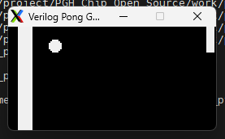

- 생성되는 파일
    
    
    | 파일 | 역할 |
    | --- | --- |
    | **`pong_pt1_TB`** | **iVerilog 시뮬 실행파일** = `TB.v` + 셀 모델(`khu_etri05_stdcells.v`) + `mapped.v`. **게이트+지연 시뮬 본체** |
    | **`vpi_stub.vpi`** | **SystemC 다리** (공유 라이브러리). `vvp`가 dlopen해서 로드. VPI로 SystemC TB 연결 |
    | `pong_pt1_TB.vcd` | DUT(게이트) 측 파형 — **엄청 큼**(연속 실행 시 100MB+) |
    | `sc_pong_pt1_TB.vcd` | SystemC TB 측 파형 |

## 08. GDS

### Step 1. 구동

```c
(chip-eda) pgh@turtle:~/project/PGH_Chip_Open_Source/work/pong_pt1$ source env_settings
#************************************************************************
#* Environment setting for RTL, Co-Simulmatio/Emulation & ETRI050
#************************************************************************
Setting Environment variables as follows;
    PROJECT_DIR=/hai/home/pgh/project/PGH_Chip_Open_Source/work/pong_pt1
    TOP_MODULE=pong_pt1
    HW_STYLE=NONE
    MODE=CA
    MI=PI_PICO
(chip-eda) pgh@turtle:~/project/PGH_Chip_Open_Source/work/pong_pt1$ cd ETRI050

```

이후, 총 4단계를 진행

```c
make place      # 1. GrayWolf: 셀 1004개를 행에 배치
							  // 결과:layout/pong_pt1.def (배치된 설계). density 0.85로 858×843µm 코어. 
							  // Number of cells = 1019(FILL 포함).

make sta        # 2. 정적 타이밍 분석 (Vesta) — 클럭 속도 확인
								// 배치 후 배선 길이 추정으로 최대 동작 주파수를 계산. (선택적 단계)

make route      # 3. QRouter: 셀들을 metal1/2/3로 배선

make migrate    # 4. Magic: 배선 결과 → 실제 레이아웃(.mag)
```

- 주요 그림
    - Routing
        
        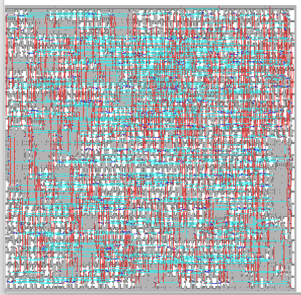
        
- 로그
    - `make place`
        
        ```c
        (chip-eda) pgh@turtle:~/project/PGH_Chip_Open_Source/work/pong_pt1/ETRI050$ make place
        qflow place -T etri050 pong_pt1
        
        --------------------------------
        Qflow project setup
        --------------------------------
        
        Technology set to etri050
        Regenerating files for existing project pong_pt1
        Qrouter detail maze router version 1.4.90.T
        Reading LEF data from file /hai/home/pgh/.conda/envs/chip-eda/share/qflow/tech/etri050/etri050_stdcells.lef.
        LEF Read, Line 113: NOTE:  Old format VIARULE ignored.
        LEF Read, Line 114: NOTE:  Old format VIARULE ignored.
        LEF Read, Line 118: NOTE:  Old format VIARULE ignored.
        LEF Read, Line 119: NOTE:  Old format VIARULE ignored.
        LEF Read, Line 130: NOTE:  Old format VIARULE ignored.
        LEF Read, Line 131: NOTE:  Old format VIARULE ignored.
        LEF Read, Line 135: NOTE:  Old format VIARULE ignored.
        LEF Read, Line 136: NOTE:  Old format VIARULE ignored.
        LEF file:  Defines site corner (ignored)
        LEF file:  Defines site IO (ignored)
        LEF file:  Defines site core (ignored)
        LEF read: Processed 3124 lines.
        LEF Read: encountered 0 errors and 8 warnings total.
        Restoring pong_pt1.rtl.v, pong_pt1.rtlnopwr.v, and pong_pt1.rtlbb.v from pre-placement backups
        Running vlog2Cel to generate input files for graywolf
        vlog2Cel  -l  /hai/home/pgh/.conda/envs/chip-eda/share/qflow/tech/etri050/etri050_stdcells.lef -u 100 -o /hai/home/pgh/project/PGH_Chip_Open_Source/work/pong_pt1/ETRI050/layout/pong_pt1.cel /hai/home/pgh/project/PGH_Chip_Open_Source/work/pong_pt1/ETRI050/synthesis/pong_pt1.rtlnopwr.v
        No pong_pt1.cel1 file found for project. . . no partial blockages to apply to layout.
        Running decongest to set initial density of 0.85
        decongest.tcl pong_pt1  /hai/home/pgh/.conda/envs/chip-eda/share/qflow/tech/etri050/etri050_stdcells.lef FILL,,, 0.85 --units=100 --lib=/hai/home/pgh/.conda/envs/chip-eda/share/qflow/tech/etri050/etri05_stdcells.lib
        Reading FILL {} {} {} macros from LEF file.
        Unexpected input in LEF file:  Only macro defs were expected!
        Line is:   NOWIREEXTENSIONATPIN ON ;
        decongest.tcl:
        Fixed density planning, density = 0.85
        Number of cells = 1019, total width = 1657200
        Width of fill = 292447
        Width of decap = 0
        Width of antenna = 0
        Width of body ties = 0
        
        Done!
        Preparing pin placement hints from pong_pt1.cel2
        Running GrayWolf placement
        graywolf  pong_pt1
        Running getantennacell to determine cell to use for antenna anchors.
        getantennacell.tcl pong_pt1  /hai/home/pgh/.conda/envs/chip-eda/share/qflow/tech/etri050/etri050_stdcells.lef
        Running getfillcell to determine cell to use for fill.
        getfillcell.tcl pong_pt1  /hai/home/pgh/.conda/envs/chip-eda/share/qflow/tech/etri050/etri050_stdcells.lef FILL
        Unexpected input in LEF file:  Only macro defs were expected!
        Using cell FILL for fill
        Running place2def to translate graywolf output to DEF format.
        place2def.tcl pong_pt1 FILL
        Running addspacers to generate power stripes and align cell right edge
        addspacers -stripe 8 225 PG  -p vdd -g gnd -f FILL -O   -l  /hai/home/pgh/.conda/envs/chip-eda/share/qflow/tech/etri050/etri050_stdcells.lef -o pong_pt1_filled.def pong_pt1
        Running arrangepins to adjust pin positions for optimal routing.
        arrangepins.tcl  pong_pt1
        Reading info file pong_pt1.info. . .
        Reading DEF file pong_pt1.def. . .
        Recalculating pin positions
        Writing DEF file pong_pt1_mod.def. . .
        Done with arrangepins.tcl
        DEF2Verilog -v /hai/home/pgh/project/PGH_Chip_Open_Source/work/pong_pt1/ETRI050/synthesis/pong_pt1.rtlnopwr.v -o /hai/home/pgh/project/PGH_Chip_Open_Source/work/pong_pt1/ETRI050/synthesis/pong_pt1_anno.v
        -p vdd -g gnd  -l  /hai/home/pgh/.conda/envs/chip-eda/share/qflow/tech/etri050/etri050_stdcells.lef pong_pt1.def
        Generating RTL verilog and SPICE netlist file in directory
           /hai/home/pgh/project/PGH_Chip_Open_Source/work/pong_pt1/ETRI050/synthesis
        Files:
           Verilog: /hai/home/pgh/project/PGH_Chip_Open_Source/work/pong_pt1/ETRI050/synthesis/pong_pt1.rtl.v
           Verilog: /hai/home/pgh/project/PGH_Chip_Open_Source/work/pong_pt1/ETRI050/synthesis/pong_pt1.rtlnopwr.v
           Verilog: /hai/home/pgh/project/PGH_Chip_Open_Source/work/pong_pt1/ETRI050/synthesis/pong_pt1.rtlbb.v
           Spice:   /hai/home/pgh/project/PGH_Chip_Open_Source/work/pong_pt1/ETRI050/synthesis/pong_pt1.spc
        Copying pong_pt1.rtl.v, pong_pt1.rtlnopwr.v, and pong_pt1.rtlbb.v to backups
        Running vlog2Verilog.
        vlog2Verilog -c -v vdd -g gnd -o pong_pt1.rtl.v pong_pt1_anno.v
        vlog2Verilog -c -p -v vdd -g gnd -o pong_pt1.rtlnopwr.v pong_pt1_anno.v
        vlog2Verilog -c -b -p -n -v vdd -g gnd -o pong_pt1.rtlbb.v pong_pt1_anno.v
        Running vlog2Spice.
        vlog2Spice -i -l  /hai/home/pgh/.conda/envs/chip-eda/share/qflow/tech/etri050/etri050_stdcells.sp -o pong_pt1.spc pong_pt1.rtl.v
        
        ```
        
    - `make sta`
        
        ```c
        (chip-eda) pgh@turtle:~/project/PGH_Chip_Open_Source/work/pong_pt1/ETRI050$ make sta
        qflow sta -T etri050 pong_pt1
        
        --------------------------------
        Qflow project setup
        --------------------------------
        
        Technology set to etri050
        Regenerating files for existing project pong_pt1
        
        Running vesta static timing analysis
        vesta --long pong_pt1.rtlnopwr.v /hai/home/pgh/.conda/envs/chip-eda/share/qflow/tech/etri050/etri05_stdcells.lib
        
        ----------------------------------------------
        Vesta static timing analysis tool
        for qflow 1.4.100
        (c) 2013-2018 Tim Edwards, Open Circuit Design
        ----------------------------------------------
        
        Parsing library "etri05_stdcells"
        End of library at line 6613
        Lib read /hai/home/pgh/.conda/envs/chip-eda/share/qflow/tech/etri050/etri05_stdcells.lib:  Processed 6615 lines.
        Parsing module "pong_pt1"
        Verilog netlist read:  Processed 10555 lines.
        Number of paths analyzed:  52
        
        Top 20 maximum delay paths:
        Path _1934_/CLK to _1939_/D delay 3472.12 ps
              0.0 ps        clk_bF$buf0: CLKBUF1_insert15/Y -> _1934_/CLK
              0.0 ps  \pg.y_pad_reg [1]:           _1934_/Q -> _1343_/B
            385.4 ps              _399_:           _1343_/Y -> _1346_/A
            746.7 ps              _402_:           _1346_/Y -> _1349_/A
           1052.9 ps              _405_:           _1349_/Y -> _1350_/B
           1181.3 ps              _406_:           _1350_/Y -> _1388_/B
           1541.9 ps              _444_:           _1388_/Y -> _1823_/A
           1831.6 ps              _856_:           _1823_/Y -> _1824_/B
           2034.4 ps              _857_:           _1824_/Y -> _1825_/A
           2333.9 ps              _858_:           _1825_/Y -> _1828_/B
           2874.8 ps              _861_:           _1828_/Y -> _1893_/C
           3109.1 ps              _920_:           _1893_/Y -> _1894_/C
           3238.5 ps              _149_:           _1894_/Y -> _1939_/D
        
           clock skew at destination = 2.90133
           setup at destination = 230.733
        
        Path _1934_/CLK to _1937_/D delay 3465.04 ps
              0.0 ps        clk_bF$buf0: CLKBUF1_insert15/Y -> _1934_/CLK
              0.0 ps  \pg.y_pad_reg [1]:           _1934_/Q -> _1343_/B
            385.4 ps              _399_:           _1343_/Y -> _1346_/A
            746.7 ps              _402_:           _1346_/Y -> _1349_/A
           1052.9 ps              _405_:           _1349_/Y -> _1350_/B
           1181.3 ps              _406_:           _1350_/Y -> _1388_/B
           1541.9 ps              _444_:           _1388_/Y -> _1823_/A
           1831.6 ps              _856_:           _1823_/Y -> _1824_/B
           2034.4 ps              _857_:           _1824_/Y -> _1825_/A
           2333.9 ps              _858_:           _1825_/Y -> _1828_/B
           2874.8 ps              _861_:           _1828_/Y -> _1872_/C
           3119.2 ps              _901_:           _1872_/Y -> _1873_/C
           3237.0 ps              _147_:           _1873_/Y -> _1937_/D
        
           clock skew at destination = 2.90133
           setup at destination = 225.103
        
        Path _1934_/CLK to _1934_/D delay 3426.54 ps
              0.0 ps        clk_bF$buf0: CLKBUF1_insert15/Y -> _1934_/CLK
              0.0 ps  \pg.y_pad_reg [1]:           _1934_/Q -> _1343_/B
            385.4 ps              _399_:           _1343_/Y -> _1346_/A
            746.7 ps              _402_:           _1346_/Y -> _1349_/A
           1052.9 ps              _405_:           _1349_/Y -> _1350_/B
           1181.3 ps              _406_:           _1350_/Y -> _1388_/B
           1541.9 ps              _444_:           _1388_/Y -> _1823_/A
           1831.6 ps              _856_:           _1823_/Y -> _1824_/B
           2034.4 ps              _857_:           _1824_/Y -> _1825_/A
           2333.9 ps              _858_:           _1825_/Y -> _1828_/B
           2874.8 ps              _861_:           _1828_/Y -> _1831_/A
           3070.6 ps              _863_:           _1831_/Y -> _1840_/B
           3206.3 ps              _144_:           _1840_/Y -> _1934_/D
        
           clock skew at destination = 0
           setup at destination = 220.212
        
        Path _1934_/CLK to _1933_/D delay 3415.72 ps
              0.0 ps        clk_bF$buf0: CLKBUF1_insert15/Y -> _1934_/CLK
              0.0 ps  \pg.y_pad_reg [1]:           _1934_/Q -> _1343_/B
            385.4 ps              _399_:           _1343_/Y -> _1346_/A
            746.7 ps              _402_:           _1346_/Y -> _1349_/A
           1052.9 ps              _405_:           _1349_/Y -> _1350_/B
           1181.3 ps              _406_:           _1350_/Y -> _1388_/B
           1541.9 ps              _444_:           _1388_/Y -> _1823_/A
           1831.6 ps              _856_:           _1823_/Y -> _1824_/B
           2034.4 ps              _857_:           _1824_/Y -> _1825_/A
           2333.9 ps              _858_:           _1825_/Y -> _1828_/B
           2874.8 ps              _861_:           _1828_/Y -> _1829_/B
           3089.4 ps              _862_:           _1829_/Y -> _1830_/B
           3201.1 ps              _143_:           _1830_/Y -> _1933_/D
        
           clock skew at destination = 2.90133
           setup at destination = 211.699
        
        Path _1934_/CLK to _1936_/D delay 3379.91 ps
              0.0 ps        clk_bF$buf0: CLKBUF1_insert15/Y -> _1934_/CLK
              0.0 ps  \pg.y_pad_reg [1]:           _1934_/Q -> _1343_/B
            385.4 ps              _399_:           _1343_/Y -> _1346_/A
            746.7 ps              _402_:           _1346_/Y -> _1349_/A
           1052.9 ps              _405_:           _1349_/Y -> _1350_/B
           1181.3 ps              _406_:           _1350_/Y -> _1388_/B
           1541.9 ps              _444_:           _1388_/Y -> _1823_/A
           1831.6 ps              _856_:           _1823_/Y -> _1824_/B
           2034.4 ps              _857_:           _1824_/Y -> _1825_/A
           2333.9 ps              _858_:           _1825_/Y -> _1828_/B
           2874.8 ps              _861_:           _1828_/Y -> _1862_/B
           3093.7 ps              _146_:           _1862_/Y -> _1936_/D
        
           clock skew at destination = 2.90133
           setup at destination = 283.291
        
        Path _1924_/CLK to _1913_/D delay 3200.53 ps
              0.0 ps         clk_bF$buf0: CLKBUF1_insert15/Y -> _1924_/CLK
              0.0 ps  \pg.y_ball_reg [0]:           _1924_/Q -> _1171_/A
            252.1 ps               _227_:           _1171_/Y -> _1180_/C
            605.2 ps               _236_:           _1180_/Y -> _1198_/C
            950.0 ps               _254_:           _1198_/Y -> _1208_/B
           1217.0 ps               _264_:           _1208_/Y -> _1209_/B
           1548.3 ps               _265_:           _1209_/Y -> _1486_/B
           1760.3 ps               _540_:           _1486_/Y -> _1488_/B
           1961.6 ps               _542_:           _1488_/Y -> _1494_/B
           2174.0 ps               _548_:           _1494_/Y -> _1513_/C
           2350.5 ps               _567_:           _1513_/Y -> _1562_/B
           2484.6 ps               _615_:           _1562_/Y -> _1563_/B
           2620.7 ps               _616_:           _1563_/Y -> _1564_/A
           2818.0 ps               _617_:           _1564_/Y -> _1594_/B
           2957.5 ps               _123_:           _1594_/Y -> _1913_/D
        
           clock skew at destination = 2.90133
           setup at destination = 240.086
        
        Path _1924_/CLK to _1914_/D delay 3195.49 ps
              0.0 ps         clk_bF$buf0: CLKBUF1_insert15/Y -> _1924_/CLK
              0.0 ps  \pg.y_ball_reg [0]:           _1924_/Q -> _1171_/A
            252.1 ps               _227_:           _1171_/Y -> _1180_/C
            605.2 ps               _236_:           _1180_/Y -> _1198_/C
            950.0 ps               _254_:           _1198_/Y -> _1208_/B
           1217.0 ps               _264_:           _1208_/Y -> _1209_/B
           1548.3 ps               _265_:           _1209_/Y -> _1486_/B
           1760.3 ps               _540_:           _1486_/Y -> _1488_/B
           1961.6 ps               _542_:           _1488_/Y -> _1494_/B
           2174.0 ps               _548_:           _1494_/Y -> _1513_/C
           2350.5 ps               _567_:           _1513_/Y -> _1562_/B
           2484.6 ps               _615_:           _1562_/Y -> _1563_/B
           2620.7 ps               _616_:           _1563_/Y -> _1564_/A
           2818.0 ps               _617_:           _1564_/Y -> _1596_/B
           2957.5 ps               _124_:           _1596_/Y -> _1914_/D
        
           clock skew at destination = -4.13437
           setup at destination = 242.082
        
        Path _1924_/CLK to _1912_/D delay 3141.33 ps
              0.0 ps         clk_bF$buf0: CLKBUF1_insert15/Y -> _1924_/CLK
              0.0 ps  \pg.y_ball_reg [0]:           _1924_/Q -> _1171_/A
            252.1 ps               _227_:           _1171_/Y -> _1180_/C
            605.2 ps               _236_:           _1180_/Y -> _1198_/C
            950.0 ps               _254_:           _1198_/Y -> _1208_/B
           1217.0 ps               _264_:           _1208_/Y -> _1209_/B
           1548.3 ps               _265_:           _1209_/Y -> _1486_/B
           1760.3 ps               _540_:           _1486_/Y -> _1488_/B
           1961.6 ps               _542_:           _1488_/Y -> _1494_/B
           2174.0 ps               _548_:           _1494_/Y -> _1495_/C
           2321.2 ps               _549_:           _1495_/Y -> _1506_/C
           2494.4 ps               _560_:           _1506_/Y -> _1515_/A
           2650.3 ps               _569_:           _1515_/Y -> _1547_/C
           2792.1 ps               _601_:           _1547_/Y -> _1556_/B
           2912.6 ps               _122_:           _1556_/Y -> _1912_/D
        
           clock skew at destination = -4.13437
           setup at destination = 232.838
        
        Path _1914_/CLK to _1918_/D delay 3097.68 ps
              0.0 ps          clk_bF$buf6: CLKBUF1_insert9/Y -> _1914_/CLK
              0.0 ps  \pg.x_delta_reg [8]:          _1914_/Q -> _1595_/A
            206.0 ps                _647_:          _1595_/Y -> _1613_/B
            442.2 ps                _664_:          _1613_/Y -> _1615_/B
            696.3 ps                _666_:          _1615_/Y -> _1619_/B
            959.7 ps                _670_:          _1619_/Y -> _1628_/A
           1194.7 ps                _679_:          _1628_/Y -> _1673_/B
           1416.2 ps                _724_:          _1673_/Y -> _1675_/C
           1559.4 ps                _726_:          _1675_/Y -> _1676_/C
           1718.6 ps                _727_:          _1676_/Y -> _1678_/A
           1934.4 ps                _729_:          _1678_/Y -> _1679_/B
           2375.1 ps                _730_:          _1679_/Y -> _1691_/A
           2718.2 ps                _739_:          _1691_/Y -> _1692_/C
           2856.3 ps                _128_:          _1692_/Y -> _1918_/D
        
           clock skew at destination = 3.92141
           setup at destination = 237.419
        
        Path _1914_/CLK to _1917_/D delay 3097.68 ps
              0.0 ps          clk_bF$buf6: CLKBUF1_insert9/Y -> _1914_/CLK
              0.0 ps  \pg.x_delta_reg [8]:          _1914_/Q -> _1595_/A
            206.0 ps                _647_:          _1595_/Y -> _1613_/B
            442.2 ps                _664_:          _1613_/Y -> _1615_/B
            696.3 ps                _666_:          _1615_/Y -> _1619_/B
            959.7 ps                _670_:          _1619_/Y -> _1628_/A
           1194.7 ps                _679_:          _1628_/Y -> _1673_/B
           1416.2 ps                _724_:          _1673_/Y -> _1675_/C
           1559.4 ps                _726_:          _1675_/Y -> _1676_/C
           1718.6 ps                _727_:          _1676_/Y -> _1678_/A
           1934.4 ps                _729_:          _1678_/Y -> _1679_/B
           2375.1 ps                _730_:          _1679_/Y -> _1688_/A
           2718.2 ps                _737_:          _1688_/Y -> _1689_/C
           2856.3 ps                _127_:          _1689_/Y -> _1917_/D
        
           clock skew at destination = 3.92141
           setup at destination = 237.419
        
        Path _1914_/CLK to _1915_/D delay 3097.68 ps
              0.0 ps          clk_bF$buf6: CLKBUF1_insert9/Y -> _1914_/CLK
              0.0 ps  \pg.x_delta_reg [8]:          _1914_/Q -> _1595_/A
            206.0 ps                _647_:          _1595_/Y -> _1613_/B
            442.2 ps                _664_:          _1613_/Y -> _1615_/B
            696.3 ps                _666_:          _1615_/Y -> _1619_/B
            959.7 ps                _670_:          _1619_/Y -> _1628_/A
           1194.7 ps                _679_:          _1628_/Y -> _1673_/B
           1416.2 ps                _724_:          _1673_/Y -> _1675_/C
           1559.4 ps                _726_:          _1675_/Y -> _1676_/C
           1718.6 ps                _727_:          _1676_/Y -> _1678_/A
           1934.4 ps                _729_:          _1678_/Y -> _1679_/B
           2375.1 ps                _730_:          _1679_/Y -> _1682_/A
           2718.2 ps                _733_:          _1682_/Y -> _1683_/C
           2856.3 ps                _125_:          _1683_/Y -> _1915_/D
        
           clock skew at destination = 3.92141
           setup at destination = 237.419
        
        Path _1914_/CLK to _1920_/D delay 3097.68 ps
              0.0 ps          clk_bF$buf6: CLKBUF1_insert9/Y -> _1914_/CLK
              0.0 ps  \pg.x_delta_reg [8]:          _1914_/Q -> _1595_/A
            206.0 ps                _647_:          _1595_/Y -> _1613_/B
            442.2 ps                _664_:          _1613_/Y -> _1615_/B
            696.3 ps                _666_:          _1615_/Y -> _1619_/B
            959.7 ps                _670_:          _1619_/Y -> _1628_/A
           1194.7 ps                _679_:          _1628_/Y -> _1673_/B
           1416.2 ps                _724_:          _1673_/Y -> _1675_/C
           1559.4 ps                _726_:          _1675_/Y -> _1676_/C
           1718.6 ps                _727_:          _1676_/Y -> _1678_/A
           1934.4 ps                _729_:          _1678_/Y -> _1679_/B
           2375.1 ps                _730_:          _1679_/Y -> _1698_/A
           2718.2 ps                _744_:          _1698_/Y -> _1699_/C
           2856.3 ps                _130_:          _1699_/Y -> _1920_/D
        
           clock skew at destination = 3.92141
           setup at destination = 237.419
        
        Path _1914_/CLK to _1919_/D delay 3097.68 ps
              0.0 ps          clk_bF$buf6: CLKBUF1_insert9/Y -> _1914_/CLK
              0.0 ps  \pg.x_delta_reg [8]:          _1914_/Q -> _1595_/A
            206.0 ps                _647_:          _1595_/Y -> _1613_/B
            442.2 ps                _664_:          _1613_/Y -> _1615_/B
            696.3 ps                _666_:          _1615_/Y -> _1619_/B
            959.7 ps                _670_:          _1619_/Y -> _1628_/A
           1194.7 ps                _679_:          _1628_/Y -> _1673_/B
           1416.2 ps                _724_:          _1673_/Y -> _1675_/C
           1559.4 ps                _726_:          _1675_/Y -> _1676_/C
           1718.6 ps                _727_:          _1676_/Y -> _1678_/A
           1934.4 ps                _729_:          _1678_/Y -> _1679_/B
           2375.1 ps                _730_:          _1679_/Y -> _1695_/A
           2718.2 ps                _742_:          _1695_/Y -> _1696_/C
           2856.3 ps                _129_:          _1696_/Y -> _1919_/D
        
           clock skew at destination = 3.92141
           setup at destination = 237.419
        
        Path _1914_/CLK to _1922_/D delay 3097.68 ps
              0.0 ps          clk_bF$buf6: CLKBUF1_insert9/Y -> _1914_/CLK
              0.0 ps  \pg.x_delta_reg [8]:          _1914_/Q -> _1595_/A
            206.0 ps                _647_:          _1595_/Y -> _1613_/B
            442.2 ps                _664_:          _1613_/Y -> _1615_/B
            696.3 ps                _666_:          _1615_/Y -> _1619_/B
            959.7 ps                _670_:          _1619_/Y -> _1628_/A
           1194.7 ps                _679_:          _1628_/Y -> _1673_/B
           1416.2 ps                _724_:          _1673_/Y -> _1675_/C
           1559.4 ps                _726_:          _1675_/Y -> _1676_/C
           1718.6 ps                _727_:          _1676_/Y -> _1678_/A
           1934.4 ps                _729_:          _1678_/Y -> _1679_/B
           2375.1 ps                _730_:          _1679_/Y -> _1704_/A
           2718.2 ps                _748_:          _1704_/Y -> _1705_/C
           2856.3 ps                _132_:          _1705_/Y -> _1922_/D
        
           clock skew at destination = 3.92141
           setup at destination = 237.419
        
        Path _1914_/CLK to _1921_/D delay 3097.68 ps
              0.0 ps          clk_bF$buf6: CLKBUF1_insert9/Y -> _1914_/CLK
              0.0 ps  \pg.x_delta_reg [8]:          _1914_/Q -> _1595_/A
            206.0 ps                _647_:          _1595_/Y -> _1613_/B
            442.2 ps                _664_:          _1613_/Y -> _1615_/B
            696.3 ps                _666_:          _1615_/Y -> _1619_/B
            959.7 ps                _670_:          _1619_/Y -> _1628_/A
           1194.7 ps                _679_:          _1628_/Y -> _1673_/B
           1416.2 ps                _724_:          _1673_/Y -> _1675_/C
           1559.4 ps                _726_:          _1675_/Y -> _1676_/C
           1718.6 ps                _727_:          _1676_/Y -> _1678_/A
           1934.4 ps                _729_:          _1678_/Y -> _1679_/B
           2375.1 ps                _730_:          _1679_/Y -> _1701_/A
           2718.2 ps                _746_:          _1701_/Y -> _1702_/C
           2856.3 ps                _131_:          _1702_/Y -> _1921_/D
        
           clock skew at destination = 3.92141
           setup at destination = 237.419
        
        Path _1914_/CLK to _1916_/D delay 3097.68 ps
              0.0 ps          clk_bF$buf6: CLKBUF1_insert9/Y -> _1914_/CLK
              0.0 ps  \pg.x_delta_reg [8]:          _1914_/Q -> _1595_/A
            206.0 ps                _647_:          _1595_/Y -> _1613_/B
            442.2 ps                _664_:          _1613_/Y -> _1615_/B
            696.3 ps                _666_:          _1615_/Y -> _1619_/B
            959.7 ps                _670_:          _1619_/Y -> _1628_/A
           1194.7 ps                _679_:          _1628_/Y -> _1673_/B
           1416.2 ps                _724_:          _1673_/Y -> _1675_/C
           1559.4 ps                _726_:          _1675_/Y -> _1676_/C
           1718.6 ps                _727_:          _1676_/Y -> _1678_/A
           1934.4 ps                _729_:          _1678_/Y -> _1679_/B
           2375.1 ps                _730_:          _1679_/Y -> _1685_/A
           2718.2 ps                _735_:          _1685_/Y -> _1686_/C
           2856.3 ps                _126_:          _1686_/Y -> _1916_/D
        
           clock skew at destination = 3.92141
           setup at destination = 237.419
        
        Path _1940_/CLK to _1940_/D delay 2999.62 ps
              0.0 ps        clk_bF$buf6: CLKBUF1_insert9/Y -> _1940_/CLK
              0.0 ps  \pg.y_pad_reg [7]:          _1940_/Q -> _1812_/A
            117.5 ps              _845_:          _1812_/Y -> _1813_/B
            243.6 ps              _846_:          _1813_/Y -> _1817_/A
            792.2 ps              _850_:          _1817_/Y -> _1846_/A
           1136.9 ps              _877_:          _1846_/Y -> _1856_/B
           1348.6 ps              _886_:          _1856_/Y -> _1857_/B
           1570.5 ps              _887_:          _1857_/Y -> _1866_/B
           1729.7 ps              _895_:          _1866_/Y -> _1868_/C
           2003.0 ps              _897_:          _1868_/Y -> _1886_/B
           2353.8 ps              _913_:          _1886_/Y -> _1901_/A
           2535.6 ps              _927_:          _1901_/Y -> _1903_/A
           2688.6 ps              _929_:          _1903_/Y -> _1904_/D
           2797.4 ps              _150_:          _1904_/Y -> _1940_/D
        
           clock skew at destination = 0
           setup at destination = 202.265
        
        Path _1940_/CLK to _1941_/D delay 2998.26 ps
              0.0 ps        clk_bF$buf6: CLKBUF1_insert9/Y -> _1940_/CLK
              0.0 ps  \pg.y_pad_reg [7]:          _1940_/Q -> _1812_/A
            117.5 ps              _845_:          _1812_/Y -> _1813_/B
            243.6 ps              _846_:          _1813_/Y -> _1817_/A
            792.2 ps              _850_:          _1817_/Y -> _1846_/A
           1136.9 ps              _877_:          _1846_/Y -> _1856_/B
           1348.6 ps              _886_:          _1856_/Y -> _1857_/B
           1570.5 ps              _887_:          _1857_/Y -> _1866_/B
           1729.7 ps              _895_:          _1866_/Y -> _1868_/C
           2003.0 ps              _897_:          _1868_/Y -> _1886_/B
           2353.8 ps              _913_:          _1886_/Y -> _1907_/S
           2646.4 ps              _932_:          _1907_/Y -> _1908_/A
           2762.4 ps              _151_:          _1908_/Y -> _1941_/D
        
           clock skew at destination = 10.9571
           setup at destination = 224.907
        
        Path _1933_/CLK to _1935_/D delay 2993.26 ps
              0.0 ps        clk_bF$buf2: CLKBUF1_insert13/Y -> _1933_/CLK
              0.0 ps  \pg.y_pad_reg [0]:           _1933_/Q -> _1343_/A
            404.7 ps              _399_:           _1343_/Y -> _1346_/A
            765.8 ps              _402_:           _1346_/Y -> _1347_/B
           1088.5 ps              _403_:           _1347_/Y -> _1387_/B
           1238.1 ps              _443_:           _1387_/Y -> _1388_/A
           1610.1 ps              _444_:           _1388_/Y -> _1823_/A
           1909.2 ps              _856_:           _1823_/Y -> _1824_/B
           2113.6 ps              _857_:           _1824_/Y -> _1825_/A
           2456.4 ps              _858_:           _1825_/Y -> _1842_/B
           2642.9 ps              _873_:           _1842_/Y -> _1852_/C
           2764.1 ps              _145_:           _1852_/Y -> _1935_/D
        
           clock skew at destination = 2.90133
           setup at destination = 226.301
        
        Path _1940_/CLK to _1938_/D delay 2896.16 ps
              0.0 ps        clk_bF$buf6: CLKBUF1_insert9/Y -> _1940_/CLK
              0.0 ps  \pg.y_pad_reg [7]:          _1940_/Q -> _1812_/A
            117.5 ps              _845_:          _1812_/Y -> _1813_/B
            243.6 ps              _846_:          _1813_/Y -> _1817_/A
            792.2 ps              _850_:          _1817_/Y -> _1846_/A
           1136.9 ps              _877_:          _1846_/Y -> _1856_/B
           1348.6 ps              _886_:          _1856_/Y -> _1857_/B
           1570.5 ps              _887_:          _1857_/Y -> _1866_/B
           1729.7 ps              _895_:          _1866_/Y -> _1868_/C
           2003.0 ps              _897_:          _1868_/Y -> _1869_/B
           2219.3 ps              _898_:          _1869_/Y -> _1880_/B
           2390.4 ps              _908_:          _1880_/Y -> _1882_/A
           2534.6 ps              _910_:          _1882_/Y -> _1883_/C
           2654.0 ps              _148_:          _1883_/Y -> _1938_/D
        
           clock skew at destination = 10.9571
           setup at destination = 231.201
        
        Computed maximum clock frequency (zero margin) = 288.008 MHz
        -----------------------------------------
        
        Number of paths analyzed:  52
        
        Top 20 minimum delay paths:
        Path _1071_/CLK to _1080_/D delay 67.7263 ps
              0.0 ps  clk_bF$buf5: CLKBUF1_insert10/Y -> _1071_/CLK
              0.0 ps    p_tick_en:           _1071_/Q -> _1022_/A
             72.9 ps         _10_:           _1022_/Y -> _1080_/D
        
           clock skew at destination = 0
           hold at destination = -5.16599
        
        Path _1071_/CLK to _1076_/D delay 75.1495 ps
              0.0 ps  clk_bF$buf5: CLKBUF1_insert10/Y -> _1071_/CLK
              0.0 ps    p_tick_en:           _1071_/Q -> _1003_/B
             84.7 ps          _6_:           _1003_/Y -> _1076_/D
        
           clock skew at destination = 0
           hold at destination = -9.53259
        
        Path _1071_/CLK to _1073_/D delay 75.1495 ps
              0.0 ps  clk_bF$buf5: CLKBUF1_insert10/Y -> _1071_/CLK
              0.0 ps    p_tick_en:           _1071_/Q ->  _986_/B
             84.7 ps          _3_:            _986_/Y -> _1073_/D
        
           clock skew at destination = 0
           hold at destination = -9.53259
        
        Path _1071_/CLK to _1077_/D delay 75.1495 ps
              0.0 ps  clk_bF$buf5: CLKBUF1_insert10/Y -> _1071_/CLK
              0.0 ps    p_tick_en:           _1071_/Q -> _1009_/B
             84.7 ps          _7_:           _1009_/Y -> _1077_/D
        
           clock skew at destination = 0
           hold at destination = -9.53259
        
        Path _1071_/CLK to _1075_/D delay 75.1495 ps
              0.0 ps  clk_bF$buf5: CLKBUF1_insert10/Y -> _1071_/CLK
              0.0 ps    p_tick_en:           _1071_/Q ->  _998_/B
             84.7 ps          _5_:            _998_/Y -> _1075_/D
        
           clock skew at destination = 0
           hold at destination = -9.53259
        
        Path _1071_/CLK to _1074_/D delay 75.1495 ps
              0.0 ps  clk_bF$buf5: CLKBUF1_insert10/Y -> _1071_/CLK
              0.0 ps    p_tick_en:           _1071_/Q ->  _993_/B
             84.7 ps          _4_:            _993_/Y -> _1074_/D
        
           clock skew at destination = 0
           hold at destination = -9.53259
        
        Path _1071_/CLK to _1078_/D delay 77.8128 ps
              0.0 ps  clk_bF$buf5: CLKBUF1_insert10/Y -> _1071_/CLK
              0.0 ps    p_tick_en:           _1071_/Q -> _1015_/A
             99.3 ps          _8_:           _1015_/Y -> _1078_/D
        
           clock skew at destination = 0
           hold at destination = -21.4428
        
        Path _1071_/CLK to _1088_/D delay 84.2918 ps
              0.0 ps  clk_bF$buf5: CLKBUF1_insert10/Y -> _1071_/CLK
              0.0 ps    p_tick_en:           _1071_/Q -> _1069_/B
             84.7 ps         _18_:           _1069_/Y -> _1088_/D
        
           clock skew at destination = 7.0357
           hold at destination = -7.42599
        
        Path _1071_/CLK to _1089_/D delay 84.2918 ps
              0.0 ps  clk_bF$buf5: CLKBUF1_insert10/Y -> _1071_/CLK
              0.0 ps    p_tick_en:           _1071_/Q -> _1070_/B
             84.7 ps         _19_:           _1070_/Y -> _1089_/D
        
           clock skew at destination = 7.0357
           hold at destination = -7.42599
        
        Path _1933_/CLK to _1933_/D delay 229.732 ps
              0.0 ps        clk_bF$buf2: CLKBUF1_insert13/Y -> _1933_/CLK
              0.0 ps  \pg.y_pad_reg [0]:           _1933_/Q -> _1826_/C
             72.4 ps              _859_:           _1826_/Y -> _1830_/A
            129.6 ps              _143_:           _1830_/Y -> _1933_/D
        
           clock skew at destination = 0
           hold at destination = 100.159
        
        Path _1924_/CLK to _1924_/D delay 234.815 ps
              0.0 ps         clk_bF$buf0: CLKBUF1_insert15/Y -> _1924_/CLK
              0.0 ps  \pg.y_ball_reg [0]:           _1924_/Q -> _1708_/C
             72.7 ps               _750_:           _1708_/Y -> _1721_/B
            134.1 ps               _134_:           _1721_/Y -> _1924_/D
        
           clock skew at destination = 0
           hold at destination = 100.719
        
        Path _1925_/CLK to _1925_/D delay 239.675 ps
              0.0 ps         clk_bF$buf0: CLKBUF1_insert15/Y -> _1925_/CLK
              0.0 ps  \pg.y_ball_reg [1]:           _1925_/Q -> _1740_/C
             72.7 ps               _781_:           _1740_/Y -> _1741_/C
            146.5 ps               _135_:           _1741_/Y -> _1925_/D
        
           clock skew at destination = 0
           hold at destination = 93.1326
        
        Path _1934_/CLK to _1934_/D delay 239.675 ps
              0.0 ps        clk_bF$buf0: CLKBUF1_insert15/Y -> _1934_/CLK
              0.0 ps  \pg.y_pad_reg [1]:           _1934_/Q -> _1839_/C
             72.7 ps              _871_:           _1839_/Y -> _1840_/C
            146.5 ps              _144_:           _1840_/Y -> _1934_/D
        
           clock skew at destination = 0
           hold at destination = 93.1326
        
        Path _1935_/CLK to _1935_/D delay 239.675 ps
              0.0 ps        clk_bF$buf1: CLKBUF1_insert14/Y -> _1935_/CLK
              0.0 ps  \pg.y_pad_reg [2]:           _1935_/Q -> _1842_/C
             72.7 ps              _873_:           _1842_/Y -> _1852_/C
            146.5 ps              _145_:           _1852_/Y -> _1935_/D
        
           clock skew at destination = 0
           hold at destination = 93.1326
        
        Path _1083_/CLK to _1083_/D delay 239.675 ps
              0.0 ps  clk_bF$buf3: CLKBUF1_insert12/Y -> _1083_/CLK
              0.0 ps    \pg.y [2]:           _1083_/Q -> _1037_/C
             72.7 ps         _51_:           _1037_/Y -> _1043_/C
            146.5 ps         _13_:           _1043_/Y -> _1083_/D
        
           clock skew at destination = 0
           hold at destination = 93.1326
        
        Path _1087_/CLK to _1087_/D delay 239.675 ps
              0.0 ps  clk_bF$buf5: CLKBUF1_insert10/Y -> _1087_/CLK
              0.0 ps    \pg.y [6]:           _1087_/Q -> _1064_/C
             72.7 ps         _74_:           _1064_/Y -> _1068_/C
            146.5 ps         _17_:           _1068_/Y -> _1087_/D
        
           clock skew at destination = 0
           hold at destination = 93.1326
        
        Path _1082_/CLK to _1082_/D delay 239.675 ps
              0.0 ps  clk_bF$buf3: CLKBUF1_insert12/Y -> _1082_/CLK
              0.0 ps    \pg.y [1]:           _1082_/Q -> _1035_/C
             72.7 ps         _50_:           _1035_/Y -> _1036_/C
            146.5 ps         _12_:           _1036_/Y -> _1082_/D
        
           clock skew at destination = 0
           hold at destination = 93.1326
        
        Path _1084_/CLK to _1084_/D delay 239.675 ps
              0.0 ps  clk_bF$buf3: CLKBUF1_insert12/Y -> _1084_/CLK
              0.0 ps    \pg.y [3]:           _1084_/Q -> _1044_/C
             72.7 ps         _57_:           _1044_/Y -> _1049_/C
            146.5 ps         _14_:           _1049_/Y -> _1084_/D
        
           clock skew at destination = 0
           hold at destination = 93.1326
        
        Path _1085_/CLK to _1085_/D delay 239.675 ps
              0.0 ps  clk_bF$buf3: CLKBUF1_insert12/Y -> _1085_/CLK
              0.0 ps    \pg.y [4]:           _1085_/Q -> _1050_/C
             72.7 ps         _62_:           _1050_/Y -> _1056_/C
            146.5 ps         _15_:           _1056_/Y -> _1085_/D
        
           clock skew at destination = 0
           hold at destination = 93.1326
        
        Path _1081_/CLK to _1081_/D delay 239.675 ps
              0.0 ps  clk_bF$buf5: CLKBUF1_insert10/Y -> _1081_/CLK
              0.0 ps    \pg.y [0]:           _1081_/Q -> _1030_/C
             72.7 ps         _46_:           _1030_/Y -> _1031_/C
            146.5 ps         _11_:           _1031_/Y -> _1081_/D
        
           clock skew at destination = 0
           hold at destination = 93.1326
        
        Design meets minimum hold timing.
        -----------------------------------------
        
        Number of paths analyzed:  0
        
        Top 0 maximum delay paths:
        -----------------------------------------
        
        Number of paths analyzed:  0
        
        Top 0 minimum delay paths:
        -----------------------------------------
        
        ```
        
    - `make route`
        
        ```c
        (chip-eda) pgh@turtle:~/project/PGH_Chip_Open_Source/work/pong_pt1/ETRI050$ make route
        qflow route -T etri050 pong_pt1
        
        --------------------------------
        Qflow project setup
        --------------------------------
        
        Technology set to etri050
        Regenerating files for existing project pong_pt1
        Running qrouter 1.4.90.T
        qrouter -noc  -s pong_pt1.cfg
        *** Running stage1 routing with defaults
        Nets remaining: 1000
        Nets remaining: 900
        Nets remaining: 800
        Nets remaining: 700
        Nets remaining: 600
        Nets remaining: 500
        Nets remaining: 400
        Nets remaining: 300
        Nets remaining: 200
        Nets remaining: 100
        Nets remaining: 90
        Nets remaining: 80
        Progress: Stage 1 total routes completed: 2295
        Failed net routes: 78
        *** Running stage2 routing with options mask 10, effort 10
        Nets remaining: 80
        Nets remaining: 80
        Nets remaining: 80
        Nets remaining: 80
        Nets remaining: 80
        Progress: Stage 2 total routes completed: 2339
        Failed net routes: 77
        *** Running stage2 routing with options mask 20, effort 10
        Nets remaining: 70
        Nets remaining: 70
        Nets remaining: 70
        Nets remaining: 60
        Nets remaining: 50
        Nets remaining: 40
        Nets remaining: 30
        Nets remaining: 20
        Nets remaining: 10
        Nets remaining: 9
        Nets remaining: 8
        Nets remaining: 7
        Nets remaining: 6
        Nets remaining: 5
        Nets remaining: 4
        Nets remaining: 3
        Nets remaining: 4
        Nets remaining: 4
        Nets remaining: 3
        Nets remaining: 2
        Nets remaining: 1
        Progress: Stage 2 total routes completed: 2820
        No failed routes!
        *** Running stage3 routing with defaults, 1st round
        Nets remaining: 1000
        Nets remaining: 900
        Nets remaining: 800
        Nets remaining: 700
        Nets remaining: 600
        Nets remaining: 400
        Nets remaining: 300
        Nets remaining: 200
        Nets remaining: 100
        Nets remaining: 90
        Nets remaining: 80
        Nets remaining: 70
        Nets remaining: 60
        Nets remaining: 50
        Nets remaining: 40
        Nets remaining: 30
        Nets remaining: 20
        Nets remaining: 10
        Nets remaining: 9
        Nets remaining: 8
        Nets remaining: 7
        Nets remaining: 6
        Nets remaining: 5
        Nets remaining: 4
        Nets remaining: 3
        Nets remaining: 2
        Nets remaining: 1
        Progress: Stage 3 total routes completed: 5140
        No failed routes!
        *** Running stage3 routing with defaults, 2nd round
        Nets remaining: 1000
        Nets remaining: 900
        Nets remaining: 800
        Nets remaining: 700
        Nets remaining: 600
        Nets remaining: 400
        Nets remaining: 300
        Nets remaining: 200
        Nets remaining: 100
        Nets remaining: 90
        Nets remaining: 80
        Nets remaining: 70
        Nets remaining: 60
        Nets remaining: 50
        Nets remaining: 40
        Nets remaining: 30
        Nets remaining: 20
        Nets remaining: 10
        Nets remaining: 9
        Nets remaining: 8
        Nets remaining: 7
        Nets remaining: 6
        Nets remaining: 5
        Nets remaining: 4
        Nets remaining: 3
        Nets remaining: 2
        Nets remaining: 1
        Progress: Stage 3 total routes completed: 7449
        No failed routes!
        *** Writing DEF file pong_pt1_route.def
        Final: No failed routes!
        *** Writing RC file pong_pt1_route.rc
        DEF2Verilog -v /hai/home/pgh/project/PGH_Chip_Open_Source/work/pong_pt1/ETRI050/synthesis/pong_pt1.rtlnopwr.v -o /hai/home/pgh/project/PGH_Chip_Open_Source/work/pong_pt1/ETRI050/synthesis/pong_pt1_postroute.v
        -p vdd -g gnd  -l  /hai/home/pgh/.conda/envs/chip-eda/share/qflow/tech/etri050/etri050_stdcells.lef pong_pt1_route.def
        Generating RTL verilog and SPICE netlist file in directory
           /hai/home/pgh/project/PGH_Chip_Open_Source/work/pong_pt1/ETRI050/synthesis
        Running vlog2Verilog.
        vlog2Verilog -c -v vdd -g gnd -o pong_pt1.rtl.anno.v pong_pt1_postroute.v
        vlog2Verilog -c -p -v vdd -g gnd -o pong_pt1.rtlnopwr.anno.v pong_pt1_postroute.v
        /hai/home/pgh/.conda/envs/chip-eda/share/qflow/bin/vlog2Verilog -c -b -p -n -v vdd -g gnd -o pong_pt1.rtlbb.anno.v pong_pt1_postroute.v
        Running vlog2Spice.
        vlog2Spice -i -l  /hai/home/pgh/.conda/envs/chip-eda/share/qflow/tech/etri050/etri050_stdcells.sp -o pong_pt1.anno.spc pong_pt1.rtl.anno.v
        
        ```
        
    - `make migrate`
        
        ```c
        (chip-eda) pgh@turtle:~/project/PGH_Chip_Open_Source/work/pong_pt1/ETRI050$ make migrate
        qflow migrate -T etri050 pong_pt1
        
        --------------------------------
        Qflow project setup
        --------------------------------
        
        Technology set to etri050
        Regenerating files for existing project pong_pt1
        Running magic 8.3.465
        magic -dnull -noconsole  migrate_pong_pt1.tcl
        
        Magic 8.3 revision 465 - Compiled on Tue Mar 19 23:17:55 UTC 2024.
        Starting magic under Tcl interpreter
        Using the terminal as the console.
        Using NULL graphics device.
        Processing system .magicrc file
        Input style lambda=0.30(p): scaleFactor=30, multiplier=1
        Contact size value ignored (using GDS generation rules).
        Contact size value ignored (using GDS generation rules).
        Contact size value ignored (using GDS generation rules).
        Contact size value ignored (using GDS generation rules).
        Contact size value ignored (using GDS generation rules).
        Contact size value ignored (using GDS generation rules).
        The following types are not handled by extraction and will be treated as non-electrical types:
            n_field_implant p_field_implant nselect pselect glass filln filla fillb xp m1p m2p m3p comment bb
        2 Magic internal units = 1 Lambda
        Loading "migrate_pong_pt1.tcl" from command line.
        Root cell box:
                   width x height  (   llx,  lly  ), (   urx,  ury  )
        
        microns:   0.000 x 0.000   ( 0.000,  0.000), ( 0.000,  0.000)
        lambda:     0.00 x 0.00    (  0.00,  0.00 ), (  0.00,  0.00 )
        internal:      0 x 0       (     0,  0    ), (     0,  0    )
        Reading LEF data from file /hai/home/pgh/.conda/envs/chip-eda/share/qflow/tech/etri050/etri050_stdcells.lef.
        This action cannot be undone.
        LEF read: Processed 3124 lines.
        Reading DEF data from file pong_pt1.def.
        This action cannot be undone.
        DEF read, Line 13 (Error): END statement out of context.
          Processed 2050 subcell instances total.
          Processed 11 pins total.
          Processed 1025 nets total.
          Processed 2 special nets total.
        DEF read: Processed 14745 lines.
        DEF Read: encountered 1 error total.
        Generating LEF output pong_pt1.lef for cell pong_pt1:
        Diagnostic:  Write LEF header for cell pong_pt1
        Diagnostic:  Writing LEF output for cell pong_pt1
        Diagnostic:  Scale value is 0.150000
        Extracting FILL into FILL.ext:
        Extracting INVX1 into INVX1.ext:
        Extracting INVX2 into INVX2.ext:
        Extracting NAND3X1 into NAND3X1.ext:
        Extracting NOR2X1 into NOR2X1.ext:
        Extracting OAI21X1 into OAI21X1.ext:
        Extracting NAND2X1 into NAND2X1.ext:
        Extracting OR2X2 into OR2X2.ext:
        Extracting DFFSR into DFFSR.ext:
        Extracting AND2X2 into AND2X2.ext:
        Extracting AOI21X1 into AOI21X1.ext:
        Extracting BUFX2 into BUFX2.ext:
        Extracting AOI22X1 into AOI22X1.ext:
        Extracting NOR3X1 into NOR3X1.ext:
        Extracting INVX4 into INVX4.ext:
        Extracting OAI22X1 into OAI22X1.ext:
        Extracting CLKBUF1 into CLKBUF1.ext:
        Extracting MUX2X1 into MUX2X1.ext:
        Extracting INVX8 into INVX8.ext:
        Extracting pong_pt1 into pong_pt1.ext:
        exttospice finished.
        
        ```
        
- 주요 로그
    - Place (GrayWolf 배치)
        
        ```c
        Number of cells = 1019, total width = 1657200
        Total core area : 7.02e+09
        Core values: 150 150 85650 82950
        Initial core layout: (150 150) to (85650 82950) (scale um * 100)
        ```
        
        | 항목 | 값 | 해석 |
        | --- | --- | --- |
        | 셀 수 | **1019개** | 1004 + FILL 셀 (빈틈 메움) |
        | 코어 영역 | (150,150)~(85650,82950) | **855 × 828 µm** (100배 스케일) |
        | density | 0.85 | 셀이 85% 밀도로 배치 |
    - **route (QRouter 배선)**
        
        ```c
        Nets remaining: 1
        Progress: Stage 3 total routes completed: 7449
        No failed routes!         
        Final: No failed routes!
        
        // 1004셀을 3층 금속으로 하나도 안 막히고 다 이음.
        ```
        
        | 항목 | 값 | 해석 |
        | --- | --- | --- |
        | **완료된 라우트** | **7,449개** | metal1/2/3로 뚫은 배선 |
        | 네트 수 | 1,025 nets | 셀 간 연결 신호 |
        | **실패 라우트** | **0개** 🎯 | **모든 배선 성공!** |
    - **migrate (Magic 레이아웃)**
        
        ```c
        layout/pong_pt1.mag  (506KB)
        log/magic_db.log 생성
        
        // 물리 레이아웃 pong_pt1.mag 완성
        // 배치+배선 결과가 Magic 레이아웃으로 생성.
        ```
        
- 면적 확인
    - 코어 크기 :  **876.6 × 841.05 µm**
    - 면적 : **737,264 µm²**
- 실제 모습 확인
    
    ```c
    (chip-eda) pgh@turtle:~/project/PGH_Chip_Open_Source/work/pong_pt1/ETRI050/layout$ magic -T scmos pong_pt1.mag &
    ```
    
    - 모습
        
        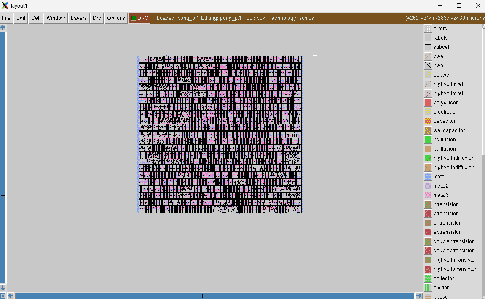
        
        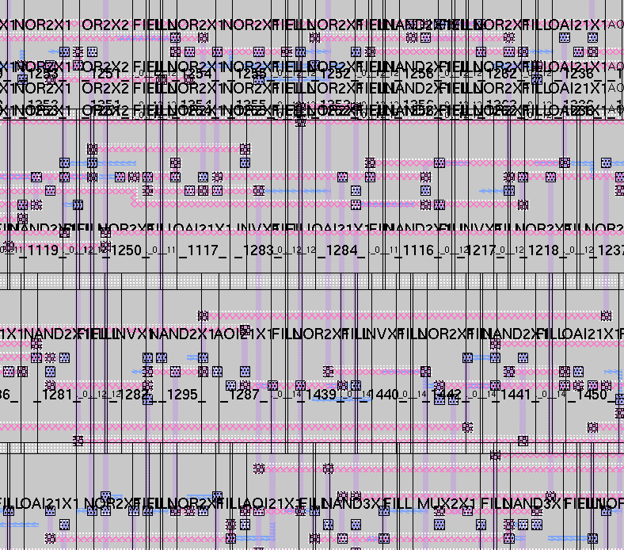
        
    
    | Magic 색 | 레이어 | Magic 색 | 레이어 |
    | --- | --- | --- | --- |
    | 파랑 실선 | **metal1** | 초록 | **ndiffusion** |
    | 보라/핑크 | **metal2** | 갈색/베이지 | **pdiffusion** |
    | 빨강 | **polysilicon** (게이트) | 검정 점 | contact/via |
    
    | 명령 | 동작 |
    | --- | --- |
    | **`see allSame`** | **다 보이기** (전부 복구)  |
    | `see no *` | **다 숨기기** |
    | `see no metal1` | metal1만 **숨기기** |
    | `see metal1` | metal1만 **보이기(추가)** |
    | `see no metal1 metal2 metal3` | 금속 3층 숨기기 → 밑의 트랜지스터 드러남 |
- Metal 별 모습 (unexpand)
    
    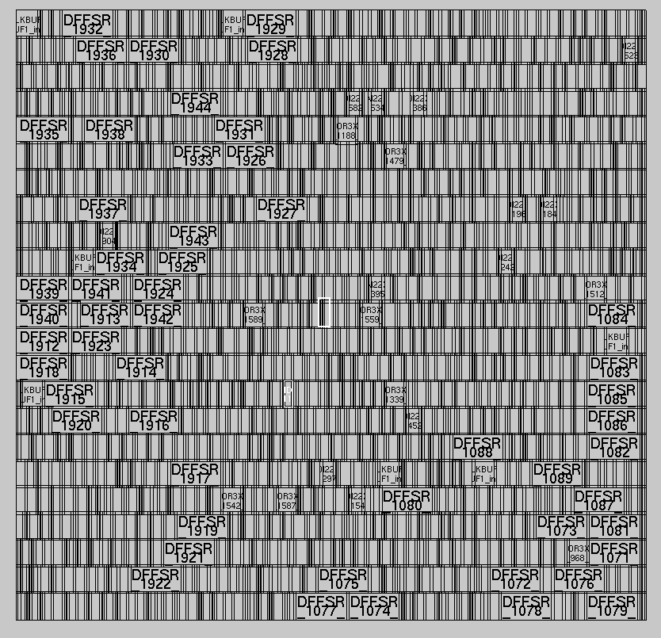
    
    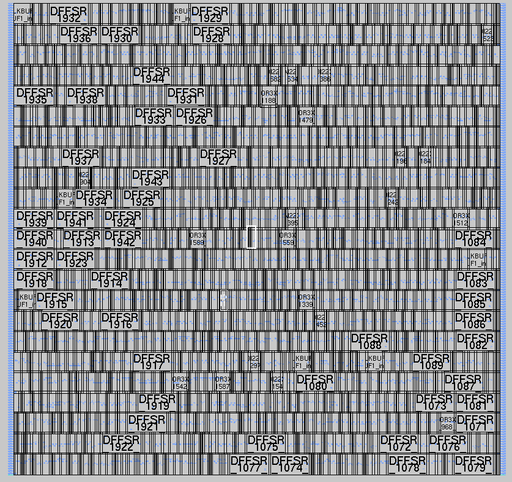
    
    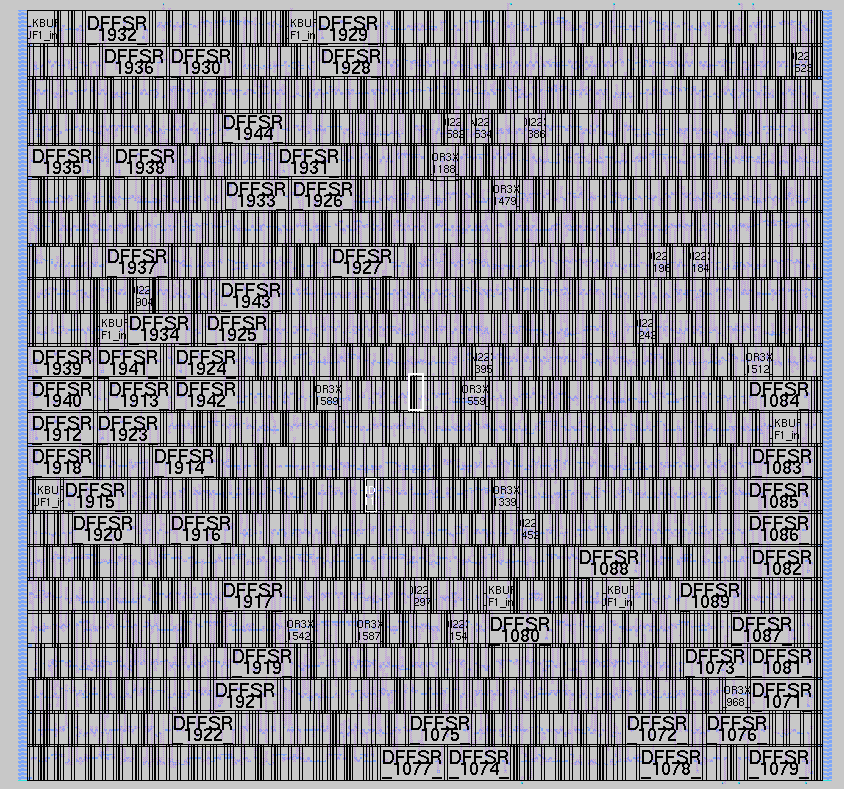
    
- 확대 (unexpand)
    
    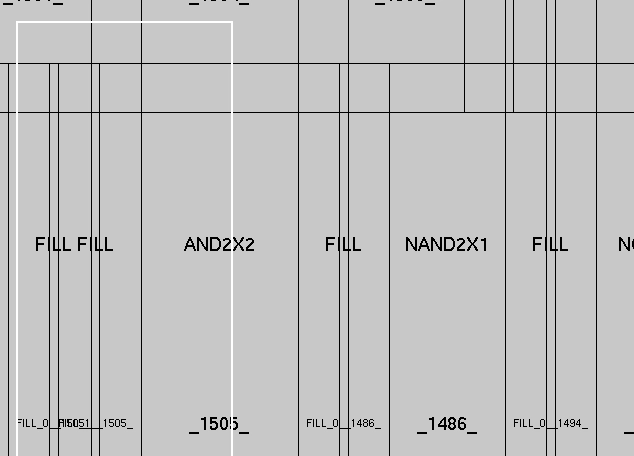
    
    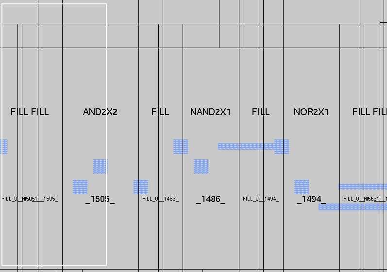
    
    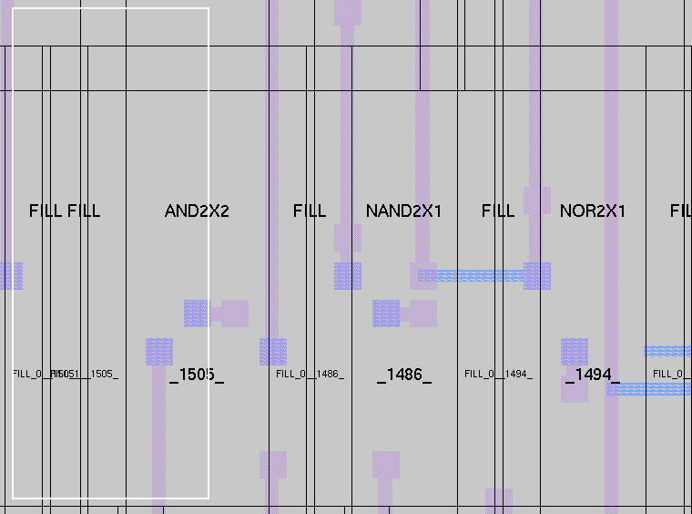
    
- expand 시, 모든 구조를 확인 가능
    
    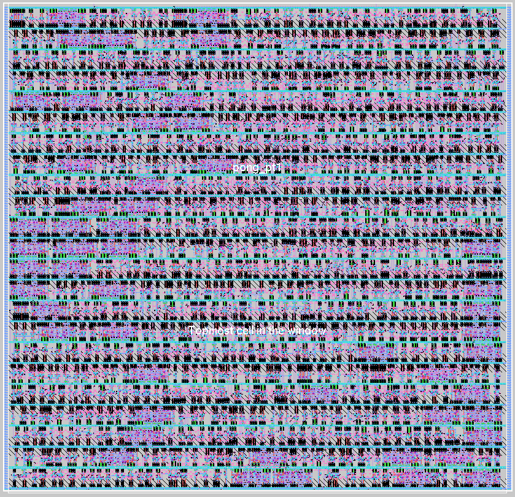
    
- 일부 Gate
    
    
    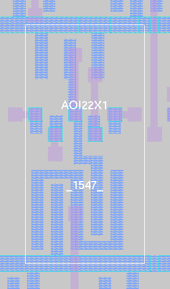
    
    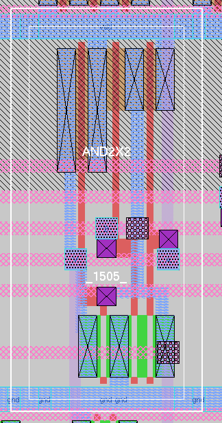
    
    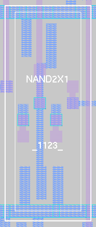
    
    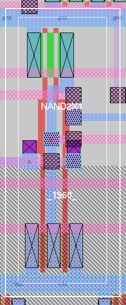
    

### Step 2. Error 확인

- 3가지를 검사
    1. stack   ← Stacked VIA 검사 (VIA 겹쳐쌓기 금지 규칙)
        - VIA Stack이란?
            
            칩엔 금속이 3층(metal1/2/3). 서로 다른 층을 연결하려면 VIA라는 수직 연결이 필요.
            
            ```c
            metal3 ─────────
                     │ via2 (m2contact) ← metal2↔metal3 연결
            metal2 ─────────
                     │ via1 (m1contact) ← metal1↔metal2 연결
            metal1 ─────────
            
            이때, Via Stack 이란?
            
               금지 (stacked)          허용 (staggered, 어긋나게)
               metal3 ──┐              metal3 ────┐
                  via2 ▓│                    via2 ▓│
               metal2 ──┤              metal2 ─┐  └──
                  via1 ▓│  ← 같은 자리    via1 ▓│  ← 옆으로 비킴
               metal1 ──┘              metal1 ─┘
               
            via1 바로 위에 via2를 겹쳐 쌓는 것이 스택, 
            ```
            
            - 이렇듯, Via Stack은 현재 금지, 이유는 아래와 같다.
                1. **표면 울퉁불퉁 (planarity)**: VIA를 겹치면 그 지점만 금속이 두껍게 쌓여 표면이 튀어나와, 위층 공정에서 문제.
                2. **오래된 공정일수록 취약**: 0.5µm(1990년대) 공정은 VIA 위에 또 VIA를 안정적으로 못 만듦. 접촉 불량·단선 위험.
                3. **수율 저하**: 스택 지점에서 결함이 잘 생겨 → 칩이 안 돌 확률↑.
                
                **최신 공정(수십 nm)은 스택 허용**하지만, **ETRI 0.5µm은 금지됨.**
                
    2. DRC     ← 물리 규칙 검사
        - DRC Check 검사 종목
            - Metal 최소 폭
            - Metal 사이의 최소 간격
            - Via 최소 크기
            - Metal이 via를 충분히 둘러싸는지
            - Active, Poly, Contact 사이의 간격
            - 서로 다른 well 사이의 간격
            - 최소 면적
            - density
            - antenna rule
            - stacked via 규칙
    3. LVS     ← Layout vs Schematic (레이아웃 = 회로도 일치 하는 가 여부 확인)
        - 대표적인 LVS 오류
            - **Short**: 연결되면 안 되는 두 net이 연결됨
            - **Open**: 연결돼야 하는 net이 끊어짐
            - **Missing device**: schematic의 소자가 layout에 없음
            - **Extra device**: layout에 불필요한 소자가 생김
            - **Parameter mismatch**: MOSFET의 W/L 또는 multiplier가 다름
            - **Pin mismatch**: 핀 이름이나 연결이 다름
- 검사 결과
    
    ```c
    stack:  check_via_stack.py pong_pt1 m2contact m3contact 6   # via 겹침 검사
    drc:    run_drc.sh pong_pt1                                 # 물리 규칙
    lvs:    run_lvs.sh pong_pt1                                 # 레이아웃 vs 회로도
            → extract_spice.sh (레이아웃에서 SPICE 추출)
            → netgen lvs (추출 SPICE ↔ 합성 SPICE 비교)
    ```
    
    | 검증 | 우리 | 정답지 | 상태 |
    | --- | --- | --- | --- |
    | **DRC** | Total errors **0** | 0 | ✅ 통과 |
    | **Stack** | **70개** stacked via | **0개** | ⚠️ 차이 |
    | **LVS** | **Netlists do not match** | Circuits match | ⚠️ 불일치 |
- LVS 및 Stack 수정
    - 원인 분석
    
    ```c
    Failed to remove stacked via at grid point 197 212
    // qrouter가 스택 제거를 시도했지만 일부 지점에서 실패한 것을 확인
    // 위 Error가 19건, 배선이 빡빡해(density 0.85) qrouter가 일부 지점에서 스택을 못 없앰
    ```
    
    - Density를 낮추기
        - **density 0.85 → 0.50**으로 낮추면 셀간 간격이 생겨, qrouter가 스택 없이 우회할 가능성이 높아짐.
        - 대신 코어의 크기가 증가함. 즉, 면적↔라우팅 트레이드오프 발생
        - density를 낮추었음도 여전히 Stack 문제 발생
    - LVS 재검사
        - 이전에는 잘못된 Script를 활용하여, Layout level에서 검사를 수행, 프로젝트의 정식 경로 ETRI050-level `qflow lvs` + `fix_net_name.sh` 를 활용하여 LVS 검사 통과
    - Stack 수정
        - 직접 손으로 수동 Stacked Via를 수정.
            
            ```c
            magic -T scmos -rcfile .magicrc pong_pt1.mag & //으로 젒속
            ```
            
        - 위치 확인
            
            ```c
            box 1280 2720 1281 2721      # Via Stack 확인
            findbox zoom                 # 그 지점으로 확대
            ```
            
        - 옮기기
            1. 겹친 지점에서 **좌클릭(왼아래) + 우클릭(오른위)**로 m3contact 크기만큼 박스
            2. `s` (select) → 그 via 선택
            3. **방향키** 또는 `move up 1` / `move right 1` 로 살짝 이동 (metal2 폭만큼)
            4. 이동으로 끊긴 틈을 metal2로 메움
                
                ```python
                box <끊긴 틈>
                paint metal2      # metal2로 칠해서 연결 유지
                save pong_pt1     # 저장
                ```
                
        - 이동 방법
            
            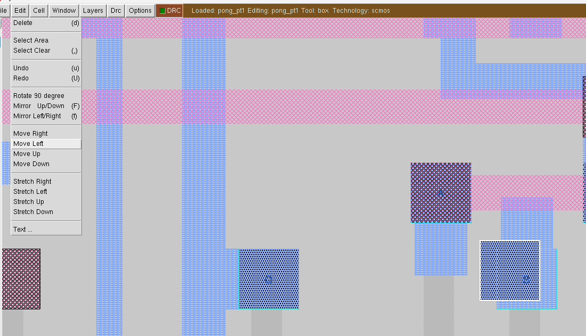
            
        - 색칠 방법
            1. 영역 선택 (s로 선택)
                
                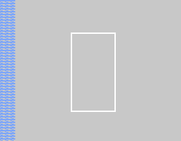
                
            2. paint metal2 입력
                
                
                
            3. metal 2 확인 및 이동. 그릴 시, 3um를 활용하기.
                
                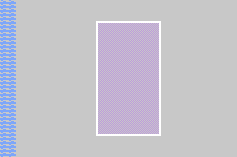
                

## 09. Chip-top

### Step 1. Chip-top 확인

- Pad의 Layer는 이미 존재, 이를 복사하여 불러옴. 이후, 앞서 제작한 GDS를 불러옴.
    
    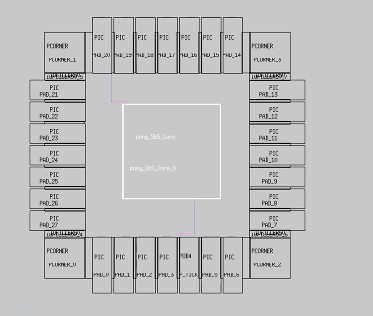
    
- pad와 연결할 pin들 확인 (Clk, y_pos 등 신호)
- 여기서는 Input, Output 포트 하나만 실제로 해봄.
- 위치 확인

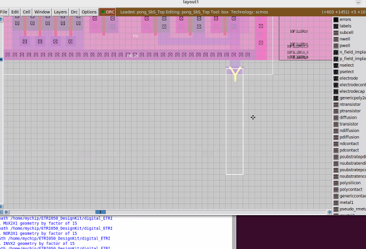

- 이후, metal2와 metal 3, Via를 활용하여 연결
    
    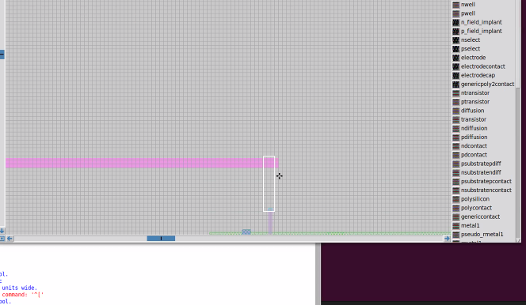
    
- 연결 시에는 Via 및 connect를 해주어야 함. 위 그림에서, 아래에 튀어나온 부분이 Clk.
- PIC는 Input pad, POB는 Output pad임. 따라서, 필요에 따라 해당 Pad를 확인해 주어야 함.
- 예를 들어, Output에 해당 하는 Port(P_tick)을 살펴보면, 아래와 같이 튀어 나와 있음
    
    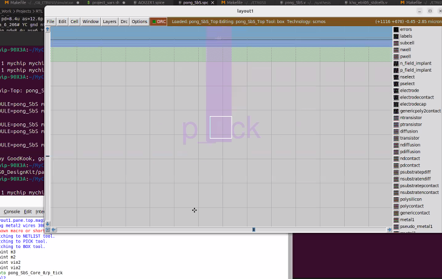
    
- 따라서, Metal을 연장해옴. 수직 방향 보라색. (metal3)
    
    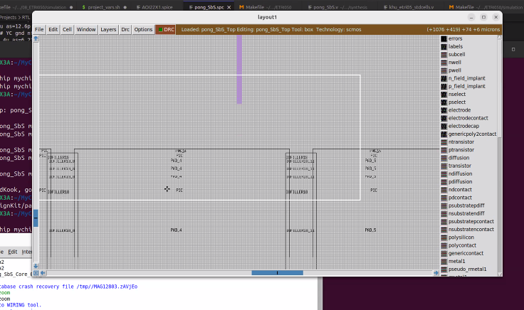
    
    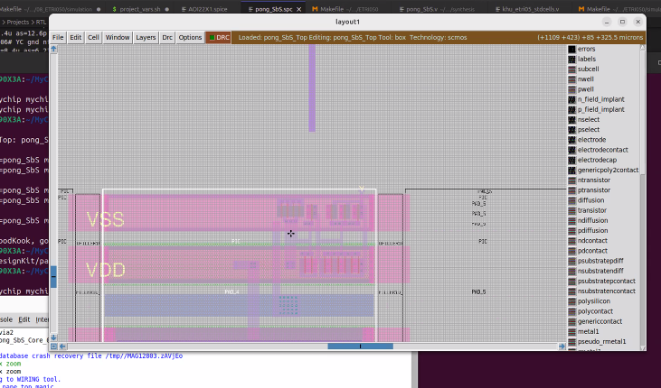
    
- Output 포트의 경우, POB에 연결해야하므로, PIC를 POB로 변경해야함.
- 해당 PIC의 pad no 확인 (no.4) 및 해당 pad를 mag에서, 아래와 같이 POB로 설정 및 p_trick으로 이름 변경
    
    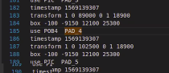
    
- 패드는 이름이 p_trick으로, 그리고 POB로 변경된 것을 확인 가능
    
    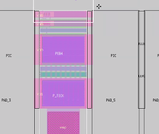
    
- 이때, 수직 방향은 metal2(보라) 수평 방향은 metal3(핑크)이므로 이에 맞춰 확장.
    
    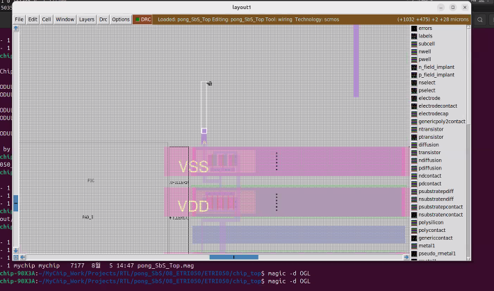
    
    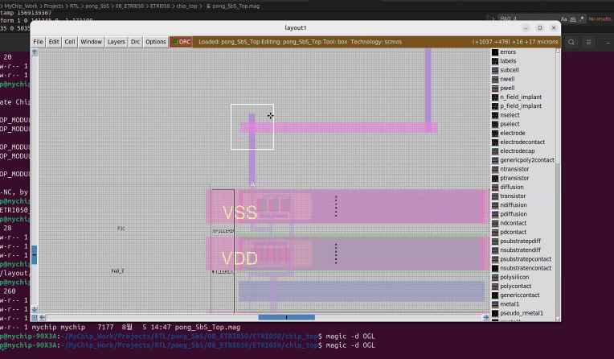
    
- 겹치는 곳은 via 제작.
    
    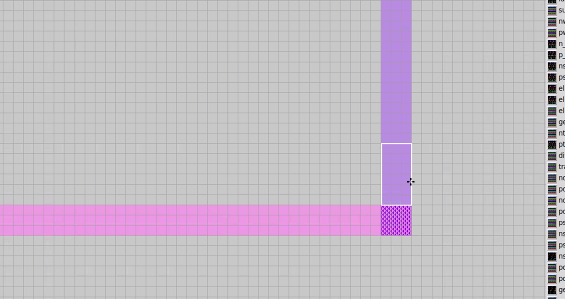
    
- 위와 같은 방식으로 배선을 수행
    
    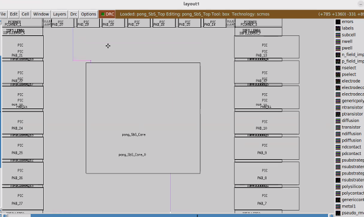
    
- 이후, 저장하고 나옴
    
    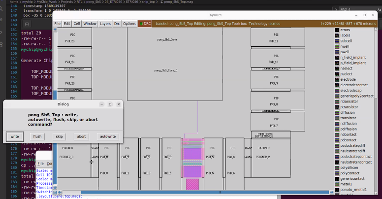
    

### Step 2. GDS 생성

- GDS 생성 또한, 미리 Script가 makefile로 제작되어 있음.
- Core의 좌표 확인
    
    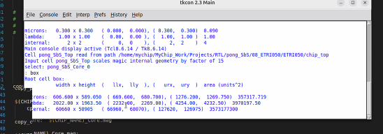
    
- makefile에서 해당 좌표 입력
    
    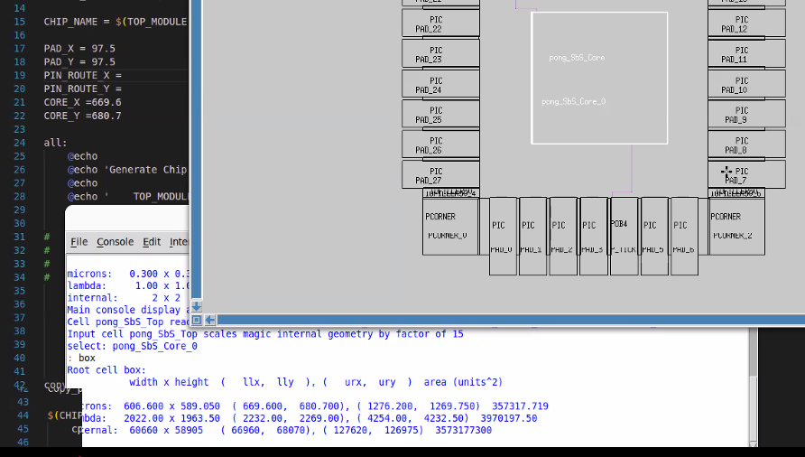
    
- 좌표 기입 완료
    
    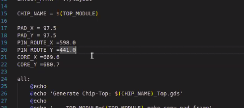
    
- 이후, Core와 Pad, routing은 분리해서 작업을 하며, 이후 GDS를 Generation 수행
    
    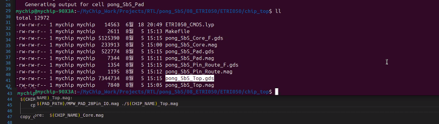
    
- 이후, GDS를 열어보면 아래와 같다.
    
    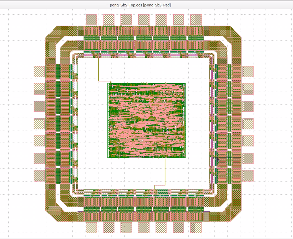
    
- 이때, 위 GDS의 pad는 공장에서 제공된 pad가 아니므로 이를 수정해야함
    
    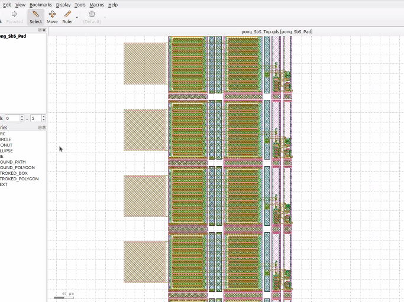
    
- 즉, 위 pad를 수정해야함. 현재는 가짜 Pad(실리콘 검증된 하드 매크로)임.
- 실제 Etri 공정에서 제공하는 pad(PDK에서 제공하는 하드 매크로로 변경해야함)는 아래와 같이 생겼음
    
    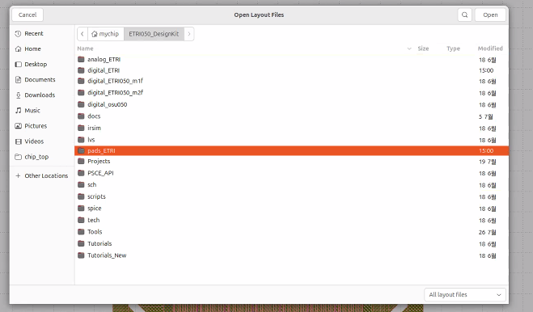
    
    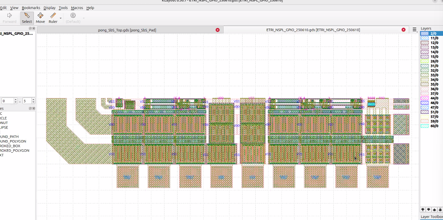
    
- 이후, Editting 메뉴를 On시킨 후, 재부팅. PIC pad를 복제해옴.
    
    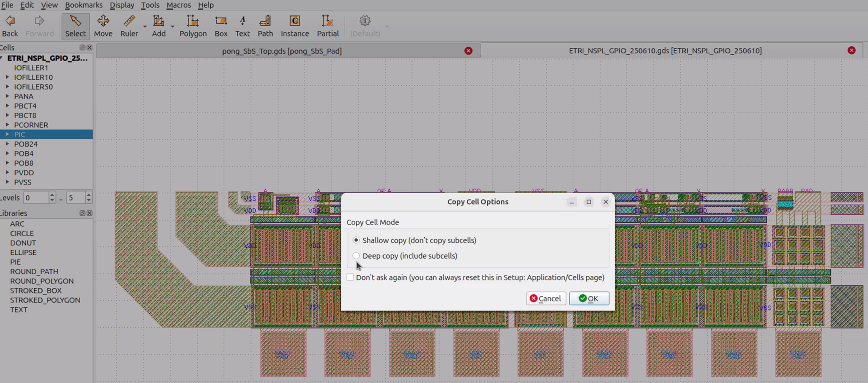
    
    - Deep Copy를 해와야 함.
- 이후, 우리 Cell에 붙여 넣어야 하며 repalce를 수행해야함.
    
    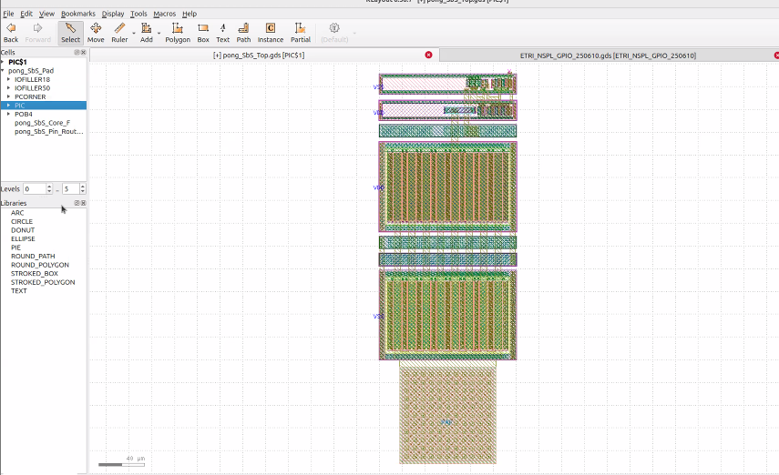
    
    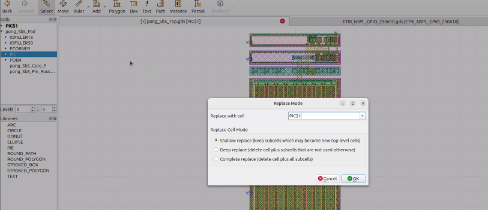
    
- 이후, Show as new top을 수행하면 아래와 같다.
    
    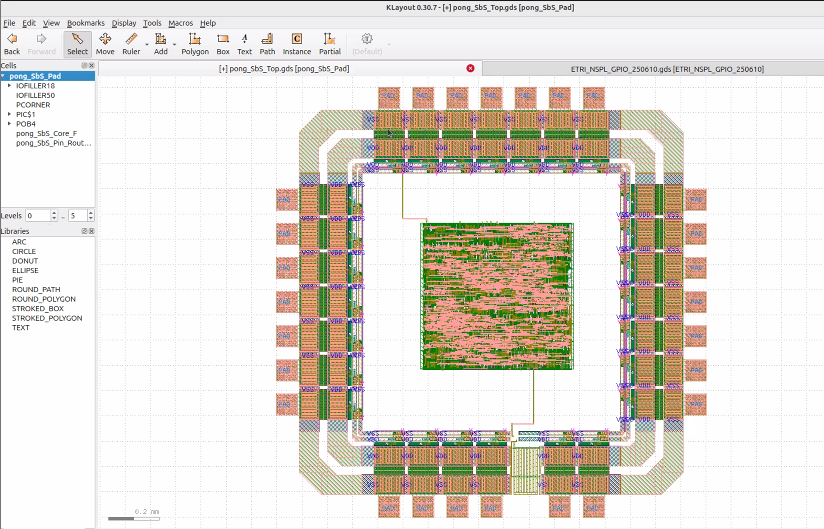
    
- 적용 결과는 아래와 같다.
    
    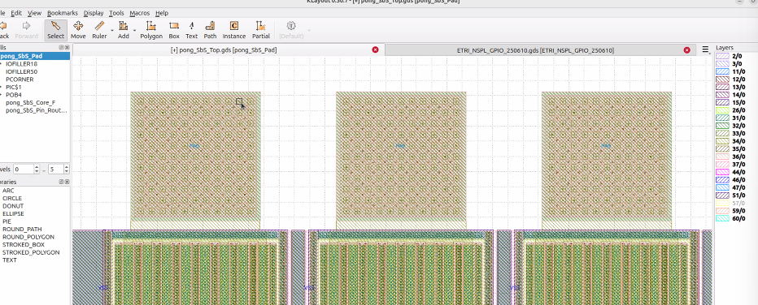
    
    - 자세히 보면 앞서 변경 전 pad와는 다름
- 이후, POB도 동일하게 수정.
    
    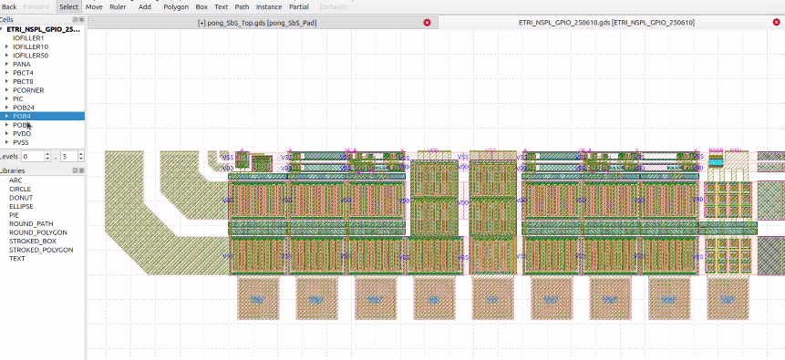
    
    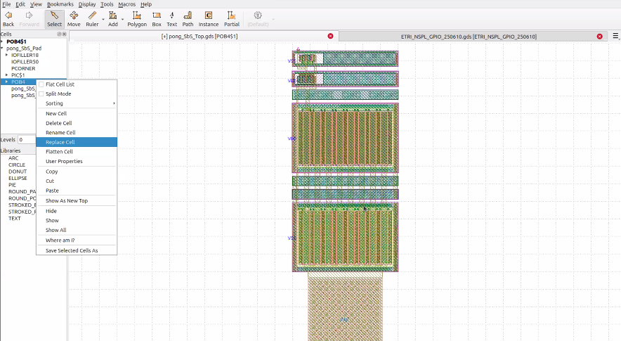
    
    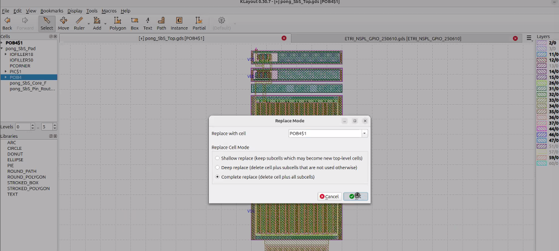
    
- 이후, Top Cell로 보면, POB도 수정이 된다.
    
    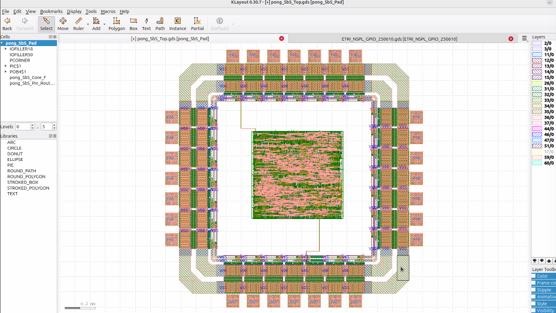
    
- 이후 Save를 하면 최종 GDS가 완성된다.
- 관련 내용은 (연구 노트 11(앞부분),12(뒷부분),22(종합본)에 존재함.)